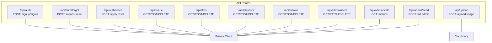
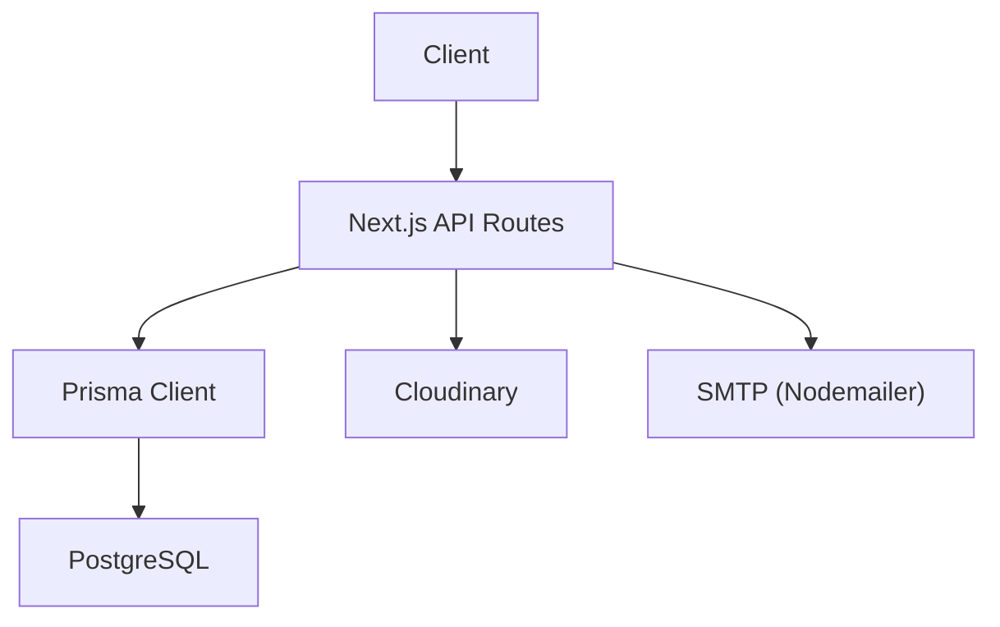
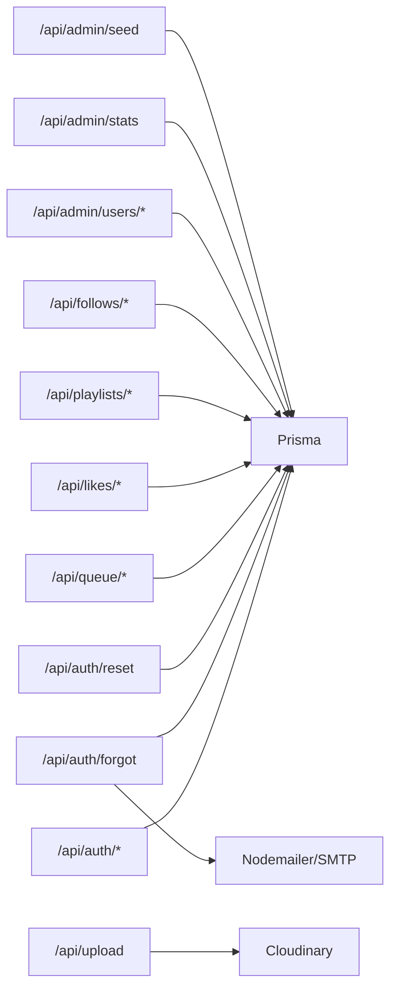

# API Reference

<cite>
**Referenced Files in This Document**
- [app/api/auth/route.ts](file://app/api/auth/route.ts)
- [app/api/auth/forgot/route.ts](file://app/api/auth/forgot/route.ts)
- [app/api/auth/reset/route.ts](file://app/api/auth/reset/route.ts)
- [app/api/queue/route.ts](file://app/api/queue/route.ts)
- [app/api/likes/route.ts](file://app/api/likes/route.ts)
- [app/api/playlists/route.ts](file://app/api/playlists/route.ts)
- [app/api/follows/route.ts](file://app/api/follows/route.ts)
- [app/api/admin/users/route.ts](file://app/api/admin/users/route.ts)
- [app/api/admin/stats/route.ts](file://app/api/admin/stats/route.ts)
- [app/api/admin/seed/route.ts](file://app/api/admin/seed/route.ts)
- [app/api/upload/route.ts](file://app/api/upload/route.ts)
- [prisma/schema.prisma](file://prisma/schema.prisma)
- [lib/api.ts](file://lib/api.ts)
- [hooks/useAuthGuard.ts](file://hooks/useAuthGuard.ts)
- [package.json](file://package.json)
</cite>

## Table of Contents
1. [Introduction](#introduction)
2. [Project Structure](#project-structure)
3. [Core Components](#core-components)
4. [Architecture Overview](#architecture-overview)
5. [Detailed Component Analysis](#detailed-component-analysis)
6. [Dependency Analysis](#dependency-analysis)
7. [Performance Considerations](#performance-considerations)
8. [Troubleshooting Guide](#troubleshooting-guide)
9. [Conclusion](#conclusion)
10. [Appendices](#appendices)

## Introduction
This document provides comprehensive API documentation for SonicStream’s backend. It covers authentication endpoints (signup, signin, password reset), queue management, like/favorite operations, playlist CRUD, follow/unfollow, and admin endpoints. For each endpoint, you will find HTTP methods, URL patterns, request/response schemas, authentication requirements, error handling, and practical usage notes. It also includes client integration guidelines, rate limiting considerations, error codes, debugging approaches, and migration notes.

## Project Structure
The backend is organized under Next.js App Router API routes grouped by feature:
- Authentication: /api/auth, /api/auth/forgot, /api/auth/reset
- User data: /api/queue, /api/likes, /api/playlists, /api/follows
- Admin: /api/admin/{users,stats,seed}
- Upload: /api/upload

**Diagram sources**
- [app/api/auth/route.ts:15-72](file://app/api/auth/route.ts#L15-L72)
- [app/api/auth/forgot/route.ts:5-67](file://app/api/auth/forgot/route.ts#L5-L67)
- [app/api/auth/reset/route.ts:13-47](file://app/api/auth/reset/route.ts#L13-L47)
- [app/api/queue/route.ts:4-85](file://app/api/queue/route.ts#L4-L85)
- [app/api/likes/route.ts:4-54](file://app/api/likes/route.ts#L4-L54)
- [app/api/playlists/route.ts:4-89](file://app/api/playlists/route.ts#L4-L89)
- [app/api/follows/route.ts:4-54](file://app/api/follows/route.ts#L4-L54)
- [app/api/upload/route.ts:4-19](file://app/api/upload/route.ts#L4-L19)
- [app/api/admin/users/route.ts:4-74](file://app/api/admin/users/route.ts#L4-L74)
- [app/api/admin/stats/route.ts:4-27](file://app/api/admin/stats/route.ts#L4-L27)
- [app/api/admin/seed/route.ts:13-39](file://app/api/admin/seed/route.ts#L13-L39)
- [prisma/schema.prisma:1-111](file://prisma/schema.prisma#L1-L111)

**Section sources**
- [app/api/auth/route.ts:15-72](file://app/api/auth/route.ts#L15-L72)
- [app/api/auth/forgot/route.ts:5-67](file://app/api/auth/forgot/route.ts#L5-L67)
- [app/api/auth/reset/route.ts:13-47](file://app/api/auth/reset/route.ts#L13-L47)
- [app/api/queue/route.ts:4-85](file://app/api/queue/route.ts#L4-L85)
- [app/api/likes/route.ts:4-54](file://app/api/likes/route.ts#L4-L54)
- [app/api/playlists/route.ts:4-89](file://app/api/playlists/route.ts#L4-L89)
- [app/api/follows/route.ts:4-54](file://app/api/follows/route.ts#L4-L54)
- [app/api/admin/users/route.ts:4-74](file://app/api/admin/users/route.ts#L4-L74)
- [app/api/admin/stats/route.ts:4-27](file://app/api/admin/stats/route.ts#L4-L27)
- [app/api/admin/seed/route.ts:13-39](file://app/api/admin/seed/route.ts#L13-L39)
- [app/api/upload/route.ts:4-19](file://app/api/upload/route.ts#L4-L19)
- [prisma/schema.prisma:1-111](file://prisma/schema.prisma#L1-L111)

## Core Components
- Authentication service: handles signup, signin, and password reset with token lifecycle.
- Data persistence: Prisma models for users, liked songs, playlists, playlist-song relations, queue items, followed artists, and password resets.
- Cloudinary integration: uploads avatars and other images.
- Admin dashboard endpoints: user listing, updates, deletions, statistics, and seeding.

Key data models and relationships:
- User: has likedSongs, playlists, queueItems, followedArtists, passwordResets.
- LikedSong: unique per user-song pair.
- Playlist: contains PlaylistSong entries with position ordering.
- QueueItem: per-user queue with numeric positions.
- FollowedArtist: unique per user-artist pair.
- PasswordReset: per-user token with expiry.

**Section sources**
- [prisma/schema.prisma:16-110](file://prisma/schema.prisma#L16-L110)

## Architecture Overview
The backend uses Next.js API routes with a Prisma client connecting to PostgreSQL. Authentication uses local hashed passwords and optional SMTP-based password reset emails. Cloudinary is used for image uploads.

**Diagram sources**
- [app/api/auth/route.ts:1-73](file://app/api/auth/route.ts#L1-L73)
- [app/api/auth/forgot/route.ts:28-60](file://app/api/auth/forgot/route.ts#L28-L60)
- [app/api/upload/route.ts:1-20](file://app/api/upload/route.ts#L1-L20)
- [prisma/schema.prisma:5-9](file://prisma/schema.prisma#L5-L9)

## Detailed Component Analysis

### Authentication Endpoints
- Base URL: /api/auth
- Methods:
  - POST /api/auth
    - Purpose: signup or signin
    - Request JSON:
      - action: "signup" | "signin"
      - email: string
      - password: string
      - name: string? (optional for signup)
      - avatar: string? (optional base64 image for signup)
    - Responses:
      - 200: { user: { id, email, name, avatarUrl, role } }
      - 400: missing fields
      - 401: invalid credentials (signin)
      - 409: email already registered (signup)
      - 500: internal error
    - Notes:
      - Password hashing uses SHA-256 with a fixed salt.
      - Avatar upload uses Cloudinary when provided during signup.
    - Example use cases:
      - New user registration with optional avatar.
      - Returning user login.
  - POST /api/auth/forgot
    - Purpose: request password reset
    - Request JSON: { email: string }
    - Responses:
      - 200: { message: "If that email exists, a reset link has been sent." }
      - 400: email required
      - 500: internal error
    - Notes:
      - Deletes previous reset tokens for the user, creates a new token expiring in 1 hour, attempts to send an email via SMTP, and returns success regardless of email delivery outcome.
  - POST /api/auth/reset
    - Purpose: apply password reset
    - Request JSON: { token: string, password: string }
    - Responses:
      - 200: { message: "Password reset successfully" }
      - 400: invalid/expired token or short password
      - 500: internal error
    - Notes:
      - Validates token existence and expiry, updates user password hash, deletes all reset tokens for the user.

Security considerations:
- Password hashing is not bcrypt; consider upgrading to bcrypt in production.
- Token lifetime is 1 hour; ensure clients handle expiration gracefully.
- Email delivery failures do not block success responses; implement retry or logging if needed.

**Section sources**
- [app/api/auth/route.ts:15-72](file://app/api/auth/route.ts#L15-L72)
- [app/api/auth/forgot/route.ts:5-67](file://app/api/auth/forgot/route.ts#L5-L67)
- [app/api/auth/reset/route.ts:13-47](file://app/api/auth/reset/route.ts#L13-L47)

### Queue Management API
- Base URL: /api/queue
- Methods:
  - GET /api/queue?userId=...
    - Purpose: retrieve queue items ordered by position
    - Query params:
      - userId: string (required)
    - Responses:
      - 200: { queue: [{ id, songId, songData, position }] }
      - 400: missing userId
  - POST /api/queue
    - Purpose: add or clear queue items
    - Request JSON:
      - action: "add" | "clear"
      - userId: string (required)
      - songId: string? (required for "add")
      - songData: object? (optional)
      - position: number? (optional)
    - Responses:
      - 200: { item } or { success: true }
      - 400: missing fields or invalid action
      - 500: failed
  - DELETE /api/queue
    - Purpose: remove a queue item
    - Request JSON:
      - id: string (alternative: provide userId + songId)
      - userId: string?
      - songId: string?
    - Responses:
      - 200: { success: true }
      - 400: missing id or userId+songId
      - 500: failed

Common use cases:
- Add a song to the end of the queue.
- Clear the entire queue for a user.
- Remove a specific queued item after playback.

**Section sources**
- [app/api/queue/route.ts:4-85](file://app/api/queue/route.ts#L4-L85)

### Like/Favorite Operations
- Base URL: /api/likes
- Methods:
  - GET /api/likes?userId=...
    - Purpose: list liked song IDs for a user
    - Query params:
      - userId: string (required)
    - Responses:
      - 200: { likes: [songId, ...] }
      - 400: missing userId
  - POST /api/likes
    - Purpose: like a song
    - Request JSON: { userId: string, songId: string }
    - Responses:
      - 200: { success: true } or { success: true, message: "Already liked" }
      - 400: missing fields
      - 500: failed
  - DELETE /api/likes
    - Purpose: unlike a song
    - Request JSON: { userId: string, songId: string }
    - Responses:
      - 200: { success: true }
      - 400: missing fields
      - 500: failed

Notes:
- Unique constraint prevents duplicate likes; P2002 is handled gracefully.

**Section sources**
- [app/api/likes/route.ts:4-54](file://app/api/likes/route.ts#L4-L54)

### Playlist CRUD Operations
- Base URL: /api/playlists
- Methods:
  - GET /api/playlists?userId=...
    - Purpose: list user playlists with songs ordered by position
    - Query params:
      - userId: string (required)
    - Responses:
      - 200: { playlists: [...] }
      - 400: missing userId
  - POST /api/playlists
    - Purpose: create, add song, or remove song from playlist
    - Request JSON:
      - action: "create" | "addSong" | "removeSong"
      - For "create": { userId: string, name: string, description?: string, coverUrl?: string }
      - For "addSong": { playlistId: string, songId: string }
      - For "removeSong": { playlistId: string, songId: string }
    - Responses:
      - 200: { playlist } or { success: true }
      - 400: missing fields or invalid action
      - 500: failed
  - DELETE /api/playlists
    - Purpose: delete a playlist
    - Request JSON: { playlistId: string }
    - Responses:
      - 200: { success: true }
      - 400: missing playlistId
      - 500: failed

Notes:
- Adding a song appends it at the end of the playlist based on current max position.
- Unique constraint prevents duplicate playlist-song entries; P2002 is handled gracefully.

**Section sources**
- [app/api/playlists/route.ts:4-89](file://app/api/playlists/route.ts#L4-L89)

### Follow/Unfollow Functionality
- Base URL: /api/follows
- Methods:
  - GET /api/follows?userId=...
    - Purpose: list followed artists for a user
    - Query params:
      - userId: string (required)
    - Responses:
      - 200: { follows: [...] }
      - 400: missing userId
  - POST /api/follows
    - Purpose: follow an artist
    - Request JSON: { userId: string, artistId: string, artistName?: string, artistImage?: string }
    - Responses:
      - 200: { follow: { ... } } or { success: true, message: "Already following" }
      - 400: missing fields
      - 500: failed
  - DELETE /api/follows
    - Purpose: unfollow an artist
    - Request JSON: { userId: string, artistId: string }
    - Responses:
      - 200: { success: true }
      - 400: missing fields
      - 500: failed

Notes:
- Unique constraint prevents duplicate follows; P2002 is handled gracefully.

**Section sources**
- [app/api/follows/route.ts:4-54](file://app/api/follows/route.ts#L4-L54)

### Admin Endpoints
- Base URL: /api/admin
- Users:
  - GET /api/admin/users?search=...
    - Purpose: list users with counts and optional text search
    - Query params:
      - search: string? (case-insensitive name or email)
    - Responses:
      - 200: { users: [{ id, email, name, avatarUrl, role, createdAt, stats: { likedSongs, playlists, followedArtists, queueItems } }] }
  - PATCH /api/admin/users
    - Purpose: update user role/name
    - Request JSON: { userId: string, data: { role?: string, name?: string } }
    - Responses:
      - 200: { user: { id, email, name, role } }
      - 400: missing userId
      - 500: failed
  - DELETE /api/admin/users
    - Purpose: delete a user
    - Request JSON: { userId: string }
    - Responses:
      - 200: { success: true }
      - 400: missing userId
      - 500: failed
- Stats:
  - GET /api/admin/stats
    - Purpose: aggregate metrics and recent users
    - Responses:
      - 200: { totalUsers, totalLikes, totalPlaylists, totalFollows, totalQueued, recentUsers[] }
- Seed:
  - POST /api/admin/seed
    - Purpose: initialize admin user if not exists
    - Responses:
      - 200: { message: "...", userId?: string }
      - 500: failed

**Section sources**
- [app/api/admin/users/route.ts:4-74](file://app/api/admin/users/route.ts#L4-L74)
- [app/api/admin/stats/route.ts:4-27](file://app/api/admin/stats/route.ts#L4-L27)
- [app/api/admin/seed/route.ts:13-39](file://app/api/admin/seed/route.ts#L13-L39)

### Upload Endpoint
- Base URL: /api/upload
- Method:
  - POST /api/upload
    - Purpose: upload base64 image to Cloudinary
    - Request JSON: { image: string, folder?: string }
    - Responses:
      - 200: { url: string }
      - 400: missing image
      - 500: upload failed

Notes:
- Default folder is "sonicstream/avatars".
- Requires Cloudinary configuration.

**Section sources**
- [app/api/upload/route.ts:4-19](file://app/api/upload/route.ts#L4-L19)

## Dependency Analysis
- API routes depend on Prisma for data access and Cloudinary/Nodemailer for external services.
- Frontend hooks integrate with player store to gate actions behind authentication.

**Diagram sources**
- [app/api/auth/route.ts:1-73](file://app/api/auth/route.ts#L1-L73)
- [app/api/auth/forgot/route.ts:28-60](file://app/api/auth/forgot/route.ts#L28-L60)
- [app/api/upload/route.ts:1-20](file://app/api/upload/route.ts#L1-L20)
- [prisma/schema.prisma:1-111](file://prisma/schema.prisma#L1-L111)

**Section sources**
- [prisma/schema.prisma:1-111](file://prisma/schema.prisma#L1-L111)
- [package.json:12-32](file://package.json#L12-L32)

## Performance Considerations
- Prefer pagination for listing large collections (e.g., playlists, follows) when extending endpoints.
- Indexes on frequently queried fields (userId, songId, artistId) are implied by Prisma relations; ensure database-level indexes align with query patterns.
- Batch operations (e.g., adding multiple songs to a playlist) can reduce round-trips but should be implemented carefully to maintain ordering and uniqueness.
- Queue operations are O(1) for append and O(n log n) for retrieval due to sorting; consider caching recent queues per user.

## Troubleshooting Guide
Common errors and resolutions:
- 400 Bad Request:
  - Missing required fields in request body (e.g., userId, songId, email, password).
  - Fix: validate payload before sending requests.
- 401 Unauthorized:
  - Invalid credentials during signin.
  - Fix: re-authenticate and confirm password hashing matches server expectations.
- 409 Conflict:
  - Duplicate signup (email already registered).
  - Fix: prompt user to sign in or use another email.
- 400 Bad Request (likes/follows):
  - Attempting duplicate like/follow triggers unique constraint; server responds with success and a message indicating duplication.
  - Fix: handle graceful duplicate detection on the client.
- 400 Bad Request (playlists):
  - Attempting duplicate playlist-song entry; server responds with success and a message indicating duplication.
  - Fix: check presence before adding.
- 400 Bad Request (queue):
  - Missing id or required combination (userId + songId) for deletion.
  - Fix: ensure correct identifier is provided.
- 500 Internal Server Error:
  - Generic failures during creation/update/delete.
  - Fix: inspect server logs and retry with corrected data.

Debugging tips:
- Enable logging for API routes and Prisma client to capture request bodies and errors.
- Verify environment variables for SMTP and Cloudinary are configured.
- Use database client to inspect records for unique constraints and foreign keys.

**Section sources**
- [app/api/auth/route.ts:21-29](file://app/api/auth/route.ts#L21-L29)
- [app/api/likes/route.ts:30-35](file://app/api/likes/route.ts#L30-L35)
- [app/api/follows/route.ts:30-35](file://app/api/follows/route.ts#L30-L35)
- [app/api/playlists/route.ts:68-73](file://app/api/playlists/route.ts#L68-L73)
- [app/api/queue/route.ts:71-79](file://app/api/queue/route.ts#L71-L79)

## Conclusion
SonicStream’s backend exposes a clear set of RESTful API endpoints covering authentication, user data management, and administrative tasks. The design leverages Prisma for robust data modeling and integrates Cloudinary and SMTP for media and notifications. Clients should validate inputs, handle unique constraint messages, and prepare for token expiration. For production readiness, consider upgrading password hashing, implementing rate limiting, and adding JWT-based sessions.

## Appendices

### Authentication Flow and Session Management
- Authentication flow:
  - Signup: POST /api/auth with action="signup" and optional avatar.
  - Signin: POST /api/auth with action="signin".
  - Password reset: POST /api/auth/forgot to request a reset link, then POST /api/auth/reset to apply the new password.
- Session management:
  - Current implementation does not use cookies or JWT; user identity is inferred from frontend store and gated by a client-side hook.
  - Recommended enhancement: adopt signed cookies or JWT for scalable session handling across browser tabs and SSR contexts.

**Section sources**
- [hooks/useAuthGuard.ts:6-28](file://hooks/useAuthGuard.ts#L6-L28)
- [app/api/auth/route.ts:15-72](file://app/api/auth/route.ts#L15-L72)
- [app/api/auth/forgot/route.ts:5-67](file://app/api/auth/forgot/route.ts#L5-L67)
- [app/api/auth/reset/route.ts:13-47](file://app/api/auth/reset/route.ts#L13-L47)

### Rate Limiting and Security Considerations
- Rate limiting:
  - Not implemented at the API level; consider adding middleware to throttle authentication attempts and sensitive operations.
- Security:
  - Password hashing is not bcrypt; upgrade to bcrypt for stronger protection.
  - Validate and sanitize all inputs; enforce minimum password lengths.
  - Use HTTPS in production and secure environment variables for SMTP and Cloudinary.

**Section sources**
- [app/api/auth/route.ts:6-13](file://app/api/auth/route.ts#L6-L13)
- [app/api/auth/reset/route.ts:20-22](file://app/api/auth/reset/route.ts#L20-L22)

### Client Implementation Guidelines
- Use HTTPS endpoints and handle error responses consistently.
- For protected actions, wrap operations with an auth guard similar to the provided hook to prompt login when needed.
- For image uploads, send base64-encoded images and handle returned URLs for avatars and covers.
- Respect server messages for duplicates (already liked, already following, already in playlist).

**Section sources**
- [hooks/useAuthGuard.ts:6-28](file://hooks/useAuthGuard.ts#L6-L28)
- [app/api/upload/route.ts:4-19](file://app/api/upload/route.ts#L4-L19)

### API Change Migration and Backwards Compatibility
- If changing password hashing to bcrypt, update both hashing and verification logic in authentication routes and seed logic.
- If introducing JWT, deprecate cookie-less auth gradually and support both modes during transition.
- Maintain stable query parameters and response shapes for GET endpoints to preserve client compatibility.

[No sources needed since this section provides general guidance]