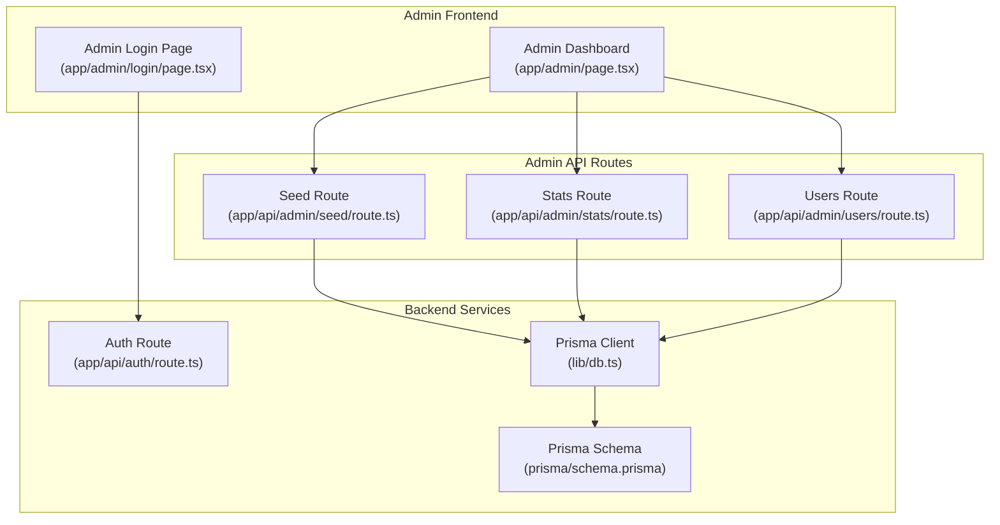
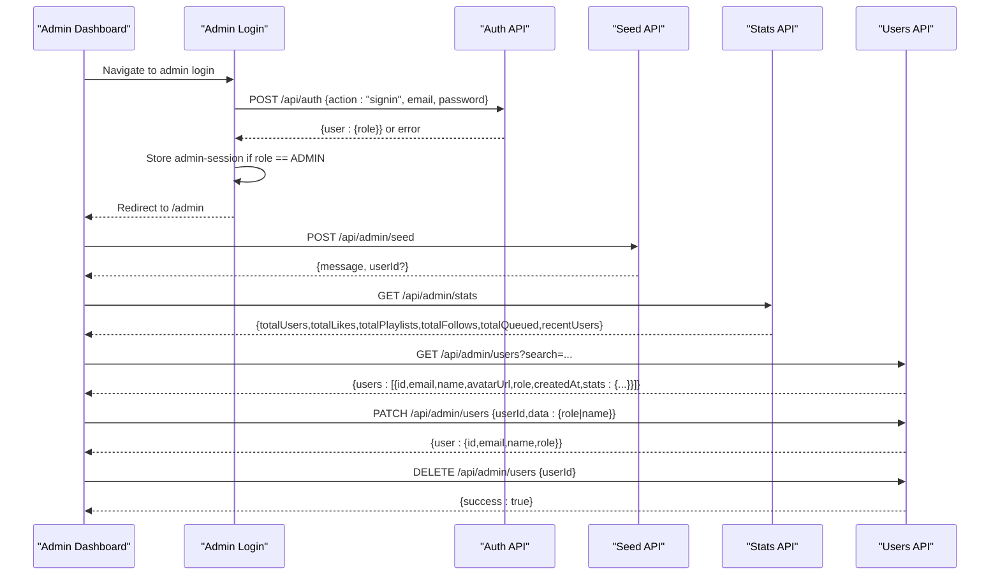
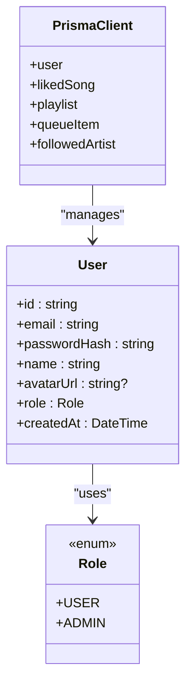
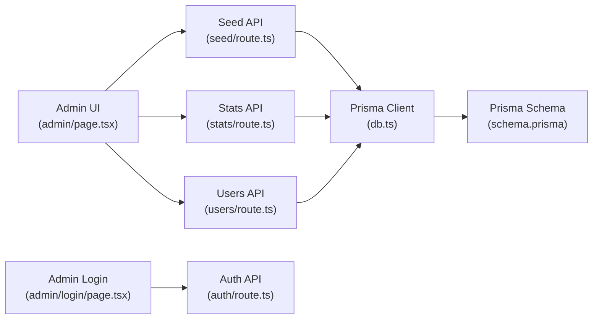

# Admin APIs

<cite>
**Referenced Files in This Document**
- [seed/route.ts](file://app/api/admin/seed/route.ts)
- [stats/route.ts](file://app/api/admin/stats/route.ts)
- [users/route.ts](file://app/api/admin/users/route.ts)
- [db.ts](file://lib/db.ts)
- [schema.prisma](file://prisma/schema.prisma)
- [auth/route.ts](file://app/api/auth/route.ts)
- [admin/page.tsx](file://app/admin/page.tsx)
- [admin/login/page.tsx](file://app/admin/login/page.tsx)
- [package.json](file://package.json)
</cite>

## Table of Contents
1. [Introduction](#introduction)
2. [Project Structure](#project-structure)
3. [Core Components](#core-components)
4. [Architecture Overview](#architecture-overview)
5. [Detailed Component Analysis](#detailed-component-analysis)
6. [Dependency Analysis](#dependency-analysis)
7. [Performance Considerations](#performance-considerations)
8. [Troubleshooting Guide](#troubleshooting-guide)
9. [Conclusion](#conclusion)
10. [Appendices](#appendices)

## Introduction
This document provides comprehensive API documentation for SonicStream’s administrative endpoints. It covers:
- Seed data endpoint for initializing the database with a default admin user
- Statistics endpoint for system metrics and analytics
- User management endpoint for listing, updating, and deleting users

It also documents authentication requirements for admin-only access, request/response schemas, data validation rules, security considerations, and integration guidelines for admin dashboards. Rate limiting, audit logging, and administrative access control patterns are addressed as recommended practices.

## Project Structure
The admin APIs are implemented as Next.js App Router API routes under app/api/admin/. They rely on Prisma for database operations and NextResponse for HTTP responses. The admin dashboard frontend integrates with these endpoints to provide operational workflows.

**Diagram sources**
- [seed/route.ts:1-40](file://app/api/admin/seed/route.ts#L1-L40)
- [stats/route.ts:1-28](file://app/api/admin/stats/route.ts#L1-L28)
- [users/route.ts:1-75](file://app/api/admin/users/route.ts#L1-L75)
- [db.ts:1-10](file://lib/db.ts#L1-L10)
- [schema.prisma:1-111](file://prisma/schema.prisma#L1-L111)
- [auth/route.ts:1-73](file://app/api/auth/route.ts#L1-L73)
- [admin/page.tsx:1-212](file://app/admin/page.tsx#L1-L212)
- [admin/login/page.tsx:1-54](file://app/admin/login/page.tsx#L1-L54)

**Section sources**
- [seed/route.ts:1-40](file://app/api/admin/seed/route.ts#L1-L40)
- [stats/route.ts:1-28](file://app/api/admin/stats/route.ts#L1-L28)
- [users/route.ts:1-75](file://app/api/admin/users/route.ts#L1-L75)
- [db.ts:1-10](file://lib/db.ts#L1-L10)
- [schema.prisma:1-111](file://prisma/schema.prisma#L1-L111)
- [auth/route.ts:1-73](file://app/api/auth/route.ts#L1-L73)
- [admin/page.tsx:1-212](file://app/admin/page.tsx#L1-L212)
- [admin/login/page.tsx:1-54](file://app/admin/login/page.tsx#L1-L54)

## Core Components
- Seed Endpoint: Initializes or promotes a default admin user with a fixed email and password hash.
- Stats Endpoint: Aggregates system metrics and returns recent users.
- Users Endpoint: Lists users with counts, supports filtering, role/name updates, and deletion.

**Section sources**
- [seed/route.ts:13-39](file://app/api/admin/seed/route.ts#L13-L39)
- [stats/route.ts:4-27](file://app/api/admin/stats/route.ts#L4-L27)
- [users/route.ts:4-74](file://app/api/admin/users/route.ts#L4-L74)

## Architecture Overview
The admin APIs are stateless and rely on Prisma for data access. Authentication is enforced client-side via the admin login flow and stored in local storage. The dashboard orchestrates requests to the admin endpoints.

**Diagram sources**
- [admin/login/page.tsx:15-38](file://app/admin/login/page.tsx#L15-L38)
- [auth/route.ts:51-65](file://app/api/auth/route.ts#L51-L65)
- [seed/route.ts:14-39](file://app/api/admin/seed/route.ts#L14-L39)
- [stats/route.ts:5-27](file://app/api/admin/stats/route.ts#L5-L27)
- [users/route.ts:4-74](file://app/api/admin/users/route.ts#L4-L74)
- [admin/page.tsx:33-78](file://app/admin/page.tsx#L33-L78)

## Detailed Component Analysis

### Seed Endpoint: POST /api/admin/seed
Purpose:
- Creates a default admin user if none exists, or updates an existing user’s role to ADMIN.

Behavior:
- Hashes a fixed plaintext password using a deterministic SHA-256-based scheme with a salt.
- Uses Prisma to upsert the admin user record with role ADMIN.
- Returns a success message and optionally the new user ID.

Security and Validation:
- Password hashing is not cryptographically strong; consider migrating to a proper password hashing library in production.
- No built-in rate limiting; apply rate limits at the platform level.

Response Schemas:
- Success: { message: string, userId?: string }
- Failure: { error: string }

Operational Notes:
- Idempotent: Running multiple times will not create duplicates but will ensure ADMIN role.
- Useful for CI/CD bootstrap and development environments.

**Section sources**
- [seed/route.ts:13-39](file://app/api/admin/seed/route.ts#L13-L39)
- [db.ts:1-10](file://lib/db.ts#L1-L10)
- [schema.prisma:16-32](file://prisma/schema.prisma#L16-L32)

### Stats Endpoint: GET /api/admin/stats
Purpose:
- Provides system-wide metrics and a small sample of recent users.

Metrics:
- totalUsers: Count of all users
- totalLikes: Total liked songs
- totalPlaylists: Total playlists
- totalFollows: Total followed artists
- totalQueued: Total queue items
- recentUsers: Top 5 most recent users with id, name, email, createdAt, role

Response Schema:
- {
  totalUsers: number,
  totalLikes: number,
  totalPlaylists: number,
  totalFollows: number,
  totalQueued: number,
  recentUsers: Array<{
    id: string,
    name: string,
    email: string,
    createdAt: string,
    role: string
  }>
}

Notes:
- Uses concurrent queries to minimize latency.
- Recent users are truncated to reduce payload size.

**Section sources**
- [stats/route.ts:4-27](file://app/api/admin/stats/route.ts#L4-L27)
- [db.ts:1-10](file://lib/db.ts#L1-L10)
- [schema.prisma:16-98](file://prisma/schema.prisma#L16-L98)

### Users Endpoint: GET/PATCH/DELETE /api/admin/users
Purpose:
- GET: List users with aggregated stats and optional search.
- PATCH: Update user role and/or name.
- DELETE: Remove a user by ID.

GET /api/admin/users
- Query Parameters:
  - search: Optional substring to match against name or email (case-insensitive)
- Response: { users: Array<UserWithStats> }

UserWithStats Schema:
- {
  id: string,
  email: string,
  name: string,
  avatarUrl?: string,
  role: string,
  createdAt: string,
  stats: {
    likedSongs: number,
    playlists: number,
    followedArtists: number,
    queueItems: number
  }
}

PATCH /api/admin/users
- Request Body: { userId: string, data: { role?: string, name?: string } }
- Response: { user: { id: string, email: string, name: string, role: string } }
- Validation: Requires userId; updates only provided fields

DELETE /api/admin/users
- Request Body: { userId: string }
- Response: { success: true }
- Validation: Requires userId

Validation Rules:
- All endpoints return 400 on missing required fields.
- DELETE/PATCH return 500 on internal failures.

**Section sources**
- [users/route.ts:4-74](file://app/api/admin/users/route.ts#L4-L74)
- [db.ts:1-10](file://lib/db.ts#L1-L10)
- [schema.prisma:16-98](file://prisma/schema.prisma#L16-L98)

## Architecture Overview

**Diagram sources**
- [db.ts:1-10](file://lib/db.ts#L1-L10)
- [schema.prisma:11-32](file://prisma/schema.prisma#L11-L32)

## Detailed Component Analysis

### Authentication and Authorization
- Admin login flow:
  - Client posts credentials to /api/auth with action "signin".
  - Backend validates credentials and returns user with role.
  - Frontend checks role equals ADMIN and stores session in localStorage.
- Admin dashboard enforces role checks on mount and route transitions.
- No server-side middleware currently enforces admin-only access for the admin endpoints; protection relies on client-side checks and role validation during login.

Recommendations:
- Enforce role checks server-side for all admin endpoints.
- Implement session/token verification and refresh mechanisms.
- Add rate limiting and audit logging for sensitive actions.

**Section sources**
- [auth/route.ts:51-65](file://app/api/auth/route.ts#L51-L65)
- [admin/login/page.tsx:26-29](file://app/admin/login/page.tsx#L26-L29)
- [admin/page.tsx:25-31](file://app/admin/page.tsx#L25-L31)

### Data Validation and Error Handling
- Seed:
  - On duplicate admin email, updates role to ADMIN.
  - Catches errors and returns 500 with error message.
- Stats:
  - Uses concurrent queries; response shape validated by caller.
- Users:
  - GET: Optional search parameter; includes counts via Prisma relations.
  - PATCH: Validates presence of userId; updates only provided fields.
  - DELETE: Validates presence of userId; deletes user.

**Section sources**
- [seed/route.ts:17-22](file://app/api/admin/seed/route.ts#L17-L22)
- [stats/route.ts:6-17](file://app/api/admin/stats/route.ts#L6-L17)
- [users/route.ts:42-51](file://app/api/admin/users/route.ts#L42-L51)
- [users/route.ts:55-73](file://app/api/admin/users/route.ts#L55-L73)

### Security Considerations
- Password hashing:
  - Current implementation uses a deterministic SHA-256 with a salt; not suitable for production.
  - Recommendation: Migrate to a robust password hashing scheme (e.g., bcrypt) and secure secret management.
- Admin session storage:
  - Stored in localStorage; consider HttpOnly cookies and CSRF protections.
- Endpoint protection:
  - No server-side admin guard is present; add middleware to enforce ADMIN role.
- Audit logging:
  - Not implemented; add structured logs for admin actions (seed, user updates/deletes).

**Section sources**
- [seed/route.ts:4-11](file://app/api/admin/seed/route.ts#L4-L11)
- [auth/route.ts:6-13](file://app/api/auth/route.ts#L6-L13)
- [admin/page.tsx:25-31](file://app/admin/page.tsx#L25-L31)

### Administrative Workflows and Integration Guidelines
- Initialize admin:
  - Call POST /api/admin/seed to create or promote admin.
  - Use returned message and optional userId for feedback.
- Monitor system:
  - Poll GET /api/admin/stats for KPIs and recent users.
  - Display cards for total users, likes, playlists, follows, and queued items.
- Manage users:
  - GET /api/admin/users with optional search to filter by name/email.
  - Use PATCH to toggle roles or update names; use DELETE to remove users.
  - The dashboard demonstrates search, expandable rows, and mutation buttons.

Integration Tips:
- Use React Query or SWR to cache and invalidate stats and user lists.
- Debounce search queries to reduce backend load.
- Confirm destructive actions (user deletion) before invoking DELETE.

**Section sources**
- [admin/page.tsx:33-78](file://app/admin/page.tsx#L33-L78)
- [users/route.ts:4-39](file://app/api/admin/users/route.ts#L4-L39)

## Dependency Analysis

**Diagram sources**
- [seed/route.ts:1-40](file://app/api/admin/seed/route.ts#L1-L40)
- [stats/route.ts:1-28](file://app/api/admin/stats/route.ts#L1-L28)
- [users/route.ts:1-75](file://app/api/admin/users/route.ts#L1-L75)
- [db.ts:1-10](file://lib/db.ts#L1-L10)
- [schema.prisma:1-111](file://prisma/schema.prisma#L1-L111)
- [admin/page.tsx:1-212](file://app/admin/page.tsx#L1-L212)
- [admin/login/page.tsx:1-54](file://app/admin/login/page.tsx#L1-L54)
- [auth/route.ts:1-73](file://app/api/auth/route.ts#L1-L73)

**Section sources**
- [seed/route.ts:1-40](file://app/api/admin/seed/route.ts#L1-L40)
- [stats/route.ts:1-28](file://app/api/admin/stats/route.ts#L1-L28)
- [users/route.ts:1-75](file://app/api/admin/users/route.ts#L1-L75)
- [db.ts:1-10](file://lib/db.ts#L1-L10)
- [schema.prisma:1-111](file://prisma/schema.prisma#L1-L111)
- [admin/page.tsx:1-212](file://app/admin/page.tsx#L1-L212)
- [admin/login/page.tsx:1-54](file://app/admin/login/page.tsx#L1-L54)
- [auth/route.ts:1-73](file://app/api/auth/route.ts#L1-L73)

## Performance Considerations
- Concurrent Metrics Queries: The stats endpoint uses Promise.all to fetch multiple counts concurrently, reducing round trips.
- Pagination and Filtering: The users endpoint supports search and ordering; consider adding pagination for large datasets.
- Caching: Use caching strategies for stats and user listings to reduce database load.
- CDN and Edge: Place rate limiting and caching at the edge for public admin endpoints.

[No sources needed since this section provides general guidance]

## Troubleshooting Guide
Common Issues and Resolutions:
- Admin login fails with “Access denied”:
  - Ensure the user role is ADMIN after login; the UI enforces this.
- Seed endpoint returns “Failed to seed admin”:
  - Check database connectivity and Prisma client initialization.
- Stats endpoint returns empty arrays:
  - Verify database records exist for users, liked songs, playlists, queue items, and followed artists.
- Users endpoint returns 400:
  - Ensure request bodies include userId for PATCH/DELETE and provide valid fields.
- Users endpoint returns 500:
  - Inspect server logs for Prisma errors; confirm user exists before update/delete.

**Section sources**
- [admin/login/page.tsx:26-29](file://app/admin/login/page.tsx#L26-L29)
- [seed/route.ts:35-38](file://app/api/admin/seed/route.ts#L35-L38)
- [stats/route.ts:5-27](file://app/api/admin/stats/route.ts#L5-L27)
- [users/route.ts:44-51](file://app/api/admin/users/route.ts#L44-L51)
- [users/route.ts:57-73](file://app/api/admin/users/route.ts#L57-L73)

## Conclusion
The admin APIs provide essential bootstrap, monitoring, and user management capabilities. While functional, they require enhancements for security and resilience: enforce server-side admin guards, adopt robust password hashing, implement rate limiting and audit logging, and strengthen session management. The included dashboard demonstrates practical integration patterns for building admin experiences.

[No sources needed since this section summarizes without analyzing specific files]

## Appendices

### API Reference Summary

- POST /api/admin/seed
  - Purpose: Initialize or promote admin user
  - Auth: None (client-side login required)
  - Response: { message: string, userId?: string } or { error: string }

- GET /api/admin/stats
  - Purpose: System metrics and recent users
  - Auth: None (client-side login required)
  - Response: { totalUsers, totalLikes, totalPlaylists, totalFollows, totalQueued, recentUsers[] }

- GET /api/admin/users
  - Purpose: List users with stats and optional search
  - Auth: None (client-side login required)
  - Query: search (optional)
  - Response: { users: UserWithStats[] }

- PATCH /api/admin/users
  - Purpose: Update user role/name
  - Auth: None (client-side login required)
  - Request: { userId: string, data: { role?: string, name?: string } }
  - Response: { user: { id, email, name, role } }

- DELETE /api/admin/users
  - Purpose: Delete a user
  - Auth: None (client-side login required)
  - Request: { userId: string }
  - Response: { success: true }

Recommended Enhancements:
- Server-side admin guards
- Robust password hashing
- Rate limiting and audit logging
- Session security (HttpOnly cookies)
- Structured error responses and validation

**Section sources**
- [seed/route.ts:13-39](file://app/api/admin/seed/route.ts#L13-L39)
- [stats/route.ts:4-27](file://app/api/admin/stats/route.ts#L4-L27)
- [users/route.ts:4-74](file://app/api/admin/users/route.ts#L4-L74)
- [admin/page.tsx:33-78](file://app/admin/page.tsx#L33-L78)