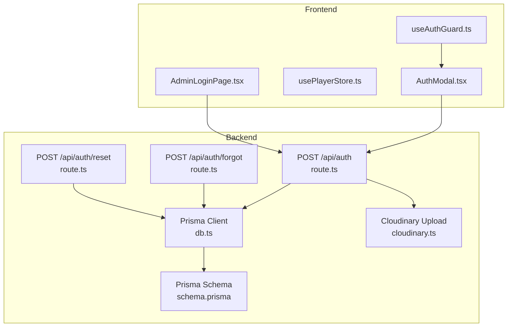
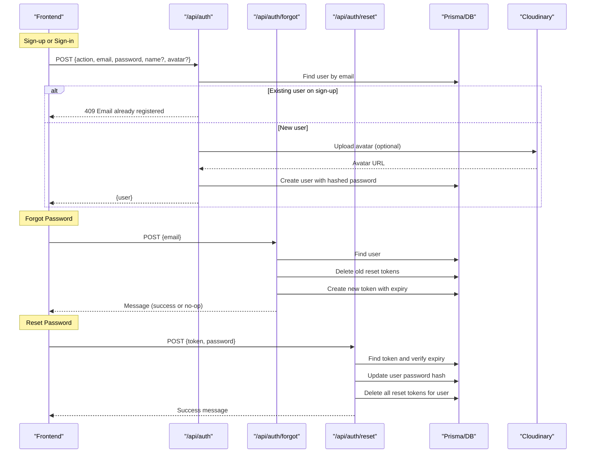
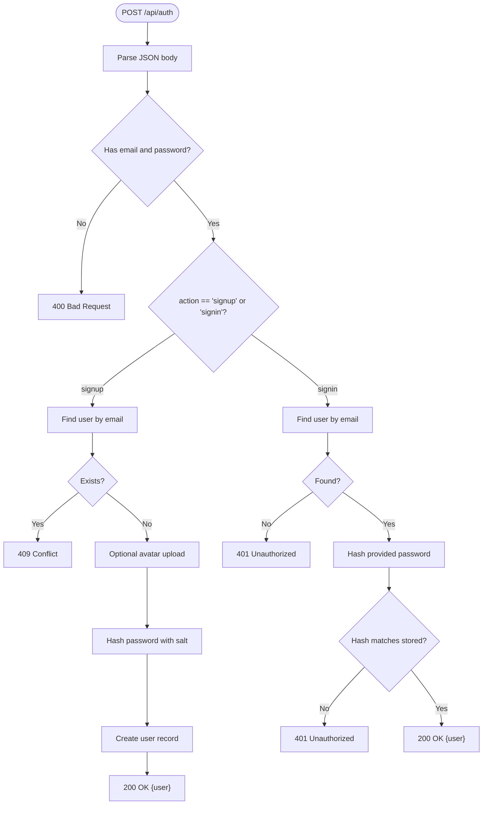
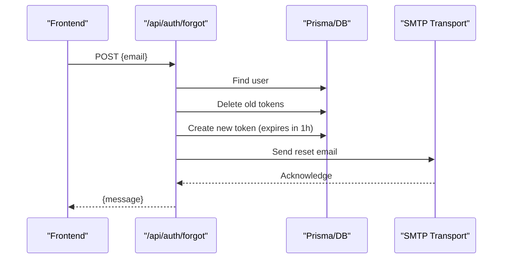
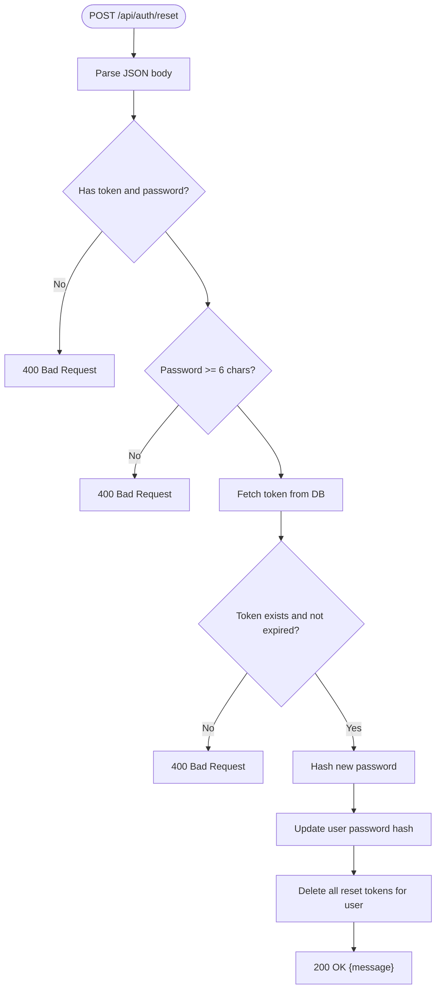
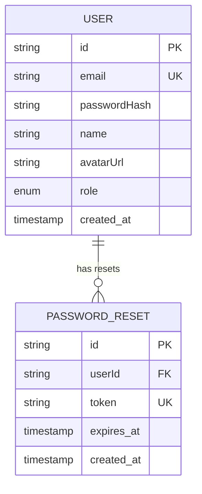
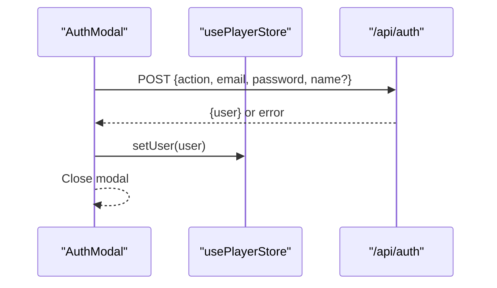
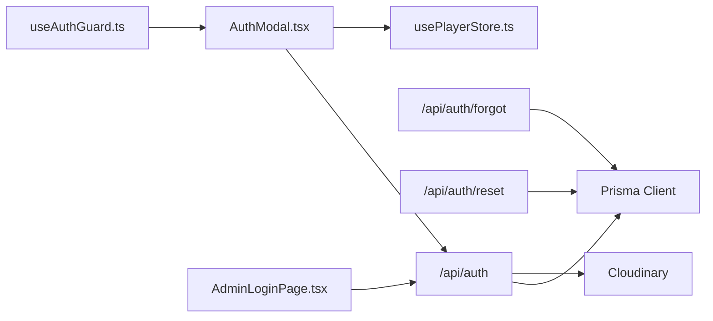

# Authentication APIs

<cite>
**Referenced Files in This Document**
- [route.ts](file://app/api/auth/route.ts)
- [route.ts](file://app/api/auth/forgot/route.ts)
- [route.ts](file://app/api/auth/reset/route.ts)
- [db.ts](file://lib/db.ts)
- [cloudinary.ts](file://lib/cloudinary.ts)
- [schema.prisma](file://prisma/schema.prisma)
- [AuthModal.tsx](file://components/AuthModal.tsx)
- [useAuthGuard.ts](file://hooks/useAuthGuard.ts)
- [usePlayerStore.ts](file://store/usePlayerStore.ts)
- [page.tsx](file://app/admin/login/page.tsx)
</cite>

## Table of Contents
1. [Introduction](#introduction)
2. [Project Structure](#project-structure)
3. [Core Components](#core-components)
4. [Architecture Overview](#architecture-overview)
5. [Detailed Component Analysis](#detailed-component-analysis)
6. [Dependency Analysis](#dependency-analysis)
7. [Performance Considerations](#performance-considerations)
8. [Troubleshooting Guide](#troubleshooting-guide)
9. [Conclusion](#conclusion)
10. [Appendices](#appendices)

## Introduction
This document provides comprehensive API documentation for SonicStream’s authentication endpoints. It covers:
- Main authentication route for sign-up and sign-in
- Avatar upload during sign-up
- Password reset initiation (forgot password)
- Password reset completion (reset password)
- Request/response schemas, error handling, and security considerations
- Client-side integration examples and common use cases

## Project Structure
The authentication system is implemented as Next.js App Router API routes backed by Prisma ORM and Cloudinary for avatar uploads. The frontend integrates via a modal component and a store for user state.

**Diagram sources**
- [route.ts:15-72](file://app/api/auth/route.ts#L15-L72)
- [route.ts:5-67](file://app/api/auth/forgot/route.ts#L5-L67)
- [route.ts:13-47](file://app/api/auth/reset/route.ts#L13-L47)
- [db.ts:1-10](file://lib/db.ts#L1-L10)
- [cloudinary.ts:1-21](file://lib/cloudinary.ts#L1-L21)
- [schema.prisma:16-32](file://prisma/schema.prisma#L16-L32)

**Section sources**
- [route.ts:15-72](file://app/api/auth/route.ts#L15-L72)
- [route.ts:5-67](file://app/api/auth/forgot/route.ts#L5-L67)
- [route.ts:13-47](file://app/api/auth/reset/route.ts#L13-L47)
- [db.ts:1-10](file://lib/db.ts#L1-L10)
- [cloudinary.ts:1-21](file://lib/cloudinary.ts#L1-L21)
- [schema.prisma:16-32](file://prisma/schema.prisma#L16-L32)

## Core Components
- Authentication Route: Handles sign-up and sign-in with optional avatar upload and password hashing.
- Forgot Password Route: Initiates password reset by generating a token and sending an email.
- Reset Password Route: Verifies token and expiry, then updates the user’s password hash.
- Data Layer: Prisma models for User and PasswordReset; Cloudinary for avatar storage.
- Frontend Integration: Modal-based authentication flow and store-managed user state.

**Section sources**
- [route.ts:15-72](file://app/api/auth/route.ts#L15-L72)
- [route.ts:5-67](file://app/api/auth/forgot/route.ts#L5-L67)
- [route.ts:13-47](file://app/api/auth/reset/route.ts#L13-L47)
- [schema.prisma:16-32](file://prisma/schema.prisma#L16-L32)
- [cloudinary.ts:1-21](file://lib/cloudinary.ts#L1-L21)

## Architecture Overview
The authentication flow spans frontend and backend components. The frontend sends requests to API routes, which interact with the database and external services (Cloudinary and SMTP).

**Diagram sources**
- [route.ts:15-72](file://app/api/auth/route.ts#L15-L72)
- [route.ts:5-67](file://app/api/auth/forgot/route.ts#L5-L67)
- [route.ts:13-47](file://app/api/auth/reset/route.ts#L13-L47)
- [cloudinary.ts:9-18](file://lib/cloudinary.ts#L9-L18)
- [schema.prisma:16-32](file://prisma/schema.prisma#L16-L32)

## Detailed Component Analysis

### Main Authentication Endpoint: POST /api/auth
- Purpose: Perform sign-up or sign-in.
- Supported actions: signup, signin.
- Request Body:
  - action: "signup" | "signin"
  - email: string (required)
  - password: string (required)
  - name: string (optional; defaults to local part of email if omitted)
  - avatar: base64 image string (optional; uploaded to Cloudinary)
- Response Body (on success):
  - user: { id, email, name, avatarUrl, role }
- Behavior:
  - Sign-up:
    - Reject if email already exists.
    - Optionally upload avatar to Cloudinary and store secure URL.
    - Hash password using SHA-256 with a salt and create user.
  - Sign-in:
    - Find user by email.
    - Compare hashed password; reject if mismatch.
    - Return user profile.
- Errors:
  - 400: Missing fields, invalid action, weak password (in reset flow), invalid/expired token.
  - 401: Invalid credentials.
  - 409: Email already registered.
  - 500: Internal server error.

**Diagram sources**
- [route.ts:15-72](file://app/api/auth/route.ts#L15-L72)
- [cloudinary.ts:9-18](file://lib/cloudinary.ts#L9-L18)

**Section sources**
- [route.ts:15-72](file://app/api/auth/route.ts#L15-L72)
- [cloudinary.ts:9-18](file://lib/cloudinary.ts#L9-L18)

### Forgot Password Endpoint: POST /api/auth/forgot
- Purpose: Initiate password reset by generating a token and emailing a reset link.
- Request Body:
  - email: string (required)
- Response Body (on success):
  - message: string (safe message to avoid leaking email existence)
- Behavior:
  - Find user by email.
  - Delete previous reset tokens for the user.
  - Generate a random hex token with 1-hour expiry.
  - Persist token with expiry.
  - Attempt to send an email with a reset URL containing the token.
  - Return success regardless of email transport outcome.
- Errors:
  - 400: Missing email.
  - 500: Internal server error.

**Diagram sources**
- [route.ts:5-67](file://app/api/auth/forgot/route.ts#L5-L67)

**Section sources**
- [route.ts:5-67](file://app/api/auth/forgot/route.ts#L5-L67)

### Reset Password Endpoint: POST /api/auth/reset
- Purpose: Complete password reset using a valid token.
- Request Body:
  - token: string (required)
  - password: string (required; minimum length enforced)
- Response Body (on success):
  - message: string
- Behavior:
  - Retrieve token and verify expiry.
  - Update user’s password hash.
  - Delete all reset tokens for the user.
  - Return success.
- Errors:
  - 400: Missing token/password, invalid/expired token, weak password.
  - 500: Internal server error.

**Diagram sources**
- [route.ts:13-47](file://app/api/auth/reset/route.ts#L13-L47)

**Section sources**
- [route.ts:13-47](file://app/api/auth/reset/route.ts#L13-L47)

### Data Models and Relationships
- User model includes email, password hash, name, avatar URL, role, and timestamps. It has a relation to PasswordReset entries.
- PasswordReset model stores a unique token, expiry, and links to a user.

**Diagram sources**
- [schema.prisma:16-32](file://prisma/schema.prisma#L16-L32)
- [schema.prisma:100-110](file://prisma/schema.prisma#L100-L110)

**Section sources**
- [schema.prisma:16-32](file://prisma/schema.prisma#L16-L32)
- [schema.prisma:100-110](file://prisma/schema.prisma#L100-L110)

### Frontend Integration Examples
- Modal-based authentication:
  - Switch between sign-in and sign-up.
  - Optional name and avatar fields during sign-up.
  - On success, update user state in the store and close the modal.
- Admin login:
  - Uses the same authentication route but checks for ADMIN role and persists a session locally.
- Auth guard hook:
  - Opens the auth modal if a protected action is attempted while unauthenticated.

**Diagram sources**
- [AuthModal.tsx:26-50](file://components/AuthModal.tsx#L26-L50)
- [usePlayerStore.ts:114-114](file://store/usePlayerStore.ts#L114-L114)
- [useAuthGuard.ts:16-25](file://hooks/useAuthGuard.ts#L16-L25)

**Section sources**
- [AuthModal.tsx:26-50](file://components/AuthModal.tsx#L26-L50)
- [useAuthGuard.ts:16-25](file://hooks/useAuthGuard.ts#L16-L25)
- [usePlayerStore.ts:114-114](file://store/usePlayerStore.ts#L114-L114)
- [page.tsx:15-38](file://app/admin/login/page.tsx#L15-L38)

## Dependency Analysis
- Backend routes depend on:
  - Prisma client for database operations.
  - Cloudinary SDK for avatar uploads.
  - Crypto Web API for password hashing.
  - Nodemailer for sending reset emails.
- Frontend depends on:
  - Zustand store for user state persistence.
  - Auth modal and auth guard hook for UX and protection.

**Diagram sources**
- [route.ts:1-3](file://app/api/auth/route.ts#L1-L3)
- [route.ts:1-3](file://app/api/auth/forgot/route.ts#L1-L3)
- [route.ts:1-2](file://app/api/auth/reset/route.ts#L1-L2)
- [cloudinary.ts:1-7](file://lib/cloudinary.ts#L1-L7)
- [db.ts:1-10](file://lib/db.ts#L1-L10)
- [AuthModal.tsx:1-12](file://components/AuthModal.tsx#L1-L12)
- [usePlayerStore.ts:1-10](file://store/usePlayerStore.ts#L1-L10)
- [useAuthGuard.ts:1-10](file://hooks/useAuthGuard.ts#L1-L10)
- [page.tsx:1-8](file://app/admin/login/page.tsx#L1-L8)

**Section sources**
- [route.ts:1-3](file://app/api/auth/route.ts#L1-L3)
- [route.ts:1-3](file://app/api/auth/forgot/route.ts#L1-L3)
- [route.ts:1-2](file://app/api/auth/reset/route.ts#L1-L2)
- [cloudinary.ts:1-7](file://lib/cloudinary.ts#L1-L7)
- [db.ts:1-10](file://lib/db.ts#L1-L10)
- [AuthModal.tsx:1-12](file://components/AuthModal.tsx#L1-L12)
- [usePlayerStore.ts:1-10](file://store/usePlayerStore.ts#L1-L10)
- [useAuthGuard.ts:1-10](file://hooks/useAuthGuard.ts#L1-L10)
- [page.tsx:1-8](file://app/admin/login/page.tsx#L1-L8)

## Performance Considerations
- Password hashing uses the browser’s Web Crypto API; ensure minimal overhead by avoiding unnecessary re-hashing.
- Avatar uploads are asynchronous; consider adding progress indicators and size limits on the client.
- Token cleanup is performed before creating new reset tokens to prevent accumulation.
- Email transport failures do not block the response; consider retry mechanisms or logging for monitoring.

[No sources needed since this section provides general guidance]

## Troubleshooting Guide
Common issues and resolutions:
- Invalid credentials:
  - Occurs when email does not exist or password hash mismatch during sign-in.
- Email already registered:
  - Returned on sign-up when the email is taken.
- Invalid or expired reset link:
  - Returned when token is missing, incorrect, or past expiry.
- Weak password:
  - Enforced during reset; ensure clients meet minimum length requirements.
- Internal server errors:
  - Logged in backend; check server logs for stack traces.

**Section sources**
- [route.ts:52-60](file://app/api/auth/route.ts#L52-L60)
- [route.ts:26-29](file://app/api/auth/route.ts#L26-L29)
- [route.ts:24-31](file://app/api/auth/reset/route.ts#L24-L31)
- [route.ts:20-22](file://app/api/auth/reset/route.ts#L20-L22)
- [route.ts:12-15](file://app/api/auth/forgot/route.ts#L12-L15)

## Conclusion
SonicStream’s authentication system provides a straightforward sign-up/sign-in flow with optional avatar uploads and a secure password reset mechanism. The backend routes are concise, rely on Prisma for data operations, and integrate with Cloudinary and SMTP for media and notifications. The frontend components offer a seamless user experience with modal-driven auth and guarded actions.

[No sources needed since this section summarizes without analyzing specific files]

## Appendices

### API Reference

- POST /api/auth
  - Request: { action: "signup" | "signin", email: string, password: string, name?: string, avatar?: string }
  - Responses:
    - 200: { user: { id, email, name, avatarUrl, role } }
    - 400: Missing fields or invalid action
    - 401: Invalid credentials
    - 409: Email already registered
    - 500: Internal server error

- POST /api/auth/forgot
  - Request: { email: string }
  - Responses:
    - 200: { message: string }
    - 400: Missing email
    - 500: Internal server error

- POST /api/auth/reset
  - Request: { token: string, password: string }
  - Responses:
    - 200: { message: string }
    - 400: Missing token/password, invalid/expired token, weak password
    - 500: Internal server error

**Section sources**
- [route.ts:15-72](file://app/api/auth/route.ts#L15-L72)
- [route.ts:5-67](file://app/api/auth/forgot/route.ts#L5-L67)
- [route.ts:13-47](file://app/api/auth/reset/route.ts#L13-L47)

### Security Considerations
- Password hashing uses a salted SHA-256; for production, consider bcrypt or Argon2.
- Token expiry is enforced; ensure clients handle expired links gracefully.
- Email-based reset avoids revealing whether an email is registered.
- Avatar uploads are transformed and stored securely via Cloudinary.

**Section sources**
- [route.ts:5-13](file://app/api/auth/route.ts#L5-L13)
- [route.ts:4-11](file://app/api/auth/reset/route.ts#L4-L11)
- [route.ts:12-15](file://app/api/auth/forgot/route.ts#L12-L15)
- [cloudinary.ts:9-18](file://lib/cloudinary.ts#L9-L18)

### Client Implementation Notes
- Use the modal component to trigger sign-up/sign-in and forgot password flows.
- After successful authentication, update the user state in the store to enable protected actions.
- Admin login requires ADMIN role and persists a session locally.

**Section sources**
- [AuthModal.tsx:26-50](file://components/AuthModal.tsx#L26-L50)
- [useAuthGuard.ts:16-25](file://hooks/useAuthGuard.ts#L16-L25)
- [usePlayerStore.ts:114-114](file://store/usePlayerStore.ts#L114-L114)
- [page.tsx:26-29](file://app/admin/login/page.tsx#L26-L29)