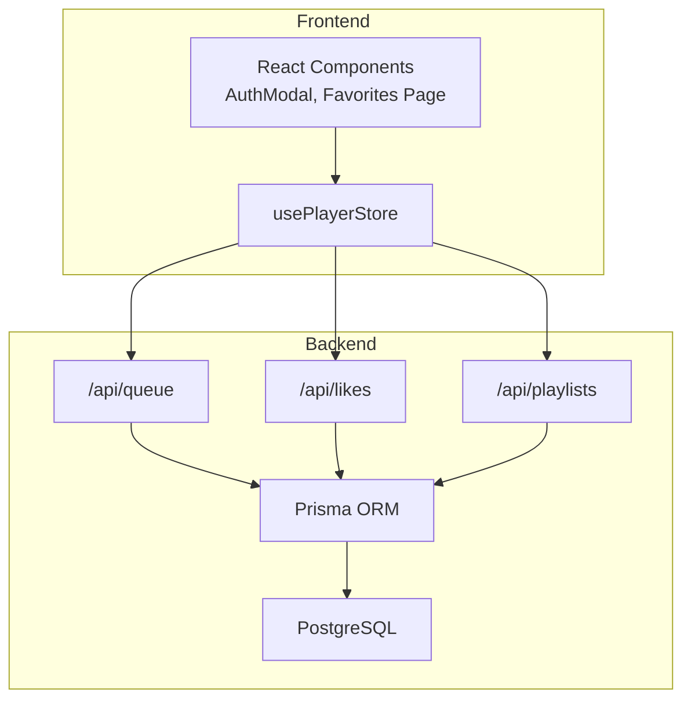
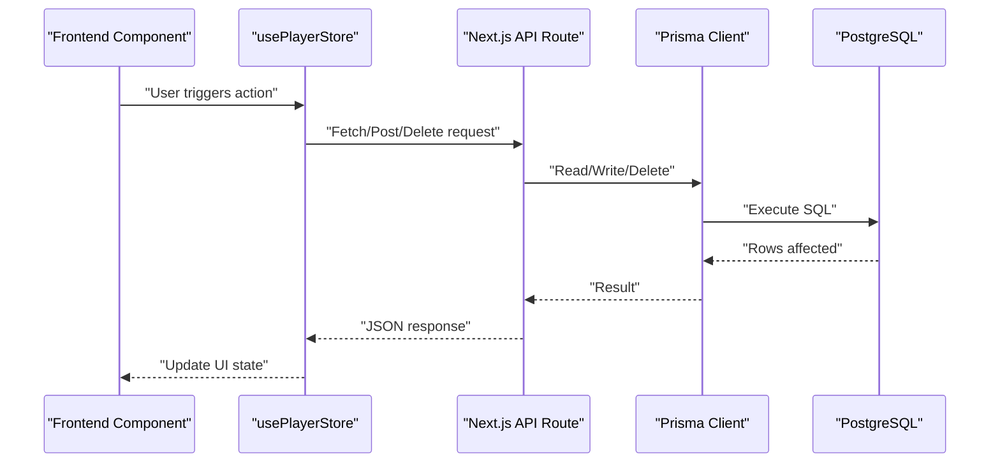
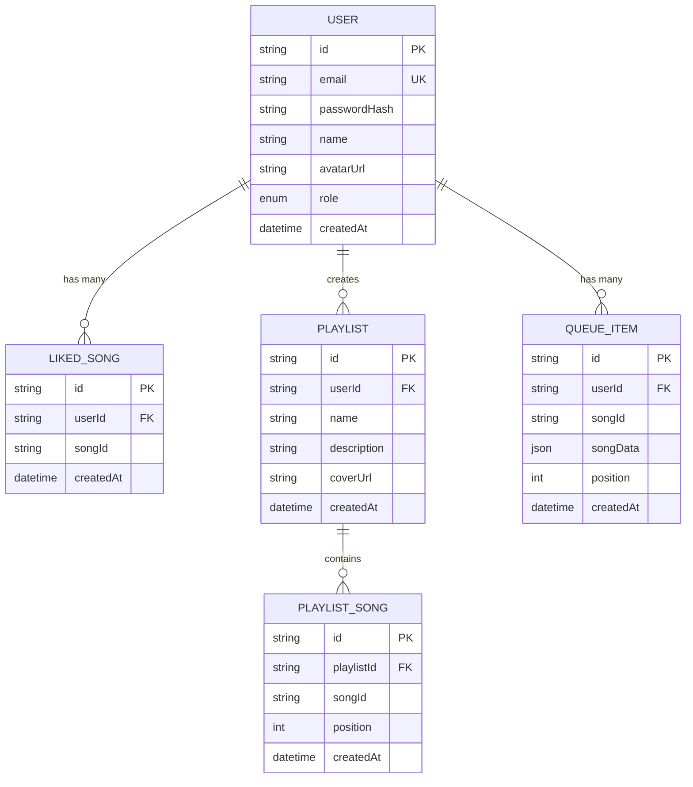
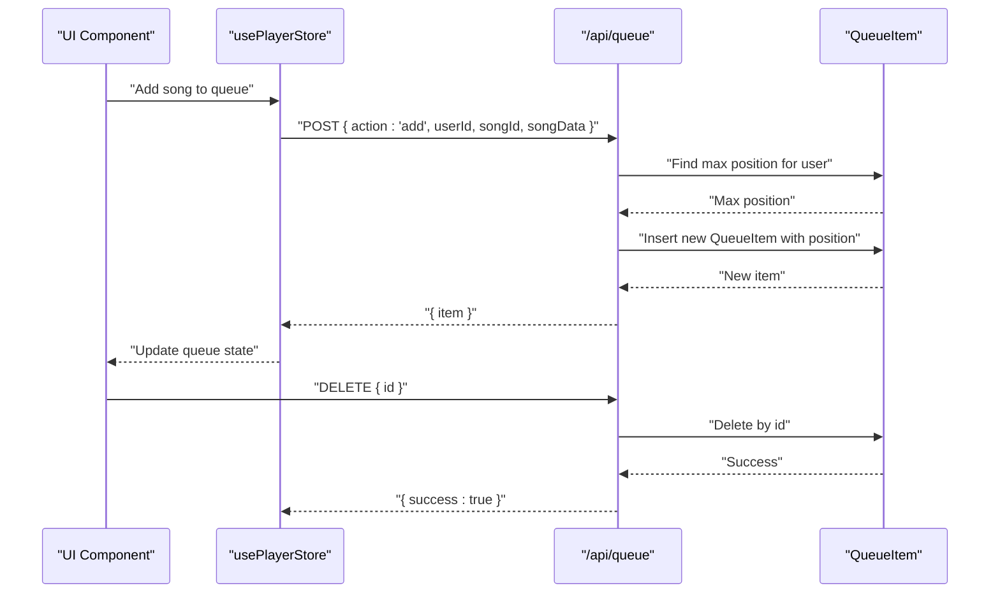
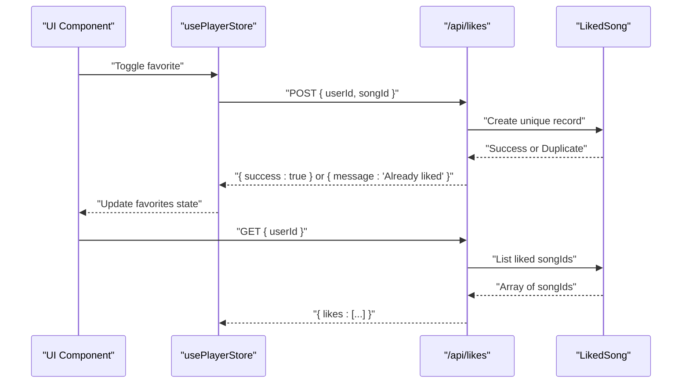
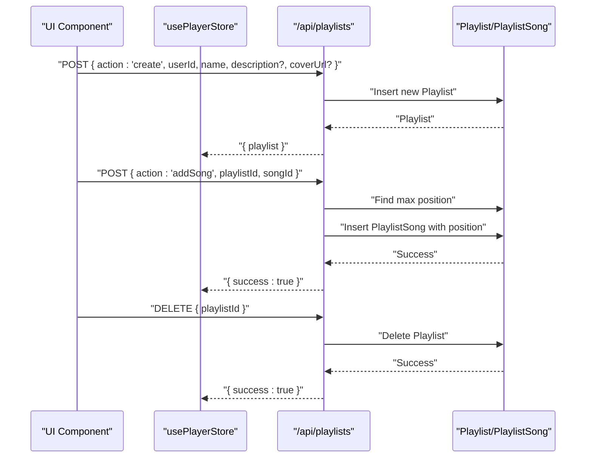
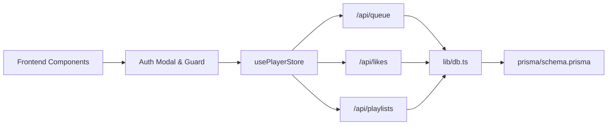

# Content Management APIs

<cite>
**Referenced Files in This Document**
- [queue/route.ts](file://app/api/queue/route.ts)
- [likes/route.ts](file://app/api/likes/route.ts)
- [playlists/route.ts](file://app/api/playlists/route.ts)
- [db.ts](file://lib/db.ts)
- [schema.prisma](file://prisma/schema.prisma)
- [usePlayerStore.ts](file://store/usePlayerStore.ts)
- [useAuthGuard.ts](file://hooks/useAuthGuard.ts)
- [AuthModal.tsx](file://components/AuthModal.tsx)
- [favorites/page.tsx](file://app/favorites/page.tsx)
</cite>

## Table of Contents
1. [Introduction](#introduction)
2. [Project Structure](#project-structure)
3. [Core Components](#core-components)
4. [Architecture Overview](#architecture-overview)
5. [Detailed Component Analysis](#detailed-component-analysis)
6. [Dependency Analysis](#dependency-analysis)
7. [Performance Considerations](#performance-considerations)
8. [Troubleshooting Guide](#troubleshooting-guide)
9. [Conclusion](#conclusion)

## Introduction
This document provides comprehensive API documentation for SonicStream’s content management endpoints focused on three core areas:
- Playback queue management for per-user playback ordering and persistence
- Likes/favorites management for marking and retrieving user favorite songs
- Playlists management for full CRUD operations including song addition/removal and ordering

Each endpoint includes request/response schemas, authentication requirements, validation rules, error handling behavior, and integration examples. The backend is implemented as Next.js App Router API routes backed by Prisma ORM against a PostgreSQL database. Frontend integration is handled via React components and Zustand stores, with authentication gating through a modal and store-managed user state.

## Project Structure
The content management APIs are implemented under the Next.js app router at:
- app/api/queue/route.ts
- app/api/likes/route.ts
- app/api/playlists/route.ts

They rely on:
- lib/db.ts for Prisma client initialization
- prisma/schema.prisma for database models and relations
- store/usePlayerStore.ts for frontend state management
- hooks/useAuthGuard.ts and components/AuthModal.tsx for authentication gating

**Diagram sources**
- [queue/route.ts:1-86](file://app/api/queue/route.ts#L1-L86)
- [likes/route.ts:1-55](file://app/api/likes/route.ts#L1-L55)
- [playlists/route.ts:1-90](file://app/api/playlists/route.ts#L1-L90)
- [db.ts:1-10](file://lib/db.ts#L1-L10)
- [schema.prisma:1-111](file://prisma/schema.prisma#L1-L111)

**Section sources**
- [queue/route.ts:1-86](file://app/api/queue/route.ts#L1-L86)
- [likes/route.ts:1-55](file://app/api/likes/route.ts#L1-L55)
- [playlists/route.ts:1-90](file://app/api/playlists/route.ts#L1-L90)
- [db.ts:1-10](file://lib/db.ts#L1-L10)
- [schema.prisma:1-111](file://prisma/schema.prisma#L1-L111)

## Core Components
This section documents the three content management APIs with their request/response schemas, validation rules, and error handling.

### Queue Management API (/api/queue)
Purpose: Manage a user’s playback queue with add, clear, and remove operations, maintaining order via position integers.

Endpoints:
- GET /api/queue?userId=...
- POST /api/queue — { action: 'add' | 'clear', userId, songId?, songData?, position? }
- DELETE /api/queue — { id } or { userId, songId }

Request Validation:
- GET requires userId
- POST requires action and userId; action 'add' additionally requires songId; action 'clear' does not require extra fields
- DELETE requires either id or both userId and songId

Response Schemas:
- GET returns { queue: [{ id, songId, songData, position }] }
- POST returns { item } on success or { success: true } for clear
- DELETE returns { success: true }

Error Handling:
- 400 Bad Request for missing required fields
- 500 Internal Server Error for failures during add/clear/delete

Example Integrations:
- Frontend adds a song to the queue by sending POST with action 'add'
- Frontend clears the queue by sending POST with action 'clear'
- Frontend removes a processed song by sending DELETE with id
- Frontend queries the queue by calling GET with userId

**Section sources**
- [queue/route.ts:4-22](file://app/api/queue/route.ts#L4-L22)
- [queue/route.ts:24-66](file://app/api/queue/route.ts#L24-L66)
- [queue/route.ts:68-85](file://app/api/queue/route.ts#L68-L85)

### Likes/Favorites API (/api/likes)
Purpose: Allow users to mark/unmark songs as favorites and retrieve their favorite song IDs.

Endpoints:
- GET /api/likes?userId=...
- POST /api/likes — { userId, songId }
- DELETE /api/likes — { userId, songId }

Request Validation:
- GET requires userId
- POST requires both userId and songId
- DELETE requires both userId and songId

Response Schemas:
- GET returns { likes: [songId, ...] }
- POST returns { success: true } or { success: true, message: 'Already liked' } if duplicate exists
- DELETE returns { success: true }

Error Handling:
- 400 Bad Request for missing required fields
- 500 Internal Server Error for failures; duplicate key constraint returns success with message

Example Integrations:
- Frontend calls GET to load user favorites
- Frontend calls POST to add a favorite and DELETE to remove it
- Frontend maintains local favorites list in usePlayerStore and syncs with backend

**Section sources**
- [likes/route.ts:4-15](file://app/api/likes/route.ts#L4-L15)
- [likes/route.ts:17-36](file://app/api/likes/route.ts#L17-L36)
- [likes/route.ts:38-54](file://app/api/likes/route.ts#L38-L54)

### Playlists API (/api/playlists)
Purpose: Full CRUD for playlists and song management with ordered track positions.

Endpoints:
- GET /api/playlists?userId=...
- POST /api/playlists — { action: 'create' | 'addSong' | 'removeSong', ... }
- DELETE /api/playlists — { playlistId }

Request Validation:
- GET requires userId
- POST action 'create' requires userId and name; 'addSong' requires playlistId and songId; 'removeSong' requires playlistId and songId
- DELETE requires playlistId

Response Schemas:
- GET returns { playlists: [...] } with songs ordered by position ascending
- POST returns { playlist } on create or { success: true } on add/remove
- DELETE returns { success: true }

Error Handling:
- 400 Bad Request for missing required fields
- 500 Internal Server Error for failures; duplicate key constraint returns success with message

Example Integrations:
- Frontend loads user playlists and song lists
- Frontend creates playlists, adds/removes songs, and deletes playlists
- Frontend maintains order using position integers

**Section sources**
- [playlists/route.ts:4-16](file://app/api/playlists/route.ts#L4-L16)
- [playlists/route.ts:18-74](file://app/api/playlists/route.ts#L18-L74)
- [playlists/route.ts:76-89](file://app/api/playlists/route.ts#L76-L89)

## Architecture Overview
The APIs are thin handlers that delegate to Prisma for persistence. The database models define relationships and uniqueness constraints enforced at the DB level. Frontend components coordinate with the backend through authenticated actions and maintain state locally for immediate UI responsiveness.

**Diagram sources**
- [queue/route.ts:1-86](file://app/api/queue/route.ts#L1-L86)
- [likes/route.ts:1-55](file://app/api/likes/route.ts#L1-L55)
- [playlists/route.ts:1-90](file://app/api/playlists/route.ts#L1-L90)
- [db.ts:1-10](file://lib/db.ts#L1-L10)
- [schema.prisma:1-111](file://prisma/schema.prisma#L1-L111)

## Detailed Component Analysis

### Database Models and Relationships
The Prisma schema defines the core entities and their relationships used by the APIs.

**Diagram sources**
- [schema.prisma:16-84](file://prisma/schema.prisma#L16-L84)

**Section sources**
- [schema.prisma:34-84](file://prisma/schema.prisma#L34-L84)

### Authentication and Authorization
- Authentication is handled by a separate auth API and modal-driven flow. The content management APIs themselves do not enforce authentication; they expect clients to supply valid identifiers (userId, songId, playlistId).
- The frontend uses a store-managed user session and an auth modal to gate actions requiring authentication.

Integration points:
- AuthModal triggers sign-up/sign-in and sets user in the store
- useAuthGuard wraps actions to prompt the modal if unauthenticated
- usePlayerStore holds user state for downstream API calls

**Section sources**
- [useAuthGuard.ts:1-29](file://hooks/useAuthGuard.ts#L1-L29)
- [AuthModal.tsx:1-71](file://components/AuthModal.tsx#L1-L71)
- [usePlayerStore.ts:1-128](file://store/usePlayerStore.ts#L1-L128)

### Queue Management Flow

**Diagram sources**
- [queue/route.ts:24-66](file://app/api/queue/route.ts#L24-L66)
- [queue/route.ts:68-85](file://app/api/queue/route.ts#L68-L85)
- [schema.prisma:73-84](file://prisma/schema.prisma#L73-L84)

**Section sources**
- [queue/route.ts:4-22](file://app/api/queue/route.ts#L4-L22)
- [queue/route.ts:24-66](file://app/api/queue/route.ts#L24-L66)
- [queue/route.ts:68-85](file://app/api/queue/route.ts#L68-L85)

### Likes/Favorites Flow

**Diagram sources**
- [likes/route.ts:17-36](file://app/api/likes/route.ts#L17-L36)
- [likes/route.ts:4-15](file://app/api/likes/route.ts#L4-L15)
- [schema.prisma:34-44](file://prisma/schema.prisma#L34-L44)

**Section sources**
- [likes/route.ts:4-15](file://app/api/likes/route.ts#L4-L15)
- [likes/route.ts:17-36](file://app/api/likes/route.ts#L17-L36)
- [likes/route.ts:38-54](file://app/api/likes/route.ts#L38-L54)

### Playlists CRUD Flow

**Diagram sources**
- [playlists/route.ts:18-74](file://app/api/playlists/route.ts#L18-L74)
- [playlists/route.ts:76-89](file://app/api/playlists/route.ts#L76-L89)
- [schema.prisma:46-71](file://prisma/schema.prisma#L46-L71)

**Section sources**
- [playlists/route.ts:4-16](file://app/api/playlists/route.ts#L4-L16)
- [playlists/route.ts:18-74](file://app/api/playlists/route.ts#L18-L74)
- [playlists/route.ts:76-89](file://app/api/playlists/route.ts#L76-L89)

## Dependency Analysis
- API routes depend on lib/db.ts for Prisma client initialization and prisma/schema.prisma for model definitions.
- Frontend components depend on usePlayerStore.ts for state and hooks/useAuthGuard.ts for authentication gating.
- AuthModal.tsx integrates with the auth API to populate user state consumed by content management APIs.

**Diagram sources**
- [usePlayerStore.ts:1-128](file://store/usePlayerStore.ts#L1-L128)
- [useAuthGuard.ts:1-29](file://hooks/useAuthGuard.ts#L1-L29)
- [AuthModal.tsx:1-71](file://components/AuthModal.tsx#L1-L71)
- [queue/route.ts:1-86](file://app/api/queue/route.ts#L1-L86)
- [likes/route.ts:1-55](file://app/api/likes/route.ts#L1-L55)
- [playlists/route.ts:1-90](file://app/api/playlists/route.ts#L1-L90)
- [db.ts:1-10](file://lib/db.ts#L1-L10)
- [schema.prisma:1-111](file://prisma/schema.prisma#L1-L111)

**Section sources**
- [db.ts:1-10](file://lib/db.ts#L1-L10)
- [schema.prisma:1-111](file://prisma/schema.prisma#L1-L111)
- [usePlayerStore.ts:1-128](file://store/usePlayerStore.ts#L1-L128)
- [useAuthGuard.ts:1-29](file://hooks/useAuthGuard.ts#L1-L29)
- [AuthModal.tsx:1-71](file://components/AuthModal.tsx#L1-L71)

## Performance Considerations
- Queue and playlist endpoints order items by position; ensure appropriate indexing on position fields for efficient retrieval and insertion.
- Use of findFirst with orderBy(desc) for max position is O(n) in the worst case; consider maintaining a position counter or materialized view if scale grows.
- Favor batch operations where possible (e.g., fetching all liked songs in one call) to reduce round-trips.
- Cache frequently accessed user favorites and playlists on the client to minimize backend calls.

## Troubleshooting Guide
Common issues and resolutions:
- Missing userId or songId parameters cause 400 errors. Ensure frontend passes required identifiers.
- Duplicate entries for likes and playlists are handled gracefully; the backend returns success with a message indicating duplication.
- Network or database errors return 500; verify connectivity and Prisma client initialization.
- Authentication gating: if actions fail due to lack of user session, use the auth modal to sign in and retry.

**Section sources**
- [queue/route.ts:30-38](file://app/api/queue/route.ts#L30-L38)
- [likes/route.ts:20-23](file://app/api/likes/route.ts#L20-L23)
- [playlists/route.ts:24-28](file://app/api/playlists/route.ts#L24-L28)
- [likes/route.ts:31-34](file://app/api/likes/route.ts#L31-L34)
- [playlists/route.ts:69-72](file://app/api/playlists/route.ts#L69-L72)

## Conclusion
The content management APIs provide robust, minimal endpoints for queue, likes, and playlists. They rely on Prisma for data integrity and the frontend for authentication and state management. By following the documented request/response schemas and validation rules, integrators can build reliable features for playback queue management, favorites, and playlist editing.