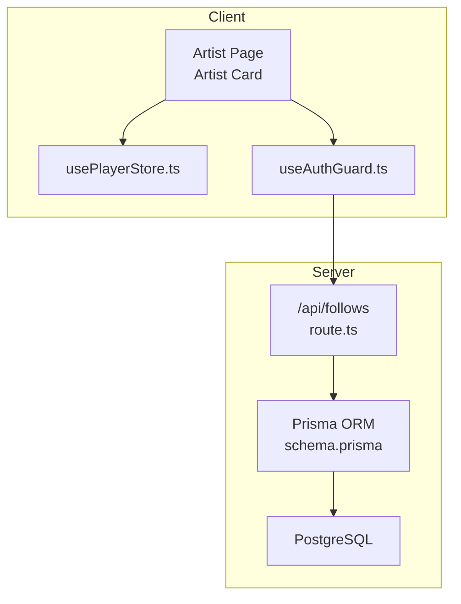
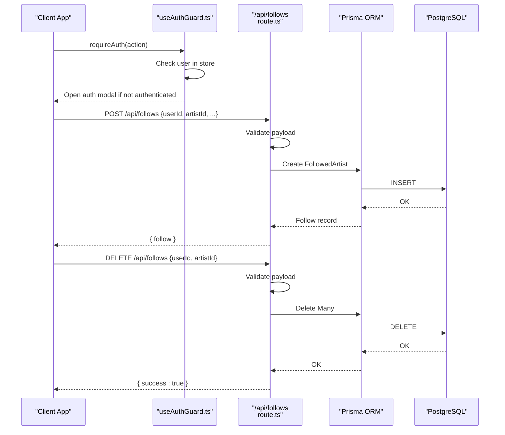
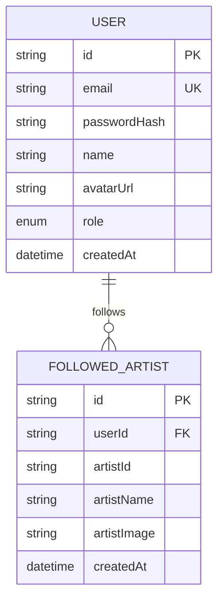
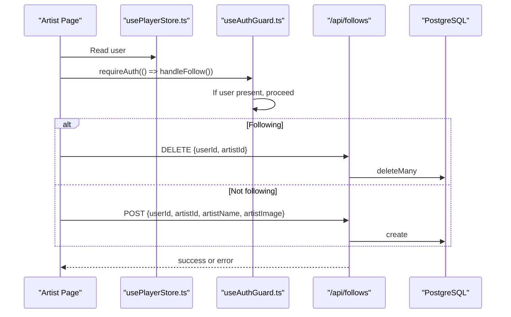
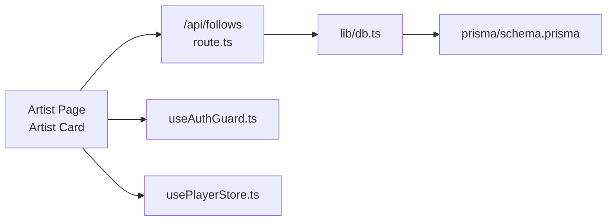

# Social Interaction APIs

<cite>
**Referenced Files in This Document**
- [route.ts](file://app/api/follows/route.ts)
- [db.ts](file://lib/db.ts)
- [schema.prisma](file://prisma/schema.prisma)
- [useAuthGuard.ts](file://hooks/useAuthGuard.ts)
- [usePlayerStore.ts](file://store/usePlayerStore.ts)
- [page.tsx](file://app/artist/[id]/page.tsx)
- [ArtistCard.tsx](file://components/ArtistCard.tsx)
- [api.ts](file://lib/api.ts)
- [README.md](file://README.md)
</cite>

## Table of Contents
1. [Introduction](#introduction)
2. [Project Structure](#project-structure)
3. [Core Components](#core-components)
4. [Architecture Overview](#architecture-overview)
5. [Detailed Component Analysis](#detailed-component-analysis)
6. [Dependency Analysis](#dependency-analysis)
7. [Performance Considerations](#performance-considerations)
8. [Troubleshooting Guide](#troubleshooting-guide)
9. [Conclusion](#conclusion)

## Introduction
This document provides comprehensive API documentation for SonicStream’s social interaction endpoints, focusing on the follows API used to manage user-artist relationships. It covers endpoint definitions, request/response schemas, authentication requirements, validation rules, error handling, and practical integration examples for artist discovery and fan engagement. It also addresses performance considerations for large follower datasets and pagination strategies.

## Project Structure
The follows API is implemented as a Next.js App Router API route. It integrates with Prisma ORM for database operations and relies on a shared Zustand store for user state and a client-side auth guard hook to gate authenticated actions.

**Diagram sources**
- [route.ts:1-55](file://app/api/follows/route.ts#L1-L55)
- [schema.prisma:86-98](file://prisma/schema.prisma#L86-L98)
- [useAuthGuard.ts:1-29](file://hooks/useAuthGuard.ts#L1-L29)
- [usePlayerStore.ts:1-128](file://store/usePlayerStore.ts#L1-L128)
- [page.tsx:34-72](file://app/artist/[id]/page.tsx#L34-L72)

**Section sources**
- [README.md:1-74](file://README.md#L1-L74)

## Core Components
- Follows API route: Implements GET, POST, and DELETE endpoints for user-artist relationships.
- Prisma model: Defines the FollowedArtist relation with unique constraints and timestamps.
- Client integration: Uses TanStack Query to fetch follow status and a custom auth guard to require login before follow/unfollow actions.

Key responsibilities:
- GET: Retrieve a user’s followed artists.
- POST: Create a follow relationship.
- DELETE: Remove a follow relationship.
- Validation: Enforce presence of required identifiers.
- Error handling: Return structured errors and handle duplicate follow scenarios.

**Section sources**
- [route.ts:4-15](file://app/api/follows/route.ts#L4-L15)
- [route.ts:17-36](file://app/api/follows/route.ts#L17-L36)
- [route.ts:38-54](file://app/api/follows/route.ts#L38-L54)
- [schema.prisma:86-98](file://prisma/schema.prisma#L86-L98)

## Architecture Overview
The follows API operates within the Next.js App Router and uses Prisma to interact with a PostgreSQL database. Authentication is enforced client-side via a shared auth guard hook, ensuring only logged-in users can perform follow/unfollow actions.

**Diagram sources**
- [route.ts:17-36](file://app/api/follows/route.ts#L17-L36)
- [route.ts:38-54](file://app/api/follows/route.ts#L38-L54)
- [useAuthGuard.ts:16-25](file://hooks/useAuthGuard.ts#L16-L25)
- [usePlayerStore.ts:114-114](file://store/usePlayerStore.ts#L114-L114)

## Detailed Component Analysis

### Follows API Endpoints

#### GET /api/follows
- Purpose: Retrieve a user’s followed artists.
- Query parameters:
  - userId (required): Identifier of the user whose follows are to be fetched.
- Response:
  - Body: { follows: FollowedArtist[] }
  - FollowedArtist fields: id, userId, artistId, artistName, artistImage, createdAt
- Behavior:
  - Orders results by creation date descending.
  - Returns empty array if no follows found.
- Error handling:
  - 400 Bad Request if userId is missing.

Example usage:
- Fetch followed artists for a logged-in user.

**Section sources**
- [route.ts:4-15](file://app/api/follows/route.ts#L4-L15)
- [schema.prisma:86-98](file://prisma/schema.prisma#L86-L98)

#### POST /api/follows
- Purpose: Create a follow relationship between a user and an artist.
- Request body:
  - userId (required): Identifier of the user.
  - artistId (required): Identifier of the artist.
  - artistName (optional): Name of the artist (stored for convenience).
  - artistImage (optional): URL of the artist’s image.
- Response:
  - On success: { follow: FollowedArtist }
  - On duplicate follow: { success: true, message: "Already following" }
  - On validation error: { error: "userId and artistId required" } (400)
  - On database error: { error: "Failed to follow" } (500)
- Behavior:
  - Creates a new FollowedArtist record with provided fields.
  - Unique constraint prevents duplicate follow entries.
- Error handling:
  - Catches Prisma unique constraint violation and returns success with message.

Example usage:
- Follow an artist from the artist page or search results.

**Section sources**
- [route.ts:17-36](file://app/api/follows/route.ts#L17-L36)
- [schema.prisma:86-98](file://prisma/schema.prisma#L86-L98)

#### DELETE /api/follows
- Purpose: Remove a follow relationship.
- Request body:
  - userId (required): Identifier of the user.
  - artistId (required): Identifier of the artist.
- Response:
  - On success: { success: true }
  - On validation error: { error: "userId and artistId required" } (400)
  - On database error: { error: "Failed to unfollow" } (500)
- Behavior:
  - Deletes all matching FollowedArtist records for the given user and artist.
- Error handling:
  - Generic catch-all for unexpected failures.

Example usage:
- Unfollow an artist from the artist page.

**Section sources**
- [route.ts:38-54](file://app/api/follows/route.ts#L38-L54)
- [schema.prisma:86-98](file://prisma/schema.prisma#L86-L98)

### Data Model and Relationships

- Unique constraint: (userId, artistId) ensures a user cannot follow the same artist twice.
- Cascade delete: When a user is deleted, their follow records are removed automatically.

**Diagram sources**
- [schema.prisma:16-32](file://prisma/schema.prisma#L16-L32)
- [schema.prisma:86-98](file://prisma/schema.prisma#L86-L98)

**Section sources**
- [schema.prisma:86-98](file://prisma/schema.prisma#L86-L98)

### Client Integration and Authentication

- Authentication requirement:
  - Client-side auth guard checks for a logged-in user before allowing follow/unfollow actions.
  - If not authenticated, the auth modal is shown.
- Client-side follow status:
  - The artist page fetches follow status using TanStack Query with a query key that includes user and artist identifiers.
- Client-side actions:
  - Follow: POST /api/follows with { userId, artistId, artistName, artistImage }.
  - Unfollow: DELETE /api/follows with { userId, artistId }.
  - Toast notifications provide user feedback.

**Diagram sources**
- [page.tsx:34-72](file://app/artist/[id]/page.tsx#L34-L72)
- [useAuthGuard.ts:16-25](file://hooks/useAuthGuard.ts#L16-L25)
- [usePlayerStore.ts:114-114](file://store/usePlayerStore.ts#L114-L114)
- [route.ts:17-36](file://app/api/follows/route.ts#L17-L36)
- [route.ts:38-54](file://app/api/follows/route.ts#L38-L54)

**Section sources**
- [page.tsx:34-72](file://app/artist/[id]/page.tsx#L34-L72)
- [useAuthGuard.ts:12-28](file://hooks/useAuthGuard.ts#L12-L28)
- [usePlayerStore.ts:114-114](file://store/usePlayerStore.ts#L114-L114)

### Relationship Validation Rules
- Required fields:
  - POST requires userId and artistId.
  - DELETE requires userId and artistId.
- Unique constraint:
  - Prevents duplicate follows via (userId, artistId).
- Cascade behavior:
  - Deleting a user removes their follow records.

**Section sources**
- [route.ts:21-23](file://app/api/follows/route.ts#L21-L23)
- [route.ts:42-44](file://app/api/follows/route.ts#L42-L44)
- [schema.prisma:96-96](file://prisma/schema.prisma#L96-L96)

### Error Handling Strategies
- Validation errors:
  - 400 Bad Request for missing required fields.
- Duplicate follow:
  - Special handling returns success with message indicating already following.
- Database errors:
  - 500 Internal Server Error for unexpected failures.
- Client-side UX:
  - Toast notifications inform users of success or failure.

**Section sources**
- [route.ts:7-7](file://app/api/follows/route.ts#L7-L7)
- [route.ts:21-23](file://app/api/follows/route.ts#L21-L23)
- [route.ts:42-44](file://app/api/follows/route.ts#L42-L44)
- [route.ts:31-33](file://app/api/follows/route.ts#L31-L33)
- [route.ts:34-34](file://app/api/follows/route.ts#L34-L34)
- [route.ts:52-52](file://app/api/follows/route.ts#L52-L52)

### Implementation Examples and Best Practices

Common use cases:
- Artist discovery: After a user follows an artist, their top songs or albums can be surfaced in feeds.
- Fan engagement: Follow status can influence UI affordances and analytics.

Integration steps:
- Check follow status on artist pages using the GET endpoint.
- Gate follow/unfollow actions with the auth guard.
- Use POST to follow and DELETE to unfollow.
- Provide immediate UI feedback via toast messages.

Best practices:
- Always pass artistName and artistImage on follow to keep local UI consistent.
- Invalidate or refetch follow status after successful mutations.
- Use unique constraints to prevent duplicate follow attempts.

**Section sources**
- [page.tsx:34-72](file://app/artist/[id]/page.tsx#L34-L72)
- [useAuthGuard.ts:16-25](file://hooks/useAuthGuard.ts#L16-L25)
- [route.ts:25-27](file://app/api/follows/route.ts#L25-L27)

## Dependency Analysis

- The route depends on Prisma for database operations.
- Client components depend on the auth guard and store for user state.
- No circular dependencies detected among these components.

**Diagram sources**
- [route.ts:1-2](file://app/api/follows/route.ts#L1-L2)
- [db.ts:1-10](file://lib/db.ts#L1-L10)
- [schema.prisma:86-98](file://prisma/schema.prisma#L86-L98)
- [useAuthGuard.ts:1-29](file://hooks/useAuthGuard.ts#L1-L29)
- [usePlayerStore.ts:1-128](file://store/usePlayerStore.ts#L1-L128)
- [page.tsx:34-72](file://app/artist/[id]/page.tsx#L34-L72)

**Section sources**
- [route.ts:1-2](file://app/api/follows/route.ts#L1-L2)
- [db.ts:1-10](file://lib/db.ts#L1-L10)
- [schema.prisma:86-98](file://prisma/schema.prisma#L86-L98)
- [useAuthGuard.ts:1-29](file://hooks/useAuthGuard.ts#L1-L29)
- [usePlayerStore.ts:1-128](file://store/usePlayerStore.ts#L1-L128)
- [page.tsx:34-72](file://app/artist/[id]/page.tsx#L34-L72)

## Performance Considerations
- Current implementation:
  - GET orders by createdAt desc and returns all follows without pagination.
- Recommendations:
  - Add pagination to GET /api/follows using page and limit parameters.
  - Index userId for efficient lookups.
  - Consider caching frequent queries for user follow status.
  - Batch follow/unfollow operations when integrating with bulk UI actions.

[No sources needed since this section provides general guidance]

## Troubleshooting Guide
- Missing userId or artistId:
  - Symptom: 400 Bad Request.
  - Resolution: Ensure both identifiers are provided in request body.
- Already following:
  - Symptom: Success response with message indicating already following.
  - Resolution: UI should reflect current follow state and avoid duplicate requests.
- Database errors:
  - Symptom: 500 Internal Server Error.
  - Resolution: Check Prisma logs and database connectivity; retry operation.
- Authentication issues:
  - Symptom: Auth modal appears.
  - Resolution: Ensure user is logged in and user state is persisted.

**Section sources**
- [route.ts:7-7](file://app/api/follows/route.ts#L7-L7)
- [route.ts:21-23](file://app/api/follows/route.ts#L21-L23)
- [route.ts:42-44](file://app/api/follows/route.ts#L42-L44)
- [route.ts:31-33](file://app/api/follows/route.ts#L31-L33)
- [route.ts:34-34](file://app/api/follows/route.ts#L34-L34)
- [route.ts:52-52](file://app/api/follows/route.ts#L52-L52)
- [useAuthGuard.ts:16-25](file://hooks/useAuthGuard.ts#L16-L25)

## Conclusion
The follows API provides a straightforward mechanism to manage user-artist relationships with clear validation and error handling. By integrating with the client-side auth guard and store, it enables seamless follow/unfollow experiences. For production-scale deployments, consider adding pagination to the GET endpoint and optimizing queries with appropriate indexing and caching strategies.