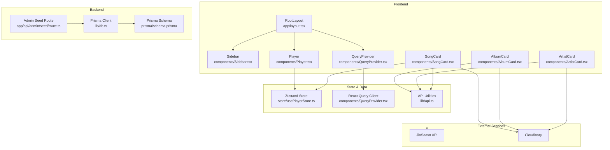
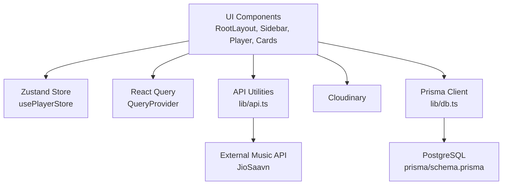
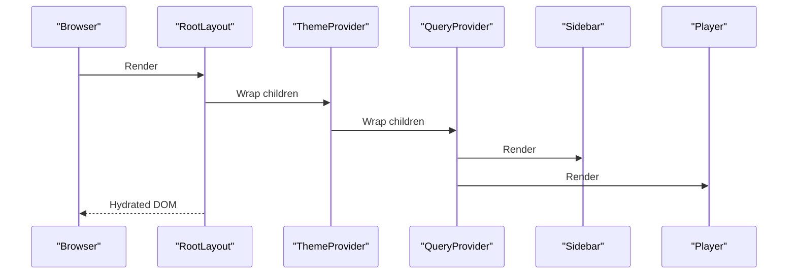
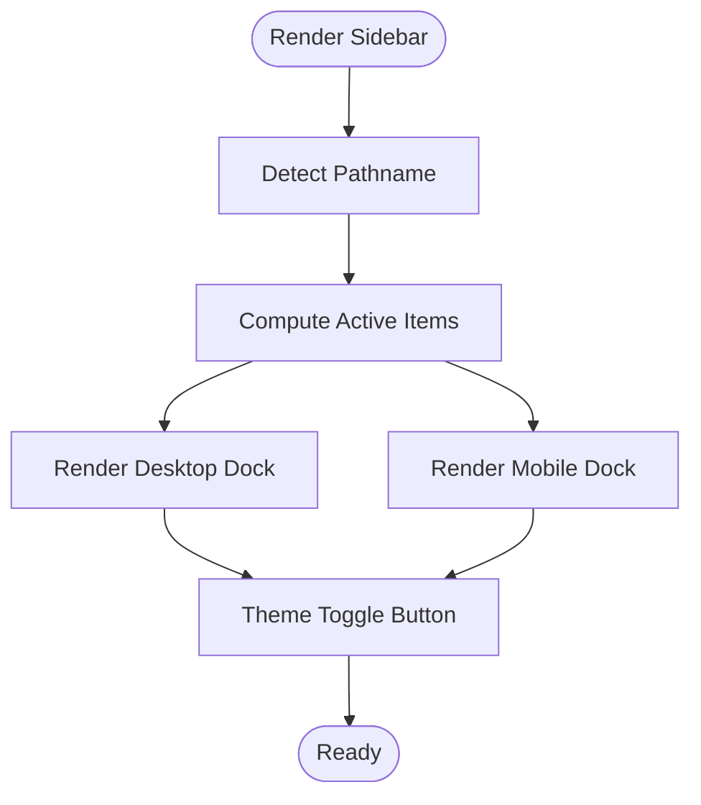
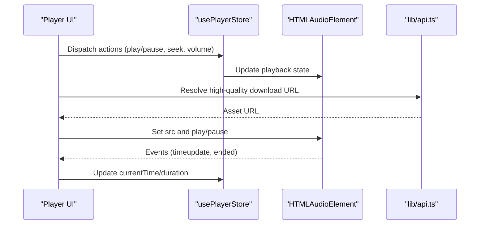
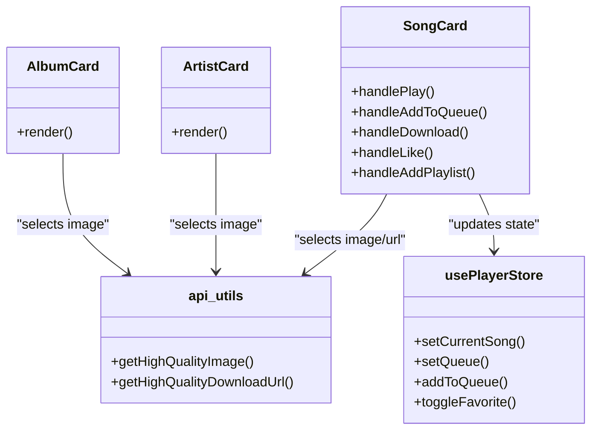
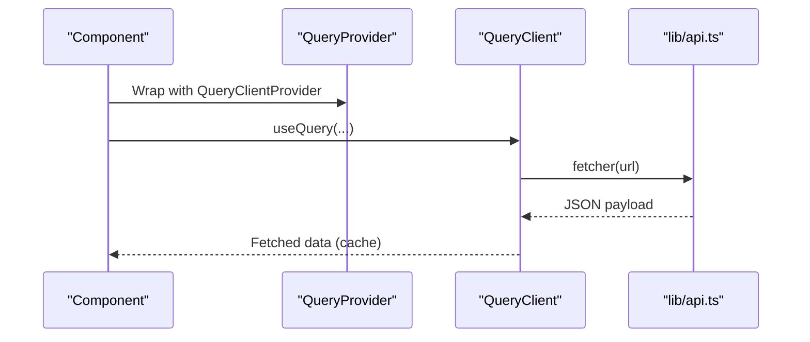
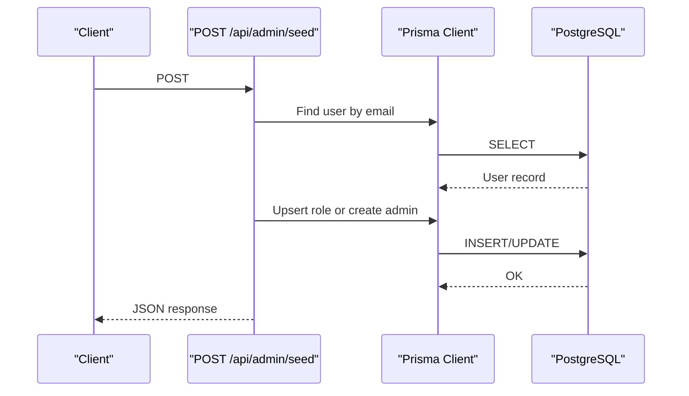
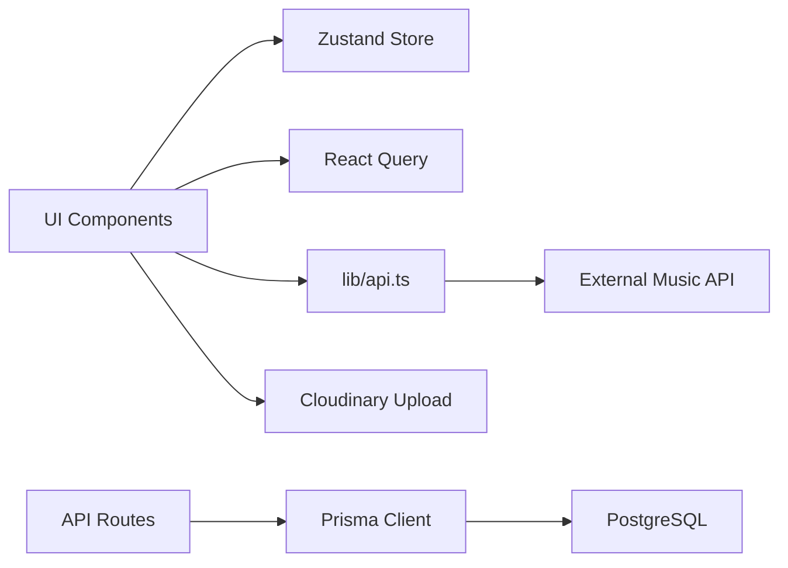

# Architecture Overview

<cite>
**Referenced Files in This Document**
- [app/layout.tsx](file://app/layout.tsx)
- [components/Sidebar.tsx](file://components/Sidebar.tsx)
- [components/Player.tsx](file://components/Player.tsx)
- [store/usePlayerStore.ts](file://store/usePlayerStore.ts)
- [components/QueryProvider.tsx](file://components/QueryProvider.tsx)
- [lib/api.ts](file://lib/api.ts)
- [lib/cloudinary.ts](file://lib/cloudinary.ts)
- [components/AlbumCard.tsx](file://components/AlbumCard.tsx)
- [components/ArtistCard.tsx](file://components/ArtistCard.tsx)
- [components/SongCard.tsx](file://components/SongCard.tsx)
- [app/api/admin/seed/route.ts](file://app/api/admin/seed/route.ts)
- [lib/db.ts](file://lib/db.ts)
- [prisma/schema.prisma](file://prisma/schema.prisma)
- [package.json](file://package.json)
- [next.config.ts](file://next.config.ts)
</cite>

## Table of Contents
1. [Introduction](#introduction)
2. [Project Structure](#project-structure)
3. [Core Components](#core-components)
4. [Architecture Overview](#architecture-overview)
5. [Detailed Component Analysis](#detailed-component-analysis)
6. [Dependency Analysis](#dependency-analysis)
7. [Performance Considerations](#performance-considerations)
8. [Troubleshooting Guide](#troubleshooting-guide)
9. [Conclusion](#conclusion)

## Introduction
This document presents the architecture of SonicStream, a modern music streaming application built with Next.js App Router and a React-based frontend. The system integrates external music APIs for discovery and playback, a persistent player state managed by Zustand, and a data-fetching layer powered by React Query. It also includes backend API routes for administrative tasks and a PostgreSQL-backed persistence layer via Prisma. The architecture emphasizes component composition, a provider pattern for global state, and a modular structure that cleanly separates UI, state, data fetching, and backend concerns.

## Project Structure
SonicStream follows a conventional Next.js App Router layout with a dedicated app directory for pages and API routes, a components directory for reusable UI, a store directory for state management, a lib directory for shared utilities and integrations, and a prisma directory for database modeling. The root-level configuration files define runtime behavior, dependencies, and build settings.

**Diagram sources**
- [app/layout.tsx:1-49](file://app/layout.tsx#L1-L49)
- [components/Sidebar.tsx:1-107](file://components/Sidebar.tsx#L1-L107)
- [components/Player.tsx:1-251](file://components/Player.tsx#L1-L251)
- [components/QueryProvider.tsx:1-26](file://components/QueryProvider.tsx#L1-L26)
- [store/usePlayerStore.ts:1-128](file://store/usePlayerStore.ts#L1-L128)
- [lib/api.ts:1-153](file://lib/api.ts#L1-L153)
- [app/api/admin/seed/route.ts:1-40](file://app/api/admin/seed/route.ts#L1-L40)
- [lib/db.ts:1-10](file://lib/db.ts#L1-L10)
- [prisma/schema.prisma:1-111](file://prisma/schema.prisma#L1-L111)

**Section sources**
- [app/layout.tsx:1-49](file://app/layout.tsx#L1-L49)
- [next.config.ts:1-67](file://next.config.ts#L1-L67)
- [package.json:1-50](file://package.json#L1-L50)

## Core Components
- RootLayout orchestrates the global providers and renders the sidebar and player alongside page content. It establishes the theme provider, query provider, and persistent UI elements.
- Sidebar provides responsive navigation with desktop floating dock and mobile bottom dock, integrating theme switching and active-state styling.
- Player manages audio playback, progress, volume, shuffle/repeat modes, queue panel, and favorite toggling, backed by Zustand.
- QueryProvider initializes React Query with sensible defaults for caching and retries.
- Zustand store encapsulates player state, queue, favorites, recent plays, and user data with persistence.
- API utilities abstract external music API calls, URL normalization, and asset selection helpers.
- Card components (AlbumCard, ArtistCard, SongCard) render media items with interactive actions and integrate with the player store and API utilities.
- Backend API routes (e.g., admin seed) demonstrate server-side operations using Prisma and environment variables.
- Prisma schema defines relational models for users, liked songs, playlists, playlist songs, queue items, followed artists, and password resets.

**Section sources**
- [app/layout.tsx:21-48](file://app/layout.tsx#L21-L48)
- [components/Sidebar.tsx:19-106](file://components/Sidebar.tsx#L19-L106)
- [components/Player.tsx:19-250](file://components/Player.tsx#L19-L250)
- [components/QueryProvider.tsx:6-25](file://components/QueryProvider.tsx#L6-L25)
- [store/usePlayerStore.ts:43-127](file://store/usePlayerStore.ts#L43-L127)
- [lib/api.ts:37-89](file://lib/api.ts#L37-L89)
- [components/AlbumCard.tsx:14-47](file://components/AlbumCard.tsx#L14-L47)
- [components/ArtistCard.tsx:14-50](file://components/ArtistCard.tsx#L14-L50)
- [components/SongCard.tsx:22-139](file://components/SongCard.tsx#L22-L139)
- [app/api/admin/seed/route.ts:14-39](file://app/api/admin/seed/route.ts#L14-L39)
- [prisma/schema.prisma:16-110](file://prisma/schema.prisma#L16-L110)

## Architecture Overview
The system is layered:
- Presentation Layer: Next.js App Router pages and React components (RootLayout, Sidebar, Player, Cards).
- State Management: Centralized Zustand store for player state and user preferences.
- Data Access: React Query for caching and background synchronization; API utilities for external service integration.
- Backend Services: Next.js API routes for administrative tasks; Prisma for database operations.
- External Integrations: Music discovery via an external music API; Cloudinary for image/avatar uploads.

**Diagram sources**
- [app/layout.tsx:21-48](file://app/layout.tsx#L21-L48)
- [store/usePlayerStore.ts:43-127](file://store/usePlayerStore.ts#L43-L127)
- [components/QueryProvider.tsx:6-25](file://components/QueryProvider.tsx#L6-L25)
- [lib/api.ts:37-89](file://lib/api.ts#L37-L89)
- [lib/cloudinary.ts:1-21](file://lib/cloudinary.ts#L1-L21)
- [lib/db.ts:1-10](file://lib/db.ts#L1-L10)
- [prisma/schema.prisma:16-110](file://prisma/schema.prisma#L16-L110)

## Detailed Component Analysis

### Root Layout and Providers
RootLayout composes the global providers and renders the sidebar and player. It sets up the theme provider, query provider, and persistent UI elements. The layout ensures the main content area accommodates the fixed player and mobile navigation.

**Diagram sources**
- [app/layout.tsx:21-48](file://app/layout.tsx#L21-L48)

**Section sources**
- [app/layout.tsx:21-48](file://app/layout.tsx#L21-L48)

### Sidebar Navigation
The Sidebar provides responsive navigation with desktop floating dock and mobile bottom dock. It computes active states based on the current path and integrates theme switching.

**Diagram sources**
- [components/Sidebar.tsx:19-106](file://components/Sidebar.tsx#L19-L106)

**Section sources**
- [components/Sidebar.tsx:19-106](file://components/Sidebar.tsx#L19-L106)

### Player Controls and State
The Player component manages audio playback, progress, volume, shuffle/repeat modes, and the queue panel. It integrates with the Zustand store for state and uses API utilities for asset URLs.

**Diagram sources**
- [components/Player.tsx:19-250](file://components/Player.tsx#L19-L250)
- [store/usePlayerStore.ts:43-127](file://store/usePlayerStore.ts#L43-L127)
- [lib/api.ts:73-83](file://lib/api.ts#L73-L83)

**Section sources**
- [components/Player.tsx:19-250](file://components/Player.tsx#L19-L250)
- [store/usePlayerStore.ts:43-127](file://store/usePlayerStore.ts#L43-L127)
- [lib/api.ts:73-83](file://lib/api.ts#L73-L83)

### Card Components and Interactions
Card components (AlbumCard, ArtistCard, SongCard) render media items and expose actions that interact with the player store and API utilities. SongCard integrates with download helpers and authentication guards.

**Diagram sources**
- [components/AlbumCard.tsx:14-47](file://components/AlbumCard.tsx#L14-L47)
- [components/ArtistCard.tsx:14-50](file://components/ArtistCard.tsx#L14-L50)
- [components/SongCard.tsx:22-139](file://components/SongCard.tsx#L22-L139)
- [store/usePlayerStore.ts:43-127](file://store/usePlayerStore.ts#L43-L127)
- [lib/api.ts:73-83](file://lib/api.ts#L73-L83)

**Section sources**
- [components/AlbumCard.tsx:14-47](file://components/AlbumCard.tsx#L14-L47)
- [components/ArtistCard.tsx:14-50](file://components/ArtistCard.tsx#L14-L50)
- [components/SongCard.tsx:22-139](file://components/SongCard.tsx#L22-L139)
- [lib/api.ts:73-83](file://lib/api.ts#L73-L83)

### Data Fetching with React Query
React Query is initialized in QueryProvider with default caching and retry policies. Components can leverage React Query hooks to fetch and cache data from the API utilities.

**Diagram sources**
- [components/QueryProvider.tsx:6-25](file://components/QueryProvider.tsx#L6-L25)
- [lib/api.ts:39-43](file://lib/api.ts#L39-L43)

**Section sources**
- [components/QueryProvider.tsx:6-25](file://components/QueryProvider.tsx#L6-L25)
- [lib/api.ts:39-43](file://lib/api.ts#L39-L43)

### Backend API Routes and Persistence
The backend API routes demonstrate administrative seeding using Prisma. The Prisma schema defines relational models for users, liked songs, playlists, queue items, followed artists, and password resets.

**Diagram sources**
- [app/api/admin/seed/route.ts:14-39](file://app/api/admin/seed/route.ts#L14-L39)
- [lib/db.ts:1-10](file://lib/db.ts#L1-L10)
- [prisma/schema.prisma:16-110](file://prisma/schema.prisma#L16-L110)

**Section sources**
- [app/api/admin/seed/route.ts:14-39](file://app/api/admin/seed/route.ts#L14-L39)
- [lib/db.ts:1-10](file://lib/db.ts#L1-L10)
- [prisma/schema.prisma:16-110](file://prisma/schema.prisma#L16-L110)

## Dependency Analysis
The frontend depends on React Query for data fetching, Zustand for state, and API utilities for external service integration. The backend relies on Prisma for database operations and environment variables for Cloudinary configuration.

**Diagram sources**
- [package.json:12-32](file://package.json#L12-L32)
- [lib/api.ts:37-89](file://lib/api.ts#L37-L89)
- [lib/cloudinary.ts:1-21](file://lib/cloudinary.ts#L1-L21)
- [lib/db.ts:1-10](file://lib/db.ts#L1-L10)
- [prisma/schema.prisma:16-110](file://prisma/schema.prisma#L16-L110)

**Section sources**
- [package.json:12-32](file://package.json#L12-L32)
- [lib/api.ts:37-89](file://lib/api.ts#L37-L89)
- [lib/cloudinary.ts:1-21](file://lib/cloudinary.ts#L1-L21)
- [lib/db.ts:1-10](file://lib/db.ts#L1-L10)
- [prisma/schema.prisma:16-110](file://prisma/schema.prisma#L16-L110)

## Performance Considerations
- Caching: React Query’s default staleTime reduces redundant network requests. Consider tuning staleTime per endpoint based on data volatility.
- Asset Resolution: Using high-quality image and download URLs minimizes re-renders by selecting optimized assets.
- Persistence: Zustand persistence stores only essential keys, reducing storage overhead.
- Network: Normalize external API responses to a consistent shape to avoid repeated transformations in components.
- Images: Configure Next.js images remotePatterns to allow external domains used by the music API and Cloudinary.

**Section sources**
- [components/QueryProvider.tsx:10-17](file://components/QueryProvider.tsx#L10-L17)
- [lib/api.ts:73-83](file://lib/api.ts#L73-L83)
- [store/usePlayerStore.ts:117-126](file://store/usePlayerStore.ts#L117-L126)
- [next.config.ts:11-51](file://next.config.ts#L11-L51)

## Troubleshooting Guide
- Authentication gating: SongCard and Player use an authentication guard to enable actions like liking or adding to queue. Ensure the guard modal opens appropriately when unauthenticated actions are attempted.
- External API failures: API utilities throw on non-OK responses. Wrap data fetching in error boundaries or use React Query error handling to surface user-friendly messages.
- Cloudinary uploads: Verify environment variables for Cloudinary credentials. Confirm transformations and folder paths align with backend expectations.
- Database seeding: Admin seed route updates roles or creates an admin user. Check Prisma client initialization and database connectivity.
- Image fallbacks: Album and artist cards include fallback rendering when images fail to load. Ensure fallback URLs are accessible.

**Section sources**
- [components/SongCard.tsx:50-63](file://components/SongCard.tsx#L50-L63)
- [lib/api.ts:39-43](file://lib/api.ts#L39-L43)
- [lib/cloudinary.ts:3-7](file://lib/cloudinary.ts#L3-L7)
- [app/api/admin/seed/route.ts:14-39](file://app/api/admin/seed/route.ts#L14-L39)
- [components/AlbumCard.tsx:22-35](file://components/AlbumCard.tsx#L22-L35)
- [components/ArtistCard.tsx:26-41](file://components/ArtistCard.tsx#L26-L41)

## Conclusion
SonicStream employs a clean separation of concerns with a React/Next.js frontend, Zustand for centralized state, and React Query for efficient data fetching. The architecture integrates external music APIs and Cloudinary while maintaining a modular structure supported by Prisma for persistence. The provider pattern in RootLayout ensures consistent global behavior, and component composition enables scalable UI development. The backend API routes and Prisma schema support administrative operations and user data management, completing the system’s full-stack design.