# API Routes

<cite>
**Referenced Files in This Document**
- [app/api/auth/route.ts](file://app/api/auth/route.ts)
- [app/api/auth/forgot/route.ts](file://app/api/auth/forgot/route.ts)
- [app/api/auth/reset/route.ts](file://app/api/auth/reset/route.ts)
- [app/api/admin/users/route.ts](file://app/api/admin/users/route.ts)
- [app/api/admin/stats/route.ts](file://app/api/admin/stats/route.ts)
- [app/api/admin/seed/route.ts](file://app/api/admin/seed/route.ts)
- [app/api/queue/route.ts](file://app/api/queue/route.ts)
- [app/api/likes/route.ts](file://app/api/likes/route.ts)
- [app/api/follows/route.ts](file://app/api/follows/route.ts)
- [app/api/playlists/route.ts](file://app/api/playlists/route.ts)
- [app/api/upload/route.ts](file://app/api/upload/route.ts)
- [lib/db.ts](file://lib/db.ts)
- [lib/cloudinary.ts](file://lib/cloudinary.ts)
- [prisma/schema.prisma](file://prisma/schema.prisma)
- [hooks/useAuthGuard.ts](file://hooks/useAuthGuard.ts)
- [lib/api.ts](file://lib/api.ts)
</cite>

## Table of Contents
1. [Introduction](#introduction)
2. [Project Structure](#project-structure)
3. [Core Components](#core-components)
4. [Architecture Overview](#architecture-overview)
5. [Detailed Component Analysis](#detailed-component-analysis)
6. [Dependency Analysis](#dependency-analysis)
7. [Performance Considerations](#performance-considerations)
8. [Troubleshooting Guide](#troubleshooting-guide)
9. [Conclusion](#conclusion)
10. [Appendices](#appendices)

## Introduction
This document provides comprehensive API route documentation for SonicStream’s Next.js API implementation. It covers authentication (login/signup, password reset), session-like user responses, user management (profile, avatar uploads), and data manipulation endpoints for queue management, likes/favorites, playlists, and follow/unfollow. It also documents admin endpoints for seeding data, statistics collection, and user administration. The guide includes request/response schemas, status code conventions, error handling patterns, and practical client integration examples.

## Project Structure
The API routes are organized under the Next.js App Router at app/api/<category>/<endpoint>/route.ts. Supporting libraries include database access via Prisma, Cloudinary image uploads, and shared utilities.

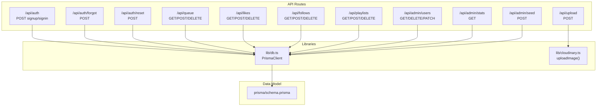

**Diagram sources**
- [app/api/auth/route.ts:1-73](file://app/api/auth/route.ts#L1-L73)
- [app/api/auth/forgot/route.ts:1-68](file://app/api/auth/forgot/route.ts#L1-L68)
- [app/api/auth/reset/route.ts:1-48](file://app/api/auth/reset/route.ts#L1-L48)
- [app/api/queue/route.ts:1-86](file://app/api/queue/route.ts#L1-L86)
- [app/api/likes/route.ts:1-55](file://app/api/likes/route.ts#L1-L55)
- [app/api/follows/route.ts:1-55](file://app/api/follows/route.ts#L1-L55)
- [app/api/playlists/route.ts:1-90](file://app/api/playlists/route.ts#L1-L90)
- [app/api/upload/route.ts:1-20](file://app/api/upload/route.ts#L1-L20)
- [app/api/admin/users/route.ts:1-75](file://app/api/admin/users/route.ts#L1-L75)
- [app/api/admin/stats/route.ts:1-28](file://app/api/admin/stats/route.ts#L1-L28)
- [app/api/admin/seed/route.ts:1-40](file://app/api/admin/seed/route.ts#L1-L40)
- [lib/db.ts:1-10](file://lib/db.ts#L1-L10)
- [lib/cloudinary.ts:1-21](file://lib/cloudinary.ts#L1-L21)
- [prisma/schema.prisma:1-111](file://prisma/schema.prisma#L1-L111)

**Section sources**
- [app/api/auth/route.ts:1-73](file://app/api/auth/route.ts#L1-L73)
- [app/api/auth/forgot/route.ts:1-68](file://app/api/auth/forgot/route.ts#L1-L68)
- [app/api/auth/reset/route.ts:1-48](file://app/api/auth/reset/route.ts#L1-L48)
- [app/api/admin/users/route.ts:1-75](file://app/api/admin/users/route.ts#L1-L75)
- [app/api/admin/stats/route.ts:1-28](file://app/api/admin/stats/route.ts#L1-L28)
- [app/api/admin/seed/route.ts:1-40](file://app/api/admin/seed/route.ts#L1-L40)
- [app/api/queue/route.ts:1-86](file://app/api/queue/route.ts#L1-L86)
- [app/api/likes/route.ts:1-55](file://app/api/likes/route.ts#L1-L55)
- [app/api/follows/route.ts:1-55](file://app/api/follows/route.ts#L1-L55)
- [app/api/playlists/route.ts:1-90](file://app/api/playlists/route.ts#L1-L90)
- [app/api/upload/route.ts:1-20](file://app/api/upload/route.ts#L1-L20)
- [lib/db.ts:1-10](file://lib/db.ts#L1-L10)
- [lib/cloudinary.ts:1-21](file://lib/cloudinary.ts#L1-L21)
- [prisma/schema.prisma:1-111](file://prisma/schema.prisma#L1-L111)

## Core Components
- Authentication endpoints: signup, signin, forgot password, reset password.
- Data manipulation endpoints: queue, likes/favorites, playlists, follows.
- Upload endpoint for avatars.
- Admin endpoints: seed, stats, and user management.

Status code conventions used across endpoints:
- 200 OK: Successful response.
- 201 Created: Resource created.
- 400 Bad Request: Missing or invalid parameters.
- 401 Unauthorized: Invalid credentials or missing permissions.
- 409 Conflict: Duplicate resource (e.g., existing email).
- 500 Internal Server Error: Unexpected server error.

Error payload pattern:
- JSON object with an error field describing the issue.

**Section sources**
- [app/api/auth/route.ts:15-72](file://app/api/auth/route.ts#L15-L72)
- [app/api/auth/forgot/route.ts:5-67](file://app/api/auth/forgot/route.ts#L5-L67)
- [app/api/auth/reset/route.ts:13-47](file://app/api/auth/reset/route.ts#L13-L47)
- [app/api/queue/route.ts:4-85](file://app/api/queue/route.ts#L4-L85)
- [app/api/likes/route.ts:4-54](file://app/api/likes/route.ts#L4-L54)
- [app/api/follows/route.ts:4-54](file://app/api/follows/route.ts#L4-L54)
- [app/api/playlists/route.ts:18-89](file://app/api/playlists/route.ts#L18-L89)
- [app/api/upload/route.ts:4-19](file://app/api/upload/route.ts#L4-L19)
- [app/api/admin/users/route.ts:4-74](file://app/api/admin/users/route.ts#L4-L74)
- [app/api/admin/stats/route.ts:4-27](file://app/api/admin/stats/route.ts#L4-L27)
- [app/api/admin/seed/route.ts:13-39](file://app/api/admin/seed/route.ts#L13-L39)

## Architecture Overview
The API relies on Prisma for data access and Cloudinary for image uploads. Authentication endpoints manage user creation and verification. Data manipulation endpoints operate on domain-specific resources (queue, likes, playlists, follows). Admin endpoints provide operational controls.

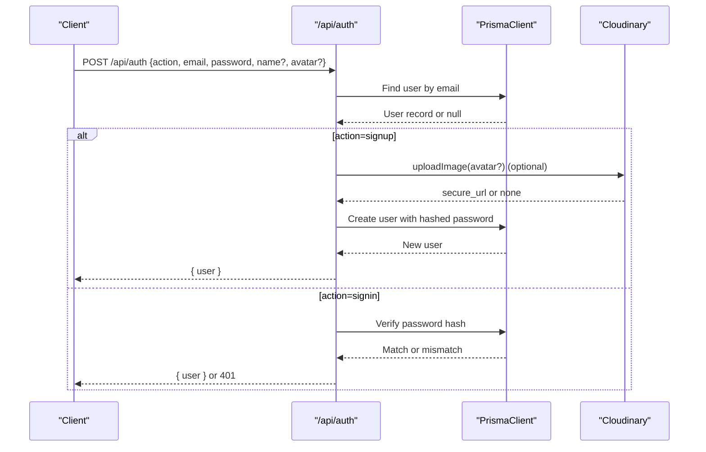

**Diagram sources**
- [app/api/auth/route.ts:16-65](file://app/api/auth/route.ts#L16-L65)
- [lib/db.ts:1-10](file://lib/db.ts#L1-L10)
- [lib/cloudinary.ts:9-18](file://lib/cloudinary.ts#L9-L18)

## Detailed Component Analysis

### Authentication Endpoints
- Endpoint: POST /api/auth
  - Purpose: Sign up or sign in a user.
  - Request body:
    - action: "signup" | "signin"
    - email: string
    - password: string
    - name: string (optional for signup)
    - avatar: string (optional base64 image for signup)
  - Responses:
    - 200: { user: { id, email, name, avatarUrl, role } }
    - 400: Missing email/password or invalid action.
    - 401: Invalid credentials (signin).
    - 409: Email already registered (signup).
    - 500: Internal server error.
  - Notes:
    - Password hashing uses SHA-256 with a fixed salt.
    - Avatar upload uses Cloudinary when provided.

- Endpoint: POST /api/auth/forgot
  - Purpose: Initiate password reset by sending a tokenized link.
  - Request body: { email: string }
  - Responses:
    - 200: { message: string } (safe message)
    - 400: Missing email.
    - 500: Internal server error.
  - Notes:
    - Deletes previous reset tokens for the user.
    - Sends an HTML email with a reset link built from NEXT_PUBLIC_APP_URL and token.

- Endpoint: POST /api/auth/reset
  - Purpose: Set a new password using a valid token.
  - Request body: { token: string, password: string }
  - Responses:
    - 200: { message: string }
    - 400: Missing token/password, invalid/expired token, or short password.
    - 500: Internal server error.
  - Notes:
    - Validates token expiration and deletes expired entries.
    - Updates user password hash and clears all reset tokens for the user.

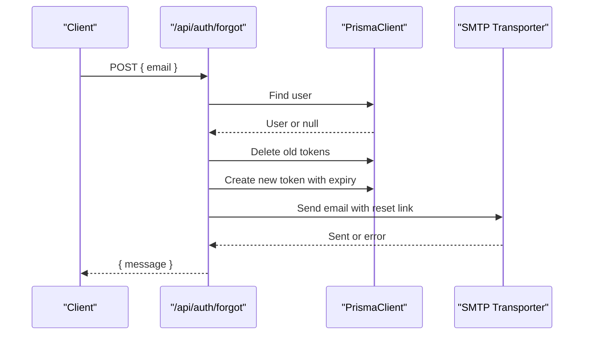

**Diagram sources**
- [app/api/auth/forgot/route.ts:6-62](file://app/api/auth/forgot/route.ts#L6-L62)
- [lib/db.ts:1-10](file://lib/db.ts#L1-L10)

**Section sources**
- [app/api/auth/route.ts:15-72](file://app/api/auth/route.ts#L15-L72)
- [app/api/auth/forgot/route.ts:5-67](file://app/api/auth/forgot/route.ts#L5-L67)
- [app/api/auth/reset/route.ts:13-47](file://app/api/auth/reset/route.ts#L13-L47)
- [lib/cloudinary.ts:9-18](file://lib/cloudinary.ts#L9-L18)
- [lib/db.ts:1-10](file://lib/db.ts#L1-L10)

### User Management Endpoints
- Endpoint: GET /api/admin/users
  - Purpose: List users with counts and optional search.
  - Query params:
    - search: string (case-insensitive name or email substring)
  - Responses:
    - 200: { users: [{ id, email, name, avatarUrl, role, createdAt, stats }] }
  - Notes:
    - stats include counts for liked songs, playlists, followed artists, and queue items.

- Endpoint: DELETE /api/admin/users
  - Purpose: Remove a user by ID.
  - Request body: { userId: string }
  - Responses:
    - 200: { success: true }
    - 400: Missing userId.
    - 500: Internal server error.

- Endpoint: PATCH /api/admin/users
  - Purpose: Update user attributes (role/name).
  - Request body: { userId: string, data: { role?: string, name?: string } }
  - Responses:
    - 200: { user: { id, email, name, role } }
    - 400: Missing userId.
    - 500: Internal server error.

- Endpoint: GET /api/admin/stats
  - Purpose: Retrieve system-wide metrics and recent users.
  - Responses:
    - 200: { totalUsers, totalLikes, totalPlaylists, totalFollows, totalQueued, recentUsers[] }

- Endpoint: POST /api/admin/seed
  - Purpose: Create a default admin user if not exists.
  - Responses:
    - 200: { message: string, userId?: string }
    - 500: Internal server error.

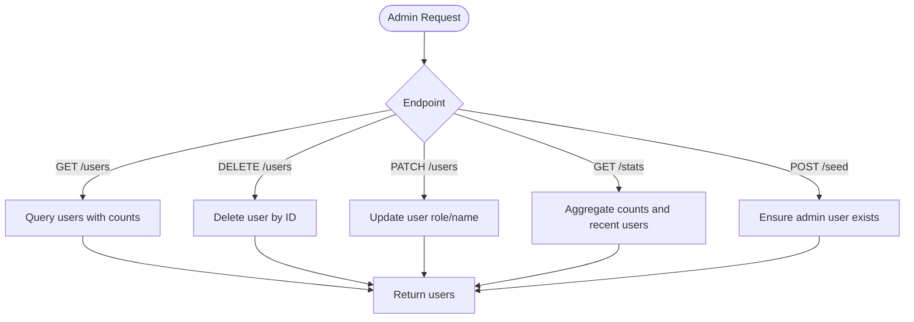

**Diagram sources**
- [app/api/admin/users/route.ts:4-74](file://app/api/admin/users/route.ts#L4-L74)
- [app/api/admin/stats/route.ts:4-27](file://app/api/admin/stats/route.ts#L4-L27)
- [app/api/admin/seed/route.ts:13-39](file://app/api/admin/seed/route.ts#L13-L39)

**Section sources**
- [app/api/admin/users/route.ts:4-74](file://app/api/admin/users/route.ts#L4-L74)
- [app/api/admin/stats/route.ts:4-27](file://app/api/admin/stats/route.ts#L4-L27)
- [app/api/admin/seed/route.ts:13-39](file://app/api/admin/seed/route.ts#L13-L39)

### Queue Management
- Endpoint: GET /api/queue
  - Purpose: Retrieve a user’s queue ordered by position.
  - Query params:
    - userId: string
  - Responses:
    - 200: { queue: [{ id, songId, songData, position }] }
    - 400: Missing userId.

- Endpoint: POST /api/queue
  - Purpose: Add an item or clear the queue.
  - Request body:
    - action: "add" | "clear"
    - userId: string
    - songId: string (required for add)
    - songData: object (optional)
  - Responses:
    - 200: { item } or { success: true }
    - 400: Missing userId/songId or invalid action.
    - 500: Internal server error.

- Endpoint: DELETE /api/queue
  - Purpose: Remove a specific queue item.
  - Request body:
    - id: string (optional)
    - userId: string + songId: string (alternative)
  - Responses:
    - 200: { success: true }
    - 400: Missing id or userId+songId.
    - 500: Internal server error.

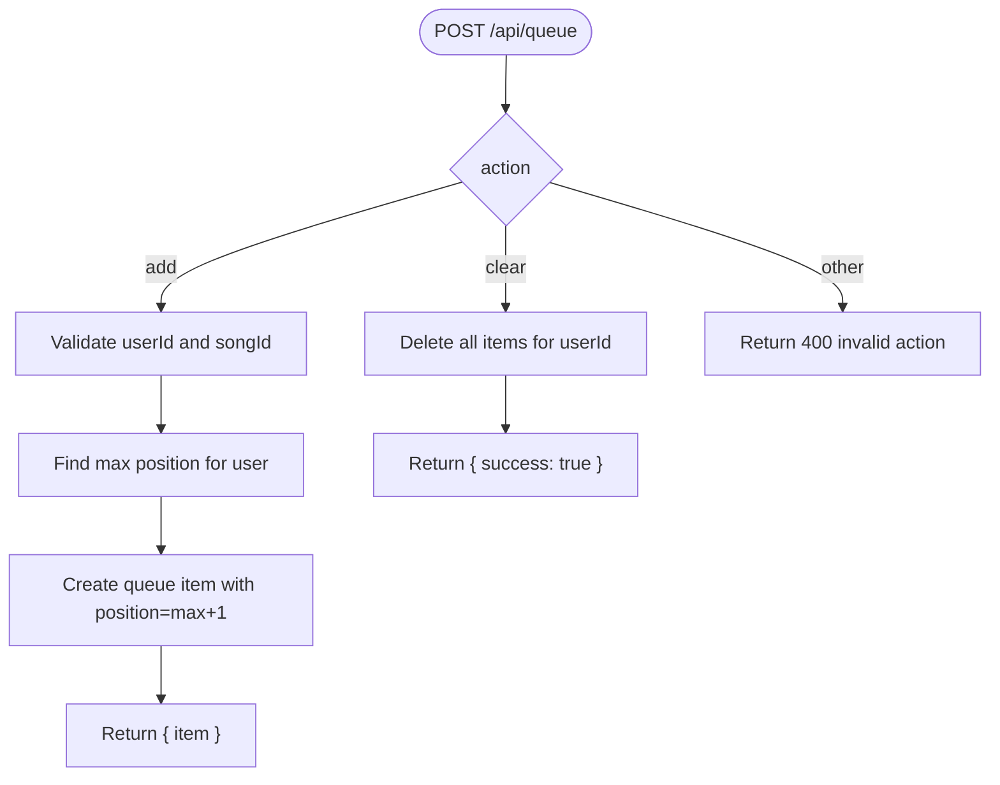

**Diagram sources**
- [app/api/queue/route.ts:24-65](file://app/api/queue/route.ts#L24-L65)

**Section sources**
- [app/api/queue/route.ts:4-85](file://app/api/queue/route.ts#L4-L85)

### Likes/Favorites
- Endpoint: GET /api/likes
  - Purpose: Retrieve a user’s liked song IDs.
  - Query params:
    - userId: string
  - Responses:
    - 200: { likes: [songId, ...] }
    - 400: Missing userId.

- Endpoint: POST /api/likes
  - Purpose: Like a song.
  - Request body: { userId: string, songId: string }
  - Responses:
    - 200: { success: true }
    - 400: Missing userId/songId.
    - 500: Internal server error (duplicate handled gracefully).
  - Notes:
    - Duplicate likes are ignored and return success.

- Endpoint: DELETE /api/likes
  - Purpose: Unlike a song.
  - Request body: { userId: string, songId: string }
  - Responses:
    - 200: { success: true }
    - 400: Missing userId/songId.
    - 500: Internal server error.

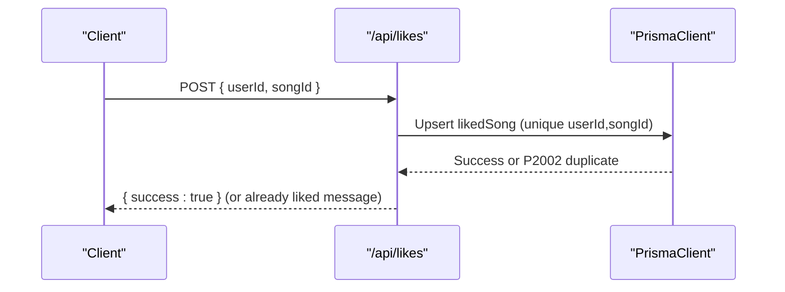

**Diagram sources**
- [app/api/likes/route.ts:17-35](file://app/api/likes/route.ts#L17-L35)

**Section sources**
- [app/api/likes/route.ts:4-54](file://app/api/likes/route.ts#L4-L54)

### Playlists
- Endpoint: GET /api/playlists
  - Purpose: Retrieve a user’s playlists with songs ordered by position.
  - Query params:
    - userId: string
  - Responses:
    - 200: { playlists: [...] }
    - 400: Missing userId.

- Endpoint: POST /api/playlists
  - Purpose: Create, add song, or remove song from a playlist.
  - Request body:
    - action: "create" | "addSong" | "removeSong"
    - For create: { userId, name, description?, coverUrl? }
    - For add/remove: { playlistId, songId }
  - Responses:
    - 200: { playlist } or { success: true }
    - 400: Missing required fields or invalid action.
    - 500: Internal server error (duplicates handled gracefully).
  - Notes:
    - Adding songs assigns position based on current max.

- Endpoint: DELETE /api/playlists
  - Purpose: Delete a playlist by ID.
  - Request body: { playlistId: string }
  - Responses:
    - 200: { success: true }
    - 400: Missing playlistId.
    - 500: Internal server error.

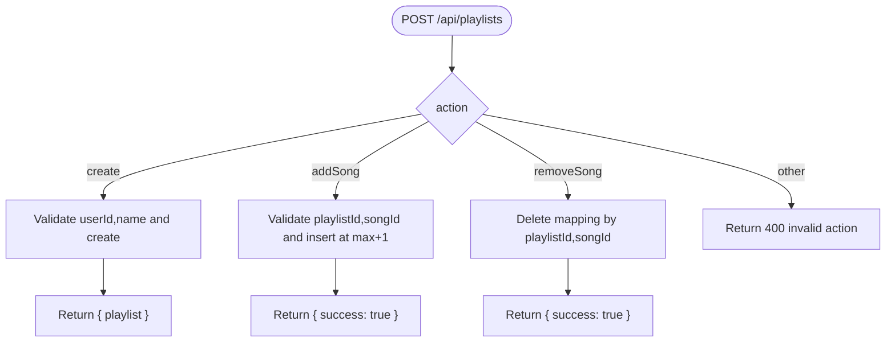

**Diagram sources**
- [app/api/playlists/route.ts:18-73](file://app/api/playlists/route.ts#L18-L73)

**Section sources**
- [app/api/playlists/route.ts:4-89](file://app/api/playlists/route.ts#L4-L89)

### Follow/Unfollow Artists
- Endpoint: GET /api/follows
  - Purpose: Retrieve a user’s followed artists.
  - Query params:
    - userId: string
  - Responses:
    - 200: { follows: [{ artistId, artistName, artistImage, createdAt }, ...] }
    - 400: Missing userId.

- Endpoint: POST /api/follows
  - Purpose: Follow an artist.
  - Request body: { userId: string, artistId: string, artistName?: string, artistImage?: string }
  - Responses:
    - 200: { follow: { artistId, ... } }
    - 400: Missing userId/artistId.
    - 500: Internal server error (duplicate handled gracefully).

- Endpoint: DELETE /api/follows
  - Purpose: Unfollow an artist.
  - Request body: { userId: string, artistId: string }
  - Responses:
    - 200: { success: true }
    - 400: Missing userId/artistId.
    - 500: Internal server error.

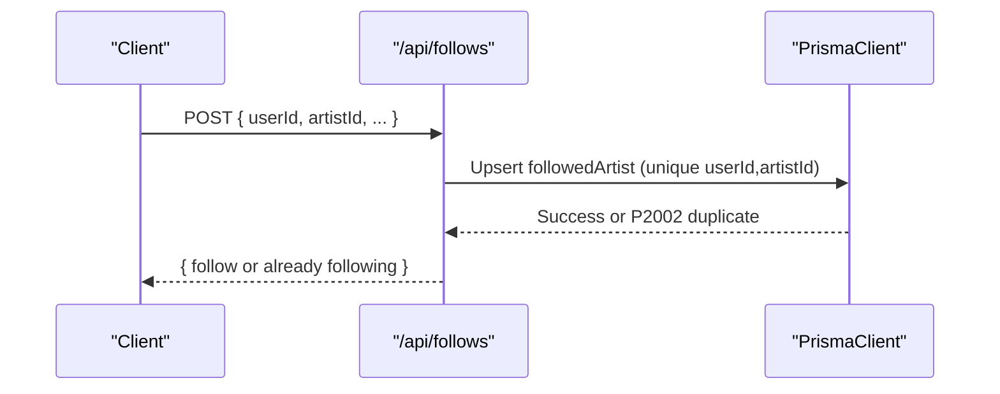

**Diagram sources**
- [app/api/follows/route.ts:17-35](file://app/api/follows/route.ts#L17-L35)

**Section sources**
- [app/api/follows/route.ts:4-54](file://app/api/follows/route.ts#L4-L54)

### Avatar Upload
- Endpoint: POST /api/upload
  - Purpose: Upload a base64 image to Cloudinary and return a secure URL.
  - Request body: { image: string, folder?: string }
  - Responses:
    - 200: { url: string }
    - 400: Missing image data.
    - 500: Upload failure.
  - Notes:
    - Default folder is "sonicstream/avatars".
    - Images are transformed to square 400x400 with face gravity and auto quality/format.

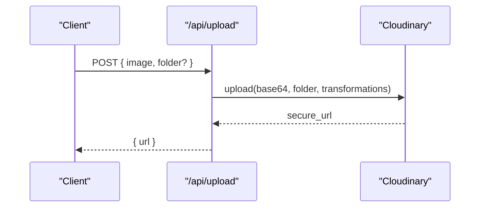

**Diagram sources**
- [app/api/upload/route.ts:4-18](file://app/api/upload/route.ts#L4-L18)
- [lib/cloudinary.ts:9-18](file://lib/cloudinary.ts#L9-L18)

**Section sources**
- [app/api/upload/route.ts:4-19](file://app/api/upload/route.ts#L4-L19)
- [lib/cloudinary.ts:9-18](file://lib/cloudinary.ts#L9-L18)

### Data Models Overview
The Prisma schema defines core entities and relationships used by the API.

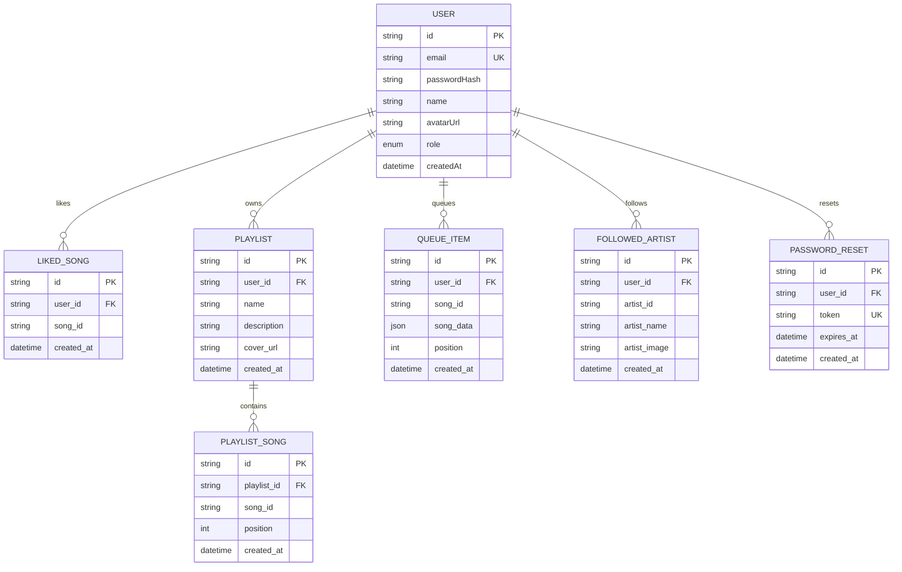

**Diagram sources**
- [prisma/schema.prisma:16-110](file://prisma/schema.prisma#L16-L110)

**Section sources**
- [prisma/schema.prisma:1-111](file://prisma/schema.prisma#L1-L111)

## Dependency Analysis
- API routes depend on lib/db.ts for PrismaClient initialization and on lib/cloudinary.ts for image uploads.
- Data model dependencies are defined in prisma/schema.prisma.
- Client-side guard hook hooks/useAuthGuard.ts integrates with frontend store to gate actions requiring authentication.

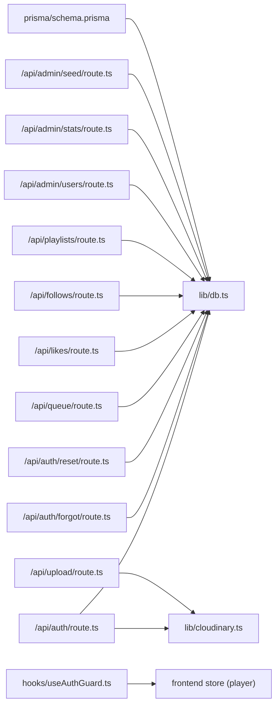

**Diagram sources**
- [app/api/auth/route.ts:1-73](file://app/api/auth/route.ts#L1-L73)
- [app/api/auth/forgot/route.ts:1-68](file://app/api/auth/forgot/route.ts#L1-L68)
- [app/api/auth/reset/route.ts:1-48](file://app/api/auth/reset/route.ts#L1-L48)
- [app/api/queue/route.ts:1-86](file://app/api/queue/route.ts#L1-L86)
- [app/api/likes/route.ts:1-55](file://app/api/likes/route.ts#L1-L55)
- [app/api/follows/route.ts:1-55](file://app/api/follows/route.ts#L1-L55)
- [app/api/playlists/route.ts:1-90](file://app/api/playlists/route.ts#L1-L90)
- [app/api/upload/route.ts:1-20](file://app/api/upload/route.ts#L1-L20)
- [app/api/admin/users/route.ts:1-75](file://app/api/admin/users/route.ts#L1-L75)
- [app/api/admin/stats/route.ts:1-28](file://app/api/admin/stats/route.ts#L1-L28)
- [app/api/admin/seed/route.ts:1-40](file://app/api/admin/seed/route.ts#L1-L40)
- [lib/db.ts:1-10](file://lib/db.ts#L1-L10)
- [lib/cloudinary.ts:1-21](file://lib/cloudinary.ts#L1-L21)
- [prisma/schema.prisma:1-111](file://prisma/schema.prisma#L1-L111)
- [hooks/useAuthGuard.ts:1-29](file://hooks/useAuthGuard.ts#L1-L29)

**Section sources**
- [lib/db.ts:1-10](file://lib/db.ts#L1-L10)
- [lib/cloudinary.ts:1-21](file://lib/cloudinary.ts#L1-L21)
- [prisma/schema.prisma:1-111](file://prisma/schema.prisma#L1-L111)
- [hooks/useAuthGuard.ts:1-29](file://hooks/useAuthGuard.ts#L1-L29)

## Performance Considerations
- Prefer batch operations where possible (e.g., fetching recent users in a single query).
- Use pagination for large lists (e.g., playlists) to avoid heavy payloads.
- Indexes on foreign keys and unique constraints (e.g., likedSong and followedArtist unique indices) reduce lookup costs.
- Minimize redundant queries by leveraging Prisma includes and ordering.

## Troubleshooting Guide
Common issues and resolutions:
- Authentication failures:
  - 400: Missing email/password or invalid action in auth requests.
  - 401: Invalid credentials during signin.
  - 409: Attempting to sign up with an existing email.
- Password reset:
  - 400: Missing token/password or invalid/expired token.
  - 500: Internal server errors during reset.
- Data manipulation:
  - 400: Missing required fields (userId, songId, playlistId).
  - 500: General failures; check Prisma error codes (e.g., P2002 for duplicates).
- Uploads:
  - 400: Missing image data.
  - 500: Upload failures; verify Cloudinary configuration and network.

Operational checks:
- Verify DATABASE_URL/DIRECT_URL and Cloudinary environment variables.
- Confirm SMTP settings for password reset emails.
- Ensure NEXT_PUBLIC_APP_URL is set for generating reset links.

**Section sources**
- [app/api/auth/route.ts:21-28](file://app/api/auth/route.ts#L21-L28)
- [app/api/auth/forgot/route.ts:8-14](file://app/api/auth/forgot/route.ts#L8-L14)
- [app/api/auth/reset/route.ts:17-31](file://app/api/auth/reset/route.ts#L17-L31)
- [app/api/queue/route.ts:30-37](file://app/api/queue/route.ts#L30-L37)
- [app/api/likes/route.ts:20-22](file://app/api/likes/route.ts#L20-L22)
- [app/api/follows/route.ts:20-22](file://app/api/follows/route.ts#L20-L22)
- [app/api/playlists/route.ts:24-27](file://app/api/playlists/route.ts#L24-L27)
- [app/api/upload/route.ts:9-10](file://app/api/upload/route.ts#L9-L10)
- [lib/cloudinary.ts:3-7](file://lib/cloudinary.ts#L3-L7)

## Conclusion
SonicStream’s API provides a cohesive set of endpoints for authentication, user data management, media interactions, and administrative operations. The design emphasizes clear request/response schemas, consistent status codes, and robust error handling. Integrating these endpoints into clients requires careful handling of user sessions, CSRF-safe password resets, and graceful duplicate handling for likes and follows.

## Appendices

### Practical Examples and Client Integration Patterns
- Authentication:
  - Onboarding: POST /api/auth with action=signup, optionally include avatar base64.
  - Login: POST /api/auth with action=signin.
  - Password reset: POST /api/auth/forgot with email; handle safe message; redirect to /reset-password with token; POST /api/auth/reset with token and new password.
- Queue:
  - Add item: POST /api/queue with action=add, userId, songId, optional songData.
  - Clear queue: POST /api/queue with action=clear and userId.
  - Remove item: DELETE /api/queue with id or userId+songId.
- Likes/Favorites:
  - Get liked songs: GET /api/likes?userId=...
  - Like: POST /api/likes with userId, songId.
  - Unlike: DELETE /api/likes with userId, songId.
- Playlists:
  - Get playlists: GET /api/playlists?userId=...
  - Create: POST /api/playlists with action=create and required fields.
  - Add song: POST /api/playlists with action=addSong.
  - Remove song: POST /api/playlists with action=removeSong.
  - Delete playlist: DELETE /api/playlists with playlistId.
- Follow/Unfollow:
  - Get follows: GET /api/follows?userId=...
  - Follow: POST /api/follows with userId, artistId, optional metadata.
  - Unfollow: DELETE /api/follows with userId, artistId.
- Upload:
  - POST /api/upload with image base64 and optional folder.
- Admin:
  - Seed admin: POST /api/admin/seed.
  - View stats: GET /api/admin/stats.
  - Manage users: GET /api/admin/users (with optional search), PATCH to update role/name, DELETE to remove.

### Status Code Reference
- 200 OK: Successful operation.
- 201 Created: Resource created.
- 400 Bad Request: Missing or invalid parameters.
- 401 Unauthorized: Invalid credentials or insufficient permissions.
- 409 Conflict: Duplicate resource.
- 500 Internal Server Error: Unexpected server error.