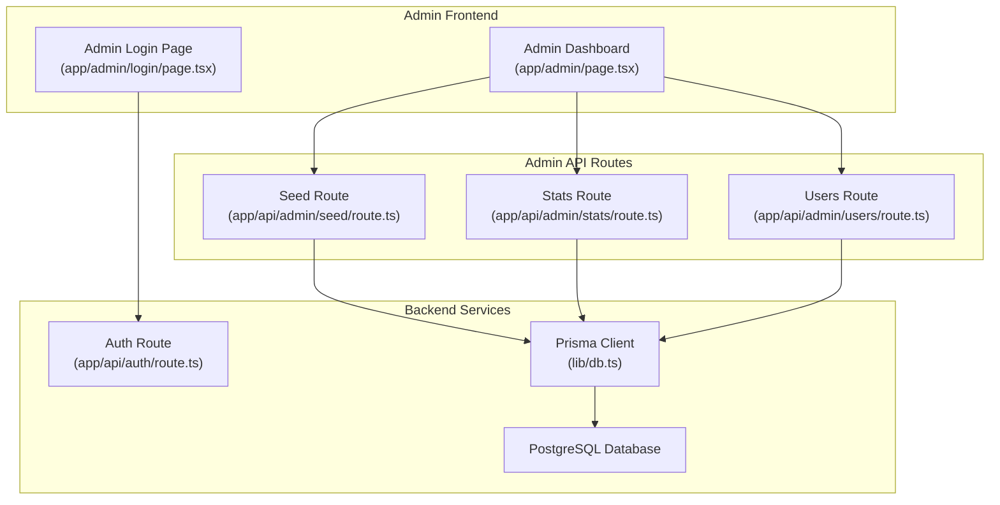
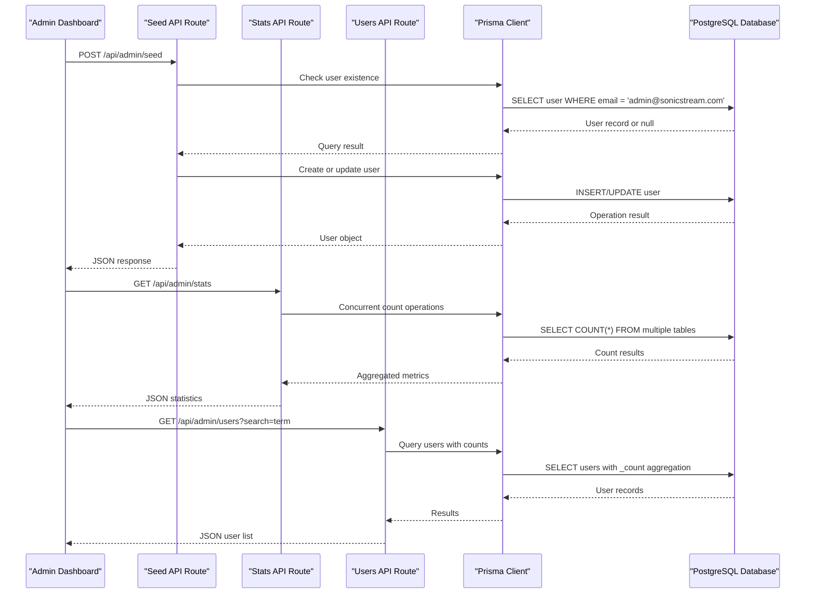
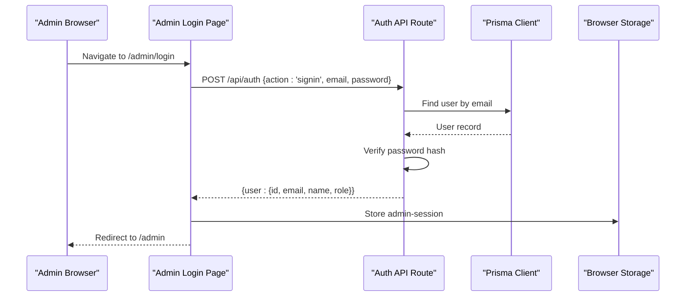
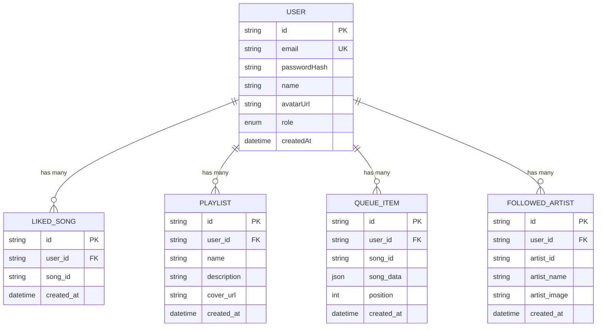
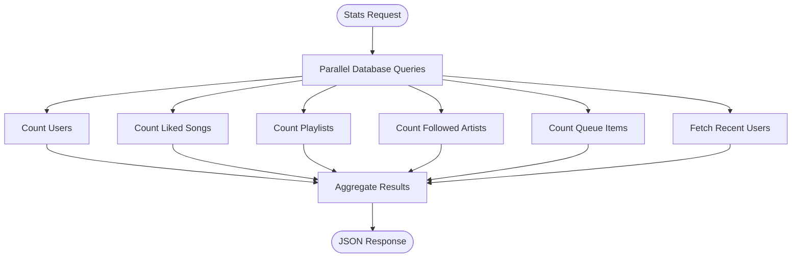
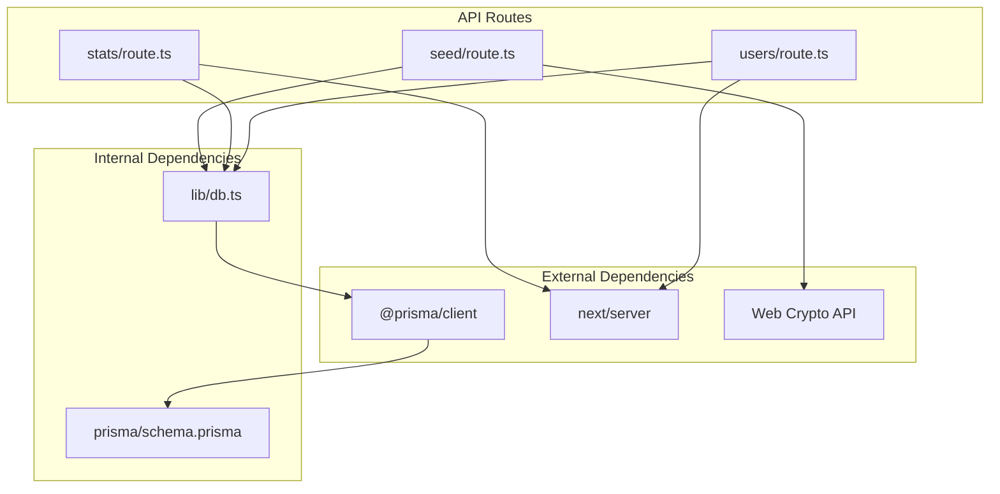

# Administrative APIs

<cite>
**Referenced Files in This Document**
- [seed/route.ts](file://app/api/admin/seed/route.ts)
- [stats/route.ts](file://app/api/admin/stats/route.ts)
- [users/route.ts](file://app/api/admin/users/route.ts)
- [db.ts](file://lib/db.ts)
- [schema.prisma](file://prisma/schema.prisma)
- [login/page.tsx](file://app/admin/login/page.tsx)
- [admin-dashboard/page.tsx](file://app/admin/page.tsx)
- [auth/route.ts](file://app/api/auth/route.ts)
- [usePlayerStore.ts](file://store/usePlayerStore.ts)
</cite>

## Table of Contents
1. [Introduction](#introduction)
2. [Project Structure](#project-structure)
3. [Core Components](#core-components)
4. [Architecture Overview](#architecture-overview)
5. [Detailed Component Analysis](#detailed-component-analysis)
6. [Dependency Analysis](#dependency-analysis)
7. [Performance Considerations](#performance-considerations)
8. [Troubleshooting Guide](#troubleshooting-guide)
9. [Conclusion](#conclusion)

## Introduction
This document provides comprehensive API documentation for SonicStream's administrative endpoints. It covers two primary administrative APIs:
- Data seeding endpoint for initializing the database with a default admin user
- Statistics endpoint for collecting system metrics and platform insights

The documentation includes request/response schemas, administrative access requirements, data generation patterns, monitoring capabilities, security considerations, and practical administrative workflows.

## Project Structure
The administrative APIs are implemented as Next.js App Router API routes under the `/app/api/admin` namespace. They integrate with Prisma ORM for database operations and leverage a simple local storage-based admin session mechanism.



**Diagram sources**
- [seed/route.ts:1-40](file://app/api/admin/seed/route.ts#L1-L40)
- [stats/route.ts:1-28](file://app/api/admin/stats/route.ts#L1-L28)
- [users/route.ts:1-74](file://app/api/admin/users/route.ts#L1-L74)
- [db.ts:1-10](file://lib/db.ts#L1-L10)
- [login/page.tsx:1-67](file://app/admin/login/page.tsx#L1-L67)
- [admin-dashboard/page.tsx:1-212](file://app/admin/page.tsx#L1-L212)

**Section sources**
- [seed/route.ts:1-40](file://app/api/admin/seed/route.ts#L1-L40)
- [stats/route.ts:1-28](file://app/api/admin/stats/route.ts#L1-L28)
- [users/route.ts:1-74](file://app/api/admin/users/route.ts#L1-L74)
- [db.ts:1-10](file://lib/db.ts#L1-L10)

## Core Components
This section documents the two primary administrative endpoints and their associated data models.

### Data Seeding Endpoint
The data seeding endpoint initializes the system with a default admin user account. It handles both creation of a new admin user and promotion of an existing user to admin role.

**Endpoint**: `POST /api/admin/seed`

**Request Body**: None (no parameters required)

**Response Schema**:
```json
{
  "message": "string",
  "userId"?: "string"
}
```

**Behavior**:
- Creates a default admin user with email `admin@sonicstream.com`
- Uses SHA-256 hashing with salt for password security
- Promotes existing users to ADMIN role if they already exist
- Returns success message and user ID upon creation

**Section sources**
- [seed/route.ts:13-39](file://app/api/admin/seed/route.ts#L13-L39)

### Statistics Endpoint
The statistics endpoint aggregates system metrics and platform insights across multiple data models.

**Endpoint**: `GET /api/admin/stats`

**Request Parameters**: None

**Response Schema**:
```json
{
  "totalUsers": number,
  "totalLikes": number,
  "totalPlaylists": number,
  "totalFollows": number,
  "totalQueued": number,
  "recentUsers": [
    {
      "id": "string",
      "name": "string",
      "email": "string",
      "createdAt": "string (ISO 8601)",
      "role": "string"
    }
  ]
}
```

**Data Collection Pattern**:
- Concurrently queries multiple count operations
- Retrieves recent users with basic profile information
- Aggregates metrics across User, LikedSong, Playlist, FollowedArtist, and QueueItem models

**Section sources**
- [stats/route.ts:4-27](file://app/api/admin/stats/route.ts#L4-L27)

### User Management Endpoint
The user management endpoint supports administrative operations for user accounts.

**Endpoint**: `GET /api/admin/users`

**Request Parameters**:
- `search`: Optional query parameter for filtering users by name or email

**Response Schema**:
```json
{
  "users": [
    {
      "id": "string",
      "email": "string",
      "name": "string",
      "avatarUrl": "string?",
      "role": "string",
      "createdAt": "string (ISO 8601)",
      "stats": {
        "likedSongs": number,
        "playlists": number,
        "followedArtists": number,
        "queueItems": number
      }
    }
  ]
}
```

**Section sources**
- [users/route.ts:4-39](file://app/api/admin/users/route.ts#L4-L39)

## Architecture Overview
The administrative API architecture follows a layered approach with clear separation of concerns between presentation, API routing, data access, and persistence.



**Diagram sources**
- [seed/route.ts:14-39](file://app/api/admin/seed/route.ts#L14-L39)
- [stats/route.ts:5-27](file://app/api/admin/stats/route.ts#L5-L27)
- [users/route.ts:5-39](file://app/api/admin/users/route.ts#L5-L39)
- [db.ts:1-10](file://lib/db.ts#L1-L10)

## Detailed Component Analysis

### Authentication and Authorization Flow
The administrative system uses a dual-layer authentication approach combining server-side authentication with client-side session management.



**Diagram sources**
- [login/page.tsx:15-38](file://app/admin/login/page.tsx#L15-L38)
- [auth/route.ts:51-65](file://app/api/auth/route.ts#L51-L65)

**Security Implementation Details**:
- Password hashing uses SHA-256 with a fixed salt (`sonicstream-salt-2024`)
- Session stored in browser localStorage with `admin-session` key
- Role-based access control enforced on frontend navigation
- Admin-only access validated during login process

**Section sources**
- [login/page.tsx:1-67](file://app/admin/login/page.tsx#L1-L67)
- [auth/route.ts:1-73](file://app/api/auth/route.ts#L1-L73)

### Data Models and Relationships
The administrative endpoints operate on the core User model and related associations defined in the Prisma schema.



**Diagram sources**
- [schema.prisma:16-110](file://prisma/schema.prisma#L16-L110)

**Section sources**
- [schema.prisma:1-111](file://prisma/schema.prisma#L1-L111)

### Database Operations and Performance
The administrative endpoints demonstrate efficient database operation patterns:

**Concurrent Operations Pattern**:
The statistics endpoint utilizes concurrent database queries to minimize response latency:



**Diagram sources**
- [stats/route.ts:6-17](file://app/api/admin/stats/route.ts#L6-L17)

**Section sources**
- [stats/route.ts:1-28](file://app/api/admin/stats/route.ts#L1-L28)

## Dependency Analysis
The administrative API components have clear dependency relationships and minimal coupling.



**Diagram sources**
- [seed/route.ts:1-2](file://app/api/admin/seed/route.ts#L1-L2)
- [stats/route.ts:1-2](file://app/api/admin/stats/route.ts#L1-L2)
- [users/route.ts:1-2](file://app/api/admin/users/route.ts#L1-L2)
- [db.ts:1-2](file://lib/db.ts#L1-L2)

**Section sources**
- [seed/route.ts:1-40](file://app/api/admin/seed/route.ts#L1-L40)
- [stats/route.ts:1-28](file://app/api/admin/stats/route.ts#L1-L28)
- [users/route.ts:1-74](file://app/api/admin/users/route.ts#L1-L74)

## Performance Considerations
The administrative endpoints are designed for optimal performance through several key strategies:

**Database Optimization**:
- Concurrent queries eliminate sequential bottlenecks
- Efficient count operations minimize database load
- Proper indexing on frequently queried fields (email, timestamps)

**Caching Strategy**:
- Client-side caching of admin dashboard data reduces server requests
- Local storage persistence avoids repeated authentication
- React Query integration provides automatic caching and refetching

**Scalability Recommendations**:
- Consider implementing rate limiting for administrative endpoints
- Add pagination for user listings in production environments
- Implement connection pooling for database operations
- Consider adding Redis caching for frequently accessed metrics

## Troubleshooting Guide

### Common Issues and Solutions

**Authentication Failures**:
- Verify admin credentials: `admin@sonicstream.com` / `admin123`
- Check browser localStorage for `admin-session` key
- Ensure proper role validation during login process

**Database Connection Problems**:
- Verify DATABASE_URL environment variable is configured
- Check Prisma client initialization in development vs production
- Monitor database connectivity and connection pool limits

**API Response Errors**:
- Seed endpoint returns 500 on database errors
- Stats endpoint handles concurrent operation failures gracefully
- Users endpoint validates required parameters before processing

**Data Integrity Issues**:
- Password hashing uses SHA-256 with salt for security
- Role-based access control prevents unauthorized modifications
- Atomic operations ensure data consistency during updates

**Section sources**
- [seed/route.ts:35-38](file://app/api/admin/seed/route.ts#L35-L38)
- [stats/route.ts:5-27](file://app/api/admin/stats/route.ts#L5-L27)
- [users/route.ts:42-74](file://app/api/admin/users/route.ts#L42-L74)

## Conclusion
The SonicStream administrative API provides a robust foundation for system administration with secure authentication, efficient data operations, and comprehensive monitoring capabilities. The modular design allows for easy extension while maintaining strong security boundaries around administrative functions.

Key strengths include:
- Secure admin authentication with role-based access control
- Efficient concurrent database operations for statistics collection
- Clear separation of concerns between authentication and administrative functions
- Practical session management using browser storage
- Extensible data models supporting future administrative features

The implementation demonstrates best practices for Next.js API routes, Prisma ORM usage, and React-based administrative interfaces while maintaining security and performance standards appropriate for a production music streaming platform.