# Authentication System

<cite>
**Referenced Files in This Document**
- [route.ts](file://app/api/auth/route.ts)
- [route.ts](file://app/api/auth/forgot/route.ts)
- [route.ts](file://app/api/auth/reset/route.ts)
- [page.tsx](file://app/admin/login/page.tsx)
- [page.tsx](file://app/reset-password/page.tsx)
- [AuthModal.tsx](file://components/AuthModal.tsx)
- [useAuthGuard.ts](file://hooks/useAuthGuard.ts)
- [usePlayerStore.ts](file://store/usePlayerStore.ts)
- [db.ts](file://lib/db.ts)
- [schema.prisma](file://prisma/schema.prisma)
- [package.json](file://package.json)
</cite>

## Table of Contents
1. [Introduction](#introduction)
2. [Project Structure](#project-structure)
3. [Core Components](#core-components)
4. [Architecture Overview](#architecture-overview)
5. [Detailed Component Analysis](#detailed-component-analysis)
6. [Dependency Analysis](#dependency-analysis)
7. [Performance Considerations](#performance-considerations)
8. [Troubleshooting Guide](#troubleshooting-guide)
9. [Conclusion](#conclusion)

## Introduction
This document provides comprehensive API documentation for SonicStream's authentication system. It covers the main authentication endpoint supporting sign-up and sign-in actions, the forgot password workflow, and the reset password completion. It also documents request/response schemas, authentication flows, error handling patterns, security considerations, and practical client-side integration examples. The system uses a custom SHA-256-based password hashing approach and stores user sessions in a browser state store.

## Project Structure
The authentication system spans API routes, frontend components, and state management:
- API endpoints under app/api/auth implement authentication logic and password reset workflows
- Frontend components integrate with these APIs for user interaction
- Zustand store persists user data locally for session management
- Prisma schema defines the underlying data model for users and password resets

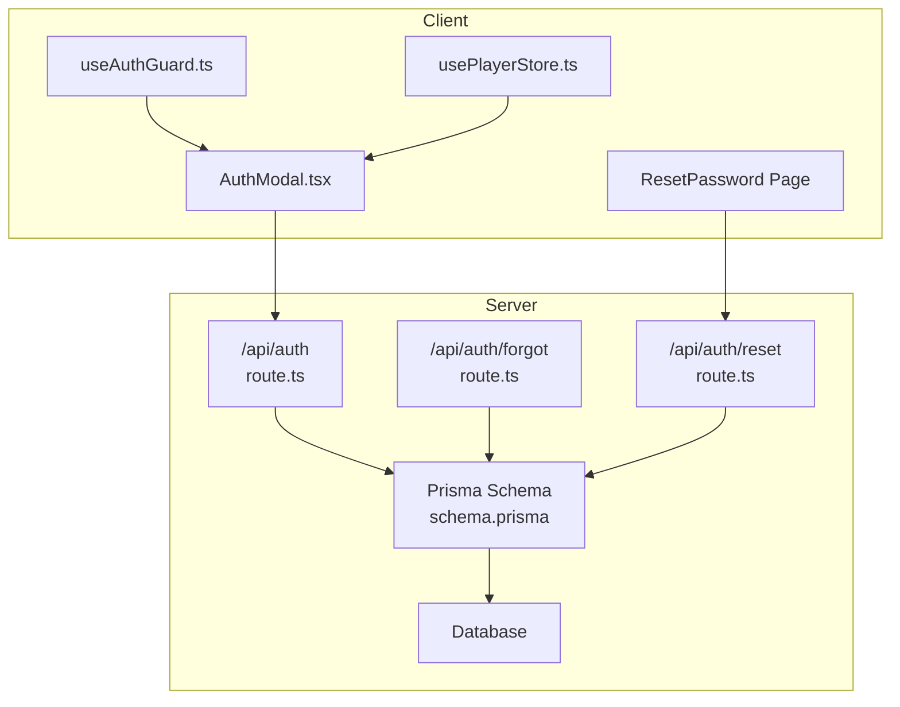

**Diagram sources**
- [route.ts:15-72](file://app/api/auth/route.ts#L15-L72)
- [route.ts:5-67](file://app/api/auth/forgot/route.ts#L5-L67)
- [route.ts:13-47](file://app/api/auth/reset/route.ts#L13-L47)
- [AuthModal.tsx:14-71](file://components/AuthModal.tsx#L14-L71)
- [page.tsx:8-40](file://app/reset-password/page.tsx#L8-L40)
- [useAuthGuard.ts:12-28](file://hooks/useAuthGuard.ts#L12-L28)
- [usePlayerStore.ts:43-127](file://store/usePlayerStore.ts#L43-L127)
- [schema.prisma:16-32](file://prisma/schema.prisma#L16-L32)

**Section sources**
- [route.ts:15-72](file://app/api/auth/route.ts#L15-L72)
- [route.ts:5-67](file://app/api/auth/forgot/route.ts#L5-L67)
- [route.ts:13-47](file://app/api/auth/reset/route.ts#L13-L47)
- [AuthModal.tsx:14-71](file://components/AuthModal.tsx#L14-L71)
- [page.tsx:8-40](file://app/reset-password/page.tsx#L8-L40)
- [useAuthGuard.ts:12-28](file://hooks/useAuthGuard.ts#L12-L28)
- [usePlayerStore.ts:43-127](file://store/usePlayerStore.ts#L43-L127)
- [schema.prisma:16-32](file://prisma/schema.prisma#L16-L32)

## Core Components
- Main Authentication Endpoint: Handles sign-up and sign-in actions with email/password validation and user registration
- Forgot Password Endpoint: Initiates password reset by generating a secure token and sending an email
- Reset Password Endpoint: Completes password changes after validating the token and ensuring password strength
- Client-Side Integration: AuthModal for user interaction and useAuthGuard hook for protected actions
- Session Management: Zustand store persists user data locally for session continuity

**Section sources**
- [route.ts:15-72](file://app/api/auth/route.ts#L15-L72)
- [route.ts:5-67](file://app/api/auth/forgot/route.ts#L5-L67)
- [route.ts:13-47](file://app/api/auth/reset/route.ts#L13-L47)
- [AuthModal.tsx:14-71](file://components/AuthModal.tsx#L14-L71)
- [useAuthGuard.ts:12-28](file://hooks/useAuthGuard.ts#L12-L28)
- [usePlayerStore.ts:43-127](file://store/usePlayerStore.ts#L43-L127)

## Architecture Overview
The authentication system follows a straightforward request-response pattern:
- Client sends requests to Next.js API routes
- Routes validate inputs, interact with Prisma for persistence, and return structured JSON responses
- Frontend components update local state and guide users through authentication flows

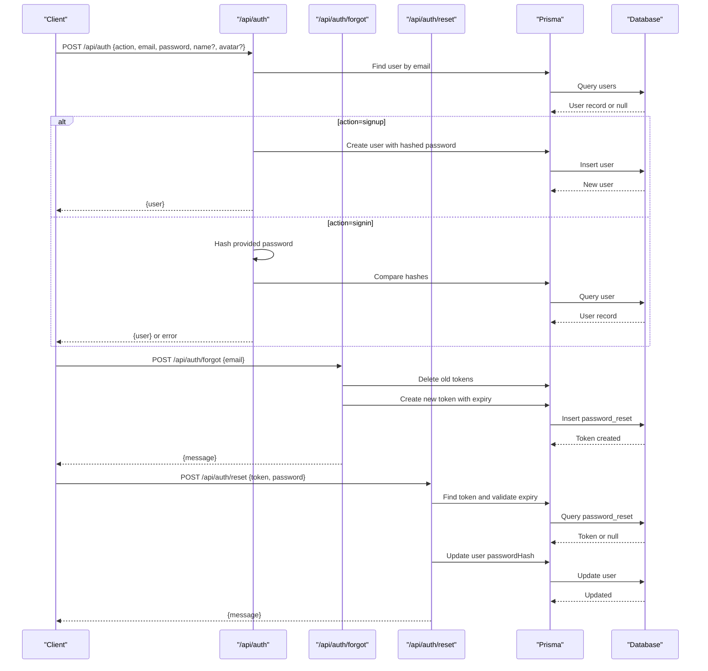

**Diagram sources**
- [route.ts:15-72](file://app/api/auth/route.ts#L15-L72)
- [route.ts:5-67](file://app/api/auth/forgot/route.ts#L5-L67)
- [route.ts:13-47](file://app/api/auth/reset/route.ts#L13-L47)
- [schema.prisma:16-32](file://prisma/schema.prisma#L16-L32)

## Detailed Component Analysis

### Main Authentication Endpoint (/api/auth)
Purpose: Accepts sign-up and sign-in actions with email/password validation and user registration.

- Request Schema
  - action: "signup" | "signin"
  - email: string (required)
  - password: string (required)
  - name: string (optional, used for sign-up)
  - avatar: string (optional base64 image, uploaded via Cloudinary)

- Response Schema
  - On success: { user: { id, email, name, avatarUrl, role } }
  - On errors:
    - 400: Missing fields or invalid action
    - 401: Invalid credentials
    - 409: Email already registered
    - 500: Internal server error

- Processing Logic
  - Validates presence of email and password
  - For sign-up:
    - Checks uniqueness of email
    - Optionally uploads avatar to Cloudinary
    - Hashes password using custom SHA-256 with salt
    - Creates user record with default role USER
  - For sign-in:
    - Retrieves user by email
    - Hashes provided password and compares with stored hash
    - Returns user data on successful authentication

- Security Considerations
  - Uses a custom SHA-256-based hashing approach with a fixed salt
  - Passwords are validated for minimum length during sign-up
  - Email uniqueness prevents duplicate accounts

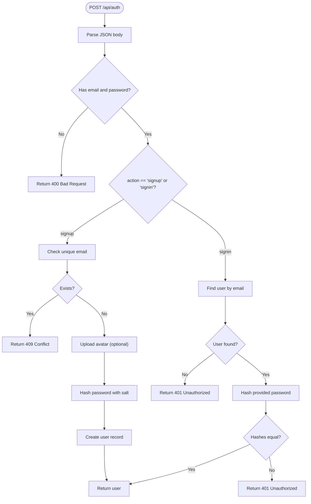

**Diagram sources**
- [route.ts:15-72](file://app/api/auth/route.ts#L15-L72)

**Section sources**
- [route.ts:15-72](file://app/api/auth/route.ts#L15-L72)

### Forgot Password Endpoint (/api/auth/forgot)
Purpose: Initiates password reset by generating a secure token and sending an email.

- Request Schema
  - email: string (required)

- Response Schema
  - On success: { message: string }
  - On errors: 400 (missing email), 500 (internal error)

- Processing Logic
  - Validates presence of email
  - Finds user by email (does not expose existence)
  - Cleans previous reset tokens for the user
  - Generates a random token and sets expiry (1 hour)
  - Stores token in database
  - Attempts to send an email with a reset link containing the token
  - Returns a generic message regardless of email delivery outcome

- Security Considerations
  - Uses cryptographically secure random bytes for tokens
  - Enforces 1-hour expiry window
  - Avoids leaking whether an email exists by returning the same message for missing users
  - SMTP configuration is loaded from environment variables

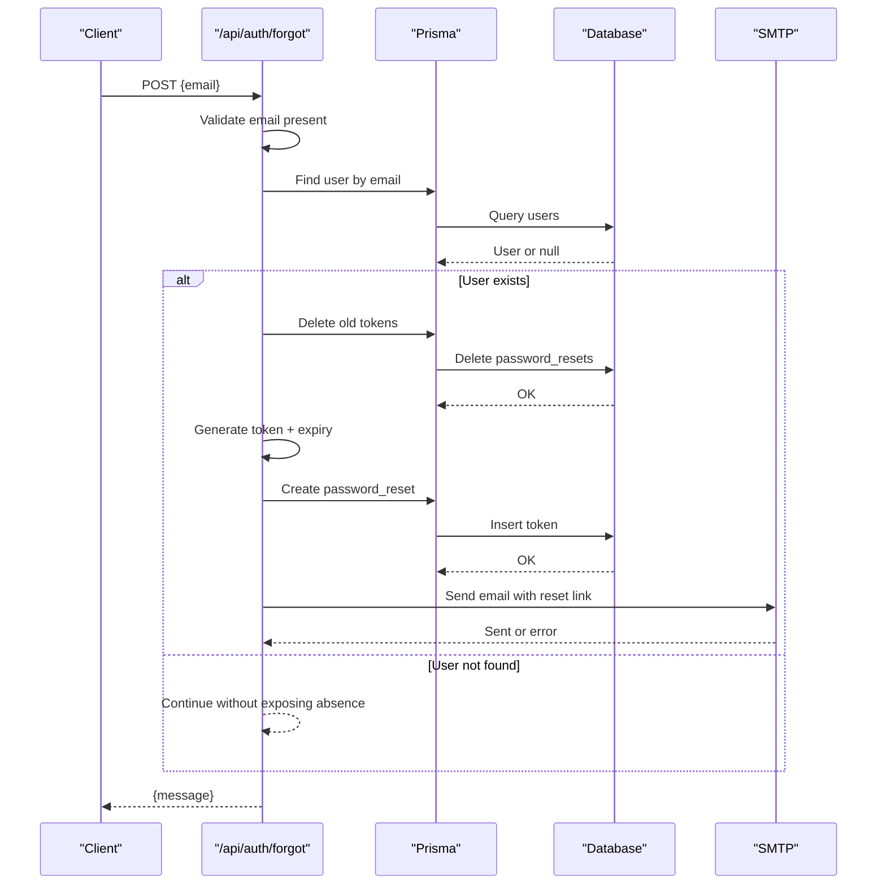

**Diagram sources**
- [route.ts:5-67](file://app/api/auth/forgot/route.ts#L5-L67)
- [schema.prisma:100-110](file://prisma/schema.prisma#L100-L110)

**Section sources**
- [route.ts:5-67](file://app/api/auth/forgot/route.ts#L5-L67)
- [schema.prisma:100-110](file://prisma/schema.prisma#L100-L110)

### Reset Password Endpoint (/api/auth/reset)
Purpose: Completes password reset by validating the token and updating the user's password.

- Request Schema
  - token: string (required)
  - password: string (required, minimum 6 characters)

- Response Schema
  - On success: { message: string }
  - On errors:
    - 400: Missing token/password, invalid/expired token, password too short
    - 500: Internal server error

- Processing Logic
  - Validates presence of token and password length
  - Retrieves token from database
  - Checks token existence and expiry; deletes expired tokens
  - Hashes the new password using the same custom scheme
  - Updates the user's passwordHash
  - Cleans up all reset tokens for the user
  - Returns success message

- Security Considerations
  - Enforces minimum password length
  - Strict token validation with expiry enforcement
  - One-time use via cleanup after successful reset

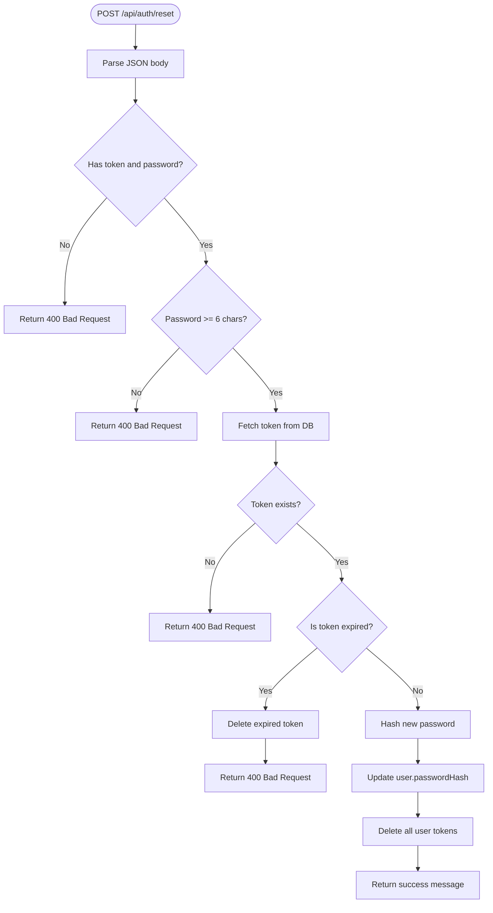

**Diagram sources**
- [route.ts:13-47](file://app/api/auth/reset/route.ts#L13-L47)

**Section sources**
- [route.ts:13-47](file://app/api/auth/reset/route.ts#L13-L47)

### Client-Side Integration Examples

#### Using AuthModal for Sign-Up/Sign-In
- AuthModal triggers /api/auth with appropriate action
- On success, updates Zustand store user and shows a toast
- Supports switching between sign-up and sign-in modes

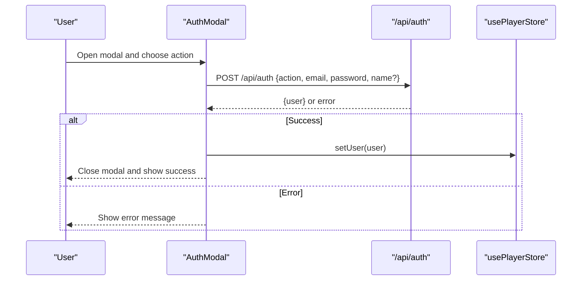

**Diagram sources**
- [AuthModal.tsx:26-50](file://components/AuthModal.tsx#L26-L50)
- [usePlayerStore.ts:114-114](file://store/usePlayerStore.ts#L114-L114)

**Section sources**
- [AuthModal.tsx:26-50](file://components/AuthModal.tsx#L26-L50)
- [usePlayerStore.ts:114-114](file://store/usePlayerStore.ts#L114-L114)

#### Protected Actions with useAuthGuard
- useAuthGuard checks if user exists in store
- If not logged in, it opens the AuthModal
- If logged in, executes the provided action

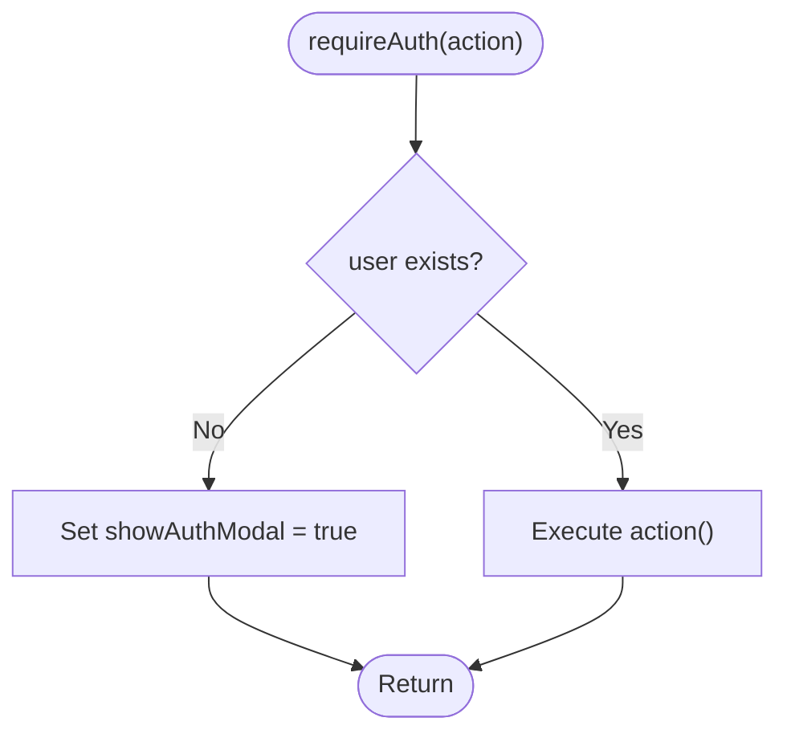

**Diagram sources**
- [useAuthGuard.ts:16-25](file://hooks/useAuthGuard.ts#L16-L25)

**Section sources**
- [useAuthGuard.ts:16-25](file://hooks/useAuthGuard.ts#L16-L25)

#### Admin Login Flow
- AdminLoginPage uses /api/auth for sign-in
- Verifies user role is ADMIN
- Persists admin session in localStorage

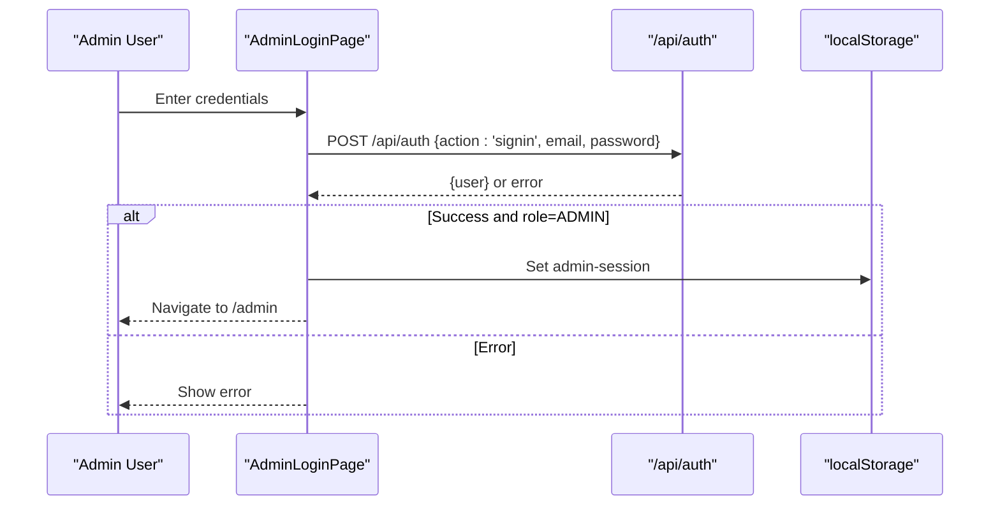

**Diagram sources**
- [page.tsx:15-38](file://app/admin/login/page.tsx#L15-L38)

**Section sources**
- [page.tsx:15-38](file://app/admin/login/page.tsx#L15-L38)

#### Password Reset Flow
- ResetPassword page validates passwords client-side
- Submits token and new password to /api/auth/reset
- Shows success state and toast on completion

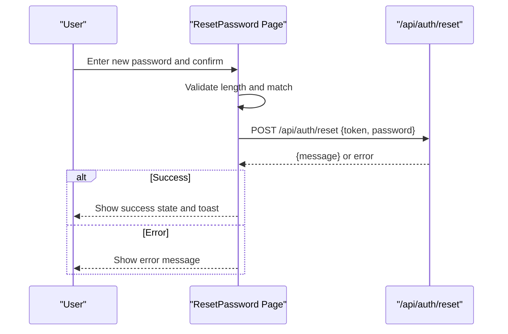

**Diagram sources**
- [page.tsx:19-40](file://app/reset-password/page.tsx#L19-L40)
- [route.ts:13-47](file://app/api/auth/reset/route.ts#L13-L47)

**Section sources**
- [page.tsx:19-40](file://app/reset-password/page.tsx#L19-L40)
- [route.ts:13-47](file://app/api/auth/reset/route.ts#L13-L47)

### Data Model and Persistence
The authentication system relies on Prisma models for users and password resets.

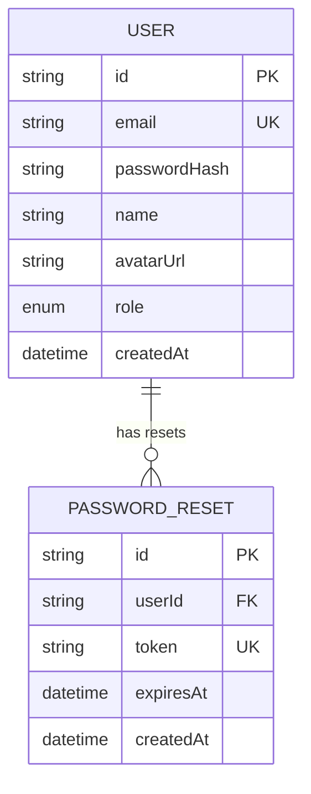

**Diagram sources**
- [schema.prisma:16-32](file://prisma/schema.prisma#L16-L32)
- [schema.prisma:100-110](file://prisma/schema.prisma#L100-L110)

**Section sources**
- [schema.prisma:16-32](file://prisma/schema.prisma#L16-L32)
- [schema.prisma:100-110](file://prisma/schema.prisma#L100-L110)

## Dependency Analysis
External dependencies relevant to authentication:
- Prisma Client for database operations
- Nodemailer for sending password reset emails
- Cloudinary for avatar uploads (via uploadImage utility)
- Crypto primitives for password hashing and token generation

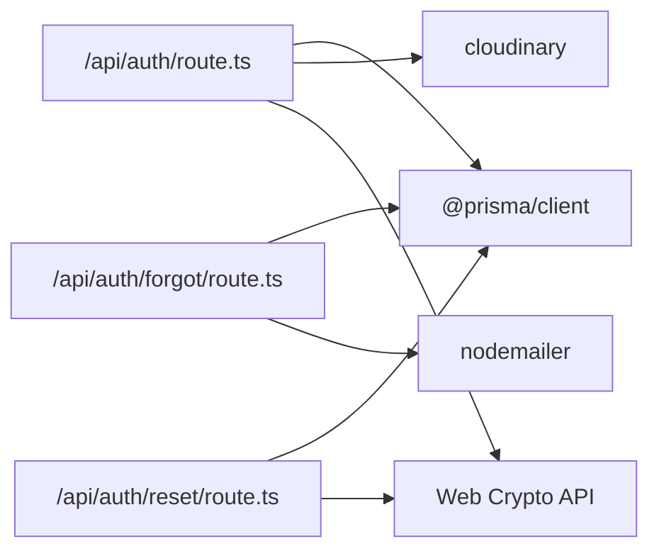

**Diagram sources**
- [route.ts:1-3](file://app/api/auth/route.ts#L1-L3)
- [route.ts:1-3](file://app/api/auth/forgot/route.ts#L1-L3)
- [route.ts:1-2](file://app/api/auth/reset/route.ts#L1-L2)
- [package.json:16-35](file://package.json#L16-L35)

**Section sources**
- [route.ts:1-3](file://app/api/auth/route.ts#L1-L3)
- [route.ts:1-3](file://app/api/auth/forgot/route.ts#L1-L3)
- [route.ts:1-2](file://app/api/auth/reset/route.ts#L1-L2)
- [package.json:16-35](file://package.json#L16-L35)

## Performance Considerations
- Password hashing is performed synchronously on the server; consider offloading to a worker or using a more efficient hashing library for high throughput
- Email sending is attempted but failures are logged and do not block the response; ensure retry mechanisms or monitoring for delivery failures
- Avatar uploads depend on external Cloudinary service; implement timeouts and fallbacks for robustness
- Token cleanup is performed per operation; ensure database indexes exist on token and user ID for optimal lookup performance

## Troubleshooting Guide
Common issues and resolutions:
- Invalid credentials (401): Verify email and password match stored records; ensure hashing consistency
- Email already registered (409): Prompt user to sign in or use a different email
- Invalid or expired reset link (400): Inform user to request a new reset link; check token expiry
- Password too short (400): Enforce minimum length validation before submission
- Internal server error (500): Review server logs for stack traces; check database connectivity and SMTP configuration

Operational checks:
- Confirm Prisma client initialization and database connection
- Validate SMTP environment variables for email delivery
- Ensure Cloudinary upload permissions and base64 avatar format
- Monitor token cleanup jobs to prevent orphaned reset entries

**Section sources**
- [route.ts:68-71](file://app/api/auth/route.ts#L68-L71)
- [route.ts:63-66](file://app/api/auth/forgot/route.ts#L63-L66)
- [route.ts:43-46](file://app/api/auth/reset/route.ts#L43-L46)

## Conclusion
SonicStream's authentication system provides a clear, modular approach to user registration, sign-in, and password reset. While the current implementation uses a custom hashing scheme suitable for demos, production deployments should adopt industry-standard libraries for stronger cryptographic guarantees. The client-side components integrate seamlessly with the backend, offering a smooth user experience for authentication flows. Proper environment configuration and operational monitoring are essential for reliable authentication and password reset functionality.