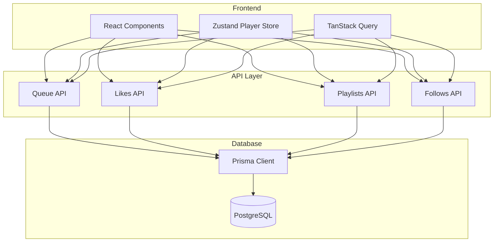
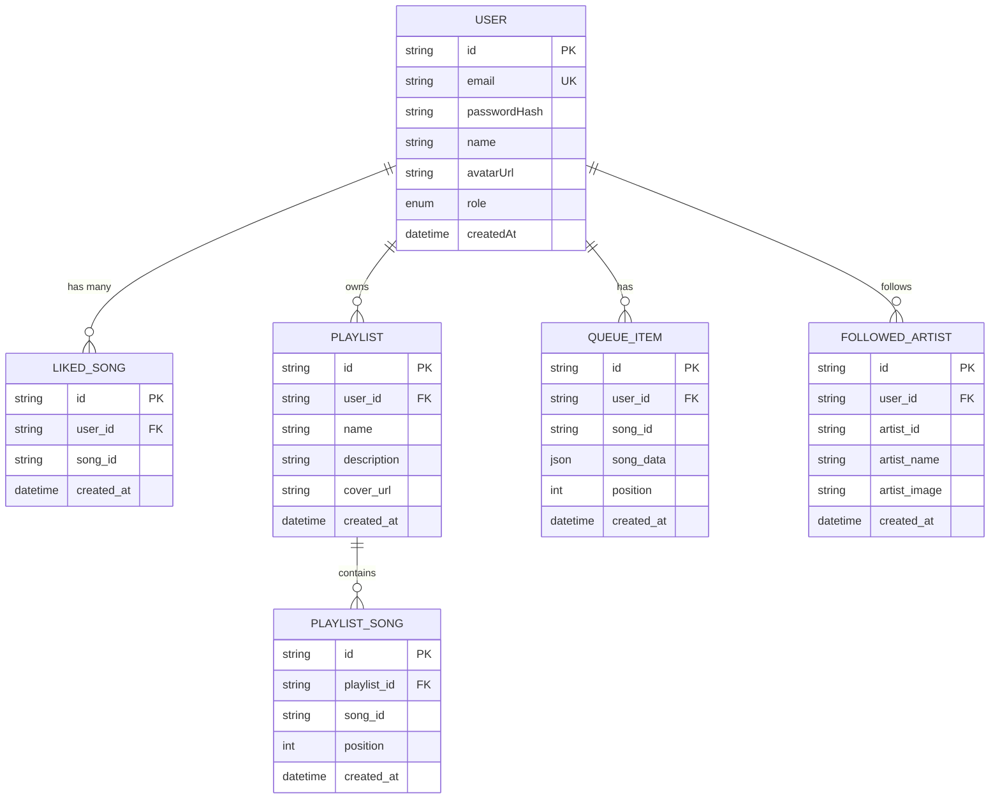
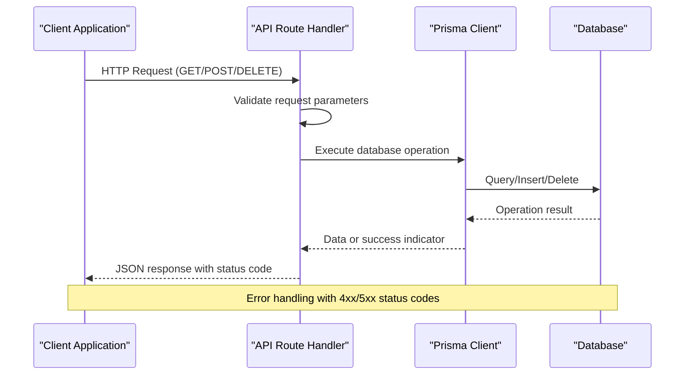
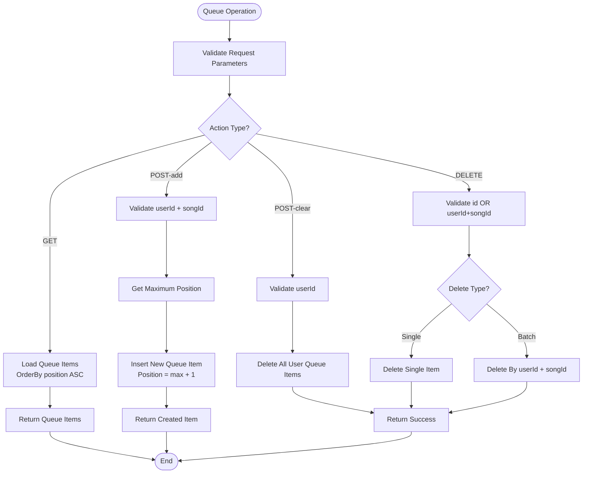
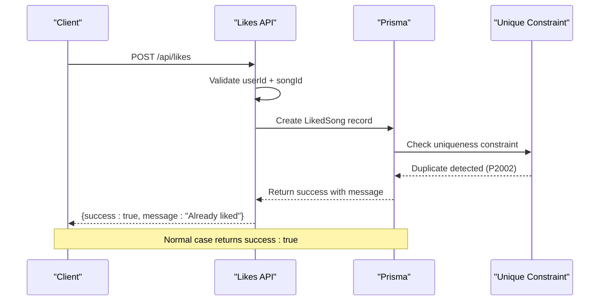
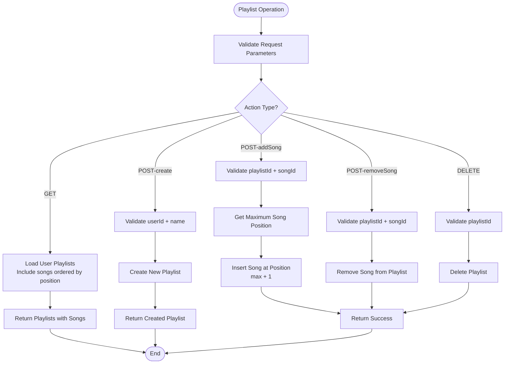
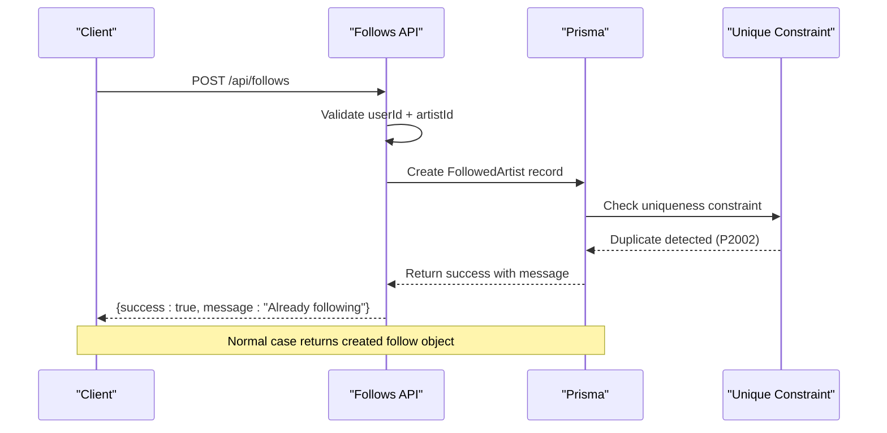

# Content Operations

<cite>
**Referenced Files in This Document**
- [route.ts](file://app/api/queue/route.ts)
- [route.ts](file://app/api/likes/route.ts)
- [route.ts](file://app/api/playlists/route.ts)
- [route.ts](file://app/api/follows/route.ts)
- [db.ts](file://lib/db.ts)
- [schema.prisma](file://prisma/schema.prisma)
- [usePlayerStore.ts](file://store/usePlayerStore.ts)
- [AddToPlaylistModal.tsx](file://components/AddToPlaylistModal.tsx)
- [CreatePlaylistModal.tsx](file://components/CreatePlaylistModal.tsx)
- [page.tsx](file://app/artist/[id]/page.tsx)
- [page.tsx](file://app/library/playlists/[id]/page.tsx)
- [page.tsx](file://app/library/playlists/page.tsx)
- [api.ts](file://lib/api.ts)
</cite>

## Table of Contents
1. [Introduction](#introduction)
2. [Project Structure](#project-structure)
3. [Core Components](#core-components)
4. [Architecture Overview](#architecture-overview)
5. [Detailed Component Analysis](#detailed-component-analysis)
6. [Dependency Analysis](#dependency-analysis)
7. [Performance Considerations](#performance-considerations)
8. [Troubleshooting Guide](#troubleshooting-guide)
9. [Conclusion](#conclusion)

## Introduction
This document provides comprehensive API documentation for SonicStream's content interaction endpoints. It covers queue management operations for song playback queues, like/favorite operations for user preferences, playlist CRUD operations, and follow/unfollow functionality for artist social connections. The documentation includes request/response schemas, data validation, error handling, and integration patterns with the frontend components.

## Project Structure
The API endpoints are implemented as Next.js App Router API routes located under `app/api/`. Each endpoint corresponds to a specific content operation:
- Queue management: `app/api/queue/route.ts`
- Like/favorite: `app/api/likes/route.ts`
- Playlist CRUD: `app/api/playlists/route.ts`
- Follow/unfollow: `app/api/follows/route.ts`

The backend uses Prisma ORM with PostgreSQL for data persistence, and the frontend integrates with these APIs through React components and Zustand stores.



**Diagram sources**
- [route.ts:1-86](file://app/api/queue/route.ts#L1-L86)
- [route.ts:1-55](file://app/api/likes/route.ts#L1-L55)
- [route.ts:1-90](file://app/api/playlists/route.ts#L1-L90)
- [route.ts:1-55](file://app/api/follows/route.ts#L1-L55)
- [db.ts:1-10](file://lib/db.ts#L1-L10)

**Section sources**
- [route.ts:1-86](file://app/api/queue/route.ts#L1-L86)
- [route.ts:1-55](file://app/api/likes/route.ts#L1-L55)
- [route.ts:1-90](file://app/api/playlists/route.ts#L1-L90)
- [route.ts:1-55](file://app/api/follows/route.ts#L1-L55)

## Core Components

### Database Schema Overview
The application uses a relational schema with four main content interaction models:



**Diagram sources**
- [schema.prisma:16-98](file://prisma/schema.prisma#L16-L98)

**Section sources**
- [schema.prisma:16-98](file://prisma/schema.prisma#L16-L98)

## Architecture Overview

### API Request Flow
Each API endpoint follows a consistent pattern: validate request parameters, perform database operations, and return standardized JSON responses with appropriate HTTP status codes.



**Diagram sources**
- [route.ts:24-66](file://app/api/queue/route.ts#L24-L66)
- [route.ts:17-36](file://app/api/likes/route.ts#L17-L36)
- [route.ts:18-74](file://app/api/playlists/route.ts#L18-L74)
- [route.ts:17-36](file://app/api/follows/route.ts#L17-L36)

## Detailed Component Analysis

### Queue Management API (/api/queue)

#### Endpoint Specifications
- **GET** `/api/queue?userId={userId}` - Retrieve user's queue
- **POST** `/api/queue` - Add to or clear queue
- **DELETE** `/api/queue` - Remove from queue

#### Request Schemas

**GET Request:**
- Query Parameters:
  - `userId` (string, required): User identifier

**POST Request:**
- Body (for add action):
  - `action` (string, required): Must be "add"
  - `userId` (string, required): User identifier
  - `songId` (string, required): Song identifier
  - `songData` (object, optional): Additional song metadata (defaults to empty object)

- Body (for clear action):
  - `action` (string, required): Must be "clear"
  - `userId` (string, required): User identifier

**DELETE Request:**
- Body:
  - Option A: `{ id: string }` (single item removal)
  - Option B: `{ userId: string, songId: string }` (batch removal)

#### Response Schemas

**GET Response:**
```json
{
  "queue": [
    {
      "id": "string",
      "songId": "string",
      "songData": object,
      "position": number
    }
  ]
}
```

**POST Response (add):**
```json
{
  "item": {
    "id": "string",
    "userId": "string",
    "songId": "string",
    "songData": object,
    "position": number
  }
}
```

**POST Response (clear):**
```json
{
  "success": true
}
```

**DELETE Response:**
```json
{
  "success": true
}
```

#### Processing Logic



**Diagram sources**
- [route.ts:4-22](file://app/api/queue/route.ts#L4-L22)
- [route.ts:24-66](file://app/api/queue/route.ts#L24-L66)
- [route.ts:68-86](file://app/api/queue/route.ts#L68-L86)

#### Error Handling
- Validation errors return 400 status with error message
- Database failures return 500 status with failure message
- Duplicate entries handled gracefully (no error thrown)

#### Frontend Integration
The queue API integrates with the player store for persistent queue management and with React components for UI updates.

**Section sources**
- [route.ts:1-86](file://app/api/queue/route.ts#L1-L86)
- [usePlayerStore.ts:1-128](file://store/usePlayerStore.ts#L1-L128)

### Like/Favorite API (/api/likes)

#### Endpoint Specifications
- **GET** `/api/likes?userId={userId}` - List user's liked songs
- **POST** `/api/likes` - Add song to favorites
- **DELETE** `/api/likes` - Remove song from favorites

#### Request Schemas

**GET Request:**
- Query Parameters:
  - `userId` (string, required): User identifier

**POST Request:**
- Body:
  - `userId` (string, required): User identifier
  - `songId` (string, required): Song identifier

**DELETE Request:**
- Body:
  - `userId` (string, required): User identifier
  - `songId` (string, required): Song identifier

#### Response Schemas

**GET Response:**
```json
{
  "likes": ["string", "string", ...]
}
```

**POST Response:**
```json
{
  "success": true,
  "message"?: "Already liked"
}
```

**DELETE Response:**
```json
{
  "success": true
}
```

#### Processing Logic



**Diagram sources**
- [route.ts:17-36](file://app/api/likes/route.ts#L17-L36)

#### Error Handling
- Prisma unique constraint (P2002) is caught and returns success with informational message
- Other database errors return 500 status

#### Frontend Integration
The likes API integrates with the player store's favorites state and with React components for UI feedback.

**Section sources**
- [route.ts:1-55](file://app/api/likes/route.ts#L1-L55)
- [usePlayerStore.ts:104-108](file://store/usePlayerStore.ts#L104-L108)

### Playlist CRUD API (/api/playlists)

#### Endpoint Specifications
- **GET** `/api/playlists?userId={userId}` - List user's playlists
- **POST** `/api/playlists` - Create, add song, or remove song from playlist
- **DELETE** `/api/playlists` - Delete playlist

#### Request Schemas

**GET Request:**
- Query Parameters:
  - `userId` (string, required): User identifier

**POST Request:**
- Body (for create action):
  - `action` (string, required): Must be "create"
  - `userId` (string, required): User identifier
  - `name` (string, required): Playlist name
  - `description` (string, optional): Playlist description
  - `coverUrl` (string, optional): Cover image URL

- Body (for addSong action):
  - `action` (string, required): Must be "addSong"
  - `playlistId` (string, required): Playlist identifier
  - `songId` (string, required): Song identifier

- Body (for removeSong action):
  - `action` (string, required): Must be "addSong"
  - `playlistId` (string, required): Playlist identifier
  - `songId` (string, required): Song identifier

**DELETE Request:**
- Body:
  - `playlistId` (string, required): Playlist identifier

#### Response Schemas

**GET Response:**
```json
{
  "playlists": [
    {
      "id": "string",
      "userId": "string",
      "name": "string",
      "description": "string?",
      "coverUrl": "string?",
      "createdAt": "datetime",
      "songs": [
        {
          "id": "string",
          "playlistId": "string",
          "songId": "string",
          "position": number,
          "createdAt": "datetime"
        }
      ]
    }
  ]
}
```

**POST Response (create):**
```json
{
  "playlist": {
    "id": "string",
    "userId": "string",
    "name": "string",
    "description": "string?",
    "coverUrl": "string?",
    "createdAt": "datetime"
  }
}
```

**POST Response (addSong/removeSong):**
```json
{
  "success": true,
  "message"?: "Song already in playlist"
}
```

**DELETE Response:**
```json
{
  "success": true
}
```

#### Processing Logic



**Diagram sources**
- [route.ts:4-16](file://app/api/playlists/route.ts#L4-L16)
- [route.ts:18-74](file://app/api/playlists/route.ts#L18-L74)
- [route.ts:76-90](file://app/api/playlists/route.ts#L76-L90)

#### Error Handling
- Prisma unique constraint (P2002) for duplicate songs returns success with informational message
- Database failures return 500 status

#### Frontend Integration
The playlist API integrates with React components for creating playlists, adding songs, and managing playlist collections.

**Section sources**
- [route.ts:1-90](file://app/api/playlists/route.ts#L1-L90)
- [AddToPlaylistModal.tsx:43-76](file://components/AddToPlaylistModal.tsx#L43-L76)
- [CreatePlaylistModal.tsx:27-69](file://components/CreatePlaylistModal.tsx#L27-L69)

### Follow/Unfollow API (/api/follows)

#### Endpoint Specifications
- **GET** `/api/follows?userId={userId}` - List user's followed artists
- **POST** `/api/follows` - Follow an artist
- **DELETE** `/api/follows` - Unfollow an artist

#### Request Schemas

**GET Request:**
- Query Parameters:
  - `userId` (string, required): User identifier

**POST Request:**
- Body:
  - `userId` (string, required): User identifier
  - `artistId` (string, required): Artist identifier
  - `artistName` (string, optional): Artist name
  - `artistImage` (string, optional): Artist image URL

**DELETE Request:**
- Body:
  - `userId` (string, required): User identifier
  - `artistId` (string, required): Artist identifier

#### Response Schemas

**GET Response:**
```json
{
  "follows": [
    {
      "id": "string",
      "userId": "string",
      "artistId": "string",
      "artistName": "string",
      "artistImage": "string?",
      "createdAt": "datetime"
    }
  ]
}
```

**POST Response:**
```json
{
  "follow": {
    "id": "string",
    "userId": "string",
    "artistId": "string",
    "artistName": "string",
    "artistImage": "string?",
    "createdAt": "datetime"
  },
  "message"?: "Already following"
}
```

**DELETE Response:**
```json
{
  "success": true
}
```

#### Processing Logic



**Diagram sources**
- [route.ts:17-36](file://app/api/follows/route.ts#L17-L36)

#### Error Handling
- Prisma unique constraint (P2002) for duplicate follows returns success with informational message
- Database failures return 500 status

#### Frontend Integration
The follows API integrates with artist pages for follow/unfollow functionality and with the player store for user state management.

**Section sources**
- [route.ts:1-55](file://app/api/follows/route.ts#L1-L55)
- [page.tsx:34-72](file://app/artist/[id]/page.tsx#L34-L72)

## Dependency Analysis

### Database Relationships
The content interaction endpoints depend on the following Prisma models and relationships:

```mermaid
graph LR
subgraph "Content Interaction Models"
User[User Model]
LikedSong[LikedSong Model]
Playlist[Playlist Model]
PlaylistSong[PlaylistSong Model]
QueueItem[QueueItem Model]
FollowedArtist[FollowedArtist Model]
end
subgraph "Foreign Key Relationships"
User --> LikedSong
User --> Playlist
User --> QueueItem
User --> FollowedArtist
Playlist --> PlaylistSong
end
subgraph "Unique Constraints"
LikedSong -.->|"Unique(userId, songId)"|. UniqueLike
FollowedArtist -.->|"Unique(userId, artistId)"|. UniqueFollow
PlaylistSong -.->|"Unique(playlistId, songId)"|. UniqueSong
end
```

**Diagram sources**
- [schema.prisma:34-98](file://prisma/schema.prisma#L34-L98)

### API Dependencies
Each API endpoint has specific dependencies on the database models:

- **Queue API**: Depends on User and QueueItem models for persistent queue management
- **Likes API**: Depends on User and LikedSong models for user preferences
- **Playlists API**: Depends on User, Playlist, and PlaylistSong models for collection management
- **Follows API**: Depends on User and FollowedArtist models for social connections

**Section sources**
- [schema.prisma:16-98](file://prisma/schema.prisma#L16-L98)

## Performance Considerations

### Database Optimization
- **Indexing**: Unique constraints on `(userId, songId)` for likes and follows, and `(playlistId, songId)` for playlist songs provide efficient lookups
- **Ordering**: Queue items and playlist songs are ordered by position for O(1) access to next/previous items
- **Pagination**: GET endpoints support efficient pagination through database ordering

### Caching Strategy
- **Client-side caching**: TanStack Query handles automatic caching and invalidation for playlist and follow status data
- **Local storage**: Player store persists user preferences and queue state locally
- **Server-side caching**: No explicit server-side caching implemented; database queries are executed per request

### Scalability Considerations
- **Connection pooling**: Prisma client manages connection pooling automatically
- **Query optimization**: Simple CRUD operations with minimal joins
- **Horizontal scaling**: Stateless API endpoints can be scaled horizontally

## Troubleshooting Guide

### Common Issues and Solutions

**Authentication Errors**
- Symptom: 401 Unauthorized responses
- Cause: Missing or invalid user context
- Solution: Ensure user is authenticated before calling protected endpoints

**Validation Errors**
- Symptom: 400 Bad Request responses
- Common causes:
  - Missing required parameters (`userId`, `songId`, `playlistId`)
  - Invalid action types
  - Malformed JSON requests
- Solution: Verify request payload structure matches documented schemas

**Database Errors**
- Symptom: 500 Internal Server Error responses
- Common causes:
  - Database connectivity issues
  - Constraint violations
  - Transaction failures
- Solution: Check database connection and retry operation

**Duplicate Entry Handling**
- Behavior: API returns success with informational message for duplicates
- Expected responses:
  - "Already liked" for likes
  - "Already following" for follows  
  - "Song already in playlist" for playlist operations

**Frontend Integration Issues**
- Symptom: UI not updating after API calls
- Cause: Missing query invalidation or state synchronization
- Solution: Use TanStack Query's `invalidateQueries` after successful operations

**Section sources**
- [route.ts:30-38](file://app/api/queue/route.ts#L30-L38)
- [route.ts:30-35](file://app/api/likes/route.ts#L30-L35)
- [route.ts:68-73](file://app/api/playlists/route.ts#L68-L73)
- [route.ts:30-35](file://app/api/follows/route.ts#L30-L35)

## Conclusion
SonicStream's content interaction endpoints provide a comprehensive foundation for music streaming functionality. The API design emphasizes simplicity, consistency, and robust error handling while maintaining strong relationships between user data and content preferences. The integration with React components and Zustand state management creates a seamless user experience for queue management, favorites, playlist creation, and social following features.

The modular architecture allows for easy extension and maintenance, with clear separation of concerns between API endpoints, database models, and frontend components. Future enhancements could include advanced filtering, bulk operations, and enhanced caching strategies to further improve performance and user experience.