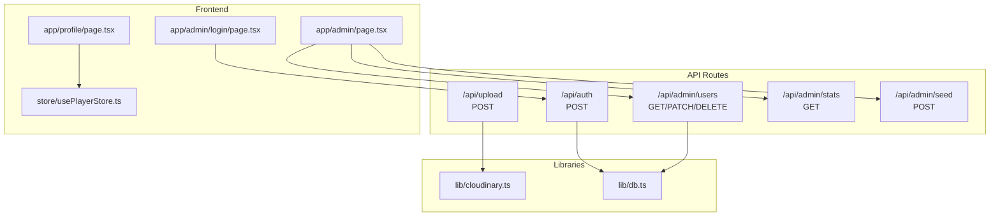
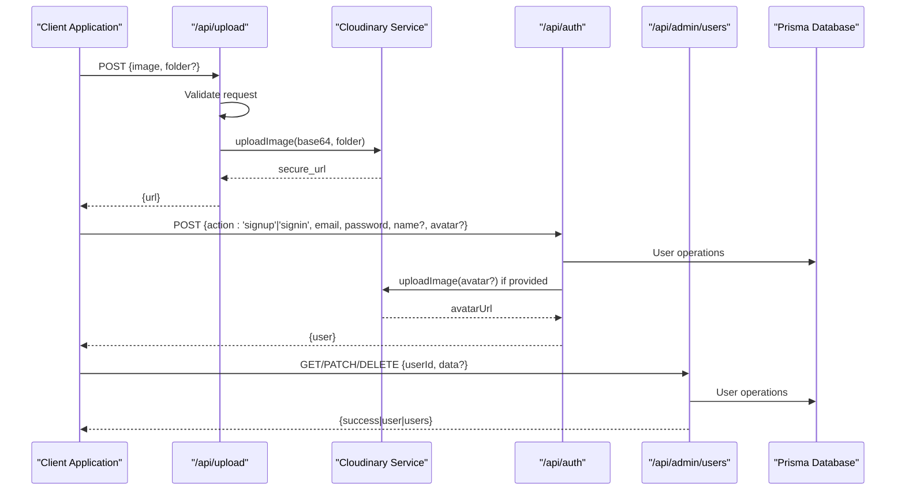
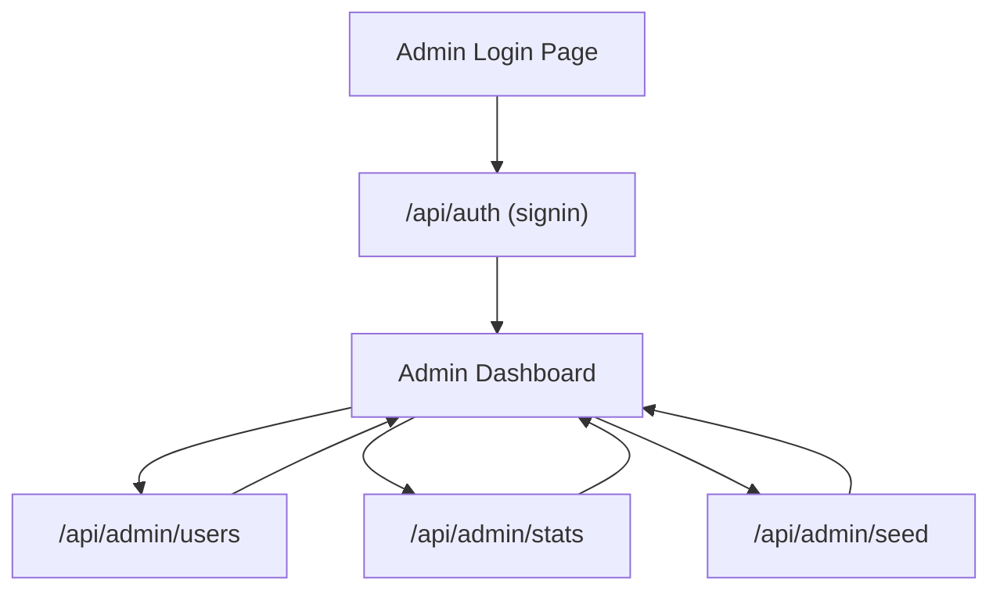
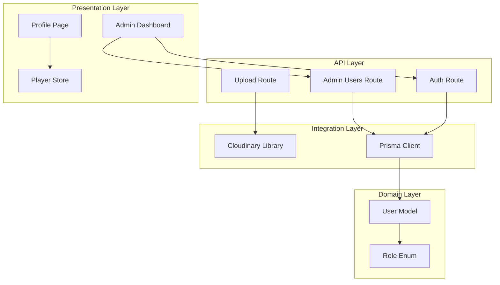

# User Management

<cite>
**Referenced Files in This Document**
- [route.ts](file://app/api/upload/route.ts)
- [cloudinary.ts](file://lib/cloudinary.ts)
- [route.ts](file://app/api/admin/users/route.ts)
- [db.ts](file://lib/db.ts)
- [schema.prisma](file://prisma/schema.prisma)
- [page.tsx](file://app/admin/page.tsx)
- [page.tsx](file://app/admin/login/page.tsx)
- [route.ts](file://app/api/auth/route.ts)
- [usePlayerStore.ts](file://store/usePlayerStore.ts)
- [page.tsx](file://app/profile/page.tsx)
</cite>

## Table of Contents
1. [Introduction](#introduction)
2. [Project Structure](#project-structure)
3. [Core Components](#core-components)
4. [Architecture Overview](#architecture-overview)
5. [Detailed Component Analysis](#detailed-component-analysis)
6. [Dependency Analysis](#dependency-analysis)
7. [Performance Considerations](#performance-considerations)
8. [Troubleshooting Guide](#troubleshooting-guide)
9. [Conclusion](#conclusion)

## Introduction
This document provides comprehensive API documentation for user management operations in SonicStream. It covers:
- Avatar upload endpoint for Cloudinary integration and image processing
- Administrative user management endpoints for listing, updating, and deleting users
- Request/response schemas, file upload handling, Cloudinary integration patterns
- Admin-only access controls and permission validation
- Examples of user profile management workflows, image optimization, and administrative operations
- Error handling for file uploads, permission validation, and user data operations

## Project Structure
The user management APIs are implemented as Next.js App Router API routes under app/api. Cloudinary integration is encapsulated in lib/cloudinary.ts, while database operations use Prisma via lib/db.ts. Administrative dashboards and login pages are located under app/admin and app/admin/login respectively.



**Diagram sources**
- [route.ts:1-20](file://app/api/upload/route.ts#L1-L20)
- [route.ts:1-75](file://app/api/admin/users/route.ts#L1-L75)
- [cloudinary.ts:1-21](file://lib/cloudinary.ts#L1-L21)
- [db.ts:1-10](file://lib/db.ts#L1-L10)
- [page.tsx:1-212](file://app/admin/page.tsx#L1-L212)
- [page.tsx:1-42](file://app/admin/login/page.tsx#L1-L42)
- [route.ts:1-73](file://app/api/auth/route.ts#L1-L73)
- [usePlayerStore.ts:1-128](file://store/usePlayerStore.ts#L1-L128)
- [page.tsx:1-84](file://app/profile/page.tsx#L1-L84)

**Section sources**
- [route.ts:1-20](file://app/api/upload/route.ts#L1-L20)
- [route.ts:1-75](file://app/api/admin/users/route.ts#L1-L75)
- [cloudinary.ts:1-21](file://lib/cloudinary.ts#L1-L21)
- [db.ts:1-10](file://lib/db.ts#L1-L10)
- [page.tsx:1-212](file://app/admin/page.tsx#L1-L212)
- [page.tsx:1-42](file://app/admin/login/page.tsx#L1-L42)
- [route.ts:1-73](file://app/api/auth/route.ts#L1-L73)
- [usePlayerStore.ts:1-128](file://store/usePlayerStore.ts#L1-L128)
- [page.tsx:1-84](file://app/profile/page.tsx#L1-L84)

## Core Components
- Avatar Upload Endpoint: Handles base64 image uploads to Cloudinary with automatic optimization
- Admin User Management: CRUD operations for users with role-based filtering and statistics
- Authentication: User registration and login with optional avatar upload
- Cloudinary Integration: Configured transformations for avatar optimization
- Database Layer: Prisma client with Role enum and user model
- Admin Dashboard: Frontend interface for managing users and system statistics

**Section sources**
- [route.ts:1-20](file://app/api/upload/route.ts#L1-L20)
- [route.ts:1-75](file://app/api/admin/users/route.ts#L1-L75)
- [cloudinary.ts:1-21](file://lib/cloudinary.ts#L1-L21)
- [schema.prisma:11-32](file://prisma/schema.prisma#L11-L32)
- [page.tsx:1-212](file://app/admin/page.tsx#L1-L212)

## Architecture Overview
The user management system follows a layered architecture with clear separation of concerns:



**Diagram sources**
- [route.ts:1-20](file://app/api/upload/route.ts#L1-L20)
- [cloudinary.ts:9-18](file://lib/cloudinary.ts#L9-L18)
- [route.ts:15-72](file://app/api/auth/route.ts#L15-L72)
- [route.ts:4-74](file://app/api/admin/users/route.ts#L4-L74)
- [db.ts:1-10](file://lib/db.ts#L1-L10)

## Detailed Component Analysis

### Avatar Upload Endpoint
The avatar upload endpoint provides a simple interface for uploading base64-encoded images to Cloudinary with automatic optimization.

#### Endpoint Definition
- Method: POST
- Path: /api/upload
- Content-Type: application/json

#### Request Schema
```typescript
{
  image: string;           // Base64 encoded image data
  folder?: string;         // Optional Cloudinary folder (defaults to 'sonicstream/avatars')
}
```

#### Response Schema
```typescript
{
  url: string;             // Secure Cloudinary URL
}
```

#### Implementation Details
- Validates presence of image data
- Uses Cloudinary uploader with configured transformations
- Applies automatic quality and format optimization
- Supports custom folder specification

#### Cloudinary Integration Pattern
The upload process follows these steps:
1. Configure Cloudinary with environment variables
2. Transform base64 data to Cloudinary upload
3. Apply automatic optimization transformations
4. Return secure URL for immediate use

**Section sources**
- [route.ts:4-19](file://app/api/upload/route.ts#L4-L19)
- [cloudinary.ts:3-18](file://lib/cloudinary.ts#L3-L18)

### Administrative User Management
The admin user management API provides comprehensive CRUD operations for user administration with role-based access control.

#### Endpoint Definitions
- GET /api/admin/users - List all users with statistics
- PATCH /api/admin/users - Update user roles/names
- DELETE /api/admin/users - Delete users

#### GET /api/admin/users
**Query Parameters:**
- search: string (optional) - Filter users by name or email

**Response Schema:**
```typescript
{
  users: Array<{
    id: string;
    email: string;
    name: string;
    avatarUrl?: string;
    role: 'USER' | 'ADMIN';
    createdAt: string;
    stats: {
      likedSongs: number;
      playlists: number;
      followedArtists: number;
      queueItems: number;
    };
  }>;
}
```

#### PATCH /api/admin/users
**Request Schema:**
```typescript
{
  userId: string;
  data: {
    role?: 'USER' | 'ADMIN';
    name?: string;
  };
}
```

**Response Schema:**
```typescript
{
  user: {
    id: string;
    email: string;
    name: string;
    role: 'USER' | 'ADMIN';
  };
}
```

#### DELETE /api/admin/users
**Request Schema:**
```typescript
{
  userId: string;
}
```

**Response Schema:**
```typescript
{
  success: true;
}
```

#### Implementation Details
- Uses Prisma client for database operations
- Includes comprehensive statistics (_count) for each user
- Supports case-insensitive search across name and email
- Returns ordered results by creation date (newest first)

**Section sources**
- [route.ts:4-74](file://app/api/admin/users/route.ts#L4-L74)
- [db.ts:1-10](file://lib/db.ts#L1-L10)
- [schema.prisma:11-32](file://prisma/schema.prisma#L11-L32)

### Authentication and User Registration
The authentication system handles user signup and signin with optional avatar upload.

#### Endpoint Definition
- Method: POST
- Path: /api/auth
- Content-Type: application/json

#### Request Schemas
**Signup:**
```typescript
{
  action: 'signup';
  email: string;
  password: string;
  name?: string;
  avatar?: string;  // Base64 image for avatar
}
```

**Signin:**
```typescript
{
  action: 'signin';
  email: string;
  password: string;
}
```

#### Response Schema
```typescript
{
  user: {
    id: string;
    email: string;
    name: string;
    avatarUrl?: string;
    role: 'USER' | 'ADMIN';
  };
}
```

#### Implementation Details
- Simple SHA-256 hashing with salt (for demonstration)
- Optional avatar upload during signup
- Automatic name derivation from email if not provided
- Role assignment defaults to USER

**Section sources**
- [route.ts:15-72](file://app/api/auth/route.ts#L15-L72)
- [cloudinary.ts:9-18](file://lib/cloudinary.ts#L9-L18)

### Admin Dashboard Integration
The admin dashboard provides a frontend interface for managing users and viewing system statistics.

#### Key Features
- User listing with search functionality
- Real-time statistics display
- Role management (promote/demote users)
- User deletion with confirmation
- Local storage-based admin session management

#### Data Flow


**Diagram sources**
- [page.tsx:15-38](file://app/admin/login/page.tsx#L15-L38)
- [route.ts:51-64](file://app/api/auth/route.ts#L51-L64)
- [page.tsx:33-79](file://app/admin/page.tsx#L33-L79)

**Section sources**
- [page.tsx:1-212](file://app/admin/page.tsx#L1-L212)
- [page.tsx:1-42](file://app/admin/login/page.tsx#L1-L42)

## Dependency Analysis
The user management system exhibits clean dependency relationships with clear separation of concerns.



**Diagram sources**
- [route.ts:1-2](file://app/api/upload/route.ts#L1-L2)
- [route.ts:1-2](file://app/api/admin/users/route.ts#L1-L2)
- [cloudinary.ts:1-7](file://lib/cloudinary.ts#L1-L7)
- [db.ts:1-10](file://lib/db.ts#L1-L10)
- [schema.prisma:11-32](file://prisma/schema.prisma#L11-L32)
- [page.tsx:1-212](file://app/admin/page.tsx#L1-L212)
- [usePlayerStore.ts:1-128](file://store/usePlayerStore.ts#L1-L128)

**Section sources**
- [schema.prisma:11-32](file://prisma/schema.prisma#L11-L32)
- [db.ts:1-10](file://lib/db.ts#L1-L10)
- [cloudinary.ts:1-21](file://lib/cloudinary.ts#L1-L21)

## Performance Considerations
- Cloudinary transformations are applied server-side, reducing client processing overhead
- Prisma queries use selective field projection to minimize database load
- Admin dashboard uses pagination-friendly query patterns with search parameters
- Image optimization reduces bandwidth usage and improves loading times
- Local storage caching minimizes repeated authentication requests

## Troubleshooting Guide

### Common Issues and Solutions

#### Cloudinary Upload Failures
**Symptoms:** Upload endpoint returns 500 error
**Causes:**
- Missing Cloudinary environment variables
- Invalid base64 image data
- Network connectivity issues

**Solutions:**
- Verify CLOUDINARY_CLOUD_NAME, CLOUDINARY_API_KEY, CLOUDINARY_API_SECRET are set
- Validate base64 format before sending requests
- Check Cloudinary service status

#### Authentication Errors
**Symptoms:** Auth endpoint returns 400/401 errors
**Causes:**
- Missing email/password fields
- Invalid credentials
- Database connection issues

**Solutions:**
- Ensure both email and password are provided
- Verify user exists in database
- Check database connectivity

#### Admin Access Denied
**Symptoms:** Admin login fails with access denied
**Causes:**
- Non-admin user attempting access
- Session expiration
- Incorrect role stored in database

**Solutions:**
- Verify user role is ADMIN in database
- Clear browser local storage and re-authenticate
- Use seed endpoint to create admin user

#### Database Operation Failures
**Symptoms:** User management operations fail
**Causes:**
- Invalid user ID format
- Database constraint violations
- Connection timeouts

**Solutions:**
- Validate UUID format for user IDs
- Check database constraints and relationships
- Monitor database connection health

**Section sources**
- [route.ts:9-11](file://app/api/upload/route.ts#L9-L11)
- [route.ts:21-23](file://app/api/auth/route.ts#L21-L23)
- [page.tsx:26-29](file://app/admin/login/page.tsx#L26-L29)
- [route.ts:44-45](file://app/api/admin/users/route.ts#L44-L45)

## Conclusion
The SonicStream user management system provides a robust foundation for handling user profiles, avatar uploads, and administrative operations. The architecture emphasizes separation of concerns with clear API boundaries, efficient database operations, and comprehensive error handling. The Cloudinary integration ensures optimal image delivery, while the admin dashboard offers intuitive user management capabilities. The system's modular design facilitates future enhancements and maintains scalability as user bases grow.