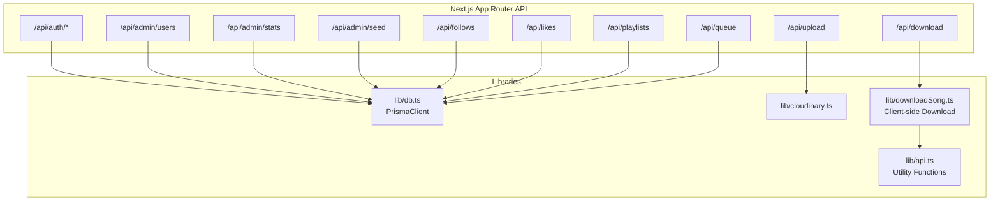
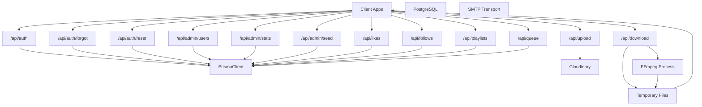
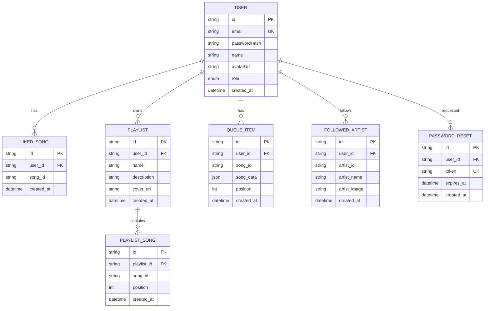
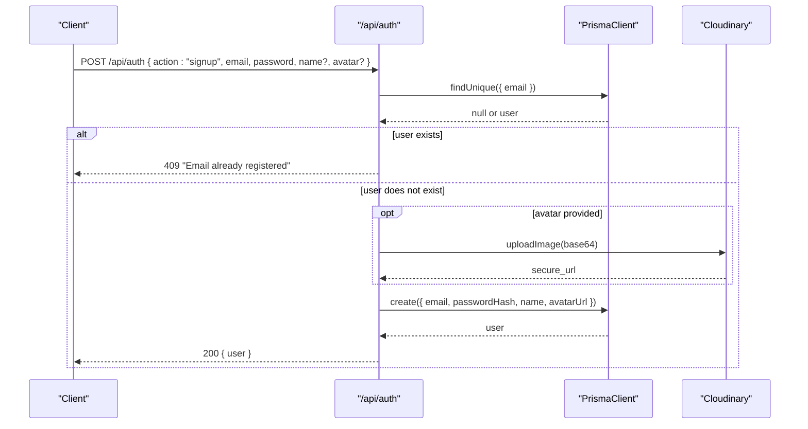
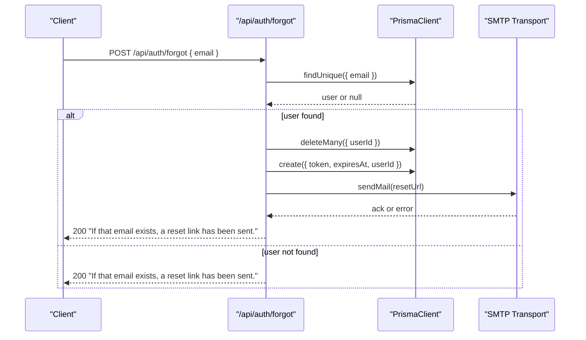
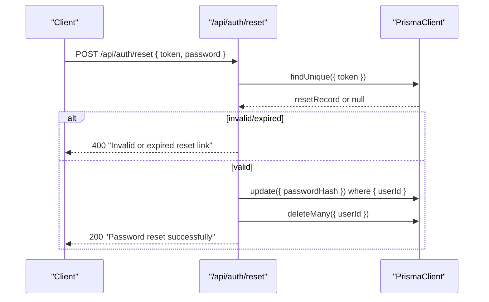
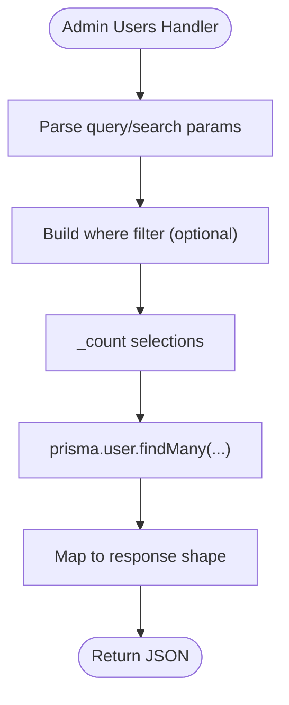
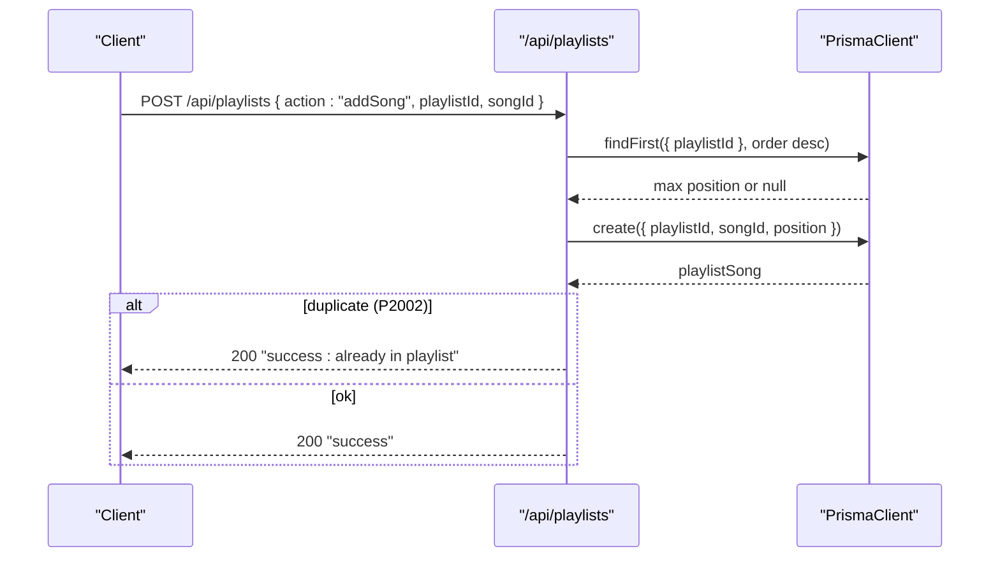
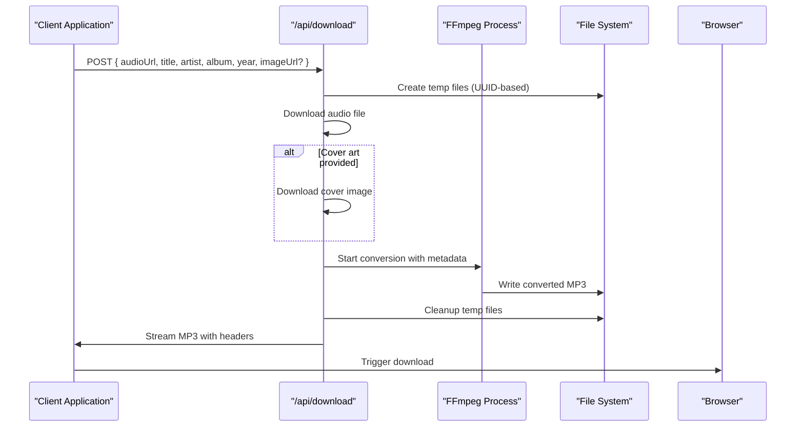
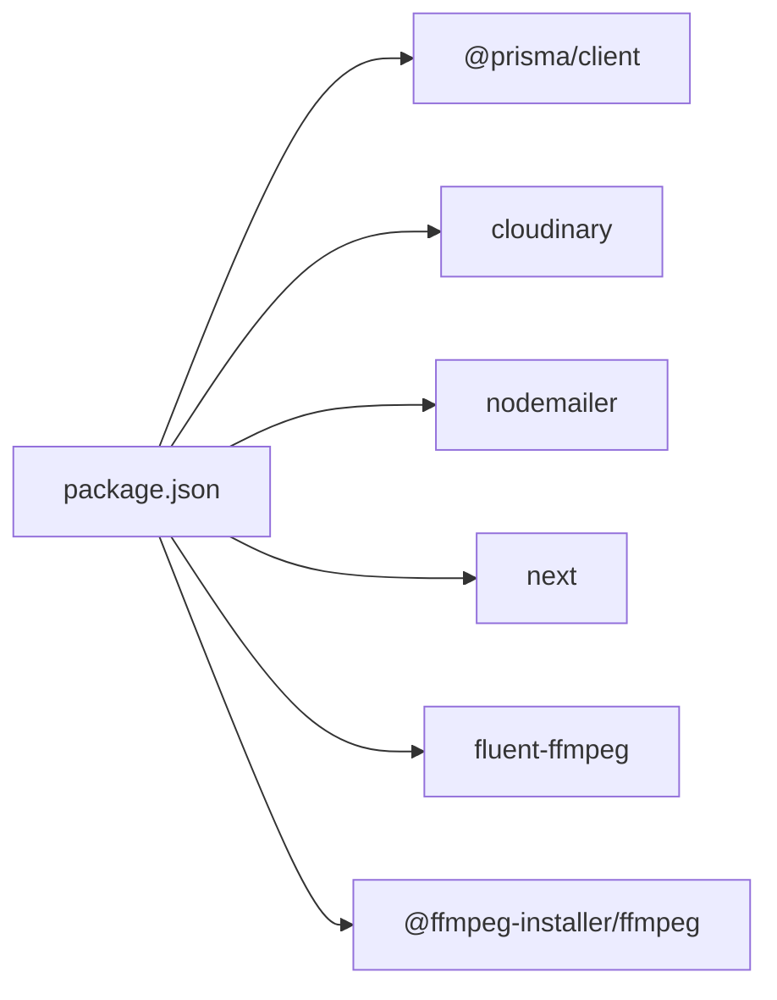

# Backend Architecture

<cite>
**Referenced Files in This Document**
- [schema.prisma](file://prisma/schema.prisma)
- [db.ts](file://lib/db.ts)
- [cloudinary.ts](file://lib/cloudinary.ts)
- [auth.route.ts](file://app/api/auth/route.ts)
- [forgot.route.ts](file://app/api/auth/forgot/route.ts)
- [reset.route.ts](file://app/api/auth/reset/route.ts)
- [admin.users.route.ts](file://app/api/admin/users/route.ts)
- [admin.stats.route.ts](file://app/api/admin/stats/route.ts)
- [admin.seed.route.ts](file://app/api/admin/seed/route.ts)
- [follows.route.ts](file://app/api/follows/route.ts)
- [likes.route.ts](file://app/api/likes/route.ts)
- [playlists.route.ts](file://app/api/playlists/route.ts)
- [queue.route.ts](file://app/api/queue/route.ts)
- [upload.route.ts](file://app/api/upload/route.ts)
- [download.route.ts](file://app/api/download/route.ts)
- [downloadSong.ts](file://lib/downloadSong.ts)
- [api.ts](file://lib/api.ts)
- [useAuthGuard.ts](file://hooks/useAuthGuard.ts)
- [package.json](file://package.json)
- [next.config.ts](file://next.config.ts)
</cite>

## Update Summary
**Changes Made**
- Added new Audio Processing System section documenting FFmpeg integration
- Updated API Architecture Overview to include the new download endpoint
- Enhanced Data Flow Diagrams to show audio conversion workflow
- Added Temporary File Management section
- Updated Security Considerations to address audio processing concerns
- Modified Performance Considerations to include audio processing optimization

## Table of Contents
1. [Introduction](#introduction)
2. [Project Structure](#project-structure)
3. [Core Components](#core-components)
4. [Architecture Overview](#architecture-overview)
5. [Detailed Component Analysis](#detailed-component-analysis)
6. [Audio Processing System](#audio-processing-system)
7. [Dependency Analysis](#dependency-analysis)
8. [Performance Considerations](#performance-considerations)
9. [Security Considerations](#security-considerations)
10. [Troubleshooting Guide](#troubleshooting-guide)
11. [Conclusion](#conclusion)

## Introduction
This document describes the backend architecture of SonicStream's server-side implementation built with Next.js App Router. It covers the API routes pattern, authentication system, user management endpoints, data manipulation APIs, and the newly integrated audio processing system with FFmpeg. The audio processing system enables server-side conversion of audio files to MP3 format with embedded metadata and album art for seamless browser downloads.

## Project Structure
The backend is organized under the Next.js app directory with a dedicated API namespace. Each feature area has its own route handler module exporting HTTP verb handlers (GET, POST, PATCH, DELETE). Shared infrastructure resides in lib (database client, Cloudinary uploads, API utilities), while admin endpoints live under app/api/admin. Authentication endpoints are grouped under app/api/auth, including password reset flows. The new audio processing system is exposed through the app/api/download endpoint.

**Diagram sources**
- [auth.route.ts:15-73](file://app/api/auth/route.ts#L15-L73)
- [admin.users.route.ts:4-75](file://app/api/admin/users/route.ts#L4-L75)
- [admin.stats.route.ts:4-28](file://app/api/admin/stats/route.ts#L4-L28)
- [admin.seed.route.ts:13-40](file://app/api/admin/seed/route.ts#L13-L40)
- [follows.route.ts:4-55](file://app/api/follows/route.ts#L4-L55)
- [likes.route.ts:4-55](file://app/api/likes/route.ts#L4-L55)
- [playlists.route.ts:18-90](file://app/api/playlists/route.ts#L18-L90)
- [queue.route.ts:24-86](file://app/api/queue/route.ts#L24-L86)
- [upload.route.ts:4-20](file://app/api/upload/route.ts#L4-L20)
- [download.route.ts:1-150](file://app/api/download/route.ts#L1-L150)
- [downloadSong.ts:1-66](file://lib/downloadSong.ts#L1-L66)
- [api.ts:1-153](file://lib/api.ts#L1-L153)
- [db.ts:1-10](file://lib/db.ts#L1-L10)
- [cloudinary.ts:1-21](file://lib/cloudinary.ts#L1-L21)

**Section sources**
- [auth.route.ts:15-73](file://app/api/auth/route.ts#L15-L73)
- [admin.users.route.ts:4-75](file://app/api/admin/users/route.ts#L4-L75)
- [admin.stats.route.ts:4-28](file://app/api/admin/stats/route.ts#L4-L28)
- [admin.seed.route.ts:13-40](file://app/api/admin/seed/route.ts#L13-L40)
- [follows.route.ts:4-55](file://app/api/follows/route.ts#L4-L55)
- [likes.route.ts:4-55](file://app/api/likes/route.ts#L4-L55)
- [playlists.route.ts:18-90](file://app/api/playlists/route.ts#L18-L90)
- [queue.route.ts:24-86](file://app/api/queue/route.ts#L24-L86)
- [upload.route.ts:4-20](file://app/api/upload/route.ts#L4-L20)
- [download.route.ts:1-150](file://app/api/download/route.ts#L1-L150)
- [downloadSong.ts:1-66](file://lib/downloadSong.ts#L1-L66)
- [api.ts:1-153](file://lib/api.ts#L1-L153)
- [db.ts:1-10](file://lib/db.ts#L1-L10)
- [cloudinary.ts:1-21](file://lib/cloudinary.ts#L1-L21)

## Core Components
- Prisma ORM client initialization and singleton pattern for development and production.
- Cloudinary integration for avatar uploads with transformations.
- Authentication endpoints supporting sign-up, sign-in, forgot password, and reset password.
- Admin endpoints for listing users with counts, updating roles/names, deleting users, seeding an admin, and retrieving platform statistics.
- Feature endpoints for managing likes, follows, playlists, queue, and image uploads.
- **NEW** Audio processing system with FFmpeg integration for converting audio files to MP3 format with embedded metadata and album art.

Key implementation patterns:
- Route handlers export HTTP verb functions per file.
- Request bodies parsed via req.json(); query parameters via URL search params.
- Responses returned as JSON with appropriate status codes.
- Errors caught centrally and mapped to user-friendly messages.
- **NEW** Audio processing endpoints handle binary data streaming and temporary file management.

**Section sources**
- [db.ts:1-10](file://lib/db.ts#L1-L10)
- [cloudinary.ts:9-18](file://lib/cloudinary.ts#L9-L18)
- [auth.route.ts:15-73](file://app/api/auth/route.ts#L15-L73)
- [forgot.route.ts:5-68](file://app/api/auth/forgot/route.ts#L5-L68)
- [reset.route.ts:13-48](file://app/api/auth/reset/route.ts#L13-L48)
- [admin.users.route.ts:4-75](file://app/api/admin/users/route.ts#L4-L75)
- [admin.stats.route.ts:4-28](file://app/api/admin/stats/route.ts#L4-L28)
- [admin.seed.route.ts:13-40](file://app/api/admin/seed/route.ts#L13-L40)
- [likes.route.ts:4-55](file://app/api/likes/route.ts#L4-L55)
- [follows.route.ts:4-55](file://app/api/follows/route.ts#L4-L55)
- [playlists.route.ts:18-90](file://app/api/playlists/route.ts#L18-L90)
- [queue.route.ts:24-86](file://app/api/queue/route.ts#L24-L86)
- [upload.route.ts:4-20](file://app/api/upload/route.ts#L4-L20)
- [download.route.ts:1-150](file://app/api/download/route.ts#L1-L150)
- [downloadSong.ts:1-66](file://lib/downloadSong.ts#L1-L66)

## Architecture Overview
The backend follows a functional, route-handler-first pattern with minimal middleware. Authentication is stateless and role-based via a user role field. Data persistence relies on Prisma with PostgreSQL. Media assets are uploaded to Cloudinary. Email notifications for password resets are optional and handled via SMTP transport. **NEW** The audio processing system handles server-side conversion of audio files to MP3 format with embedded metadata and album art, enabling seamless browser downloads.

**Diagram sources**
- [auth.route.ts:15-73](file://app/api/auth/route.ts#L15-L73)
- [forgot.route.ts:28-60](file://app/api/auth/forgot/route.ts#L28-L60)
- [reset.route.ts:13-48](file://app/api/auth/reset/route.ts#L13-L48)
- [admin.users.route.ts:4-75](file://app/api/admin/users/route.ts#L4-L75)
- [admin.stats.route.ts:4-28](file://app/api/admin/stats/route.ts#L4-L28)
- [admin.seed.route.ts:13-40](file://app/api/admin/seed/route.ts#L13-L40)
- [likes.route.ts:4-55](file://app/api/likes/route.ts#L4-L55)
- [follows.route.ts:4-55](file://app/api/follows/route.ts#L4-L55)
- [playlists.route.ts:18-90](file://app/api/playlists/route.ts#L18-L90)
- [queue.route.ts:24-86](file://app/api/queue/route.ts#L24-L86)
- [upload.route.ts:4-20](file://app/api/upload/route.ts#L4-L20)
- [download.route.ts:1-150](file://app/api/download/route.ts#L1-L150)
- [db.ts:1-10](file://lib/db.ts#L1-L10)
- [cloudinary.ts:3-18](file://lib/cloudinary.ts#L3-L18)

## Detailed Component Analysis

### Prisma ORM Integration and Database Schema
- Data source configured for PostgreSQL with environment variables for primary and direct URLs.
- Enum Role defines USER and ADMIN.
- Model relationships:
  - User has collections: likedSongs, playlists, queueItems, followedArtists, passwordResets.
  - LikedSong and PlaylistSong enforce uniqueness on (userId, songId) and (playlistId, songId).
  - QueueItem stores JSON song data for runtime composition.
  - FollowedArtist stores denormalized artist metadata for quick rendering.
  - PasswordReset links users to time-bound tokens.
- Naming conventions: snake_case mapped to camelCase fields via @map and relation fields via @map.

**Diagram sources**
- [schema.prisma:11-111](file://prisma/schema.prisma#L11-L111)

**Section sources**
- [schema.prisma:5-111](file://prisma/schema.prisma#L5-L111)
- [db.ts:1-10](file://lib/db.ts#L1-L10)

### Authentication System
- Stateless authentication without sessions or cookies. Responses return user payload with role.
- Password hashing uses SHA-256 with a fixed salt appended to the plaintext password. Note: production-grade systems should use bcrypt or Argon2.
- Sign-up flow:
  - Validates presence of email and password.
  - Checks uniqueness of email.
  - Optionally uploads avatar via Cloudinary.
  - Creates user with hashed password and default role USER.
- Sign-in flow:
  - Finds user by email.
  - Hashes provided password and compares with stored hash.
  - Returns user payload on success.
- Forgot password:
  - Accepts email, cleans old tokens, generates random token with expiry, persists token, attempts to send email via SMTP, returns safe message regardless of email delivery outcome.
- Reset password:
  - Validates token existence and non-expiry, hashes new password, updates user, deletes all tokens for the user.

**Diagram sources**
- [auth.route.ts:15-49](file://app/api/auth/route.ts#L15-L49)
- [cloudinary.ts:9-18](file://lib/cloudinary.ts#L9-L18)

**Diagram sources**
- [forgot.route.ts:5-68](file://app/api/auth/forgot/route.ts#L5-L68)

**Diagram sources**
- [reset.route.ts:13-48](file://app/api/auth/reset/route.ts#L13-L48)

**Section sources**
- [auth.route.ts:5-13](file://app/api/auth/route.ts#L5-L13)
- [auth.route.ts:15-73](file://app/api/auth/route.ts#L15-L73)
- [forgot.route.ts:5-68](file://app/api/auth/forgot/route.ts#L5-L68)
- [reset.route.ts:13-48](file://app/api/auth/reset/route.ts#L13-L48)

### Admin Endpoints
- List users with counts for liked songs, playlists, followed artists, and queue items; supports case-insensitive search by name or email.
- Delete a user by ID.
- Patch user role/name by ID.
- Seed admin user with default credentials if not present; otherwise promote to ADMIN.

**Diagram sources**
- [admin.users.route.ts:4-39](file://app/api/admin/users/route.ts#L4-L39)

**Section sources**
- [admin.users.route.ts:4-75](file://app/api/admin/users/route.ts#L4-L75)
- [admin.stats.route.ts:4-28](file://app/api/admin/stats/route.ts#L4-L28)
- [admin.seed.route.ts:13-40](file://app/api/admin/seed/route.ts#L13-L40)

### Data Manipulation APIs
- Likes: GET list by userId; POST/DELETE add/remove like with duplicate-handling via P2002.
- Follows: GET list by userId; POST/DELETE follow/unfollow with duplicate-handling via P2002.
- Playlists: GET by userId; POST supports create/addSong/removeSong actions; DELETE by playlistId with duplicate-handling via P2002 on addSong.
- Queue: GET by userId; POST supports add/clear actions; DELETE supports removal by id or by userId+songId combination.
- Upload: POST accepts base64 image and optional folder; returns secure URL.

**Diagram sources**
- [playlists.route.ts:37-74](file://app/api/playlists/route.ts#L37-L74)

**Section sources**
- [likes.route.ts:4-55](file://app/api/likes/route.ts#L4-L55)
- [follows.route.ts:4-55](file://app/api/follows/route.ts#L4-L55)
- [playlists.route.ts:18-90](file://app/api/playlists/route.ts#L18-L90)
- [queue.route.ts:24-86](file://app/api/queue/route.ts#L24-L86)
- [upload.route.ts:4-20](file://app/api/upload/route.ts#L4-L20)

### Request/Response and Error Management Patterns
- Handlers parse JSON bodies and validate required fields; return structured errors with 4xx/5xx status codes.
- Duplicate entries trigger P2002; handlers return success with message to avoid leaking state.
- Generic catch-all logs errors and returns internal server error.

Common patterns:
- Validation: early return with 400 on missing fields.
- Uniqueness: catch Prisma error code P2002 and return success with message.
- Deletion: catch-all returns 500 on failure.
- Counters: use _count in queries for aggregated stats.

**Section sources**
- [likes.route.ts:30-34](file://app/api/likes/route.ts#L30-L34)
- [follows.route.ts:31-35](file://app/api/follows/route.ts#L31-L35)
- [playlists.route.ts:69-73](file://app/api/playlists/route.ts#L69-L73)
- [admin.users.route.ts:49-51](file://app/api/admin/users/route.ts#L49-L51)

## Audio Processing System

**NEW** The audio processing system provides server-side conversion capabilities for audio files, enabling seamless downloads with embedded metadata and album art.

### FFmpeg Integration
The system integrates FFmpeg through the `fluent-ffmpeg` library with automatic platform-specific binary detection via `@ffmpeg-installer/ffmpeg`. The implementation handles cross-platform compatibility by dynamically loading the appropriate FFmpeg binary for different operating systems.

### Audio Conversion Workflow
The conversion process follows a six-step pipeline:

1. **Audio Download**: Fetches the source audio file from the provided URL and saves it to a temporary location
2. **Cover Art Download**: Optionally downloads album artwork if provided and not using inline data URIs
3. **Metadata Embedding**: Configures FFmpeg with ID3 metadata including title, artist, album, year, and genre
4. **File Conversion**: Converts M4A audio to MP3 format with 320kbps bitrate, stereo channels, and 44.1kHz frequency
5. **Cleanup**: Removes temporary files from the filesystem
6. **Download Response**: Streams the converted MP3 file back to the client with proper HTTP headers

### Temporary File Management
The system uses Node.js's `tmpdir()` for secure temporary file storage with UUID-based filenames to prevent conflicts. All temporary files are automatically cleaned up in both success and error scenarios using Promise-based cleanup operations.

### Client-Side Integration
The client-side download utility (`lib/downloadSong.ts`) coordinates with the server endpoint to:
- Extract high-quality download URLs from the music API
- Prepare metadata from song information
- Handle the conversion and download process
- Trigger browser downloads with proper filenames

**Diagram sources**
- [download.route.ts:25-140](file://app/api/download/route.ts#L25-L140)
- [downloadSong.ts:8-66](file://lib/downloadSong.ts#L8-L66)

**Section sources**
- [download.route.ts:1-150](file://app/api/download/route.ts#L1-L150)
- [downloadSong.ts:1-66](file://lib/downloadSong.ts#L1-L66)
- [api.ts:79-83](file://lib/api.ts#L79-L83)

## Dependency Analysis
External dependencies relevant to backend:
- @prisma/client for ORM.
- cloudinary for media uploads.
- nodemailer for optional SMTP-based email sending during password reset.
- next for server runtime and NextResponse/NextRequest.
- **NEW** fluent-ffmpeg for audio processing and metadata embedding.
- **NEW** @ffmpeg-installer/ffmpeg for platform-specific FFmpeg binaries.

**Diagram sources**
- [package.json:12-35](file://package.json#L12-L35)

**Section sources**
- [package.json:12-35](file://package.json#L12-L35)

## Performance Considerations
- Indexing strategies:
  - Unique constraints on (userId, songId) for liked songs and (playlistId, songId) for playlist songs prevent duplicates and enable fast lookups.
  - Unique token on password reset ensures O(1) lookup for reset validation.
  - Email uniqueness on User enables efficient authentication lookups.
- Query optimization:
  - Use selective projections (e.g., include only necessary relations and counts).
  - Order by createdAt desc for reverse chronological lists; consider pagination for large datasets.
  - Use orderBy position asc for queue and playlist songs to minimize sorting overhead.
- Caching:
  - Consider Redis for frequently accessed user preferences and counts.
  - CDN for Cloudinary URLs to reduce origin load.
- Asynchronous tasks:
  - Offload email sending to background jobs if SMTP becomes a bottleneck.
  - **NEW** Consider caching converted audio files to reduce repeated processing.
- Database connection:
  - Prisma client is initialized globally in development to avoid reconnects; ensure connection pooling is configured appropriately in production.
- **NEW** Audio processing optimization:
  - Implement rate limiting for the download endpoint to prevent abuse
  - Consider implementing audio file size limits to prevent excessive resource consumption
  - Use streaming responses to handle large audio files efficiently
  - Implement proper timeout handling for long-running conversion processes

## Security Considerations
- Password hashing:
  - Current implementation uses SHA-256 with a fixed salt. Production-grade systems should migrate to bcrypt or Argon2 with per-user salts and cost factors.
- Input validation:
  - Validate presence and length of inputs (e.g., password minimum length).
  - Sanitize and limit image sizes and formats when accepting uploads.
  - **NEW** Validate audio URLs to prevent malicious file downloads and implement URL whitelist validation.
- Role-based access control:
  - Admin endpoints currently rely on user role checks. Enforce role checks at route boundaries and guard sensitive operations.
- Secrets management:
  - Store DATABASE_URL, DIRECT_URL, Cloudinary credentials, and SMTP credentials in environment variables.
- CSRF and CORS:
  - Configure CORS policies to restrict origins and consider CSRF protections for state-changing requests.
- Rate limiting:
  - Apply rate limits to authentication endpoints to mitigate brute-force attacks.
  - **NEW** Apply rate limits to the download endpoint to prevent abuse and excessive resource consumption.
- Audit logging:
  - Log admin actions and failed authentication attempts for monitoring.
  - **NEW** Log audio processing operations for monitoring and debugging purposes.

## Troubleshooting Guide
- Authentication failures:
  - Verify email uniqueness and ensure correct hashing logic matches server-side.
  - Confirm Cloudinary credentials if avatar upload fails during sign-up.
- Password reset issues:
  - Check SMTP configuration and network connectivity.
  - Ensure token expiration logic is functioning and cleanup runs after successful reset.
- Duplicate resource errors:
  - P2002 indicates a unique constraint violation; confirm frontend deduplication logic.
- Database connectivity:
  - Verify DATABASE_URL/DIRECT_URL and Prisma client initialization in development vs. production environments.
- **NEW** Audio processing issues:
  - Verify FFmpeg installation and binary accessibility across platforms.
  - Check disk space availability for temporary file storage.
  - Monitor memory usage during audio conversion processes.
  - Validate that audio URLs are accessible and not blocked by CORS restrictions.
  - Ensure proper MIME type handling for audio files and album art.

**Section sources**
- [auth.route.ts:68-72](file://app/api/auth/route.ts#L68-L72)
- [forgot.route.ts:57-60](file://app/api/auth/forgot/route.ts#L57-L60)
- [reset.route.ts:43-47](file://app/api/auth/reset/route.ts#L43-L47)
- [db.ts:3-9](file://lib/db.ts#L3-L9)
- [download.route.ts:125-139](file://app/api/download/route.ts#L125-L139)

## Conclusion
SonicStream's backend leverages Next.js App Router's route handlers with Prisma ORM for data access and Cloudinary for media. Authentication is stateless and role-based, with password reset flows optionally using SMTP. The newly integrated audio processing system provides server-side conversion capabilities using FFmpeg, enabling seamless downloads with embedded metadata and album art. The API design emphasizes simplicity, explicit validation, and consistent error responses. For production readiness, prioritize robust password hashing, RBAC enforcement, input sanitization, operational monitoring, and proper resource management for the audio processing system.