# Database Design

<cite>
**Referenced Files in This Document**
- [schema.prisma](file://prisma/schema.prisma)
- [db.ts](file://lib/db.ts)
- [seed route.ts](file://app/api/admin/seed/route.ts)
- [stats route.ts](file://app/api/admin/stats/route.ts)
- [follows route.ts](file://app/api/follows/route.ts)
- [likes route.ts](file://app/api/likes/route.ts)
- [playlists route.ts](file://app/api/playlists/route.ts)
- [queue route.ts](file://app/api/queue/route.ts)
- [package.json](file://package.json)
</cite>

## Table of Contents
1. [Introduction](#introduction)
2. [Project Structure](#project-structure)
3. [Core Components](#core-components)
4. [Architecture Overview](#architecture-overview)
5. [Detailed Component Analysis](#detailed-component-analysis)
6. [Dependency Analysis](#dependency-analysis)
7. [Performance Considerations](#performance-considerations)
8. [Troubleshooting Guide](#troubleshooting-guide)
9. [Conclusion](#conclusion)
10. [Appendices](#appendices)

## Introduction
This document describes the database design for SonicStream’s Prisma ORM implementation. It covers the complete data model, entity relationships, constraints, and referential integrity rules. It also documents Prisma client initialization, connection configuration, migration workflows, schema evolution patterns, data seeding strategies, performance optimization techniques, security considerations, and practical query and association examples used across the application.

## Project Structure
The database layer is centered around a single Prisma schema file and a shared Prisma client instance. API routes orchestrate data access patterns for users, songs, playlists, queue items, follows, and likes.

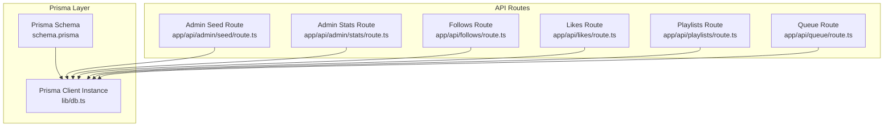

**Diagram sources**
- [schema.prisma](file://prisma/schema.prisma)
- [db.ts](file://lib/db.ts)
- [seed route.ts](file://app/api/admin/seed/route.ts)
- [stats route.ts](file://app/api/admin/stats/route.ts)
- [follows route.ts](file://app/api/follows/route.ts)
- [likes route.ts](file://app/api/likes/route.ts)
- [playlists route.ts](file://app/api/playlists/route.ts)
- [queue route.ts](file://app/api/queue/route.ts)

**Section sources**
- [schema.prisma](file://prisma/schema.prisma)
- [db.ts](file://lib/db.ts)
- [seed route.ts](file://app/api/admin/seed/route.ts)
- [stats route.ts](file://app/api/admin/stats/route.ts)
- [follows route.ts](file://app/api/follows/route.ts)
- [likes route.ts](file://app/api/likes/route.ts)
- [playlists route.ts](file://app/api/playlists/route.ts)
- [queue route.ts](file://app/api/queue/route.ts)

## Core Components
This section documents the entities and their attributes, constraints, and relationships.

- User
  - Fields: id (String, @id, cuid), email (String, @unique), passwordHash (String), name (String), avatarUrl (String?), role (Role enum, default USER), createdAt (DateTime, default now)
  - Relationships: one-to-many to LikedSong, Playlist, QueueItem, FollowedArtist, PasswordReset
  - Indexes: unique index on email
  - Notes: Role enum supports USER and ADMIN

- LikedSong
  - Fields: id (String, @id, cuid), userId (String), songId (String), createdAt (DateTime, default now)
  - Relationships: belongs to User via relation fields [userId] referencing [id]; onDelete Cascade
  - Constraints: unique constraint on [userId, songId]
  - Notes: Composite uniqueness prevents duplicate likes per user-song pair

- Playlist
  - Fields: id (String, @id, cuid), userId (String), name (String), description (String?), coverUrl (String?), createdAt (DateTime, default now)
  - Relationships: belongs to User via relation fields [userId] referencing [id]; onDelete Cascade; one-to-many to PlaylistSong
  - Notes: Cascade deletion ensures playlists are removed when user is deleted

- PlaylistSong
  - Fields: id (String, @id, cuid), playlistId (String), songId (String), position (Int, default 0), createdAt (DateTime, default now)
  - Relationships: belongs to Playlist via relation fields [playlistId] referencing [id]; onDelete Cascade
  - Constraints: unique constraint on [playlistId, songId]
  - Notes: Ensures a song appears at most once in a playlist; position supports ordering

- QueueItem
  - Fields: id (String, @id, cuid), userId (String), songId (String), songData (Json), position (Int, default 0), createdAt (DateTime, default now)
  - Relationships: belongs to User via relation fields [userId] referencing [id]; onDelete Cascade
  - Notes: songData stores arbitrary JSON for runtime playback metadata; position supports ordering

- FollowedArtist
  - Fields: id (String, @id, cuid), userId (String), artistId (String), artistName (String), artistImage (String?), createdAt (DateTime, default now)
  - Relationships: belongs to User via relation fields [userId] referencing [id]; onDelete Cascade
  - Constraints: unique constraint on [userId, artistId]
  - Notes: Tracks user artist follow relationships

- PasswordReset
  - Fields: id (String, @id, cuid), userId (String), token (String, @unique), expiresAt (DateTime), createdAt (DateTime, default now)
  - Relationships: belongs to User via relation fields [userId] referencing [id]; onDelete Cascade
  - Notes: Unique token enforces single-use or controlled reset lifecycle

**Section sources**
- [schema.prisma](file://prisma/schema.prisma)

## Architecture Overview
The application uses Prisma Client to connect to a PostgreSQL database. Environment variables configure the primary and direct URLs. The Prisma client is initialized once and reused globally during development to avoid hot reload issues.

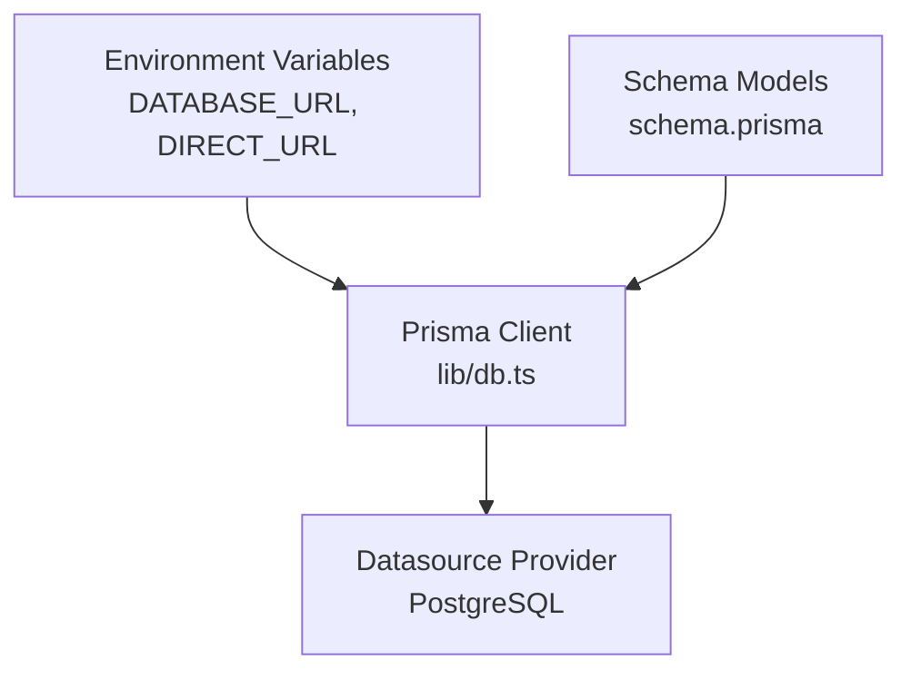

**Diagram sources**
- [schema.prisma](file://prisma/schema.prisma)
- [db.ts](file://lib/db.ts)

**Section sources**
- [schema.prisma](file://prisma/schema.prisma)
- [db.ts](file://lib/db.ts)

## Detailed Component Analysis

### Entity Relationship Model
The following ER diagram maps the entities and their relationships as defined in the schema.

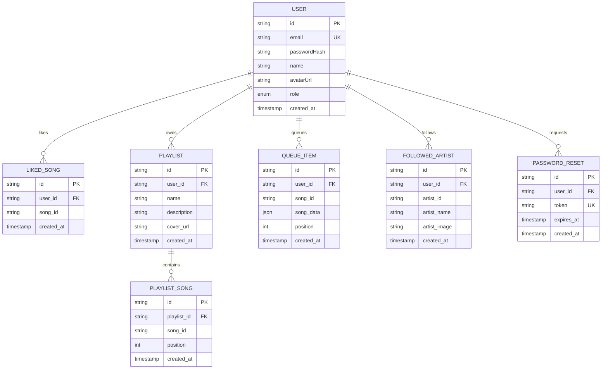

**Diagram sources**
- [schema.prisma](file://prisma/schema.prisma)

**Section sources**
- [schema.prisma](file://prisma/schema.prisma)

### Prisma Client Initialization and Connection
- Client initialization uses a singleton pattern with a globalThis guard to prevent multiple instances during development.
- Production environments rely on process-wide reuse; development mode rebinds the global instance to avoid reconnect issues.
- Datasource provider is PostgreSQL with DATABASE_URL and DIRECT_URL from environment variables.

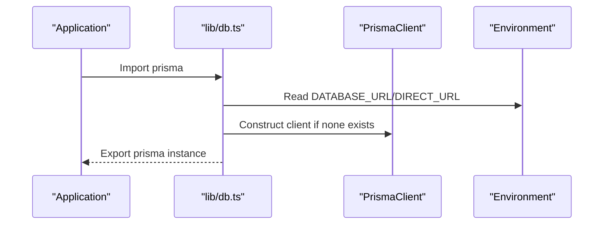

**Diagram sources**
- [db.ts](file://lib/db.ts)
- [schema.prisma](file://prisma/schema.prisma)

**Section sources**
- [db.ts](file://lib/db.ts)
- [schema.prisma](file://prisma/schema.prisma)

### Data Seeding Strategy
- Admin seeding route creates a default admin user if not present, hashing a fixed password with a salt before persisting.
- If the user exists, the route updates the role to ADMIN.

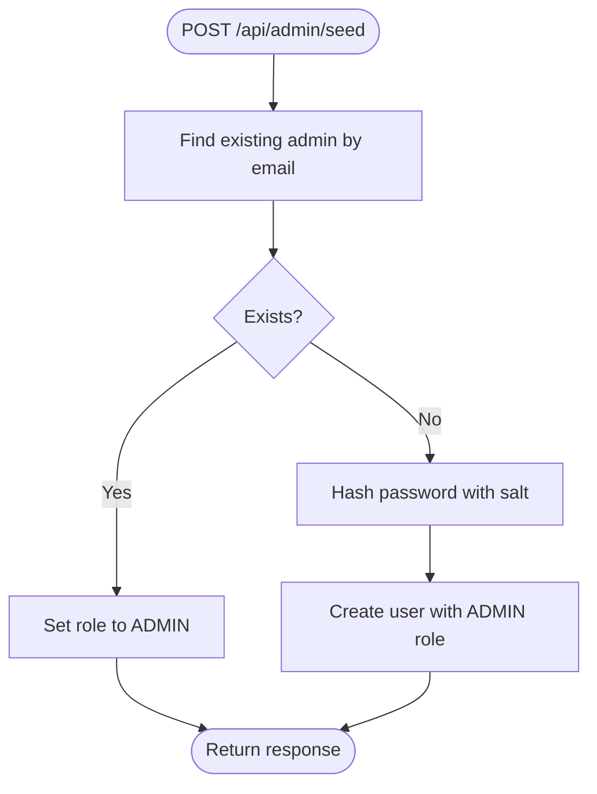

**Diagram sources**
- [seed route.ts](file://app/api/admin/seed/route.ts)

**Section sources**
- [seed route.ts](file://app/api/admin/seed/route.ts)

### API Workflows and Data Access Patterns

#### Likes
- Retrieve liked song IDs for a user.
- Create a like with deduplication via unique constraint.
- Remove a like by composite key.

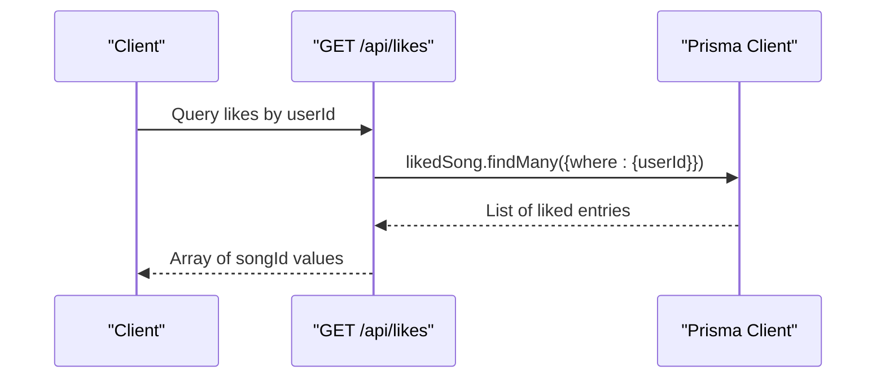

**Diagram sources**
- [likes route.ts](file://app/api/likes/route.ts)

**Section sources**
- [likes route.ts](file://app/api/likes/route.ts)

#### Playlists
- List user playlists with included songs ordered by position.
- Create a playlist.
- Add a song to a playlist with computed position.
- Remove a song from a playlist.
- Delete a playlist.

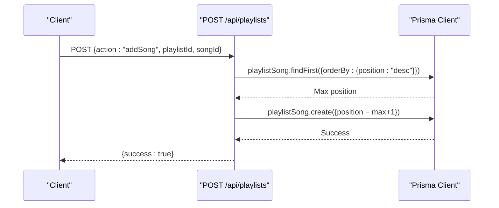

**Diagram sources**
- [playlists route.ts](file://app/api/playlists/route.ts)

**Section sources**
- [playlists route.ts](file://app/api/playlists/route.ts)

#### Queue
- Retrieve queue items ordered by position.
- Add an item with computed position.
- Clear the queue.
- Remove a specific item by id or by user+song combination.

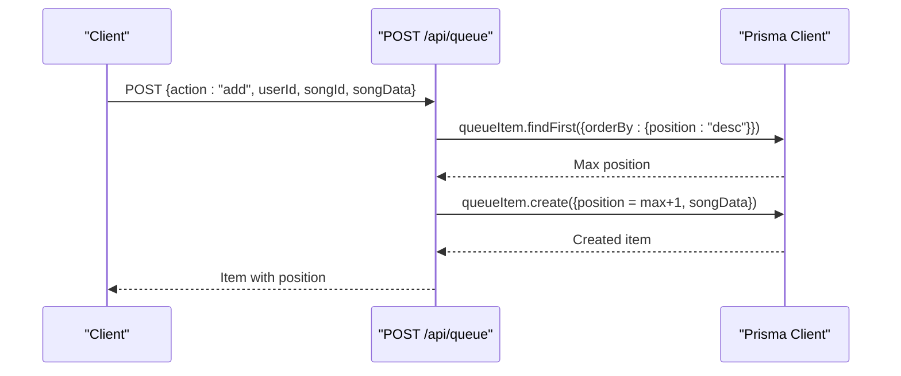

**Diagram sources**
- [queue route.ts](file://app/api/queue/route.ts)

**Section sources**
- [queue route.ts](file://app/api/queue/route.ts)

#### Follows
- List followed artists for a user.
- Create a follow with deduplication via unique constraint.
- Unfollow by composite key.

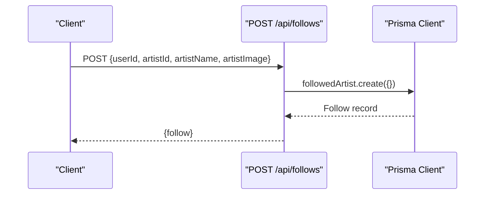

**Diagram sources**
- [follows route.ts](file://app/api/follows/route.ts)

**Section sources**
- [follows route.ts](file://app/api/follows/route.ts)

#### Admin Statistics
- Aggregated counts across users, likes, playlists, follows, and queued items.
- Recent users retrieval with selected fields.

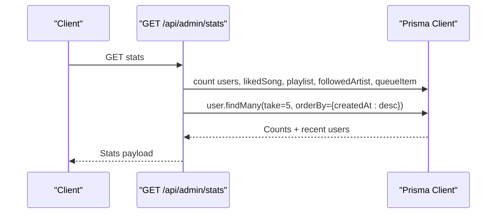

**Diagram sources**
- [stats route.ts](file://app/api/admin/stats/route.ts)

**Section sources**
- [stats route.ts](file://app/api/admin/stats/route.ts)

## Dependency Analysis
- Prisma Client version is pinned to 6.19.2 in dependencies.
- PostgreSQL driver dependencies exist in lockfile; Prisma engine manages database connectivity.
- API routes depend on the shared Prisma client instance.

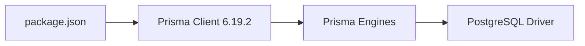

**Diagram sources**
- [package.json](file://package.json)

**Section sources**
- [package.json](file://package.json)

## Performance Considerations
- Indexing
  - Unique indexes on email (User), [userId, songId] (LikedSong), [playlistId, songId] (PlaylistSong), [userId, artistId] (FollowedArtist), and token (PasswordReset) improve lookup performance and enforce uniqueness.
- Ordering and Pagination
  - Queries order by createdAt or position to maintain deterministic results; pagination via take and orderBy in admin stats and playlist song lists.
- Denormalization for Playback
  - QueueItem stores songData as JSON to avoid joins at playback time, trading normalization for read performance.
- Cascading Deletes
  - onDelete Cascade on relations reduces orphaned records and simplifies cleanup but requires careful cascade planning to avoid unintended deletions.
- Connection Management
  - Singleton Prisma client avoids frequent reconnections; in development, the global binding prevents multiple clients.

[No sources needed since this section provides general guidance]

## Troubleshooting Guide
- Duplicate Key Errors (P2002)
  - LikedSong, PlaylistSong, and FollowedArtist enforce unique composite keys. When attempting to insert duplicates, handle P2002 to inform the client that the operation is idempotent (already exists).
- Foreign Key Constraint Violations
  - Ensure userId exists before creating related records (LikedSong, QueueItem, FollowedArtist). Deleting a User cascades deletes dependent records.
- Admin Seed Failures
  - Verify environment variables and that the hashed password is generated consistently before insertion.
- Queue Positioning
  - When adding items, compute position from the maximum existing position to preserve order.

**Section sources**
- [likes route.ts](file://app/api/likes/route.ts)
- [playlists route.ts](file://app/api/playlists/route.ts)
- [follows route.ts](file://app/api/follows/route.ts)
- [seed route.ts](file://app/api/admin/seed/route.ts)
- [queue route.ts](file://app/api/queue/route.ts)

## Conclusion
SonicStream’s database design leverages Prisma ORM to model a compact yet expressive domain: Users, Songs (via foreign keys), Playlists with ordered tracks, Queued items, Follows, and Likes. The schema enforces referential integrity via relations and unique constraints, while API routes demonstrate efficient data access patterns. With proper environment configuration, connection management, and adherence to unique constraints, the system supports scalable music streaming features.

[No sources needed since this section summarizes without analyzing specific files]

## Appendices

### Migration and Schema Evolution
- Use Prisma Migrate to evolve the schema safely in development and production.
- Typical workflow:
  - Modify schema.prisma.
  - Run prisma migrate dev to create and apply a migration locally.
  - Push migrations to staging/production using prisma migrate deploy.
- Best practices:
  - Keep migrations reversible where possible.
  - Add indexes for frequently queried columns.
  - Test unique constraints and cascading rules before deploying.

[No sources needed since this section provides general guidance]

### Security Considerations
- Secrets Management
  - Store DATABASE_URL and DIRECT_URL in environment variables; never commit secrets to version control.
- Least Privilege
  - Use a dedicated database user with minimal permissions for application connections.
- Input Validation
  - Validate and sanitize inputs in API routes before passing to Prisma.
- Token Safety
  - PasswordReset tokens are unique; ensure expiry handling and secure generation.

[No sources needed since this section provides general guidance]

### Backup and Maintenance
- Backups
  - Schedule regular logical backups of the PostgreSQL database.
  - Test restore procedures periodically.
- Monitoring
  - Monitor slow queries and index usage; add missing indexes as needed.
- Maintenance
  - Vacuum/analyze periodically to keep statistics fresh.
  - Review cascade rules and unique constraints during schema changes.

[No sources needed since this section provides general guidance]