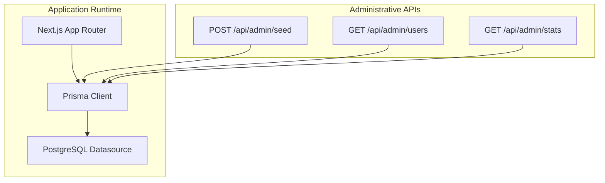
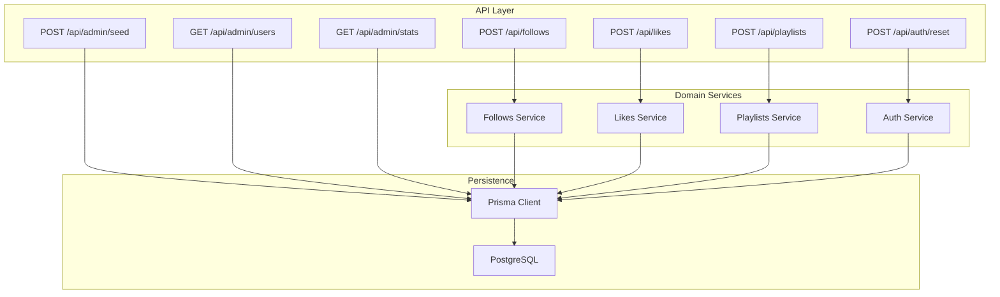
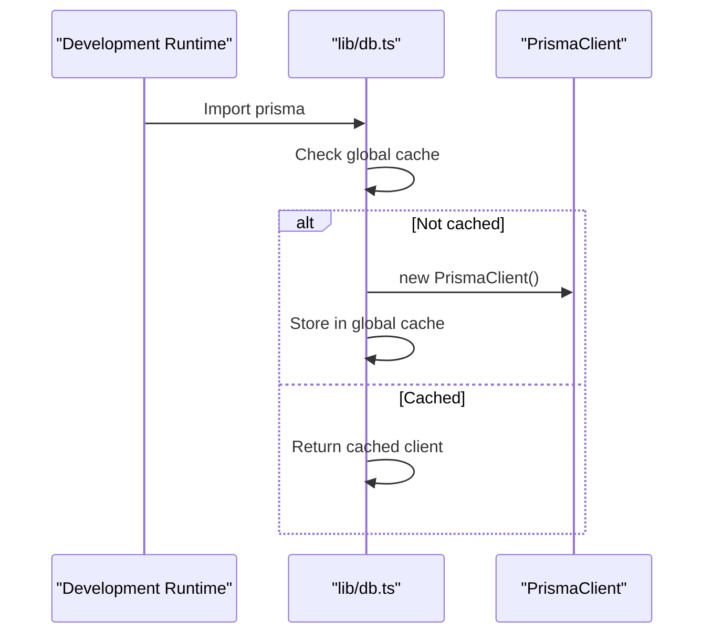
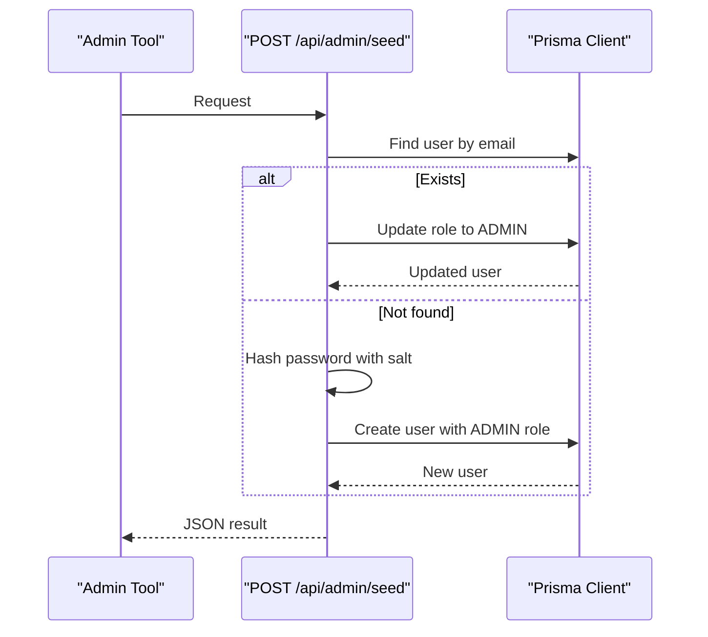
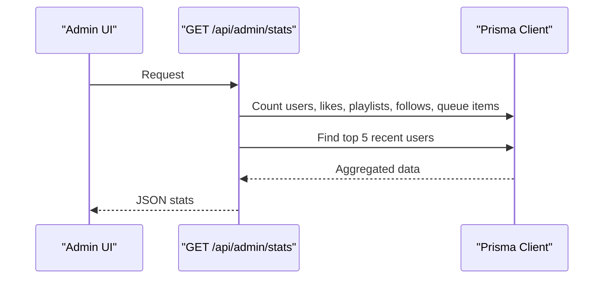
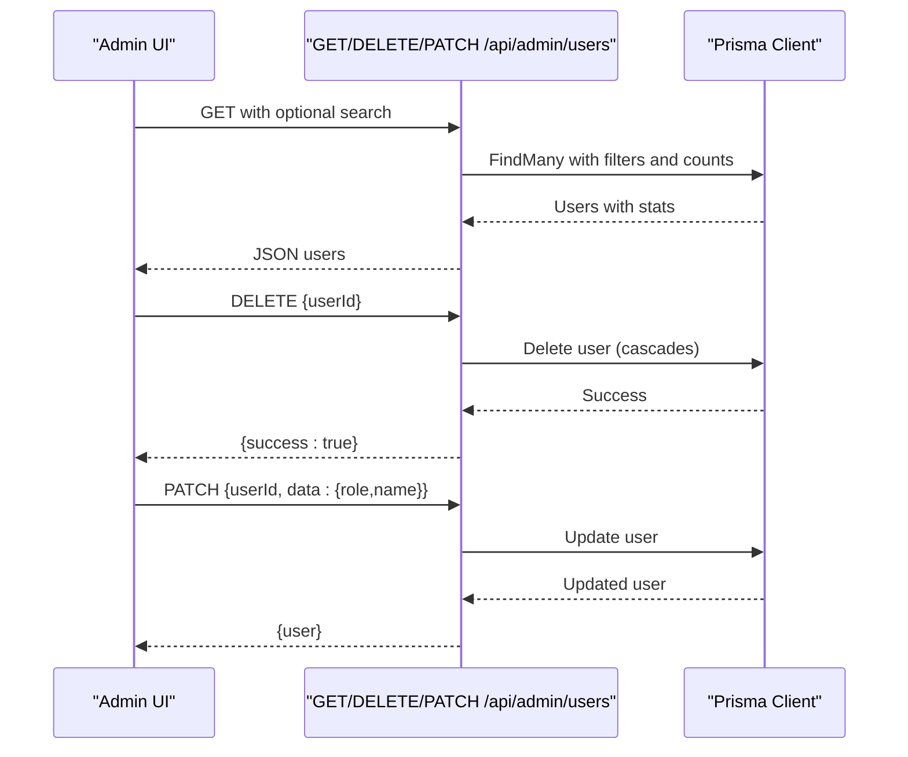
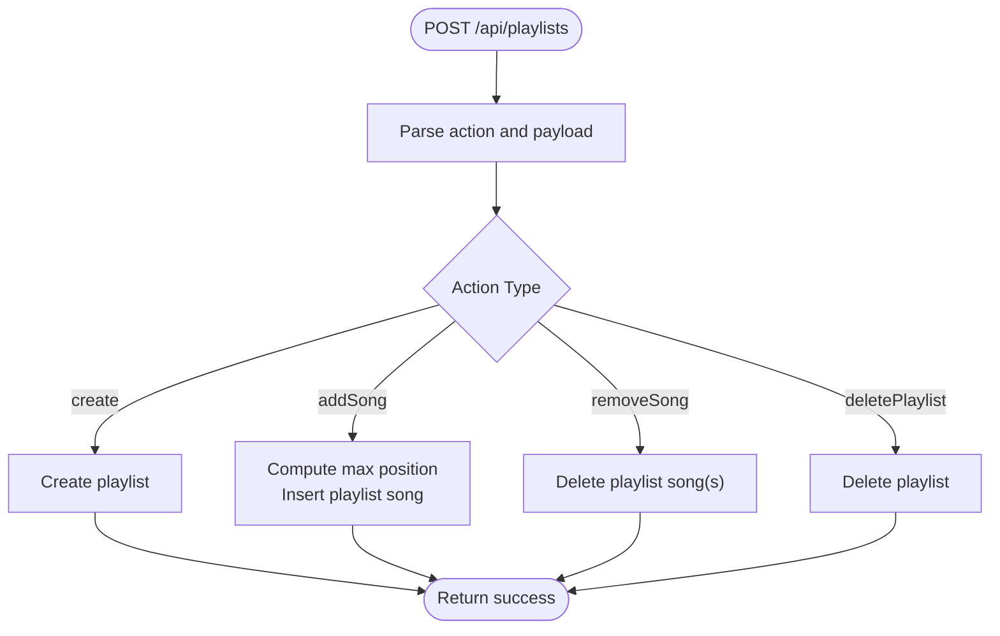
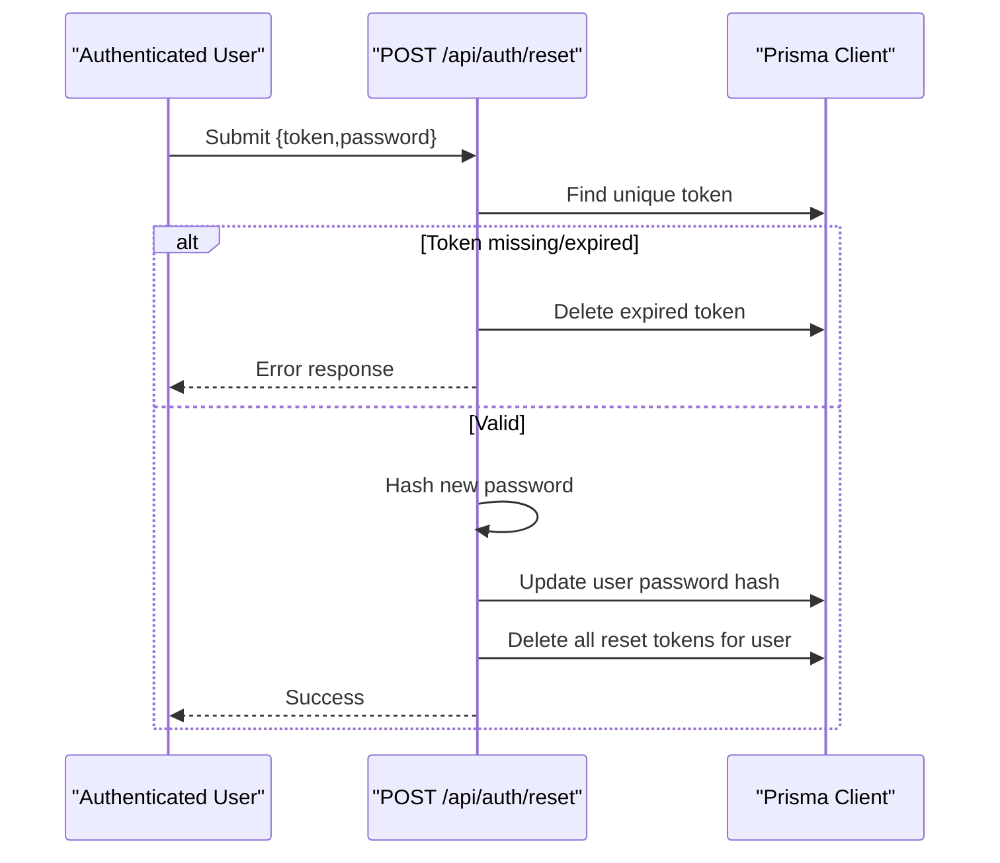
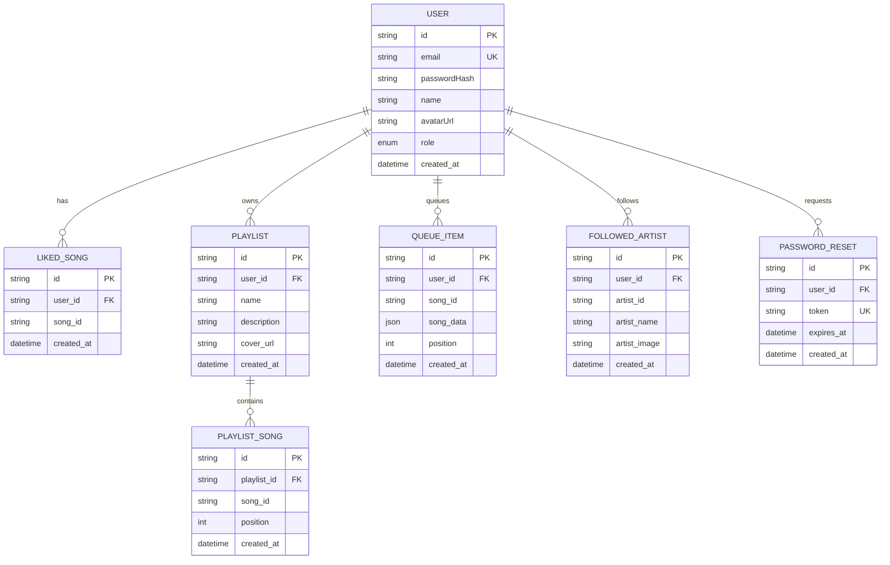
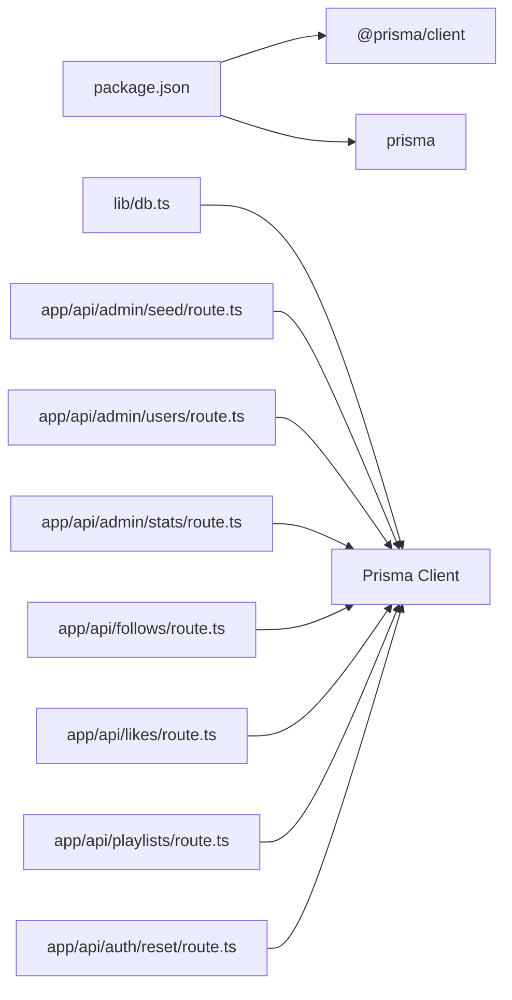

# Database Operations and Maintenance

<cite>
**Referenced Files in This Document**
- [db.ts](file://lib/db.ts)
- [schema.prisma](file://prisma/schema.prisma)
- [seed/route.ts](file://app/api/admin/seed/route.ts)
- [stats/route.ts](file://app/api/admin/stats/route.ts)
- [users/route.ts](file://app/api/admin/users/route.ts)
- [README.md](file://README.md)
- [package.json](file://package.json)
- [follows/route.ts](file://app/api/follows/route.ts)
- [likes/route.ts](file://app/api/likes/route.ts)
- [playlists/route.ts](file://app/api/playlists/route.ts)
- [reset/route.ts](file://app/api/auth/reset/route.ts)
</cite>

## Table of Contents
1. [Introduction](#introduction)
2. [Project Structure](#project-structure)
3. [Core Components](#core-components)
4. [Architecture Overview](#architecture-overview)
5. [Detailed Component Analysis](#detailed-component-analysis)
6. [Dependency Analysis](#dependency-analysis)
7. [Performance Considerations](#performance-considerations)
8. [Troubleshooting Guide](#troubleshooting-guide)
9. [Conclusion](#conclusion)
10. [Appendices](#appendices)

## Introduction
This document provides comprehensive guidance for database operations, maintenance, and administration in SonicStream. It covers database seeding and initialization, bulk operations, backup and recovery, monitoring and alerting, performance tuning, connection and transaction management, error recovery, administrative API endpoints, security considerations, and scalability topics such as read replicas and high availability. The content is grounded in the repository’s database schema, connection management, and administrative endpoints.

## Project Structure
SonicStream uses Prisma ORM with a PostgreSQL datasource. The database client is initialized once per process and reused globally during development. Administrative endpoints expose seeding, statistics aggregation, and user management capabilities. The project README documents the tech stack and initial setup steps.

**Diagram sources**
- [db.ts:1-10](file://lib/db.ts#L1-L10)
- [schema.prisma:5-9](file://prisma/schema.prisma#L5-L9)
- [seed/route.ts:1-40](file://app/api/admin/seed/route.ts#L1-L40)
- [users/route.ts:1-75](file://app/api/admin/users/route.ts#L1-L75)
- [stats/route.ts:1-28](file://app/api/admin/stats/route.ts#L1-L28)

**Section sources**
- [README.md:21-31](file://README.md#L21-L31)
- [package.json:12-35](file://package.json#L12-L35)

## Core Components
- Database client lifecycle and connection management:
  - A singleton PrismaClient is created and cached in a global variable during development to avoid multiple client instances.
  - Production environments rely on the default Prisma behavior; the global caching pattern prevents hot reload issues in development.
- Schema and data model:
  - PostgreSQL is configured via environment variables for both primary and direct URLs.
  - The schema defines core entities (User, LikedSong, Playlist, PlaylistSong, QueueItem, FollowedArtist, PasswordReset) with relations and constraints.
- Administrative endpoints:
  - Seed endpoint initializes or elevates an admin user.
  - Stats endpoint aggregates counts and recent users.
  - Users endpoint lists users with counts and supports deletion and updates.

**Section sources**
- [db.ts:1-10](file://lib/db.ts#L1-L10)
- [schema.prisma:5-9](file://prisma/schema.prisma#L5-L9)
- [schema.prisma:16-32](file://prisma/schema.prisma#L16-L32)
- [schema.prisma:34-44](file://prisma/schema.prisma#L34-L44)
- [schema.prisma:46-58](file://prisma/schema.prisma#L46-L58)
- [schema.prisma:60-71](file://prisma/schema.prisma#L60-L71)
- [schema.prisma:73-84](file://prisma/schema.prisma#L73-L84)
- [schema.prisma:86-98](file://prisma/schema.prisma#L86-L98)
- [schema.prisma:100-110](file://prisma/schema.prisma#L100-L110)
- [seed/route.ts:1-40](file://app/api/admin/seed/route.ts#L1-L40)
- [stats/route.ts:1-28](file://app/api/admin/stats/route.ts#L1-L28)
- [users/route.ts:1-75](file://app/api/admin/users/route.ts#L1-L75)

## Architecture Overview
The application relies on Prisma to connect to a PostgreSQL database. Administrative operations are exposed via dedicated API routes. The schema enforces referential integrity and uniqueness constraints. Authentication and password reset flows leverage the database for token storage and validation.

**Diagram sources**
- [seed/route.ts:1-40](file://app/api/admin/seed/route.ts#L1-L40)
- [users/route.ts:1-75](file://app/api/admin/users/route.ts#L1-L75)
- [stats/route.ts:1-28](file://app/api/admin/stats/route.ts#L1-L28)
- [follows/route.ts:1-55](file://app/api/follows/route.ts#L1-L55)
- [likes/route.ts:1-55](file://app/api/likes/route.ts#L1-L55)
- [playlists/route.ts:1-90](file://app/api/playlists/route.ts#L1-L90)
- [reset/route.ts:1-47](file://app/api/auth/reset/route.ts#L1-L47)
- [db.ts:1-10](file://lib/db.ts#L1-L10)
- [schema.prisma:5-9](file://prisma/schema.prisma#L5-L9)

## Detailed Component Analysis

### Database Connection Management
- Singleton client creation:
  - The Prisma client is instantiated once and stored in a global variable during development to prevent multiple clients and reduce overhead.
  - In production, the default Prisma client lifecycle applies.
- Datasource configuration:
  - The schema configures PostgreSQL with two URLs: a primary URL and a direct URL. These are resolved from environment variables.
- Implications:
  - Global caching avoids duplicate connections in development.
  - Environment-driven configuration enables separation of concerns between primary and direct access.

**Diagram sources**
- [db.ts:1-10](file://lib/db.ts#L1-L10)

**Section sources**
- [db.ts:1-10](file://lib/db.ts#L1-L10)
- [schema.prisma:5-9](file://prisma/schema.prisma#L5-L9)

### Database Seeding and Initialization
- Purpose:
  - Initialize or elevate an admin user with a predefined email and hashed password.
- Behavior:
  - Checks for an existing admin user by email.
  - Updates role to ADMIN if found; otherwise creates a new admin user with a hashed password.
  - Uses a deterministic hashing scheme with a salt appended to the password.
- Error handling:
  - Logs errors and returns a 500 response on failure.

**Diagram sources**
- [seed/route.ts:1-40](file://app/api/admin/seed/route.ts#L1-L40)

**Section sources**
- [seed/route.ts:1-40](file://app/api/admin/seed/route.ts#L1-L40)

### Administrative Statistics Endpoint
- Purpose:
  - Provide aggregated metrics and recent users for administrative dashboards.
- Implementation:
  - Executes concurrent queries for counts across users, likes, playlists, follows, and queued items.
  - Retrieves the most recent users with selected fields.
- Output:
  - Returns totals and recent users in a single JSON payload.

**Diagram sources**
- [stats/route.ts:1-28](file://app/api/admin/stats/route.ts#L1-L28)

**Section sources**
- [stats/route.ts:1-28](file://app/api/admin/stats/route.ts#L1-L28)

### User Management API
- Listing users:
  - Supports optional search by name or email (case-insensitive partial match).
  - Includes counts for liked songs, playlists, followed artists, and queue items.
- Deleting users:
  - Requires a JSON body containing the user identifier; performs a cascading delete.
- Updating users:
  - Allows updating role and/or name via a patch operation.

**Diagram sources**
- [users/route.ts:1-75](file://app/api/admin/users/route.ts#L1-L75)

**Section sources**
- [users/route.ts:1-75](file://app/api/admin/users/route.ts#L1-L75)

### Bulk Data Operations
- Playlists service demonstrates controlled bulk-like operations:
  - Create playlist, add song (with computed position), remove song, and delete playlist.
  - Uses unique constraints to handle duplicates gracefully.
- Recommendations:
  - For very large datasets, batch operations and transactions are recommended to maintain consistency and performance.
  - Consider using Prisma transactions for multi-step operations to ensure atomicity.

**Diagram sources**
- [playlists/route.ts:18-74](file://app/api/playlists/route.ts#L18-L74)

**Section sources**
- [playlists/route.ts:1-90](file://app/api/playlists/route.ts#L1-L90)

### Authentication and Password Reset
- Password reset flow:
  - Validates token existence and expiration.
  - Hashes the new password using a deterministic scheme.
  - Updates the user’s password hash and cleans up related reset tokens.
- Security note:
  - Tokens are unique and expire; expired tokens are cleaned up after validation.

**Diagram sources**
- [reset/route.ts:1-47](file://app/api/auth/reset/route.ts#L1-L47)

**Section sources**
- [reset/route.ts:1-47](file://app/api/auth/reset/route.ts#L1-L47)

### Data Model Overview
The schema defines core entities and relationships. Unique constraints and relations enforce data integrity.

**Diagram sources**
- [schema.prisma:16-32](file://prisma/schema.prisma#L16-L32)
- [schema.prisma:34-44](file://prisma/schema.prisma#L34-L44)
- [schema.prisma:46-58](file://prisma/schema.prisma#L46-L58)
- [schema.prisma:60-71](file://prisma/schema.prisma#L60-L71)
- [schema.prisma:73-84](file://prisma/schema.prisma#L73-L84)
- [schema.prisma:86-98](file://prisma/schema.prisma#L86-L98)
- [schema.prisma:100-110](file://prisma/schema.prisma#L100-L110)

**Section sources**
- [schema.prisma:16-32](file://prisma/schema.prisma#L16-L32)
- [schema.prisma:34-44](file://prisma/schema.prisma#L34-L44)
- [schema.prisma:46-58](file://prisma/schema.prisma#L46-L58)
- [schema.prisma:60-71](file://prisma/schema.prisma#L60-L71)
- [schema.prisma:73-84](file://prisma/schema.prisma#L73-L84)
- [schema.prisma:86-98](file://prisma/schema.prisma#L86-L98)
- [schema.prisma:100-110](file://prisma/schema.prisma#L100-L110)

## Dependency Analysis
- External dependencies relevant to database operations:
  - Prisma client and Prisma CLI are included as dependencies.
  - PostgreSQL driver and related packages are present in lock files.
- Internal dependencies:
  - Administrative routes depend on the shared Prisma client.
  - Domain routes (follows, likes, playlists) also depend on the shared Prisma client.

**Diagram sources**
- [package.json:16-46](file://package.json#L16-L46)
- [db.ts:1-10](file://lib/db.ts#L1-L10)
- [seed/route.ts:1-40](file://app/api/admin/seed/route.ts#L1-L40)
- [users/route.ts:1-75](file://app/api/admin/users/route.ts#L1-L75)
- [stats/route.ts:1-28](file://app/api/admin/stats/route.ts#L1-L28)
- [follows/route.ts:1-55](file://app/api/follows/route.ts#L1-L55)
- [likes/route.ts:1-55](file://app/api/likes/route.ts#L1-L55)
- [playlists/route.ts:1-90](file://app/api/playlists/route.ts#L1-L90)
- [reset/route.ts:1-47](file://app/api/auth/reset/route.ts#L1-L47)

**Section sources**
- [package.json:16-46](file://package.json#L16-L46)
- [db.ts:1-10](file://lib/db.ts#L1-L10)

## Performance Considerations
- Connection management:
  - Reuse the singleton Prisma client to minimize overhead.
  - Avoid creating multiple clients in development; rely on the global cache.
- Query patterns:
  - Use selective field retrieval and pagination for large lists.
  - Prefer filtered queries with indexes (unique fields like email) for lookup-heavy operations.
- Bulk operations:
  - Batch inserts/updates when adding many records; consider transactions to maintain atomicity.
- Monitoring:
  - Track slow queries and long-running transactions.
  - Monitor connection pool saturation and timeouts.
- Indexing:
  - Ensure unique and frequently queried fields are indexed (e.g., user email, playlist-song uniqueness).
- Caching:
  - Cache infrequent administrative stats to reduce database load.

[No sources needed since this section provides general guidance]

## Troubleshooting Guide
- Seed endpoint failures:
  - Verify environment variables for database URLs and that the database is reachable.
  - Confirm the hashing logic and that the admin email does not conflict with existing users.
- User management errors:
  - Ensure the request body includes the required identifiers.
  - Check for cascading deletes and permissions.
- Authentication reset issues:
  - Validate token presence and expiration.
  - Confirm password length constraints and that reset tokens are cleaned up after use.
- General database connectivity:
  - Confirm DATABASE_URL and DIRECT_URL environment variables.
  - Review Prisma client initialization and global caching behavior in development.

**Section sources**
- [seed/route.ts:1-40](file://app/api/admin/seed/route.ts#L1-L40)
- [users/route.ts:1-75](file://app/api/admin/users/route.ts#L1-L75)
- [reset/route.ts:1-47](file://app/api/auth/reset/route.ts#L1-L47)
- [schema.prisma:5-9](file://prisma/schema.prisma#L5-L9)
- [db.ts:1-10](file://lib/db.ts#L1-L10)

## Conclusion
SonicStream’s database layer is centered around a singleton Prisma client, a PostgreSQL datasource, and a set of administrative and domain API endpoints. The schema enforces integrity through relations and unique constraints. Administrative endpoints support seeding, statistics, and user management. For production, ensure secure environment configuration, monitor performance, and adopt transactional and batching strategies for bulk operations. The current implementation provides a solid foundation for database operations and can be extended with monitoring, backups, and high-availability configurations as the platform scales.

[No sources needed since this section summarizes without analyzing specific files]

## Appendices

### Backup and Recovery Procedures
- Recommended approach:
  - Use managed PostgreSQL backups (e.g., cloud provider snapshots or logical dumps).
  - Schedule regular automated backups and test restoration procedures.
  - Maintain point-in-time recovery (PITR) where supported.
- Operational steps:
  - Coordinate downtime windows for major migrations.
  - Validate backup integrity and restore test procedures regularly.
  - Keep rollback plans for schema and data changes.

[No sources needed since this section provides general guidance]

### Monitoring and Alerting Setup
- Metrics to track:
  - Query latency and throughput.
  - Connection pool utilization and timeouts.
  - Error rates for administrative and domain endpoints.
- Tools:
  - Use database-native monitoring and APM solutions.
  - Set alerts for high latency, timeouts, and repeated errors.

[No sources needed since this section provides general guidance]

### Performance Tuning Techniques
- Optimize queries:
  - Use EXPLAIN/ANALYZE to identify bottlenecks.
  - Add appropriate indexes for frequent filters and joins.
- Connection pooling:
  - Tune pool size and timeouts based on workload.
- Transactions:
  - Wrap multi-step writes in transactions to ensure consistency.

[No sources needed since this section provides general guidance]

### Transaction Handling and Error Recovery
- Use Prisma transactions for multi-entity updates.
- Handle Prisma error codes (e.g., unique constraint violations) gracefully.
- Implement retry logic for transient failures and idempotent operations where possible.

[No sources needed since this section provides general guidance]

### Security Considerations
- Credential management:
  - Store DATABASE_URL and DIRECT_URL in secure environment variables.
  - Rotate secrets periodically and limit access to deployment systems.
- Access control:
  - Restrict administrative endpoints to authorized administrators.
  - Enforce HTTPS and secure cookies for authentication.
- Audit logging:
  - Log administrative actions and failed attempts for auditing.
  - Avoid logging sensitive data such as passwords or tokens.

[No sources needed since this section provides general guidance]

### Scaling and High Availability
- Read replicas:
  - Route read-heavy administrative stats to read replicas.
- High availability:
  - Use managed PostgreSQL with automatic failover.
- Load distribution:
  - Scale horizontally by adding read replicas and optimizing queries.

[No sources needed since this section provides general guidance]