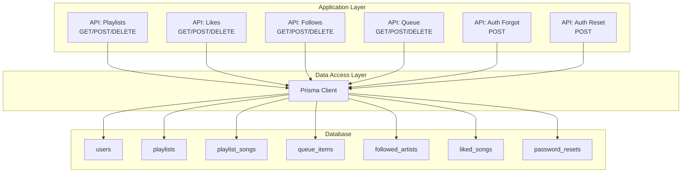
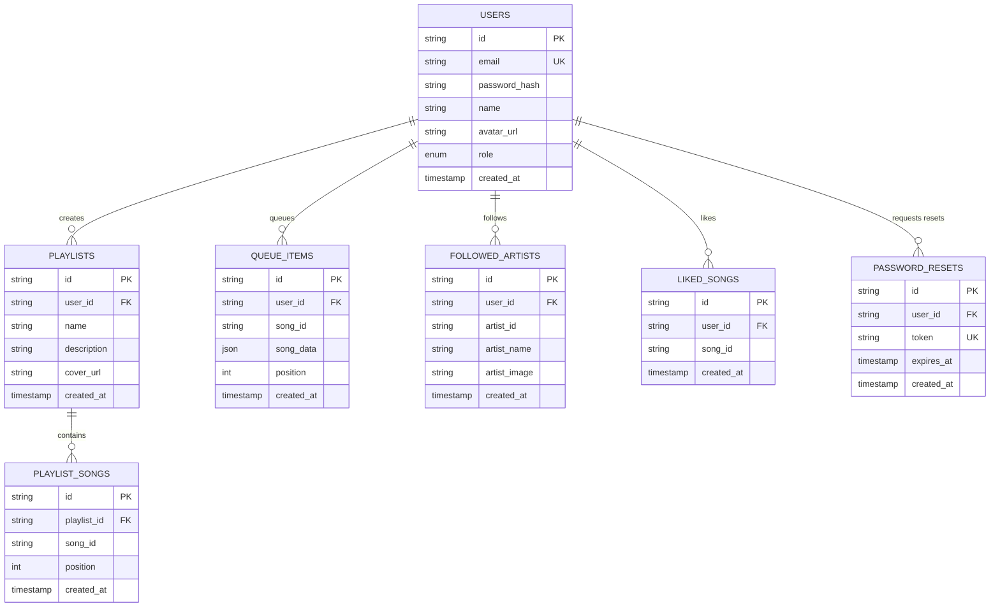
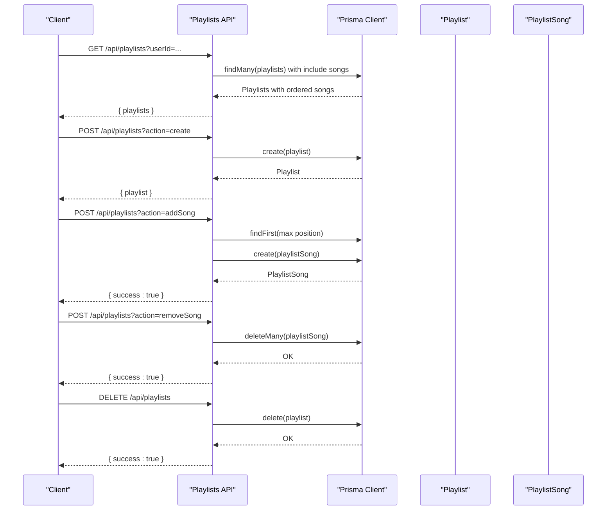
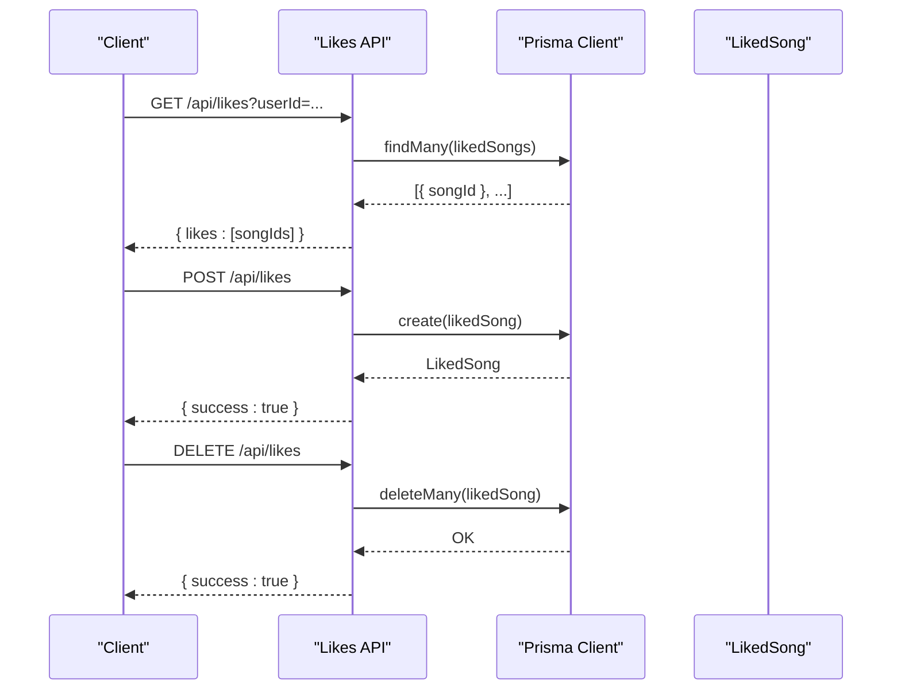
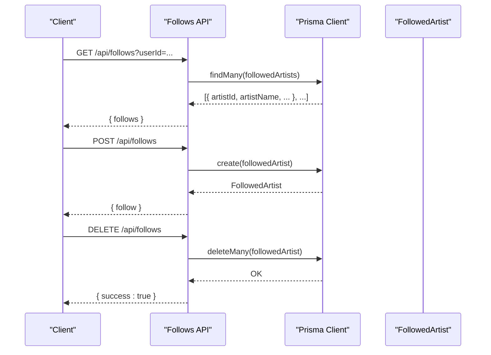
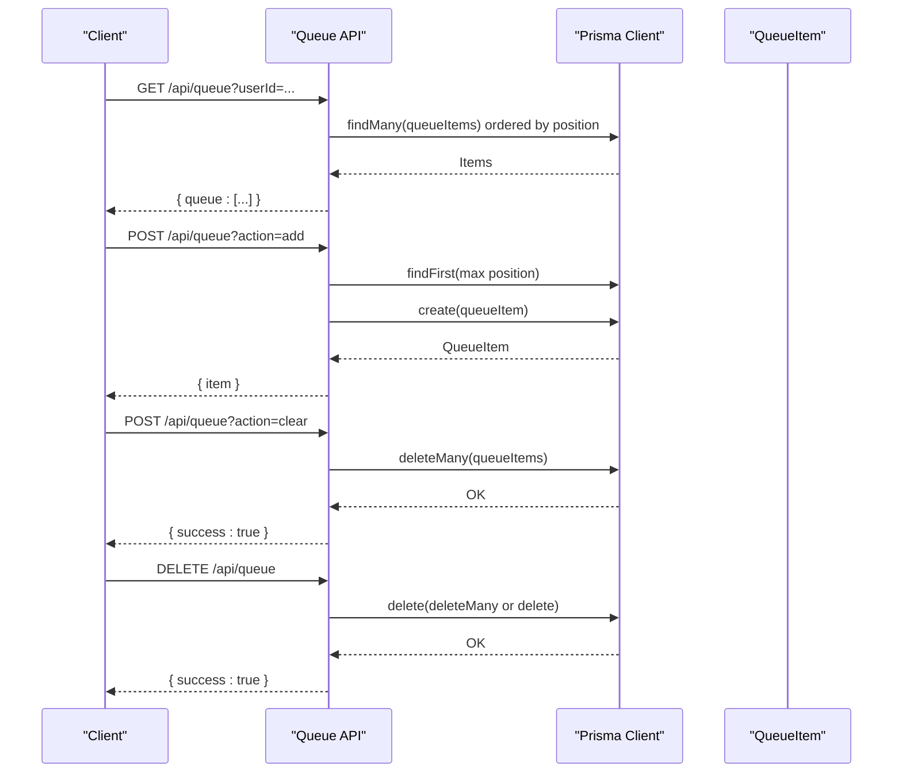
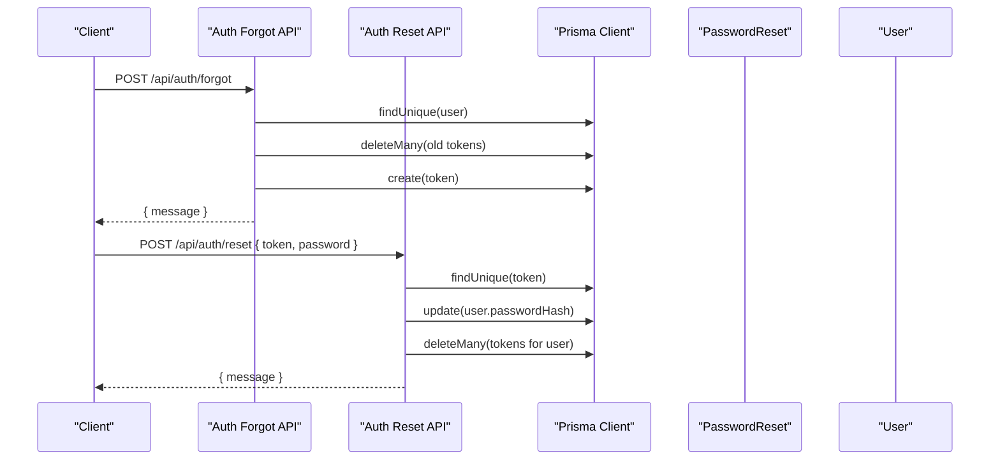
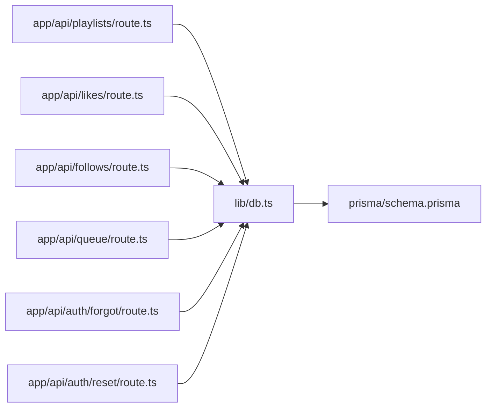

# Entity Relationships and Data Modeling

<cite>
**Referenced Files in This Document**
- [schema.prisma](file://prisma/schema.prisma)
- [db.ts](file://lib/db.ts)
- [playlists/route.ts](file://app/api/playlists/route.ts)
- [likes/route.ts](file://app/api/likes/route.ts)
- [follows/route.ts](file://app/api/follows/route.ts)
- [queue/route.ts](file://app/api/queue/route.ts)
- [forgot/route.ts](file://app/api/auth/forgot/route.ts)
- [reset/route.ts](file://app/api/auth/reset/route.ts)
</cite>

## Table of Contents
1. [Introduction](#introduction)
2. [Project Structure](#project-structure)
3. [Core Components](#core-components)
4. [Architecture Overview](#architecture-overview)
5. [Detailed Component Analysis](#detailed-component-analysis)
6. [Dependency Analysis](#dependency-analysis)
7. [Performance Considerations](#performance-considerations)
8. [Troubleshooting Guide](#troubleshooting-guide)
9. [Conclusion](#conclusion)

## Introduction
This document explains SonicStream’s database entity relationships and data modeling patterns. It focuses on the core domain entities: User, Song, Playlist, QueueItem, FollowedArtist, LikedSong, and PasswordReset. It details foreign key relationships, cascading delete behaviors, referential integrity constraints, many-to-many associations via junction tables, unique constraints, composite keys, and indexing strategies. It also explains the design rationale behind each relationship and how they support key application features such as user playlists, song queuing, and social following.

## Project Structure
The data model is defined declaratively using Prisma Schema and consumed by Next.js API routes. The Prisma client is initialized once and reused globally to minimize overhead.

**Diagram sources**
- [db.ts:1-10](file://lib/db.ts#L1-L10)
- [schema.prisma:16-110](file://prisma/schema.prisma#L16-L110)
- [playlists/route.ts:1-90](file://app/api/playlists/route.ts#L1-L90)
- [likes/route.ts:1-55](file://app/api/likes/route.ts#L1-L55)
- [follows/route.ts:1-55](file://app/api/follows/route.ts#L1-L55)
- [queue/route.ts:1-86](file://app/api/queue/route.ts#L1-L86)
- [forgot/route.ts:1-68](file://app/api/auth/forgot/route.ts#L1-L68)
- [reset/route.ts:1-48](file://app/api/auth/reset/route.ts#L1-L48)

**Section sources**
- [db.ts:1-10](file://lib/db.ts#L1-L10)
- [schema.prisma:1-111](file://prisma/schema.prisma#L1-L111)

## Core Components
This section documents each entity, its fields, relationships, and constraints.

- User
  - Identity: String ID (UUID via cuid)
  - Attributes: email (unique), passwordHash, name, avatarUrl, role, createdAt
  - Relationships:
    - One-to-many: playlists, queueItems, followedArtists, passwordResets
    - Many-to-many via junction: likedSongs (via LikedSong)
  - Constraints: email unique; role defaults to USER

- Song
  - Identity: String ID (UUID via cuid)
  - Attributes: title, image, album, url, type, description, primaryArtists, singers, language, year
  - Relationships:
    - Many-to-many: playlists (via PlaylistSong)
    - Many-to-many: users (via LikedSong)
  - Notes: Song is referenced by foreign keys but not defined as a model in the provided schema. It is represented by songId and songData in QueueItem and by songId in LikedSong and PlaylistSong.

- Playlist
  - Identity: String ID (UUID)
  - Attributes: userId (foreign key), name, description, coverUrl, createdAt
  - Relationships:
    - Many-to-one: user
    - Many-to-many: songs (via PlaylistSong)
  - Constraints: Composite unique on (userId, name) implied by application logic; explicit unique on (playlistId, songId) in junction table

- PlaylistSong (Junction)
  - Identity: String ID (UUID)
  - Attributes: playlistId, songId, position, createdAt
  - Relationships:
    - Many-to-one: playlist
  - Constraints: Composite unique on (playlistId, songId); cascade delete on playlist

- QueueItem
  - Identity: String ID (UUID)
  - Attributes: userId, songId, songData (JSON), position, createdAt
  - Relationships:
    - Many-to-one: user
  - Constraints: No explicit unique; cascade delete on user

- FollowedArtist
  - Identity: String ID (UUID)
  - Attributes: userId, artistId, artistName, artistImage, createdAt
  - Relationships:
    - Many-to-one: user
  - Constraints: Composite unique on (userId, artistId); cascade delete on user

- LikedSong (Junction)
  - Identity: String ID (UUID)
  - Attributes: userId, songId, createdAt
  - Relationships:
    - Many-to-one: user
  - Constraints: Composite unique on (userId, songId); cascade delete on user

- PasswordReset
  - Identity: String ID (UUID)
  - Attributes: userId, token (unique), expiresAt, createdAt
  - Relationships:
    - Many-to-one: user
  - Constraints: token unique; cascade delete on user

**Section sources**
- [schema.prisma:16-110](file://prisma/schema.prisma#L16-L110)

## Architecture Overview
The data model enforces referential integrity through foreign keys and cascade deletes. Many-to-many relationships are implemented via explicit junction tables, ensuring clean separation of concerns and predictable cardinalities.

**Diagram sources**
- [schema.prisma:16-110](file://prisma/schema.prisma#L16-L110)

## Detailed Component Analysis

### User Model
- Purpose: Represents application users with roles and associated collections.
- Key relationships:
  - playlists: One-to-many; cascade delete ensures playlists are removed when a user is deleted.
  - queueItems: One-to-many; cascade delete ensures queue entries are removed when a user is deleted.
  - followedArtists: One-to-many; cascade delete ensures follow records are removed when a user is deleted.
  - passwordResets: One-to-many; cascade delete ensures reset tokens are removed when a user is deleted.
  - likedSongs: Many-to-many via LikedSong; enforced by composite unique (userId, songId).

**Section sources**
- [schema.prisma:16-32](file://prisma/schema.prisma#L16-L32)
- [schema.prisma:25-29](file://prisma/schema.prisma#L25-L29)

### Playlist Model
- Purpose: Stores user-created playlists with metadata and ordered song associations.
- Key relationships:
  - user: Many-to-one; cascade delete ensures playlists are removed when a user is deleted.
  - songs: Many-to-many via PlaylistSong; positions maintained per playlist.

**Section sources**
- [schema.prisma:46-58](file://prisma/schema.prisma#L46-L58)
- [schema.prisma:54-55](file://prisma/schema.prisma#L54-L55)

### PlaylistSong (Junction)
- Purpose: Maintains many-to-many relationship between Playlist and Song, with ordering.
- Unique constraint: Composite (playlistId, songId) prevents duplicates.
- Cascade behavior: Deleting a playlist removes its PlaylistSong rows.

**Section sources**
- [schema.prisma:60-71](file://prisma/schema.prisma#L60-L71)
- [schema.prisma:67](file://prisma/schema.prisma#L67)

### QueueItem
- Purpose: Stores per-user playback queue entries with JSON song metadata and position ordering.
- Cascade behavior: Deleting a user removes their queue items.
- Design note: songData allows storing dynamic song metadata without duplicating Song model definitions.

**Section sources**
- [schema.prisma:73-84](file://prisma/schema.prisma#L73-L84)
- [schema.prisma:81](file://prisma/schema.prisma#L81)

### FollowedArtist
- Purpose: Tracks which artists a user follows, including artist metadata snapshots.
- Unique constraint: Composite (userId, artistId) prevents duplicate follow entries.
- Cascade behavior: Deleting a user removes their follow records.

**Section sources**
- [schema.prisma:86-98](file://prisma/schema.prisma#L86-L98)
- [schema.prisma:94](file://prisma/schema.prisma#L94)

### LikedSong (Junction)
- Purpose: Tracks which songs a user has liked.
- Unique constraint: Composite (userId, songId) prevents duplicate likes.
- Cascade behavior: Deleting a user removes their like records.

**Section sources**
- [schema.prisma:34-44](file://prisma/schema.prisma#L34-L44)
- [schema.prisma:40](file://prisma/schema.prisma#L40)

### PasswordReset
- Purpose: Manages secure password reset tokens with expiration.
- Unique constraint: token unique; cascade delete ensures cleanup when a user is deleted.

**Section sources**
- [schema.prisma:100-110](file://prisma/schema.prisma#L100-L110)
- [schema.prisma:107](file://prisma/schema.prisma#L107)

### API Workflows and Relationship Usage

#### Playlist Management Workflow

**Diagram sources**
- [playlists/route.ts:4-16](file://app/api/playlists/route.ts#L4-L16)
- [playlists/route.ts:18-74](file://app/api/playlists/route.ts#L18-L74)
- [playlists/route.ts:76-90](file://app/api/playlists/route.ts#L76-L90)

**Section sources**
- [playlists/route.ts:1-90](file://app/api/playlists/route.ts#L1-L90)

#### Like/Unlike Workflow

**Diagram sources**
- [likes/route.ts:4-15](file://app/api/likes/route.ts#L4-L15)
- [likes/rroute.ts:17-36](file://app/api/likes/route.ts#L17-L36)
- [likes/route.ts:38-54](file://app/api/likes/route.ts#L38-L54)

**Section sources**
- [likes/route.ts:1-55](file://app/api/likes/route.ts#L1-L55)

#### Follow/Unfollow Workflow

**Diagram sources**
- [follows/route.ts:4-15](file://app/api/follows/route.ts#L4-L15)
- [follows/route.ts:17-36](file://app/api/follows/route.ts#L17-L36)
- [follows/route.ts:38-54](file://app/api/follows/route.ts#L38-L54)

**Section sources**
- [follows/route.ts:1-55](file://app/api/follows/route.ts#L1-L55)

#### Queue Management Workflow

**Diagram sources**
- [queue/route.ts:4-22](file://app/api/queue/route.ts#L4-L22)
- [queue/route.ts:24-66](file://app/api/queue/route.ts#L24-L66)
- [queue/route.ts:68-86](file://app/api/queue/route.ts#L68-L86)

**Section sources**
- [queue/route.ts:1-86](file://app/api/queue/route.ts#L1-L86)

#### Password Reset Workflow

**Diagram sources**
- [forgot/route.ts:5-68](file://app/api/auth/forgot/route.ts#L5-L68)
- [reset/route.ts:13-48](file://app/api/auth/reset/route.ts#L13-L48)

**Section sources**
- [forgot/route.ts:1-68](file://app/api/auth/forgot/route.ts#L1-L68)
- [reset/route.ts:1-48](file://app/api/auth/reset/route.ts#L1-L48)

## Dependency Analysis
- Internal dependencies:
  - API routes depend on the Prisma client initialized in lib/db.ts.
  - All routes operate against the schema-defined models and relations.
- External dependencies:
  - PostgreSQL provider configured via DATABASE_URL/DIRECT_URL.
  - Authentication APIs integrate with SMTP transport for password reset emails.

**Diagram sources**
- [db.ts:1-10](file://lib/db.ts#L1-L10)
- [schema.prisma:1-111](file://prisma/schema.prisma#L1-L111)
- [playlists/route.ts:1-90](file://app/api/playlists/route.ts#L1-L90)
- [likes/route.ts:1-55](file://app/api/likes/route.ts#L1-L55)
- [follows/route.ts:1-55](file://app/api/follows/route.ts#L1-L55)
- [queue/route.ts:1-86](file://app/api/queue/route.ts#L1-L86)
- [forgot/route.ts:1-68](file://app/api/auth/forgot/route.ts#L1-L68)
- [reset/route.ts:1-48](file://app/api/auth/reset/route.ts#L1-L48)

**Section sources**
- [db.ts:1-10](file://lib/db.ts#L1-L10)
- [schema.prisma:5-9](file://prisma/schema.prisma#L5-L9)

## Performance Considerations
- Indexing and unique constraints:
  - email on User is unique, enabling fast lookups and preventing duplicates.
  - token on PasswordReset is unique, ensuring efficient token retrieval and uniqueness checks.
  - Composite unique on (playlistId, songId) in PlaylistSong prevents duplicates and supports fast lookups for membership checks.
  - Composite unique on (userId, songId) in LikedSong prevents duplicate likes and supports fast existence checks.
  - Composite unique on (userId, artistId) in FollowedArtist prevents duplicate follows and supports fast lookup of follow relationships.
- Ordering and pagination:
  - Queue and Playlist endpoints order by position or createdAt, reducing client-side sorting and improving UX.
- Cascade deletes:
  - Reduce orphaned records and simplify cleanup during user deletion or playlist deletion.
- JSON storage:
  - songData in QueueItem avoids duplicating Song model fields and reduces schema complexity, at the cost of less strict typing and potential normalization trade-offs.

[No sources needed since this section provides general guidance]

## Troubleshooting Guide
- Duplicate insert errors:
  - LikedSong and PlaylistSong enforce (userId, songId) uniqueness; attempting to insert duplicates yields a unique constraint violation. The API routes handle this by returning a success message indicating the record already exists.
- Orphaned records:
  - Cascade deletes on User relationships ensure playlists, queue items, follows, and password resets are cleaned up when a user is deleted.
- Token lifecycle:
  - PasswordReset tokens are cleaned up after successful reset and upon expiration detection in the reset endpoint.
- Email delivery failures:
  - The forgot password endpoint continues to succeed even if email sending fails, ensuring token availability for manual reset URLs.

**Section sources**
- [likes/route.ts:30-35](file://app/api/likes/route.ts#L30-L35)
- [playlists/route.ts:69-73](file://app/api/playlists/route.ts#L69-L73)
- [forgot/route.ts:57-60](file://app/api/auth/forgot/route.ts#L57-L60)
- [reset/route.ts:28-31](file://app/api/auth/reset/route.ts#L28-L31)

## Conclusion
SonicStream’s data model cleanly separates concerns while supporting core features:
- Playlists and songs use a junction table with ordering for flexible composition.
- Likes and follows leverage composite unique constraints for integrity and simplicity.
- Queues store dynamic song metadata via JSON for flexibility.
- Cascade deletes maintain referential integrity across user lifecycle events.
- Unique constraints and composite keys ensure data consistency and enable efficient queries.