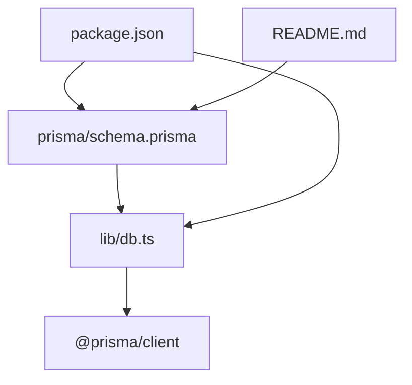
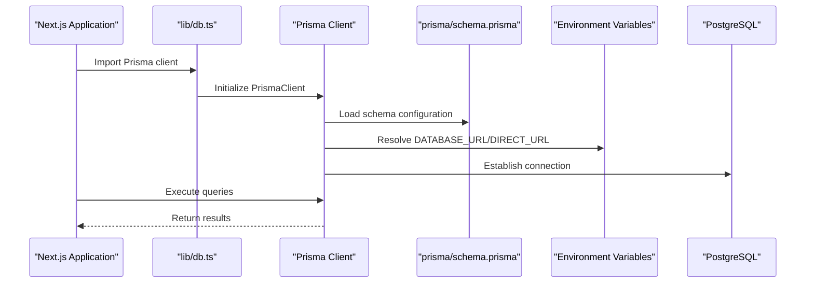
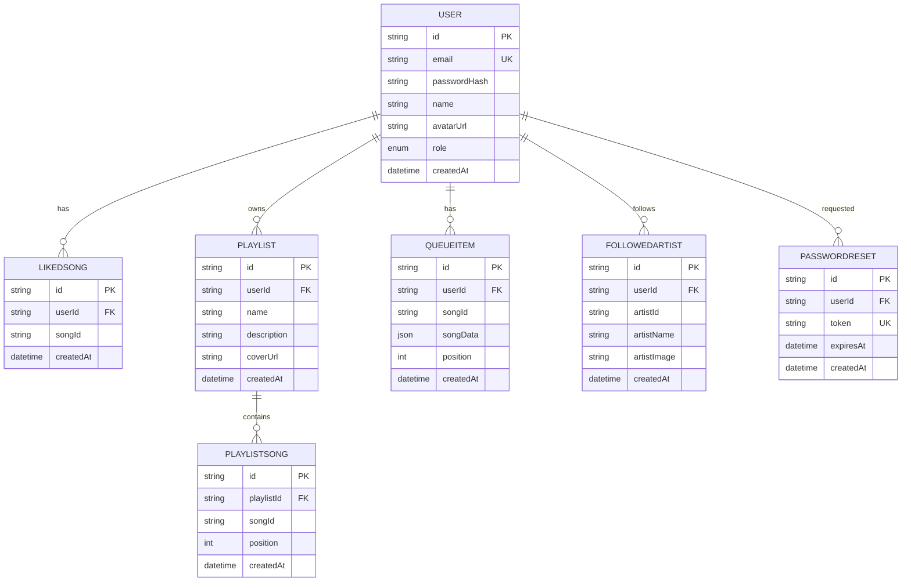
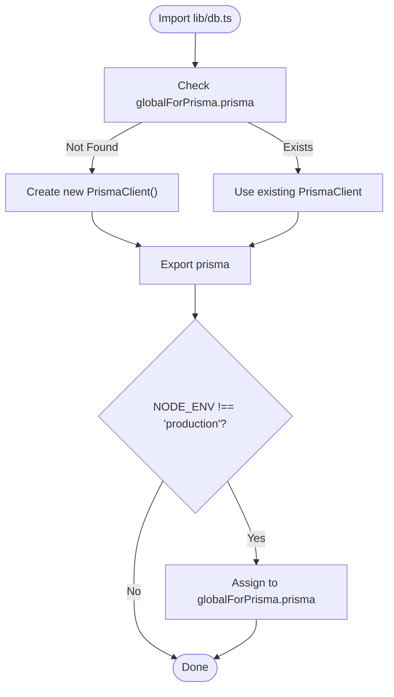
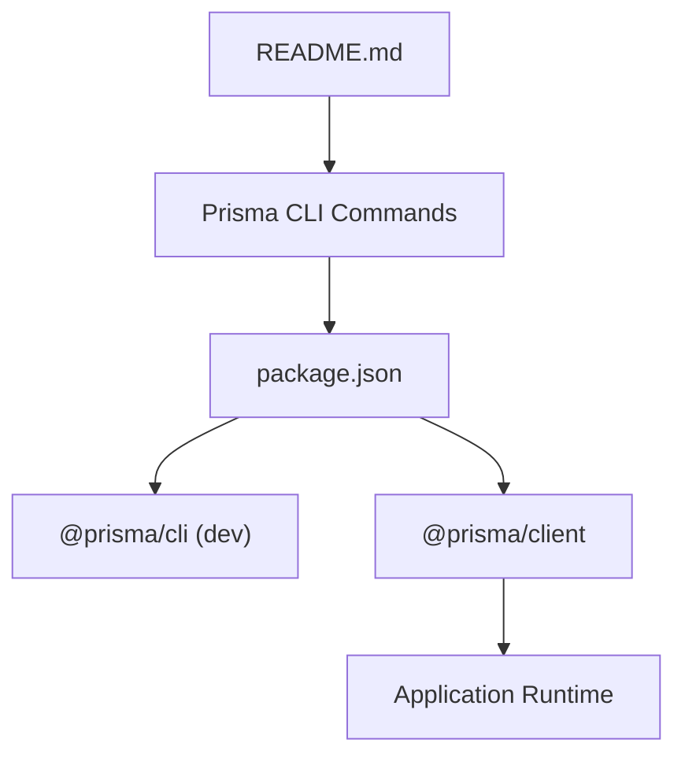

# Prisma Client Configuration and Migrations

<cite>
**Referenced Files in This Document**
- [schema.prisma](file://prisma/schema.prisma)
- [db.ts](file://lib/db.ts)
- [package.json](file://package.json)
- [README.md](file://README.md)
</cite>

## Table of Contents
1. [Introduction](#introduction)
2. [Project Structure](#project-structure)
3. [Core Components](#core-components)
4. [Architecture Overview](#architecture-overview)
5. [Detailed Component Analysis](#detailed-component-analysis)
6. [Dependency Analysis](#dependency-analysis)
7. [Performance Considerations](#performance-considerations)
8. [Troubleshooting Guide](#troubleshooting-guide)
9. [Conclusion](#conclusion)

## Introduction
This document provides comprehensive guidance for configuring and managing Prisma ORM in SonicStream. It covers Prisma schema configuration, client initialization, environment variable usage, connection strategies, migration workflows, and best practices for schema evolution and error handling. The goal is to help developers set up a robust, maintainable database layer that integrates seamlessly with the Next.js application.

## Project Structure
SonicStream organizes Prisma configuration under the prisma directory and initializes the Prisma client in lib/db.ts. The package.json defines Prisma as a development dependency and includes scripts for building and running the application. The README references Prisma CLI commands for database operations.

**Diagram sources**
- [schema.prisma:1-9](file://prisma/schema.prisma#L1-L9)
- [db.ts:1-10](file://lib/db.ts#L1-L10)
- [package.json:12-48](file://package.json#L12-L48)
- [README.md:53-53](file://README.md#L53-L53)

**Section sources**
- [schema.prisma:1-9](file://prisma/schema.prisma#L1-L9)
- [db.ts:1-10](file://lib/db.ts#L1-L10)
- [package.json:12-48](file://package.json#L12-L48)
- [README.md:53-53](file://README.md#L53-L53)

## Core Components
- Prisma Schema: Defines the generator, datasource, enums, and models for the application.
- Prisma Client Initialization: Establishes a singleton PrismaClient instance with environment-aware URL resolution.
- Environment Variables: Uses DATABASE_URL and DIRECT_URL for runtime configuration.
- Prisma CLI: Integrated via package.json scripts and referenced in README for migrations and introspection.

**Section sources**
- [schema.prisma:1-9](file://prisma/schema.prisma#L1-L9)
- [db.ts:1-10](file://lib/db.ts#L1-L10)
- [package.json:12-48](file://package.json#L12-L48)
- [README.md:53-53](file://README.md#L53-L53)

## Architecture Overview
The Prisma architecture in SonicStream centers around a single PrismaClient instance initialized in lib/db.ts. The client connects to a PostgreSQL database using URLs resolved from environment variables. The schema.prisma file defines the data model and datasource configuration, while package.json and README provide CLI integration and operational guidance.

**Diagram sources**
- [db.ts:1-10](file://lib/db.ts#L1-L10)
- [schema.prisma:5-9](file://prisma/schema.prisma#L5-L9)
- [package.json:12-48](file://package.json#L12-L48)
- [README.md:53-53](file://README.md#L53-L53)

## Detailed Component Analysis

### Prisma Schema Configuration
The schema defines:
- Generator: Uses prisma-client-js to generate the TypeScript client.
- Datasource: Configures PostgreSQL provider with url and directUrl resolved from environment variables.
- Enum: Role with USER and ADMIN values.
- Models: User, LikedSong, Playlist, PlaylistSong, QueueItem, FollowedArtist, PasswordReset with relations and constraints.

**Diagram sources**
- [schema.prisma:11-111](file://prisma/schema.prisma#L11-L111)

**Section sources**
- [schema.prisma:1-9](file://prisma/schema.prisma#L1-L9)
- [schema.prisma:11-111](file://prisma/schema.prisma#L11-L111)

### Prisma Client Initialization
The Prisma client is initialized as a singleton in lib/db.ts:
- Imports PrismaClient from @prisma/client.
- Creates a globalForPrisma object to cache the client instance.
- Exports prisma as a new PrismaClient if not present in global scope.
- Assigns the client to globalForPrisma.prisma in non-production environments to prevent hot reload issues.

**Diagram sources**
- [db.ts:1-10](file://lib/db.ts#L1-L10)

**Section sources**
- [db.ts:1-10](file://lib/db.ts#L1-L10)

### Environment Variable Usage
The schema.prisma datasource uses two environment variables:
- DATABASE_URL: Primary connection string for the database.
- DIRECT_URL: Direct connection string used for specific operations.

These variables are referenced in the datasource block and resolved at runtime by the Prisma client.

**Section sources**
- [schema.prisma:5-9](file://prisma/schema.prisma#L5-L9)

### Prisma CLI Commands and Migration Workflows
The project integrates Prisma CLI through package.json and README:
- Package scripts include dev, build, start, lint, and clean commands.
- README references npx prisma db push for applying schema changes to the database.

Recommended workflow:
- Run prisma db push to apply schema changes to the database.
- Use prisma migrate dev for versioned migrations during development.
- Use prisma migrate deploy for production deployments.
- Use prisma db seed to populate initial data.
- Use prisma studio for local database inspection.

**Section sources**
- [package.json:5-11](file://package.json#L5-L11)
- [README.md:53-53](file://README.md#L53-L53)

### Database URL Management and Connection Strategies
- DATABASE_URL: Used by the Prisma client to establish a connection to the PostgreSQL database.
- DIRECT_URL: Provides a direct connection string for operations that require bypassing Prisma’s connection pooling.

Best practices:
- Store DATABASE_URL and DIRECT_URL in environment variables.
- Use DIRECT_URL for administrative tasks and seed scripts.
- Keep DATABASE_URL for application runtime connections.

**Section sources**
- [schema.prisma:5-9](file://prisma/schema.prisma#L5-L9)

### Prisma Client Usage Patterns and Error Handling
Recommended usage patterns:
- Import the prisma instance from lib/db.ts in your application code.
- Use the client for CRUD operations, ensuring proper error handling.
- Wrap potentially failing operations in try/catch blocks.
- Log errors appropriately and return user-friendly messages.

Error handling strategies:
- Catch PrismaClientKnownRequestError for known database errors.
- Handle PrismaClientUnknownRequestError for unexpected issues.
- Use PrismaClientValidationError for schema validation failures.
- Implement retry logic for transient network errors.

**Section sources**
- [db.ts:1-10](file://lib/db.ts#L1-L10)

### Schema Evolution and Backward Compatibility
Guidelines for schema evolution:
- Use prisma migrate dev to create and manage migrations.
- Maintain backward compatibility by avoiding breaking changes to existing columns.
- Use optional fields and defaults to preserve existing data.
- Test migrations on a staging environment before applying to production.

Rollback procedures:
- Use prisma migrate resolve with mark-applied or mark-rolled-back depending on the desired outcome.
- Review migration history with prisma migrate status.
- Apply corrective migrations if needed.

**Section sources**
- [README.md:53-53](file://README.md#L53-L53)

## Dependency Analysis
Prisma is integrated as a development dependency in package.json and is used at runtime via the generated client. The README references Prisma CLI commands for database operations.

**Diagram sources**
- [package.json:12-48](file://package.json#L12-L48)
- [README.md:53-53](file://README.md#L53-L53)

**Section sources**
- [package.json:12-48](file://package.json#L12-L48)
- [README.md:53-53](file://README.md#L53-L53)

## Performance Considerations
- Connection pooling: The Prisma client manages connection pooling internally. Ensure DATABASE_URL is properly configured to avoid connection exhaustion.
- Query optimization: Use select and include carefully to minimize data transfer.
- Batch operations: Prefer batch operations for bulk updates or deletions.
- Indexing: Add appropriate indexes in the database for frequently queried columns.

## Troubleshooting Guide
Common issues and resolutions:
- Authentication failures: Verify DATABASE_URL credentials and network connectivity.
- Connection timeouts: Increase timeout settings and review network latency.
- Unique constraint violations: Handle PrismaClientKnownRequestError and adjust application logic.
- Null constraint violations: Ensure required fields are populated before insert/update operations.
- Too many connections: Monitor connection limits and optimize connection reuse.

**Section sources**
- [schema.prisma:5-9](file://prisma/schema.prisma#L5-L9)
- [db.ts:1-10](file://lib/db.ts#L1-L10)

## Conclusion
SonicStream’s Prisma configuration establishes a solid foundation for database management with a clear separation of concerns between schema definition, client initialization, and environment-driven configuration. By following the recommended workflows for migrations, error handling, and performance optimization, the application can maintain a robust and scalable data layer that evolves with the product’s needs.