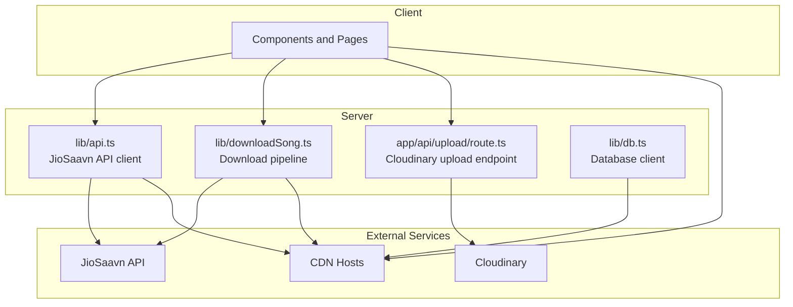
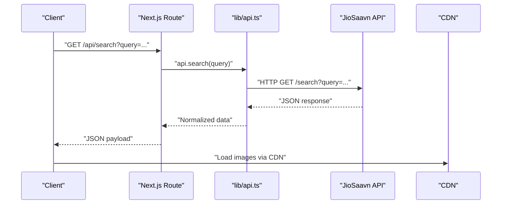
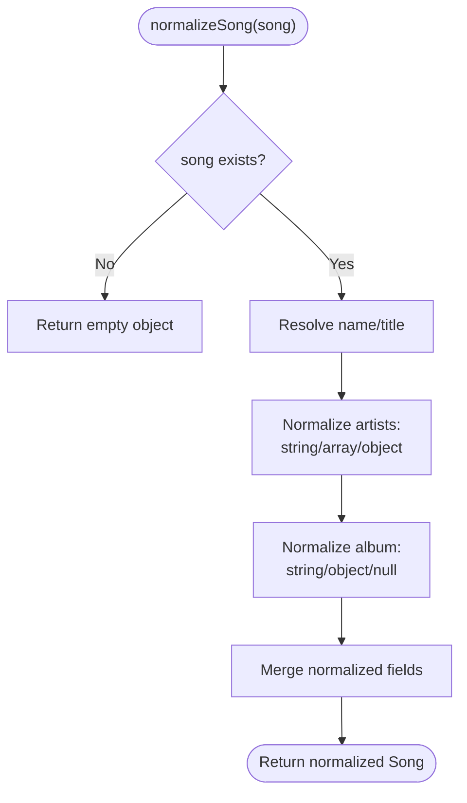
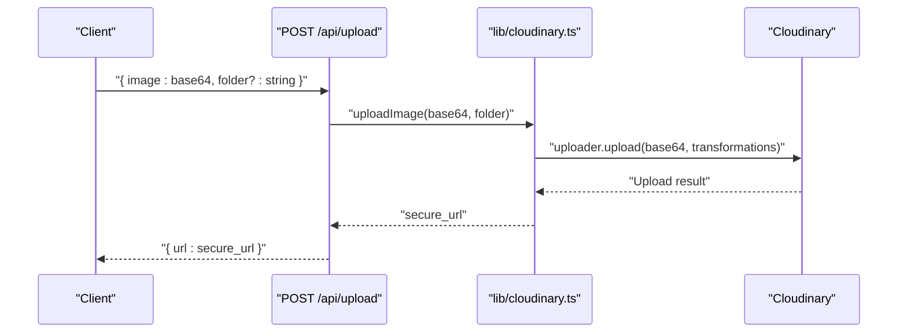
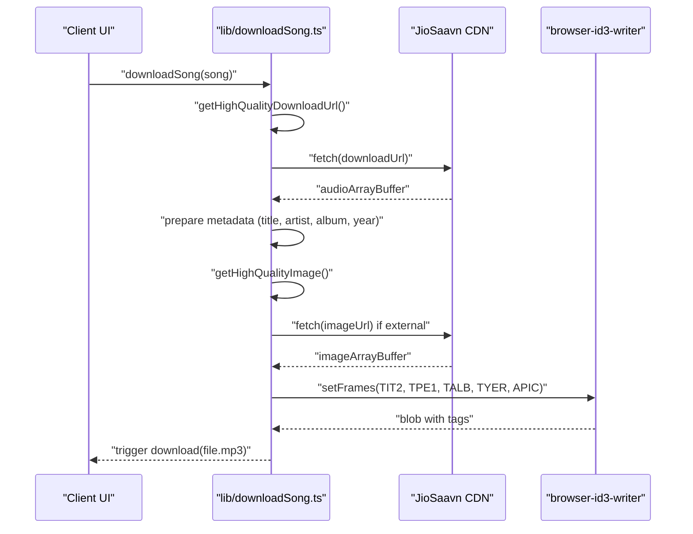
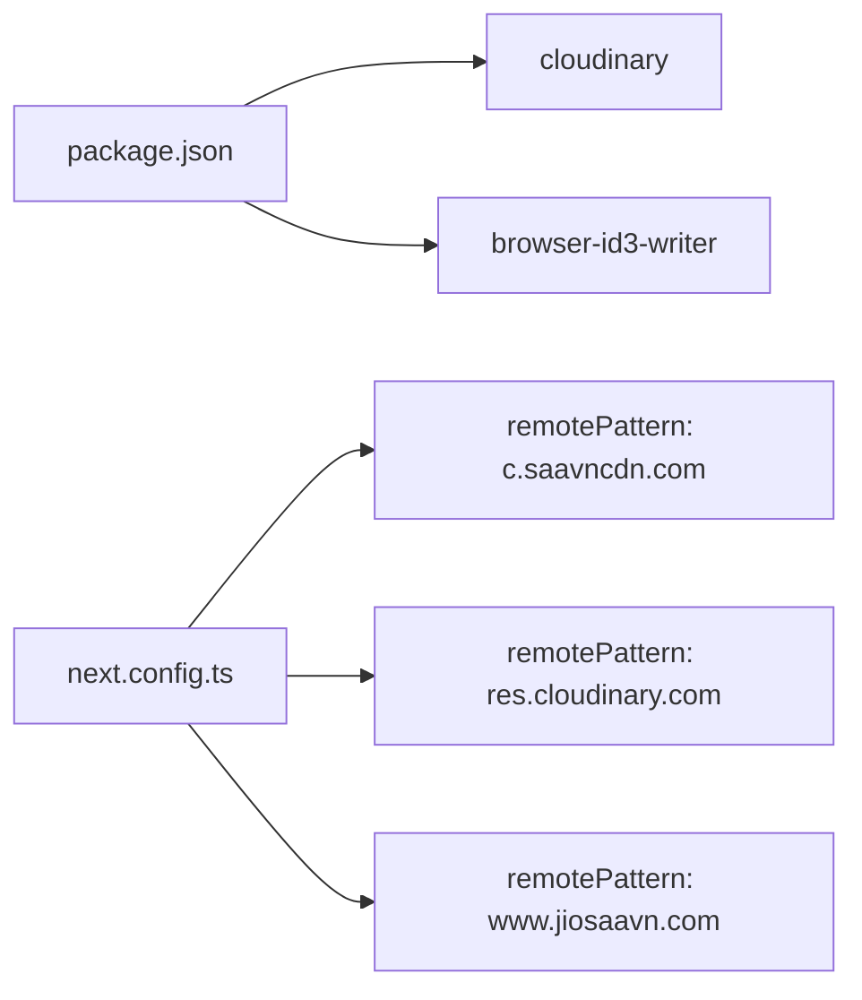

# External Integrations

<cite>
**Referenced Files in This Document**
- [api.ts](file://lib/api.ts)
- [cloudinary.ts](file://lib/cloudinary.ts)
- [downloadSong.ts](file://lib/downloadSong.ts)
- [route.ts](file://app/api/upload/route.ts)
- [db.ts](file://lib/db.ts)
- [next.config.ts](file://next.config.ts)
- [package.json](file://package.json)
- [route.ts](file://app/api/auth/forgot/route.ts)
</cite>

## Table of Contents
1. [Introduction](#introduction)
2. [Project Structure](#project-structure)
3. [Core Components](#core-components)
4. [Architecture Overview](#architecture-overview)
5. [Detailed Component Analysis](#detailed-component-analysis)
6. [Dependency Analysis](#dependency-analysis)
7. [Performance Considerations](#performance-considerations)
8. [Troubleshooting Guide](#troubleshooting-guide)
9. [Conclusion](#conclusion)
10. [Appendices](#appendices)

## Introduction
This document explains SonicStream’s external integrations with third-party services, focusing on:
- JioSaavn API integration for music discovery and metadata
- Cloudinary integration for image upload and optimization
- Download functionality for song files with embedded metadata
- Authentication and configuration patterns
- Rate limiting, error handling, and fallback strategies
- Performance optimization and monitoring approaches

## Project Structure
The external integrations are implemented primarily in:
- lib/api.ts: JioSaavn API client, request builders, normalization, and helpers
- lib/cloudinary.ts: Cloudinary SDK configuration and image upload
- lib/downloadSong.ts: Media asset download pipeline with ID3 metadata embedding
- app/api/upload/route.ts: Next.js route handler for Cloudinary uploads
- next.config.ts: Remote image allowlist for CDN-hosted assets
- lib/db.ts: Database client used alongside external services
- package.json: Dependencies including Cloudinary and browser-id3-writer
- app/api/auth/forgot/route.ts: Example of SMTP credentials loaded from environment variables

**Diagram sources**
- [api.ts:37-69](file://lib/api.ts#L37-L69)
- [downloadSong.ts:22-96](file://lib/downloadSong.ts#L22-L96)
- [route.ts:5-19](file://app/api/upload/route.ts#L5-L19)
- [cloudinary.ts:3-7](file://lib/cloudinary.ts#L3-L7)
- [next.config.ts:12-51](file://next.config.ts#L12-L51)
- [db.ts:1-10](file://lib/db.ts#L1-L10)

**Section sources**
- [api.ts:1-153](file://lib/api.ts#L1-L153)
- [cloudinary.ts:1-21](file://lib/cloudinary.ts#L1-L21)
- [downloadSong.ts:1-97](file://lib/downloadSong.ts#L1-L97)
- [route.ts:1-20](file://app/api/upload/route.ts#L1-L20)
- [next.config.ts:1-67](file://next.config.ts#L1-L67)
- [db.ts:1-10](file://lib/db.ts#L1-L10)
- [package.json:12-34](file://package.json#L12-L34)
- [route.ts:31-43](file://app/api/auth/forgot/route.ts#L31-L43)

## Core Components
- JioSaavn API client
  - Base URL and route builders for search, songs, albums, artists, playlists
  - Request fetcher with basic error handling
  - Normalization utilities for inconsistent upstream data
  - Helpers for image and download URL selection
- Cloudinary integration
  - SDK configured via environment variables
  - Upload endpoint with transformation pipeline
- Download pipeline
  - Fetch audio, embed ID3 metadata, attach album art, trigger browser download
- Configuration and environment variables
  - Cloudinary credentials
  - SMTP credentials for auth flows
  - Remote image allowlist for CDN domains

**Section sources**
- [api.ts:37-90](file://lib/api.ts#L37-L90)
- [api.ts:92-152](file://lib/api.ts#L92-L152)
- [cloudinary.ts:3-18](file://lib/cloudinary.ts#L3-L18)
- [downloadSong.ts:22-96](file://lib/downloadSong.ts#L22-L96)
- [route.ts:5-19](file://app/api/upload/route.ts#L5-L19)
- [route.ts:31-43](file://app/api/auth/forgot/route.ts#L31-L43)
- [next.config.ts:12-51](file://next.config.ts#L12-L51)

## Architecture Overview
The system integrates with external services through server-side routes and shared libraries:
- UI triggers actions (search, download, upload)
- Server routes call normalized API helpers
- Responses are normalized and returned to the UI
- Assets are served via CDN hosts configured in Next.js

**Diagram sources**
- [api.ts:45-69](file://lib/api.ts#L45-L69)
- [api.ts:39-43](file://lib/api.ts#L39-L43)
- [next.config.ts:12-51](file://next.config.ts#L12-L51)

## Detailed Component Analysis

### JioSaavn API Integration
Responsibilities:
- Build API URLs for search and entity-specific endpoints
- Fetch JSON responses and handle non-OK statuses
- Normalize inconsistent upstream shapes into a stable model
- Provide helpers to select high-quality images and download URLs

Key behaviors:
- Route builders accept query parameters and pagination controls
- fetcher enforces response.ok checks and throws errors
- normalizeSong handles variations in field naming and structure
- getHighQualityImage and getHighQualityDownloadUrl select appropriate assets

**Diagram sources**
- [api.ts:92-152](file://lib/api.ts#L92-L152)

**Section sources**
- [api.ts:37-90](file://lib/api.ts#L37-L90)
- [api.ts:92-152](file://lib/api.ts#L92-L152)

### Cloudinary Integration
Responsibilities:
- Configure Cloudinary SDK with environment variables
- Upload base64-encoded images with transformations
- Expose a route to upload images and return secure URLs

Key behaviors:
- Environment variables drive SDK configuration
- Transformation pipeline crops to face, fills to square, and auto-optimizes quality/format
- Upload route validates input and returns JSON with the uploaded URL

**Diagram sources**
- [route.ts:5-19](file://app/api/upload/route.ts#L5-L19)
- [cloudinary.ts:9-18](file://lib/cloudinary.ts#L9-L18)

**Section sources**
- [cloudinary.ts:3-18](file://lib/cloudinary.ts#L3-L18)
- [route.ts:1-20](file://app/api/upload/route.ts#L1-L20)

### Download Pipeline for Song Files
Responsibilities:
- Fetch audio from a high-quality download URL
- Embed ID3 metadata (title, artist, album, year)
- Optionally embed album art by fetching and detecting MIME type
- Trigger a browser download with a properly tagged MP3

Key behaviors:
- Uses getHighQualityDownloadUrl and getHighQualityImage helpers
- Handles missing download URLs gracefully with user feedback
- Detects image MIME type from URL extension
- Creates a blob with ID3 tags and initiates download

**Diagram sources**
- [downloadSong.ts:22-96](file://lib/downloadSong.ts#L22-L96)
- [api.ts:73-83](file://lib/api.ts#L73-L83)

**Section sources**
- [downloadSong.ts:1-97](file://lib/downloadSong.ts#L1-L97)
- [api.ts:73-83](file://lib/api.ts#L73-L83)

### Authentication Mechanisms for External APIs
- SMTP credentials for password reset emails are loaded from environment variables
- Cloudinary credentials are loaded from environment variables
- These demonstrate a consistent pattern for secret management

Operational notes:
- Ensure environment variables are set in production deployments
- Use secrets managers or platform-managed secrets in hosted environments

**Section sources**
- [route.ts:31-43](file://app/api/auth/forgot/route.ts#L31-L43)
- [cloudinary.ts:3-7](file://lib/cloudinary.ts#L3-L7)

### Rate Limiting Strategies
- No explicit client-side or server-side rate limiting is implemented in the current codebase
- Recommendations:
  - Apply per-route rate limiting using a middleware or service-side throttling
  - Cache frequent search results and metadata to reduce repeated calls
  - Use CDN caching for static assets and pre-signed URLs for downloads

[No sources needed since this section provides general guidance]

### Error Handling Patterns
- JioSaavn API fetcher throws on non-OK responses
- Upload route returns structured JSON errors with appropriate HTTP status codes
- Download pipeline catches errors, logs them, and notifies the user

Best practices:
- Centralize error responses and logging
- Distinguish between transient network errors and permanent failures
- Provide user-friendly messages while preserving actionable logs

**Section sources**
- [api.ts:39-43](file://lib/api.ts#L39-L43)
- [route.ts:15-18](file://app/api/upload/route.ts#L15-L18)
- [downloadSong.ts:92-96](file://lib/downloadSong.ts#L92-L96)

### Service Configuration and Environment Variables
- Cloudinary
  - CLOUDINARY_CLOUD_NAME
  - CLOUDINARY_API_KEY
  - CLOUDINARY_API_SECRET
- SMTP (for auth flows)
  - SMTP_HOST
  - SMTP_PORT
  - SMTP_USER
  - SMTP_PASS
  - SMTP_FROM
- Application base URL
  - NEXT_PUBLIC_APP_URL

Validation:
- Ensure variables are present before runtime
- Provide defaults only for optional features

**Section sources**
- [cloudinary.ts:3-7](file://lib/cloudinary.ts#L3-L7)
- [route.ts:31-43](file://app/api/auth/forgot/route.ts#L31-L43)

### Fallback Mechanisms
- getHighQualityImage falls back to a compact SVG placeholder when no images are available
- normalizeSong ensures arrays and objects are initialized to safe defaults
- Download pipeline gracefully handles missing download URLs and image fetch failures

**Section sources**
- [api.ts:71-77](file://lib/api.ts#L71-L77)
- [api.ts:92-152](file://lib/api.ts#L92-L152)
- [downloadSong.ts:8-17](file://lib/downloadSong.ts#L8-L17)
- [downloadSong.ts:28-31](file://lib/downloadSong.ts#L28-L31)

## Dependency Analysis
External dependencies relevant to integrations:
- Cloudinary SDK for image upload and transformations
- browser-id3-writer for embedding metadata into downloaded audio
- Next.js image optimization with remote patterns for CDN domains

**Diagram sources**
- [package.json:21-21](file://package.json#L21-L21)
- [package.json:19-19](file://package.json#L19-L19)
- [next.config.ts:12-51](file://next.config.ts#L12-L51)

**Section sources**
- [package.json:12-34](file://package.json#L12-L34)
- [next.config.ts:12-51](file://next.config.ts#L12-L51)

## Performance Considerations
- CDN usage
  - Remote image allowlist enables optimized loading from JioSaavn and Cloudinary CDNs
- Asset selection
  - Prefer high-quality download URLs for reduced re-encoding needs
- Caching
  - Cache normalized search results and metadata to minimize repeated API calls
- Streaming
  - For large downloads, consider streaming to reduce memory usage
- Monitoring
  - Track API latency, error rates, and download completion metrics
  - Log slow or failing requests for diagnosis

[No sources needed since this section provides general guidance]

## Troubleshooting Guide
Common issues and resolutions:
- Missing Cloudinary credentials
  - Symptom: Upload endpoint returns an error
  - Action: Verify CLOUDINARY_* environment variables are set
- Download URL not found
  - Symptom: Download fails immediately
  - Action: Confirm the song has a valid downloadUrl and the selected quality is available
- Image fetch failures
  - Symptom: Album art not embedded
  - Action: Check image URL accessibility and MIME type detection logic
- Network errors from JioSaavn API
  - Symptom: Search or details fail
  - Action: Retry with exponential backoff and log response status
- CORS or image loading issues
  - Symptom: Images do not render
  - Action: Ensure domain is included in remotePatterns and use HTTPS URLs

**Section sources**
- [cloudinary.ts:3-7](file://lib/cloudinary.ts#L3-L7)
- [downloadSong.ts:28-31](file://lib/downloadSong.ts#L28-L31)
- [downloadSong.ts:50-55](file://lib/downloadSong.ts#L50-L55)
- [api.ts:39-43](file://lib/api.ts#L39-L43)
- [next.config.ts:12-51](file://next.config.ts#L12-L51)

## Conclusion
SonicStream integrates with external services through a clean separation of concerns:
- A normalized JioSaavn API client handles request building, fetching, and data shaping
- Cloudinary provides robust image upload and optimization
- A dedicated download pipeline enriches audio with metadata and delivers it to users
- Environment-driven configuration and fallbacks improve reliability
- CDN allowlists and caching strategies support performance and scalability

[No sources needed since this section summarizes without analyzing specific files]

## Appendices

### Practical Usage Examples
- Search songs
  - Call the route builder and fetcher to retrieve normalized results
  - Reference: [api.ts:45-51](file://lib/api.ts#L45-L51), [api.ts:39-43](file://lib/api.ts#L39-L43)
- Upload avatar
  - Send base64 image and folder to the upload endpoint
  - Reference: [route.ts:5-19](file://app/api/upload/route.ts#L5-L19), [cloudinary.ts:9-18](file://lib/cloudinary.ts#L9-L18)
- Download song with metadata
  - Invoke the download function with a normalized song object
  - Reference: [downloadSong.ts:22-96](file://lib/downloadSong.ts#L22-L96)

[No sources needed since this section provides general guidance]