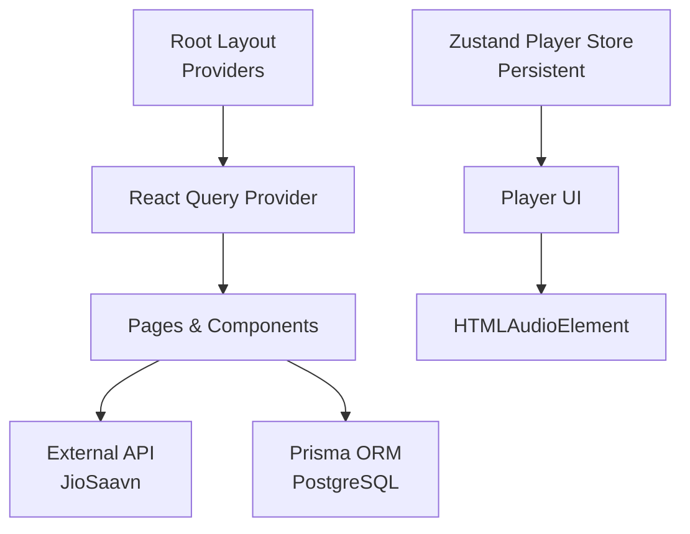
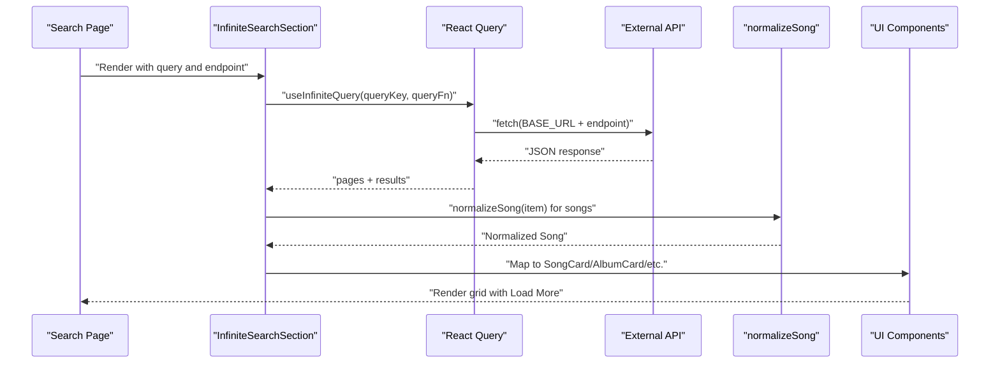
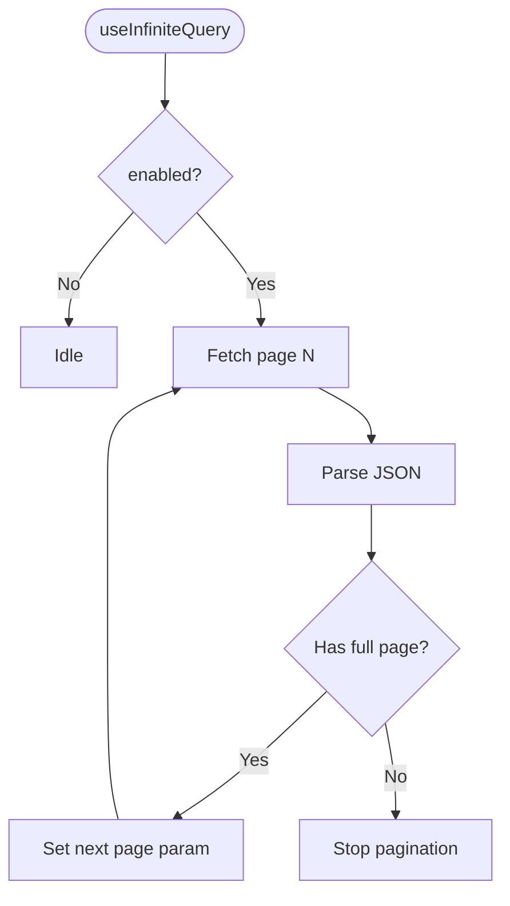
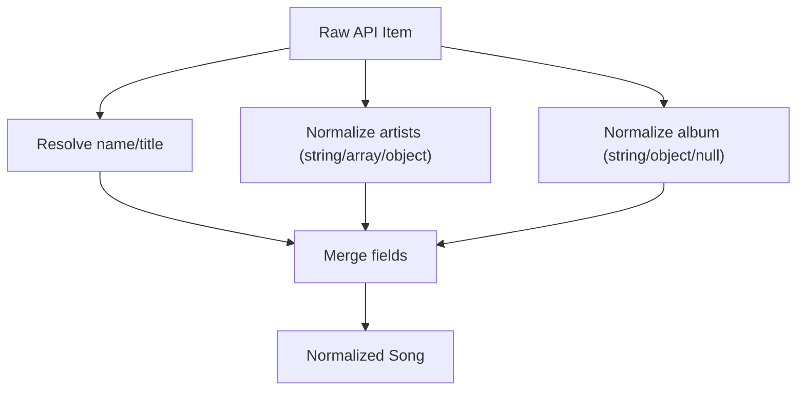
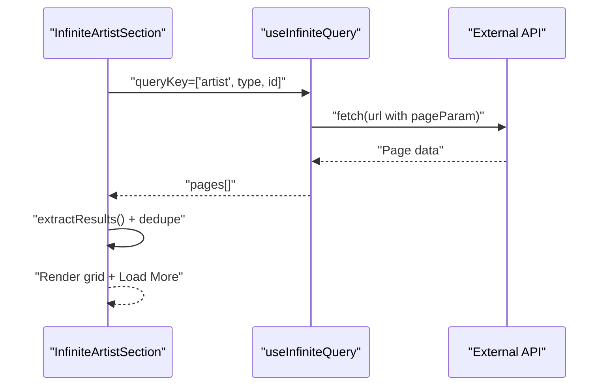
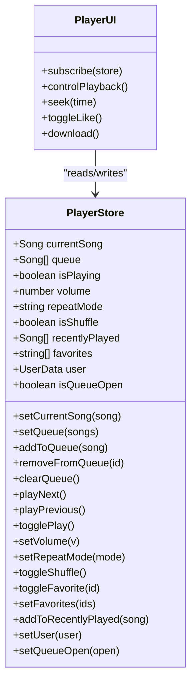
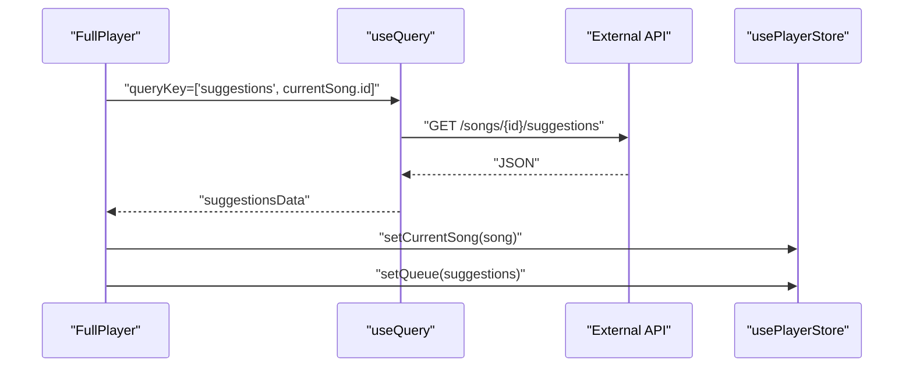
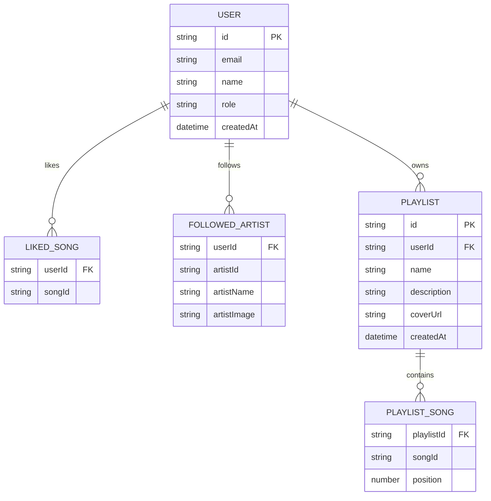
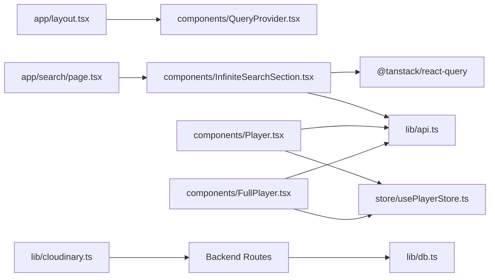

# Data Flow Patterns

<cite>
**Referenced Files in This Document**
- [app/layout.tsx](file://app/layout.tsx)
- [components/QueryProvider.tsx](file://components/QueryProvider.tsx)
- [lib/api.ts](file://lib/api.ts)
- [components/InfiniteSearchSection.tsx](file://components/InfiniteSearchSection.tsx)
- [app/search/page.tsx](file://app/search/page.tsx)
- [components/InfiniteArtistSection.tsx](file://components/InfiniteArtistSection.tsx)
- [store/usePlayerStore.ts](file://store/usePlayerStore.ts)
- [components/Player.tsx](file://components/Player.tsx)
- [components/FullPlayer.tsx](file://components/FullPlayer.tsx)
- [app/api/likes/route.ts](file://app/api/likes/route.ts)
- [app/api/follows/route.ts](file://app/api/follows/route.ts)
- [app/api/playlists/route.ts](file://app/api/playlists/route.ts)
- [lib/db.ts](file://lib/db.ts)
- [lib/cloudinary.ts](file://lib/cloudinary.ts)
</cite>

## Table of Contents
1. [Introduction](#introduction)
2. [Project Structure](#project-structure)
3. [Core Components](#core-components)
4. [Architecture Overview](#architecture-overview)
5. [Detailed Component Analysis](#detailed-component-analysis)
6. [Dependency Analysis](#dependency-analysis)
7. [Performance Considerations](#performance-considerations)
8. [Troubleshooting Guide](#troubleshooting-guide)
9. [Conclusion](#conclusion)

## Introduction
This document explains SonicStream’s data flow architecture from external API integration to UI rendering, including data normalization, caching via React Query, state synchronization with Zustand, infinite scrolling, and backend integrations. It also covers performance optimizations, error handling, and offline-friendly patterns.

## Project Structure
SonicStream is a Next.js application with a clear separation of concerns:
- UI shell and providers are initialized at the root layout.
- Data fetching and caching are centralized via a React Query provider.
- External data is normalized and transformed for consistent UI consumption.
- Player state is managed by a persistent Zustand store.
- Backend endpoints expose CRUD operations for likes, follows, and playlists using Prisma ORM.

**Diagram sources**
- [app/layout.tsx:44-71](file://app/layout.tsx#L44-L71)
- [components/QueryProvider.tsx:6-25](file://components/QueryProvider.tsx#L6-L25)
- [lib/api.ts:37-69](file://lib/api.ts#L37-L69)
- [lib/db.ts:1-10](file://lib/db.ts#L1-L10)
- [store/usePlayerStore.ts:43-127](file://store/usePlayerStore.ts#L43-L127)

**Section sources**
- [app/layout.tsx:44-71](file://app/layout.tsx#L44-L71)
- [components/QueryProvider.tsx:6-25](file://components/QueryProvider.tsx#L6-L25)

## Core Components
- React Query provider with default caching and refetch policies.
- API module encapsulating external endpoints and data normalization helpers.
- Infinite scrolling components for search and artist pages.
- Zustand store for player state with persistence.
- Player UI components orchestrating playback, queue, and related suggestions.

**Section sources**
- [components/QueryProvider.tsx:6-25](file://components/QueryProvider.tsx#L6-L25)
- [lib/api.ts:37-153](file://lib/api.ts#L37-L153)
- [components/InfiniteSearchSection.tsx:23-90](file://components/InfiniteSearchSection.tsx#L23-L90)
- [components/InfiniteArtistSection.tsx:21-127](file://components/InfiniteArtistSection.tsx#L21-L127)
- [store/usePlayerStore.ts:43-127](file://store/usePlayerStore.ts#L43-L127)

## Architecture Overview
The data pipeline integrates external APIs, normalizes results, caches them, and renders them through reusable components. Player state is persisted and synchronized across UI surfaces.

**Diagram sources**
- [app/search/page.tsx:104-115](file://app/search/page.tsx#L104-L115)
- [components/InfiniteSearchSection.tsx:31-44](file://components/InfiniteSearchSection.tsx#L31-L44)
- [lib/api.ts:92-152](file://lib/api.ts#L92-L152)

## Detailed Component Analysis

### React Query Integration and Caching
- The provider sets a global staleTime and retry policy, minimizing unnecessary refetches and improving perceived performance.
- Infinite queries are used for paginated results with a simple pageParam strategy and early termination when page size is less than requested.

**Diagram sources**
- [components/QueryProvider.tsx:7-18](file://components/QueryProvider.tsx#L7-L18)
- [components/InfiniteSearchSection.tsx:31-44](file://components/InfiniteSearchSection.tsx#L31-L44)

**Section sources**
- [components/QueryProvider.tsx:6-25](file://components/QueryProvider.tsx#L6-L25)
- [components/InfiniteSearchSection.tsx:23-90](file://components/InfiniteSearchSection.tsx#L23-L90)

### Data Normalization Pipeline
- The API module defines a normalized Song shape and exposes helpers to convert external responses into a consistent internal model.
- normalizeSong handles inconsistent keys (name/title), artist structures, and album metadata to ensure downstream components receive uniform data.

**Diagram sources**
- [lib/api.ts:92-152](file://lib/api.ts#L92-L152)

**Section sources**
- [lib/api.ts:92-152](file://lib/api.ts#L92-L152)

### Infinite Scrolling Implementation
- Search and artist pages use infinite queries to load more items progressively.
- Unique deduplication is applied to artist results to avoid duplicates across pages.
- Loading skeletons improve perceived performance during subsequent page loads.

**Diagram sources**
- [components/InfiniteArtistSection.tsx:50-84](file://components/InfiniteArtistSection.tsx#L50-L84)

**Section sources**
- [components/InfiniteArtistSection.tsx:21-127](file://components/InfiniteArtistSection.tsx#L21-L127)

### Player State Management with Zustand and Persistence
- The store manages playback state, queue, shuffle/repeat modes, favorites, and recent plays.
- Persistence is configured to save selected slices of state (volume, favorites, recent plays, user) to local storage.
- The Player component subscribes to the store and controls HTMLAudioElement playback.

**Diagram sources**
- [store/usePlayerStore.ts:12-127](file://store/usePlayerStore.ts#L12-L127)
- [components/Player.tsx:19-251](file://components/Player.tsx#L19-L251)

**Section sources**
- [store/usePlayerStore.ts:43-127](file://store/usePlayerStore.ts#L43-L127)
- [components/Player.tsx:19-251](file://components/Player.tsx#L19-L251)

### UI Presentation and Suggestions
- The FullPlayer component fetches related suggestions using a dedicated query and presents them as clickable tiles.
- It integrates with the store to set the current song and queue based on user selection.

**Diagram sources**
- [components/FullPlayer.tsx:44-51](file://components/FullPlayer.tsx#L44-L51)
- [lib/api.ts:56-56](file://lib/api.ts#L56-L56)
- [store/usePlayerStore.ts:57-61](file://store/usePlayerStore.ts#L57-L61)

**Section sources**
- [components/FullPlayer.tsx:34-70](file://components/FullPlayer.tsx#L34-L70)
- [lib/api.ts:56-56](file://lib/api.ts#L56-L56)

### Backend Integrations (Likes, Follows, Playlists)
- The backend uses Prisma to manage user interactions and playlists.
- Endpoints support listing, adding, and removing likes; following/unfollowing artists; and managing playlists.

**Diagram sources**
- [app/api/likes/route.ts:4-15](file://app/api/likes/route.ts#L4-L15)
- [app/api/follows/route.ts:4-14](file://app/api/follows/route.ts#L4-L14)
- [app/api/playlists/route.ts:4-16](file://app/api/playlists/route.ts#L4-L16)
- [lib/db.ts:1-10](file://lib/db.ts#L1-L10)

**Section sources**
- [app/api/likes/route.ts:1-55](file://app/api/likes/route.ts#L1-L55)
- [app/api/follows/route.ts:1-55](file://app/api/follows/route.ts#L1-L55)
- [app/api/playlists/route.ts:1-90](file://app/api/playlists/route.ts#L1-L90)
- [lib/db.ts:1-10](file://lib/db.ts#L1-L10)

## Dependency Analysis
- Root layout composes providers for theme, query caching, and UI.
- Search page delegates pagination to InfiniteSearchSection, which depends on React Query and the API module.
- Player components depend on the Zustand store and the API module for image and download URLs.
- Backend routes depend on Prisma for data access.

**Diagram sources**
- [app/layout.tsx:44-71](file://app/layout.tsx#L44-L71)
- [app/search/page.tsx:104-115](file://app/search/page.tsx#L104-L115)
- [components/InfiniteSearchSection.tsx:31-44](file://components/InfiniteSearchSection.tsx#L31-L44)
- [lib/api.ts:37-69](file://lib/api.ts#L37-L69)
- [components/Player.tsx:19-251](file://components/Player.tsx#L19-L251)
- [components/FullPlayer.tsx:44-51](file://components/FullPlayer.tsx#L44-L51)
- [store/usePlayerStore.ts:43-127](file://store/usePlayerStore.ts#L43-L127)
- [lib/db.ts:1-10](file://lib/db.ts#L1-L10)
- [lib/cloudinary.ts:1-21](file://lib/cloudinary.ts#L1-L21)

**Section sources**
- [app/layout.tsx:44-71](file://app/layout.tsx#L44-L71)
- [app/search/page.tsx:104-115](file://app/search/page.tsx#L104-L115)
- [components/InfiniteSearchSection.tsx:31-44](file://components/InfiniteSearchSection.tsx#L31-L44)
- [lib/api.ts:37-69](file://lib/api.ts#L37-L69)
- [components/Player.tsx:19-251](file://components/Player.tsx#L19-L251)
- [components/FullPlayer.tsx:44-51](file://components/FullPlayer.tsx#L44-L51)
- [store/usePlayerStore.ts:43-127](file://store/usePlayerStore.ts#L43-L127)
- [lib/db.ts:1-10](file://lib/db.ts#L1-L10)
- [lib/cloudinary.ts:1-21](file://lib/cloudinary.ts#L1-L21)

## Performance Considerations
- Caching: Global staleTime reduces redundant network requests; enable flags prevent excessive refetches on focus.
- Infinite scrolling: Early termination when a page is incomplete avoids extra requests.
- Deduplication: Unique filtering prevents repeated items in artist results.
- Normalization: Centralized transform minimizes UI branching and improves cache hit rates.
- Persistence: Persisted store slices reduce reinitialization costs and maintain continuity across sessions.
- Skeleton loaders: Improve perceived performance during pagination and initial loads.

[No sources needed since this section provides general guidance]

## Troubleshooting Guide
- External API errors: The fetcher throws on non-OK responses; ensure BASE_URL and endpoints are correct.
- Infinite query termination: getNextPageParam relies on page size equality; adjust PAGE_SIZE or API pagination semantics accordingly.
- Player playback: Verify downloadUrl availability and audio element events; ensure volume and mute states are synchronized.
- Backend errors: Route handlers return structured JSON; check userId presence and Prisma error codes (e.g., unique constraint).
- Cloudinary uploads: Confirm environment variables are set and transformations align with expectations.

**Section sources**
- [lib/api.ts:37-43](file://lib/api.ts#L37-L43)
- [components/InfiniteSearchSection.tsx:38-42](file://components/InfiniteSearchSection.tsx#L38-L42)
- [components/Player.tsx:33-57](file://components/Player.tsx#L33-L57)
- [app/api/likes/route.ts:31-33](file://app/api/likes/route.ts#L31-L33)
- [lib/cloudinary.ts:3-7](file://lib/cloudinary.ts#L3-L7)

## Conclusion
SonicStream’s data flow combines robust caching with resilient infinite scrolling, a normalized data model, and a persistent player store. The architecture balances performance and reliability while keeping UI logic declarative and maintainable. Backend routes provide essential user interaction primitives backed by Prisma, enabling scalable data consistency.