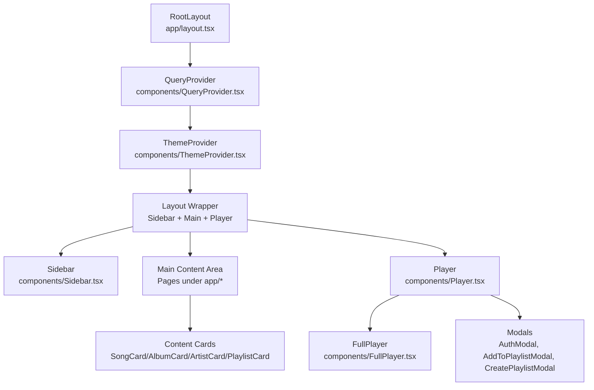
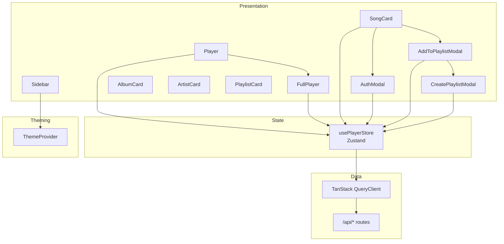
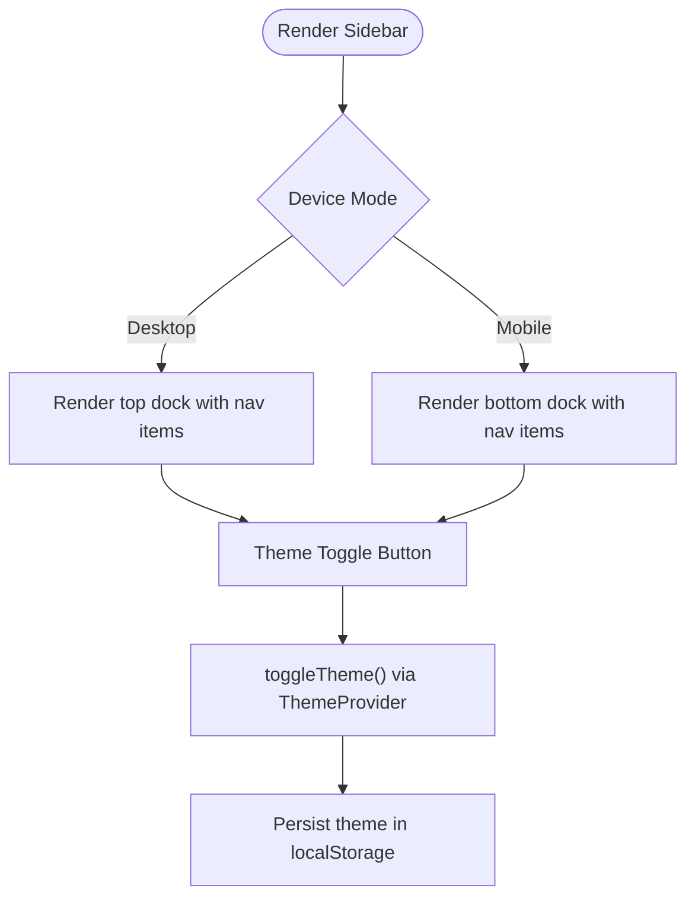
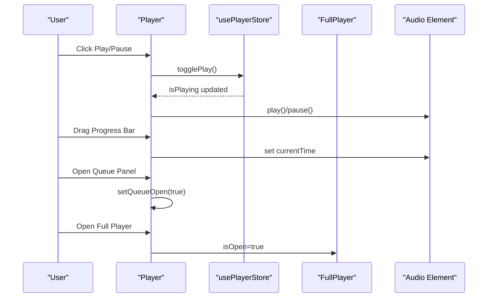
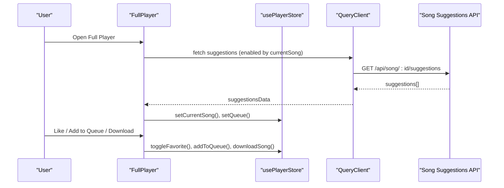
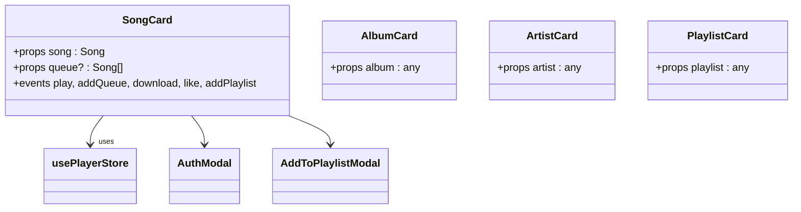
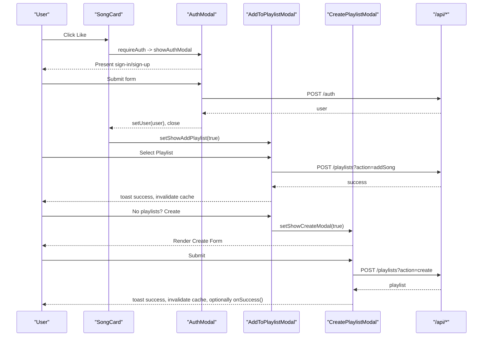
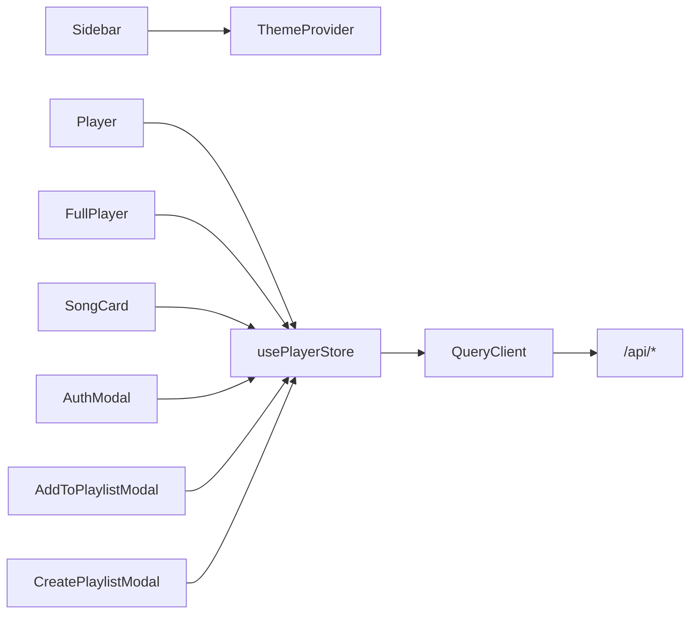

# Component System

<cite>
**Referenced Files in This Document**
- [layout.tsx](file://app/layout.tsx)
- [Sidebar.tsx](file://components/Sidebar.tsx)
- [Player.tsx](file://components/Player.tsx)
- [FullPlayer.tsx](file://components/FullPlayer.tsx)
- [SongCard.tsx](file://components/SongCard.tsx)
- [AlbumCard.tsx](file://components/AlbumCard.tsx)
- [ArtistCard.tsx](file://components/ArtistCard.tsx)
- [PlaylistCard.tsx](file://components/PlaylistCard.tsx)
- [AuthModal.tsx](file://components/AuthModal.tsx)
- [CreatePlaylistModal.tsx](file://components/CreatePlaylistModal.tsx)
- [AddToPlaylistModal.tsx](file://components/AddToPlaylistModal.tsx)
- [usePlayerStore.ts](file://store/usePlayerStore.ts)
- [ThemeProvider.tsx](file://components/ThemeProvider.tsx)
- [QueryProvider.tsx](file://components/QueryProvider.tsx)
</cite>

## Table of Contents
1. [Introduction](#introduction)
2. [Project Structure](#project-structure)
3. [Core Components](#core-components)
4. [Architecture Overview](#architecture-overview)
5. [Detailed Component Analysis](#detailed-component-analysis)
6. [Dependency Analysis](#dependency-analysis)
7. [Performance Considerations](#performance-considerations)
8. [Troubleshooting Guide](#troubleshooting-guide)
9. [Conclusion](#conclusion)

## Introduction
This document describes SonicStream’s component architecture and reusable UI components. It explains the component hierarchy starting from the root layout, through the Sidebar navigation, Player controls, and content cards. It also documents component composition patterns, prop interfaces, state management integration via a centralized store, modal components with form handling and validation, lifecycle management, performance optimizations, accessibility, responsive design, and cross-component communication.

## Project Structure
The application is structured around a root layout that composes persistent UI scaffolding: a floating Sidebar (desktop and mobile variants), a global Player dock, and a ThemeProvider/QueryProvider wrapper. Pages under app render content into the main area, which is positioned below the header and above the player.

**Diagram sources**
- [layout.tsx:78-105](file://app/layout.tsx#L78-L105)
- [QueryProvider.tsx:6-25](file://components/QueryProvider.tsx#L6-L25)
- [ThemeProvider.tsx:21-44](file://components/ThemeProvider.tsx#L21-L44)
- [Sidebar.tsx:19-112](file://components/Sidebar.tsx#L19-L112)
- [Player.tsx:19-251](file://components/Player.tsx#L19-L251)
- [FullPlayer.tsx:34-242](file://components/FullPlayer.tsx#L34-L242)
- [SongCard.tsx:22-140](file://components/SongCard.tsx#L22-L140)
- [AlbumCard.tsx:14-48](file://components/AlbumCard.tsx#L14-L48)
- [ArtistCard.tsx:14-51](file://components/ArtistCard.tsx#L14-L51)
- [PlaylistCard.tsx:14-48](file://components/PlaylistCard.tsx#L14-L48)
- [AuthModal.tsx:14-149](file://components/AuthModal.tsx#L14-L149)
- [AddToPlaylistModal.tsx:18-179](file://components/AddToPlaylistModal.tsx#L18-L179)
- [CreatePlaylistModal.tsx:17-148](file://components/CreatePlaylistModal.tsx#L17-L148)

**Section sources**
- [layout.tsx:78-105](file://app/layout.tsx#L78-L105)

## Core Components
- Root Layout: Provides theme, query provider, sidebar, main content area, player, and toast wrapper.
- Sidebar: Navigation dock with theme toggle, responsive desktop and mobile layouts.
- Player: Fixed bottom dock with playback controls, progress, queue panel, and full-screen player.
- FullPlayer: Modal overlay with expanded controls, related suggestions, and actions.
- Content Cards: Reusable cards for songs, albums, artists, and playlists with hover actions and routing.
- Modals: Authentication, add-to-playlist, and create-playlist modals with form handling and validation.

**Section sources**
- [layout.tsx:78-105](file://app/layout.tsx#L78-L105)
- [Sidebar.tsx:19-112](file://components/Sidebar.tsx#L19-L112)
- [Player.tsx:19-251](file://components/Player.tsx#L19-L251)
- [FullPlayer.tsx:34-242](file://components/FullPlayer.tsx#L34-L242)
- [SongCard.tsx:22-140](file://components/SongCard.tsx#L22-L140)
- [AlbumCard.tsx:14-48](file://components/AlbumCard.tsx#L14-L48)
- [ArtistCard.tsx:14-51](file://components/ArtistCard.tsx#L14-L51)
- [PlaylistCard.tsx:14-48](file://components/PlaylistCard.tsx#L14-L48)
- [AuthModal.tsx:14-149](file://components/AuthModal.tsx#L14-L149)
- [AddToPlaylistModal.tsx:18-179](file://components/AddToPlaylistModal.tsx#L18-L179)
- [CreatePlaylistModal.tsx:17-148](file://components/CreatePlaylistModal.tsx#L17-L148)

## Architecture Overview
The system uses a layered architecture:
- Presentation Layer: UI components (Sidebar, Player, Cards, Modals).
- State Layer: Zustand store for playback state and user data.
- Data Layer: TanStack Query for server-side caching and invalidation.
- Theming Layer: Context provider for theme switching and persistence.

**Diagram sources**
- [usePlayerStore.ts:43-127](file://store/usePlayerStore.ts#L43-L127)
- [QueryProvider.tsx:6-25](file://components/QueryProvider.tsx#L6-L25)
- [Player.tsx:19-251](file://components/Player.tsx#L19-L251)
- [FullPlayer.tsx:34-242](file://components/FullPlayer.tsx#L34-L242)
- [SongCard.tsx:22-140](file://components/SongCard.tsx#L22-L140)
- [AddToPlaylistModal.tsx:18-179](file://components/AddToPlaylistModal.tsx#L18-L179)
- [CreatePlaylistModal.tsx:17-148](file://components/CreatePlaylistModal.tsx#L17-L148)
- [AuthModal.tsx:14-149](file://components/AuthModal.tsx#L14-L149)
- [ThemeProvider.tsx:21-44](file://components/ThemeProvider.tsx#L21-L44)

## Detailed Component Analysis

### Sidebar
- Purpose: Provide primary navigation and theme toggle with responsive desktop/mobile docks.
- Composition: Uses path-based active state, theme context, and Lucide icons.
- Props: None (self-contained).
- Accessibility: Uses semantic links and aria-labels for buttons.
- Responsive: Desktop pill-style center nav plus theme toggle; mobile bottom dock with icons and labels.

**Diagram sources**
- [Sidebar.tsx:19-112](file://components/Sidebar.tsx#L19-L112)
- [ThemeProvider.tsx:21-44](file://components/ThemeProvider.tsx#L21-L44)

**Section sources**
- [Sidebar.tsx:19-112](file://components/Sidebar.tsx#L19-L112)
- [ThemeProvider.tsx:21-44](file://components/ThemeProvider.tsx#L21-L44)

### Player
- Purpose: Fixed bottom dock for playback controls, progress, queue panel, and mini/full player.
- State: Integrates with usePlayerStore for current song, queue, playback, volume, shuffle, repeat, favorites.
- Interactions: Keyboard shortcuts, seek, download, like, queue open/close, full player open.
- Lifecycle: Manages audio element lifecycle and event listeners.

**Diagram sources**
- [Player.tsx:19-251](file://components/Player.tsx#L19-L251)
- [usePlayerStore.ts:43-127](file://store/usePlayerStore.ts#L43-L127)
- [FullPlayer.tsx:34-242](file://components/FullPlayer.tsx#L34-L242)

**Section sources**
- [Player.tsx:19-251](file://components/Player.tsx#L19-L251)
- [usePlayerStore.ts:43-127](file://store/usePlayerStore.ts#L43-L127)

### FullPlayer
- Purpose: Modal overlay with large album art, marquee title, detailed controls, volume, and “Up Next” suggestions.
- Data: Fetches suggestions via TanStack Query; integrates with store for playback actions.
- Composition: Composes AddToPlaylistModal and AuthModal for user actions.

**Diagram sources**
- [FullPlayer.tsx:34-242](file://components/FullPlayer.tsx#L34-L242)
- [usePlayerStore.ts:43-127](file://store/usePlayerStore.ts#L43-L127)

**Section sources**
- [FullPlayer.tsx:34-242](file://components/FullPlayer.tsx#L34-L242)

### Card Components
Reusable content cards with consistent hover actions and routing.

- SongCard
  - Props: song (Song), queue? (Song[])
  - Events: play, add to queue, download, like, add to playlist
  - State: Uses store for playback and favorites; integrates AuthModal and AddToPlaylistModal
  - Accessibility: Links and buttons styled for keyboard focus; role-appropriate semantics

- AlbumCard
  - Props: album (any)
  - Behavior: Navigates to album page; shows play overlay

- ArtistCard
  - Props: artist (any)
  - Behavior: Handles missing image fallback; navigates to artist page

- PlaylistCard
  - Props: playlist (any)
  - Behavior: Navigates to playlist page; shows play overlay

**Diagram sources**
- [SongCard.tsx:17-20](file://components/SongCard.tsx#L17-L20)
- [AlbumCard.tsx:10-12](file://components/AlbumCard.tsx#L10-L12)
- [ArtistCard.tsx:10-12](file://components/ArtistCard.tsx#L10-L12)
- [PlaylistCard.tsx:10-12](file://components/PlaylistCard.tsx#L10-L12)
- [SongCard.tsx:22-140](file://components/SongCard.tsx#L22-L140)

**Section sources**
- [SongCard.tsx:17-140](file://components/SongCard.tsx#L17-L140)
- [AlbumCard.tsx:10-48](file://components/AlbumCard.tsx#L10-L48)
- [ArtistCard.tsx:10-51](file://components/ArtistCard.tsx#L10-L51)
- [PlaylistCard.tsx:10-48](file://components/PlaylistCard.tsx#L10-L48)

### Modal Components
- AuthModal
  - Props: isOpen, onClose
  - Form: Sign in/up toggle, email/password/name, forgot password flow
  - Validation: Basic presence checks; displays server errors; supports Enter key
  - Persistence: On success, sets user in store and closes

- AddToPlaylistModal
  - Props: isOpen, onClose, songId
  - Data: Queries user playlists; tracks added state and loading per playlist
  - Actions: Adds song to selected playlist; invalidates query cache; opens CreatePlaylistModal

- CreatePlaylistModal
  - Props: isOpen, onClose, onSuccess?
  - Validation: Requires name; requires user; creates playlist via API
  - Feedback: Toast notifications; invalidates query cache; optional callback

**Diagram sources**
- [SongCard.tsx:22-140](file://components/SongCard.tsx#L22-L140)
- [AuthModal.tsx:14-149](file://components/AuthModal.tsx#L14-L149)
- [AddToPlaylistModal.tsx:18-179](file://components/AddToPlaylistModal.tsx#L18-L179)
- [CreatePlaylistModal.tsx:17-148](file://components/CreatePlaylistModal.tsx#L17-L148)

**Section sources**
- [AuthModal.tsx:14-149](file://components/AuthModal.tsx#L14-L149)
- [AddToPlaylistModal.tsx:18-179](file://components/AddToPlaylistModal.tsx#L18-L179)
- [CreatePlaylistModal.tsx:17-148](file://components/CreatePlaylistModal.tsx#L17-L148)

## Dependency Analysis
- Component Coupling:
  - Player depends on usePlayerStore and FullPlayer; FullPlayer depends on store and suggestions API.
  - Cards depend on store and modals; modals depend on store and API.
  - Sidebar depends on ThemeProvider for theme toggling.
- External Dependencies:
  - Zustand for state management.
  - TanStack Query for caching and invalidation.
  - Motion for animations.
  - Lucide icons for UI.
- Potential Circular Dependencies:
  - None observed among UI components; modals are leaf consumers of store and APIs.

**Diagram sources**
- [Sidebar.tsx:19-112](file://components/Sidebar.tsx#L19-L112)
- [Player.tsx:19-251](file://components/Player.tsx#L19-L251)
- [FullPlayer.tsx:34-242](file://components/FullPlayer.tsx#L34-L242)
- [SongCard.tsx:22-140](file://components/SongCard.tsx#L22-L140)
- [usePlayerStore.ts:43-127](file://store/usePlayerStore.ts#L43-L127)
- [QueryProvider.tsx:6-25](file://components/QueryProvider.tsx#L6-L25)

**Section sources**
- [usePlayerStore.ts:43-127](file://store/usePlayerStore.ts#L43-L127)
- [QueryProvider.tsx:6-25](file://components/QueryProvider.tsx#L6-L25)

## Performance Considerations
- Memoization and Rendering:
  - Cards use motion and hover effects; keep props stable to avoid unnecessary re-renders.
  - Player uses refs for audio element to minimize re-renders.
- State Granularity:
  - usePlayerStore encapsulates playback state; avoid spreading state into smaller stores to reduce re-renders.
- Query Caching:
  - TanStack Query configured with a short stale time and retry; invalidate keys after mutations to keep UI fresh.
- Animations:
  - Motion animations are used selectively; prefer layoutId for smooth transitions (e.g., album art).
- Accessibility:
  - Buttons and links use appropriate colors and focus styles; ensure keyboard navigation remains functional across modals and panels.

[No sources needed since this section provides general guidance]

## Troubleshooting Guide
- Player Controls Not Responding:
  - Verify audio element ref is attached and currentSong exists.
  - Check volume and mute state updates are applied to the audio element.
- Queue Panel Issues:
  - Ensure queueOpen state is toggled and queue actions update the store correctly.
- Modals Not Closing:
  - Confirm isOpen/onClose props are passed down and event handlers stop propagation when needed.
- Auth Flow Failures:
  - Inspect network requests to /api/auth and error messages returned; ensure user is set in store on success.
- Playlist Creation Errors:
  - Validate name presence and user availability; check API response and toast messages.

**Section sources**
- [Player.tsx:19-251](file://components/Player.tsx#L19-L251)
- [usePlayerStore.ts:43-127](file://store/usePlayerStore.ts#L43-L127)
- [AuthModal.tsx:14-149](file://components/AuthModal.tsx#L14-L149)
- [CreatePlaylistModal.tsx:17-148](file://components/CreatePlaylistModal.tsx#L17-L148)
- [AddToPlaylistModal.tsx:18-179](file://components/AddToPlaylistModal.tsx#L18-L179)

## Conclusion
SonicStream’s component system is built around a clean separation of concerns: persistent UI scaffolding (layout, sidebar, player), reusable content cards, and focused modals. State is centralized via Zustand, data caching via TanStack Query, and theming via a context provider. The architecture supports responsive design, robust user interactions, and scalable component composition. Following the patterns documented here ensures maintainability, performance, and accessibility across the application.