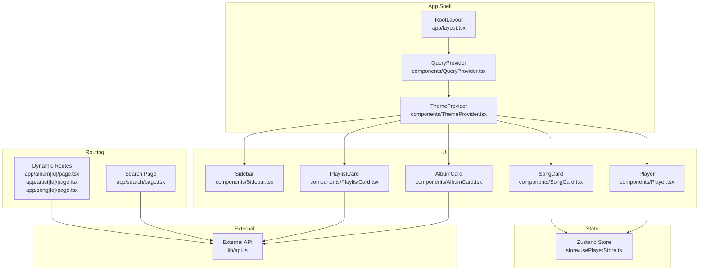
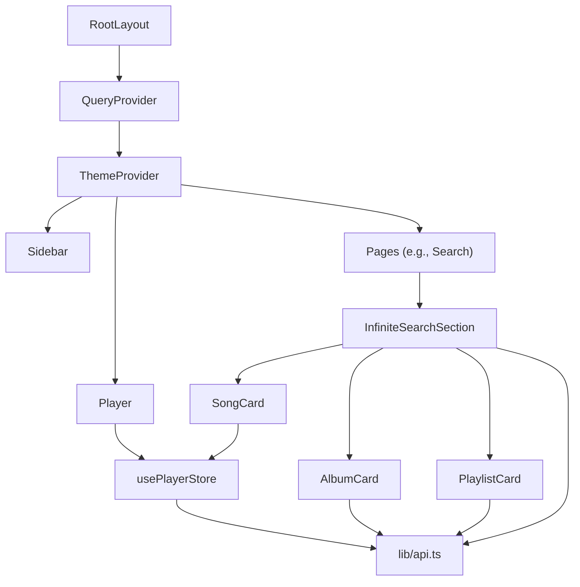
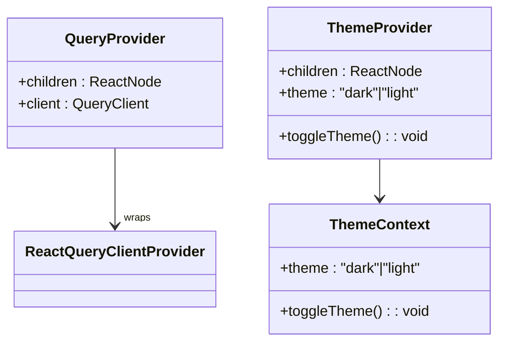
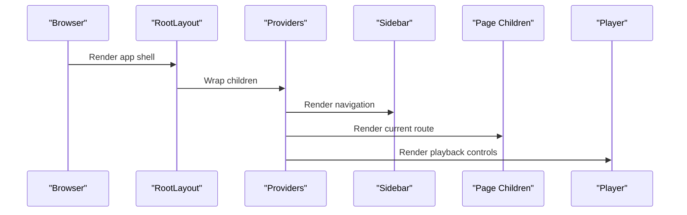
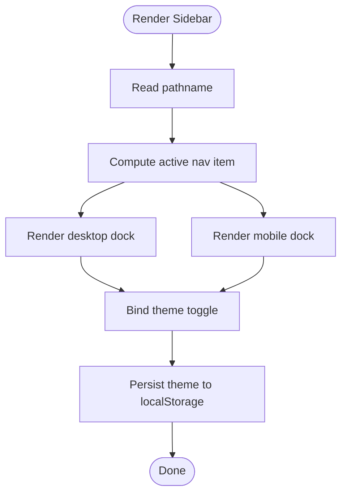
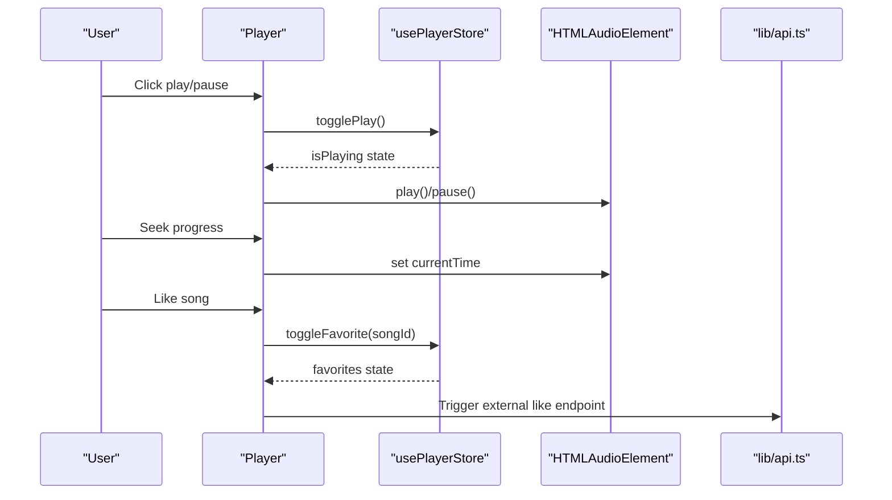
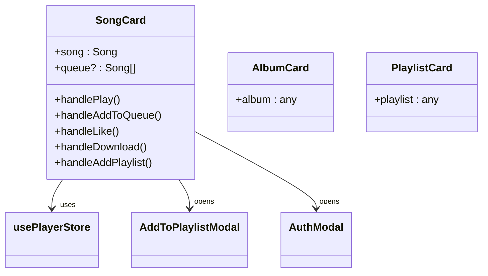
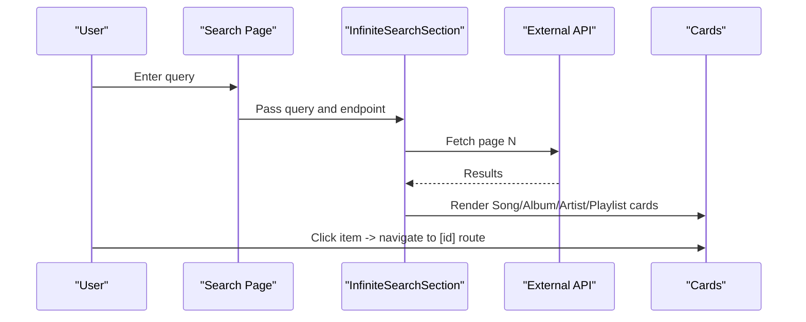
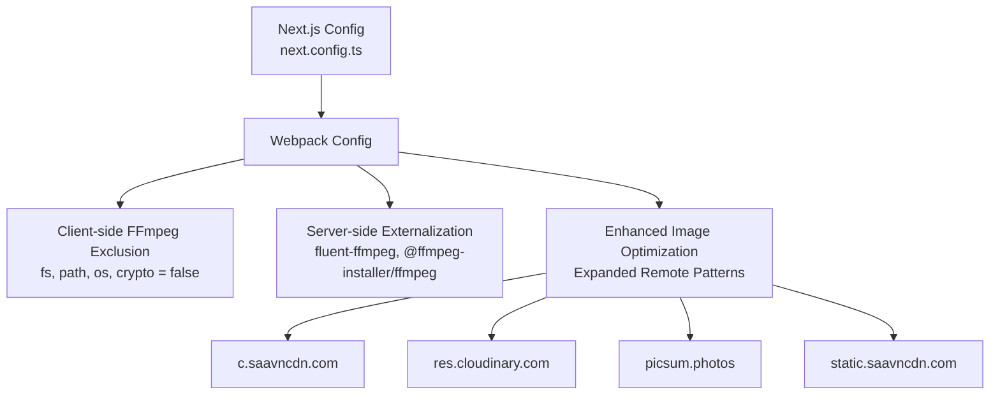
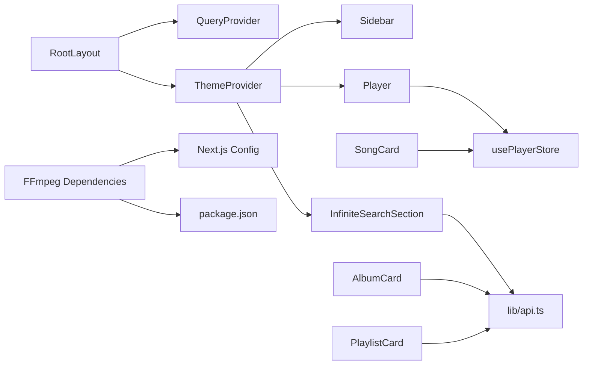

# Frontend Architecture

<cite>
**Referenced Files in This Document**
- [next.config.ts](file://next.config.ts)
- [app/layout.tsx](file://app/layout.tsx)
- [components/QueryProvider.tsx](file://components/QueryProvider.tsx)
- [components/ThemeProvider.tsx](file://components/ThemeProvider.tsx)
- [components/Sidebar.tsx](file://components/Sidebar.tsx)
- [components/Player.tsx](file://components/Player.tsx)
- [store/usePlayerStore.ts](file://store/usePlayerStore.ts)
- [lib/api.ts](file://lib/api.ts)
- [components/AlbumCard.tsx](file://components/AlbumCard.tsx)
- [components/PlaylistCard.tsx](file://components/PlaylistCard.tsx)
- [components/SongCard.tsx](file://components/SongCard.tsx)
- [components/InfiniteSearchSection.tsx](file://components/InfiniteSearchSection.tsx)
- [app/search/page.tsx](file://app/search/page.tsx)
- [hooks/use-mobile.ts](file://hooks/use-mobile.ts)
- [package.json](file://package.json)
</cite>

## Update Summary
**Changes Made**
- Enhanced Next.js configuration section to document optimized webpack settings for FFmpeg handling
- Updated performance considerations to include server-side dependency externalization
- Added information about improved image optimization settings for audio processing capabilities
- Updated troubleshooting guide to address FFmpeg-related build optimizations

## Table of Contents
1. [Introduction](#introduction)
2. [Project Structure](#project-structure)
3. [Core Components](#core-components)
4. [Architecture Overview](#architecture-overview)
5. [Detailed Component Analysis](#detailed-component-analysis)
6. [Next.js Configuration and Build Optimization](#nextjs-configuration-and-build-optimization)
7. [Dependency Analysis](#dependency-analysis)
8. [Performance Considerations](#performance-considerations)
9. [Troubleshooting Guide](#troubleshooting-guide)
10. [Conclusion](#conclusion)

## Introduction
This document describes the frontend architecture of SonicStream's React-based interface built with Next.js App Router. It covers file-based routing, dynamic routes for content discovery, page component organization, component hierarchy from RootLayout down to reusable cards, provider pattern for global state and theming, component composition patterns, prop interfaces, state management integration, responsive design, animation systems, accessibility considerations, lifecycle and performance optimization via code splitting, and integration with external APIs.

## Project Structure
The application uses Next.js App Router with file-based routing. Pages are organized under app/, with dynamic routes using square brackets (e.g., [id]). Shared UI is centralized under components/, state management under store/, and shared utilities under lib/. Providers wrap the app shell to supply React Query and theme contexts.

**Diagram sources**
- [app/layout.tsx:21-48](file://app/layout.tsx#L21-L48)
- [components/QueryProvider.tsx:6-25](file://components/QueryProvider.tsx#L6-L25)
- [components/ThemeProvider.tsx:21-44](file://components/ThemeProvider.tsx#L21-L44)
- [components/Sidebar.tsx:19-106](file://components/Sidebar.tsx#L19-L106)
- [components/Player.tsx:19-250](file://components/Player.tsx#L19-L250)
- [store/usePlayerStore.ts:43-127](file://store/usePlayerStore.ts#L43-L127)
- [components/AlbumCard.tsx:14-47](file://components/AlbumCard.tsx#L14-L47)
- [components/PlaylistCard.tsx:14-47](file://components/PlaylistCard.tsx#L14-L47)
- [components/SongCard.tsx:22-139](file://components/SongCard.tsx#L22-L139)
- [app/search/page.tsx:20-120](file://app/search/page.tsx#L20-L120)
- [lib/api.ts:37-83](file://lib/api.ts#L37-L83)

**Section sources**
- [app/layout.tsx:1-49](file://app/layout.tsx#L1-L49)
- [components/QueryProvider.tsx:1-26](file://components/QueryProvider.tsx#L1-L26)
- [components/ThemeProvider.tsx:1-45](file://components/ThemeProvider.tsx#L1-L45)

## Core Components
- RootLayout orchestrates providers and renders the sidebar, page content, and player. It sets up fonts, theme attributes, and persistent UI spacers.
- QueryProvider configures React Query defaults (staleTime, refetchOnWindowFocus, retry) and wraps children.
- ThemeProvider manages theme state, persists to localStorage, and exposes a context for toggling themes.
- Sidebar provides desktop floating dock and mobile bottom dock navigation, with theme toggle and active-state styling.
- Player handles audio playback, keyboard shortcuts, progress seeking, queue panel, favorites, and downloads. Integrates with Zustand store.
- Card components encapsulate media item presentation and actions (play, queue, like, download, add to playlist).
- Zustand store centralizes player state, queue, favorites, and user data with persistence.
- API module defines typed Song interface, external endpoints, and helpers for images/downloads/duration normalization.

**Section sources**
- [app/layout.tsx:21-48](file://app/layout.tsx#L21-L48)
- [components/QueryProvider.tsx:6-25](file://components/QueryProvider.tsx#L6-L25)
- [components/ThemeProvider.tsx:21-44](file://components/ThemeProvider.tsx#L21-L44)
- [components/Sidebar.tsx:19-106](file://components/Sidebar.tsx#L19-L106)
- [components/Player.tsx:19-250](file://components/Player.tsx#L19-L250)
- [components/AlbumCard.tsx:14-47](file://components/AlbumCard.tsx#L14-L47)
- [components/PlaylistCard.tsx:14-47](file://components/PlaylistCard.tsx#L14-L47)
- [components/SongCard.tsx:22-139](file://components/SongCard.tsx#L22-L139)
- [store/usePlayerStore.ts:43-127](file://store/usePlayerStore.ts#L43-L127)
- [lib/api.ts:1-153](file://lib/api.ts#L1-L153)

## Architecture Overview
The app uses a layered provider pattern:
- RootLayout composes QueryProvider and ThemeProvider around the entire app.
- Sidebar and Player are always visible; Sidebar provides navigation and theme switching; Player provides playback controls and queue.
- Page components (e.g., Search) render content and compose reusable cards.
- Cards integrate with Zustand store for playback and user actions.
- External API integration is centralized in lib/api.ts with typed Song interface and helper functions.

**Diagram sources**
- [app/layout.tsx:21-48](file://app/layout.tsx#L21-L48)
- [components/QueryProvider.tsx:6-25](file://components/QueryProvider.tsx#L6-L25)
- [components/ThemeProvider.tsx:21-44](file://components/ThemeProvider.tsx#L21-L44)
- [components/Sidebar.tsx:19-106](file://components/Sidebar.tsx#L19-L106)
- [components/Player.tsx:19-250](file://components/Player.tsx#L19-L250)
- [components/InfiniteSearchSection.tsx:23-89](file://components/InfiniteSearchSection.tsx#L23-L89)
- [components/SongCard.tsx:22-139](file://components/SongCard.tsx#L22-L139)
- [components/AlbumCard.tsx:14-47](file://components/AlbumCard.tsx#L14-L47)
- [components/PlaylistCard.tsx:14-47](file://components/PlaylistCard.tsx#L14-L47)
- [store/usePlayerStore.ts:43-127](file://store/usePlayerStore.ts#L43-L127)
- [lib/api.ts:37-83](file://lib/api.ts#L37-L83)

## Detailed Component Analysis

### Provider Pattern: QueryProvider and ThemeProvider
- QueryProvider initializes a React Query client with default caching and retry behavior and exposes a provider context.
- ThemeProvider manages theme state, applies data-theme to html, persists to localStorage, and exposes a toggle function via context.

**Diagram sources**
- [components/QueryProvider.tsx:6-25](file://components/QueryProvider.tsx#L6-L25)
- [components/ThemeProvider.tsx:21-44](file://components/ThemeProvider.tsx#L21-L44)

**Section sources**
- [components/QueryProvider.tsx:6-25](file://components/QueryProvider.tsx#L6-L25)
- [components/ThemeProvider.tsx:21-44](file://components/ThemeProvider.tsx#L21-L44)

### RootLayout Composition and Routing
- RootLayout sets metadata, font, and theme attributes. It composes providers, renders Sidebar and Player, and passes page children. It also adds a bottom spacer to avoid content clipping by the fixed player and mobile navbar.

**Diagram sources**
- [app/layout.tsx:21-48](file://app/layout.tsx#L21-L48)
- [components/Sidebar.tsx:19-106](file://components/Sidebar.tsx#L19-L106)
- [components/Player.tsx:19-250](file://components/Player.tsx#L19-L250)

**Section sources**
- [app/layout.tsx:21-48](file://app/layout.tsx#L21-L48)

### Sidebar Navigation and Theming
- Sidebar renders a desktop floating dock and a mobile bottom dock. It computes active state based on pathname and integrates with ThemeProvider to toggle themes.

**Diagram sources**
- [components/Sidebar.tsx:19-106](file://components/Sidebar.tsx#L19-L106)
- [components/ThemeProvider.tsx:21-44](file://components/ThemeProvider.tsx#L21-L44)

**Section sources**
- [components/Sidebar.tsx:19-106](file://components/Sidebar.tsx#L19-L106)
- [components/ThemeProvider.tsx:21-44](file://components/ThemeProvider.tsx#L21-L44)

### Player Controls and State Integration
- Player manages audio lifecycle, keyboard shortcuts, progress, volume, favorites, and queue. It integrates with Zustand store and uses animations for queue panel and album art transitions.

**Diagram sources**
- [components/Player.tsx:19-250](file://components/Player.tsx#L19-L250)
- [store/usePlayerStore.ts:43-127](file://store/usePlayerStore.ts#L43-L127)
- [lib/api.ts:37-83](file://lib/api.ts#L37-L83)

**Section sources**
- [components/Player.tsx:19-250](file://components/Player.tsx#L19-L250)
- [store/usePlayerStore.ts:43-127](file://store/usePlayerStore.ts#L43-L127)
- [lib/api.ts:37-83](file://lib/api.ts#L37-L83)

### Reusable Card Components and Composition Patterns
- SongCard, AlbumCard, and PlaylistCard accept props and render media items with hover actions and links to detail pages. They use Motion for hover animations and integrate with the player store for playback and queue actions.

**Diagram sources**
- [components/SongCard.tsx:17-139](file://components/SongCard.tsx#L17-L139)
- [components/AlbumCard.tsx:10-47](file://components/AlbumCard.tsx#L10-L47)
- [components/PlaylistCard.tsx:10-47](file://components/PlaylistCard.tsx#L10-L47)
- [store/usePlayerStore.ts:43-127](file://store/usePlayerStore.ts#L43-L127)

**Section sources**
- [components/SongCard.tsx:17-139](file://components/SongCard.tsx#L17-L139)
- [components/AlbumCard.tsx:10-47](file://components/AlbumCard.tsx#L10-L47)
- [components/PlaylistCard.tsx:10-47](file://components/PlaylistCard.tsx#L10-L47)
- [store/usePlayerStore.ts:43-127](file://store/usePlayerStore.ts#L43-L127)

### Dynamic Routes and Content Discovery
- Dynamic routes under app/album[id], app/artist[id], app/song[id] enable content discovery. The Search page composes InfiniteSearchSection to load paginated results and render cards.

**Diagram sources**
- [app/search/page.tsx:20-120](file://app/search/page.tsx#L20-L120)
- [components/InfiniteSearchSection.tsx:23-89](file://components/InfiniteSearchSection.tsx#L23-L89)
- [lib/api.ts:37-83](file://lib/api.ts#L37-L83)

**Section sources**
- [app/search/page.tsx:20-120](file://app/search/page.tsx#L20-L120)
- [components/InfiniteSearchSection.tsx:23-89](file://components/InfiniteSearchSection.tsx#L23-L89)
- [lib/api.ts:37-83](file://lib/api.ts#L37-L83)

## Next.js Configuration and Build Optimization

**Updated** Enhanced Next.js configuration now includes optimized webpack settings specifically designed for FFmpeg handling and improved image optimization for audio processing capabilities.

The Next.js configuration has been enhanced with several key optimizations:

### FFmpeg Dependency Management
The webpack configuration includes specialized handling for FFmpeg-related packages:
- Client-side bundles exclude ffmpeg-related packages (`fs`, `path`, `os`, `crypto`) to prevent webpack from analyzing dynamic requires
- Server-side bundles externalize FFmpeg packages (`fluent-ffmpeg`, `@ffmpeg-installer/ffmpeg`) to prevent bundling issues
- This separation ensures optimal bundle sizes and prevents runtime errors with dynamic imports

### Image Optimization Enhancements
The configuration includes an expanded remote image pattern list supporting:
- Multiple Saavn CDN domains (c.saavncdn.com, pli.saavncdn.com, www.jiosaavn.com, static.saavncdn.com)
- Cloudinary integration for asset management
- Placeholder image support for remote content

### Build Configuration Details
- React strict mode enabled for development validation
- TypeScript build errors configured to fail builds
- ESLint configured to ignore during builds
- Standalone output for containerized deployments
- Motion package transpilation for animation support

**Diagram sources**
- [next.config.ts:54-77](file://next.config.ts#L54-L77)
- [next.config.ts:12-51](file://next.config.ts#L12-L51)

**Section sources**
- [next.config.ts:1-81](file://next.config.ts#L1-L81)
- [package.json:13-24](file://package.json#L13-L24)

## Dependency Analysis
- RootLayout depends on QueryProvider and ThemeProvider, which wrap Sidebar and Player.
- Player and SongCard depend on Zustand store for playback state and user actions.
- Cards depend on lib/api.ts for image and download URLs and Song typing.
- Search page depends on InfiniteSearchSection and lib/api.ts for infinite loading and rendering.
- FFmpeg dependencies are properly isolated between client and server bundles.

**Diagram sources**
- [app/layout.tsx:21-48](file://app/layout.tsx#L21-L48)
- [components/QueryProvider.tsx:6-25](file://components/QueryProvider.tsx#L6-L25)
- [components/ThemeProvider.tsx:21-44](file://components/ThemeProvider.tsx#L21-L44)
- [components/Sidebar.tsx:19-106](file://components/Sidebar.tsx#L19-L106)
- [components/Player.tsx:19-250](file://components/Player.tsx#L19-L250)
- [components/InfiniteSearchSection.tsx:23-89](file://components/InfiniteSearchSection.tsx#L23-L89)
- [components/SongCard.tsx:22-139](file://components/SongCard.tsx#L22-L139)
- [components/AlbumCard.tsx:14-47](file://components/AlbumCard.tsx#L14-L47)
- [components/PlaylistCard.tsx:14-47](file://components/PlaylistCard.tsx#L14-L47)
- [store/usePlayerStore.ts:43-127](file://store/usePlayerStore.ts#L43-L127)
- [lib/api.ts:37-83](file://lib/api.ts#L37-L83)
- [next.config.ts:54-77](file://next.config.ts#L54-L77)
- [package.json:13-24](file://package.json#L13-L24)

**Section sources**
- [app/layout.tsx:21-48](file://app/layout.tsx#L21-L48)
- [components/QueryProvider.tsx:6-25](file://components/QueryProvider.tsx#L6-L25)
- [components/ThemeProvider.tsx:21-44](file://components/ThemeProvider.tsx#L21-L44)
- [components/Player.tsx:19-250](file://components/Player.tsx#L19-L250)
- [components/InfiniteSearchSection.tsx:23-89](file://components/InfiniteSearchSection.tsx#L23-L89)
- [store/usePlayerStore.ts:43-127](file://store/usePlayerStore.ts#L43-L127)
- [lib/api.ts:37-83](file://lib/api.ts#L37-L83)
- [next.config.ts:54-77](file://next.config.ts#L54-L77)
- [package.json:13-24](file://package.json#L13-L24)

## Performance Considerations

**Updated** Enhanced performance considerations now include FFmpeg-specific optimizations and improved image handling for audio processing capabilities.

- Code splitting: Next.js file-based routing naturally splits pages; Suspense boundaries in Search page improve perceived performance during hydration and fetching.
- Infinite scrolling: InfiniteSearchSection uses React Query's infinite query to paginate results efficiently.
- Animations: Motion components are used for hover and transitions; keep animations minimal on lower-end devices.
- Images: getHighQualityImage ensures fallbacks and lazy loading via Next/Image; the enhanced remote pattern configuration supports multiple CDNs for optimal image delivery.
- Audio: Player manages a single audio element and updates src/volume/seek only when needed.
- Persistence: Zustand persist middleware reduces redundant network requests by retaining user preferences locally.
- **FFmpeg Optimization**: Client-side exclusion of FFmpeg dependencies prevents bundle bloat and resolves dynamic import issues. Server-side externalization ensures audio processing libraries don't interfere with client bundle performance.
- **Build Optimization**: Standalone output configuration enables efficient container deployments with optimized bundle sizes.

[No sources needed since this section provides general guidance]

## Troubleshooting Guide

**Updated** Enhanced troubleshooting guide now includes FFmpeg-related build and runtime considerations.

- Hydration mismatch: RootLayout uses suppressHydrationWarning to avoid mismatches between server-rendered and client-mounted providers. Ensure providers are client components and theme initialization is guarded.
- Theme persistence: ThemeProvider reads localStorage on mount; verify localStorage availability and correct data-theme attribute application.
- Player audio errors: Player catches play promise rejections; check CORS for external audio URLs and ensure downloadUrl is present.
- Infinite query: If pagination stops unexpectedly, verify nextPageParam logic and PAGE_SIZE alignment with backend responses.
- Accessibility: Sidebar buttons include aria-labels; ensure interactive elements have proper focus styles and keyboard navigation support.
- **FFmpeg Build Issues**: If encountering errors related to FFmpeg dependencies, verify that client-side bundles properly exclude ffmpeg-related packages and server-side bundles externalize them correctly.
- **Image Loading Problems**: With the enhanced remote pattern configuration, ensure that all image URLs match the configured patterns for optimal performance and security.
- **Bundle Size Issues**: The webpack optimization excludes FFmpeg dependencies from client bundles; if experiencing large bundle sizes, verify that the externalization configuration is working correctly.

**Section sources**
- [app/layout.tsx:21-48](file://app/layout.tsx#L21-L48)
- [components/ThemeProvider.tsx:25-35](file://components/ThemeProvider.tsx#L25-L35)
- [components/Player.tsx:33-45](file://components/Player.tsx#L33-L45)
- [components/InfiniteSearchSection.tsx:38-44](file://components/InfiniteSearchSection.tsx#L38-L44)
- [next.config.ts:64-76](file://next.config.ts#L64-L76)
- [next.config.ts:12-51](file://next.config.ts#L12-L51)

## Conclusion
SonicStream's frontend leverages Next.js App Router for structured routing, a robust provider pattern for state and theming, and a cohesive set of reusable UI components. The architecture balances performance with rich interactions, supports dynamic content discovery, and integrates seamlessly with external APIs. Recent enhancements to the Next.js configuration provide optimized webpack settings for FFmpeg handling, proper server-side dependency externalization, and improved image optimization for audio processing capabilities. The combination of React Query, Zustand, and Motion delivers a responsive and accessible music streaming experience with enhanced build-time optimizations.