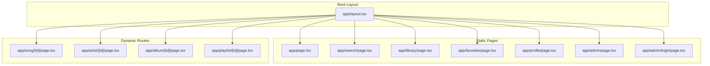
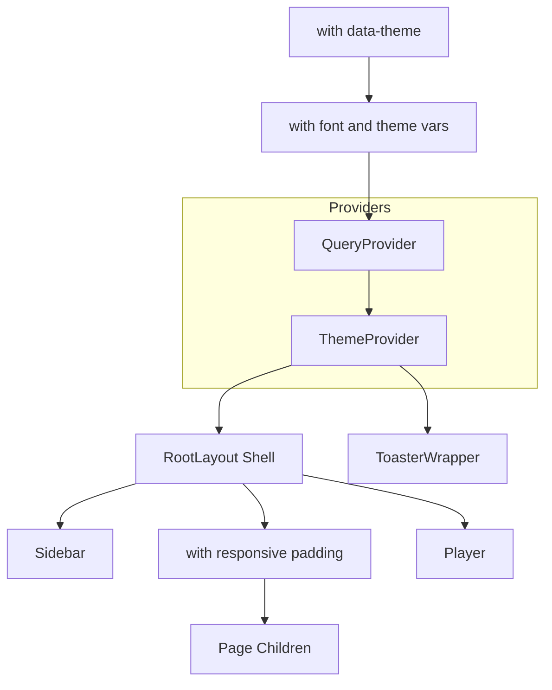
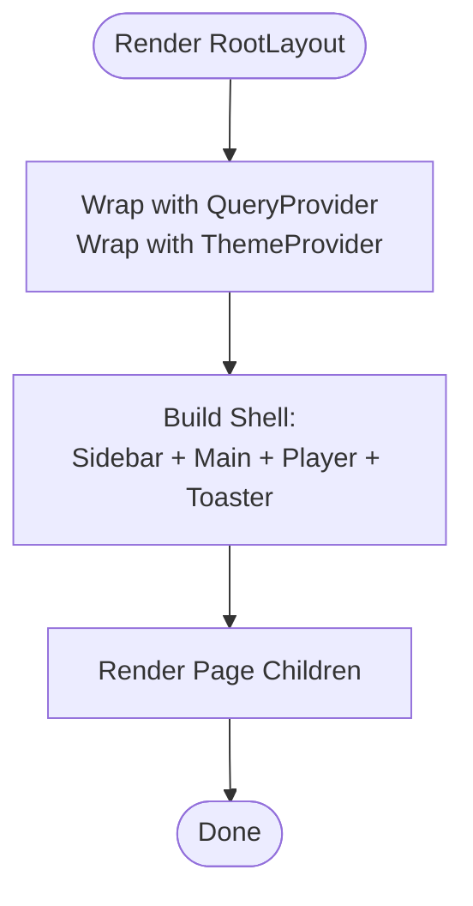
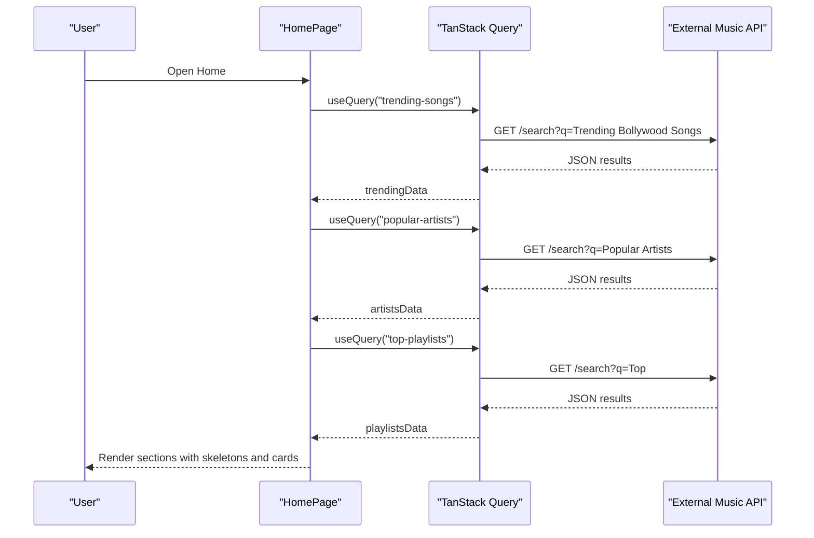
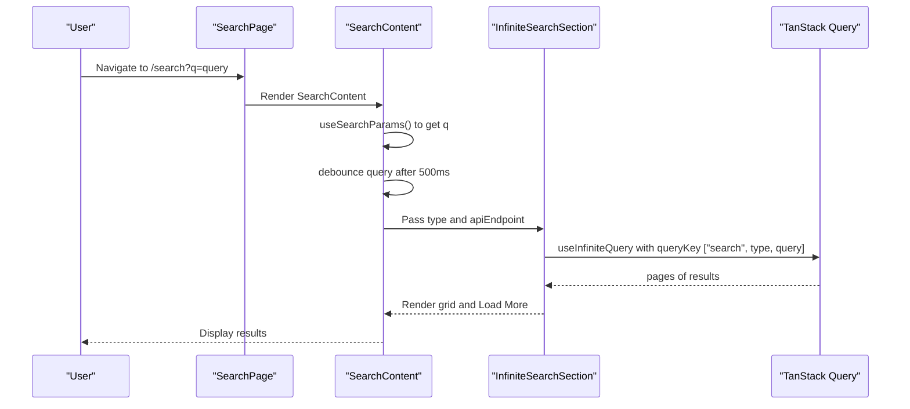
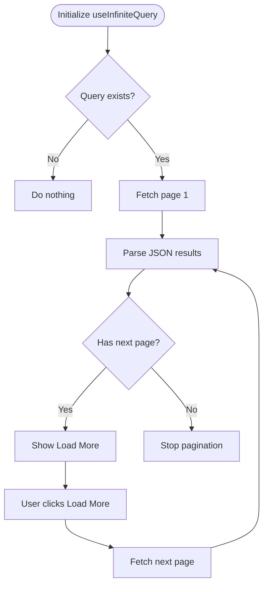
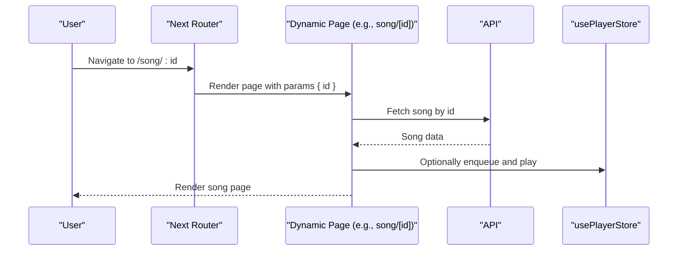
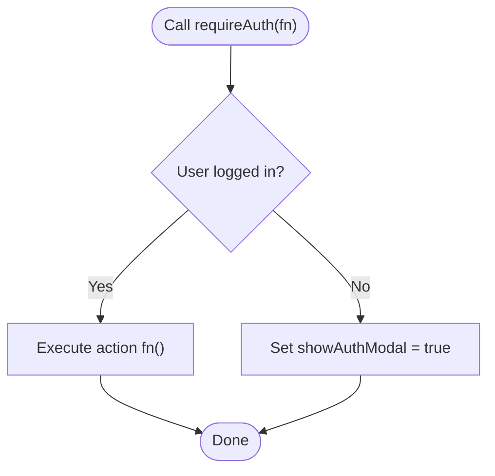
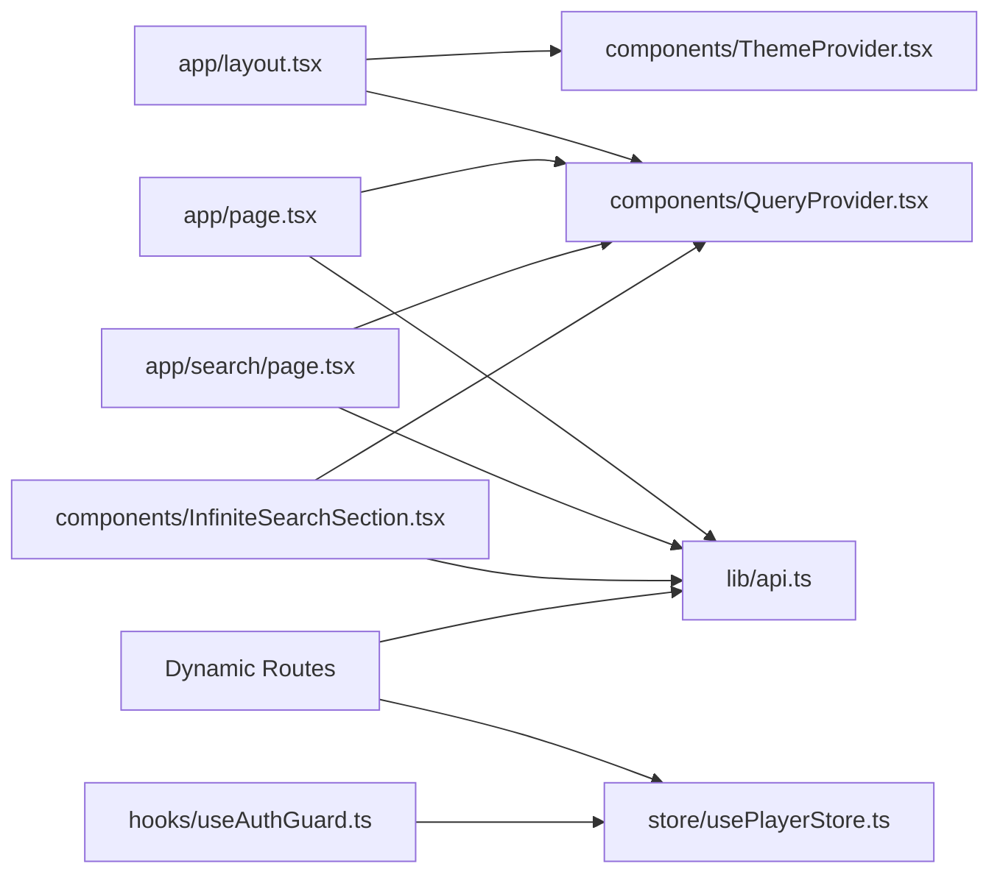

# Next.js App Router

<cite>
**Referenced Files in This Document**
- [app/layout.tsx](file://app/layout.tsx)
- [app/page.tsx](file://app/page.tsx)
- [app/search/page.tsx](file://app/search/page.tsx)
- [app/library/page.tsx](file://app/library/page.tsx)
- [app/favorites/page.tsx](file://app/favorites/page.tsx)
- [app/profile/page.tsx](file://app/profile/page.tsx)
- [app/admin/page.tsx](file://app/admin/page.tsx)
- [app/admin/login/page.tsx](file://app/admin/login/page.tsx)
- [app/song/[id]/page.tsx](file://app/song/[id]/page.tsx)
- [app/artist/[id]/page.tsx](file://app/artist/[id]/page.tsx)
- [app/album/[id]/page.tsx](file://app/album/[id]/page.tsx)
- [app/playlist/[id]/page.tsx](file://app/playlist/[id]/page.tsx)
- [components/QueryProvider.tsx](file://components/QueryProvider.tsx)
- [components/ThemeProvider.tsx](file://components/ThemeProvider.tsx)
- [components/InfiniteSearchSection.tsx](file://components/InfiniteSearchSection.tsx)
- [hooks/useAuthGuard.ts](file://hooks/useAuthGuard.ts)
- [lib/api.ts](file://lib/api.ts)
- [store/usePlayerStore.ts](file://store/usePlayerStore.ts)
</cite>

## Table of Contents
1. [Introduction](#introduction)
2. [Project Structure](#project-structure)
3. [Core Components](#core-components)
4. [Architecture Overview](#architecture-overview)
5. [Detailed Component Analysis](#detailed-component-analysis)
6. [Dependency Analysis](#dependency-analysis)
7. [Performance Considerations](#performance-considerations)
8. [Troubleshooting Guide](#troubleshooting-guide)
9. [Conclusion](#conclusion)

## Introduction
This document explains SonicStream’s Next.js App Router implementation. It covers the file-based routing model, root layout configuration, metadata and SEO setup, responsive design integration, page component organization, dynamic route handling, navigation patterns, route protection, and performance considerations for page transitions.

## Project Structure
SonicStream organizes routes under the app directory using the Next.js App Router convention. Static pages live directly under app (e.g., home, search, library, favorites, profile, admin, admin/login), while dynamic routes use square brackets to capture parameters (e.g., song/[id], artist/[id], album/[id], playlist/[id]).

**Diagram sources**
- [app/layout.tsx](file://app/layout.tsx)
- [app/page.tsx](file://app/page.tsx)
- [app/search/page.tsx](file://app/search/page.tsx)
- [app/library/page.tsx](file://app/library/page.tsx)
- [app/favorites/page.tsx](file://app/favorites/page.tsx)
- [app/profile/page.tsx](file://app/profile/page.tsx)
- [app/admin/page.tsx](file://app/admin/page.tsx)
- [app/admin/login/page.tsx](file://app/admin/login/page.tsx)
- [app/song/[id]/page.tsx](file://app/song/[id]/page.tsx)
- [app/artist/[id]/page.tsx](file://app/artist/[id]/page.tsx)
- [app/album/[id]/page.tsx](file://app/album/[id]/page.tsx)
- [app/playlist/[id]/page.tsx](file://app/playlist/[id]/page.tsx)

**Section sources**
- [app/layout.tsx](file://app/layout.tsx)
- [app/page.tsx](file://app/page.tsx)
- [app/search/page.tsx](file://app/search/page.tsx)
- [app/library/page.tsx](file://app/library/page.tsx)
- [app/favorites/page.tsx](file://app/favorites/page.tsx)
- [app/profile/page.tsx](file://app/profile/page.tsx)
- [app/admin/page.tsx](file://app/admin/page.tsx)
- [app/admin/login/page.tsx](file://app/admin/login/page.tsx)
- [app/song/[id]/page.tsx](file://app/song/[id]/page.tsx)
- [app/artist/[id]/page.tsx](file://app/artist/[id]/page.tsx)
- [app/album/[id]/page.tsx](file://app/album/[id]/page.tsx)
- [app/playlist/[id]/page.tsx](file://app/playlist/[id]/page.tsx)

## Core Components
- Root layout configures providers, metadata, viewport, and responsive layout with persistent sidebar and player.
- Providers:
  - QueryProvider: TanStack Query client with caching and retry defaults.
  - ThemeProvider: Theme context persisted to localStorage and applied to html attributes.
- Page components:
  - Home: Fetches trending songs, popular artists, and top playlists; renders hero, moods, and curated sections.
  - Search: Debounced query handling, category browsing, and infinite tabs for songs/artists/albums/playlists.
  - Dynamic routes: song/[id], artist/[id], album/[id], playlist/[id] serve as content discovery pages.
  - Library, Favorites, Profile, Admin, Admin Login: dedicated static pages.

**Section sources**
- [app/layout.tsx](file://app/layout.tsx)
- [components/QueryProvider.tsx](file://components/QueryProvider.tsx)
- [components/ThemeProvider.tsx](file://components/ThemeProvider.tsx)
- [app/page.tsx](file://app/page.tsx)
- [app/search/page.tsx](file://app/search/page.tsx)

## Architecture Overview
The root layout wraps all pages with providers and establishes a consistent UI shell. Navigation is handled client-side via Next.js router hooks. Data fetching uses TanStack Query with a shared client and normalization utilities.

**Diagram sources**
- [app/layout.tsx](file://app/layout.tsx)
- [components/QueryProvider.tsx](file://components/QueryProvider.tsx)
- [components/ThemeProvider.tsx](file://components/ThemeProvider.tsx)

## Detailed Component Analysis

### Root Layout and Providers
- Metadata and viewport define SEO, PWA capabilities, and device-friendly rendering.
- Responsive layout uses a flex column with a fixed header area and a persistent bottom spacer to avoid content clipping behind the player.
- Providers:
  - QueryProvider sets default cache behavior and retries.
  - ThemeProvider persists theme preference and updates DOM attributes.

**Diagram sources**
- [app/layout.tsx](file://app/layout.tsx)
- [components/QueryProvider.tsx](file://components/QueryProvider.tsx)
- [components/ThemeProvider.tsx](file://components/ThemeProvider.tsx)

**Section sources**
- [app/layout.tsx](file://app/layout.tsx)
- [components/QueryProvider.tsx](file://components/QueryProvider.tsx)
- [components/ThemeProvider.tsx](file://components/ThemeProvider.tsx)

### Home Page (app/page.tsx)
- Uses client directives and TanStack Query to fetch trending songs, popular artists, and top playlists.
- Renders greeting, quick play from recently played, hero spotlight, mood chips, and curated sections.
- Navigation to profile and search is integrated directly in the UI.

**Diagram sources**
- [app/page.tsx](file://app/page.tsx)
- [lib/api.ts](file://lib/api.ts)

**Section sources**
- [app/page.tsx](file://app/page.tsx)
- [lib/api.ts](file://lib/api.ts)

### Search Page (app/search/page.tsx)
- Extracts query from URL search params and debounces input to reduce network churn.
- Provides category browsing when no query is present.
- Tabs switch between songs, artists, albums, and playlists.
- Uses InfiniteSearchSection to load paginated results.

**Diagram sources**
- [app/search/page.tsx](file://app/search/page.tsx)
- [components/InfiniteSearchSection.tsx](file://components/InfiniteSearchSection.tsx)

**Section sources**
- [app/search/page.tsx](file://app/search/page.tsx)
- [components/InfiniteSearchSection.tsx](file://components/InfiniteSearchSection.tsx)

### Infinite Search Section (components/InfiniteSearchSection.tsx)
- Implements infinite pagination with getNextPageParam and enabled flag.
- Normalizes song results and renders appropriate cards per type.
- Handles loading states and “Load More” button.

**Diagram sources**
- [components/InfiniteSearchSection.tsx](file://components/InfiniteSearchSection.tsx)

**Section sources**
- [components/InfiniteSearchSection.tsx](file://components/InfiniteSearchSection.tsx)

### Dynamic Routes (song/[id], artist/[id], album/[id], playlist/[id])
- These routes are discovered via file naming under app. The [id] segment captures the route parameter.
- Parameter extraction is performed client-side using Next.js router hooks (e.g., useParams equivalents in server components or by reading URL in client components).
- Typical pattern:
  - Extract id from route parameters.
  - Fetch content by id using shared API utilities.
  - Render structured content with related items and actions (e.g., play, add to queue, share).
- Route protection:
  - Authentication gating can be enforced using a hook that checks user state and conditionally triggers an auth modal or redirects.

**Diagram sources**
- [app/song/[id]/page.tsx](file://app/song/[id]/page.tsx)
- [store/usePlayerStore.ts](file://store/usePlayerStore.ts)
- [lib/api.ts](file://lib/api.ts)

**Section sources**
- [app/song/[id]/page.tsx](file://app/song/[id]/page.tsx)
- [app/artist/[id]/page.tsx](file://app/artist/[id]/page.tsx)
- [app/album/[id]/page.tsx](file://app/album/[id]/page.tsx)
- [app/playlist/[id]/page.tsx](file://app/playlist/[id]/page.tsx)
- [hooks/useAuthGuard.ts](file://hooks/useAuthGuard.ts)
- [store/usePlayerStore.ts](file://store/usePlayerStore.ts)
- [lib/api.ts](file://lib/api.ts)

### Route Protection Pattern
- useAuthGuard encapsulates auth-required actions:
  - If user is present, executes the action.
  - Otherwise, toggles an auth modal to prompt sign-in.
- Apply this hook around actions like liking, following, or creating playlists.

**Diagram sources**
- [hooks/useAuthGuard.ts](file://hooks/useAuthGuard.ts)

**Section sources**
- [hooks/useAuthGuard.ts](file://hooks/useAuthGuard.ts)

### Navigation Patterns
- Client-side navigation uses Next.js router hooks to push routes for search, profile, and deep links.
- Home integrates quick navigation to profile and search directly in the header.
- Search supports category selection and tabbed views for different content types.

**Section sources**
- [app/page.tsx](file://app/page.tsx)
- [app/search/page.tsx](file://app/search/page.tsx)

## Dependency Analysis
- Providers:
  - Root layout depends on QueryProvider and ThemeProvider.
  - QueryProvider depends on TanStack Query.
  - ThemeProvider depends on React context and localStorage.
- Pages:
  - Home and Search depend on TanStack Query and shared API utilities.
  - Dynamic routes depend on route parameters and API utilities.
- Stores:
  - Player store is used for playback actions and queue management.

**Diagram sources**
- [app/layout.tsx](file://app/layout.tsx)
- [components/QueryProvider.tsx](file://components/QueryProvider.tsx)
- [components/ThemeProvider.tsx](file://components/ThemeProvider.tsx)
- [app/page.tsx](file://app/page.tsx)
- [app/search/page.tsx](file://app/search/page.tsx)
- [components/InfiniteSearchSection.tsx](file://components/InfiniteSearchSection.tsx)
- [lib/api.ts](file://lib/api.ts)
- [store/usePlayerStore.ts](file://store/usePlayerStore.ts)
- [hooks/useAuthGuard.ts](file://hooks/useAuthGuard.ts)

**Section sources**
- [app/layout.tsx](file://app/layout.tsx)
- [components/QueryProvider.tsx](file://components/QueryProvider.tsx)
- [components/ThemeProvider.tsx](file://components/ThemeProvider.tsx)
- [app/page.tsx](file://app/page.tsx)
- [app/search/page.tsx](file://app/search/page.tsx)
- [components/InfiniteSearchSection.tsx](file://components/InfiniteSearchSection.tsx)
- [lib/api.ts](file://lib/api.ts)
- [store/usePlayerStore.ts](file://store/usePlayerStore.ts)
- [hooks/useAuthGuard.ts](file://hooks/useAuthGuard.ts)

## Performance Considerations
- Caching and retries:
  - QueryProvider sets a short stale time and limits retries to reduce redundant requests.
- Infinite pagination:
  - InfiniteSearchSection uses page-based pagination with enabled guards to avoid unnecessary fetches.
- Skeleton loaders:
  - Used during initial loads and “Load More” to maintain perceived performance.
- Hydration and SSR:
  - Root layout suppresses hydration warnings where needed and applies theme consistently.
- Transitions:
  - Motion animations are used sparingly to avoid jank; keep animations minimal on lower-end devices.

**Section sources**
- [components/QueryProvider.tsx](file://components/QueryProvider.tsx)
- [components/InfiniteSearchSection.tsx](file://components/InfiniteSearchSection.tsx)
- [app/page.tsx](file://app/page.tsx)
- [app/layout.tsx](file://app/layout.tsx)

## Troubleshooting Guide
- Hydration mismatch:
  - Ensure theme and font initialization do not cause mismatches between server-rendered and client-rendered content.
- Provider order:
  - Verify QueryProvider wraps ThemeProvider and all pages to avoid missing query client context.
- Parameter extraction:
  - Confirm dynamic route pages read parameters correctly and guard against missing ids.
- Auth gating:
  - Use useAuthGuard to prevent unauthenticated actions; ensure the auth modal appears when needed.
- Network errors:
  - Inspect external API responses and handle empty results gracefully in infinite lists.

**Section sources**
- [app/layout.tsx](file://app/layout.tsx)
- [components/ThemeProvider.tsx](file://components/ThemeProvider.tsx)
- [hooks/useAuthGuard.ts](file://hooks/useAuthGuard.ts)
- [components/InfiniteSearchSection.tsx](file://components/InfiniteSearchSection.tsx)

## Conclusion
SonicStream’s Next.js App Router implementation leverages file-based routing, robust providers, and client-side navigation to deliver a responsive and performant music streaming experience. Dynamic routes enable scalable content discovery, while TanStack Query and skeleton loaders ensure smooth interactions. SEO and PWA metadata are configured at the root, and theme persistence enhances accessibility. Applying route protection and optimizing infinite pagination further improve reliability and user satisfaction.