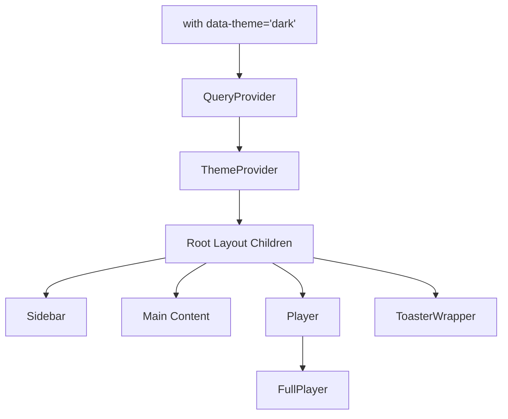
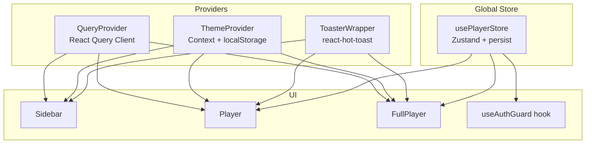
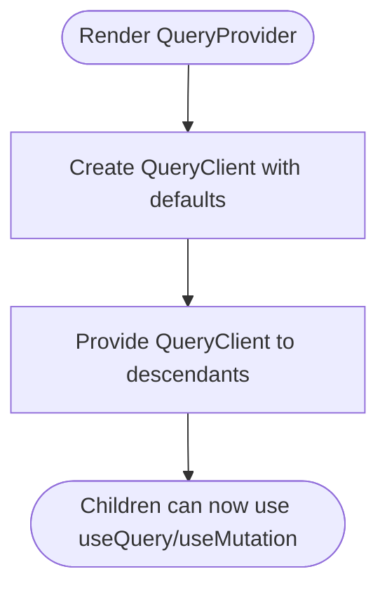
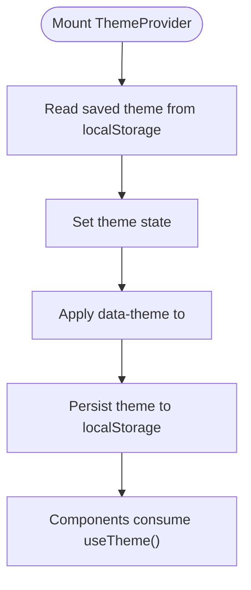
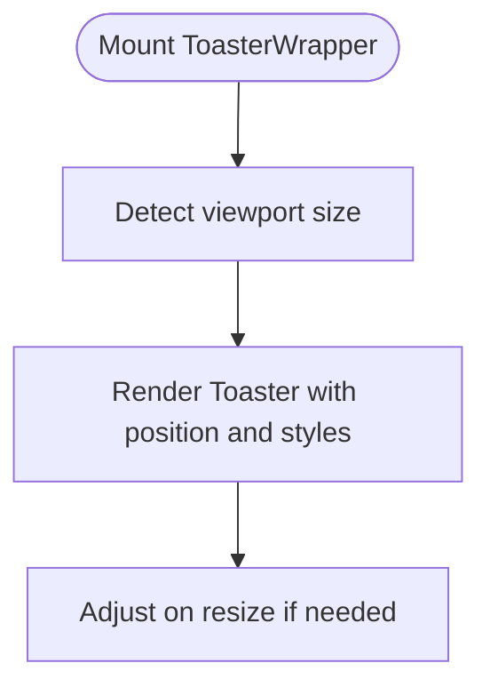
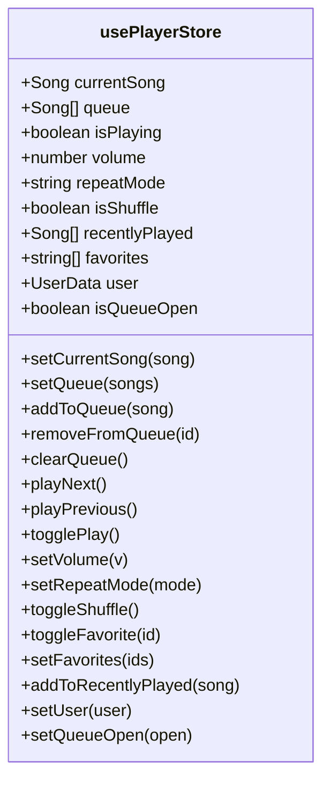
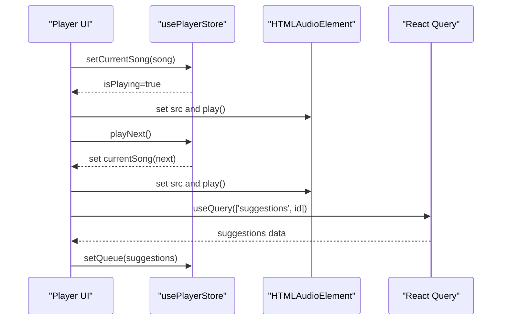
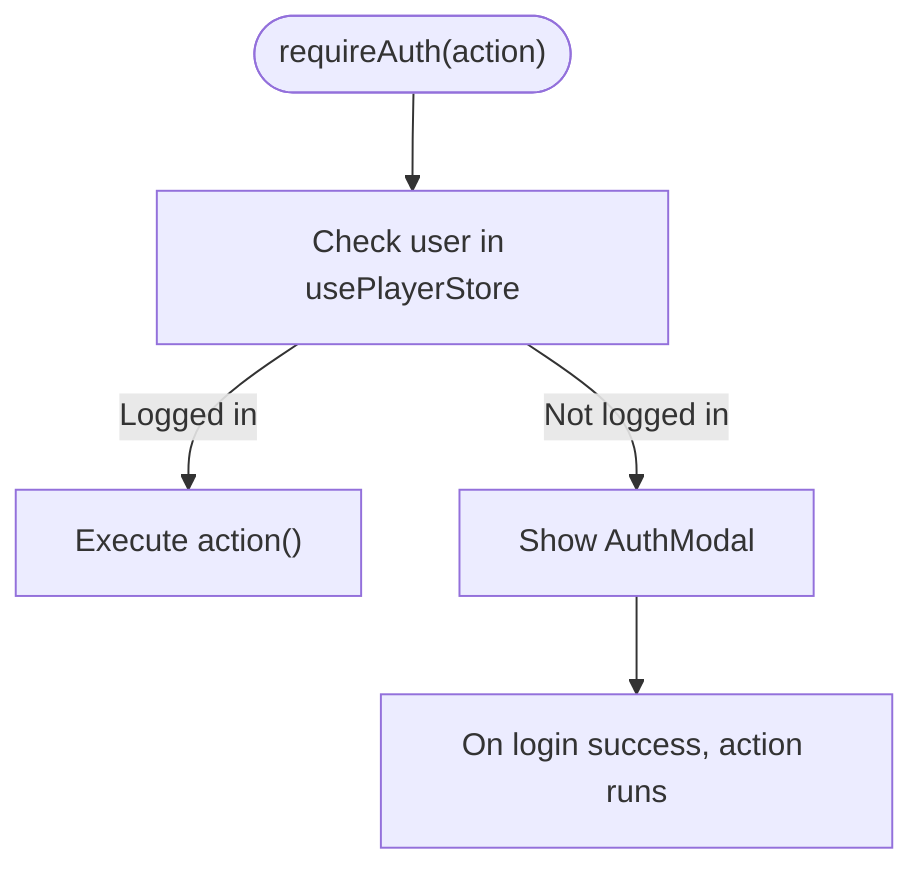
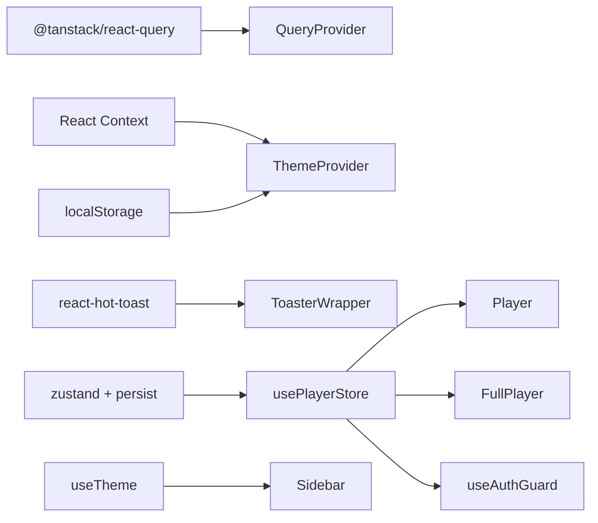

# State Management & Providers

<cite>
**Referenced Files in This Document**
- [layout.tsx](file://app/layout.tsx)
- [QueryProvider.tsx](file://components/QueryProvider.tsx)
- [ThemeProvider.tsx](file://components/ThemeProvider.tsx)
- [ToasterWrapper.tsx](file://components/ToasterWrapper.tsx)
- [usePlayerStore.ts](file://store/usePlayerStore.ts)
- [Player.tsx](file://components/Player.tsx)
- [FullPlayer.tsx](file://components/FullPlayer.tsx)
- [useAuthGuard.ts](file://hooks/useAuthGuard.ts)
- [api.ts](file://lib/api.ts)
- [Sidebar.tsx](file://components/Sidebar.tsx)
</cite>

## Table of Contents
1. [Introduction](#introduction)
2. [Project Structure](#project-structure)
3. [Core Components](#core-components)
4. [Architecture Overview](#architecture-overview)
5. [Detailed Component Analysis](#detailed-component-analysis)
6. [Dependency Analysis](#dependency-analysis)
7. [Performance Considerations](#performance-considerations)
8. [Troubleshooting Guide](#troubleshooting-guide)
9. [Conclusion](#conclusion)

## Introduction
This document explains SonicStream’s state management and provider architecture. It covers:
- Provider pattern implementation for React Query data fetching and caching via QueryProvider
- ThemeProvider for persistent dark/light mode switching
- ToasterWrapper for notification management
- Zustand-backed usePlayerStore for audio player state, queue persistence, playback controls, and session management
- Provider ordering, context consumption patterns, and cross-component state synchronization
- Examples of custom hooks for global state access, performance strategies for large-scale updates, and error handling approaches

## Project Structure
Providers and stores are wired at the root layout level, ensuring global availability across pages. The provider hierarchy is:
- QueryProvider wraps all content to enable React Query caching and refetch policies
- ThemeProvider wraps the app to manage theme state and persistence
- ToasterWrapper is rendered globally for notifications
- Zustand store is consumed by player components and auth gating logic

**Diagram sources**
- [layout.tsx:78-101](file://app/layout.tsx#L78-L101)

**Section sources**
- [layout.tsx:78-101](file://app/layout.tsx#L78-L101)

## Core Components
- QueryProvider: Creates a React Query client with default caching and refetch policies, enabling centralized data fetching and caching across the app.
- ThemeProvider: Manages theme state, persists to local storage, and applies the theme to the document element.
- ToasterWrapper: Renders react-hot-toast with responsive positioning and themed styles.
- usePlayerStore: Zustand store managing audio playback state, queue, favorites, recent history, user session, and queue panel visibility.

**Section sources**
- [QueryProvider.tsx:6-25](file://components/QueryProvider.tsx#L6-L25)
- [ThemeProvider.tsx:21-43](file://components/ThemeProvider.tsx#L21-L43)
- [ToasterWrapper.tsx:6-41](file://components/ToasterWrapper.tsx#L6-L41)
- [usePlayerStore.ts:43-127](file://store/usePlayerStore.ts#L43-L127)

## Architecture Overview
The state architecture combines three pillars:
- React Query for server-state caching and invalidation
- Local theme state with persistence
- Zustand store for client-side audio and session state

**Diagram sources**
- [layout.tsx:86-101](file://app/layout.tsx#L86-L101)
- [usePlayerStore.ts:43-127](file://store/usePlayerStore.ts#L43-L127)
- [useAuthGuard.ts:12-28](file://hooks/useAuthGuard.ts#L12-L28)

## Detailed Component Analysis

### QueryProvider
- Purpose: Initialize a React Query client with default options for staleTime, refetchOnWindowFocus, and retry policy.
- Behavior: Returns a QueryClientProvider that wraps children, enabling useQuery and related hooks anywhere below it.
- Integration: Rendered at the root layout to ensure all pages benefit from caching and background refetch policies.

**Diagram sources**
- [QueryProvider.tsx:6-25](file://components/QueryProvider.tsx#L6-L25)

**Section sources**
- [QueryProvider.tsx:6-25](file://components/QueryProvider.tsx#L6-L25)
- [layout.tsx:86](file://app/layout.tsx#L86)

### ThemeProvider
- Purpose: Manage theme state (dark/light), persist to localStorage, and apply to the document element.
- Behavior: On mount, reads saved theme; updates DOM attribute and localStorage on change; exposes a useTheme hook for consumers.
- Integration: Wrapped around the app to make theme available globally.

**Diagram sources**
- [ThemeProvider.tsx:21-43](file://components/ThemeProvider.tsx#L21-L43)

**Section sources**
- [ThemeProvider.tsx:21-43](file://components/ThemeProvider.tsx#L21-L43)
- [layout.tsx:100](file://app/layout.tsx#L100)
- [Sidebar.tsx:21](file://components/Sidebar.tsx#L21)

### ToasterWrapper
- Purpose: Provide a global toast container with responsive positioning and theme-aware styling.
- Behavior: Detects mobile viewport and adjusts toast position; applies consistent styles and themed icons.

**Diagram sources**
- [ToasterWrapper.tsx:6-41](file://components/ToasterWrapper.tsx#L6-L41)

**Section sources**
- [ToasterWrapper.tsx:6-41](file://components/ToasterWrapper.tsx#L6-L41)
- [layout.tsx:99](file://app/layout.tsx#L99)

### usePlayerStore (Zustand)
- State shape: currentSong, queue, isPlaying, volume, repeatMode, isShuffle, recentlyPlayed, favorites, user, isQueueOpen.
- Persistence: Uses zustand/middleware persist to save selected slices (volume, favorites, recentlyPlayed, user) to storage.
- Playback logic: Implements setCurrentSong, setQueue, addToQueue, removeFromQueue, clearQueue, playNext, playPrevious, togglePlay, setVolume, setRepeatMode, toggleShuffle, toggleFavorite, setFavorites, addToRecentlyPlayed, setUser, setQueueOpen.
- Synchronization: Components subscribe to store slices and update UI accordingly; actions coordinate audio playback and queue navigation.

**Diagram sources**
- [usePlayerStore.ts:12-41](file://store/usePlayerStore.ts#L12-L41)

**Section sources**
- [usePlayerStore.ts:43-127](file://store/usePlayerStore.ts#L43-L127)

### Player and FullPlayer Integration
- Player consumes usePlayerStore to control audio playback, queue, and UI state. It manages an HTMLAudioElement, keyboard shortcuts, and queue panel.
- FullPlayer uses React Query to fetch song suggestions and integrates with the store for playback controls and queue updates.

**Diagram sources**
- [Player.tsx:19-82](file://components/Player.tsx#L19-L82)
- [FullPlayer.tsx:34-70](file://components/FullPlayer.tsx#L34-L70)
- [usePlayerStore.ts:57-115](file://store/usePlayerStore.ts#L57-L115)

**Section sources**
- [Player.tsx:19-251](file://components/Player.tsx#L19-L251)
- [FullPlayer.tsx:34-243](file://components/FullPlayer.tsx#L34-L243)
- [usePlayerStore.ts:57-115](file://store/usePlayerStore.ts#L57-L115)

### useAuthGuard Hook
- Purpose: Gate authenticated actions using the store’s user state. Opens an auth modal when unauthenticated and executes the action upon login.
- Integration: Used in Player and FullPlayer to protect actions like liking a song or adding to a playlist.

**Diagram sources**
- [useAuthGuard.ts:12-28](file://hooks/useAuthGuard.ts#L12-L28)
- [usePlayerStore.ts:13](file://store/usePlayerStore.ts#L13)

**Section sources**
- [useAuthGuard.ts:12-28](file://hooks/useAuthGuard.ts#L12-L28)
- [Player.tsx:63-66](file://components/Player.tsx#L63-L66)
- [FullPlayer.tsx:64-69](file://components/FullPlayer.tsx#L64-L69)

### Provider Ordering and Context Consumption
- Order: QueryProvider → ThemeProvider → Root Layout Children → ToasterWrapper.
- Consumption patterns:
  - Player and FullPlayer consume usePlayerStore slices directly.
  - Sidebar consumes useTheme via useTheme hook.
  - FullPlayer uses React Query via useQuery for suggestions.
- Hydration: Root layout uses suppressHydrationWarning to avoid mismatches during SSR.

**Section sources**
- [layout.tsx:86-101](file://app/layout.tsx#L86-L101)
- [Sidebar.tsx:21](file://components/Sidebar.tsx#L21)
- [FullPlayer.tsx:44-51](file://components/FullPlayer.tsx#L44-L51)

## Dependency Analysis
- Provider dependencies:
  - QueryProvider depends on @tanstack/react-query.
  - ThemeProvider depends on React context and localStorage.
  - ToasterWrapper depends on react-hot-toast.
- Store dependencies:
  - usePlayerStore depends on zustand and zustand/middleware persist.
  - useAuthGuard depends on usePlayerStore.
- UI dependencies:
  - Player and FullPlayer depend on usePlayerStore and react-hot-toast.
  - Sidebar depends on useTheme.

**Diagram sources**
- [QueryProvider.tsx:3](file://components/QueryProvider.tsx#L3)
- [ThemeProvider.tsx:3](file://components/ThemeProvider.tsx#L3)
- [ToasterWrapper.tsx:3](file://components/ToasterWrapper.tsx#L3)
- [usePlayerStore.ts:1-2](file://store/usePlayerStore.ts#L1-L2)
- [useAuthGuard.ts:3](file://hooks/useAuthGuard.ts#L3)
- [Sidebar.tsx:8](file://components/Sidebar.tsx#L8)

**Section sources**
- [QueryProvider.tsx:3](file://components/QueryProvider.tsx#L3)
- [ThemeProvider.tsx:3](file://components/ThemeProvider.tsx#L3)
- [ToasterWrapper.tsx:3](file://components/ToasterWrapper.tsx#L3)
- [usePlayerStore.ts:1-2](file://store/usePlayerStore.ts#L1-L2)
- [useAuthGuard.ts:3](file://hooks/useAuthGuard.ts#L3)
- [Sidebar.tsx:8](file://components/Sidebar.tsx#L8)

## Performance Considerations
- React Query defaults:
  - staleTime reduces redundant network requests for cached data.
  - refetchOnWindowFocus disabled to avoid unnecessary background refetches.
  - retry set to 1 to balance resilience with resource usage.
- Zustand store:
  - Use slice selectors to minimize re-renders (e.g., subscribe only to currentSong and isPlaying).
  - Keep frequently updated slices small; persist only necessary parts.
- UI updates:
  - Debounce or throttle heavy UI updates (seek bars, volume sliders).
  - Avoid re-rendering entire queues; use stable keys and shallow comparisons.
- Network:
  - Normalize and cache normalized song data to reduce parsing overhead.
  - Use enabled flags in queries to prevent unnecessary fetches.

[No sources needed since this section provides general guidance]

## Troubleshooting Guide
- Theme not applying on first load:
  - Ensure ThemeProvider mounts before any component tries to read useTheme.
  - Verify localStorage key and document attribute application.
- Toasts not visible:
  - Confirm ToasterWrapper is rendered at root and responsive detection works.
- Player not updating:
  - Verify usePlayerStore subscriptions and that setCurrentSong triggers playback.
  - Check audio src assignment and isPlaying transitions.
- Auth gating not working:
  - Ensure useAuthGuard checks user presence and opens modal when missing.
  - Confirm store.setUser is called after successful login.

**Section sources**
- [ThemeProvider.tsx:25-35](file://components/ThemeProvider.tsx#L25-L35)
- [ToasterWrapper.tsx:9-14](file://components/ToasterWrapper.tsx#L9-L14)
- [Player.tsx:33-45](file://components/Player.tsx#L33-L45)
- [useAuthGuard.ts:16-25](file://hooks/useAuthGuard.ts#L16-L25)

## Conclusion
SonicStream’s state architecture cleanly separates concerns:
- React Query handles server-state caching and refetch policies
- ThemeProvider centralizes theme persistence and DOM application
- ToasterWrapper standardizes notifications
- usePlayerStore encapsulates audio and session state with persistence
- Provider ordering and hooks ensure predictable, scalable state access across components