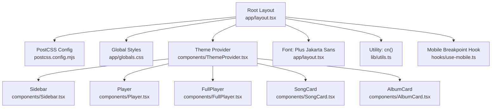
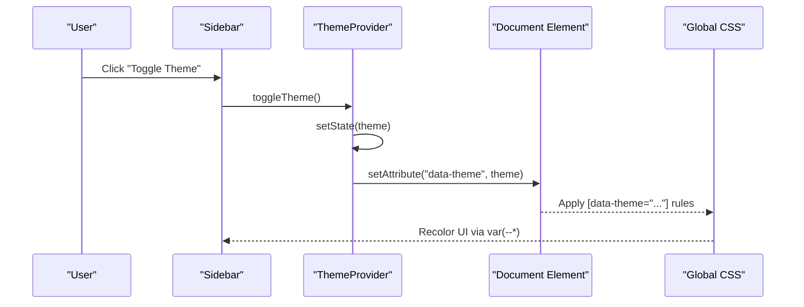
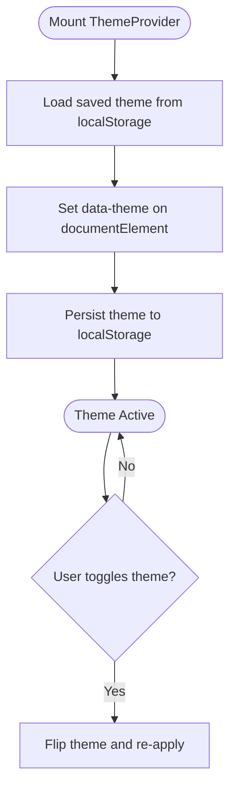
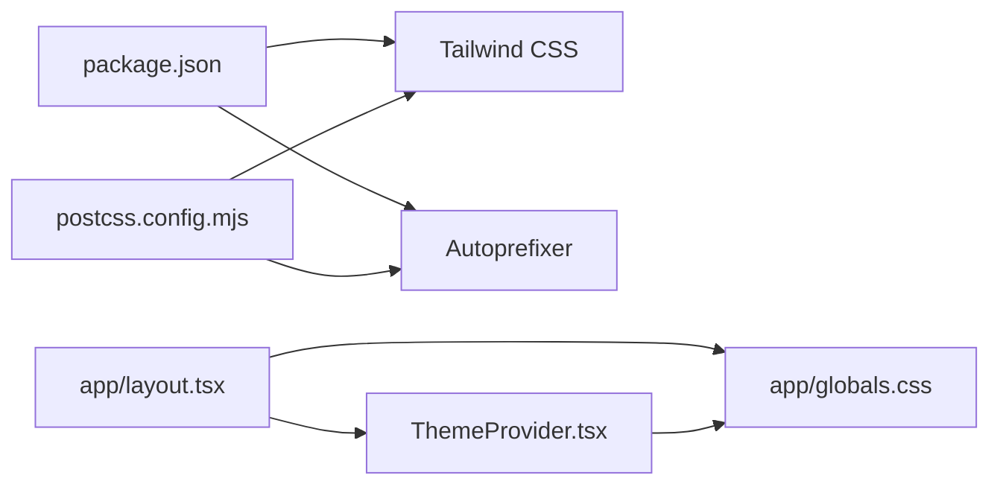

# Styling & Theming

<cite>
**Referenced Files in This Document**
- [app/layout.tsx](file://app/layout.tsx)
- [app/globals.css](file://app/globals.css)
- [components/ThemeProvider.tsx](file://components/ThemeProvider.tsx)
- [components/Sidebar.tsx](file://components/Sidebar.tsx)
- [components/Player.tsx](file://components/Player.tsx)
- [components/FullPlayer.tsx](file://components/FullPlayer.tsx)
- [components/SongCard.tsx](file://components/SongCard.tsx)
- [components/AlbumCard.tsx](file://components/AlbumCard.tsx)
- [hooks/use-mobile.ts](file://hooks/use-mobile.ts)
- [lib/utils.ts](file://lib/utils.ts)
- [postcss.config.mjs](file://postcss.config.mjs)
- [package.json](file://package.json)
- [next.config.ts](file://next.config.ts)
</cite>

## Table of Contents
1. [Introduction](#introduction)
2. [Project Structure](#project-structure)
3. [Core Components](#core-components)
4. [Architecture Overview](#architecture-overview)
5. [Detailed Component Analysis](#detailed-component-analysis)
6. [Dependency Analysis](#dependency-analysis)
7. [Performance Considerations](#performance-considerations)
8. [Troubleshooting Guide](#troubleshooting-guide)
9. [Conclusion](#conclusion)

## Introduction
This document explains SonicStream’s styling architecture and theming system. It covers Tailwind CSS integration, custom CSS variables for theme management, font configuration with Plus Jakarta Sans, responsive design patterns, light/dark mode switching, component-level styling approaches, and cross-browser compatibility. It also outlines performance considerations around CSS-in-JS patterns and critical CSS extraction.

## Project Structure
SonicStream organizes global styles and theming at the root layout level, with a dedicated ThemeProvider that manages theme persistence and DOM attributes. Components consume theme variables via CSS custom properties and Tailwind utilities, while PostCSS and Tailwind compile and optimize styles.

**Diagram sources**
- [app/layout.tsx:1-106](file://app/layout.tsx#L1-L106)
- [postcss.config.mjs:1-10](file://postcss.config.mjs#L1-L10)
- [app/globals.css:1-214](file://app/globals.css#L1-L214)
- [components/ThemeProvider.tsx:1-45](file://components/ThemeProvider.tsx#L1-L45)
- [components/Sidebar.tsx:1-113](file://components/Sidebar.tsx#L1-L113)
- [components/Player.tsx:1-251](file://components/Player.tsx#L1-L251)
- [components/FullPlayer.tsx:1-243](file://components/FullPlayer.tsx#L1-L243)
- [components/SongCard.tsx:1-140](file://components/SongCard.tsx#L1-L140)
- [components/AlbumCard.tsx:1-48](file://components/AlbumCard.tsx#L1-L48)
- [lib/utils.ts:1-6](file://lib/utils.ts#L1-L6)
- [hooks/use-mobile.ts:1-19](file://hooks/use-mobile.ts#L1-L19)

**Section sources**
- [app/layout.tsx:1-106](file://app/layout.tsx#L1-L106)
- [postcss.config.mjs:1-10](file://postcss.config.mjs#L1-L10)
- [app/globals.css:1-214](file://app/globals.css#L1-L214)

## Core Components
- ThemeProvider: Manages theme state, persists selection to localStorage, and sets a data attribute on the root element for CSS targeting.
- Global CSS: Defines CSS custom properties for themes, base styles, animations, and reusable utility classes.
- Layout: Applies Plus Jakarta Sans, initializes theme, and composes providers and UI shells.
- Components: Consume theme variables and Tailwind utilities for consistent styling across light/dark modes.

Key responsibilities:
- Centralized theme state and persistence
- CSS custom property-driven theming
- Font injection and viewport metadata
- Utility classes for merging Tailwind classes

**Section sources**
- [components/ThemeProvider.tsx:1-45](file://components/ThemeProvider.tsx#L1-L45)
- [app/globals.css:1-214](file://app/globals.css#L1-L214)
- [app/layout.tsx:1-106](file://app/layout.tsx#L1-L106)
- [lib/utils.ts:1-6](file://lib/utils.ts#L1-L6)

## Architecture Overview
The theming pipeline ties together React state, CSS custom properties, and Tailwind utilities. The ThemeProvider writes the current theme to the document element, enabling CSS selectors to switch between light and dark palettes. Components read theme variables directly via var(--*) and combine Tailwind utilities for layout and spacing.

**Diagram sources**
- [components/Sidebar.tsx:64-71](file://components/Sidebar.tsx#L64-L71)
- [components/ThemeProvider.tsx:31-37](file://components/ThemeProvider.tsx#L31-L37)
- [app/globals.css:25-81](file://app/globals.css#L25-L81)

## Detailed Component Analysis

### ThemeProvider
- Purpose: Provide theme context, persist theme preference, and apply the theme to the DOM.
- Behavior:
  - Initializes theme from localStorage or defaults to dark.
  - On mount, writes the theme to the document element’s data attribute.
  - Exposes a toggle function to switch themes.
- Persistence: Uses localStorage to remember user choice across sessions.

**Diagram sources**
- [components/ThemeProvider.tsx:21-37](file://components/ThemeProvider.tsx#L21-L37)

**Section sources**
- [components/ThemeProvider.tsx:1-45](file://components/ThemeProvider.tsx#L1-L45)

### Global Styles and Design System
- CSS custom properties: Centralized color tokens, borders, accents, shadows, and layout metrics for both light and dark themes.
- Base layer: Applies background and text colors globally with transitions.
- Utilities:
  - Scrollbar styling with theme-aware colors.
  - Range input sliders with glow effects.
  - Glass cards with backdrop filters and transitions.
  - Skeleton loading animation.
  - Marquee and equalizer bar animations.
- Safe areas: Uses env(safe-area-inset-*) for notched devices.

Design system highlights:
- Color schemes: Primary, secondary, tertiary backgrounds; card and glass backgrounds; borders; accents and glows.
- Typography: Plus Jakarta Sans is injected and applied at the body level.
- Spacing: Consistent use of CSS variables for heights and paddings.
- Motion: Transitions and keyframe animations for interactive feedback.

**Section sources**
- [app/globals.css:1-214](file://app/globals.css#L1-L214)
- [app/layout.tsx:10-14](file://app/layout.tsx#L10-L14)

### Layout Composition
- Font: Plus Jakarta Sans is loaded with multiple weights and exposed via a CSS variable for consistent typography scaling.
- Root element: Sets initial data-theme to dark and applies base styles.
- Providers: Wraps the shell with QueryProvider and ThemeProvider to enable theming and data fetching.
- Shell structure: Sidebar, main content area, Player, and toast wrapper.

Responsive considerations:
- Uses CSS variables for header and navigation heights to adapt to different layouts.
- Mobile-safe padding via env(safe-area-inset-*).

**Section sources**
- [app/layout.tsx:1-106](file://app/layout.tsx#L1-L106)

### Sidebar
- Desktop floating dock and mobile bottom dock share theme-aware styles.
- Uses var(--dock-bg), var(--bg-card), var(--border), and var(--text-primary) for consistent theming.
- Theme toggle button switches icons and updates theme via ThemeProvider.

**Section sources**
- [components/Sidebar.tsx:19-113](file://components/Sidebar.tsx#L19-L113)

### Player and FullPlayer
- Both components rely on CSS variables for background, borders, accents, and shadows.
- Progress bars, volume sliders, and equalizer bars use theme-aware colors and animations.
- Backdrop blur and glass card effects are applied consistently.

**Section sources**
- [components/Player.tsx:19-251](file://components/Player.tsx#L19-L251)
- [components/FullPlayer.tsx:1-243](file://components/FullPlayer.tsx#L1-243)

### SongCard and AlbumCard
- Use the glass-card utility and theme-aware hover states.
- Icons and accent colors derive from CSS variables for consistent theming.
- Interactive states (like playing indicators) use CSS animations.

**Section sources**
- [components/SongCard.tsx:1-140](file://components/SongCard.tsx#L1-L140)
- [components/AlbumCard.tsx:1-48](file://components/AlbumCard.tsx#L1-L48)

### Responsive Design Patterns
- Mobile breakpoint hook: Provides a boolean signal for responsive rendering.
- CSS variables for heights: Allows dynamic adaptation of header and navigation heights.
- Safe-area insets: Ensures proper spacing on devices with notches.
- Media queries: Tailwind utilities and component-specific logic adapt layout for desktop vs. mobile.

**Section sources**
- [hooks/use-mobile.ts:1-19](file://hooks/use-mobile.ts#L1-L19)
- [app/globals.css:15-23](file://app/globals.css#L15-L23)
- [app/layout.tsx:90-96](file://app/layout.tsx#L90-L96)

### Conditional Styling and Media Queries
- Conditional theming: [data-theme="light"/"dark"] selectors switch palettes.
- Component-level overrides: Inline style attributes use var(--*) for immediate theme application.
- Utility merging: cn() merges Tailwind classes safely, ensuring predictable specificity.

**Section sources**
- [app/globals.css:25-81](file://app/globals.css#L25-L81)
- [lib/utils.ts:1-6](file://lib/utils.ts#L1-L6)

### Cross-Browser Compatibility
- Autoprefixer is configured via PostCSS to ensure vendor prefixes for modern CSS features.
- WebKit-specific backdrop filters are explicitly handled alongside standard properties.
- Scrollbar styling targets both WebKit and Mozilla engines.

**Section sources**
- [postcss.config.mjs:1-10](file://postcss.config.mjs#L1-L10)
- [app/globals.css:94-134](file://app/globals.css#L94-L134)

## Dependency Analysis
- Build toolchain: Tailwind CSS and PostCSS are integrated via the PostCSS config.
- Runtime dependencies: Tailwind utilities and merge utilities are used across components.
- Next.js configuration: No special CSS handling; builds with standard Next.js pipeline.

**Diagram sources**
- [package.json:12-33](file://package.json#L12-L33)
- [postcss.config.mjs:1-10](file://postcss.config.mjs#L1-L10)
- [app/layout.tsx:1-106](file://app/layout.tsx#L1-L106)
- [app/globals.css:1-214](file://app/globals.css#L1-L214)
- [components/ThemeProvider.tsx:1-45](file://components/ThemeProvider.tsx#L1-L45)

**Section sources**
- [package.json:12-33](file://package.json#L12-L33)
- [postcss.config.mjs:1-10](file://postcss.config.mjs#L1-L10)
- [next.config.ts:1-67](file://next.config.ts#L1-L67)

## Performance Considerations
- CSS-in-JS patterns: The codebase does not use CSS-in-JS libraries; styling relies on CSS custom properties and Tailwind utilities, minimizing runtime overhead.
- Critical CSS extraction: Next.js extracts critical CSS automatically; ensure fonts and essential styles are included in the initial bundle.
- Bundle size: Tailwind is included as a dependency; consider purging unused classes in production builds.
- Animations: CSS keyframes and transitions are efficient; avoid excessive reflows by leveraging transform and opacity properties.
- Local storage: Theme persistence is lightweight; ensure minimal writes to localStorage.

[No sources needed since this section provides general guidance]

## Troubleshooting Guide
- Theme not applying:
  - Verify the data-theme attribute is set on the document element after mounting.
  - Confirm [data-theme="..."] selectors are present in the compiled CSS.
- Variables not updating:
  - Ensure components read from var(--*) and not hardcoded hex values.
  - Check that the ThemeProvider is wrapping the UI tree.
- Scrollbar or range input styles missing:
  - Confirm browser support for WebKit/Mozilla pseudo-elements and that the global CSS is imported.
- Mobile safe area issues:
  - Verify env(safe-area-inset-*) is supported and that CSS variables are applied to padding/bottom properties.
- Build errors:
  - Ensure Tailwind and PostCSS are installed and configured correctly.

**Section sources**
- [components/ThemeProvider.tsx:21-37](file://components/ThemeProvider.tsx#L21-L37)
- [app/globals.css:15-23](file://app/globals.css#L15-L23)
- [postcss.config.mjs:1-10](file://postcss.config.mjs#L1-L10)

## Conclusion
SonicStream’s styling architecture centers on a robust theme provider, CSS custom properties, and Tailwind utilities. The design system leverages a cohesive palette and typography, with responsive patterns and cross-browser compatibility. Components consistently consume theme variables and Tailwind classes, enabling scalable and maintainable UI development. For production, ensure critical CSS extraction and Tailwind purging are configured to optimize performance.