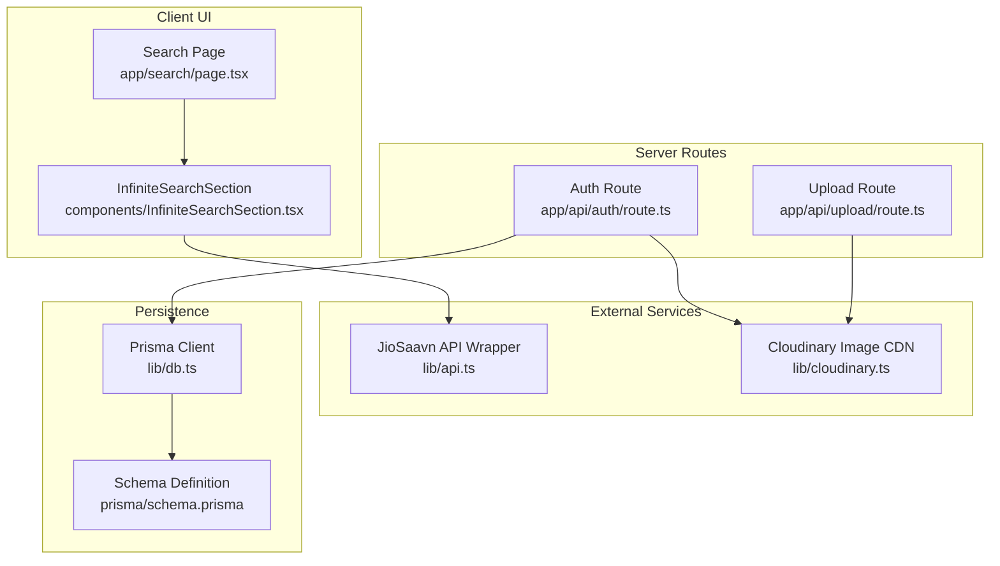
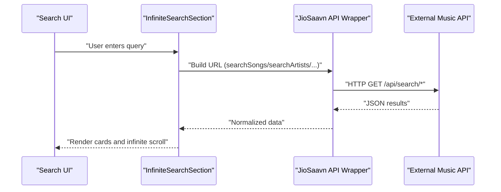
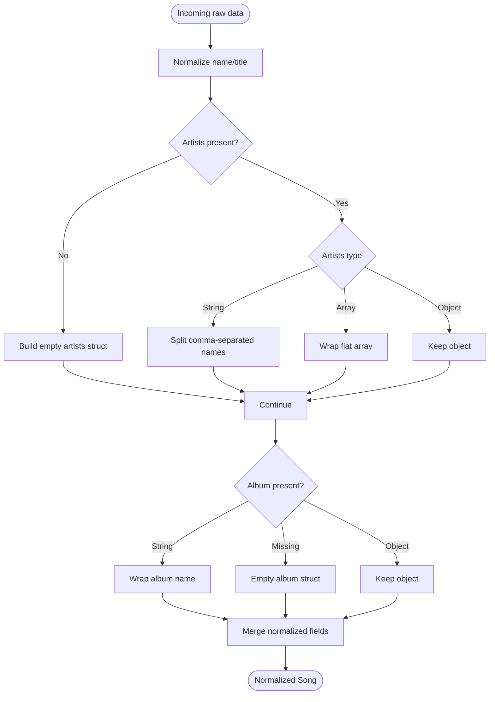
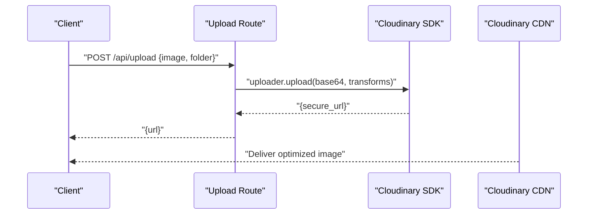
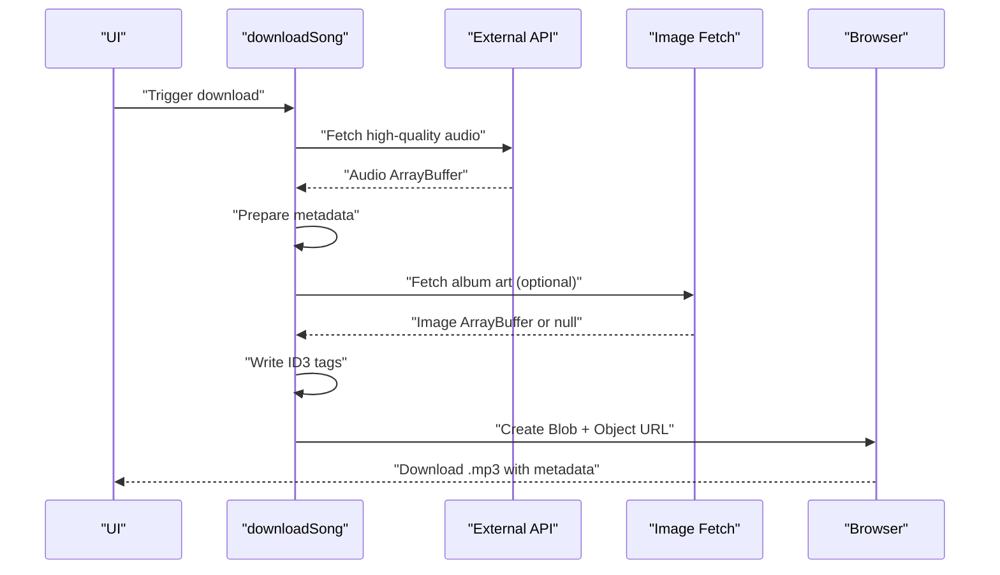
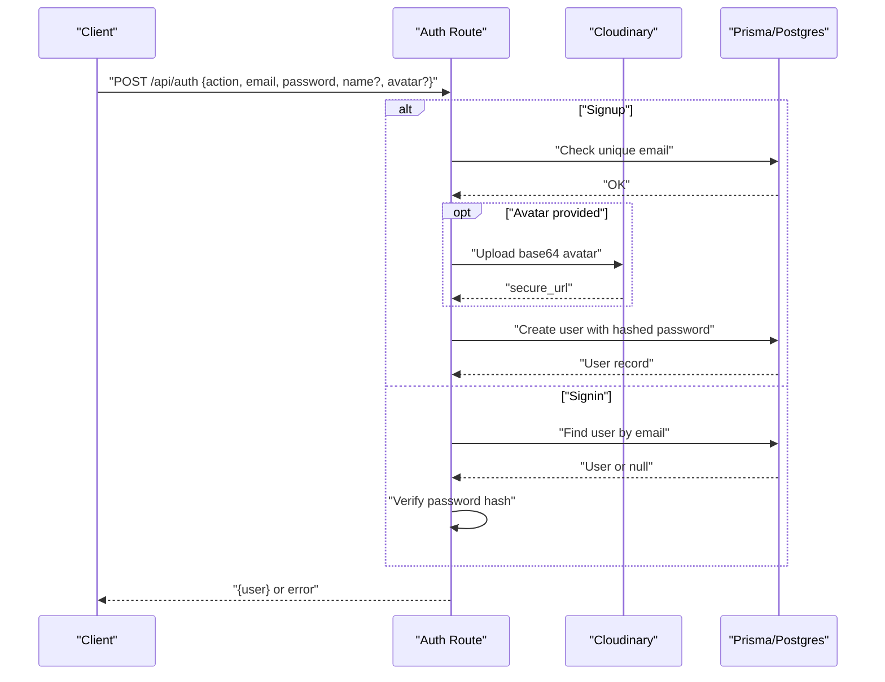
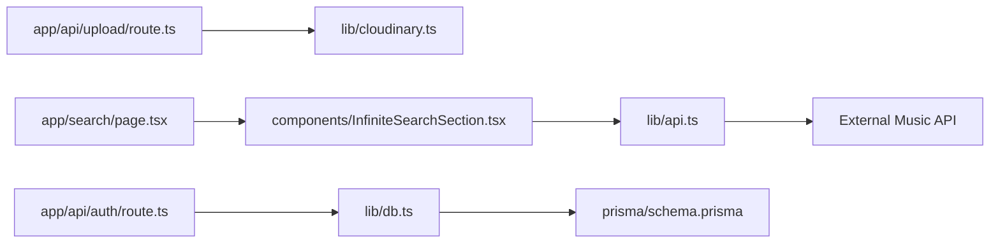

# Integration Architecture

<cite>
**Referenced Files in This Document**
- [api.ts](file://lib/api.ts)
- [cloudinary.ts](file://lib/cloudinary.ts)
- [downloadSong.ts](file://lib/downloadSong.ts)
- [route.ts](file://app/api/upload/route.ts)
- [route.ts](file://app/api/auth/route.ts)
- [db.ts](file://lib/db.ts)
- [schema.prisma](file://prisma/schema.prisma)
- [page.tsx](file://app/search/page.tsx)
- [InfiniteSearchSection.tsx](file://components/InfiniteSearchSection.tsx)
- [InfiniteArtistSection.tsx](file://components/InfiniteArtistSection.tsx)
- [README.md](file://README.md)
- [package.json](file://package.json)
</cite>

## Table of Contents
1. [Introduction](#introduction)
2. [Project Structure](#project-structure)
3. [Core Components](#core-components)
4. [Architecture Overview](#architecture-overview)
5. [Detailed Component Analysis](#detailed-component-analysis)
6. [Dependency Analysis](#dependency-analysis)
7. [Performance Considerations](#performance-considerations)
8. [Troubleshooting Guide](#troubleshooting-guide)
9. [Conclusion](#conclusion)

## Introduction
This document describes SonicStream’s integration architecture for external services, focusing on:
- External music API integration via a JioSaavn-compatible wrapper with data normalization and pagination
- Cloudinary integration for avatar uploads and image optimization
- Download functionality with ID3 metadata embedding and file processing
- Authentication flows and database persistence
- Rate limiting, error handling, fallbacks, and monitoring approaches
- Security and privacy considerations for external API usage

## Project Structure
SonicStream organizes integration concerns across dedicated libraries and API routes:
- lib/api.ts: External music API wrapper, URL builders, normalization utilities, and quality selectors
- lib/cloudinary.ts: Cloudinary SDK configuration and avatar upload helpers
- lib/downloadSong.ts: Client-side download pipeline with ID3 tagging and metadata embedding
- app/api/upload/route.ts: Serverless endpoint for Cloudinary avatar uploads
- app/api/auth/route.ts: Authentication handler integrating Cloudinary avatar uploads and local DB persistence
- lib/db.ts and prisma/schema.prisma: Database client and schema for user and queue data
- app/search/page.tsx and components/InfiniteSearchSection.tsx: UI pages and infinite query components consuming the external API
- README.md and package.json: Project overview and dependency declarations

**Diagram sources**
- [page.tsx:1-128](file://app/search/page.tsx#L1-L128)
- [InfiniteSearchSection.tsx:1-44](file://components/InfiniteSearchSection.tsx#L1-L44)
- [api.ts:1-153](file://lib/api.ts#L1-L153)
- [cloudinary.ts:1-21](file://lib/cloudinary.ts#L1-L21)
- [route.ts:1-20](file://app/api/upload/route.ts#L1-L20)
- [route.ts:1-73](file://app/api/auth/route.ts#L1-L73)
- [db.ts:1-10](file://lib/db.ts#L1-L10)
- [schema.prisma:1-111](file://prisma/schema.prisma#L1-L111)

**Section sources**
- [README.md:1-74](file://README.md#L1-L74)
- [package.json:1-50](file://package.json#L1-L50)

## Core Components
- JioSaavn API Wrapper (lib/api.ts)
  - Provides typed Song interface and normalized fields
  - Exposes URL builders for search, songs, albums, artists, and playlists
  - Includes quality selectors for images and download URLs
  - Implements robust data normalization to handle inconsistent upstream shapes
- Cloudinary Integration (lib/cloudinary.ts)
  - Configures SDK with environment variables
  - Provides avatar upload with transformations for resizing and optimization
- Download Pipeline (lib/downloadSong.ts)
  - Fetches high-quality audio, embeds ID3 metadata, optionally fetches album art, and triggers browser downloads
- Upload Endpoint (app/api/upload/route.ts)
  - Accepts base64 image payload and returns secure Cloudinary URL
- Authentication Flow (app/api/auth/route.ts)
  - Handles signup/signin, optional avatar upload, and stores hashed passwords in Postgres via Prisma
- Persistence (lib/db.ts, prisma/schema.prisma)
  - Prisma client initialization and schema for users, queues, playlists, and related entities

**Section sources**
- [api.ts:1-153](file://lib/api.ts#L1-L153)
- [cloudinary.ts:1-21](file://lib/cloudinary.ts#L1-L21)
- [downloadSong.ts:1-223](file://lib/downloadSong.ts#L1-L223)
- [route.ts:1-20](file://app/api/upload/route.ts#L1-L20)
- [route.ts:1-73](file://app/api/auth/route.ts#L1-L73)
- [db.ts:1-10](file://lib/db.ts#L1-L10)
- [schema.prisma:1-111](file://prisma/schema.prisma#L1-L111)

## Architecture Overview
The system integrates three primary external services:
- Music catalog via a JioSaavn-compatible API
- Cloudinary for avatar/image hosting and optimization
- Local PostgreSQL via Prisma for user and queue data

**Diagram sources**
- [page.tsx:1-128](file://app/search/page.tsx#L1-L128)
- [InfiniteSearchSection.tsx:1-44](file://components/InfiniteSearchSection.tsx#L1-L44)
- [api.ts:37-69](file://lib/api.ts#L37-L69)

## Detailed Component Analysis

### JioSaavn API Wrapper and Data Normalization
The wrapper encapsulates:
- Base URL construction and fetcher with error propagation
- Route builders for search, songs, albums, artists, and playlists
- Quality selection helpers for images and download URLs
- Robust normalization to unify inconsistent upstream structures

**Diagram sources**
- [api.ts:92-152](file://lib/api.ts#L92-L152)

**Section sources**
- [api.ts:37-90](file://lib/api.ts#L37-L90)
- [api.ts:92-152](file://lib/api.ts#L92-L152)

### Cloudinary Integration for Avatar Uploads and Media Optimization
Cloudinary is configured using environment variables and provides:
- Avatar upload with automatic resizing, cropping, and format/quality optimization
- Transformation pipeline applied at upload time for consistent delivery

**Diagram sources**
- [route.ts:1-20](file://app/api/upload/route.ts#L1-L20)
- [cloudinary.ts:9-18](file://lib/cloudinary.ts#L9-L18)

**Section sources**
- [cloudinary.ts:1-21](file://lib/cloudinary.ts#L1-L21)
- [route.ts:1-20](file://app/api/upload/route.ts#L1-L20)

### Download Functionality, ID3 Metadata Embedding, and File Processing
The download pipeline performs:
- Fetch audio from high-quality download URL
- Optionally fetch album art and detect MIME type
- Construct ID3 frames (title, artist, album, year, APIC)
- Create a tagged MP3 blob and trigger a browser download

**Diagram sources**
- [downloadSong.ts:154-222](file://lib/downloadSong.ts#L154-L222)

**Section sources**
- [downloadSong.ts:1-223](file://lib/downloadSong.ts#L1-L223)

### Authentication Provider Integrations and Third-Party Authentication Flows
Current implementation:
- Local authentication with hashed passwords stored in Postgres via Prisma
- Optional avatar upload during signup using Cloudinary
- No third-party OAuth providers are integrated in the current codebase

**Diagram sources**
- [route.ts:16-72](file://app/api/auth/route.ts#L16-L72)
- [cloudinary.ts:9-18](file://lib/cloudinary.ts#L9-L18)
- [db.ts:1-10](file://lib/db.ts#L1-L10)
- [schema.prisma:16-32](file://prisma/schema.prisma#L16-L32)

**Section sources**
- [route.ts:1-73](file://app/api/auth/route.ts#L1-L73)
- [cloudinary.ts:1-21](file://lib/cloudinary.ts#L1-L21)
- [db.ts:1-10](file://lib/db.ts#L1-L10)
- [schema.prisma:1-111](file://prisma/schema.prisma#L1-L111)

### API Rate Limiting Strategies
- Current code does not implement explicit rate limiting for external API calls
- Recommendations:
  - Apply server-side rate limiting on Next.js API routes using a middleware pattern
  - Use Redis-backed rate limiter to throttle per-IP or per-user
  - Implement circuit breakers and retries with exponential backoff
  - Cache frequent queries (e.g., search suggestions) with short TTLs

[No sources needed since this section provides general guidance]

### Error Handling, Fallback Mechanisms, and Monitoring
- External API errors:
  - fetcher throws on non-OK responses; callers should wrap calls with try/catch and surface user-friendly messages
  - Normalize functions return safe defaults (fallback image, empty arrays) to avoid rendering crashes
- UI fallbacks:
  - Infinite query components render skeletons while loading and skip empty pages
- Monitoring:
  - Log external service errors and durations
  - Track download failures and missing metadata
  - Surface actionable toast notifications to users

**Section sources**
- [api.ts:39-43](file://lib/api.ts#L39-L43)
- [InfiniteSearchSection.tsx:33-44](file://components/InfiniteSearchSection.tsx#L33-L44)

### Security Considerations and Data Privacy Compliance
- Environment variables:
  - Cloudinary credentials are loaded from environment variables; ensure they are not committed and restrict access
- Authentication:
  - Password hashing is implemented; consider upgrading to bcrypt for stronger security
  - Validate and sanitize all inputs in API routes
- Data privacy:
  - Minimize logging of PII; redact sensitive fields
  - Respect user data deletion requests and maintain audit logs
- Transport and storage:
  - Enforce HTTPS for all external API calls and Cloudinary uploads
  - Store only hashed passwords and minimal user data

**Section sources**
- [cloudinary.ts:3-7](file://lib/cloudinary.ts#L3-L7)
- [route.ts:6-13](file://app/api/auth/route.ts#L6-L13)

## Dependency Analysis
External dependencies relevant to integrations:
- Cloudinary SDK for image hosting and transformations
- Prisma for database access
- TanStack Query for efficient data fetching and caching
- react-hot-toast for user feedback

**Diagram sources**
- [api.ts:1-153](file://lib/api.ts#L1-L153)
- [cloudinary.ts:1-21](file://lib/cloudinary.ts#L1-L21)
- [route.ts:1-20](file://app/api/upload/route.ts#L1-L20)
- [route.ts:1-73](file://app/api/auth/route.ts#L1-L73)
- [db.ts:1-10](file://lib/db.ts#L1-L10)
- [schema.prisma:1-111](file://prisma/schema.prisma#L1-L111)
- [page.tsx:1-128](file://app/search/page.tsx#L1-L128)
- [InfiniteSearchSection.tsx:1-44](file://components/InfiniteSearchSection.tsx#L1-L44)

**Section sources**
- [package.json:12-32](file://package.json#L12-L32)

## Performance Considerations
- Pagination and caching:
  - Use TanStack Query’s built-in caching and background refetching to reduce redundant network calls
  - Implement optimistic updates for likes, follows, and queue items
- Image optimization:
  - Leverage Cloudinary transformations to deliver appropriately sized assets
  - Prefer modern formats (WebP) when supported by clients
- Download pipeline:
  - Stream audio where possible to reduce memory usage
  - Debounce user-triggered downloads to avoid overwhelming the client

[No sources needed since this section provides general guidance]

## Troubleshooting Guide
Common issues and resolutions:
- External API failures:
  - Verify BASE_URL and route builders; check network tab for 4xx/5xx responses
  - Implement retry with exponential backoff and circuit breaker
- Download errors:
  - Confirm high-quality download URL exists; fallback gracefully if missing
  - Validate ID3 writing logic and MIME type detection for album art
- Authentication failures:
  - Ensure environment variables for Cloudinary and database are set
  - Check password hashing consistency and unique email constraints
- Avatar upload failures:
  - Validate base64 payload and Cloudinary credentials
  - Confirm folder permissions and quotas

**Section sources**
- [api.ts:37-43](file://lib/api.ts#L37-L43)
- [downloadSong.ts:154-222](file://lib/downloadSong.ts#L154-L222)
- [route.ts:16-72](file://app/api/auth/route.ts#L16-L72)
- [route.ts:5-19](file://app/api/upload/route.ts#L5-L19)

## Conclusion
SonicStream’s integration architecture centers on a robust JioSaavn-compatible API wrapper with strong data normalization, Cloudinary-powered image optimization, and a client-side download pipeline with ID3 metadata. Authentication is handled locally with optional avatar uploads, and persistence is managed via Prisma and PostgreSQL. To enhance reliability, consider adding rate limiting, circuit breakers, and comprehensive monitoring. Strengthen security by adopting bcrypt, enforcing HTTPS, and minimizing data exposure.