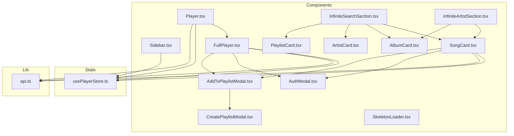
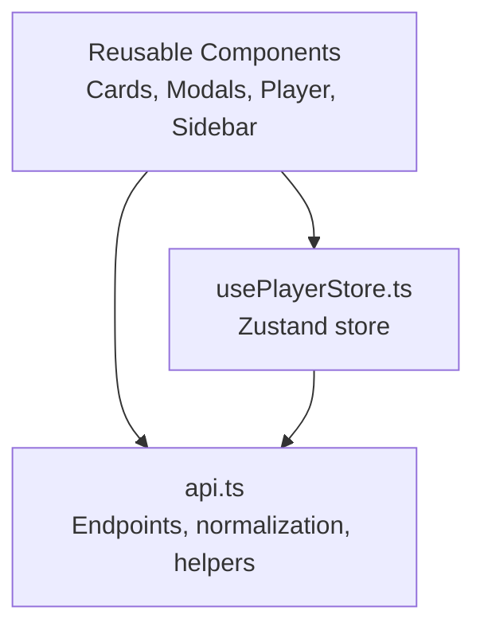
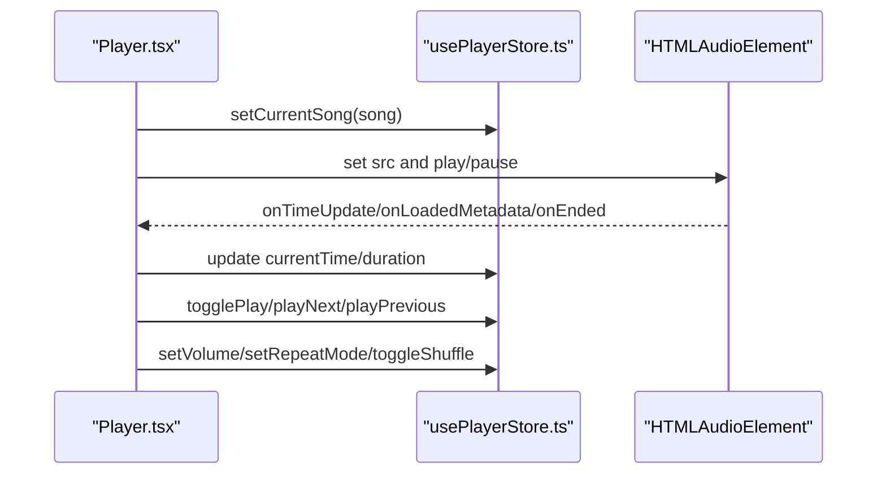
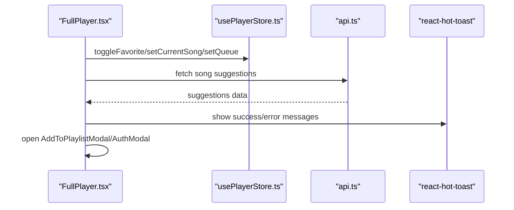
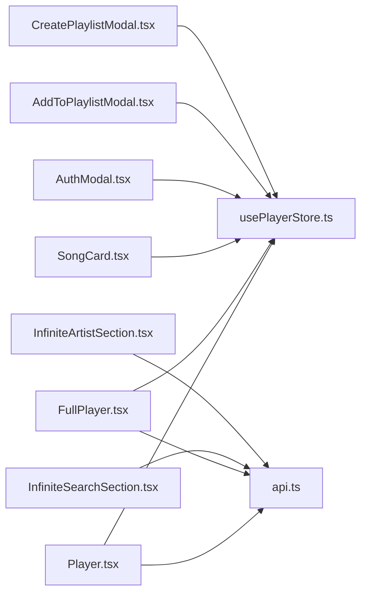

# Component Library

<cite>
**Referenced Files in This Document**
- [AddToPlaylistModal.tsx](file://components/AddToPlaylistModal.tsx)
- [AlbumCard.tsx](file://components/AlbumCard.tsx)
- [ArtistCard.tsx](file://components/ArtistCard.tsx)
- [AuthModal.tsx](file://components/AuthModal.tsx)
- [CreatePlaylistModal.tsx](file://components/CreatePlaylistModal.tsx)
- [FullPlayer.tsx](file://components/FullPlayer.tsx)
- [InfiniteArtistSection.tsx](file://components/InfiniteArtistSection.tsx)
- [InfiniteSearchSection.tsx](file://components/InfiniteSearchSection.tsx)
- [Player.tsx](file://components/Player.tsx)
- [PlaylistCard.tsx](file://components/PlaylistCard.tsx)
- [Sidebar.tsx](file://components/Sidebar.tsx)
- [SkeletonLoader.tsx](file://components/SkeletonLoader.tsx)
- [SongCard.tsx](file://components/SongCard.tsx)
- [usePlayerStore.ts](file://store/usePlayerStore.ts)
- [api.ts](file://lib/api.ts)
</cite>

## Table of Contents
1. [Introduction](#introduction)
2. [Project Structure](#project-structure)
3. [Core Components](#core-components)
4. [Architecture Overview](#architecture-overview)
5. [Detailed Component Analysis](#detailed-component-analysis)
6. [Dependency Analysis](#dependency-analysis)
7. [Performance Considerations](#performance-considerations)
8. [Troubleshooting Guide](#troubleshooting-guide)
9. [Conclusion](#conclusion)
10. [Appendices](#appendices)

## Introduction
This document describes SonicStream’s reusable UI component library. It covers each component’s visual appearance, behavior, user interaction patterns, props/attributes, events, customization, styling, and integration with the player store and global state. It also provides guidance on composition patterns, accessibility, responsive design, animations, theming, lifecycle, performance, and cross-browser compatibility.

## Project Structure
The component library resides under the components directory and integrates with:
- Global state via a Zustand store
- Shared utilities for API endpoints, normalization, and image handling
- Theming and layout via shared UI elements

**Diagram sources**
- [Sidebar.tsx](file://components/Sidebar.tsx)
- [Player.tsx](file://components/Player.tsx)
- [FullPlayer.tsx](file://components/FullPlayer.tsx)
- [SongCard.tsx](file://components/SongCard.tsx)
- [AlbumCard.tsx](file://components/AlbumCard.tsx)
- [ArtistCard.tsx](file://components/ArtistCard.tsx)
- [PlaylistCard.tsx](file://components/PlaylistCard.tsx)
- [InfiniteSearchSection.tsx](file://components/InfiniteSearchSection.tsx)
- [InfiniteArtistSection.tsx](file://components/InfiniteArtistSection.tsx)
- [AuthModal.tsx](file://components/AuthModal.tsx)
- [AddToPlaylistModal.tsx](file://components/AddToPlaylistModal.tsx)
- [CreatePlaylistModal.tsx](file://components/CreatePlaylistModal.tsx)
- [SkeletonLoader.tsx](file://components/SkeletonLoader.tsx)
- [usePlayerStore.ts](file://store/usePlayerStore.ts)
- [api.ts](file://lib/api.ts)

**Section sources**
- [Sidebar.tsx](file://components/Sidebar.tsx)
- [Player.tsx](file://components/Player.tsx)
- [usePlayerStore.ts](file://store/usePlayerStore.ts)
- [api.ts](file://lib/api.ts)

## Core Components
This section summarizes each component’s purpose, props, behavior, and integration points.

- Sidebar
  - Purpose: Navigation dock for desktop and mobile with theme toggle.
  - Props: None (uses routing and theme context internally).
  - Behavior: Highlights active route; toggles theme via ThemeProvider.
  - Accessibility: Uses semantic links and aria labels.

- Player
  - Purpose: Minimal player bar with controls, progress, and queue panel.
  - Props: None (manages internal state and binds to usePlayerStore).
  - Behavior: Audio playback, keyboard shortcuts, queue management, and full player expansion.
  - Integration: Uses audio element, store actions, and FullPlayer.

- FullPlayer
  - Purpose: Full-screen player with album art, controls, seek/volume, and related suggestions.
  - Props: isOpen, onClose, currentTime, duration, onSeek, volume, onVolumeChange, isMuted, onToggleMute.
  - Behavior: Spring animations, marquee-like title, download, like, add to playlist, and queue population.

- SongCard
  - Purpose: Grid/list card for songs with hover actions and playback indicators.
  - Props: song (Song), queue (optional).
  - Behavior: Play, add to queue, download, like, add to playlist; integrates with AuthModal and AddToPlaylistModal.

- AlbumCard
  - Purpose: Grid card for albums with hover play button.
  - Props: album (any).
  - Behavior: Hover effects and navigation to album page.

- ArtistCard
  - Purpose: Circular avatar card for artists with fallback and hover effects.
  - Props: artist (any).
  - Behavior: Image fallback handling and navigation to artist page.

- PlaylistCard
  - Purpose: Grid card for playlists with song count.
  - Props: playlist (any).
  - Behavior: Navigation to playlist page.

- InfiniteSearchSection
  - Purpose: Paginated, infinite-loading grid for search results (songs, albums, artists, playlists).
  - Props: type ('songs' | 'albums' | 'artists' | 'playlists'), query, title, apiEndpoint.
  - Behavior: Infinite scrolling, skeleton loaders, and load-more button.

- InfiniteArtistSection
  - Purpose: Paginated, infinite-loading grid for artist content (songs, albums).
  - Props: type ('songs' | 'albums'), artistId, title, apiEndpoint, initialData (optional).
  - Behavior: Handles inconsistent API shapes, deduplication, and load-more.

- AuthModal
  - Purpose: Unified sign-in/sign-up modal with password reset flow.
  - Props: isOpen, onClose.
  - Behavior: Form validation, submission, error handling, and user state update.

- AddToPlaylistModal
  - Purpose: Choose existing playlists to add a song to.
  - Props: isOpen, onClose, songId.
  - Behavior: Fetch playlists, add to selected playlist, toast feedback, invalidate queries.

- CreatePlaylistModal
  - Purpose: Create a new playlist.
  - Props: isOpen, onClose, onSuccess (optional).
  - Behavior: Validation, creation, toast feedback, query invalidation.

- SkeletonLoader
  - Purpose: Lightweight skeleton placeholders for grids/lists.
  - Props: count (default 1), className (optional).
  - Behavior: Renders multiple skeletons or a single skeleton.

**Section sources**
- [Sidebar.tsx](file://components/Sidebar.tsx)
- [Player.tsx](file://components/Player.tsx)
- [FullPlayer.tsx](file://components/FullPlayer.tsx)
- [SongCard.tsx](file://components/SongCard.tsx)
- [AlbumCard.tsx](file://components/AlbumCard.tsx)
- [ArtistCard.tsx](file://components/ArtistCard.tsx)
- [PlaylistCard.tsx](file://components/PlaylistCard.tsx)
- [InfiniteSearchSection.tsx](file://components/InfiniteSearchSection.tsx)
- [InfiniteArtistSection.tsx](file://components/InfiniteArtistSection.tsx)
- [AuthModal.tsx](file://components/AuthModal.tsx)
- [AddToPlaylistModal.tsx](file://components/AddToPlaylistModal.tsx)
- [CreatePlaylistModal.tsx](file://components/CreatePlaylistModal.tsx)
- [SkeletonLoader.tsx](file://components/SkeletonLoader.tsx)

## Architecture Overview
The component library is built around:
- A central Zustand store for player state and user data
- Utility modules for API endpoints, normalization, and image handling
- Reusable UI components with consistent theming via CSS variables
- Motion-based animations for modals and transitions
- TanStack Query for caching and pagination

**Diagram sources**
- [usePlayerStore.ts](file://store/usePlayerStore.ts)
- [api.ts](file://lib/api.ts)
- [Player.tsx](file://components/Player.tsx)
- [FullPlayer.tsx](file://components/FullPlayer.tsx)
- [SongCard.tsx](file://components/SongCard.tsx)
- [AuthModal.tsx](file://components/AuthModal.tsx)
- [AddToPlaylistModal.tsx](file://components/AddToPlaylistModal.tsx)
- [CreatePlaylistModal.tsx](file://components/CreatePlaylistModal.tsx)

## Detailed Component Analysis

### Sidebar
- Visual appearance: Floating dock with logo, pill-style nav, and theme toggle.
- Interaction: Active route highlighting; theme toggle via ThemeProvider.
- Props: None.
- Accessibility: Uses semantic navigation and aria labels.

**Section sources**
- [Sidebar.tsx](file://components/Sidebar.tsx)

### Player
- Visual appearance: Fixed bottom bar with album art, progress, controls, and queue panel.
- Interaction: Click album art to open FullPlayer; toggle shuffle/repeat; adjust volume; open queue panel; keyboard shortcuts.
- Props: None (binds to store).
- Events: onSeek, onVolumeChange, onToggleMute (via FullPlayer).
- State management: Reads/writes to usePlayerStore; manages audioRef and playback lifecycle.
- Accessibility: Proper labeling for buttons; focusable controls.

**Diagram sources**
- [Player.tsx](file://components/Player.tsx)
- [usePlayerStore.ts](file://store/usePlayerStore.ts)

**Section sources**
- [Player.tsx](file://components/Player.tsx)
- [usePlayerStore.ts](file://store/usePlayerStore.ts)

### FullPlayer
- Visual appearance: Full-screen player with blurred background, album art, marquee title, and related suggestions.
- Interaction: Seek, volume, mute, like, download, add to playlist, repeat mode cycling, shuffle toggle.
- Props: isOpen, onClose, currentTime, duration, onSeek, volume, onVolumeChange, isMuted, onToggleMute.
- Composition: Embeds AddToPlaylistModal and AuthModal; integrates with player store and API.

**Diagram sources**
- [FullPlayer.tsx](file://components/FullPlayer.tsx)
- [usePlayerStore.ts](file://store/usePlayerStore.ts)
- [api.ts](file://lib/api.ts)

**Section sources**
- [FullPlayer.tsx](file://components/FullPlayer.tsx)
- [api.ts](file://lib/api.ts)

### SongCard
- Visual appearance: Square card with overlay actions and optional EQ bars when playing.
- Interaction: Play (sets current song and queue), add to queue, download, like, add to playlist.
- Props: song (Song), queue (optional).
- Composition: Opens AddToPlaylistModal and AuthModal conditionally.

**Diagram sources**
- [SongCard.tsx](file://components/SongCard.tsx)
- [usePlayerStore.ts](file://store/usePlayerStore.ts)

**Section sources**
- [SongCard.tsx](file://components/SongCard.tsx)
- [usePlayerStore.ts](file://store/usePlayerStore.ts)

### AlbumCard
- Visual appearance: Square card with hover play button and metadata.
- Interaction: Navigates to album page on click.
- Props: album (any).

**Section sources**
- [AlbumCard.tsx](file://components/AlbumCard.tsx)

### ArtistCard
- Visual appearance: Circular avatar card with fallback icon and hover effects.
- Interaction: Navigates to artist page on click; handles image fallback.
- Props: artist (any).

**Section sources**
- [ArtistCard.tsx](file://components/ArtistCard.tsx)

### PlaylistCard
- Visual appearance: Square card with metadata and optional song count.
- Interaction: Navigates to playlist page on click.
- Props: playlist (any).

**Section sources**
- [PlaylistCard.tsx](file://components/PlaylistCard.tsx)

### InfiniteSearchSection
- Visual appearance: Responsive grid with skeleton loaders during loading.
- Interaction: Infinite scroll, load-more button, and paginated results.
- Props: type, query, title, apiEndpoint.
- Data handling: Uses TanStack Query, normalizes song results, and renders appropriate cards.

**Section sources**
- [InfiniteSearchSection.tsx](file://components/InfiniteSearchSection.tsx)
- [api.ts](file://lib/api.ts)

### InfiniteArtistSection
- Visual appearance: Similar to InfiniteSearchSection but tailored for artist content.
- Interaction: Handles inconsistent API shapes, deduplicates results, and infinite scroll.
- Props: type, artistId, title, apiEndpoint, initialData.
- Data handling: Extracts results from various response shapes and normalizes songs.

**Section sources**
- [InfiniteArtistSection.tsx](file://components/InfiniteArtistSection.tsx)
- [api.ts](file://lib/api.ts)

### AuthModal
- Visual appearance: Centered modal with sign-in/sign-up forms and password reset flow.
- Interaction: Toggle between sign-in/sign-up, submit form, show errors, and close on success.
- Props: isOpen, onClose.
- State: Manages local form state and updates user via store.

**Section sources**
- [AuthModal.tsx](file://components/AuthModal.tsx)
- [usePlayerStore.ts](file://store/usePlayerStore.ts)

### AddToPlaylistModal
- Visual appearance: Bottom sheet on mobile, centered modal on desktop; lists playlists with cover art.
- Interaction: Fetch playlists, add to selected playlist, show toasts, and invalidate queries.
- Props: isOpen, onClose, songId.
- State: Tracks added playlists and in-progress additions.

**Section sources**
- [AddToPlaylistModal.tsx](file://components/AddToPlaylistModal.tsx)

### CreatePlaylistModal
- Visual appearance: Modal with form fields for name and description.
- Interaction: Validates input, creates playlist, shows toasts, invalidates queries, and optionally invokes onSuccess.
- Props: isOpen, onClose, onSuccess (optional).

**Section sources**
- [CreatePlaylistModal.tsx](file://components/CreatePlaylistModal.tsx)

### SkeletonLoader
- Visual appearance: Animated skeleton blocks mimicking cards.
- Interaction: Renders a single skeleton or multiple skeletons depending on props.
- Props: count (default 1), className (optional).

**Section sources**
- [SkeletonLoader.tsx](file://components/SkeletonLoader.tsx)

## Dependency Analysis
- Component-to-store coupling: Player, FullPlayer, SongCard, AuthModal, AddToPlaylistModal, CreatePlaylistModal depend on usePlayerStore for state and actions.
- Component-to-API coupling: Player, FullPlayer, InfiniteSearchSection, InfiniteArtistSection depend on api.ts for endpoints and normalization.
- Component-to-library coupling: Cards and modals rely on shared utilities for image URLs and durations.
- Animation and transitions: Motion components are used across modals and cards for smooth UX.

**Diagram sources**
- [usePlayerStore.ts](file://store/usePlayerStore.ts)
- [api.ts](file://lib/api.ts)
- [Player.tsx](file://components/Player.tsx)
- [FullPlayer.tsx](file://components/FullPlayer.tsx)
- [SongCard.tsx](file://components/SongCard.tsx)
- [AuthModal.tsx](file://components/AuthModal.tsx)
- [AddToPlaylistModal.tsx](file://components/AddToPlaylistModal.tsx)
- [CreatePlaylistModal.tsx](file://components/CreatePlaylistModal.tsx)
- [InfiniteSearchSection.tsx](file://components/InfiniteSearchSection.tsx)
- [InfiniteArtistSection.tsx](file://components/InfiniteArtistSection.tsx)

**Section sources**
- [usePlayerStore.ts](file://store/usePlayerStore.ts)
- [api.ts](file://lib/api.ts)
- [Player.tsx](file://components/Player.tsx)
- [FullPlayer.tsx](file://components/FullPlayer.tsx)
- [SongCard.tsx](file://components/SongCard.tsx)
- [AuthModal.tsx](file://components/AuthModal.tsx)
- [AddToPlaylistModal.tsx](file://components/AddToPlaylistModal.tsx)
- [CreatePlaylistModal.tsx](file://components/CreatePlaylistModal.tsx)
- [InfiniteSearchSection.tsx](file://components/InfiniteSearchSection.tsx)
- [InfiniteArtistSection.tsx](file://components/InfiniteArtistSection.tsx)

## Performance Considerations
- Memoization and deduplication: InfiniteArtistSection deduplicates items and extracts results robustly to avoid re-renders.
- Lazy loading and skeleton placeholders: SkeletonLoader reduces perceived loading time and improves perceived performance.
- Efficient store updates: usePlayerStore updates only necessary slices of state.
- Image optimization: getHighQualityImage selects appropriate image sizes and provides fallbacks.
- Animations: Motion components use spring physics; keep animations minimal on low-end devices.
- Pagination: Infinite queries prevent loading large datasets at once.

[No sources needed since this section provides general guidance]

## Troubleshooting Guide
- Authentication failures: AuthModal displays server-side errors; ensure proper network connectivity and backend routes.
- Playlist operations: AddToPlaylistModal and CreatePlaylistModal rely on user presence; verify user state and query invalidation.
- Infinite scroll issues: Ensure apiEndpoint returns consistent pagination shape; check NEXT_PAGE_PARAM logic.
- Player playback: Verify audioRef updates when currentSong changes; handle play/pause and volume state synchronization.
- Toast errors: Errors are surfaced via react-hot-toast; confirm toast provider is mounted globally.

**Section sources**
- [AuthModal.tsx](file://components/AuthModal.tsx)
- [AddToPlaylistModal.tsx](file://components/AddToPlaylistModal.tsx)
- [CreatePlaylistModal.tsx](file://components/CreatePlaylistModal.tsx)
- [InfiniteSearchSection.tsx](file://components/InfiniteSearchSection.tsx)
- [InfiniteArtistSection.tsx](file://components/InfiniteArtistSection.tsx)
- [Player.tsx](file://components/Player.tsx)

## Conclusion
SonicStream’s component library emphasizes composability, consistent theming, and reactive state management. Components integrate seamlessly with the player store and TanStack Query, enabling scalable and maintainable UI patterns. Following the guidelines herein ensures accessible, responsive, and performant implementations across devices and browsers.

[No sources needed since this section summarizes without analyzing specific files]

## Appendices

### Prop Specifications and Attributes

- Sidebar
  - Props: None
  - Behavior: Uses routing and theme context internally

- Player
  - Props: None
  - Internal state: audioRef, currentTime, duration, isMuted, isFullPlayerOpen, isQueueOpen
  - Events: onSeek, onVolumeChange, onToggleMute (via FullPlayer)

- FullPlayer
  - Props: isOpen, onClose, currentTime, duration, onSeek, volume, onVolumeChange, isMuted, onToggleMute
  - Behavior: Integrates with player store and API

- SongCard
  - Props: song (Song), queue (optional)
  - Behavior: Conditional auth gating for like/add-to-playlist

- AlbumCard
  - Props: album (any)

- ArtistCard
  - Props: artist (any)

- PlaylistCard
  - Props: playlist (any)

- InfiniteSearchSection
  - Props: type, query, title, apiEndpoint
  - Behavior: Infinite pagination and skeleton loaders

- InfiniteArtistSection
  - Props: type, artistId, title, apiEndpoint, initialData (optional)
  - Behavior: Robust extraction and deduplication

- AuthModal
  - Props: isOpen, onClose
  - Behavior: Form validation and user state updates

- AddToPlaylistModal
  - Props: isOpen, onClose, songId
  - Behavior: Fetch playlists and add to selected

- CreatePlaylistModal
  - Props: isOpen, onClose, onSuccess (optional)
  - Behavior: Create playlist and invalidate queries

- SkeletonLoader
  - Props: count (default 1), className (optional)

**Section sources**
- [Sidebar.tsx](file://components/Sidebar.tsx)
- [Player.tsx](file://components/Player.tsx)
- [FullPlayer.tsx](file://components/FullPlayer.tsx)
- [SongCard.tsx](file://components/SongCard.tsx)
- [AlbumCard.tsx](file://components/AlbumCard.tsx)
- [ArtistCard.tsx](file://components/ArtistCard.tsx)
- [PlaylistCard.tsx](file://components/PlaylistCard.tsx)
- [InfiniteSearchSection.tsx](file://components/InfiniteSearchSection.tsx)
- [InfiniteArtistSection.tsx](file://components/InfiniteArtistSection.tsx)
- [AuthModal.tsx](file://components/AuthModal.tsx)
- [AddToPlaylistModal.tsx](file://components/AddToPlaylistModal.tsx)
- [CreatePlaylistModal.tsx](file://components/CreatePlaylistModal.tsx)
- [SkeletonLoader.tsx](file://components/SkeletonLoader.tsx)

### Styling and Theming Guidelines
- CSS variables: Components rely on CSS variables for colors, backgrounds, borders, and shadows. Ensure the root styles define these variables consistently.
- Glassmorphism: glass-card and backdrop-filter are used for frosted panels; verify browser support for backdrop-filter.
- Animations: Motion components provide spring-based transitions; test on lower-powered devices.
- Responsive breakpoints: Use grid and flex utilities; ensure touch targets meet accessibility thresholds.

[No sources needed since this section provides general guidance]

### Accessibility Compliance
- Focus management: Buttons and inputs are focusable; ensure visible focus styles.
- Semantic markup: Use of Link, button, and input elements; provide aria labels where appropriate.
- Keyboard navigation: Player supports space, arrow keys, and m for playback and volume.
- Screen reader: Use concise labels and titles for interactive elements.

[No sources needed since this section provides general guidance]

### Cross-Browser Compatibility
- Modern APIs: Audio element and modern CSS features are used; test on supported browsers.
- Polyfills: Consider polyfills for older environments if needed.
- Motion: Ensure motion/react compatibility across target browsers.

[No sources needed since this section provides general guidance]