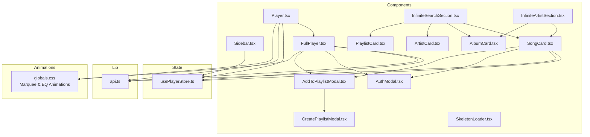
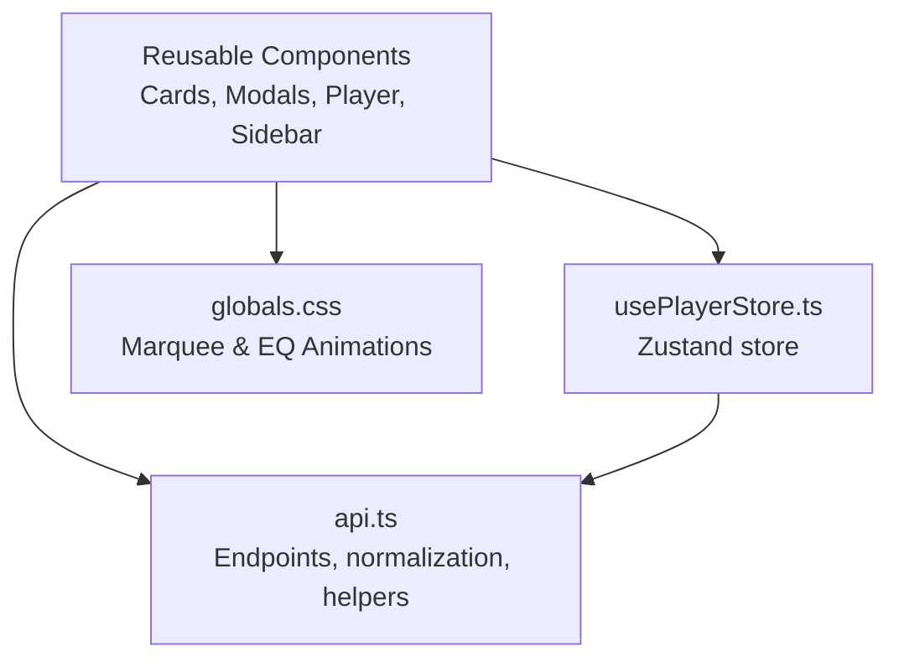
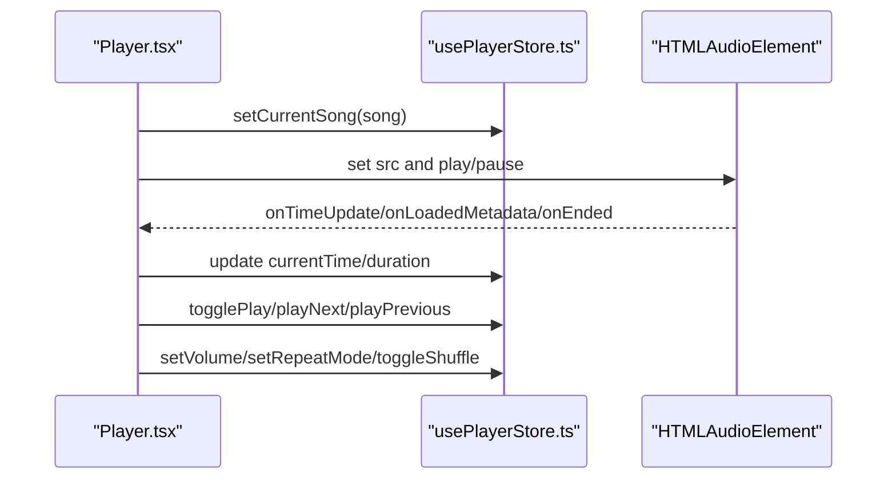
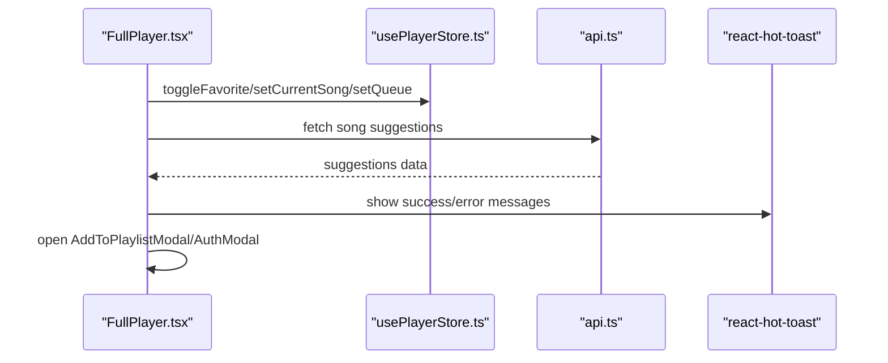
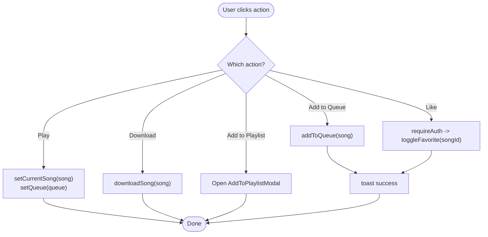
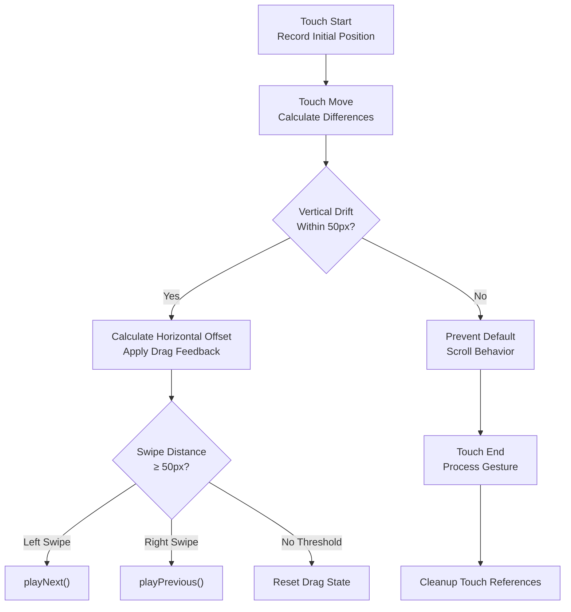
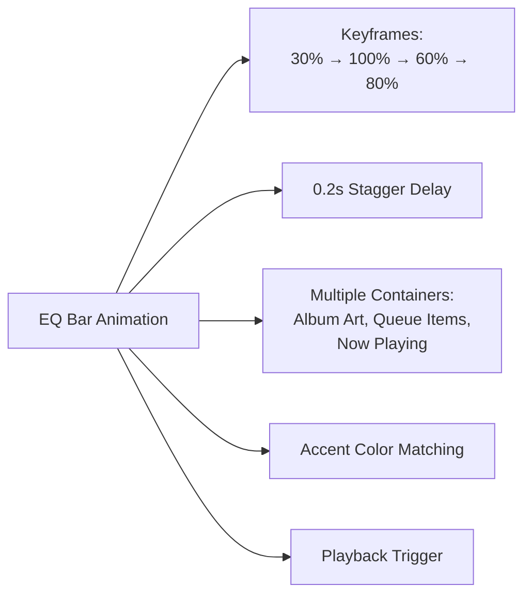
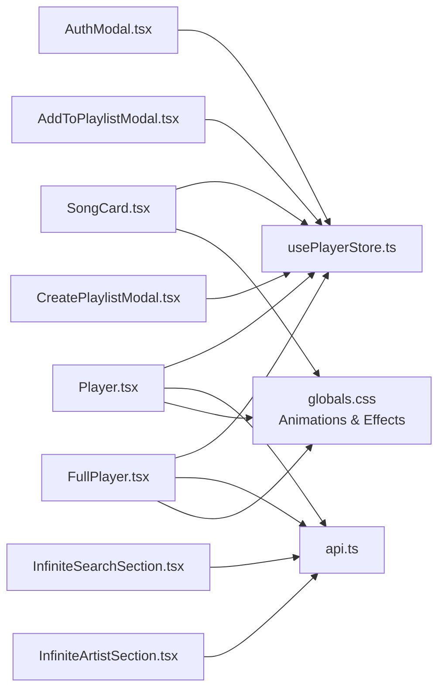

# Component Library

<cite>
**Referenced Files in This Document**
- [AddToPlaylistModal.tsx](file://components/AddToPlaylistModal.tsx)
- [AlbumCard.tsx](file://components/AlbumCard.tsx)
- [ArtistCard.tsx](file://components/ArtistCard.tsx)
- [AuthModal.tsx](file://components/AuthModal.tsx)
- [CreatePlaylistModal.tsx](file://components/CreatePlaylistModal.tsx)
- [FullPlayer.tsx](file://components/FullPlayer.tsx)
- [InfiniteArtistSection.tsx](file://components/InfiniteArtistSection.tsx)
- [InfiniteSearchSection.tsx](file://components/InfiniteSearchSection.tsx)
- [Player.tsx](file://components/Player.tsx)
- [PlaylistCard.tsx](file://components/PlaylistCard.tsx)
- [Sidebar.tsx](file://components/Sidebar.tsx)
- [SkeletonLoader.tsx](file://components/SkeletonLoader.tsx)
- [SongCard.tsx](file://components/SongCard.tsx)
- [usePlayerStore.ts](file://store/usePlayerStore.ts)
- [api.ts](file://lib/api.ts)
- [globals.css](file://app/globals.css)
</cite>

## Update Summary
**Changes Made**
- Enhanced FullPlayer component with comprehensive gesture control system
- Improved Player component with better mobile responsiveness and visual feedback
- Added marquee animations for long text content
- Implemented EQ bar visual feedback system for playback indication
- Enhanced touch interaction handling with swipe gestures and drag feedback

## Table of Contents
1. [Introduction](#introduction)
2. [Project Structure](#project-structure)
3. [Core Components](#core-components)
4. [Architecture Overview](#architecture-overview)
5. [Detailed Component Analysis](#detailed-component-analysis)
6. [Enhanced Gesture Control System](#enhanced-gesture-control-system)
7. [Visual Feedback Systems](#visual-feedback-systems)
8. [Dependency Analysis](#dependency-analysis)
9. [Performance Considerations](#performance-considerations)
10. [Troubleshooting Guide](#troubleshooting-guide)
11. [Conclusion](#conclusion)
12. [Appendices](#appendices)

## Introduction
This document describes SonicStream's reusable UI component library. It covers each component's visual appearance, behavior, user interaction patterns, props/attributes, events, customization, styling, and integration with the player store and global state. The library now features enhanced gesture controls, improved mobile responsiveness, and sophisticated visual feedback systems including marquee animations and EQ bar indicators.

## Project Structure
The component library resides under the components directory and integrates with:
- Global state via a Zustand store
- Shared utilities for API endpoints, normalization, and image handling
- Theming and layout via shared UI elements
- Advanced CSS animations and visual feedback systems

**Diagram sources**
- [Sidebar.tsx](file://components/Sidebar.tsx)
- [Player.tsx](file://components/Player.tsx)
- [FullPlayer.tsx](file://components/FullPlayer.tsx)
- [SongCard.tsx](file://components/SongCard.tsx)
- [AlbumCard.tsx](file://components/AlbumCard.tsx)
- [ArtistCard.tsx](file://components/ArtistCard.tsx)
- [PlaylistCard.tsx](file://components/PlaylistCard.tsx)
- [InfiniteSearchSection.tsx](file://components/InfiniteSearchSection.tsx)
- [InfiniteArtistSection.tsx](file://components/InfiniteArtistSection.tsx)
- [AuthModal.tsx](file://components/AuthModal.tsx)
- [AddToPlaylistModal.tsx](file://components/AddToPlaylistModal.tsx)
- [CreatePlaylistModal.tsx](file://components/CreatePlaylistModal.tsx)
- [SkeletonLoader.tsx](file://components/SkeletonLoader.tsx)
- [usePlayerStore.ts](file://store/usePlayerStore.ts)
- [api.ts](file://lib/api.ts)
- [globals.css](file://app/globals.css)

**Section sources**
- [Sidebar.tsx](file://components/Sidebar.tsx)
- [Player.tsx](file://components/Player.tsx)
- [usePlayerStore.ts](file://store/usePlayerStore.ts)
- [api.ts](file://lib/api.ts)
- [globals.css](file://app/globals.css)

## Core Components
This section summarizes each component's purpose, props, behavior, and integration points with enhanced gesture controls and visual feedback systems.

- **Sidebar**
  - Purpose: Navigation dock for desktop and mobile with theme toggle.
  - Props: None (uses routing and theme context internally).
  - Behavior: Highlights active route; toggles theme via ThemeProvider.
  - Accessibility: Uses semantic links and aria labels.

- **Player**
  - Purpose: Minimal player bar with controls, progress, and queue panel.
  - Props: None (manages internal state and binds to usePlayerStore).
  - Behavior: Audio playback, keyboard shortcuts, queue management, and full player expansion with enhanced mobile responsiveness.
  - Integration: Uses audio element, store actions, FullPlayer, and visual feedback systems.

- **FullPlayer**
  - Purpose: Full-screen player with album art, controls, seek/volume, and related suggestions.
  - Props: isOpen, onClose, currentTime, duration, onSeek, volume, onVolumeChange, isMuted, onToggleMute.
  - Behavior: Spring animations, marquee-like title, download, like, add to playlist, queue population, and comprehensive gesture controls.
  - **Enhanced**: Includes advanced touch gesture handling for album cover swiping and pull-to-close functionality.

- **SongCard**
  - Purpose: Grid/list card for songs with hover actions and playback indicators.
  - Props: song (Song), queue (optional).
  - Behavior: Play, add to queue, download, like, add to playlist; integrates with AuthModal and AddToPlaylistModal; features EQ bar feedback.

- **AlbumCard**
  - Purpose: Grid card for albums with hover play button.
  - Props: album (any).
  - Behavior: Hover effects and navigation to album page.

- **ArtistCard**
  - Purpose: Circular avatar card for artists with fallback and hover effects.
  - Props: artist (any).
  - Behavior: Image fallback handling and navigation to artist page.

- **PlaylistCard**
  - Purpose: Grid card for playlists with song count.
  - Props: playlist (any).
  - Behavior: Navigation to playlist page.

- **InfiniteSearchSection**
  - Purpose: Paginated, infinite-loading grid for search results (songs, albums, artists, playlists).
  - Props: type ('songs' | 'albums' | 'artists' | 'playlists'), query, title, apiEndpoint.
  - Behavior: Infinite scrolling, skeleton loaders, and load-more button.

- **InfiniteArtistSection**
  - Purpose: Paginated, infinite-loading grid for artist content (songs, albums).
  - Props: type ('songs' | 'albums'), artistId, title, apiEndpoint, initialData (optional).
  - Behavior: Handles inconsistent API shapes, deduplication, and load-more.

- **AuthModal**
  - Purpose: Unified sign-in/sign-up modal with password reset flow.
  - Props: isOpen, onClose.
  - Behavior: Form validation, submission, error handling, and user state update.

- **AddToPlaylistModal**
  - Purpose: Choose existing playlists to add a song to.
  - Props: isOpen, onClose, songId.
  - Behavior: Fetch playlists, add to selected playlist, toast feedback, invalidate queries.

- **CreatePlaylistModal**
  - Purpose: Create a new playlist.
  - Props: isOpen, onClose, onSuccess (optional).
  - Behavior: Validation, creation, toast feedback, query invalidation.

- **SkeletonLoader**
  - Purpose: Lightweight skeleton placeholders for grids/lists.
  - Props: count (default 1), className (optional).
  - Behavior: Renders multiple skeletons or a single skeleton.

**Section sources**
- [Sidebar.tsx](file://components/Sidebar.tsx)
- [Player.tsx](file://components/Player.tsx)
- [FullPlayer.tsx](file://components/FullPlayer.tsx)
- [SongCard.tsx](file://components/SongCard.tsx)
- [AlbumCard.tsx](file://components/AlbumCard.tsx)
- [ArtistCard.tsx](file://components/ArtistCard.tsx)
- [PlaylistCard.tsx](file://components/PlaylistCard.tsx)
- [InfiniteSearchSection.tsx](file://components/InfiniteSearchSection.tsx)
- [InfiniteArtistSection.tsx](file://components/InfiniteArtistSection.tsx)
- [AuthModal.tsx](file://components/AuthModal.tsx)
- [AddToPlaylistModal.tsx](file://components/AddToPlaylistModal.tsx)
- [CreatePlaylistModal.tsx](file://components/CreatePlaylistModal.tsx)
- [SkeletonLoader.tsx](file://components/SkeletonLoader.tsx)

## Architecture Overview
The component library is built around:
- A central Zustand store for player state and user data
- Utility modules for API endpoints, normalization, and image handling
- Reusable UI components with consistent theming via CSS variables
- Motion-based animations for modals and transitions
- TanStack Query for caching and pagination
- **Enhanced**: Advanced CSS animations including marquee effects and EQ bar visual feedback

**Diagram sources**
- [usePlayerStore.ts](file://store/usePlayerStore.ts)
- [api.ts](file://lib/api.ts)
- [Player.tsx](file://components/Player.tsx)
- [FullPlayer.tsx](file://components/FullPlayer.tsx)
- [SongCard.tsx](file://components/SongCard.tsx)
- [AuthModal.tsx](file://components/AuthModal.tsx)
- [AddToPlaylistModal.tsx](file://components/AddToPlaylistModal.tsx)
- [CreatePlaylistModal.tsx](file://components/CreatePlaylistModal.tsx)
- [globals.css](file://app/globals.css)

## Detailed Component Analysis

### Sidebar
- Visual appearance: Floating dock with logo, pill-style nav, and theme toggle.
- Interaction: Active route highlighting; theme toggle via ThemeProvider.
- Props: None.
- Accessibility: Uses semantic navigation and aria labels.

**Section sources**
- [Sidebar.tsx](file://components/Sidebar.tsx)

### Player
- Visual appearance: Fixed bottom bar with album art, progress, controls, and queue panel.
- Interaction: Click album art to open FullPlayer; toggle shuffle/repeat; adjust volume; open queue panel; keyboard shortcuts.
- Props: None (binds to store).
- Events: onSeek, onVolumeChange, onToggleMute (via FullPlayer).
- State management: Reads/writes to usePlayerStore; manages audioRef and playback lifecycle.
- Accessibility: Proper labeling for buttons; focusable controls.
- **Enhanced**: Improved mobile responsiveness with dedicated mobile controls and better touch interactions.

**Diagram sources**
- [Player.tsx](file://components/Player.tsx)
- [usePlayerStore.ts](file://store/usePlayerStore.ts)

**Section sources**
- [Player.tsx](file://components/Player.tsx)
- [usePlayerStore.ts](file://store/usePlayerStore.ts)

### FullPlayer
- Visual appearance: Full-screen player with blurred background, album art, marquee title, and related suggestions.
- Interaction: Seek, volume, mute, like, download, add to playlist, repeat mode cycling, shuffle toggle, **enhanced gesture controls**.
- Props: isOpen, onClose, currentTime, duration, onSeek, volume, onVolumeChange, isMuted, onToggleMute.
- Composition: Embeds AddToPlaylistModal and AuthModal; integrates with player store and API.
- **Enhanced**: Comprehensive gesture control system including album cover swipe gestures, pull-to-close functionality, and visual feedback.

**Diagram sources**
- [FullPlayer.tsx](file://components/FullPlayer.tsx)
- [usePlayerStore.ts](file://store/usePlayerStore.ts)
- [api.ts](file://lib/api.ts)

**Section sources**
- [FullPlayer.tsx](file://components/FullPlayer.tsx)
- [api.ts](file://lib/api.ts)

### SongCard
- Visual appearance: Square card with overlay actions and optional EQ bars when playing.
- Interaction: Play (sets current song and queue), add to queue, download, like, add to playlist.
- Props: song (Song), queue (optional).
- Composition: Opens AddToPlaylistModal and AuthModal conditionally.
- **Enhanced**: Features EQ bar visual feedback system indicating active playback.

**Diagram sources**
- [SongCard.tsx](file://components/SongCard.tsx)
- [usePlayerStore.ts](file://store/usePlayerStore.ts)

**Section sources**
- [SongCard.tsx](file://components/SongCard.tsx)
- [usePlayerStore.ts](file://store/usePlayerStore.ts)

### AlbumCard
- Visual appearance: Square card with hover play button and metadata.
- Interaction: Navigates to album page on click.
- Props: album (any).

**Section sources**
- [AlbumCard.tsx](file://components/AlbumCard.tsx)

### ArtistCard
- Visual appearance: Circular avatar card with fallback icon and hover effects.
- Interaction: Navigates to artist page on click; handles image fallback.
- Props: artist (any).

**Section sources**
- [ArtistCard.tsx](file://components/ArtistCard.tsx)

### PlaylistCard
- Visual appearance: Square card with metadata and optional song count.
- Interaction: Navigates to playlist page on click.
- Props: playlist (any).

**Section sources**
- [PlaylistCard.tsx](file://components/PlaylistCard.tsx)

### InfiniteSearchSection
- Visual appearance: Responsive grid with skeleton loaders during loading.
- Interaction: Infinite scroll, load-more button, and paginated results.
- Props: type, query, title, apiEndpoint.
- Data handling: Uses TanStack Query, normalizes song results, and renders appropriate cards.

**Section sources**
- [InfiniteSearchSection.tsx](file://components/InfiniteSearchSection.tsx)
- [api.ts](file://lib/api.ts)

### InfiniteArtistSection
- Visual appearance: Similar to InfiniteSearchSection but tailored for artist content.
- Interaction: Handles inconsistent API shapes, deduplicates results, and infinite scroll.
- Props: type, artistId, title, apiEndpoint, initialData.
- Data handling: Extracts results from various response shapes and normalizes songs.

**Section sources**
- [InfiniteArtistSection.tsx](file://components/InfiniteArtistSection.tsx)
- [api.ts](file://lib/api.ts)

### AuthModal
- Visual appearance: Centered modal with sign-in/sign-up forms and password reset flow.
- Interaction: Toggle between sign-in/sign-up, submit form, show errors, and close on success.
- Props: isOpen, onClose.
- State: Manages local form state and updates user via store.

**Section sources**
- [AuthModal.tsx](file://components/AuthModal.tsx)
- [usePlayerStore.ts](file://store/usePlayerStore.ts)

### AddToPlaylistModal
- Visual appearance: Bottom sheet on mobile, centered modal on desktop; lists playlists with cover art.
- Interaction: Fetch playlists, add to selected playlist, show toasts, and invalidate queries.
- Props: isOpen, onClose, songId.
- State: Tracks added playlists and in-progress additions.

**Section sources**
- [AddToPlaylistModal.tsx](file://components/AddToPlaylistModal.tsx)

### CreatePlaylistModal
- Visual appearance: Modal with form fields for name and description.
- Interaction: Validates input, creates playlist, shows toasts, invalidates queries, and optionally invokes onSuccess.
- Props: isOpen, onClose, onSuccess (optional).

**Section sources**
- [CreatePlaylistModal.tsx](file://components/CreatePlaylistModal.tsx)

### SkeletonLoader
- Visual appearance: Animated skeleton blocks mimicking cards.
- Interaction: Renders a single skeleton or multiple skeletons depending on props.
- Props: count (default 1), className (optional).

**Section sources**
- [SkeletonLoader.tsx](file://components/SkeletonLoader.tsx)

## Enhanced Gesture Control System

### FullPlayer Gesture Controls
The FullPlayer component now features a comprehensive gesture control system designed for optimal mobile experience:

#### Album Cover Swipe Gestures
- **Left Swipe**: Skips to next song
- **Right Swipe**: Plays previous song
- **Visual Feedback**: Album art responds with drag offset and smooth animation
- **Threshold Detection**: Minimum 50px horizontal swipe distance required
- **Vertical Drift Prevention**: Allows up to 50px vertical movement while maintaining horizontal swipe detection

#### Pull-to-Close Functionality
- **Top-of-Scroll Detection**: Only activates when scrolled to top of content
- **Pull Threshold**: Requires 80px downward pull distance
- **Prevent Default Scrolling**: Stops browser pull-to-refresh during gesture
- **Smooth Animation**: Spring-based closing animation

#### Touch Event Handling
- **Touch Start Tracking**: Records initial touch coordinates
- **Touch Move Monitoring**: Calculates horizontal and vertical movement differences
- **Touch End Processing**: Determines gesture completion and triggers appropriate actions
- **Drag State Management**: Maintains isDragging state for proper cleanup

**Diagram sources**
- [FullPlayer.tsx](file://components/FullPlayer.tsx)

**Section sources**
- [FullPlayer.tsx](file://components/FullPlayer.tsx)

## Visual Feedback Systems

### Marquee Animation System
Long text content automatically receives marquee animation treatment:

#### Automatic Detection
- **Album Name Marquee**: Activates for album names > 24 characters
- **Song Name Marquee**: Activates for song names > 22 characters  
- **Artist Name Marquee**: Activates for combined artist names > 35 characters

#### Animation Implementation
- **CSS Keyframes**: Smooth 10-second linear animation
- **Hover Pause**: Animation pauses on hover for readability
- **Edge Masking**: Subtle fade masks on text edges for clean overflow
- **Independent Scrolling**: Each text element scrolls independently

#### Visual Design
- **Animation Duration**: 10 seconds for comfortable reading speed
- **Transition Timing**: Linear easing for consistent velocity
- **Responsive Behavior**: Adjusts spacing based on screen size (12-24px gaps)

### EQ Bar Visual Feedback
Sophisticated audio visualization system:

#### Animation Definition
- **Keyframe Sequence**: Dynamic height variations (30% → 100% → 60% → 80%)
- **Timing Pattern**: 0.8s cycle with staggered delays
- **Visual Effect**: Realistic audio wave simulation

#### Implementation Details
- **Dual Bar Setup**: Two bars with 0.2s animation delay for stereo effect
- **Playback Trigger**: Activates only when song is currently playing
- **Color Integration**: Matches accent color scheme
- **Container Effects**: Appears as overlay on album art and queue items

#### Usage Context
- **Now Playing Indicator**: Shows in queue panel and current song display
- **Album Art Overlay**: Appears on hover of album artwork
- **Queue Items**: Visual feedback for upcoming songs

**Diagram sources**
- [globals.css](file://app/globals.css)
- [Player.tsx](file://components/Player.tsx)
- [FullPlayer.tsx](file://components/FullPlayer.tsx)

**Section sources**
- [globals.css](file://app/globals.css)
- [Player.tsx](file://components/Player.tsx)
- [FullPlayer.tsx](file://components/FullPlayer.tsx)

## Dependency Analysis
- Component-to-store coupling: Player, FullPlayer, SongCard, AuthModal, AddToPlaylistModal, CreatePlaylistModal depend on usePlayerStore for state and actions.
- Component-to-API coupling: Player, FullPlayer, InfiniteSearchSection, InfiniteArtistSection depend on api.ts for endpoints and normalization.
- Component-to-library coupling: Cards and modals rely on shared utilities for image URLs and durations.
- **Enhanced**: Animation and transition dependencies through globals.css for marquee and EQ bar effects.
- **Enhanced**: Gesture control dependencies through touch event handling and motion components.

**Diagram sources**
- [usePlayerStore.ts](file://store/usePlayerStore.ts)
- [api.ts](file://lib/api.ts)
- [Player.tsx](file://components/Player.tsx)
- [FullPlayer.tsx](file://components/FullPlayer.tsx)
- [SongCard.tsx](file://components/SongCard.tsx)
- [AuthModal.tsx](file://components/AuthModal.tsx)
- [AddToPlaylistModal.tsx](file://components/AddToPlaylistModal.tsx)
- [CreatePlaylistModal.tsx](file://components/CreatePlaylistModal.tsx)
- [InfiniteSearchSection.tsx](file://components/InfiniteSearchSection.tsx)
- [InfiniteArtistSection.tsx](file://components/InfiniteArtistSection.tsx)
- [globals.css](file://app/globals.css)

**Section sources**
- [usePlayerStore.ts](file://store/usePlayerStore.ts)
- [api.ts](file://lib/api.ts)
- [Player.tsx](file://components/Player.tsx)
- [FullPlayer.tsx](file://components/FullPlayer.tsx)
- [SongCard.tsx](file://components/SongCard.tsx)
- [AuthModal.tsx](file://components/AuthModal.tsx)
- [AddToPlaylistModal.tsx](file://components/AddToPlaylistModal.tsx)
- [CreatePlaylistModal.tsx](file://components/CreatePlaylistModal.tsx)
- [InfiniteSearchSection.tsx](file://components/InfiniteSearchSection.tsx)
- [InfiniteArtistSection.tsx](file://components/InfiniteArtistSection.tsx)
- [globals.css](file://app/globals.css)

## Performance Considerations
- Memoization and deduplication: InfiniteArtistSection deduplicates items and extracts results robustly to avoid re-renders.
- Lazy loading and skeleton placeholders: SkeletonLoader reduces perceived loading time and improves perceived performance.
- Efficient store updates: usePlayerStore updates only necessary slices of state.
- Image optimization: getHighQualityImage selects appropriate image sizes and provides fallbacks.
- **Enhanced**: Gesture controls optimized with proper touch event handling and cleanup to prevent memory leaks.
- **Enhanced**: Animation performance optimized with CSS keyframes and efficient transform properties.
- **Enhanced**: EQ bar animations use hardware-accelerated CSS properties for smooth 60fps performance.
- Pagination: Infinite queries prevent loading large datasets at once.

## Troubleshooting Guide
- Authentication failures: AuthModal displays server-side errors; ensure proper network connectivity and backend routes.
- Playlist operations: AddToPlaylistModal and CreatePlaylistModal rely on user presence; verify user state and query invalidation.
- Infinite scroll issues: Ensure apiEndpoint returns consistent pagination shape; check NEXT_PAGE_PARAM logic.
- Player playback: Verify audioRef updates when currentSong changes; handle play/pause and volume state synchronization.
- Toast errors: Errors are surfaced via react-hot-toast; confirm toast provider is mounted globally.
- **Enhanced**: Gesture control issues: Verify touch event listeners are properly attached and cleaned up; check touch threshold values.
- **Enhanced**: Animation performance: Monitor CSS animation performance; consider reducing animation complexity on lower-end devices.
- **Enhanced**: Marquee text overflow: Ensure mask-edges class is properly applied to containers with long text content.

**Section sources**
- [AuthModal.tsx](file://components/AuthModal.tsx)
- [AddToPlaylistModal.tsx](file://components/AddToPlaylistModal.tsx)
- [CreatePlaylistModal.tsx](file://components/CreatePlaylistModal.tsx)
- [InfiniteSearchSection.tsx](file://components/InfiniteSearchSection.tsx)
- [InfiniteArtistSection.tsx](file://components/InfiniteArtistSection.tsx)
- [Player.tsx](file://components/Player.tsx)
- [FullPlayer.tsx](file://components/FullPlayer.tsx)
- [globals.css](file://app/globals.css)

## Conclusion
SonicStream's component library emphasizes composability, consistent theming, and reactive state management with enhanced gesture controls and sophisticated visual feedback systems. The recent improvements include comprehensive touch gesture handling, marquee animations for long text content, and EQ bar visual feedback for audio playback indication. Components integrate seamlessly with the player store and TanStack Query, enabling scalable and maintainable UI patterns with superior mobile responsiveness and user experience.

## Appendices

### Prop Specifications and Attributes

- **Sidebar**
  - Props: None
  - Behavior: Uses routing and theme context internally

- **Player**
  - Props: None
  - Internal state: audioRef, currentTime, duration, isMuted, isFullPlayerOpen, isQueueOpen
  - Events: onSeek, onVolumeChange, onToggleMute (via FullPlayer)
  - **Enhanced**: Improved mobile controls and better touch interactions

- **FullPlayer**
  - Props: isOpen, onClose, currentTime, duration, onSeek, volume, onVolumeChange, isMuted, onToggleMute
  - Behavior: Integrates with player store and API
  - **Enhanced**: Comprehensive gesture control system with album cover swipes and pull-to-close

- **SongCard**
  - Props: song (Song), queue (optional)
  - Behavior: Conditional auth gating for like/add-to-playlist
  - **Enhanced**: EQ bar visual feedback for playback indication

- **AlbumCard**
  - Props: album (any)

- **ArtistCard**
  - Props: artist (any)

- **PlaylistCard**
  - Props: playlist (any)

- **InfiniteSearchSection**
  - Props: type, query, title, apiEndpoint
  - Behavior: Infinite pagination and skeleton loaders

- **InfiniteArtistSection**
  - Props: type, artistId, title, apiEndpoint, initialData (optional)
  - Behavior: Robust extraction and deduplication

- **AuthModal**
  - Props: isOpen, onClose
  - Behavior: Form validation and user state updates

- **AddToPlaylistModal**
  - Props: isOpen, onClose, songId
  - Behavior: Fetch playlists and add to selected

- **CreatePlaylistModal**
  - Props: isOpen, onClose, onSuccess (optional)
  - Behavior: Create playlist and invalidate queries

- **SkeletonLoader**
  - Props: count (default 1), className (optional)

**Section sources**
- [Sidebar.tsx](file://components/Sidebar.tsx)
- [Player.tsx](file://components/Player.tsx)
- [FullPlayer.tsx](file://components/FullPlayer.tsx)
- [SongCard.tsx](file://components/SongCard.tsx)
- [AlbumCard.tsx](file://components/AlbumCard.tsx)
- [ArtistCard.tsx](file://components/ArtistCard.tsx)
- [PlaylistCard.tsx](file://components/PlaylistCard.tsx)
- [InfiniteSearchSection.tsx](file://components/InfiniteSearchSection.tsx)
- [InfiniteArtistSection.tsx](file://components/InfiniteArtistSection.tsx)
- [AuthModal.tsx](file://components/AuthModal.tsx)
- [AddToPlaylistModal.tsx](file://components/AddToPlaylistModal.tsx)
- [CreatePlaylistModal.tsx](file://components/CreatePlaylistModal.tsx)
- [SkeletonLoader.tsx](file://components/SkeletonLoader.tsx)

### Styling and Theming Guidelines
- CSS variables: Components rely on CSS variables for colors, backgrounds, borders, and shadows. Ensure the root styles define these variables consistently.
- Glassmorphism: glass-card and backdrop-filter are used for frosted panels; verify browser support for backdrop-filter.
- **Enhanced**: Marquee animations: Use animate-marquee class for automatic text scrolling; combine with mask-edges for clean overflow.
- **Enhanced**: EQ bar animations: Apply eq-bar class to create dynamic audio visualization; use dual bars for stereo effect.
- **Enhanced**: Gesture feedback: Album cover swipe effects use transform properties for smooth animations; ensure proper touch-action settings.
- Animations: Motion components provide spring-based transitions; test on lower-powered devices.
- Responsive breakpoints: Use grid and flex utilities; ensure touch targets meet accessibility thresholds.

### Accessibility Compliance
- Focus management: Buttons and inputs are focusable; ensure visible focus styles.
- Semantic markup: Use of Link, button, and input elements; provide aria labels where appropriate.
- Keyboard navigation: Player supports space, arrow keys, and m for playback and volume.
- Screen reader: Use concise labels and titles for interactive elements.
- **Enhanced**: Gesture accessibility: Ensure alternative control methods for users unable to use touch gestures; maintain keyboard navigation for all interactive elements.

### Cross-Browser Compatibility
- Modern APIs: Audio element and modern CSS features are used; test on supported browsers.
- Polyfills: Consider polyfills for older environments if needed.
- Motion: Ensure motion/react compatibility across target browsers.
- **Enhanced**: Animation support: Verify CSS keyframe animations work across different browser engines; provide fallbacks for older browsers.
- **Enhanced**: Touch events: Test gesture controls across different mobile devices and browsers; ensure proper touch event handling.

### Enhanced Feature Reference

#### Gesture Control Parameters
- **Album Cover Swipe**: minCoverSwipeDistance = 50px, maxVerticalDrift = 50px
- **Pull-to-Close**: minSwipeDistance = 80px, requires scrollTop ≤ 5px
- **Drag Feedback**: coverOffset limited to ±80px for visual comfort

#### Animation Specifications
- **Marquee**: 10s linear animation, hover pause, edge masking
- **EQ Bar**: 0.8s cycle with 0.2s stagger delay, dynamic height variations
- **Spring Transitions**: damping = 25, stiffness = 200 for smooth modal animations

**Section sources**
- [FullPlayer.tsx](file://components/FullPlayer.tsx)
- [Player.tsx](file://components/Player.tsx)
- [globals.css](file://app/globals.css)