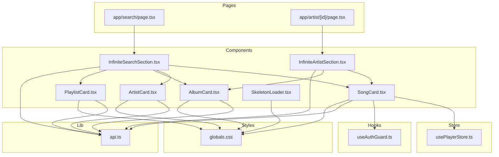
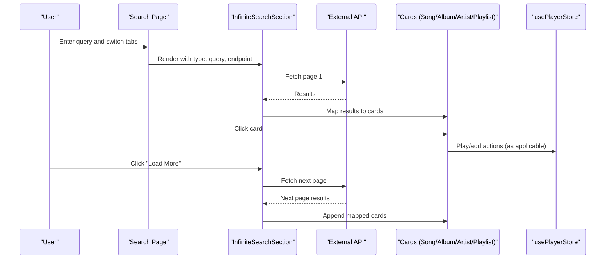
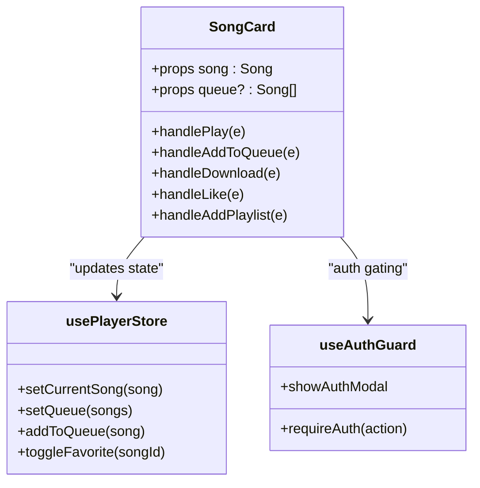
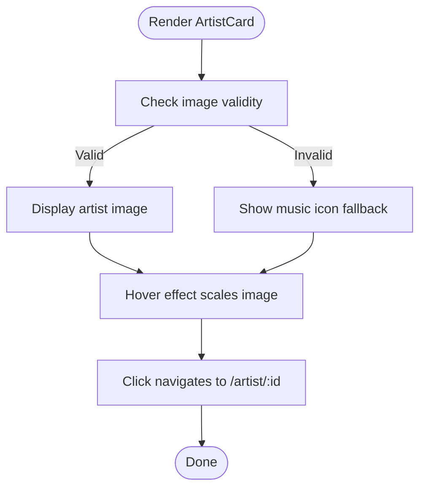
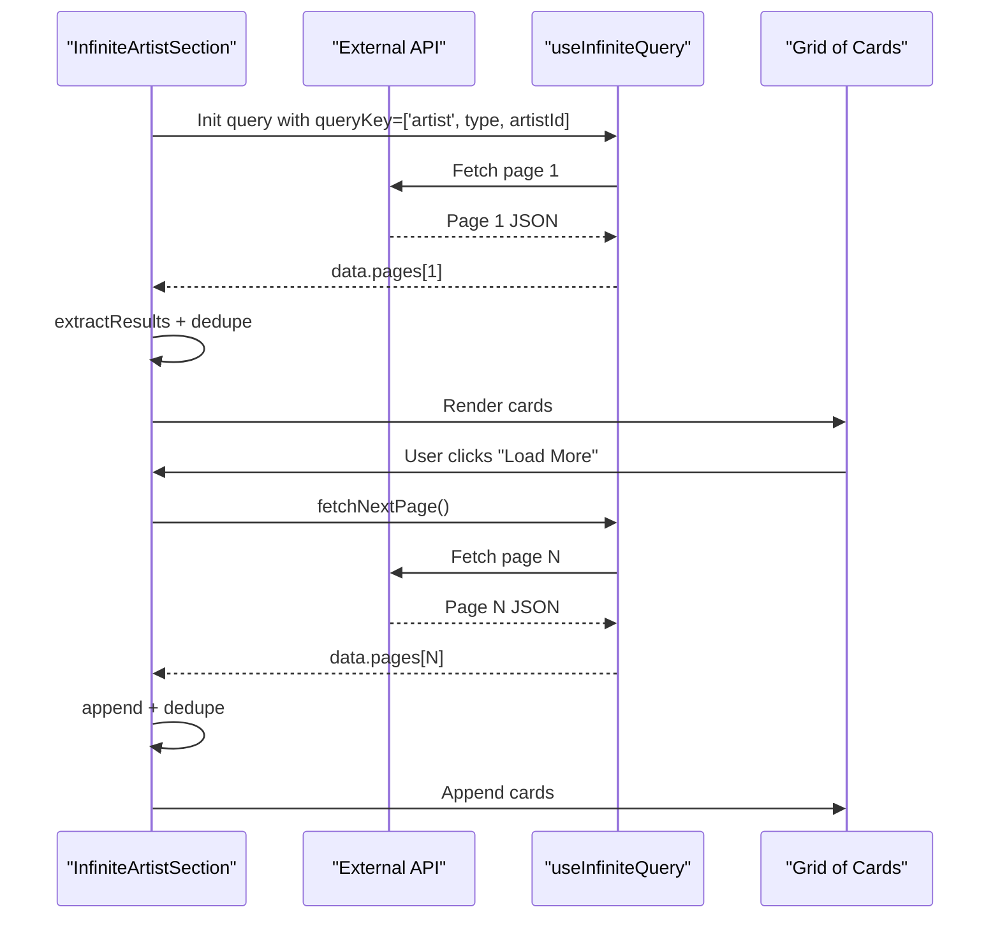
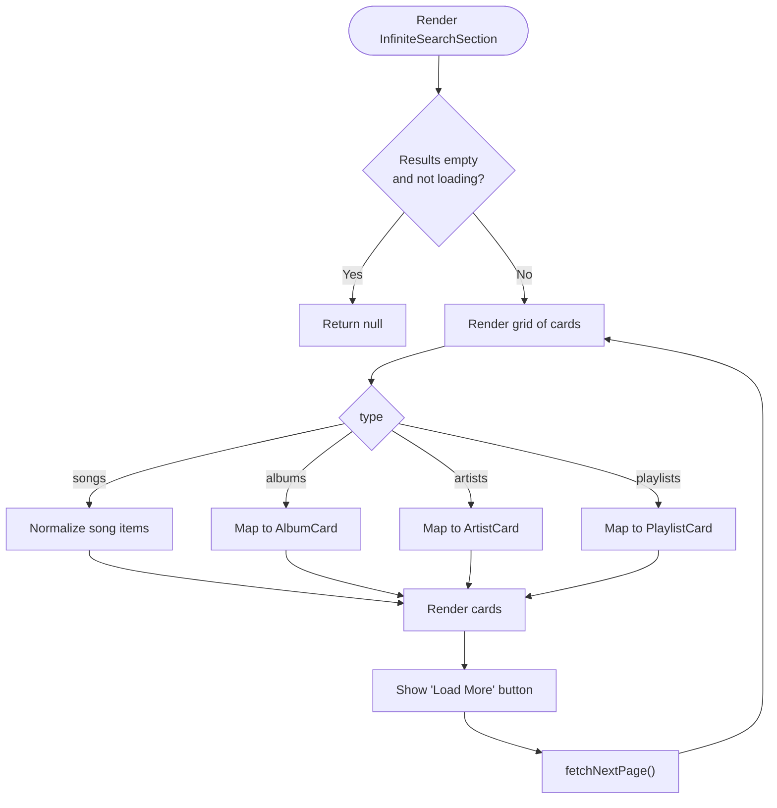
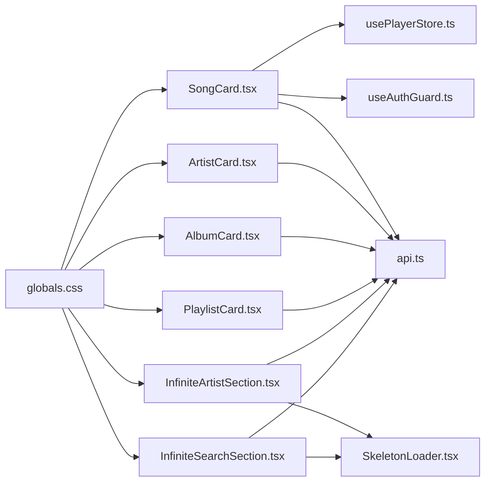

# Content Display Components

<cite>
**Referenced Files in This Document**
- [SongCard.tsx](file://components/SongCard.tsx)
- [ArtistCard.tsx](file://components/ArtistCard.tsx)
- [AlbumCard.tsx](file://components/AlbumCard.tsx)
- [PlaylistCard.tsx](file://components/PlaylistCard.tsx)
- [InfiniteArtistSection.tsx](file://components/InfiniteArtistSection.tsx)
- [InfiniteSearchSection.tsx](file://components/InfiniteSearchSection.tsx)
- [SkeletonLoader.tsx](file://components/SkeletonLoader.tsx)
- [api.ts](file://lib/api.ts)
- [usePlayerStore.ts](file://store/usePlayerStore.ts)
- [useAuthGuard.ts](file://hooks/useAuthGuard.ts)
- [globals.css](file://app/globals.css)
- [layout.tsx](file://app/layout.tsx)
- [page.tsx](file://app/search/page.tsx)
- [page.tsx](file://app/artist/[id]/page.tsx)
</cite>

## Table of Contents
1. [Introduction](#introduction)
2. [Project Structure](#project-structure)
3. [Core Components](#core-components)
4. [Architecture Overview](#architecture-overview)
5. [Detailed Component Analysis](#detailed-component-analysis)
6. [Dependency Analysis](#dependency-analysis)
7. [Performance Considerations](#performance-considerations)
8. [Accessibility and Keyboard Navigation](#accessibility-and-keyboard-navigation)
9. [Troubleshooting Guide](#troubleshooting-guide)
10. [Conclusion](#conclusion)

## Introduction
This document describes SonicStream’s content display components that power the music discovery and playback experience. It covers SongCard, ArtistCard, AlbumCard, and PlaylistCard for consistent visual presentation and interaction patterns. It also documents InfiniteArtistSection and InfiniteSearchSection for paginated, lazy-loaded content rendering. The guide includes props, click handlers, navigation integration, responsive design, loading states, search integration, infinite scrolling mechanics, performance optimizations, and accessibility considerations.

## Project Structure
The content display components live under the components directory and integrate with shared utilities, stores, and pages:
- Components: SongCard, ArtistCard, AlbumCard, PlaylistCard, InfiniteArtistSection, InfiniteSearchSection, SkeletonLoader
- Utilities: api.ts (data normalization, image helpers, endpoints)
- State: usePlayerStore.ts (global player state and actions)
- Hooks: useAuthGuard.ts (auth gating)
- Styles: globals.css (theme tokens, animations, glass card styles)
- Pages: search page and artist page demonstrate integration

**Diagram sources**
- [SongCard.tsx](file://components/SongCard.tsx)
- [ArtistCard.tsx](file://components/ArtistCard.tsx)
- [AlbumCard.tsx](file://components/AlbumCard.tsx)
- [PlaylistCard.tsx](file://components/PlaylistCard.tsx)
- [InfiniteArtistSection.tsx](file://components/InfiniteArtistSection.tsx)
- [InfiniteSearchSection.tsx](file://components/InfiniteSearchSection.tsx)
- [SkeletonLoader.tsx](file://components/SkeletonLoader.tsx)
- [api.ts](file://lib/api.ts)
- [usePlayerStore.ts](file://store/usePlayerStore.ts)
- [useAuthGuard.ts](file://hooks/useAuthGuard.ts)
- [globals.css](file://app/globals.css)
- [page.tsx](file://app/search/page.tsx)
- [page.tsx](file://app/artist/[id]/page.tsx)

**Section sources**
- [layout.tsx](file://app/layout.tsx)
- [globals.css](file://app/globals.css)

## Core Components
This section documents the four primary card components and their roles.

- SongCard
  - Purpose: Displays a song with interactive controls (play, add to queue, download, favorite, add to playlist), hover overlays, and current playing indicators.
  - Props:
    - song: Song (from api.ts)
    - queue?: Song[] (optional queue for context)
  - Interactions:
    - Clicking the card navigates to the song detail page.
    - Hover reveals overlay buttons; clicking buttons triggers actions via usePlayerStore and useAuthGuard.
  - Navigation: Uses Next.js router to navigate to /song/:id.
  - Data binding: Uses getHighQualityImage for artwork and links to artist pages.

- ArtistCard
  - Purpose: Displays an artist with a circular avatar, fallback icon, and “Artist” label.
  - Props:
    - artist: any (expects id, name/title, image)
  - Interactions:
    - Clicking navigates to /artist/:id.
    - Hover effect scales image and reveals overlay.
  - Fallback: Shows a music icon if image is missing or invalid.

- AlbumCard
  - Purpose: Displays an album with a centered play button on hover.
  - Props:
    - album: any (expects id, name/title, year/language, image)
  - Interactions:
    - Clicking navigates to /album/:id.
    - Hover reveals a translucent overlay with a large play button.

- PlaylistCard
  - Purpose: Displays a playlist with a prominent play button and song count.
  - Props:
    - playlist: any (expects id, name/title, songCount/image)
  - Interactions:
    - Clicking navigates to /playlist/:id.
    - Hover reveals a translucent overlay with a large play button.

**Section sources**
- [SongCard.tsx](file://components/SongCard.tsx)
- [ArtistCard.tsx](file://components/ArtistCard.tsx)
- [AlbumCard.tsx](file://components/AlbumCard.tsx)
- [PlaylistCard.tsx](file://components/PlaylistCard.tsx)
- [api.ts](file://lib/api.ts)

## Architecture Overview
The content display components are composed within pages that orchestrate infinite scrolling and search. The search page dynamically switches between tabs and renders InfiniteSearchSection for each category. The artist page composes InfiniteArtistSection to render albums and songs for an artist.

**Diagram sources**
- [page.tsx](file://app/search/page.tsx)
- [InfiniteSearchSection.tsx](file://components/InfiniteSearchSection.tsx)
- [api.ts](file://lib/api.ts)
- [SongCard.tsx](file://components/SongCard.tsx)
- [AlbumCard.tsx](file://components/AlbumCard.tsx)
- [ArtistCard.tsx](file://components/ArtistCard.tsx)
- [PlaylistCard.tsx](file://components/PlaylistCard.tsx)
- [usePlayerStore.ts](file://store/usePlayerStore.ts)

## Detailed Component Analysis

### SongCard Analysis
- Props
  - song: Song
  - queue?: Song[]
- Interaction pattern
  - Outer container click navigates to song detail.
  - Overlay buttons:
    - Play: sets current song and queue via usePlayerStore.
    - Add to queue: adds to queue and shows toast.
    - Download: triggers download via lib/downloadSong.
    - Favorite: gated by useAuthGuard; toggles favorite in store.
    - Add to Playlist: gated by useAuthGuard; opens modal.
- Visual layout
  - Aspect ratio square with hover-scale image.
  - Top-right overlay with floating action buttons.
  - Current playing indicator with animated bars.
  - Title and artist links; artist links navigate to /artist/:id.
- Accessibility
  - Buttons have titles for screen readers.
  - Links preserve semantic anchor behavior.

**Diagram sources**
- [SongCard.tsx](file://components/SongCard.tsx)
- [usePlayerStore.ts](file://store/usePlayerStore.ts)
- [useAuthGuard.ts](file://hooks/useAuthGuard.ts)

**Section sources**
- [SongCard.tsx](file://components/SongCard.tsx)
- [usePlayerStore.ts](file://store/usePlayerStore.ts)
- [useAuthGuard.ts](file://hooks/useAuthGuard.ts)

### ArtistCard Analysis
- Props
  - artist: any (id, name/title, image)
- Interaction pattern
  - Clicking navigates to /artist/:id.
  - Hover scales image and reveals overlay.
- Fallback behavior
  - If image is missing or invalid, shows a music icon background.
- Responsive design
  - Flex column layout with center-aligned text.
  - Rounded circular avatar for profile image.

**Diagram sources**
- [ArtistCard.tsx](file://components/ArtistCard.tsx)

**Section sources**
- [ArtistCard.tsx](file://components/ArtistCard.tsx)

### AlbumCard Analysis
- Props
  - album: any (id, name/title, year/language, image)
- Interaction pattern
  - Clicking navigates to /album/:id.
  - Hover reveals a translucent overlay with a large play button.
- Visual layout
  - Square aspect ratio with centered play button.
  - Title and descriptor text below the image.

**Section sources**
- [AlbumCard.tsx](file://components/AlbumCard.tsx)

### PlaylistCard Analysis
- Props
  - playlist: any (id, name/title, songCount/image)
- Interaction pattern
  - Clicking navigates to /playlist/:id.
  - Hover reveals a translucent overlay with a large play button.
- Visual layout
  - Square aspect ratio with title and descriptor text.
  - Descriptor shows song count when available.

**Section sources**
- [PlaylistCard.tsx](file://components/PlaylistCard.tsx)

### InfiniteArtistSection Analysis
- Purpose
  - Renders artist-specific content (songs or albums) with infinite scrolling.
- Props
  - type: 'songs' | 'albums'
  - artistId: string
  - title: string
  - apiEndpoint: (id, page?, sortBy?, sortOrder?) => string
  - initialData?: any[]
- Pagination logic
  - Uses useInfiniteQuery to fetch pages.
  - getNextPageParam determines continuation based on last page results length.
  - extractResults normalizes response shapes across endpoints.
  - Unique filtering prevents duplicates by id.
- Rendering
  - Grid layout with responsive columns.
  - Maps results to SongCard (songs) or AlbumCard (albums).
  - Shows SkeletonLoader during initial load and while fetching next page.
  - Provides a “Load More” button to trigger next page fetch.

**Diagram sources**
- [InfiniteArtistSection.tsx](file://components/InfiniteArtistSection.tsx)
- [api.ts](file://lib/api.ts)

**Section sources**
- [InfiniteArtistSection.tsx](file://components/InfiniteArtistSection.tsx)
- [api.ts](file://lib/api.ts)

### InfiniteSearchSection Analysis
- Purpose
  - Renders paginated search results across songs, albums, artists, and playlists.
- Props
  - type: 'songs' | 'albums' | 'artists' | 'playlists'
  - query: string
  - title: string
  - apiEndpoint: (query, page, limit) => string
- Pagination logic
  - Uses useInfiniteQuery with PAGE_SIZE = 10.
  - getNextPageParam stops when fewer results returned than limit.
- Rendering
  - Maps results to appropriate card type after normalizing songs.
  - Shows SkeletonLoader during initial load and while fetching next page.
  - Provides a “Load More” button to trigger next page fetch.

**Diagram sources**
- [InfiniteSearchSection.tsx](file://components/InfiniteSearchSection.tsx)
- [api.ts](file://lib/api.ts)

**Section sources**
- [InfiniteSearchSection.tsx](file://components/InfiniteSearchSection.tsx)
- [api.ts](file://lib/api.ts)

## Dependency Analysis
- Component dependencies
  - SongCard depends on usePlayerStore, useAuthGuard, and lib/api for image handling and navigation.
  - ArtistCard, AlbumCard, PlaylistCard depend on lib/api for image handling and Next.js Link for navigation.
  - InfiniteArtistSection and InfiniteSearchSection depend on @tanstack/react-query, lib/api, and SkeletonLoader.
- Shared utilities
  - api.ts provides endpoints, normalization helpers, and image selection.
  - usePlayerStore centralizes playback state and actions.
  - useAuthGuard encapsulates auth gating for protected actions.
- Styles
  - globals.css defines theme tokens, glass-card styles, skeleton animations, and animations used by cards.

**Diagram sources**
- [SongCard.tsx](file://components/SongCard.tsx)
- [ArtistCard.tsx](file://components/ArtistCard.tsx)
- [AlbumCard.tsx](file://components/AlbumCard.tsx)
- [PlaylistCard.tsx](file://components/PlaylistCard.tsx)
- [InfiniteArtistSection.tsx](file://components/InfiniteArtistSection.tsx)
- [InfiniteSearchSection.tsx](file://components/InfiniteSearchSection.tsx)
- [SkeletonLoader.tsx](file://components/SkeletonLoader.tsx)
- [api.ts](file://lib/api.ts)
- [usePlayerStore.ts](file://store/usePlayerStore.ts)
- [useAuthGuard.ts](file://hooks/useAuthGuard.ts)
- [globals.css](file://app/globals.css)

**Section sources**
- [api.ts](file://lib/api.ts)
- [usePlayerStore.ts](file://store/usePlayerStore.ts)
- [useAuthGuard.ts](file://hooks/useAuthGuard.ts)
- [globals.css](file://app/globals.css)

## Performance Considerations
- Infinite scrolling
  - useInfiniteQuery manages pagination and deduplication; extractResults and unique filtering reduce redundant renders.
  - SkeletonLoader provides perceived performance during network latency.
- Rendering optimization
  - Cards use aspect-square layout to minimize layout shifts.
  - Motion transitions are lightweight; consider disabling on low-power devices if needed.
- Data normalization
  - normalizeSong ensures consistent shapes across diverse API responses, reducing re-render churn.
- Network efficiency
  - PAGE_SIZE is fixed at 10; adjust based on device capabilities if needed.
- Storage persistence
  - usePlayerStore persists user preferences and favorites to local storage.

[No sources needed since this section provides general guidance]

## Accessibility and Keyboard Navigation
- Focus and keyboard
  - Cards are rendered as divs with clickable areas; ensure focus styles are visible via theme tokens.
  - Buttons have titles for screen readers; consider adding aria-labels for icon-only buttons.
- Screen reader compatibility
  - Titles and labels are present; ensure semantic HTML anchors for navigation.
- Color contrast and themes
  - Theme tokens define accessible foreground/background pairs; verify contrast ratios in both light/dark modes.
- ARIA attributes
  - Add aria-selected for active tabs and aria-live regions for dynamic content updates if needed.

[No sources needed since this section provides general guidance]

## Troubleshooting Guide
- Cards not rendering
  - Verify props: artist/album/playlist/song objects contain required fields (id, name/title, image).
  - Check extractResults logic if InfiniteArtistSection shows no items despite network success.
- Infinite scroll not loading more
  - Confirm apiEndpoint returns arrays and that last page length equals PAGE_SIZE to continue pagination.
  - Ensure queryKey uniqueness per search term/tab to avoid cache collisions.
- Hover effects not working
  - Ensure group and hover utilities are applied and CSS animations are not disabled.
- Auth-gated actions failing silently
  - useAuthGuard requires a logged-in user; open modal and retry action after login.
- Image fallbacks
  - getHighQualityImage returns a fallback SVG when input is missing; confirm image URLs are valid.

**Section sources**
- [InfiniteArtistSection.tsx](file://components/InfiniteArtistSection.tsx)
- [InfiniteSearchSection.tsx](file://components/InfiniteSearchSection.tsx)
- [api.ts](file://lib/api.ts)
- [useAuthGuard.ts](file://hooks/useAuthGuard.ts)

## Conclusion
SonicStream’s content display components provide a cohesive, responsive, and accessible experience for browsing and interacting with music content. SongCard, ArtistCard, AlbumCard, and PlaylistCard share consistent visual patterns and interaction models, while InfiniteArtistSection and InfiniteSearchSection enable efficient, scalable pagination. With robust data normalization, theme-driven styling, and integrated player state, these components form the backbone of the application’s discovery and playback flows.