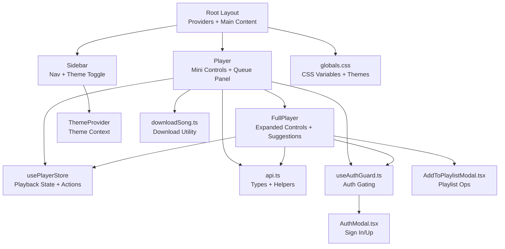
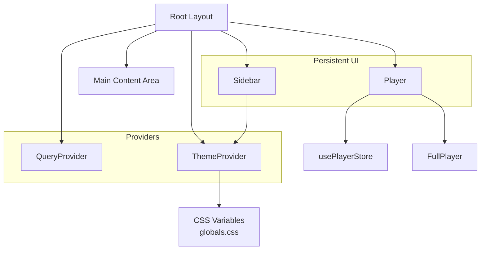
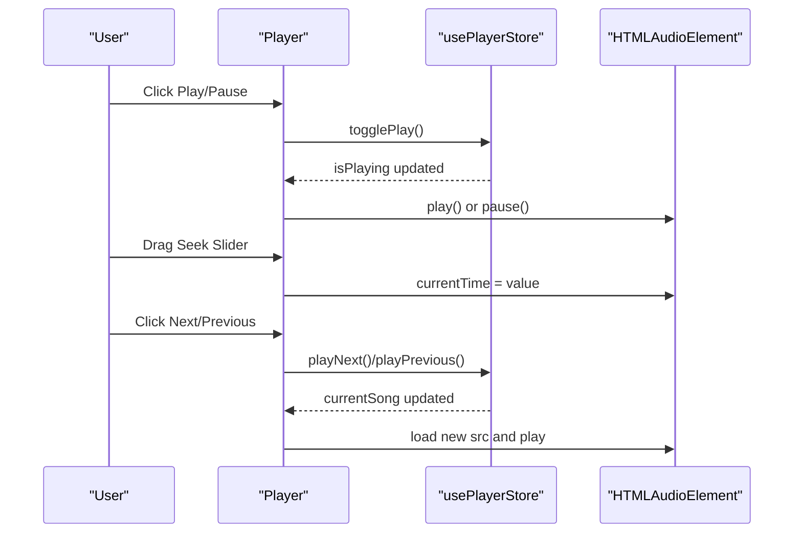
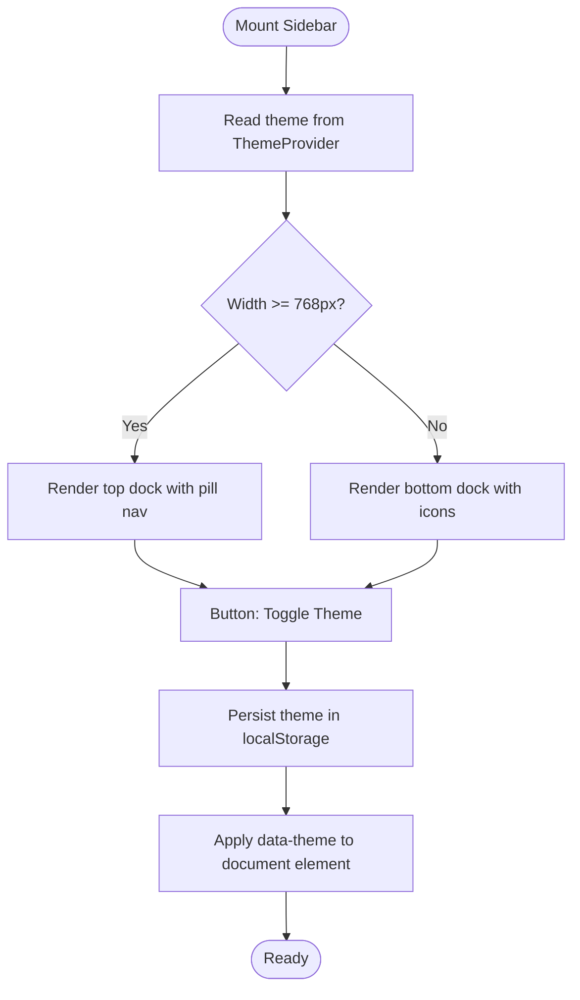
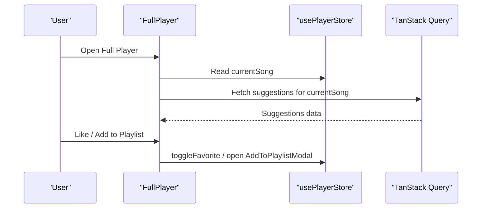
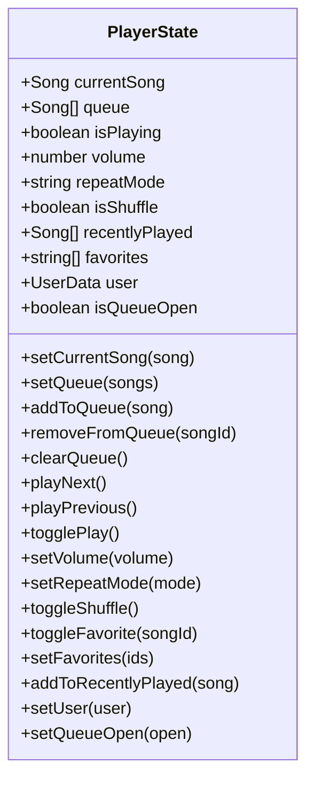
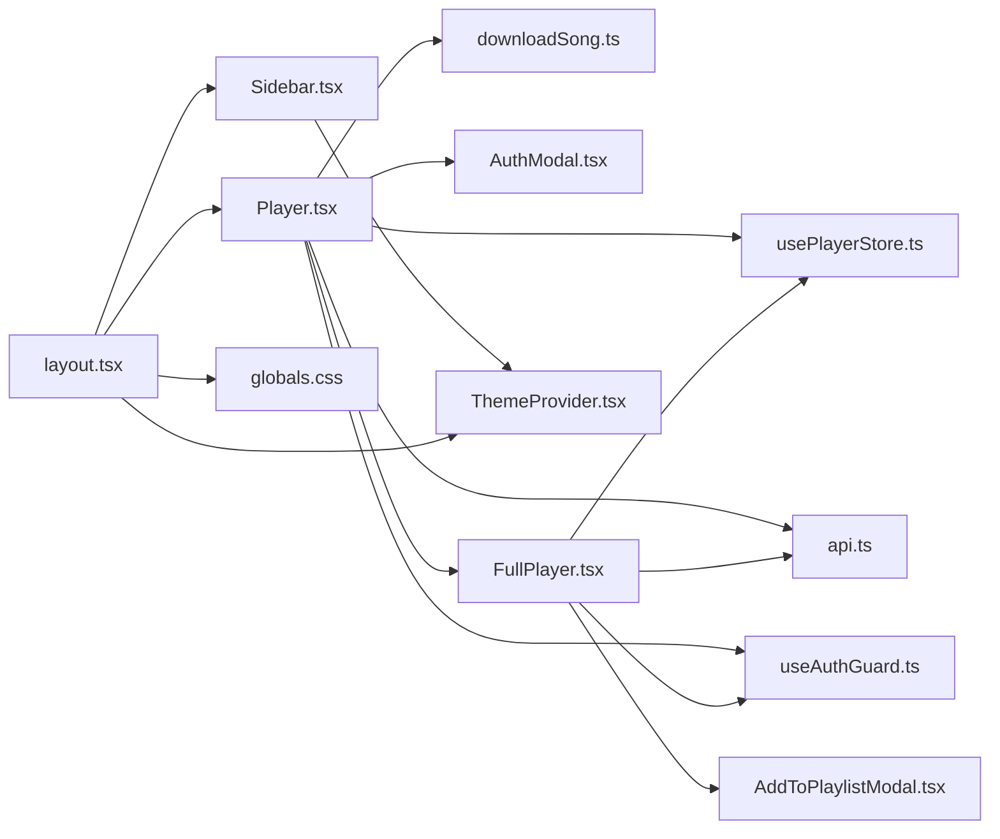

# Core UI Components

<cite>
**Referenced Files in This Document**
- [Player.tsx](file://components/Player.tsx)
- [Sidebar.tsx](file://components/Sidebar.tsx)
- [usePlayerStore.ts](file://store/usePlayerStore.ts)
- [FullPlayer.tsx](file://components/FullPlayer.tsx)
- [ThemeProvider.tsx](file://components/ThemeProvider.tsx)
- [layout.tsx](file://app/layout.tsx)
- [globals.css](file://app/globals.css)
- [api.ts](file://lib/api.ts)
- [downloadSong.ts](file://lib/downloadSong.ts)
- [useAuthGuard.ts](file://hooks/useAuthGuard.ts)
- [AuthModal.tsx](file://components/AuthModal.tsx)
- [AddToPlaylistModal.tsx](file://components/AddToPlaylistModal.tsx)
- [use-mobile.ts](file://hooks/use-mobile.ts)
</cite>

## Table of Contents
1. [Introduction](#introduction)
2. [Project Structure](#project-structure)
3. [Core Components](#core-components)
4. [Architecture Overview](#architecture-overview)
5. [Detailed Component Analysis](#detailed-component-analysis)
6. [Dependency Analysis](#dependency-analysis)
7. [Performance Considerations](#performance-considerations)
8. [Troubleshooting Guide](#troubleshooting-guide)
9. [Conclusion](#conclusion)
10. [Appendices](#appendices)

## Introduction
This document provides comprehensive documentation for SonicStream’s core UI components that form the foundation of the music streaming interface. It focuses on:
- The Player component: advanced audio controls, queue management, and state synchronization with the player store.
- The Sidebar component: navigation, theme switching, and responsive design patterns.
It also covers props, events, keyboard shortcuts, accessibility, integration with global state, lifecycle, performance optimizations, theming via CSS variables, and mobile/touch responsiveness.

## Project Structure
The UI is composed of:
- Global layout orchestrating providers and persistent UI regions.
- Sidebar for navigation and theme toggling.
- Player for playback controls, progress, queue panel, and full-screen player.
- Store for shared playback state and actions.
- Supporting utilities for theming, API integration, downloads, and authentication gating.

**Diagram sources**
- [layout.tsx:21-48](file://app/layout.tsx#L21-L48)
- [Sidebar.tsx:19-106](file://components/Sidebar.tsx#L19-L106)
- [Player.tsx:19-251](file://components/Player.tsx#L19-L251)
- [FullPlayer.tsx:34-242](file://components/FullPlayer.tsx#L34-L242)
- [usePlayerStore.ts:43-127](file://store/usePlayerStore.ts#L43-L127)
- [ThemeProvider.tsx:21-44](file://components/ThemeProvider.tsx#L21-L44)
- [globals.css:1-192](file://app/globals.css#L1-L192)
- [api.ts:1-153](file://lib/api.ts#L1-L153)
- [downloadSong.ts:1-42](file://lib/downloadSong.ts#L1-L42)
- [useAuthGuard.ts:12-28](file://hooks/useAuthGuard.ts#L12-L28)
- [AuthModal.tsx:14-149](file://components/AuthModal.tsx#L14-L149)
- [AddToPlaylistModal.tsx:18-179](file://components/AddToPlaylistModal.tsx#L18-L179)

**Section sources**
- [layout.tsx:21-48](file://app/layout.tsx#L21-L48)
- [globals.css:1-192](file://app/globals.css#L1-L192)

## Core Components
This section documents the Player and Sidebar components, their props/events, keyboard shortcuts, accessibility, and integration with the global state.

### Player Component
Responsibilities:
- Manage audio playback via HTMLAudioElement.
- Control play/pause, skip, seek, shuffle, repeat, and volume.
- Display current song info, progress, and time.
- Open/close queue panel and navigate queue entries.
- Open/close full-screen player.
- Handle downloads and favorites with authentication gating.
- Support keyboard shortcuts for media keys and seek adjustments.

Key behaviors:
- Synchronizes audio element with store-managed state (playback, volume, repeat mode, shuffle).
- Implements repeat-one behavior by looping current track.
- Uses CSS variables for theming and safe-area insets for mobile.
- Integrates with FullPlayer for expanded controls and suggestions.

Props and Events:
- None (client-side component). Exposes internal state via store subscription.

Keyboard Shortcuts:
- Space: Toggle play/pause.
- ArrowRight: Skip forward (with Ctrl/Cmd modifier to jump to next in queue).
- ArrowLeft: Skip backward (with Ctrl/Cmd modifier to jump to previous in queue).
- ArrowUp: Increase volume.
- ArrowDown: Decrease volume.
- M: Toggle mute.

Accessibility:
- Buttons use appropriate colors and focus styles via CSS variables.
- Range sliders are keyboard accessible; labels are implicit via structure.
- Icons are decorative; ensure meaningful text exists for interactive elements.

Lifecycle:
- Mounts audio element and sets source when currentSong changes.
- Subscribes to isPlaying to play/pause automatically.
- Updates volume when muted/unmuted.
- Handles ended event to either restart current track (repeat one) or advance to next.

Performance:
- Minimizes re-renders by deriving derived values (progress, favorite state) from store.
- Uses motion animations for queue panel and full player transitions.
- Debounces seek updates via controlled range inputs.

Integration with Store:
- Reads and writes currentSong, isPlaying, queue, volume, repeatMode, isShuffle, favorites, isQueueOpen.
- Uses actions: togglePlay, playNext, playPrevious, setVolume, setRepeatMode, toggleShuffle, toggleFavorite, setQueueOpen, removeFromQueue, setCurrentSong, setQueue.

Usage Example (integration):
- Consume store selectors in any page to trigger playback actions.
- Example actions: playNext(), togglePlay(), setRepeatMode('all'), toggleShuffle().

**Section sources**
- [Player.tsx:19-251](file://components/Player.tsx#L19-L251)
- [usePlayerStore.ts:12-41](file://store/usePlayerStore.ts#L12-L41)
- [usePlayerStore.ts:43-127](file://store/usePlayerStore.ts#L43-L127)
- [api.ts:1-153](file://lib/api.ts#L1-L153)
- [downloadSong.ts:1-42](file://lib/downloadSong.ts#L1-L42)
- [useAuthGuard.ts:12-28](file://hooks/useAuthGuard.ts#L12-L28)
- [AuthModal.tsx:14-149](file://components/AuthModal.tsx#L14-L149)
- [globals.css:1-192](file://app/globals.css#L1-L192)

### Sidebar Component
Responsibilities:
- Provide primary navigation links (Home, Search, Library, Liked, Profile).
- Toggle application theme via ThemeProvider.
- Render a floating dock on desktop and a bottom dock on mobile.
- Highlight active route using Next.js path matching.

Props and Events:
- None (client-side component). Uses Next.js Link and usePathname hook internally.

Responsive Design:
- Desktop: Top-fixed horizontal dock with pill-style active indicators.
- Mobile: Bottom-fixed dock with icons and small labels; includes theme toggle.

Accessibility:
- Uses aria-label on theme toggle button.
- Active state indicated via background/accent color per theme CSS variables.

Integration with ThemeProvider:
- Consumes theme state and toggle function to switch between dark/light modes.
- Theme preference persisted in localStorage and applied to document element.

**Section sources**
- [Sidebar.tsx:19-106](file://components/Sidebar.tsx#L19-L106)
- [ThemeProvider.tsx:21-44](file://components/ThemeProvider.tsx#L21-L44)
- [layout.tsx:21-48](file://app/layout.tsx#L21-L48)
- [globals.css:1-192](file://app/globals.css#L1-L192)

### FullPlayer Component
Responsibilities:
- Expanded playback controls with larger album art and richer UI.
- Seekbar, volume control, shuffle/repeat toggles, and playback buttons.
- “Up Next” suggestions fetched via TanStack Query.
- Add to playlist and like actions integrated with authentication gating.

Props:
- isOpen: boolean
- onClose: () => void
- currentTime: number
- duration: number
- onSeek: (time: number) => void
- volume: number
- onVolumeChange: (vol: number) => void
- isMuted: boolean
- onToggleMute: () => void

Integration:
- Shares store with Player for synchronized playback state.
- Uses react-query to fetch song suggestions based on currentSong.

**Section sources**
- [FullPlayer.tsx:22-32](file://components/FullPlayer.tsx#L22-L32)
- [FullPlayer.tsx:34-242](file://components/FullPlayer.tsx#L34-L242)
- [usePlayerStore.ts:43-127](file://store/usePlayerStore.ts#L43-L127)

## Architecture Overview
The UI architecture centers around a global layout that composes providers and persistent UI regions. The Player and Sidebar are fixed overlays that remain visible across pages, while the main content area scrolls beneath them. Theming is driven by CSS variables applied to the document element and consumed throughout components.

**Diagram sources**
- [layout.tsx:21-48](file://app/layout.tsx#L21-L48)
- [ThemeProvider.tsx:21-44](file://components/ThemeProvider.tsx#L21-L44)
- [globals.css:1-192](file://app/globals.css#L1-L192)
- [Player.tsx:19-251](file://components/Player.tsx#L19-L251)
- [usePlayerStore.ts:43-127](file://store/usePlayerStore.ts#L43-L127)

## Detailed Component Analysis

### Player Component Deep Dive
- Audio synchronization:
  - Sets audio source when currentSong changes.
  - Plays/pauses based on isPlaying.
  - Applies volume and mute state.
- Progress handling:
  - Tracks currentTime and duration.
  - Provides seek via range input and programmatic updates.
- Queue management:
  - Opens/closes queue panel.
  - Renders queue items with remove action.
  - Allows selecting a different song to play.
- Full-player integration:
  - Passes current playback state to FullPlayer.
- Accessibility and UX:
  - Uses motion animations for smooth transitions.
  - Responsive layout adapts controls for mobile/desktop.
  - Safe-area padding prevents overlap with device insets.

**Diagram sources**
- [Player.tsx:33-57](file://components/Player.tsx#L33-L57)
- [usePlayerStore.ts:70-99](file://store/usePlayerStore.ts#L70-L99)

**Section sources**
- [Player.tsx:19-251](file://components/Player.tsx#L19-L251)
- [usePlayerStore.ts:43-127](file://store/usePlayerStore.ts#L43-L127)

### Sidebar Component Deep Dive
- Navigation:
  - Uses Next.js Link for client-side routing.
  - Highlights active route based on pathname.
- Theme switching:
  - Calls toggleTheme from ThemeProvider context.
  - Persists theme preference in localStorage.
- Responsive patterns:
  - Desktop dock at top with pill-style active states.
  - Mobile dock at bottom with compact labels and theme toggle.

**Diagram sources**
- [Sidebar.tsx:19-106](file://components/Sidebar.tsx#L19-L106)
- [ThemeProvider.tsx:21-44](file://components/ThemeProvider.tsx#L21-L44)

**Section sources**
- [Sidebar.tsx:19-106](file://components/Sidebar.tsx#L19-L106)
- [ThemeProvider.tsx:21-44](file://components/ThemeProvider.tsx#L21-L44)

### FullPlayer Component Deep Dive
- Expanded controls:
  - Larger album art with subtle hover scaling.
  - Full seekbar and volume control.
  - Shuffle/repeat toggles and playback buttons.
- Suggestions:
  - Fetches related songs via react-query.
  - Allows quick selection to play and populate queue.
- Authentication:
  - Requires login for like/add-to-playlist actions.

**Diagram sources**
- [FullPlayer.tsx:44-51](file://components/FullPlayer.tsx#L44-L51)
- [usePlayerStore.ts:104-108](file://store/usePlayerStore.ts#L104-L108)
- [AddToPlaylistModal.tsx:18-179](file://components/AddToPlaylistModal.tsx#L18-L179)

**Section sources**
- [FullPlayer.tsx:34-242](file://components/FullPlayer.tsx#L34-L242)
- [usePlayerStore.ts:43-127](file://store/usePlayerStore.ts#L43-L127)

### Player Store Deep Dive
- State shape:
  - currentSong, queue, isPlaying, volume, repeatMode, isShuffle, favorites, recentlyPlayed, user, isQueueOpen.
- Actions:
  - Playback: setCurrentSong, playNext, playPrevious, togglePlay.
  - Queue: setQueue, addToQueue, removeFromQueue, clearQueue, setQueueOpen.
  - Audio: setVolume, setRepeatMode, toggleShuffle.
  - Favorites: toggleFavorite, setFavorites.
  - History: addToRecentlyPlayed.
  - User: setUser.
- Persistence:
  - Zustand persist middleware stores selected fields in localStorage.

**Diagram sources**
- [usePlayerStore.ts:12-41](file://store/usePlayerStore.ts#L12-L41)

**Section sources**
- [usePlayerStore.ts:43-127](file://store/usePlayerStore.ts#L43-L127)

## Dependency Analysis
- Player depends on:
  - usePlayerStore for state/actions.
  - api.ts for image/download URLs and helpers.
  - downloadSong.ts for downloading.
  - useAuthGuard.ts and AuthModal.tsx for authentication gating.
  - FullPlayer for expanded controls.
- Sidebar depends on:
  - ThemeProvider for theme state and toggle.
  - Next.js Link and usePathname for navigation.
- FullPlayer depends on:
  - usePlayerStore for synchronized state.
  - api.ts for image/download helpers.
  - AddToPlaylistModal.tsx for playlist operations.
  - useAuthGuard.ts for protected actions.
- Global dependencies:
  - layout.tsx composes providers and mounts Sidebar/Player.
  - globals.css defines CSS variables and theme tokens.

**Diagram sources**
- [Player.tsx:19-251](file://components/Player.tsx#L19-L251)
- [Sidebar.tsx:19-106](file://components/Sidebar.tsx#L19-L106)
- [FullPlayer.tsx:34-242](file://components/FullPlayer.tsx#L34-L242)
- [usePlayerStore.ts:43-127](file://store/usePlayerStore.ts#L43-L127)
- [ThemeProvider.tsx:21-44](file://components/ThemeProvider.tsx#L21-L44)
- [layout.tsx:21-48](file://app/layout.tsx#L21-L48)
- [globals.css:1-192](file://app/globals.css#L1-L192)

**Section sources**
- [layout.tsx:21-48](file://app/layout.tsx#L21-L48)
- [globals.css:1-192](file://app/globals.css#L1-L192)

## Performance Considerations
- State normalization:
  - usePlayerStore persists only essential fields (volume, favorites, recentlyPlayed, user) to reduce storage overhead.
- Rendering:
  - Player and FullPlayer use motion animations judiciously; avoid unnecessary re-renders by deriving computed values from store.
- Media:
  - Audio source updates occur only when currentSong changes; volume and mute updates are immediate.
- Queries:
  - FullPlayer fetches suggestions only when currentSong is present.
- Theming:
  - CSS variables minimize repaints; theme toggle updates a single attribute on the document element.

[No sources needed since this section provides general guidance]

## Troubleshooting Guide
Common issues and resolutions:
- Audio does not play:
  - Verify currentSong is set and audio src is assigned.
  - Check isPlaying flag and ensure play() promise resolves.
- Volume/mute not updating:
  - Confirm volume and isMuted state updates propagate to audio element.
- Queue not advancing:
  - Ensure queue is populated and repeatMode logic is considered (repeat all vs none).
- Favorites not toggling:
  - Confirm user is authenticated; useAuthGuard should open AuthModal if missing.
- Download fails:
  - Ensure downloadUrl exists; check network errors and blob creation.

**Section sources**
- [Player.tsx:33-57](file://components/Player.tsx#L33-L57)
- [usePlayerStore.ts:70-99](file://store/usePlayerStore.ts#L70-L99)
- [useAuthGuard.ts:12-28](file://hooks/useAuthGuard.ts#L12-L28)
- [downloadSong.ts:8-41](file://lib/downloadSong.ts#L8-L41)

## Conclusion
The Player and Sidebar components form the backbone of SonicStream’s UI. They integrate tightly with the global state store, support responsive design, and leverage CSS variables for consistent theming. The Player component provides robust playback controls and queue management, while the Sidebar ensures intuitive navigation and theme switching. Together, they deliver a cohesive, accessible, and performant music streaming experience.

[No sources needed since this section summarizes without analyzing specific files]

## Appendices

### Props and Events Reference
- Player:
  - No props; manages internal state and integrates with store.
- FullPlayer:
  - isOpen: boolean
  - onClose: () => void
  - currentTime: number
  - duration: number
  - onSeek: (time: number) => void
  - volume: number
  - onVolumeChange: (vol: number) => void
  - isMuted: boolean
  - onToggleMute: () => void

**Section sources**
- [FullPlayer.tsx:22-32](file://components/FullPlayer.tsx#L22-L32)

### Keyboard Shortcuts Summary
- Space: Play/Pause
- ArrowRight: Skip Forward (or seek forward with modifiers)
- ArrowLeft: Skip Backward (or seek backward with modifiers)
- ArrowUp: Volume Up
- ArrowDown: Volume Down
- M: Toggle Mute

**Section sources**
- [Player.tsx:69-82](file://components/Player.tsx#L69-L82)

### Accessibility Notes
- Buttons styled via CSS variables for sufficient contrast.
- Range inputs are keyboard accessible; ensure focus styles are visible.
- Theme toggle includes aria-label for assistive technologies.

**Section sources**
- [Sidebar.tsx:68](file://components/Sidebar.tsx#L68)
- [globals.css:1-192](file://app/globals.css#L1-L192)