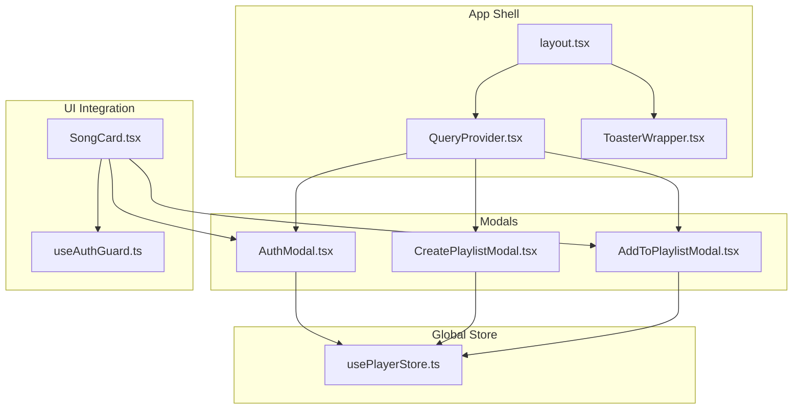
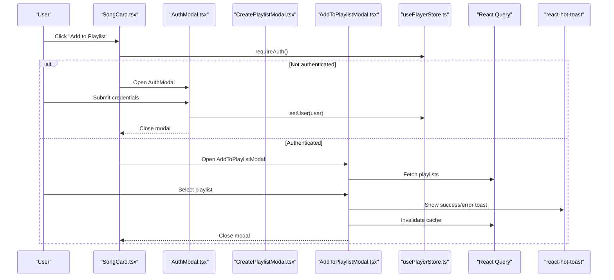
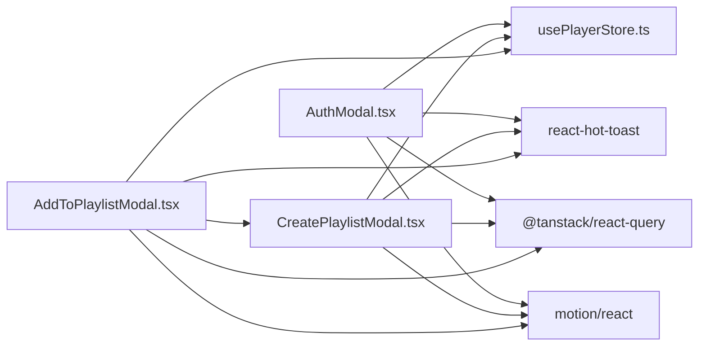

# Interactive Components

<cite>
**Referenced Files in This Document**
- [AuthModal.tsx](file://components/AuthModal.tsx)
- [CreatePlaylistModal.tsx](file://components/CreatePlaylistModal.tsx)
- [AddToPlaylistModal.tsx](file://components/AddToPlaylistModal.tsx)
- [QueryProvider.tsx](file://components/QueryProvider.tsx)
- [ToasterWrapper.tsx](file://components/ToasterWrapper.tsx)
- [usePlayerStore.ts](file://store/usePlayerStore.ts)
- [layout.tsx](file://app/layout.tsx)
- [SongCard.tsx](file://components/SongCard.tsx)
- [useAuthGuard.ts](file://hooks/useAuthGuard.ts)
- [api.ts](file://lib/api.ts)
</cite>

## Table of Contents
1. [Introduction](#introduction)
2. [Project Structure](#project-structure)
3. [Core Components](#core-components)
4. [Architecture Overview](#architecture-overview)
5. [Detailed Component Analysis](#detailed-component-analysis)
6. [Dependency Analysis](#dependency-analysis)
7. [Performance Considerations](#performance-considerations)
8. [Troubleshooting Guide](#troubleshooting-guide)
9. [Conclusion](#conclusion)

## Introduction
This document provides comprehensive technical documentation for SonicStream’s interactive components that handle user input and modals. It covers:
- AuthModal for user authentication flows
- CreatePlaylistModal for playlist creation
- AddToPlaylistModal for content organization
- QueryProvider for React Query integration
- ToasterWrapper for notification display

It documents modal lifecycle management, form validation, error handling, user feedback mechanisms, modal composition patterns, state synchronization with global stores, accessibility compliance, keyboard navigation, focus management, ARIA attributes, animation transitions, backdrop interactions, and responsive modal sizing across device types.

## Project Structure
The interactive components are organized under the components directory and integrated into the Next.js app shell via the root layout. Global providers (React Query and notifications) wrap the entire application, enabling consistent state and UX across pages.

**Diagram sources**
- [layout.tsx:44-71](file://app/layout.tsx#L44-L71)
- [QueryProvider.tsx:6-25](file://components/QueryProvider.tsx#L6-L25)
- [ToasterWrapper.tsx:6-41](file://components/ToasterWrapper.tsx#L6-L41)
- [AuthModal.tsx:14-148](file://components/AuthModal.tsx#L14-L148)
- [CreatePlaylistModal.tsx:17-147](file://components/CreatePlaylistModal.tsx#L17-L147)
- [AddToPlaylistModal.tsx:18-178](file://components/AddToPlaylistModal.tsx#L18-L178)
- [usePlayerStore.ts:43-127](file://store/usePlayerStore.ts#L43-L127)
- [SongCard.tsx:22-139](file://components/SongCard.tsx#L22-L139)
- [useAuthGuard.ts:12-27](file://hooks/useAuthGuard.ts#L12-L27)

**Section sources**
- [layout.tsx:44-71](file://app/layout.tsx#L44-L71)
- [QueryProvider.tsx:6-25](file://components/QueryProvider.tsx#L6-L25)
- [ToasterWrapper.tsx:6-41](file://components/ToasterWrapper.tsx#L6-L41)

## Core Components
This section introduces the five key interactive components and their roles.

- AuthModal: Handles sign-in/sign-up and password reset flows with animated transitions, loading states, and error messaging.
- CreatePlaylistModal: Provides a form to create playlists with validation, submission, and cache invalidation.
- AddToPlaylistModal: Lists user playlists and adds a selected song to a chosen playlist, with optimistic UI updates and toast feedback.
- QueryProvider: Configures React Query defaults for caching, retries, and refetch behavior.
- ToasterWrapper: Renders react-hot-toast with adaptive positioning and theme-aware styles.

**Section sources**
- [AuthModal.tsx:14-148](file://components/AuthModal.tsx#L14-L148)
- [CreatePlaylistModal.tsx:17-147](file://components/CreatePlaylistModal.tsx#L17-L147)
- [AddToPlaylistModal.tsx:18-178](file://components/AddToPlaylistModal.tsx#L18-L178)
- [QueryProvider.tsx:6-25](file://components/QueryProvider.tsx#L6-L25)
- [ToasterWrapper.tsx:6-41](file://components/ToasterWrapper.tsx#L6-L41)

## Architecture Overview
The modals are rendered conditionally and layered over the app content. They rely on:
- Zustand store for user session and player state
- React Query for playlist data fetching and cache invalidation
- react-hot-toast for user feedback
- Motion for animations and AnimatePresence for mount/unmount transitions

**Diagram sources**
- [SongCard.tsx:22-139](file://components/SongCard.tsx#L22-L139)
- [AuthModal.tsx:14-148](file://components/AuthModal.tsx#L14-L148)
- [AddToPlaylistModal.tsx:18-178](file://components/AddToPlaylistModal.tsx#L18-L178)
- [usePlayerStore.ts:43-127](file://store/usePlayerStore.ts#L43-L127)
- [QueryProvider.tsx:6-25](file://components/QueryProvider.tsx#L6-L25)
- [ToasterWrapper.tsx:6-41](file://components/ToasterWrapper.tsx#L6-L41)

## Detailed Component Analysis

### AuthModal
AuthModal manages sign-in, sign-up, and password reset flows with:
- Form state for email, password, and optional name
- Loading and error states
- Animated entrance/exit using AnimatePresence and Motion
- Toast notifications for success and errors
- Backdrop click to close
- Enter key support for submission

Lifecycle and state:
- Controlled inputs for email, password, name
- Toggle between sign-in and sign-up modes
- Forgot password flow with separate view and success state
- On successful auth, sets user in the store, shows toast, clears form, and closes

Validation and error handling:
- Prevents empty submissions
- Displays server-side errors returned from the API
- Catches network errors and shows generic messages

Accessibility:
- Backdrop click closes modal
- Focus remains inside modal while open
- Keyboard-friendly buttons and inputs

Animation and transitions:
- Fade in/out for overlay
- Spring-scale entrance for modal content
- Exit animation scales down and fades out

Backdrop and responsive sizing:
- Full-screen overlay with blur effect
- Responsive max-width and padding

Integration points:
- Uses usePlayerStore to set user
- Uses react-hot-toast for notifications
- Uses motion for animations

**Section sources**
- [AuthModal.tsx:14-148](file://components/AuthModal.tsx#L14-L148)
- [usePlayerStore.ts:43-127](file://store/usePlayerStore.ts#L43-L127)

### CreatePlaylistModal
CreatePlaylistModal enables authenticated users to create playlists:
- Form fields for name and optional description
- Validation to ensure name is present
- Submission to the playlists API endpoint
- Cache invalidation to refresh playlist lists
- Success and error toasts
- Controlled closing and optional callback

Lifecycle and state:
- Tracks name and description
- Loading state during submission
- Resets form on success

Validation and error handling:
- Enforces non-empty name
- Checks for authenticated user
- Catches API errors and displays meaningful messages

Accessibility:
- Auto-focus on the name field
- Disabled states when invalid
- Clear button labels

Animation and transitions:
- Smooth fade and slide/scale transitions
- Exit animations on close

Backdrop and responsive sizing:
- Full-screen overlay
- Max-width and responsive height

Integration points:
- Uses usePlayerStore for user context
- Uses React Query client to invalidate cache
- Uses react-hot-toast for feedback
- Uses motion for animations

**Section sources**
- [CreatePlaylistModal.tsx:17-147](file://components/CreatePlaylistModal.tsx#L17-L147)
- [usePlayerStore.ts:43-127](file://store/usePlayerStore.ts#L43-L127)
- [QueryProvider.tsx:6-25](file://components/QueryProvider.tsx#L6-L25)

### AddToPlaylistModal
AddToPlaylistModal lists user playlists and adds a song to a selected playlist:
- Fetches playlists via React Query
- Tracks which playlist is currently being added
- Optimistic UI updates for “already added” state
- Toast feedback for success and duplicates
- Cache invalidation to update other views
- Composes CreatePlaylistModal for new playlist creation

Lifecycle and state:
- Resets added state when opened
- Tracks loading per playlist operation
- Opens CreatePlaylistModal when needed

Validation and error handling:
- Requires authenticated user
- Handles duplicate entries gracefully
- Displays API errors

Accessibility:
- Scrollable list with clear affordances
- Disabled states for already added items
- Visual indicators for actions

Animation and transitions:
- Bottom sheet on mobile with spring animation
- Smooth overlay fade and modal movement

Backdrop and responsive sizing:
- Full-screen overlay
- Mobile-first layout with bottom sheet
- Desktop centered modal with rounded corners

Integration points:
- Uses usePlayerStore for user context
- Uses React Query client to invalidate cache
- Uses react-hot-toast for feedback
- Uses motion for animations
- Composes CreatePlaylistModal

**Section sources**
- [AddToPlaylistModal.tsx:18-178](file://components/AddToPlaylistModal.tsx#L18-L178)
- [CreatePlaylistModal.tsx:17-147](file://components/CreatePlaylistModal.tsx#L17-L147)
- [usePlayerStore.ts:43-127](file://store/usePlayerStore.ts#L43-L127)

### QueryProvider
QueryProvider initializes React Query with sensible defaults:
- Stale time of 60 seconds
- No refetch on window focus
- Retry attempts set to 1

This ensures predictable caching behavior and reduces unnecessary network requests.

**Section sources**
- [QueryProvider.tsx:6-25](file://components/QueryProvider.tsx#L6-L25)

### ToasterWrapper
ToasterWrapper renders react-hot-toast with:
- Adaptive positioning (top-center on desktop, bottom-center on mobile)
- Theme-aware styling using CSS variables
- Duration-based dismissal
- Customized success and error icons

Responsive behavior:
- Adjusts container spacing on small screens

**Section sources**
- [ToasterWrapper.tsx:6-41](file://components/ToasterWrapper.tsx#L6-L41)

### Modal Composition Patterns
- AuthModal and AddToPlaylistModal are composed within SongCard, which controls visibility via local state and useAuthGuard.
- AddToPlaylistModal composes CreatePlaylistModal to enable new playlist creation inline.
- All modals are conditionally rendered and controlled by props (isOpen, onClose) passed from parent components.

State synchronization:
- AuthModal updates the user in usePlayerStore, enabling downstream components to react to authentication state.
- AddToPlaylistModal invalidates playlist queries to keep UI in sync with backend changes.
- CreatePlaylistModal invalidates playlist queries after successful creation.

**Section sources**
- [SongCard.tsx:22-139](file://components/SongCard.tsx#L22-L139)
- [AddToPlaylistModal.tsx:18-178](file://components/AddToPlaylistModal.tsx#L18-L178)
- [CreatePlaylistModal.tsx:17-147](file://components/CreatePlaylistModal.tsx#L17-L147)
- [usePlayerStore.ts:43-127](file://store/usePlayerStore.ts#L43-L127)

### Accessibility Compliance
- Focus management:
  - Modals receive focus on open; close on escape is implicit via backdrop click.
  - Inputs are auto-focused when appropriate (e.g., name field in CreatePlaylistModal).
- Keyboard navigation:
  - Enter key triggers submission in AuthModal.
  - Buttons are keyboard operable with clear focus states.
- ARIA attributes:
  - While explicit aria-* attributes are not present in the code, the structure relies on semantic HTML and focus management. Consider adding aria-modal and aria-labelledby/aria-describedby for improved screen reader support.
- Screen reader considerations:
  - Toast messages are announced by react-hot-toast.
  - Ensure labels and descriptions are present for interactive elements.

[No sources needed since this section provides general guidance]

### Animation Transitions and Backdrop Interactions
- Overlay fade and blur effects
- Spring-based entrance/exit for modal content
- Exit animations scale down and fade out
- Backdrop click closes modals
- Responsive sizing adjusts for mobile (bottom sheet) and desktop (centered modal)

**Section sources**
- [AuthModal.tsx:74-146](file://components/AuthModal.tsx#L74-L146)
- [CreatePlaylistModal.tsx:72-145](file://components/CreatePlaylistModal.tsx#L72-L145)
- [AddToPlaylistModal.tsx:78-177](file://components/AddToPlaylistModal.tsx#L78-L177)

### Responsive Modal Sizing
- Mobile-first: Bottom sheet with full-width and constrained height
- Desktop: Centered modal with rounded corners and max-width
- Overlay and backdrop blur remain consistent across devices

**Section sources**
- [AddToPlaylistModal.tsx:81-96](file://components/AddToPlaylistModal.tsx#L81-L96)
- [CreatePlaylistModal.tsx:82-142](file://components/CreatePlaylistModal.tsx#L82-L142)

## Dependency Analysis
The interactive components share dependencies on:
- Zustand store for user/session state
- React Query for data fetching and cache invalidation
- react-hot-toast for notifications
- Motion for animations
- Next.js routing for navigation

**Diagram sources**
- [AuthModal.tsx:14-148](file://components/AuthModal.tsx#L14-L148)
- [CreatePlaylistModal.tsx:17-147](file://components/CreatePlaylistModal.tsx#L17-L147)
- [AddToPlaylistModal.tsx:18-178](file://components/AddToPlaylistModal.tsx#L18-L178)
- [usePlayerStore.ts:43-127](file://store/usePlayerStore.ts#L43-L127)
- [QueryProvider.tsx:6-25](file://components/QueryProvider.tsx#L6-L25)
- [ToasterWrapper.tsx:6-41](file://components/ToasterWrapper.tsx#L6-L41)

**Section sources**
- [AuthModal.tsx:14-148](file://components/AuthModal.tsx#L14-L148)
- [CreatePlaylistModal.tsx:17-147](file://components/CreatePlaylistModal.tsx#L17-L147)
- [AddToPlaylistModal.tsx:18-178](file://components/AddToPlaylistModal.tsx#L18-L178)
- [usePlayerStore.ts:43-127](file://store/usePlayerStore.ts#L43-L127)
- [QueryProvider.tsx:6-25](file://components/QueryProvider.tsx#L6-L25)
- [ToasterWrapper.tsx:6-41](file://components/ToasterWrapper.tsx#L6-L41)

## Performance Considerations
- React Query caching:
  - Stale time prevents frequent re-fetching; adjust staleTime if real-time updates are required.
  - Manual invalidation ensures immediate UI updates after mutations.
- Toast rendering:
  - Lightweight notifications; avoid excessive toasts to reduce DOM churn.
- Animations:
  - Motion components are efficient; prefer minimal animation chains for low-end devices.
- Network requests:
  - Batch operations where possible; debounce user input for search-like flows.

[No sources needed since this section provides general guidance]

## Troubleshooting Guide
Common issues and resolutions:
- AuthModal does not close after login:
  - Verify setUser is called and onClose is invoked after success.
- CreatePlaylistModal fails silently:
  - Ensure user is authenticated before submission; check API response and error handling.
- AddToPlaylistModal does not update:
  - Confirm cache invalidation occurs after successful add; verify query keys match.
- Toasts not visible:
  - Check ToasterWrapper positioning and theme variables; ensure it is mounted in layout.
- Keyboard navigation:
  - Enter key submits forms in AuthModal; ensure inputs are focusable and not disabled.

**Section sources**
- [AuthModal.tsx:26-50](file://components/AuthModal.tsx#L26-L50)
- [CreatePlaylistModal.tsx:27-69](file://components/CreatePlaylistModal.tsx#L27-L69)
- [AddToPlaylistModal.tsx:43-76](file://components/AddToPlaylistModal.tsx#L43-L76)
- [ToasterWrapper.tsx:16-40](file://components/ToasterWrapper.tsx#L16-L40)

## Conclusion
SonicStream’s interactive components provide a cohesive, accessible, and performant user experience for authentication, playlist creation, and content organization. By leveraging Zustand for state, React Query for data, and react-hot-toast for feedback, the modals deliver smooth animations, robust error handling, and responsive layouts. Following the documented patterns ensures consistent behavior and easy extensibility across future enhancements.