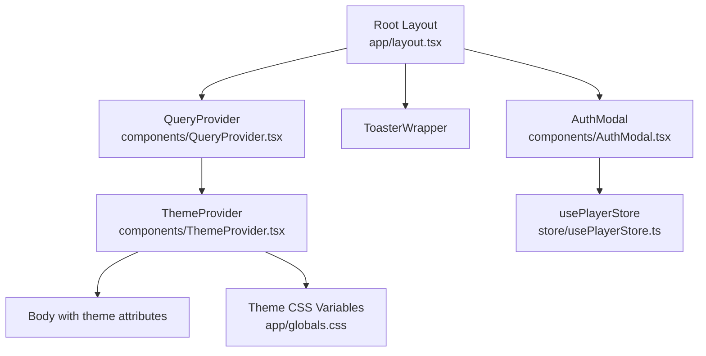
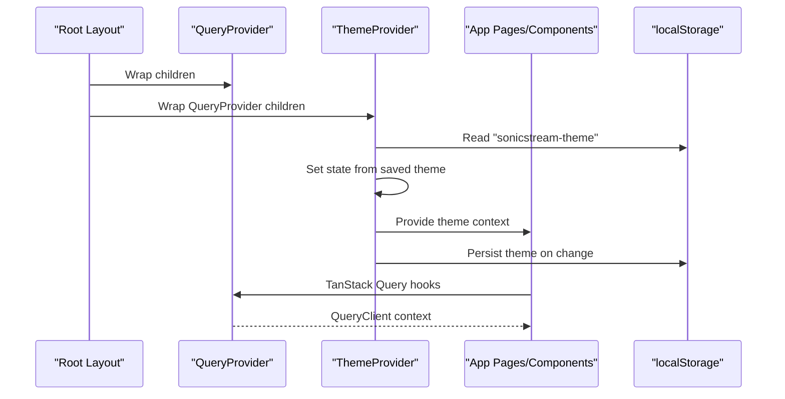
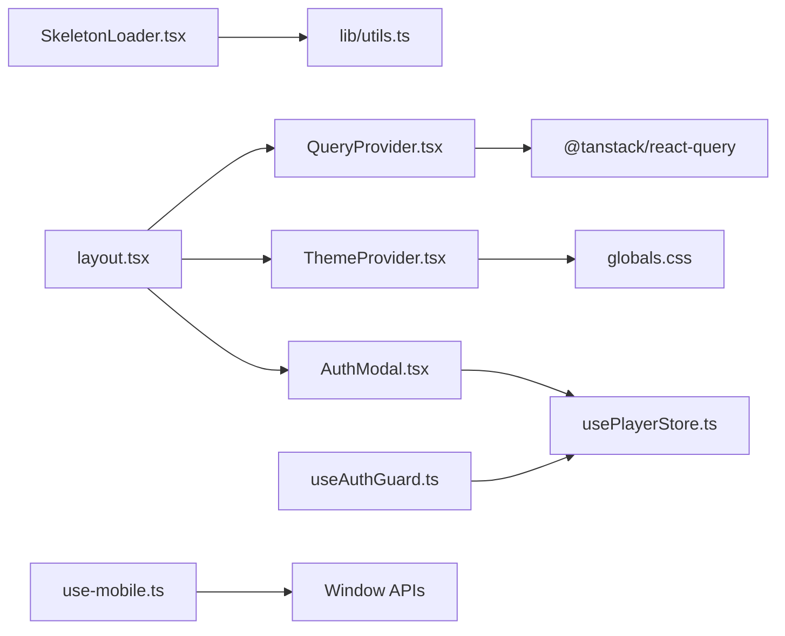

# Utility Components

<cite>
**Referenced Files in This Document**
- [ThemeProvider.tsx](file://components/ThemeProvider.tsx)
- [SkeletonLoader.tsx](file://components/SkeletonLoader.tsx)
- [QueryProvider.tsx](file://components/QueryProvider.tsx)
- [use-mobile.ts](file://hooks/use-mobile.ts)
- [useAuthGuard.ts](file://hooks/useAuthGuard.ts)
- [layout.tsx](file://app/layout.tsx)
- [globals.css](file://app/globals.css)
- [AuthModal.tsx](file://components/AuthModal.tsx)
- [usePlayerStore.ts](file://store/usePlayerStore.ts)
- [utils.ts](file://lib/utils.ts)
</cite>

## Table of Contents
1. [Introduction](#introduction)
2. [Project Structure](#project-structure)
3. [Core Components](#core-components)
4. [Architecture Overview](#architecture-overview)
5. [Detailed Component Analysis](#detailed-component-analysis)
6. [Dependency Analysis](#dependency-analysis)
7. [Performance Considerations](#performance-considerations)
8. [Troubleshooting Guide](#troubleshooting-guide)
9. [Conclusion](#conclusion)

## Introduction
This document explains SonicStream’s utility components and custom hooks that power the application’s theming, data fetching, loading states, responsive behavior, and authentication gating. It covers:
- ThemeProvider for dark/light mode switching and persistence
- SkeletonLoader for loading states
- QueryProvider for TanStack Query data fetching
- Custom hooks use-mobile and useAuthGuard
- Provider configuration and integration with the main application layout
- Implementation details, usage patterns, performance, memory management, SSR hygiene, and development vs production behavior

## Project Structure
The providers and hooks are wired at the root layout level so they wrap all pages and components. Providers:
- QueryProvider wraps the entire app to enable TanStack Query caching and refetching policies
- ThemeProvider wraps QueryProvider to manage theme state and persistence
- AuthModal is rendered conditionally by pages that need authentication

Responsive and authentication utilities:
- useIsMobile detects mobile breakpoints
- useAuthGuard gates actions behind user login and controls an auth modal

**Diagram sources**
- [layout.tsx:78-105](file://app/layout.tsx#L78-L105)
- [QueryProvider.tsx:6-25](file://components/QueryProvider.tsx#L6-L25)
- [ThemeProvider.tsx:21-44](file://components/ThemeProvider.tsx#L21-L44)
- [AuthModal.tsx:14-148](file://components/AuthModal.tsx#L14-L148)
- [usePlayerStore.ts:43-127](file://store/usePlayerStore.ts#L43-L127)
- [globals.css:26-81](file://app/globals.css#L26-L81)

**Section sources**
- [layout.tsx:78-105](file://app/layout.tsx#L78-L105)

## Core Components
- ThemeProvider: Manages theme state, persists to localStorage, and applies a data-theme attribute to the document element. Exposes a useTheme hook for consumers.
- SkeletonLoader: Renders skeleton placeholders with optional repetition for lists and grids.
- QueryProvider: Creates a TanStack Query client with default caching and refetch policies and exposes it via a provider.
- use-mobile: Detects mobile breakpoint and manages responsive UI behavior.
- useAuthGuard: Wraps actions requiring authentication, opening an auth modal when the user is not logged in.

**Section sources**
- [ThemeProvider.tsx:1-45](file://components/ThemeProvider.tsx#L1-L45)
- [SkeletonLoader.tsx:1-30](file://components/SkeletonLoader.tsx#L1-L30)
- [QueryProvider.tsx:1-26](file://components/QueryProvider.tsx#L1-L26)
- [use-mobile.ts:1-20](file://hooks/use-mobile.ts#L1-L20)
- [useAuthGuard.ts:1-29](file://hooks/useAuthGuard.ts#L1-L29)

## Architecture Overview
Providers and hooks are layered at the root to ensure global availability. ThemeProvider reads persisted preferences on mount and updates DOM attributes and storage. QueryProvider centralizes caching and retries. useAuthGuard integrates with the Zustand store to gate actions and coordinate with the AuthModal.

**Diagram sources**
- [layout.tsx:78-105](file://app/layout.tsx#L78-L105)
- [QueryProvider.tsx:6-25](file://components/QueryProvider.tsx#L6-L25)
- [ThemeProvider.tsx:21-44](file://components/ThemeProvider.tsx#L21-L44)

## Detailed Component Analysis

### ThemeProvider
- Purpose: Centralized theme management with persistence and DOM attribute updates
- Persistence: Reads and writes to localStorage under a specific key
- Hydration: Uses a mounted flag to avoid mismatches during SSR
- Context: Exposes theme state and a toggle function via a dedicated hook
- CSS integration: Applies a data-theme attribute on the document element, enabling CSS variables to switch between themes

Implementation highlights:
- Client directive ensures it runs on the client
- Two effects: initialize from localStorage and update DOM/storage on change
- Toggle switches between dark and light modes

Usage patterns:
- Wrap the app with ThemeProvider at the root
- Consume useTheme in components to read current theme and toggle
- Combine with CSS variables for consistent theming across components

SSR and hydration:
- Mounted guard prevents immediate DOM writes before hydration
- Initial server-rendered theme is set via the root HTML attribute

Development vs production:
- Behavior identical; localStorage persists across sessions

**Section sources**
- [ThemeProvider.tsx:1-45](file://components/ThemeProvider.tsx#L1-L45)
- [layout.tsx:80](file://app/layout.tsx#L80)
- [globals.css:26-81](file://app/globals.css#L26-L81)

### SkeletonLoader
- Purpose: Provide lightweight loading placeholders while data loads
- Props: count (number of skeletons), className (optional)
- Rendering: Single skeleton or a grid/list of skeletons
- Styling: Uses a shared skeleton-loading animation class defined in CSS

Usage patterns:
- Render a single skeleton for a compact loading state
- Render multiple skeletons for lists or grids
- Combine with container classes for consistent spacing and aspect ratios

Integration:
- Often used alongside TanStack Query’s isFetching flags
- Works seamlessly with theme-aware CSS variables

**Section sources**
- [SkeletonLoader.tsx:1-30](file://components/SkeletonLoader.tsx#L1-L30)
- [globals.css:183-192](file://app/globals.css#L183-L192)

### QueryProvider
- Purpose: Provide a configured TanStack Query client to the app
- Defaults: Sets a staleTime, disables refetch on window focus, and configures retry attempts
- Client lifecycle: Created once per app initialization using a factory

Usage patterns:
- Wrap the app with QueryProvider at the root
- Use TanStack Query hooks in pages/components to fetch, cache, and invalidate data
- Adjust defaultOptions per environment or feature needs

**Section sources**
- [QueryProvider.tsx:1-26](file://components/QueryProvider.tsx#L1-L26)

### use-mobile
- Purpose: Detect mobile viewport to adapt UI behavior
- Breakpoint: Uses a fixed breakpoint constant
- Effect: Subscribes to MediaQueryList events and cleans up listeners
- Return: Boolean indicating whether the device is considered mobile

Usage patterns:
- Guard mobile-specific layouts or interactions
- Conditionally render components or adjust spacing

**Section sources**
- [use-mobile.ts:1-20](file://hooks/use-mobile.ts#L1-L20)

### useAuthGuard
- Purpose: Gate actions that require authentication
- Store integration: Reads user state from the player store
- Modal coordination: Controls an auth modal visibility when user is not logged in
- Action wrapper: Accepts a function to execute when authenticated

Usage patterns:
- Wrap sensitive actions with requireAuth
- Control modal visibility externally and pass to AuthModal
- Use isAuthenticated for conditional rendering

Integration:
- AuthModal handles sign-in/sign-up and sets user into the store
- Store persists user session and other state

**Section sources**
- [useAuthGuard.ts:1-29](file://hooks/useAuthGuard.ts#L1-L29)
- [AuthModal.tsx:14-148](file://components/AuthModal.tsx#L14-L148)
- [usePlayerStore.ts:43-127](file://store/usePlayerStore.ts#L43-L127)

## Dependency Analysis
- ThemeProvider depends on:
  - React context and effects
  - localStorage for persistence
  - CSS variables for theming
- SkeletonLoader depends on:
  - Tailwind-based CSS classes and a shared animation
  - cn utility for merging classes
- QueryProvider depends on:
  - TanStack Query client creation
- use-mobile depends on:
  - Window matchMedia API
- useAuthGuard depends on:
  - Zustand store for user state
  - AuthModal for UI

**Diagram sources**
- [ThemeProvider.tsx:1-45](file://components/ThemeProvider.tsx#L1-L45)
- [SkeletonLoader.tsx:1-30](file://components/SkeletonLoader.tsx#L1-L30)
- [utils.ts:4-6](file://lib/utils.ts#L4-L6)
- [QueryProvider.tsx:3](file://components/QueryProvider.tsx#L3)
- [use-mobile.ts:1-20](file://hooks/use-mobile.ts#L1-L20)
- [useAuthGuard.ts:3](file://hooks/useAuthGuard.ts#L3)
- [usePlayerStore.ts:1-128](file://store/usePlayerStore.ts#L1-L128)
- [AuthModal.tsx:14-148](file://components/AuthModal.tsx#L14-L148)
- [layout.tsx:78-105](file://app/layout.tsx#L78-L105)

**Section sources**
- [layout.tsx:78-105](file://app/layout.tsx#L78-L105)
- [QueryProvider.tsx:3](file://components/QueryProvider.tsx#L3)
- [usePlayerStore.ts:1-128](file://store/usePlayerStore.ts#L1-L128)

## Performance Considerations
- ThemeProvider
  - Minimizes re-renders by updating only the data-theme attribute and localStorage
  - Mounted guard avoids unnecessary work during SSR
- SkeletonLoader
  - Lightweight DOM structure; avoid excessive counts for very long lists
  - Prefer virtualization for large lists to reduce DOM nodes
- QueryProvider
  - Configure staleTime and refetch policies to balance freshness and network usage
  - Limit retries to avoid thundering herd on failures
- use-mobile
  - Clean up event listeners to prevent leaks
- useAuthGuard
  - Keep action callbacks small and memoized to avoid extra renders

Memory management and cleanup:
- use-mobile removes event listeners on unmount
- AuthModal closes on demand and clears form state on close

**Section sources**
- [ThemeProvider.tsx:25-35](file://components/ThemeProvider.tsx#L25-L35)
- [use-mobile.ts:8-16](file://hooks/use-mobile.ts#L8-L16)
- [QueryProvider.tsx:7-18](file://components/QueryProvider.tsx#L7-L18)

## Troubleshooting Guide
Common issues and resolutions:
- Hydration mismatch on theme
  - Cause: Mismatch between server-rendered and client-applied theme
  - Resolution: Ensure ThemeProvider wraps the app and uses mounted guard; confirm initial data-theme on html tag
- Skeleton animation not visible
  - Cause: Missing CSS class or conflicting styles
  - Resolution: Verify skeleton-loading class exists and Tailwind compiles
- TanStack Query not caching
  - Cause: Missing QueryProvider or incorrect client instance
  - Resolution: Confirm QueryProvider is at the root and defaultOptions are applied
- Auth modal does not open
  - Cause: Not passing showAuthModal or setShowAuthModal correctly
  - Resolution: Bind returned state to a local state and pass to AuthModal
- Authentication not persisting
  - Cause: No user state in store or missing persistence middleware
  - Resolution: Ensure store is initialized with persistence and user is set after login

**Section sources**
- [layout.tsx:80](file://app/layout.tsx#L80)
- [globals.css:183-192](file://app/globals.css#L183-L192)
- [QueryProvider.tsx:6-25](file://components/QueryProvider.tsx#L6-L25)
- [useAuthGuard.ts:12-28](file://hooks/useAuthGuard.ts#L12-L28)
- [usePlayerStore.ts:43-127](file://store/usePlayerStore.ts#L43-L127)

## Conclusion
SonicStream’s utility components and hooks provide a cohesive foundation for theming, data fetching, loading states, responsiveness, and authentication. By wiring providers at the root and leveraging custom hooks, the app achieves consistent behavior across pages, predictable performance, and a smooth user experience. Follow the usage patterns and troubleshooting tips to maintain reliability and scalability.