# Audio Player

<cite>
**Referenced Files in This Document**
- [Player.tsx](file://components/Player.tsx)
- [FullPlayer.tsx](file://components/FullPlayer.tsx)
- [usePlayerStore.ts](file://store/usePlayerStore.ts)
- [useDefaultQueue.ts](file://hooks/useDefaultQueue.ts)
- [downloadSong.ts](file://lib/downloadSong.ts)
- [route.ts](file://app/api/download/route.ts)
- [api.ts](file://lib/api.ts)
- [db.ts](file://lib/db.ts)
- [schema.prisma](file://prisma/schema.prisma)
- [useAuthGuard.ts](file://hooks/useAuthGuard.ts)
- [use-mobile.ts](file://hooks/use-mobile.ts)
</cite>

## Update Summary
**Changes Made**
- Enhanced Player and FullPlayer components with dual-queue system featuring useDefaultQueue hook
- Added comprehensive gesture controls for track navigation (album cover swipe, pull-to-close)
- Implemented browser back button handling for FullPlayer and queue panel
- Enhanced queue panel with separate user and default queues sections
- Updated queue management logic to support priority-based queue progression
- Added touch gesture handling for album art navigation and player dismissal

## Table of Contents
1. [Introduction](#introduction)
2. [Project Structure](#project-structure)
3. [Core Components](#core-components)
4. [Architecture Overview](#architecture-overview)
5. [Detailed Component Analysis](#detailed-component-analysis)
6. [Dependency Analysis](#dependency-analysis)
7. [Performance Considerations](#performance-considerations)
8. [Troubleshooting Guide](#troubleshooting-guide)
9. [Conclusion](#conclusion)

## Introduction
This document describes the advanced audio player system, covering controls (play/pause, skip forward/backward, volume, shuffle, repeat), dual-queue management with persistent storage, full-screen player, keyboard shortcuts, downloads, Zustand state store integration, audio element management, progress tracking, seek functionality, playback state synchronization, responsive design, accessibility, performance, and error handling.

**Updated** Enhanced with comprehensive dual-queue system featuring automatic queue generation from artist/album sources, gesture controls for intuitive track navigation, browser back button handling for seamless user experience, and enhanced queue panel with separate user and default queue sections.

## Project Structure
The audio player spans UI components, a state store, utilities, hooks, and server-side queue persistence:
- UI components: compact mini-player and full-screen player with dual-queue support and gesture controls
- State store: centralized playback state with dual-queue management and persistence
- Hooks: useDefaultQueue for automatic queue generation and synchronization
- Utilities: download orchestration, API helpers, and auth gating
- Backend: queue CRUD endpoints backed by Prisma ORM and PostgreSQL
- Server-side: FFmpeg-based audio conversion with metadata embedding

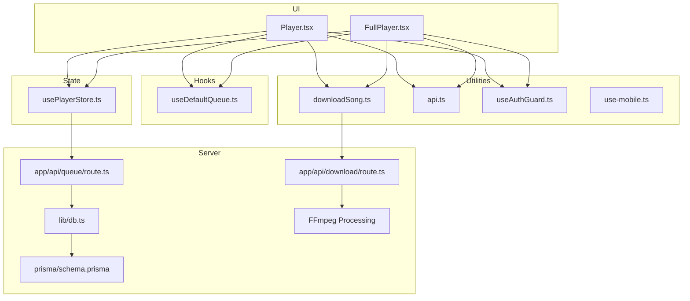

**Diagram sources**
- [Player.tsx:18](file://components/Player.tsx#L18)
- [FullPlayer.tsx:18](file://components/FullPlayer.tsx#L18)
- [useDefaultQueue.ts:10](file://hooks/useDefaultQueue.ts#L10)
- [usePlayerStore.ts:12](file://store/usePlayerStore.ts#L12)
- [downloadSong.ts:8](file://lib/downloadSong.ts#L8)
- [route.ts:1](file://app/api/download/route.ts#L1)
- [api.ts:79](file://lib/api.ts#L79)
- [useAuthGuard.ts:12](file://hooks/useAuthGuard.ts#L12)
- [use-mobile.ts:5](file://hooks/use-mobile.ts#L5)
- [route.ts:4](file://app/api/queue/route.ts#L4)
- [db.ts:1](file://lib/db.ts#L1)
- [schema.prisma:73](file://prisma/schema.prisma#L73)

**Section sources**
- [Player.tsx:19-320](file://components/Player.tsx#L19-L320)
- [FullPlayer.tsx:22-656](file://components/FullPlayer.tsx#L22-L656)
- [usePlayerStore.ts:12-157](file://store/usePlayerStore.ts#L12-L157)
- [useDefaultQueue.ts:1-85](file://hooks/useDefaultQueue.ts#L1-L85)
- [downloadSong.ts:1-66](file://lib/downloadSong.ts#L1-L66)
- [route.ts:1-150](file://app/api/download/route.ts#L1-L150)
- [api.ts:73-90](file://lib/api.ts#L73-L90)
- [useAuthGuard.ts:12-29](file://hooks/useAuthGuard.ts#L12-L29)
- [use-mobile.ts:5-19](file://hooks/use-mobile.ts#L5-L19)
- [route.ts:4-86](file://app/api/queue/route.ts#L4-L86)
- [db.ts:1-10](file://lib/db.ts#L1-L10)
- [schema.prisma:1-111](file://prisma/schema.prisma#L1-L111)

## Core Components
- Player (mini-player): renders playback controls, progress bar, dual-queue panel, and downloads; integrates with the audio element and keyboard shortcuts.
- FullPlayer (full-screen): expanded controls, seek bar, volume slider, "Up Next" suggestions, gesture controls, and actions.
- Zustand store: manages current song, dual queues (userQueue and defaultQueue), playback state, shuffle/repeat, favorites, and persistence.
- useDefaultQueue hook: automatically generates default queue from artist/album sources when user queue is empty.
- Queue API: server endpoints to fetch, add, clear, and remove queue items per user.
- Download utility: orchestrates fetching audio and triggering browser downloads with server-side FFmpeg processing.
- Server-side download API: converts M4A to MP3 with embedded ID3 metadata and album art.
- Utilities: API helpers for images, durations, and normalization; auth gating hook; mobile detection.

**Updated** Both Player and FullPlayer components now feature dual-queue system with automatic queue generation from artist/album sources, comprehensive gesture controls for intuitive track navigation, and browser back button handling for seamless user experience.

**Section sources**
- [Player.tsx:19-320](file://components/Player.tsx#L19-L320)
- [FullPlayer.tsx:22-656](file://components/FullPlayer.tsx#L22-L656)
- [usePlayerStore.ts:12-157](file://store/usePlayerStore.ts#L12-L157)
- [useDefaultQueue.ts:1-85](file://hooks/useDefaultQueue.ts#L1-L85)
- [downloadSong.ts:8-66](file://lib/downloadSong.ts#L8-L66)
- [route.ts:25-150](file://app/api/download/route.ts#L25-L150)
- [api.ts:73-90](file://lib/api.ts#L73-L90)
- [useAuthGuard.ts:12-29](file://hooks/useAuthGuard.ts#L12-L29)
- [use-mobile.ts:5-19](file://hooks/use-mobile.ts#L5-L19)

## Architecture Overview
The player architecture combines a client-side state store with server-backed queue persistence and UI components that synchronize playback state via an HTMLAudioElement. The enhanced architecture now includes automatic queue generation, dual-queue management, and comprehensive gesture controls.

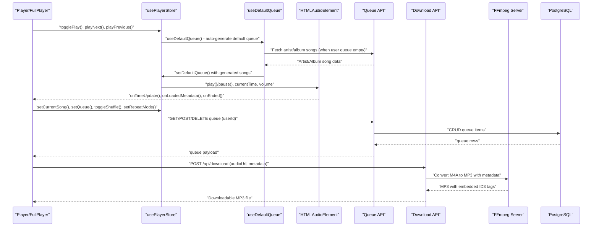

**Diagram sources**
- [Player.tsx:28-29](file://components/Player.tsx#L28-L29)
- [useDefaultQueue.ts:41-83](file://hooks/useDefaultQueue.ts#L41-L83)
- [FullPlayer.tsx:123-146](file://components/FullPlayer.tsx#L123-L146)
- [downloadSong.ts:27](file://lib/downloadSong.ts#L27)
- [route.ts:25](file://app/api/download/route.ts#L25)
- [usePlayerStore.ts:70-128](file://store/usePlayerStore.ts#L70-L128)
- [route.ts:4](file://app/api/queue/route.ts#L4)

## Detailed Component Analysis

### Player (Mini-Player)
Responsibilities:
- Manage audio element lifecycle and events (load, play/pause, time update, ended).
- Synchronize UI with playback state (progress, duration, volume, mute).
- Keyboard shortcuts for play/pause, seek, volume, and mute.
- Dual-queue panel overlay with separate user and default queue sections.
- Download button with server-side FFmpeg processing and like/favorite with auth gating.
- Full-screen player trigger.

Key behaviors:
- Audio initialization and playback control are handled via refs and effects.
- Progress calculation uses currentTime/duration.
- Repeat mode cycles among none/all/one; special indicator shown for one-repeat.
- Shuffle toggles random selection in dual-queue progression.
- Dual-queue panel shows both user-added songs and automatically generated default songs.
- Download button triggers server-side audio conversion with metadata embedding.
- Automatic default queue generation when user queue is empty.

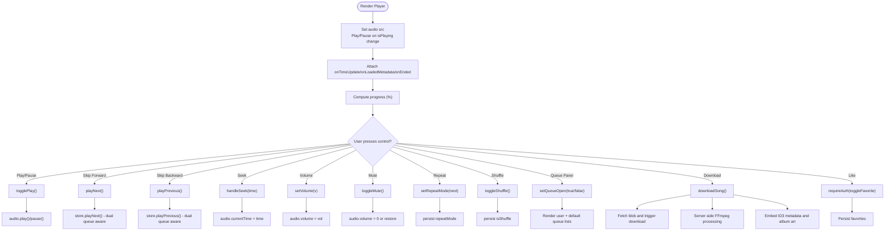

**Diagram sources**
- [Player.tsx:33-82](file://components/Player.tsx#L33-L82)
- [Player.tsx:104-180](file://components/Player.tsx#L104-L180)
- [Player.tsx:193-233](file://components/Player.tsx#L193-L233)
- [Player.tsx:171-173](file://components/Player.tsx#L171-L173)
- [usePlayerStore.ts:70-128](file://store/usePlayerStore.ts#L70-L128)
- [useDefaultQueue.ts:41-83](file://hooks/useDefaultQueue.ts#L41-L83)
- [downloadSong.ts:8-66](file://lib/downloadSong.ts#L8-L66)
- [route.ts:74-104](file://app/api/download/route.ts#L74-L104)
- [useAuthGuard.ts:16-25](file://hooks/useAuthGuard.ts#L16-L25)

**Section sources**
- [Player.tsx:19-320](file://components/Player.tsx#L19-L320)
- [usePlayerStore.ts:70-128](file://store/usePlayerStore.ts#L70-L128)
- [useDefaultQueue.ts:1-85](file://hooks/useDefaultQueue.ts#L1-L85)
- [downloadSong.ts:8-66](file://lib/downloadSong.ts#L8-L66)
- [useAuthGuard.ts:16-25](file://hooks/useAuthGuard.ts#L16-L25)

### FullPlayer (Full-Screen Player)
Responsibilities:
- Expanded controls and seek/volume sliders with gesture support.
- Suggestions panel powered by a remote API.
- Dual-queue management with separate user and default sections.
- Comprehensive gesture controls: album cover swipe for track navigation, pull-to-close for player dismissal.
- Browser back button handling for seamless navigation.
- Download, like, and add-to-playlist actions with auth gating.
- Smooth animations and responsive layout.
- Server-side audio processing with FFmpeg for high-quality MP3 conversion.

Behavior highlights:
- Uses react-query to fetch song suggestions.
- Comprehensive touch gesture handling for album art navigation and player dismissal.
- Browser back button intercepts to close FullPlayer and queue panel instead of navigating back.
- Seek and volume sliders update state and reflect current values.
- Dual-queue logic mirrors mini-player with priority-based progression.
- Background album art with blur effect and gradient overlay.
- Download button triggers server-side audio conversion with metadata embedding.

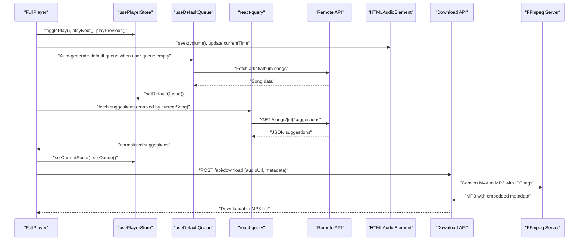

**Diagram sources**
- [FullPlayer.tsx:44-51](file://components/FullPlayer.tsx#L44-L51)
- [FullPlayer.tsx:59-62](file://components/FullPlayer.tsx#L59-L62)
- [FullPlayer.tsx:164-209](file://components/FullPlayer.tsx#L164-L209)
- [FullPlayer.tsx:186-188](file://components/FullPlayer.tsx#L186-L188)
- [FullPlayer.tsx:151](file://components/FullPlayer.tsx#L151)
- [usePlayerStore.ts:70-128](file://store/usePlayerStore.ts#L70-L128)
- [useDefaultQueue.ts:41-83](file://hooks/useDefaultQueue.ts#L41-L83)
- [route.ts:25](file://app/api/download/route.ts#L25)

**Section sources**
- [FullPlayer.tsx:22-656](file://components/FullPlayer.tsx#L22-L656)
- [usePlayerStore.ts:70-128](file://store/usePlayerStore.ts#L70-L128)
- [useDefaultQueue.ts:1-85](file://hooks/useDefaultQueue.ts#L1-L85)

### Dual-Queue System and useDefaultQueue Hook
**Updated** The player now features a sophisticated dual-queue system with automatic queue generation.

Key components:
- userQueue: Songs added by user (higher priority)
- defaultQueue: Automatically generated songs from same artist/album (lower priority)
- useDefaultQueue hook: Manages automatic queue generation from external APIs
- Priority-based progression: userQueue songs play before defaultQueue songs

Automatic queue generation logic:
- Fetches artist songs when current song has primary artist
- Fetches album songs when current song has album
- Excludes current song and duplicates from both sources
- Limits total to 50 songs with artist songs prioritized
- Clears default queue when user adds their own songs
- Uses caching (5-minute stale time) for performance

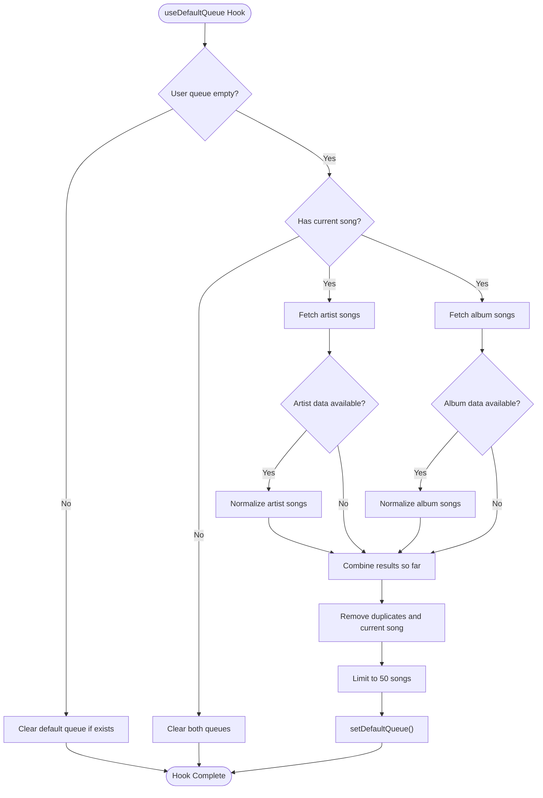

**Diagram sources**
- [useDefaultQueue.ts:13-25](file://hooks/useDefaultQueue.ts#L13-L25)
- [useDefaultQueue.ts:27-39](file://hooks/useDefaultQueue.ts#L27-L39)
- [useDefaultQueue.ts:41-83](file://hooks/useDefaultQueue.ts#L41-L83)
- [usePlayerStore.ts:80-85](file://store/usePlayerStore.ts#L80-L85)

**Section sources**
- [useDefaultQueue.ts:1-85](file://hooks/useDefaultQueue.ts#L1-L85)
- [usePlayerStore.ts:12-45](file://store/usePlayerStore.ts#L12-L45)

### Gesture Controls and Browser Back Button Handling
**Updated** The FullPlayer now features comprehensive gesture controls and intelligent back button handling.

Gesture controls:
- Album cover swipe: Left swipe advances to next song, right swipe goes to previous song
- Pull-to-close: Swipe down from top edge closes the player when at scroll top
- Touch interaction: Prevents pull-to-refresh during album cover manipulation

Browser back button handling:
- FullPlayer: Intercepts back button when open, closes player instead of navigating back
- Queue panel: Intercepts back button when open, closes queue panel instead of navigating back
- History management: Uses pushState to enable popstate event interception

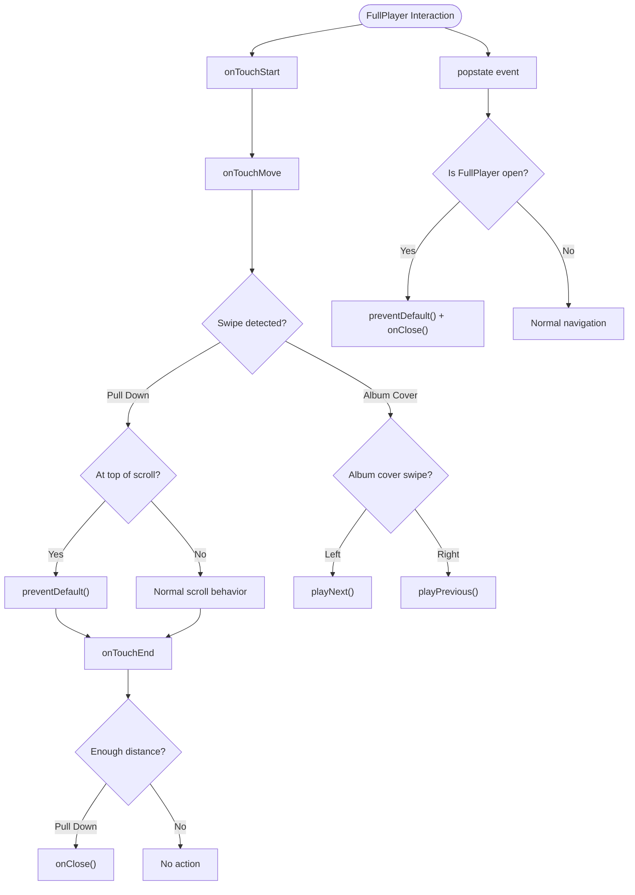

**Diagram sources**
- [FullPlayer.tsx:46-177](file://components/FullPlayer.tsx#L46-L177)
- [FullPlayer.tsx:123-146](file://components/FullPlayer.tsx#L123-L146)
- [FullPlayer.tsx:199-215](file://components/FullPlayer.tsx#L199-L215)

**Section sources**
- [FullPlayer.tsx:46-177](file://components/FullPlayer.tsx#L46-L177)
- [FullPlayer.tsx:123-146](file://components/FullPlayer.tsx#L123-L146)
- [FullPlayer.tsx:199-215](file://components/FullPlayer.tsx#L199-L215)

### Zustand State Store (usePlayerStore)
**Updated** Enhanced state store with dual-queue management and comprehensive queue operations.

State shape:
- Playback: currentSong, userQueue, defaultQueue, isPlaying, volume, repeatMode, isShuffle, isQueueOpen
- Collections: favorites, recentlyPlayed, user
- Actions: comprehensive queue management with dual-queue support

Enhanced queue management:
- setQueue: Legacy compatibility (sets userQueue)
- addToQueue: Adds to userQueue (priority queue)
- removeFromQueue: Removes from both queues
- clearQueue: Clears both userQueue and defaultQueue
- clearUserQueue: Clears only userQueue
- setDefaultQueue: Sets defaultQueue
- getFullQueue: Returns combined queue (userQueue + defaultQueue)
- playNext/playPrevious: Dual-queue aware progression with priority handling

Priority-based progression logic:
- userQueue songs play before defaultQueue songs
- When moving past userQueue songs, they're automatically removed from userQueue
- Shuffle mode works across both queues
- Repeat modes respect dual-queue structure

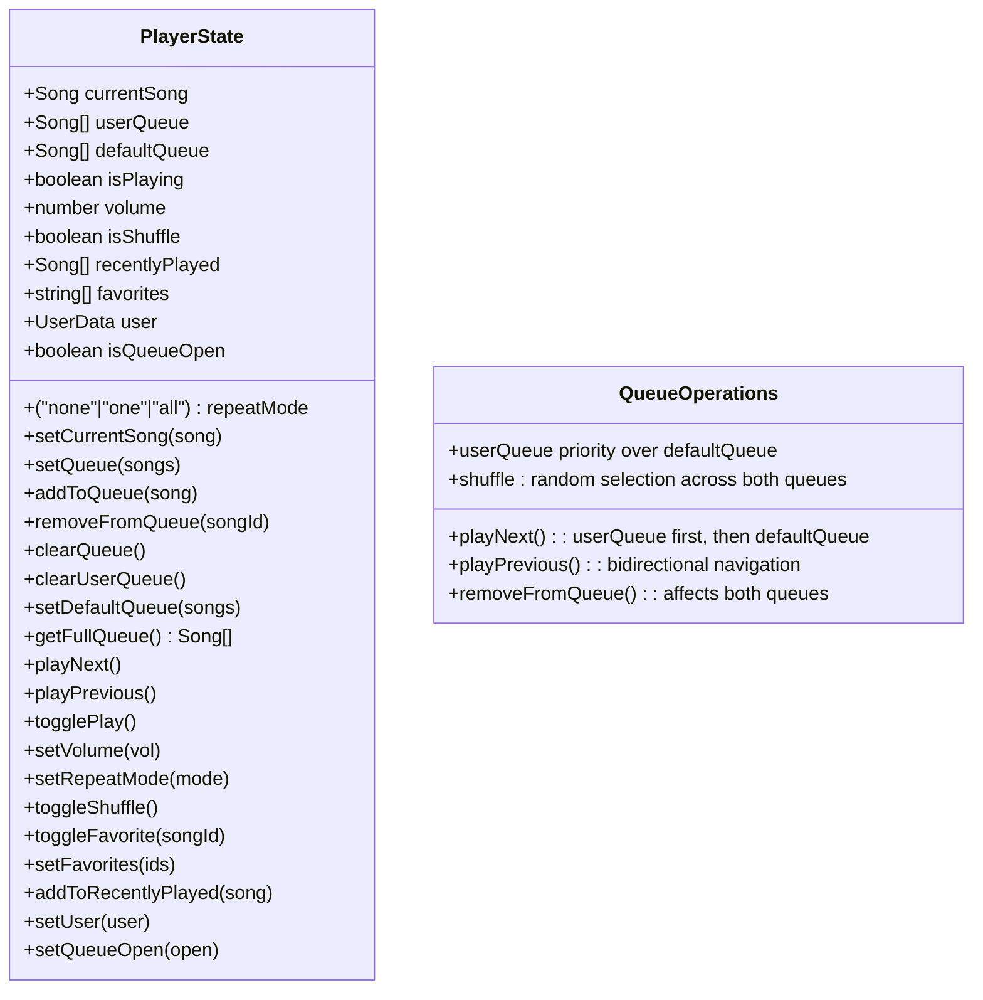

**Diagram sources**
- [usePlayerStore.ts:12-45](file://store/usePlayerStore.ts#L12-L45)
- [usePlayerStore.ts:66-85](file://store/usePlayerStore.ts#L66-L85)
- [usePlayerStore.ts:86-128](file://store/usePlayerStore.ts#L86-L128)

**Section sources**
- [usePlayerStore.ts:12-157](file://store/usePlayerStore.ts#L12-L157)

### Queue Management and Persistent Storage
- Client-side dual-queue: managed in-memory via Zustand store; supports add/remove/clear and dual-queue-aware navigation.
- Server-side queue: persisted per user with ordered positions; supports fetch, add, clear, and delete.
- Schema defines QueueItem with JSON songData and position ordering.

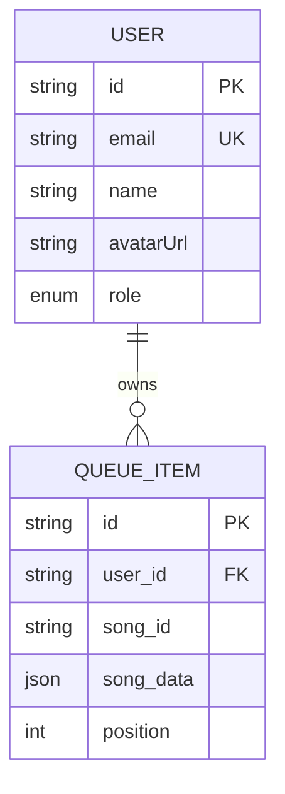

**Diagram sources**
- [schema.prisma:73-84](file://prisma/schema.prisma#L73-L84)
- [route.ts:9-21](file://app/api/queue/route.ts#L9-L21)

**Section sources**
- [route.ts:4-86](file://app/api/queue/route.ts#L4-L86)
- [schema.prisma:73-84](file://prisma/schema.prisma#L73-L84)
- [db.ts:1-10](file://lib/db.ts#L1-L10)

### Audio Element Management and Progress Tracking
- Audio element is controlled via a ref; src updates when currentSong changes; play/pause synchronized with isPlaying.
- Progress tracking uses onTimeUpdate to keep currentTime; duration is captured on onLoadedMetadata.
- Seek functionality updates currentTime and the audio element's position.
- Dual-queue aware repeat logic: repeat-one restarts playback; otherwise, playNext selects next item from combined queue.

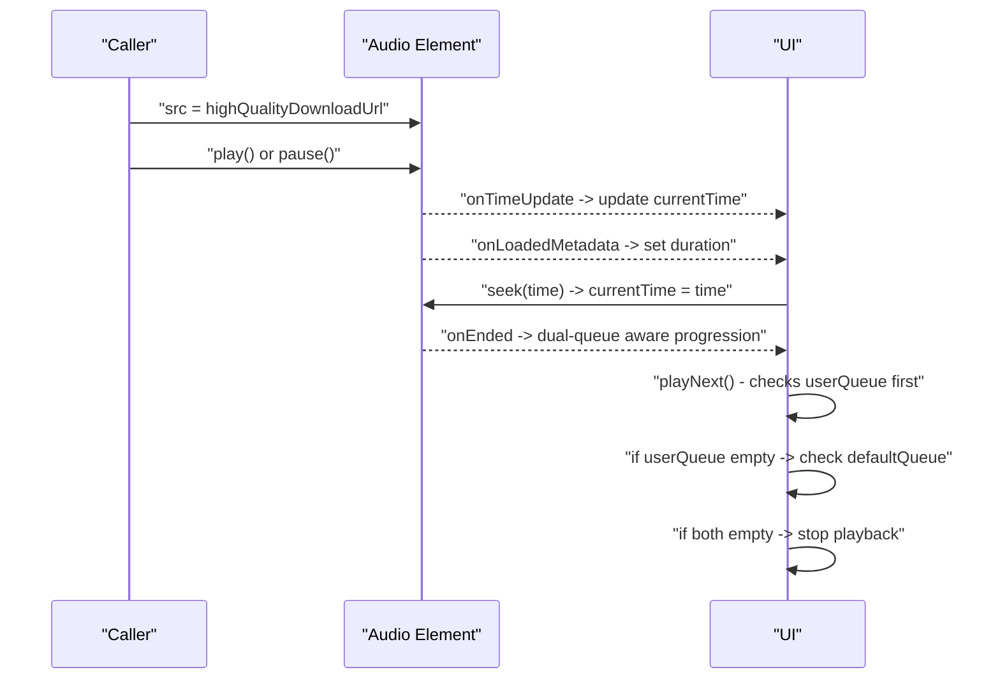

**Diagram sources**
- [Player.tsx:33-61](file://components/Player.tsx#L33-L61)
- [usePlayerStore.ts:86-128](file://store/usePlayerStore.ts#L86-L128)

**Section sources**
- [Player.tsx:33-61](file://components/Player.tsx#L33-L61)
- [usePlayerStore.ts:86-128](file://store/usePlayerStore.ts#L86-L128)

### Enhanced Download Functionality
**Updated** The download system now features comprehensive server-side audio processing with FFmpeg for high-quality MP3 conversion.

Key features:
- Server-side audio conversion from M4A to MP3 with 320kbps bitrate
- Embedded ID3 metadata including title, artist, album, year, and genre
- Album art embedding with proper image handling
- Toast notifications for processing status and completion
- Error handling with detailed error messages
- Large file support up to 50MB with increased API limits

Download workflow:
1. User clicks download button in Player or FullPlayer
2. Client sends song metadata and audio URL to /api/download
3. Server downloads audio file and optional album art
4. FFmpeg processes audio with metadata embedding
5. Converted MP3 is returned to client for download
6. Temporary files are cleaned up automatically

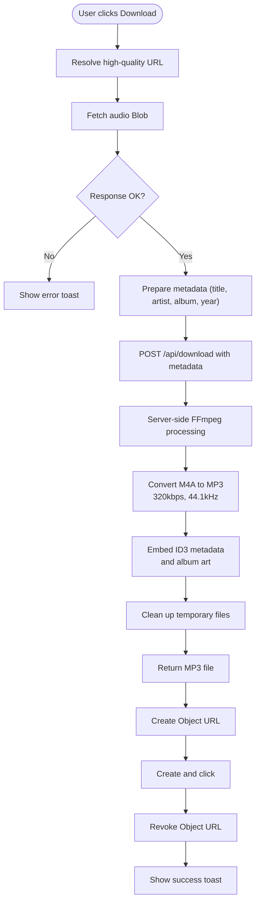

**Diagram sources**
- [downloadSong.ts:8-66](file://lib/downloadSong.ts#L8-L66)
- [route.ts:25-150](file://app/api/download/route.ts#L25-L150)
- [api.ts:79-83](file://lib/api.ts#L79-L83)

**Section sources**
- [downloadSong.ts:8-66](file://lib/downloadSong.ts#L8-L66)
- [route.ts:25-150](file://app/api/download/route.ts#L25-L150)
- [api.ts:79-83](file://lib/api.ts#L79-L83)

### Keyboard Shortcuts
- Space: toggle play/pause
- ArrowRight / ArrowLeft: skip forward/backward (with Ctrl/Cmd modifiers to jump to next/previous)
- ArrowUp / ArrowDown: increase/decrease volume
- KeyM: toggle mute

**Section sources**
- [Player.tsx:68-82](file://components/Player.tsx#L68-L82)

### Responsive Design and Accessibility
- Responsive breakpoints: compact controls on mobile; expanded controls on larger screens.
- Motion animations for slide-in/out panels and transitions.
- Accessible controls: buttons with clear icons and tooltips; sliders with numeric labels; focus-friendly interactions.
- Safe area and mobile navigation adjustments via CSS variables.
- Download buttons are accessible with proper ARIA labels and keyboard navigation.
- Dual-queue panel provides clear visual distinction between user and default queue sections.

**Section sources**
- [Player.tsx:91-96](file://components/Player.tsx#L91-L96)
- [Player.tsx:134-180](file://components/Player.tsx#L134-L180)
- [FullPlayer.tsx:75-83](file://components/FullPlayer.tsx#L75-L83)

## Dependency Analysis
- Player and FullPlayer depend on usePlayerStore for state and actions.
- useDefaultQueue hook depends on react-query for external API calls and usePlayerStore for state updates.
- Both components rely on api.ts for image and duration helpers and download URL resolution.
- FullPlayer additionally queries song suggestions via react-query.
- Queue persistence depends on route.ts and Prisma schema.
- Auth gating is provided by useAuthGuard; mobile detection by use-mobile.ts.
- Download functionality depends on server-side /api/download endpoint with FFmpeg processing.

**Updated** Enhanced dependency graph now includes useDefaultQueue hook integration and comprehensive gesture control dependencies.

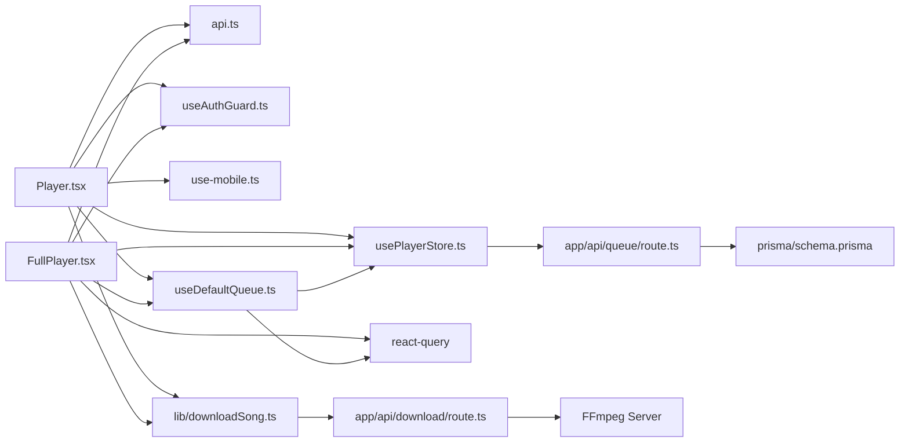

**Diagram sources**
- [Player.tsx:18-26](file://components/Player.tsx#L18-L26)
- [FullPlayer.tsx:18-44](file://components/FullPlayer.tsx#L18-L44)
- [usePlayerStore.ts:43-156](file://store/usePlayerStore.ts#L43-L156)
- [useDefaultQueue.ts:3-6](file://hooks/useDefaultQueue.ts#L3-L6)
- [api.ts:37-83](file://lib/api.ts#L37-L83)
- [route.ts:4-86](file://app/api/queue/route.ts#L4-L86)
- [schema.prisma:73-84](file://prisma/schema.prisma#L73-L84)
- [useAuthGuard.ts:12-29](file://hooks/useAuthGuard.ts#L12-L29)
- [use-mobile.ts:5-19](file://hooks/use-mobile.ts#L5-L19)
- [downloadSong.ts:1](file://lib/downloadSong.ts#L1)
- [route.ts:1](file://app/api/download/route.ts#L1)

**Section sources**
- [Player.tsx:18-26](file://components/Player.tsx#L18-L26)
- [FullPlayer.tsx:18-44](file://components/FullPlayer.tsx#L18-L44)
- [usePlayerStore.ts:43-156](file://store/usePlayerStore.ts#L43-L156)
- [useDefaultQueue.ts:3-6](file://hooks/useDefaultQueue.ts#L3-L6)
- [api.ts:37-83](file://lib/api.ts#L37-L83)
- [route.ts:4-86](file://app/api/queue/route.ts#L4-L86)
- [schema.prisma:73-84](file://prisma/schema.prisma#L73-L84)
- [useAuthGuard.ts:12-29](file://hooks/useAuthGuard.ts#L12-L29)
- [use-mobile.ts:5-19](file://hooks/use-mobile.ts#L5-L19)

## Performance Considerations
- Audio element lifecycle: avoid redundant play calls; only set src when currentSong changes.
- State updates: minimize re-renders by using Zustand selectors and memoization where appropriate.
- Dual-queue operations: efficient filtering and combination operations; cache invalidation for automatic queue generation.
- External API calls: use caching (5-minute stale time) for artist/album song fetching; debounce rapid queue changes.
- Queue operations: deduplicate adds and filter removes efficiently across both queues.
- Downloads: use streaming fetch and revoke object URLs promptly; server-side processing handles large files efficiently.
- Server-side optimization: FFmpeg processing runs on server with proper resource management.
- Rendering: hide queue panel offscreen when closed; lazy-load suggestion images.
- Memory: clear intervals/timers if added later; dispose of event listeners on unmount.
- Gesture controls: optimize touch event handling to prevent unnecessary re-renders.

**Updated** Added considerations for dual-queue system performance, automatic queue generation caching, and gesture control optimization.

## Troubleshooting Guide
Common issues and remedies:
- Audio does not start: ensure src is set and isPlaying is true; catch and log play promise rejections.
- Progress bar not updating: verify onTimeUpdate fires and currentTime is updated; confirm duration is loaded.
- Dual-queue not working: check useDefaultQueue hook execution; verify userQueue is empty for automatic generation.
- Automatic queue not loading: confirm external API endpoints are reachable; check artist/album IDs exist.
- Gesture controls not responding: verify touch event handlers are attached; check touch coordinates calculation.
- Back button not working: ensure popstate event listeners are registered; verify history state management.
- Queue not persisting: check userId passed to queue endpoints; ensure Prisma model and route match.
- Download fails: confirm download URL exists; inspect network tab for fetch errors; handle non-OK responses.
- Auth-required actions fail silently: ensure useAuthGuard is invoked before toggling favorites.
- Server-side conversion errors: check FFmpeg installation and permissions; verify audio file integrity.
- Metadata embedding failures: ensure required metadata fields are provided; verify album art URL accessibility.
- Large file processing timeouts: adjust server configuration and consider file size limits.

**Updated** Added troubleshooting guidance for dual-queue system, gesture controls, and browser back button handling.

**Section sources**
- [Player.tsx:33-44](file://components/Player.tsx#L33-L44)
- [Player.tsx:51-57](file://components/Player.tsx#L51-L57)
- [useDefaultQueue.ts:41-83](file://hooks/useDefaultQueue.ts#L41-L83)
- [FullPlayer.tsx:46-177](file://components/FullPlayer.tsx#L46-L177)
- [FullPlayer.tsx:123-146](file://components/FullPlayer.tsx#L123-L146)
- [route.ts:6-22](file://app/api/queue/route.ts#L6-L22)
- [downloadSong.ts:19-41](file://lib/downloadSong.ts#L19-L41)
- [useAuthGuard.ts:16-25](file://hooks/useAuthGuard.ts#L16-L25)
- [route.ts:125-138](file://app/api/download/route.ts#L125-L138)

## Conclusion
The audio player integrates a robust UI layer with a centralized state store and server-backed queue persistence. It provides comprehensive playback controls, responsive layouts, keyboard shortcuts, downloads, and thoughtful UX patterns. The enhanced architecture now includes sophisticated dual-queue system with automatic queue generation from artist/album sources, comprehensive gesture controls for intuitive track navigation, intelligent browser back button handling, and enhanced queue panel with separate user and default queue sections. The architecture leverages modern React patterns (refs, effects, hooks) and state management (Zustand) while maintaining performance and reliability through efficient server-side processing, dual-queue management, and comprehensive user interaction handling.