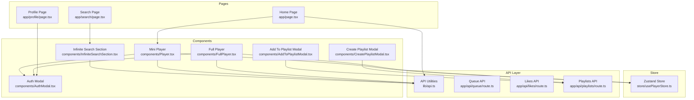
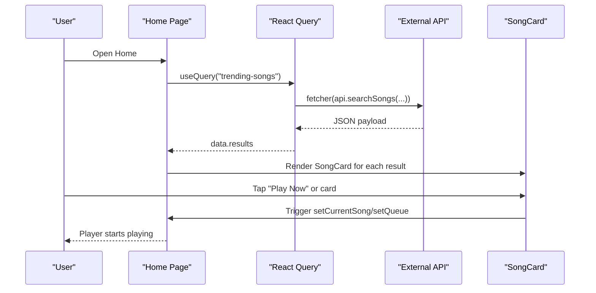
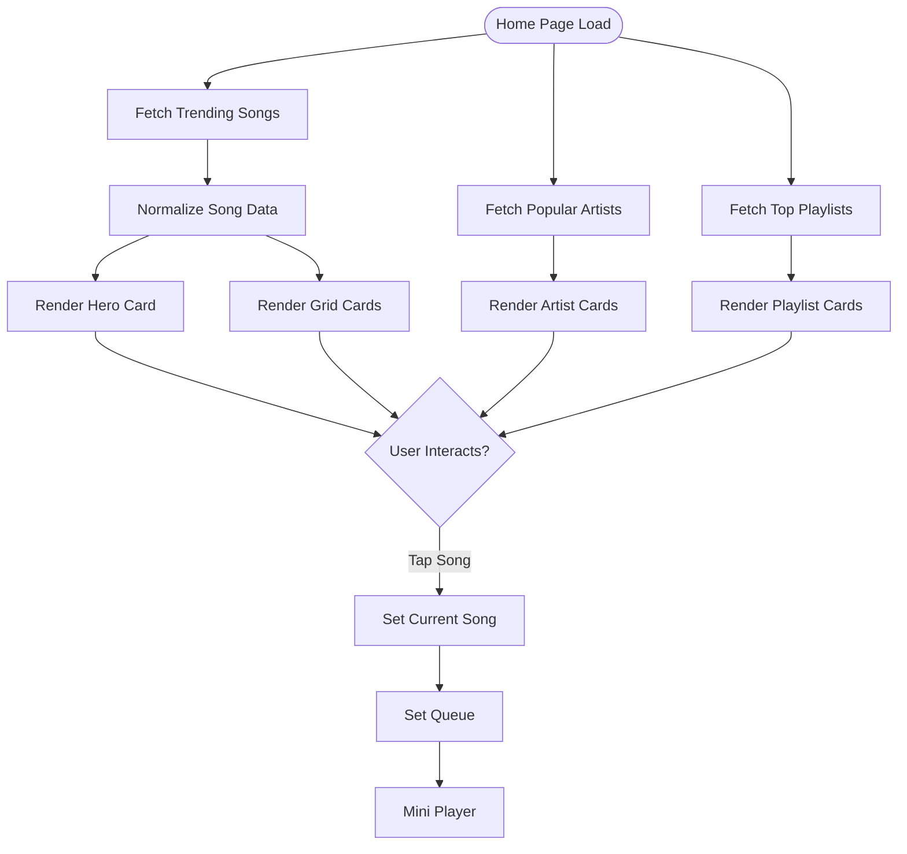
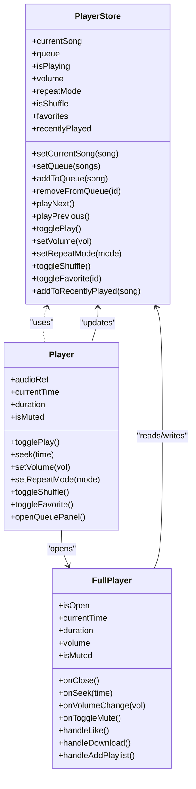
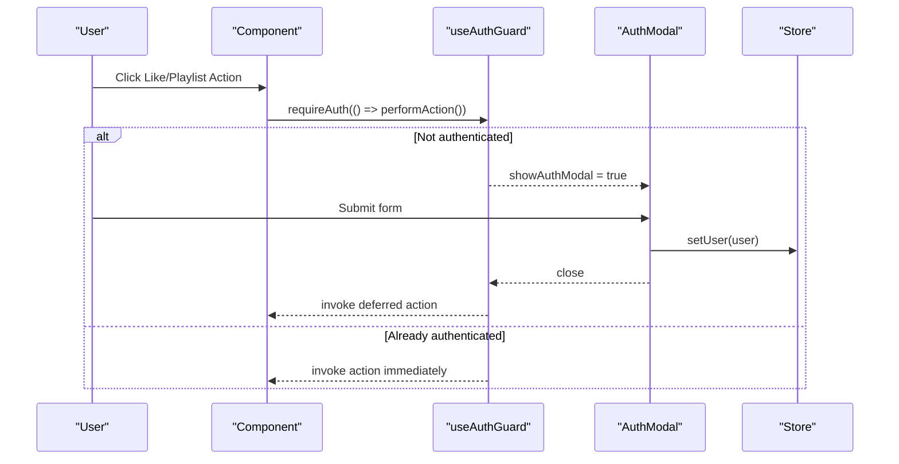
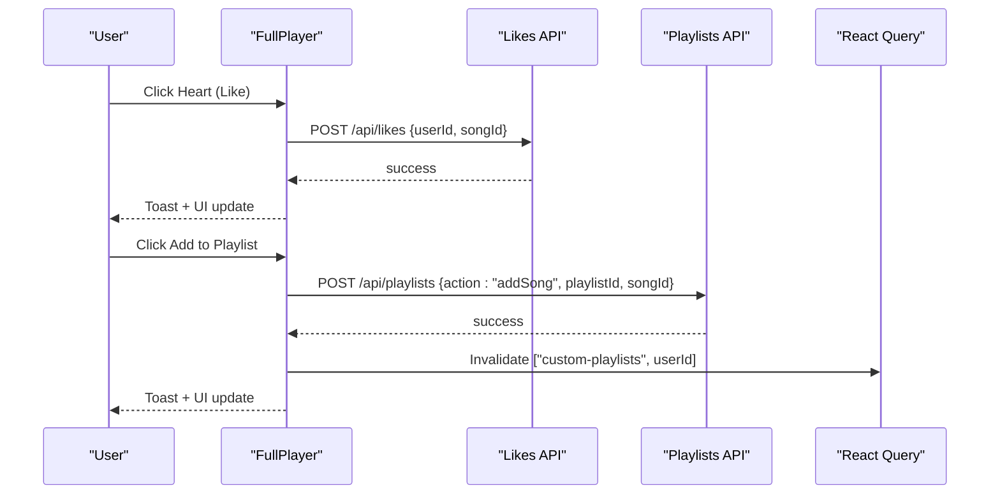
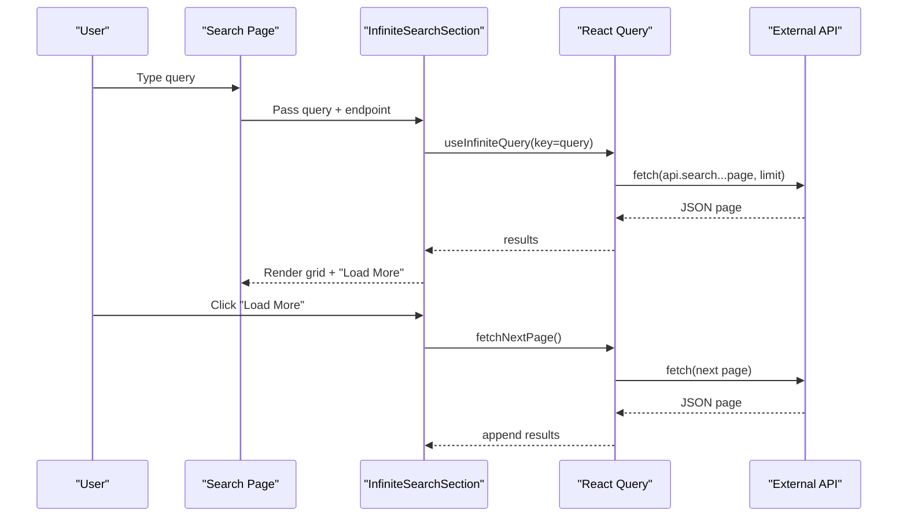
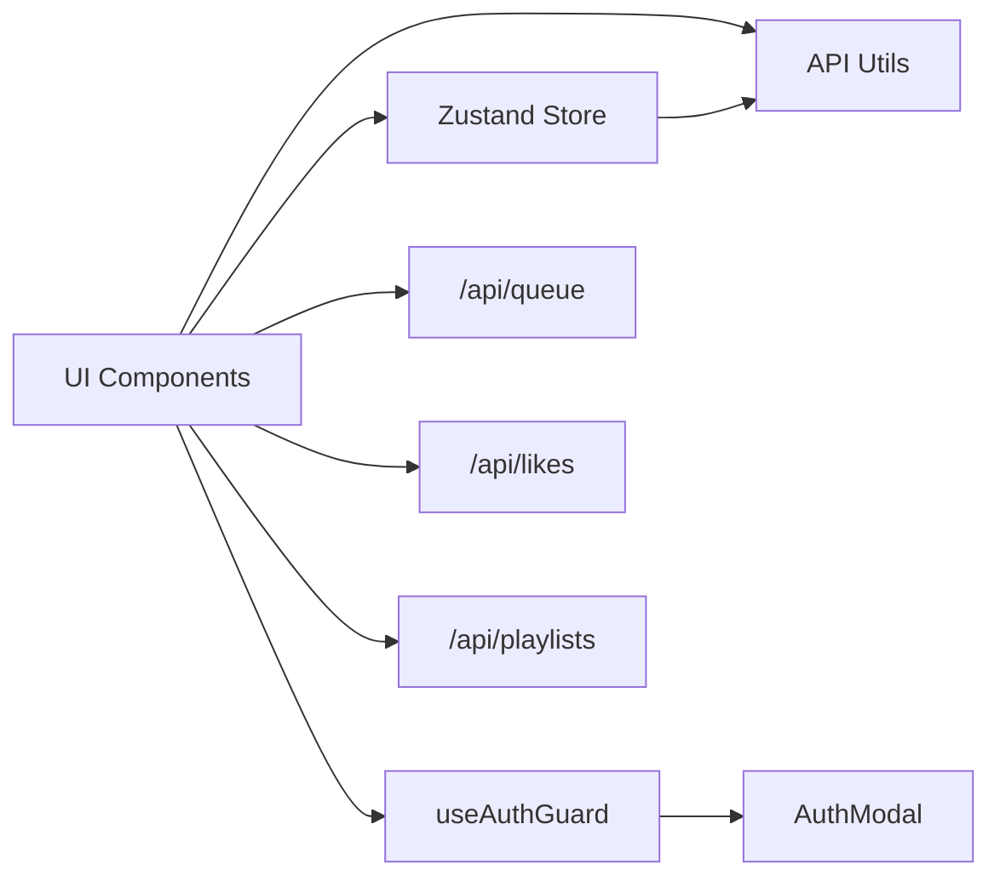

# Core Features

<cite>
**Referenced Files in This Document**
- [app/page.tsx](file://app/page.tsx)
- [app/search/page.tsx](file://app/search/page.tsx)
- [components/InfiniteSearchSection.tsx](file://components/InfiniteSearchSection.tsx)
- [components/Player.tsx](file://components/Player.tsx)
- [components/FullPlayer.tsx](file://components/FullPlayer.tsx)
- [store/usePlayerStore.ts](file://store/usePlayerStore.ts)
- [lib/api.ts](file://lib/api.ts)
- [app/api/queue/route.ts](file://app/api/queue/route.ts)
- [app/api/likes/route.ts](file://app/api/likes/route.ts)
- [app/api/playlists/route.ts](file://app/api/playlists/route.ts)
- [components/AddToPlaylistModal.tsx](file://components/AddToPlaylistModal.tsx)
- [components/CreatePlaylistModal.tsx](file://components/CreatePlaylistModal.tsx)
- [hooks/useAuthGuard.ts](file://hooks/useAuthGuard.ts)
- [components/AuthModal.tsx](file://components/AuthModal.tsx)
- [app/profile/page.tsx](file://app/profile/page.tsx)
</cite>

## Table of Contents
1. [Introduction](#introduction)
2. [Project Structure](#project-structure)
3. [Core Components](#core-components)
4. [Architecture Overview](#architecture-overview)
5. [Detailed Component Analysis](#detailed-component-analysis)
6. [Dependency Analysis](#dependency-analysis)
7. [Performance Considerations](#performance-considerations)
8. [Troubleshooting Guide](#troubleshooting-guide)
9. [Conclusion](#conclusion)
10. [Appendices](#appendices)

## Introduction
This document explains SonicStream’s core features and how they work together: music discovery and trending content, an advanced audio player with queue management, user authentication and profile management, social features like likes and playlists, and search functionality with infinite scrolling. It covers implementation approaches, UI components, integration patterns, user workflows, feature relationships, performance considerations, and practical usage scenarios.

## Project Structure
SonicStream is a Next.js application with a clear separation of concerns:
- Pages under app/ define routes and orchestrate data fetching and rendering.
- Components under components/ encapsulate UI and reusable logic.
- Store under store/ manages global player state with persistence.
- Hooks under hooks/ provide cross-cutting behaviors like authentication gating.
- API routes under app/api/ implement server-backed features (likes, playlists, queue).
- Utilities under lib/ centralize API endpoints, normalization, and helpers.

**Diagram sources**
- [app/page.tsx:1-204](file://app/page.tsx#L1-L204)
- [app/search/page.tsx:1-129](file://app/search/page.tsx#L1-L129)
- [components/InfiniteSearchSection.tsx:1-90](file://components/InfiniteSearchSection.tsx#L1-L90)
- [components/Player.tsx:1-251](file://components/Player.tsx#L1-L251)
- [components/FullPlayer.tsx:1-243](file://components/FullPlayer.tsx#L1-L243)
- [store/usePlayerStore.ts:1-128](file://store/usePlayerStore.ts#L1-L128)
- [lib/api.ts:1-153](file://lib/api.ts#L1-L153)
- [app/api/queue/route.ts:1-86](file://app/api/queue/route.ts#L1-L86)
- [app/api/likes/route.ts:1-55](file://app/api/likes/route.ts#L1-L55)
- [app/api/playlists/route.ts:1-90](file://app/api/playlists/route.ts#L1-L90)
- [components/AddToPlaylistModal.tsx:1-179](file://components/AddToPlaylistModal.tsx#L1-L179)
- [components/CreatePlaylistModal.tsx:1-148](file://components/CreatePlaylistModal.tsx#L1-L148)
- [components/AuthModal.tsx:1-149](file://components/AuthModal.tsx#L1-L149)
- [app/profile/page.tsx:1-84](file://app/profile/page.tsx#L1-L84)

**Section sources**
- [app/page.tsx:1-204](file://app/page.tsx#L1-L204)
- [app/search/page.tsx:1-129](file://app/search/page.tsx#L1-L129)
- [components/Player.tsx:1-251](file://components/Player.tsx#L1-L251)
- [store/usePlayerStore.ts:1-128](file://store/usePlayerStore.ts#L1-L128)
- [lib/api.ts:1-153](file://lib/api.ts#L1-L153)

## Core Components
- Music Discovery and Trending Content: Home page queries trending songs, popular artists, and featured playlists from an external API and renders them with cards and skeleton loaders.
- Advanced Audio Player: Mini and full players manage playback, seek, volume, shuffle, repeat, queue panel, and related suggestions.
- User Authentication and Profile Management: Auth modal handles sign-in/sign-up and password reset; profile page displays user stats and allows sign-out.
- Social Features: Likes toggled via auth-gated actions; playlists created and managed with add/remove song operations.
- Search with Infinite Scrolling: Search page supports category browsing and infinite pagination per content type.

**Section sources**
- [app/page.tsx:34-202](file://app/page.tsx#L34-L202)
- [components/Player.tsx:19-250](file://components/Player.tsx#L19-L250)
- [components/FullPlayer.tsx:34-242](file://components/FullPlayer.tsx#L34-L242)
- [hooks/useAuthGuard.ts:12-28](file://hooks/useAuthGuard.ts#L12-L28)
- [components/AuthModal.tsx:14-148](file://components/AuthModal.tsx#L14-L148)
- [app/profile/page.tsx:9-83](file://app/profile/page.tsx#L9-L83)
- [app/search/page.tsx:20-120](file://app/search/page.tsx#L20-L120)
- [components/InfiniteSearchSection.tsx:23-89](file://components/InfiniteSearchSection.tsx#L23-L89)

## Architecture Overview
SonicStream uses a hybrid client-side rendering approach with React Query for caching and pagination, Zustand for local/global state, and Next.js API routes for persistent features (likes, playlists, queue). UI components are modular and composable, enabling shared patterns across pages.

**Diagram sources**
- [app/page.tsx:38-51](file://app/page.tsx#L38-L51)
- [lib/api.ts:39-43](file://lib/api.ts#L39-L43)
- [lib/api.ts:47-51](file://lib/api.ts#L47-L51)

**Section sources**
- [app/page.tsx:34-202](file://app/page.tsx#L34-L202)
- [lib/api.ts:39-90](file://lib/api.ts#L39-L90)

## Detailed Component Analysis

### Music Discovery and Trending Content
- Fetching: Home page performs three concurrent queries for trending songs, popular artists, and top playlists using a shared fetcher and API endpoints.
- Rendering: Uses skeleton loaders while loading; renders hero card for the #1 trending item and grids for lists.
- Interaction: Clicking a song sets the current song and queue; tapping “Quick Play” uses recently played items.

**Diagram sources**
- [app/page.tsx:38-51](file://app/page.tsx#L38-L51)
- [lib/api.ts:92-152](file://lib/api.ts#L92-L152)

**Section sources**
- [app/page.tsx:34-202](file://app/page.tsx#L34-L202)
- [lib/api.ts:39-90](file://lib/api.ts#L39-L90)

### Advanced Audio Player with Queue Management
- State: Centralized in Zustand store with fields for current song, queue, playback controls, shuffle/repeat, favorites, and recently played.
- Playback: Player component controls HTMLAudioElement, keyboard shortcuts, progress seek, and repeat modes.
- Queue Panel: Slide-out panel shows queue items with remove action; clicking an item replays it.
- Full Player: Modal view with album art, seek/volume controls, shuffle/repeat toggles, and “Up Next” suggestions.

**Diagram sources**
- [store/usePlayerStore.ts:12-41](file://store/usePlayerStore.ts#L12-L41)
- [components/Player.tsx:19-250](file://components/Player.tsx#L19-L250)
- [components/FullPlayer.tsx:22-37](file://components/FullPlayer.tsx#L22-L37)

**Section sources**
- [store/usePlayerStore.ts:43-127](file://store/usePlayerStore.ts#L43-L127)
- [components/Player.tsx:19-250](file://components/Player.tsx#L19-L250)
- [components/FullPlayer.tsx:34-242](file://components/FullPlayer.tsx#L34-L242)

### User Authentication and Profile Management
- Auth Gating: A hook checks if a user exists; if not, it opens the AuthModal and defers the requested action until signed in.
- Auth Modal: Handles sign-in, sign-up, and forgot-password flows; updates store user state on success.
- Profile Page: Displays user info and stats; allows sign-out by clearing user state.

**Diagram sources**
- [hooks/useAuthGuard.ts:12-28](file://hooks/useAuthGuard.ts#L12-L28)
- [components/AuthModal.tsx:26-50](file://components/AuthModal.tsx#L26-L50)
- [store/usePlayerStore.ts:114-115](file://store/usePlayerStore.ts#L114-L115)

**Section sources**
- [hooks/useAuthGuard.ts:12-28](file://hooks/useAuthGuard.ts#L12-L28)
- [components/AuthModal.tsx:14-148](file://components/AuthModal.tsx#L14-L148)
- [app/profile/page.tsx:9-83](file://app/profile/page.tsx#L9-L83)

### Social Features: Likes and Playlists
- Likes: Toggle liked/unlike via API route; UI reacts with toasts and heart icon state.
- Playlists: Create playlists and add/remove songs via API routes; modals fetch user playlists and invalidate queries to keep UI fresh.

**Diagram sources**
- [components/FullPlayer.tsx:64-69](file://components/FullPlayer.tsx#L64-L69)
- [app/api/likes/route.ts:17-35](file://app/api/likes/route.ts#L17-L35)
- [components/AddToPlaylistModal.tsx:43-76](file://components/AddToPlaylistModal.tsx#L43-L76)
- [app/api/playlists/route.ts:37-65](file://app/api/playlists/route.ts#L37-L65)

**Section sources**
- [app/api/likes/route.ts:1-55](file://app/api/likes/route.ts#L1-L55)
- [app/api/playlists/route.ts:1-90](file://app/api/playlists/route.ts#L1-L90)
- [components/AddToPlaylistModal.tsx:18-178](file://components/AddToPlaylistModal.tsx#L18-L178)
- [components/CreatePlaylistModal.tsx:17-147](file://components/CreatePlaylistModal.tsx#L17-L147)

### Search Functionality with Infinite Scrolling
- Search Page: Debounces query input, supports category browsing, and tabs for songs/artists/albums/playlists.
- InfiniteSearchSection: Implements infinite pagination with React Query, normalizes results, and renders appropriate cards.

**Diagram sources**
- [app/search/page.tsx:20-120](file://app/search/page.tsx#L20-L120)
- [components/InfiniteSearchSection.tsx:23-89](file://components/InfiniteSearchSection.tsx#L23-L89)
- [lib/api.ts:47-51](file://lib/api.ts#L47-L51)

**Section sources**
- [app/search/page.tsx:20-120](file://app/search/page.tsx#L20-L120)
- [components/InfiniteSearchSection.tsx:23-89](file://components/InfiniteSearchSection.tsx#L23-L89)
- [lib/api.ts:39-90](file://lib/api.ts#L39-L90)

## Dependency Analysis
- UI depends on Zustand store for playback state and user data.
- Player components depend on API utilities for image URLs, durations, and normalization.
- Persistent features (likes, playlists, queue) depend on Next.js API routes backed by Prisma.
- Auth gating is centralized via a hook used by multiple UI actions.

**Diagram sources**
- [store/usePlayerStore.ts:12-41](file://store/usePlayerStore.ts#L12-L41)
- [lib/api.ts:39-90](file://lib/api.ts#L39-L90)
- [hooks/useAuthGuard.ts:12-28](file://hooks/useAuthGuard.ts#L12-L28)
- [components/AuthModal.tsx:14-148](file://components/AuthModal.tsx#L14-L148)
- [app/api/queue/route.ts:1-86](file://app/api/queue/route.ts#L1-L86)
- [app/api/likes/route.ts:1-55](file://app/api/likes/route.ts#L1-L55)
- [app/api/playlists/route.ts:1-90](file://app/api/playlists/route.ts#L1-L90)

**Section sources**
- [store/usePlayerStore.ts:12-41](file://store/usePlayerStore.ts#L12-L41)
- [lib/api.ts:39-90](file://lib/api.ts#L39-L90)
- [hooks/useAuthGuard.ts:12-28](file://hooks/useAuthGuard.ts#L12-L28)
- [app/api/queue/route.ts:1-86](file://app/api/queue/route.ts#L1-L86)
- [app/api/likes/route.ts:1-55](file://app/api/likes/route.ts#L1-L55)
- [app/api/playlists/route.ts:1-90](file://app/api/playlists/route.ts#L1-L90)

## Performance Considerations
- Lazy Loading and Skeletons: Home page uses skeleton loaders during initial fetches to improve perceived performance.
- Infinite Pagination: InfiniteSearchSection paginates results to avoid large payloads; React Query caches pages and deduplicates requests.
- Normalization: normalizeSong ensures consistent shapes across diverse API responses, reducing UI branching and re-renders.
- Local State Persistence: Zustand persists volume, favorites, recent history, and user to localStorage to minimize server round-trips.
- Image Quality: getHighQualityImage selects the best available image URL to balance quality and bandwidth.
- Queue Persistence: Queue API supports server-backed queues for cross-device continuity; client-side queue is also available for immediate playback.

[No sources needed since this section provides general guidance]

## Troubleshooting Guide
- Player does not start: Verify currentSong has a valid download URL; check network connectivity to the external API.
- Infinite scroll not loading more: Ensure the last page returned fewer than the page size; confirm query key uniqueness per type/query.
- Like/Playlist actions fail: Confirm user is authenticated; check API response codes and error messages from routes.
- Auth modal does not open: Ensure useAuthGuard is invoked before performing protected actions; verify store user state.
- Queue not updating: For server-backed queue, ensure POST/DELETE actions are called with correct parameters; invalidate queries after mutations.

**Section sources**
- [lib/api.ts:73-83](file://lib/api.ts#L73-L83)
- [components/InfiniteSearchSection.tsx:38-44](file://components/InfiniteSearchSection.tsx#L38-L44)
- [hooks/useAuthGuard.ts:16-25](file://hooks/useAuthGuard.ts#L16-L25)
- [app/api/queue/route.ts:24-66](file://app/api/queue/route.ts#L24-L66)
- [app/api/likes/route.ts:17-35](file://app/api/likes/route.ts#L17-L35)
- [app/api/playlists/route.ts:18-73](file://app/api/playlists/route.ts#L18-L73)

## Conclusion
SonicStream integrates a responsive UI with robust state management, efficient data fetching, and persistent social features. The modular component architecture enables scalable enhancements while maintaining consistent UX across discovery, playback, search, and user management.

[No sources needed since this section summarizes without analyzing specific files]

## Appendices

### Practical Usage Scenarios and Workflows
- Discover and Play:
  - Open Home; tap a trending song card to set current song and queue; mini player controls playback.
- Search and Explore:
  - Open Search; browse categories or enter a query; switch tabs to navigate content types; infinite scroll loads more results.
- Manage Queue:
  - Open Queue panel from mini player; reorder/remove items; play selected item to replace current song.
- Save Favorites and Playlists:
  - Require authentication; toggle like or add to a playlist via modals; server-backed persistence keeps data synchronized.
- Profile and Sign Out:
  - View stats and sign out to clear session data.

[No sources needed since this section provides general guidance]