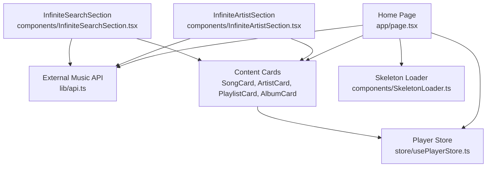
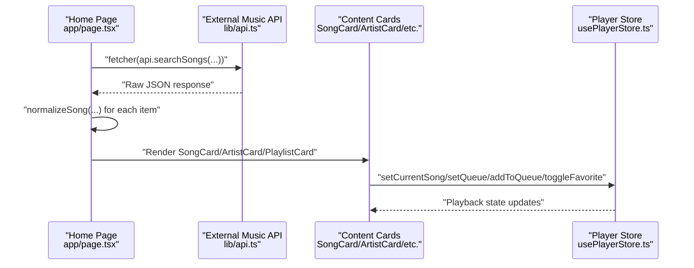
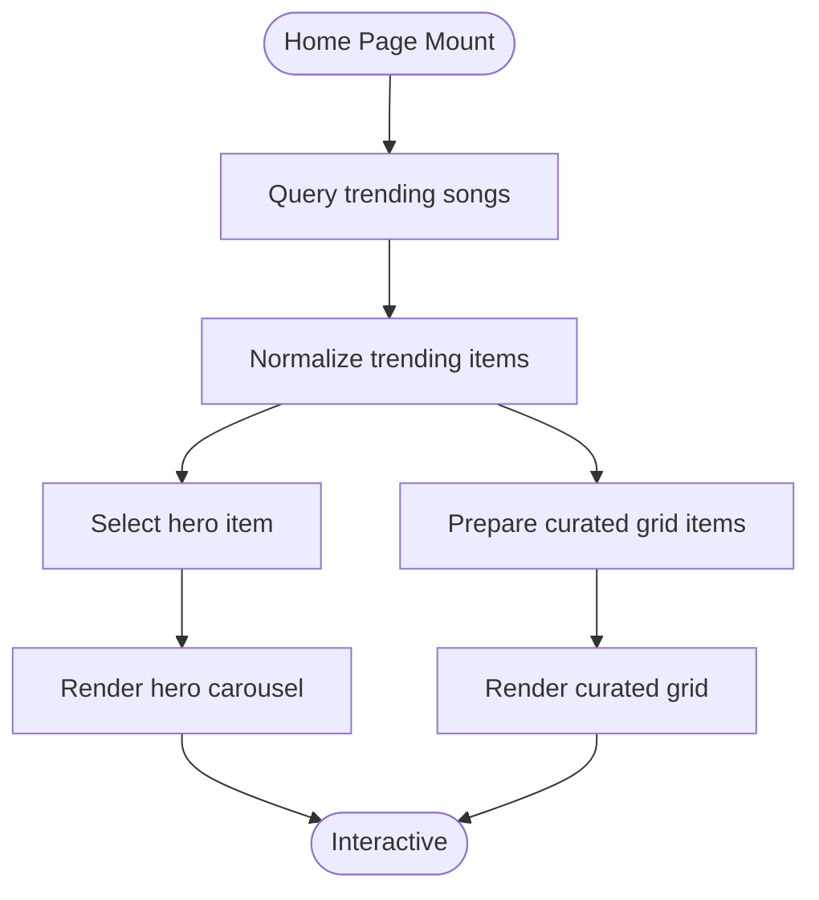
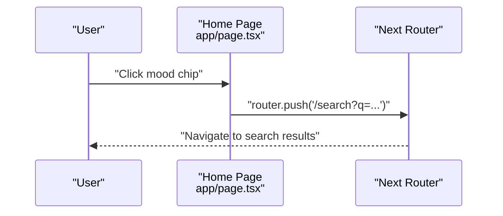
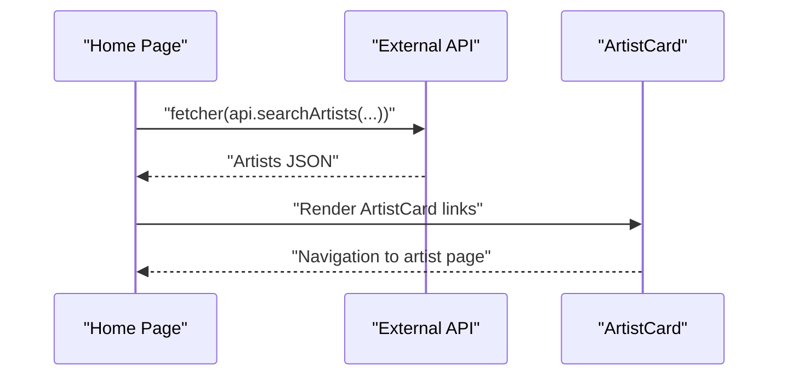
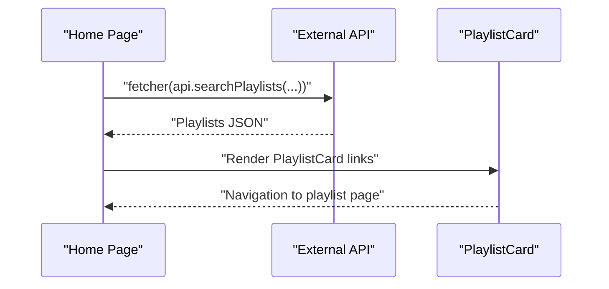
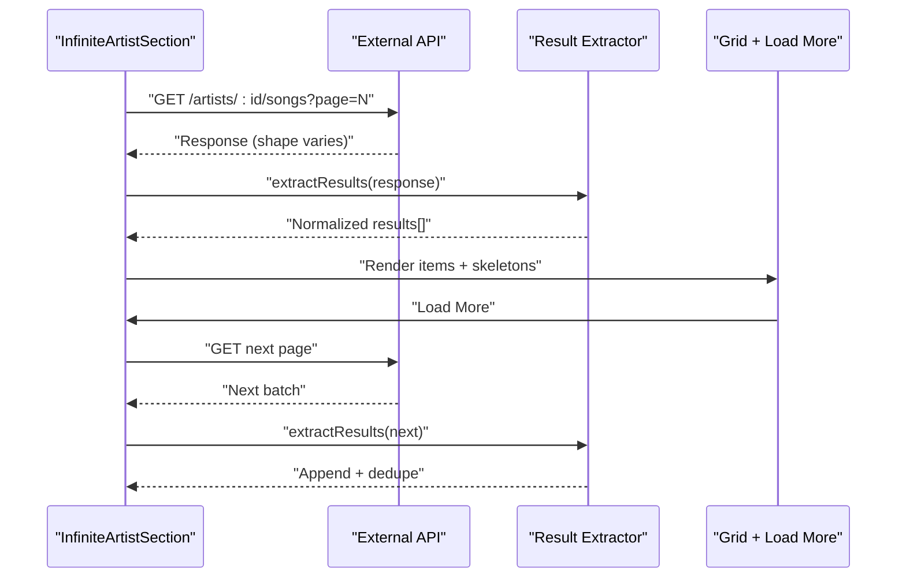
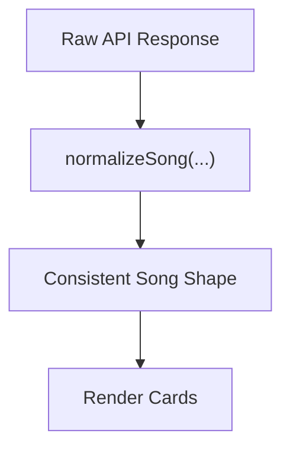
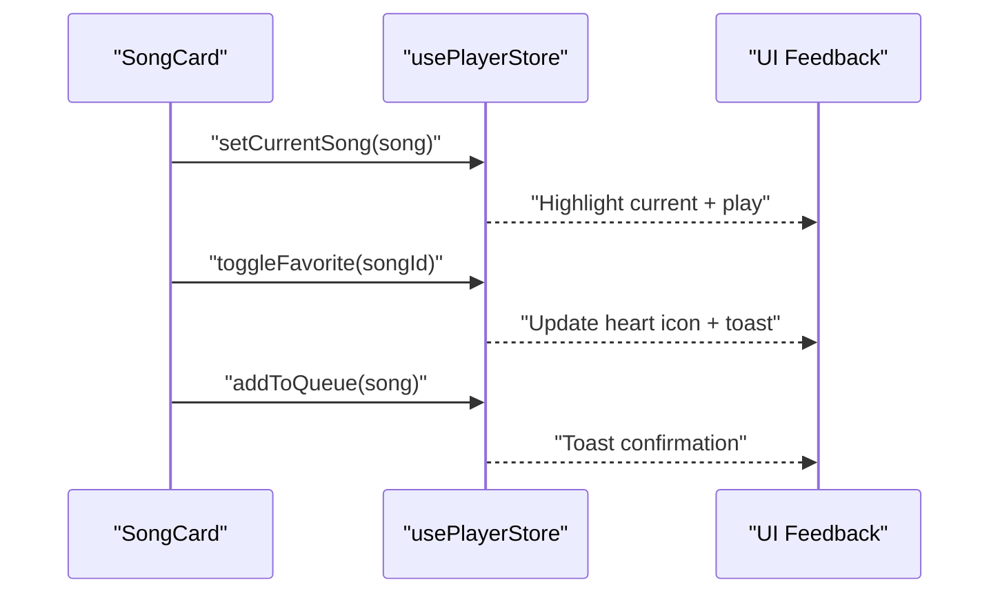
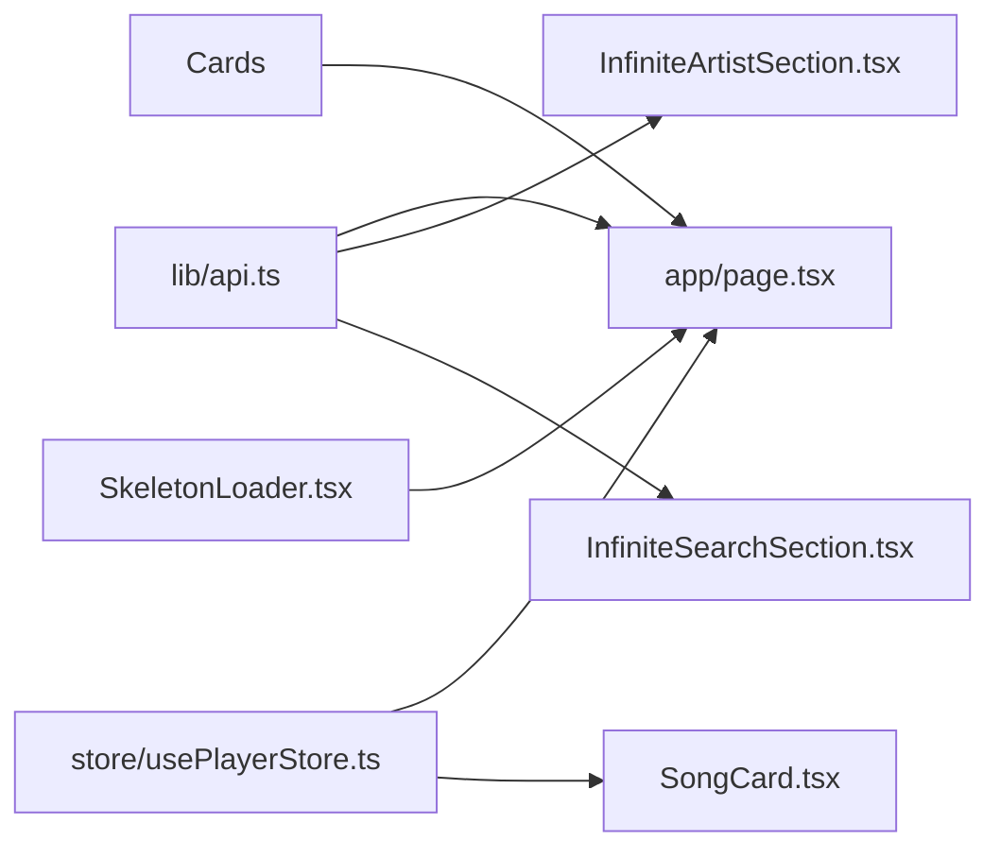

# Music Discovery

<cite>
**Referenced Files in This Document**
- [app/page.tsx](file://app/page.tsx)
- [lib/api.ts](file://lib/api.ts)
- [components/InfiniteArtistSection.tsx](file://components/InfiniteArtistSection.tsx)
- [components/InfiniteSearchSection.tsx](file://components/InfiniteSearchSection.tsx)
- [store/usePlayerStore.ts](file://store/usePlayerStore.ts)
- [components/SongCard.tsx](file://components/SongCard.tsx)
- [components/ArtistCard.tsx](file://components/ArtistCard.tsx)
- [components/PlaylistCard.tsx](file://components/PlaylistCard.tsx)
- [components/AlbumCard.tsx](file://components/AlbumCard.tsx)
- [components/SkeletonLoader.tsx](file://components/SkeletonLoader.tsx)
</cite>

## Table of Contents
1. [Introduction](#introduction)
2. [Project Structure](#project-structure)
3. [Core Components](#core-components)
4. [Architecture Overview](#architecture-overview)
5. [Detailed Component Analysis](#detailed-component-analysis)
6. [Dependency Analysis](#dependency-analysis)
7. [Performance Considerations](#performance-considerations)
8. [Troubleshooting Guide](#troubleshooting-guide)
9. [Conclusion](#conclusion)
10. [Appendices](#appendices)

## Introduction
This document explains the music discovery feature, focusing on:
- Trending content carousel and curated recommendations
- Mood-based recommendations
- Popular artists showcase
- Featured playlists
- Infinite scrolling for artist sections
- Content normalization from external APIs
- Performance optimization strategies
- Integration with the external music API
- Content loading and caching
- User engagement metrics and interaction patterns
- Responsive design considerations

## Project Structure
The discovery feature spans the home page, shared API utilities, reusable cards, infinite loaders, and the global player store. The home page orchestrates queries to an external music API, normalizes results, and renders content sections. Infinite loaders support pagination and lazy loading for artist and search results.

**Diagram sources**
- [app/page.tsx:34-203](file://app/page.tsx#L34-L203)
- [lib/api.ts:37-83](file://lib/api.ts#L37-L83)
- [components/InfiniteArtistSection.tsx:21-126](file://components/InfiniteArtistSection.tsx#L21-L126)
- [components/InfiniteSearchSection.tsx:23-89](file://components/InfiniteSearchSection.tsx#L23-L89)
- [store/usePlayerStore.ts:43-127](file://store/usePlayerStore.ts#L43-L127)
- [components/SkeletonLoader.tsx:11-29](file://components/SkeletonLoader.tsx#L11-L29)

**Section sources**
- [app/page.tsx:34-203](file://app/page.tsx#L34-L203)
- [lib/api.ts:37-83](file://lib/api.ts#L37-L83)
- [components/InfiniteArtistSection.tsx:21-126](file://components/InfiniteArtistSection.tsx#L21-L126)
- [components/InfiniteSearchSection.tsx:23-89](file://components/InfiniteSearchSection.tsx#L23-L89)
- [store/usePlayerStore.ts:43-127](file://store/usePlayerStore.ts#L43-L127)
- [components/SkeletonLoader.tsx:11-29](file://components/SkeletonLoader.tsx#L11-L29)

## Core Components
- Home page discovery pipeline:
  - Fetches trending songs, popular artists, and top playlists
  - Normalizes data and renders a hero carousel, mood chips, curated grid, artists grid, and playlists grid
- Shared API utilities:
  - Provides endpoint builders, fetcher, image and download URL helpers, duration formatter, and content normalization
- Infinite loaders:
  - Artist section supports infinite pagination for songs and albums
  - Search section supports infinite pagination for songs, albums, artists, and playlists
- Player store:
  - Manages playback state, queue, favorites, and recently played history
- Content cards:
  - Renderable UI components for songs, albums, artists, and playlists with interactive actions

**Section sources**
- [app/page.tsx:34-203](file://app/page.tsx#L34-L203)
- [lib/api.ts:37-153](file://lib/api.ts#L37-L153)
- [components/InfiniteArtistSection.tsx:21-126](file://components/InfiniteArtistSection.tsx#L21-L126)
- [components/InfiniteSearchSection.tsx:23-89](file://components/InfiniteSearchSection.tsx#L23-L89)
- [store/usePlayerStore.ts:43-127](file://store/usePlayerStore.ts#L43-L127)
- [components/SongCard.tsx:22-139](file://components/SongCard.tsx#L22-L139)
- [components/ArtistCard.tsx:14-50](file://components/ArtistCard.tsx#L14-L50)
- [components/PlaylistCard.tsx:14-47](file://components/PlaylistCard.tsx#L14-L47)
- [components/AlbumCard.tsx:14-47](file://components/AlbumCard.tsx#L14-L47)

## Architecture Overview
The discovery system integrates with an external music API via a typed fetcher and endpoint builders. Data is normalized to a consistent shape, then rendered into responsive grids and carousels. Infinite loaders progressively fetch additional pages, deduplicate results, and provide load-more controls. The player store coordinates playback and user preferences.

**Diagram sources**
- [app/page.tsx:38-51](file://app/page.tsx#L38-L51)
- [lib/api.ts:39-43](file://lib/api.ts#L39-L43)
- [lib/api.ts:92-152](file://lib/api.ts#L92-L152)
- [components/SongCard.tsx:30-57](file://components/SongCard.tsx#L30-L57)
- [store/usePlayerStore.ts:57-115](file://store/usePlayerStore.ts#L57-L115)

## Detailed Component Analysis

### Trending Carousel and Curated Recommendations
- Hero carousel:
  - Uses the first trending item as the hero with a prominent play action and gradient overlay
  - Integrates with the player store to set the current song and queue
- Curated grid:
  - Renders the remainder of trending items in a responsive grid
  - Uses skeleton loaders during initial fetch
- Data flow:
  - Queries trending songs, slices results, normalizes items, and passes to cards

**Diagram sources**
- [app/page.tsx:38-55](file://app/page.tsx#L38-L55)
- [lib/api.ts:92-152](file://lib/api.ts#L92-L152)

**Section sources**
- [app/page.tsx:38-132](file://app/page.tsx#L38-L132)
- [lib/api.ts:92-152](file://lib/api.ts#L92-L152)

### Mood-Based Recommendations
- Mood chips:
  - Predefined moods mapped to external API queries
  - On click, navigates to the search page with the respective query
- Implementation pattern:
  - Chip label, icon, and query are defined centrally
  - Navigation uses Next.js routing

**Diagram sources**
- [app/page.tsx:27-32](file://app/page.tsx#L27-L32)
- [app/page.tsx:138-147](file://app/page.tsx#L138-L147)

**Section sources**
- [app/page.tsx:27-32](file://app/page.tsx#L27-L32)
- [app/page.tsx:138-147](file://app/page.tsx#L138-L147)

### Popular Artists Showcase
- Fetch and render:
  - Queries popular artists and renders them in a responsive grid
  - Uses skeleton loaders during loading
- Interaction:
  - Clicking an artist navigates to the artist page

**Diagram sources**
- [app/page.tsx:43-46](file://app/page.tsx#L43-L46)
- [app/page.tsx:174-182](file://app/page.tsx#L174-L182)
- [components/ArtistCard.tsx:19-48](file://components/ArtistCard.tsx#L19-L48)

**Section sources**
- [app/page.tsx:43-46](file://app/page.tsx#L43-L46)
- [app/page.tsx:174-182](file://app/page.tsx#L174-L182)
- [components/ArtistCard.tsx:19-48](file://components/ArtistCard.tsx#L19-L48)

### Featured Playlists
- Fetch and render:
  - Queries top playlists and renders them in a responsive grid
  - Uses skeleton loaders during loading
- Interaction:
  - Clicking a playlist navigates to the playlist page

**Diagram sources**
- [app/page.tsx:48-51](file://app/page.tsx#L48-L51)
- [app/page.tsx:190-199](file://app/page.tsx#L190-L199)
- [components/PlaylistCard.tsx:14-47](file://components/PlaylistCard.tsx#L14-L47)

**Section sources**
- [app/page.tsx:48-51](file://app/page.tsx#L48-L51)
- [app/page.tsx:190-199](file://app/page.tsx#L190-L199)
- [components/PlaylistCard.tsx:14-47](file://components/PlaylistCard.tsx#L14-L47)

### Infinite Scrolling for Artist Sections
- Generic artist section component:
  - Accepts type (songs or albums), artist ID, and API endpoint builder
  - Extracts results from arbitrary response shapes
  - Deduplicates items by ID
  - Provides load-more button and skeleton loaders during fetching
- Pagination logic:
  - Uses getNextPageParam to compute the next page number
  - Enabled only when artistId is present

**Diagram sources**
- [components/InfiniteArtistSection.tsx:21-126](file://components/InfiniteArtistSection.tsx#L21-L126)
- [lib/api.ts:64-65](file://lib/api.ts#L64-L65)

**Section sources**
- [components/InfiniteArtistSection.tsx:21-126](file://components/InfiniteArtistSection.tsx#L21-L126)
- [lib/api.ts:64-65](file://lib/api.ts#L64-L65)

### Content Normalization from External APIs
- Purpose:
  - Standardizes inconsistent field names and structures returned by the external API
- Key transformations:
  - Ensures consistent song name/title, artist arrays, album objects, and image/download URLs
- Usage:
  - Applied to trending items and search results before rendering

**Diagram sources**
- [lib/api.ts:92-152](file://lib/api.ts#L92-L152)

**Section sources**
- [lib/api.ts:92-152](file://lib/api.ts#L92-L152)

### Player Integration and Engagement Metrics
- Playback actions:
  - Set current song and queue from discovery
  - Toggle favorite and manage recently played
- Engagement patterns:
  - Clicking a song card triggers play and queue updates
  - Like toggles update favorites and UI feedback
- Persistence:
  - Player store persists user preferences and history

**Diagram sources**
- [components/SongCard.tsx:30-57](file://components/SongCard.tsx#L30-L57)
- [store/usePlayerStore.ts:57-115](file://store/usePlayerStore.ts#L57-L115)

**Section sources**
- [components/SongCard.tsx:30-57](file://components/SongCard.tsx#L30-L57)
- [store/usePlayerStore.ts:57-115](file://store/usePlayerStore.ts#L57-L115)

### Responsive Design Considerations
- Grid layouts:
  - Use responsive grid classes to adapt columns per breakpoint
- Skeleton loaders:
  - Provide consistent loading placeholders across devices
- Typography and spacing:
  - Adjust font sizes and padding for mobile and desktop

**Section sources**
- [app/page.tsx:58-200](file://app/page.tsx#L58-L200)
- [components/SkeletonLoader.tsx:11-29](file://components/SkeletonLoader.tsx#L11-L29)

## Dependency Analysis
- Home page depends on:
  - API utilities for endpoints and normalization
  - Cards for rendering
  - Player store for playback actions
- Infinite loaders depend on:
  - API utilities for endpoints
  - Cards for rendering
- Player store is a singleton used across components

**Diagram sources**
- [lib/api.ts:37-83](file://lib/api.ts#L37-L83)
- [app/page.tsx:34-203](file://app/page.tsx#L34-L203)
- [components/InfiniteArtistSection.tsx:21-126](file://components/InfiniteArtistSection.tsx#L21-L126)
- [components/InfiniteSearchSection.tsx:23-89](file://components/InfiniteSearchSection.tsx#L23-L89)
- [store/usePlayerStore.ts:43-127](file://store/usePlayerStore.ts#L43-L127)
- [components/SkeletonLoader.tsx:11-29](file://components/SkeletonLoader.tsx#L11-L29)

**Section sources**
- [lib/api.ts:37-83](file://lib/api.ts#L37-L83)
- [app/page.tsx:34-203](file://app/page.tsx#L34-L203)
- [components/InfiniteArtistSection.tsx:21-126](file://components/InfiniteArtistSection.tsx#L21-L126)
- [components/InfiniteSearchSection.tsx:23-89](file://components/InfiniteSearchSection.tsx#L23-L89)
- [store/usePlayerStore.ts:43-127](file://store/usePlayerStore.ts#L43-L127)
- [components/SkeletonLoader.tsx:11-29](file://components/SkeletonLoader.tsx#L11-L29)

## Performance Considerations
- Lazy loading and skeleton placeholders:
  - Use skeleton loaders during initial fetch and while loading more items
- Efficient pagination:
  - Compute next page param based on received results length
- Deduplication:
  - Remove duplicates by ID before rendering
- Image optimization:
  - Prefer high-quality image URLs and fallbacks
- Minimal re-renders:
  - Memoize extracted results and derived lists
- Caching:
  - React Query caches responses by query key; leverage existing cache keys for trending, artists, and playlists

**Section sources**
- [components/InfiniteArtistSection.tsx:72-84](file://components/InfiniteArtistSection.tsx#L72-L84)
- [components/InfiniteArtistSection.tsx:63-70](file://components/InfiniteArtistSection.tsx#L63-L70)
- [lib/api.ts:71-83](file://lib/api.ts#L71-L83)
- [app/page.tsx:98-100](file://app/page.tsx#L98-L100)
- [app/page.tsx:158-160](file://app/page.tsx#L158-L160)
- [app/page.tsx:190-192](file://app/page.tsx#L190-L192)

## Troubleshooting Guide
- Empty or missing images:
  - Fallback image URL is used when no image is provided
- Inconsistent API response shapes:
  - Result extraction logic attempts multiple keys and nested structures
- No data after loading:
  - Components return null when no data is available and loading is complete
- Authentication-required actions:
  - Favorite and add-to-playlist actions trigger an auth modal if unauthenticated

**Section sources**
- [lib/api.ts:71-83](file://lib/api.ts#L71-L83)
- [components/InfiniteArtistSection.tsx:22-48](file://components/InfiniteArtistSection.tsx#L22-L48)
- [components/InfiniteArtistSection.tsx:86-87](file://components/InfiniteArtistSection.tsx#L86-L87)
- [components/SongCard.tsx:50-57](file://components/SongCard.tsx#L50-L57)

## Conclusion
The discovery feature combines a trending hero, mood-driven navigation, curated grids, and infinite loaders to deliver a seamless, responsive music exploration experience. Robust normalization ensures consistent rendering, while the player store and engagement actions integrate deeply with user interactions. Performance is optimized through skeleton loaders, deduplication, and efficient pagination.

## Appendices

### API Definitions and Endpoints
- Endpoint builders:
  - Search routes for songs, albums, artists, playlists
  - Song routes for details and suggestions
  - Artist routes for details, songs, and albums
  - Playlist routes for details
- Fetcher:
  - Centralized fetcher with error handling
- Helpers:
  - High-quality image and download URL selection
  - Duration formatting
  - Content normalization

**Section sources**
- [lib/api.ts:45-69](file://lib/api.ts#L45-L69)
- [lib/api.ts:39-43](file://lib/api.ts#L39-L43)
- [lib/api.ts:71-90](file://lib/api.ts#L71-L90)
- [lib/api.ts:92-152](file://lib/api.ts#L92-L152)

### Recommendation Algorithms and Patterns
- Trending carousel:
  - Uses the platform’s trending endpoint and selects the top result as hero
- Mood-based:
  - Maps predefined moods to external queries
- Curated grid:
  - Renders normalized trending items after the hero
- Artist and search infinite loaders:
  - Paginates results and deduplicates entries

**Section sources**
- [app/page.tsx:38-55](file://app/page.tsx#L38-L55)
- [app/page.tsx:27-32](file://app/page.tsx#L27-L32)
- [components/InfiniteArtistSection.tsx:22-84](file://components/InfiniteArtistSection.tsx#L22-L84)
- [components/InfiniteSearchSection.tsx:38-44](file://components/InfiniteSearchSection.tsx#L38-L44)