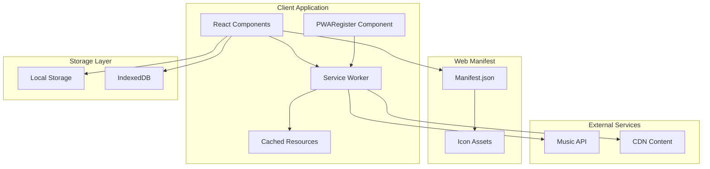
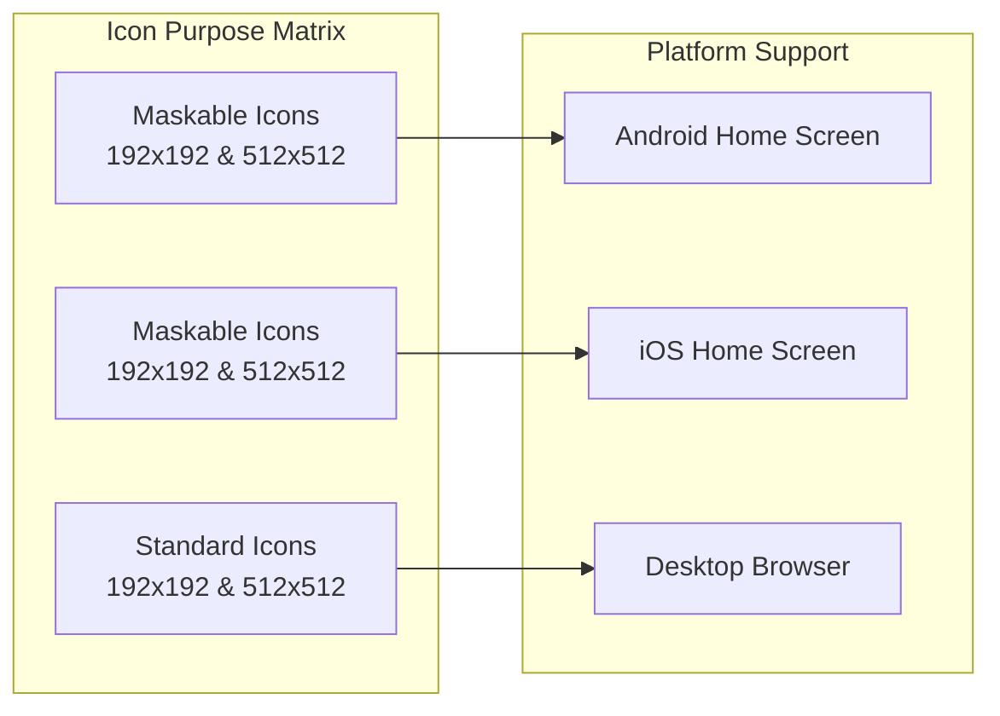
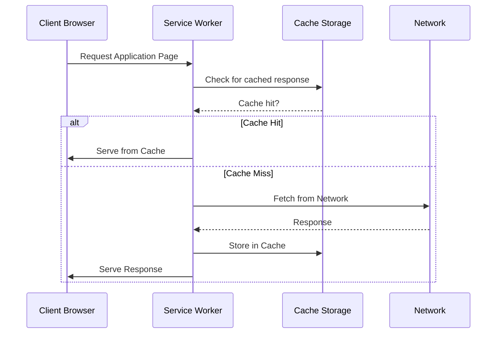
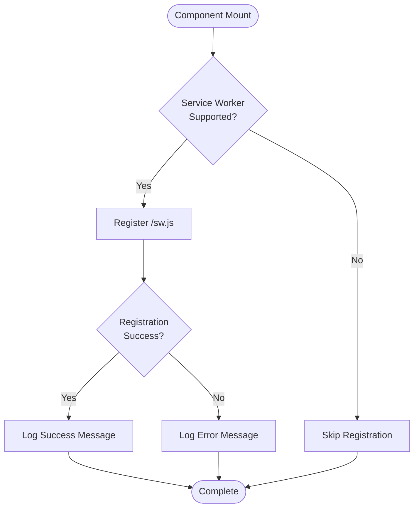
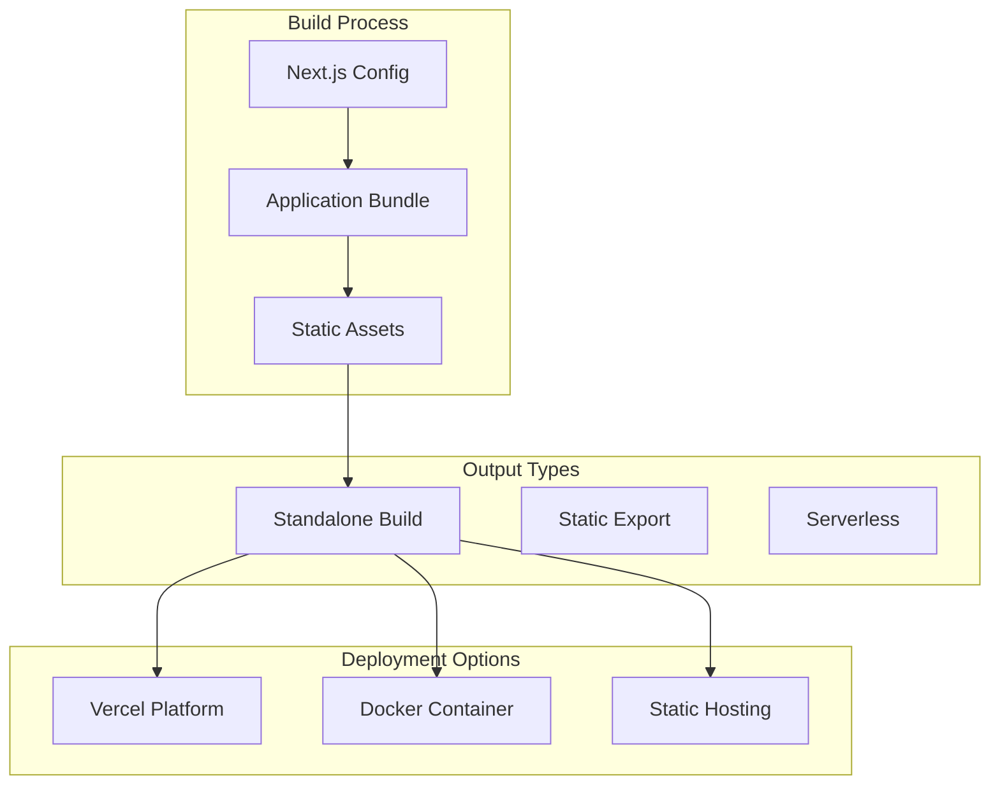
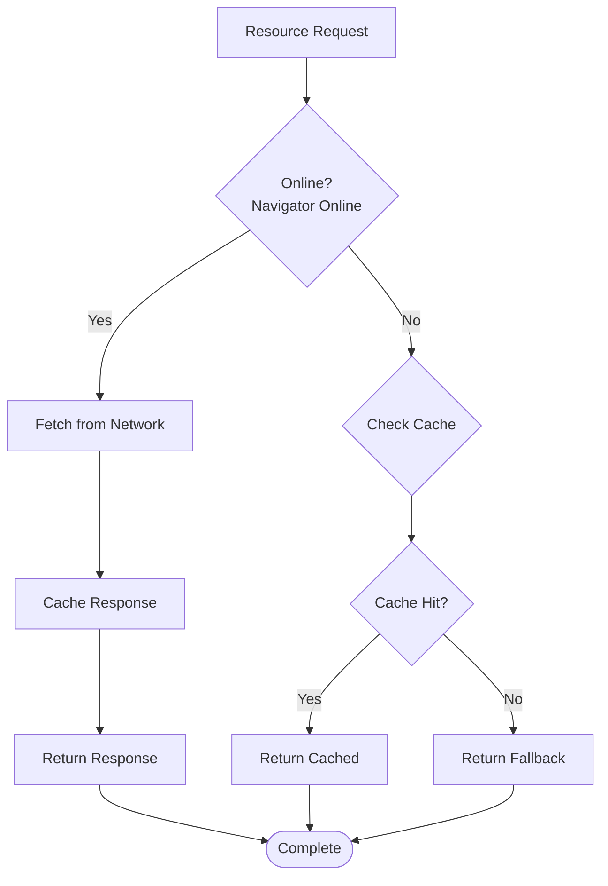

# Progressive Web App (PWA) Implementation

<cite>
**Referenced Files in This Document**
- [manifest.json](file://public/manifest.json)
- [sw.js](file://public/sw.js)
- [PWARegister.tsx](file://components/PWARegister.tsx)
- [layout.tsx](file://app/layout.tsx)
- [next.config.ts](file://next.config.ts)
- [package.json](file://package.json)
</cite>

## Update Summary
**Changes Made**
- Enhanced manifest configuration with new fields (id, lang, dir, categories)
- Improved service worker caching strategy with better resource management
- Standardized icon references using single icon file
- Added dedicated PWARegister component for service worker management
- Updated architecture diagrams to reflect new PWA components

## Table of Contents
1. [Introduction](#introduction)
2. [PWA Architecture Overview](#pwa-architecture-overview)
3. [Manifest Configuration](#manifest-configuration)
4. [Service Worker Implementation](#service-worker-implementation)
5. [Registration Mechanism](#registration-mechanism)
6. [Build Configuration](#build-configuration)
7. [Offline Capabilities](#offline-capabilities)
8. [Performance Optimizations](#performance-optimizations)
9. [Browser Compatibility](#browser-compatibility)
10. [Troubleshooting Guide](#troubleshooting-guide)
11. [Conclusion](#conclusion)

## Introduction

SonicStream implements a comprehensive Progressive Web App (PWA) architecture that transforms the Next.js music streaming application into a native-like experience. The PWA implementation includes offline capabilities, installability, and enhanced performance through service worker caching and modern web standards.

The application leverages Next.js 15's App Router alongside traditional PWA technologies to deliver seamless music streaming experiences across desktop and mobile platforms. The implementation focuses on providing reliable offline functionality, fast loading times, and a native app-like interface.

**Updated** Enhanced with new PWARegister component and improved caching strategy for better performance and reliability.

## PWA Architecture Overview

The SonicStream PWA architecture consists of several interconnected components working together to provide a robust offline-first experience:

**Diagram sources**
- [layout.tsx:17-66](file://app/layout.tsx#L17-L66)
- [manifest.json:1-42](file://public/manifest.json#L1-L42)
- [sw.js:1-41](file://public/sw.js#L1-L41)
- [PWARegister.tsx:1-21](file://components/PWARegister.tsx#L1-L21)

The architecture follows a layered approach where the service worker acts as a network proxy, intercepting requests and serving cached content when available. The manifest file defines the application's installability and appearance when added to home screens. The new PWARegister component provides centralized service worker management.

## Manifest Configuration

The PWA manifest serves as the foundation for installability and native app appearance. SonicStream's manifest configuration includes comprehensive metadata and asset specifications:

### Core Manifest Properties

The manifest defines essential application characteristics:

- **Application Identity**: Name, short_name, and description establish the app's identity
- **Display Mode**: Standalone display mode removes browser UI for native app feel
- **Color Scheme**: Background and theme colors ensure consistent appearance
- **Orientation Control**: Portrait orientation maintains optimal mobile experience
- **Asset Categories**: Music and entertainment categorization improves discoverability

**Updated** Enhanced with new internationalization and localization fields for better platform support.

### Enhanced Internationalization Support

The manifest now includes comprehensive internationalization fields:

- **Application ID**: Unique identifier for platform-specific installations
- **Default Language**: Specifies the application's default language (en)
- **Text Direction**: Defines text direction (ltr for left-to-right)
- **Categories**: Platform categorization for better app store discoverability

### Icon Asset Strategy

The manifest includes multiple icon sizes with different purposes:

**Diagram sources**
- [manifest.json:15-40](file://public/manifest.json#L15-L40)

**Updated** Standardized icon references using single `/icon.png` file for all sizes and purposes, simplifying asset management.

The implementation uses both "any" and "maskable" purposes to ensure compatibility across different platforms and home screen implementations.

**Section sources**
- [manifest.json:1-42](file://public/manifest.json#L1-L42)

## Service Worker Implementation

The service worker provides offline capabilities and performance optimization through intelligent caching strategies:

### Enhanced Caching Strategy

The service worker implements a versioned caching approach with specific URLs pre-cached:

**Diagram sources**
- [sw.js:30-40](file://public/sw.js#L30-L40)

**Updated** Improved caching strategy with better resource management and more efficient cache storage.

### Installation and Activation

The service worker lifecycle includes careful cache management:

1. **Installation Phase**: Pre-caches essential resources including manifest and icon files
2. **Activation Phase**: Cleans up old caches and claims clients
3. **Fetch Interception**: Handles all subsequent requests with improved error handling

**Section sources**
- [sw.js:1-41](file://public/sw.js#L1-L41)

## Registration Mechanism

The PWA registration system ensures automatic service worker activation and error handling through a dedicated component:

### Dedicated PWARegister Component

The registration component handles service worker lifecycle with centralized management:

**Diagram sources**
- [PWARegister.tsx:5-20](file://components/PWARegister.tsx#L5-L20)

**Updated** Added dedicated PWARegister component for centralized service worker management, replacing inline registration logic.

### Error Handling Strategy

The registration mechanism includes comprehensive error handling for various failure scenarios:

- **Unsupported Browsers**: Graceful degradation when service workers aren't available
- **Registration Failures**: Detailed logging for debugging deployment issues
- **Runtime Errors**: Monitoring of service worker operational status

**Section sources**
- [PWARegister.tsx:1-21](file://components/PWARegister.tsx#L1-L21)

## Build Configuration

The Next.js configuration enables PWA-ready builds with optimized output:

### Standalone Output Configuration

The build system generates standalone deployments suitable for various hosting environments:

**Diagram sources**
- [next.config.ts:52](file://next.config.ts#L52)

### Asset Optimization

The configuration includes optimizations for PWA assets:

- **Image Optimization**: Remote pattern support for music streaming content
- **Bundle Splitting**: Efficient loading of application chunks
- **Code Splitting**: Route-based lazy loading for improved performance

**Section sources**
- [next.config.ts:1-81](file://next.config.ts#L1-L81)

## Offline Capabilities

SonicStream implements comprehensive offline functionality through strategic caching and fallback mechanisms:

### Resource Caching Strategy

The service worker caches essential resources for offline access:

- **Application Shell**: Core HTML, CSS, and JavaScript files
- **Manifest Resources**: PWA manifest and icon assets
- **Critical Assets**: Essential images and fonts for UI rendering

**Updated** Enhanced caching strategy with improved resource management and better cache invalidation.

### Fallback Strategies

The application implements graceful degradation when offline:

**Diagram sources**
- [sw.js:30-40](file://public/sw.js#L30-L40)

**Updated** Improved fallback mechanisms with better error handling and user feedback.

## Performance Optimizations

The PWA implementation includes several performance enhancements:

### Loading Performance

- **Pre-caching**: Essential resources loaded during service worker installation
- **Lazy Loading**: Non-critical resources loaded on-demand
- **Compression**: Efficient asset compression for reduced bandwidth usage

**Updated** Enhanced loading performance with improved caching strategy and better resource management.

### Runtime Performance

- **Cache-First Strategy**: Frequently accessed resources served from cache
- **Background Updates**: Service worker updates occur without disrupting user experience
- **Efficient Storage**: Optimized cache storage with version management

**Updated** Improved runtime performance with better cache management and more efficient resource utilization.

## Browser Compatibility

The PWA implementation maintains compatibility across modern browsers:

### Feature Detection

The application uses feature detection rather than browser detection:

- **Service Worker Support**: Graceful fallback when unsupported
- **Cache API**: Alternative strategies for browsers without cache support
- **Manifest Support**: Visual fallbacks when PWA installation isn't available

### Progressive Enhancement

The implementation follows progressive enhancement principles:

1. **Core Functionality**: Basic music streaming works without PWA features
2. **Enhanced Experience**: PWA features enhance but don't break core functionality
3. **Graceful Degradation**: Reduced functionality gracefully when features aren't available

**Updated** Enhanced browser compatibility with improved error handling and fallback mechanisms.

## Troubleshooting Guide

Common PWA issues and their solutions:

### Service Worker Registration Issues

**Problem**: Service worker fails to register
**Solution**: Check browser console for specific error messages, verify HTTPS deployment, ensure correct path to service worker file

**Updated** Added troubleshooting guidance for the new PWARegister component and improved error handling.

### Cache Invalidation Problems

**Problem**: Outdated content served from cache
**Solution**: Verify cache versioning strategy, check service worker update cycle, monitor cache storage limits

**Updated** Enhanced cache troubleshooting with guidance for the new caching strategy.

### Installation Failures

**Problem**: PWA cannot be installed on devices
**Solution**: Validate manifest file completeness, ensure HTTPS deployment, verify icon asset availability

**Updated** Added troubleshooting for the enhanced manifest configuration with new fields.

### Performance Issues

**Problem**: Slow loading times despite caching
**Solution**: Analyze cache effectiveness, optimize asset sizes, review network request patterns

**Updated** Enhanced performance troubleshooting with guidance for the improved caching strategy.

**Section sources**
- [PWARegister.tsx:6-16](file://components/PWARegister.tsx#L6-L16)

## Conclusion

SonicStream's PWA implementation provides a robust, offline-first music streaming experience that bridges the gap between web applications and native apps. The implementation successfully combines modern web technologies with traditional PWA patterns to deliver reliable functionality across diverse platforms and network conditions.

**Updated** The recent enhancements demonstrate significant improvements in PWA architecture, including the new PWARegister component, enhanced manifest configuration, and improved caching strategy.

The architecture demonstrates best practices in PWA development, including thoughtful caching strategies, comprehensive error handling, and progressive enhancement principles. The modular design allows for easy maintenance and future enhancements while maintaining backward compatibility.

Key strengths of the implementation include:
- Comprehensive offline capability through strategic caching
- Seamless installation process with proper manifest configuration
- Robust error handling and graceful degradation
- Optimized performance through efficient resource management
- Cross-platform compatibility with progressive enhancement
- Centralized service worker management through dedicated component
- Enhanced internationalization support for global accessibility

This foundation provides an excellent starting point for further PWA enhancements and demonstrates how modern web frameworks can leverage PWA technologies to create compelling user experiences.