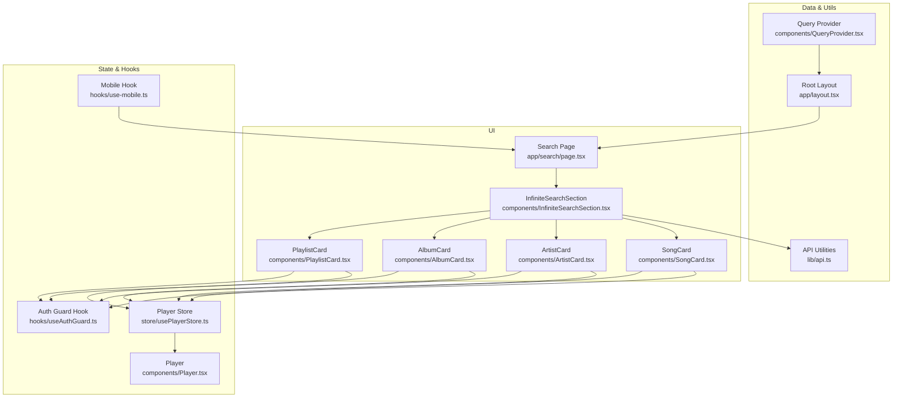
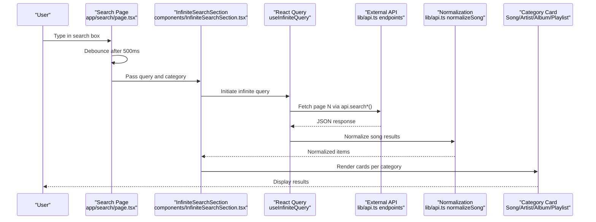
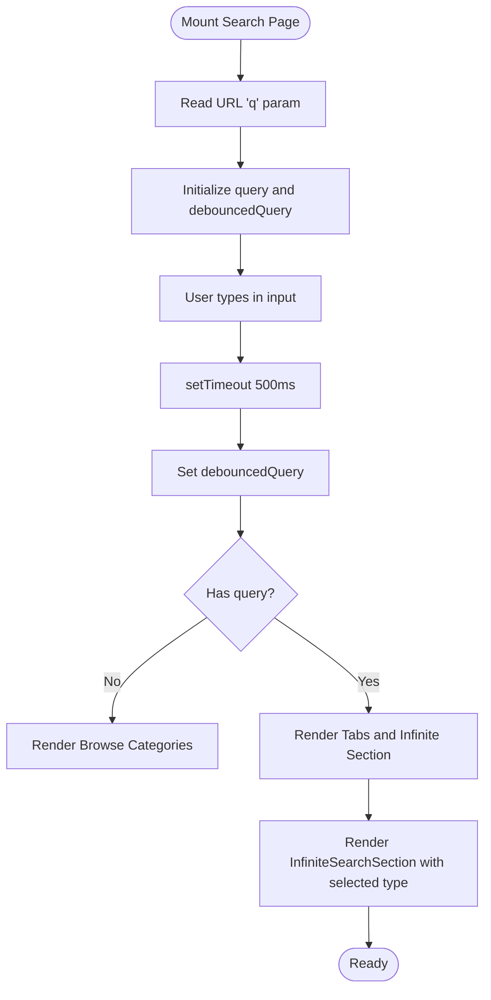
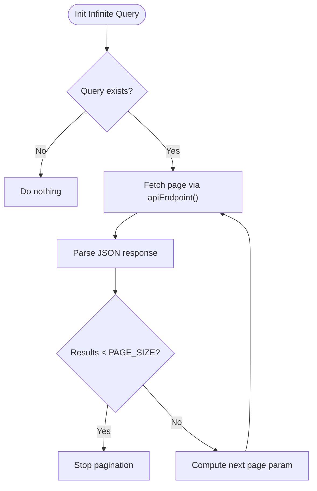
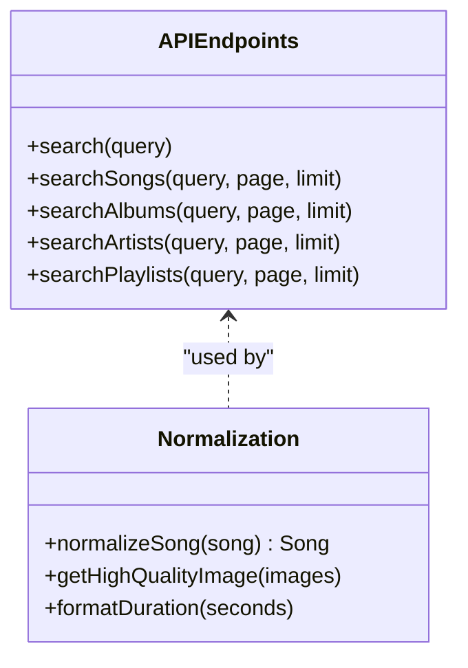
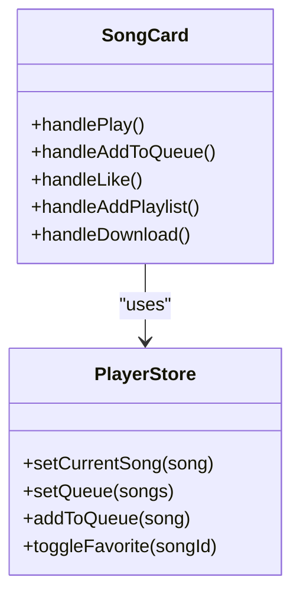
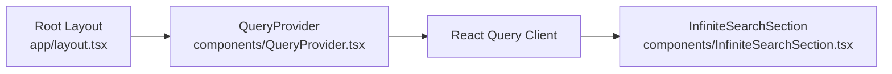
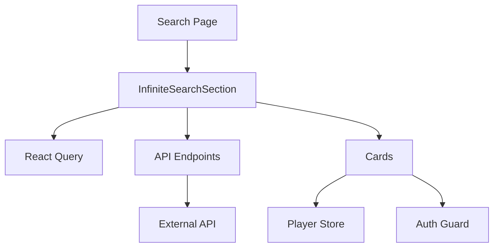
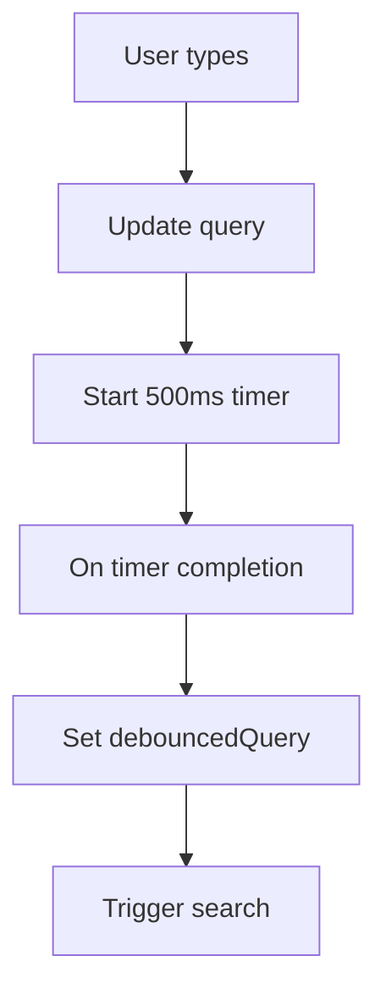
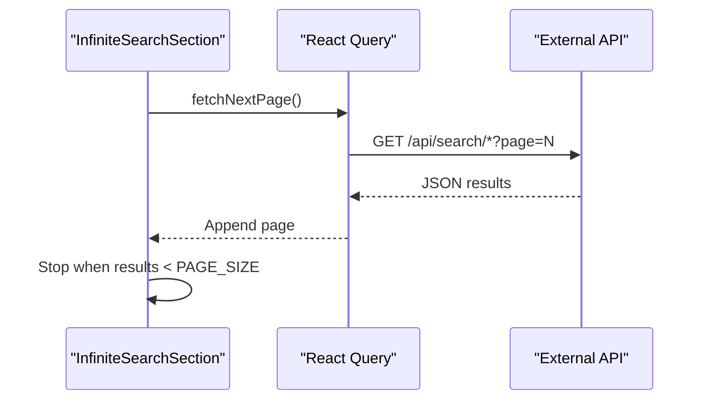

# Search System

<cite>
**Referenced Files in This Document**
- [app/search/page.tsx](file://app/search/page.tsx)
- [components/InfiniteSearchSection.tsx](file://components/InfiniteSearchSection.tsx)
- [lib/api.ts](file://lib/api.ts)
- [components/SongCard.tsx](file://components/SongCard.tsx)
- [components/ArtistCard.tsx](file://components/ArtistCard.tsx)
- [components/AlbumCard.tsx](file://components/AlbumCard.tsx)
- [components/PlaylistCard.tsx](file://components/PlaylistCard.tsx)
- [components/QueryProvider.tsx](file://components/QueryProvider.tsx)
- [app/layout.tsx](file://app/layout.tsx)
- [store/usePlayerStore.ts](file://store/usePlayerStore.ts)
- [hooks/use-mobile.ts](file://hooks/use-mobile.ts)
- [hooks/useAuthGuard.ts](file://hooks/useAuthGuard.ts)
- [components/Player.tsx](file://components/Player.tsx)
</cite>

## Table of Contents
1. [Introduction](#introduction)
2. [Project Structure](#project-structure)
3. [Core Components](#core-components)
4. [Architecture Overview](#architecture-overview)
5. [Detailed Component Analysis](#detailed-component-analysis)
6. [Dependency Analysis](#dependency-analysis)
7. [Performance Considerations](#performance-considerations)
8. [Troubleshooting Guide](#troubleshooting-guide)
9. [Conclusion](#conclusion)
10. [Appendices](#appendices)

## Introduction
This document explains the multi-category search functionality implemented in the application. It covers the search interface, real-time suggestions via debounced queries, infinite scrolling for results, integration with external music APIs, normalization and filtering of results, category-based search (songs, artists, albums, playlists), and result caching. It also documents responsive design patterns, keyboard navigation, accessibility features, and user experience enhancements.

## Project Structure
The search system spans a small set of focused components and shared utilities:
- Search page orchestrating UI, tabs, and category browsing
- Infinite scroll container for paginated results
- API utilities for endpoint construction and data normalization
- Category-specific result cards
- Global query cache provider
- Store for player actions and favorites
- Hooks for mobile detection and auth gating
- Layout wiring for global providers

**Diagram sources**
- [app/search/page.tsx:1-129](file://app/search/page.tsx#L1-L129)
- [components/InfiniteSearchSection.tsx:1-90](file://components/InfiniteSearchSection.tsx#L1-L90)
- [lib/api.ts:1-153](file://lib/api.ts#L1-L153)
- [components/QueryProvider.tsx:1-26](file://components/QueryProvider.tsx#L1-L26)
- [app/layout.tsx:1-72](file://app/layout.tsx#L1-L72)
- [store/usePlayerStore.ts:1-128](file://store/usePlayerStore.ts#L1-L128)
- [hooks/use-mobile.ts:1-19](file://hooks/use-mobile.ts#L1-L19)
- [hooks/useAuthGuard.ts:1-28](file://hooks/useAuthGuard.ts#L1-L28)
- [components/Player.tsx:68-87](file://components/Player.tsx#L68-L87)

**Section sources**
- [app/search/page.tsx:1-129](file://app/search/page.tsx#L1-L129)
- [components/InfiniteSearchSection.tsx:1-90](file://components/InfiniteSearchSection.tsx#L1-L90)
- [lib/api.ts:1-153](file://lib/api.ts#L1-L153)
- [components/QueryProvider.tsx:1-26](file://components/QueryProvider.tsx#L1-L26)
- [app/layout.tsx:1-72](file://app/layout.tsx#L1-L72)

## Core Components
- Search Page: Manages the search bar, debounced query, category browsing, and tabbed results.
- Infinite Search Section: Implements infinite pagination and renders category-specific cards.
- API Utilities: Provides endpoint builders and normalization helpers.
- Category Cards: Renderers for songs, artists, albums, and playlists.
- Query Provider: Global caching and stale-time configuration for React Query.
- Player Store: Integrates favorites and queue actions from cards.
- Hooks: Mobile detection and auth gating for protected actions.

**Section sources**
- [app/search/page.tsx:20-120](file://app/search/page.tsx#L20-L120)
- [components/InfiniteSearchSection.tsx:23-89](file://components/InfiniteSearchSection.tsx#L23-L89)
- [lib/api.ts:45-69](file://lib/api.ts#L45-L69)
- [components/QueryProvider.tsx:6-25](file://components/QueryProvider.tsx#L6-L25)
- [store/usePlayerStore.ts:12-41](file://store/usePlayerStore.ts#L12-L41)

## Architecture Overview
The search architecture integrates Next.js app routing, React Query for caching and pagination, and external API endpoints. The search page controls the UI state and passes the debounced query to the infinite section, which requests pages from the external API. Results are normalized and rendered by category-specific cards.

**Diagram sources**
- [app/search/page.tsx:29-32](file://app/search/page.tsx#L29-L32)
- [components/InfiniteSearchSection.tsx:31-44](file://components/InfiniteSearchSection.tsx#L31-L44)
- [lib/api.ts:47-51](file://lib/api.ts#L47-L51)
- [lib/api.ts:92-152](file://lib/api.ts#L92-L152)

## Detailed Component Analysis

### Search Page (app/search/page.tsx)
- Debounced query: Updates a secondary state after a 500 ms delay to reduce network calls.
- Category browsing: Shows curated categories (e.g., Bollywood, Pop Hits) when the query is empty.
- Tabs: Switches between songs, artists, albums, and playlists.
- Routing: Uses Next.js search params and router to manage query state.

**Diagram sources**
- [app/search/page.tsx:21-35](file://app/search/page.tsx#L21-L35)
- [app/search/page.tsx:68-117](file://app/search/page.tsx#L68-L117)

**Section sources**
- [app/search/page.tsx:20-120](file://app/search/page.tsx#L20-L120)

### Infinite Search Section (components/InfiniteSearchSection.tsx)
- Infinite pagination: Uses React Query’s infinite query to fetch pages until fewer results than requested are returned.
- Endpoint selection: Receives a category-specific endpoint builder from lib/api.ts.
- Rendering: Maps normalized results to category cards; shows skeleton loaders during loading and fetching next page.
- Load more: Button triggers next page fetch when available.

**Diagram sources**
- [components/InfiniteSearchSection.tsx:31-44](file://components/InfiniteSearchSection.tsx#L31-L44)
- [components/InfiniteSearchSection.tsx:74-86](file://components/InfiniteSearchSection.tsx#L74-L86)

**Section sources**
- [components/InfiniteSearchSection.tsx:23-89](file://components/InfiniteSearchSection.tsx#L23-L89)

### API Utilities (lib/api.ts)
- Endpoint builders: Provide typed URLs for search across songs, artists, albums, and playlists.
- Normalization: Ensures consistent shape for song objects (handles inconsistent keys like name/title, artists as string/array, album structure).
- Helpers: High-quality image and download URL extraction, duration formatting.

**Diagram sources**
- [lib/api.ts:45-69](file://lib/api.ts#L45-L69)
- [lib/api.ts:92-152](file://lib/api.ts#L92-L152)

**Section sources**
- [lib/api.ts:45-69](file://lib/api.ts#L45-L69)
- [lib/api.ts:92-152](file://lib/api.ts#L92-L152)

### Category Cards
- SongCard: Integrates with player store for play, queue, like, and download actions; supports auth gating.
- ArtistCard, AlbumCard, PlaylistCard: Presentational cards linking to respective detail pages.

**Diagram sources**
- [components/SongCard.tsx:22-63](file://components/SongCard.tsx#L22-L63)
- [store/usePlayerStore.ts:24-41](file://store/usePlayerStore.ts#L24-L41)

**Section sources**
- [components/SongCard.tsx:22-139](file://components/SongCard.tsx#L22-L139)
- [components/ArtistCard.tsx:14-50](file://components/ArtistCard.tsx#L14-L50)
- [components/AlbumCard.tsx:14-47](file://components/AlbumCard.tsx#L14-L47)
- [components/PlaylistCard.tsx:14-47](file://components/PlaylistCard.tsx#L14-L47)

### Query Provider and Caching (components/QueryProvider.tsx, app/layout.tsx)
- Global React Query client configured with a short stale time and limited retries.
- Wrapped at the root level so all search queries benefit from caching and deduplication.

**Diagram sources**
- [app/layout.tsx:52-24](file://app/layout.tsx#L52-L24)
- [components/QueryProvider.tsx:6-25](file://components/QueryProvider.tsx#L6-L25)

**Section sources**
- [components/QueryProvider.tsx:6-25](file://components/QueryProvider.tsx#L6-L25)
- [app/layout.tsx:44-71](file://app/layout.tsx#L44-L71)

### Player Store and Auth Gating (store/usePlayerStore.ts, hooks/useAuthGuard.ts)
- Favorites and queue actions are exposed to cards for quick interaction.
- Auth guard ensures protected actions (like toggling favorites) require authentication.

**Section sources**
- [store/usePlayerStore.ts:12-41](file://store/usePlayerStore.ts#L12-L41)
- [hooks/useAuthGuard.ts:12-28](file://hooks/useAuthGuard.ts#L12-L28)

### Responsive Design and Accessibility
- Responsive grid: Cards adapt from 2 to 5 columns depending on screen size.
- Focus and hover affordances: Cards expose interactive elements with visible focus states and hover effects.
- Mobile hook: Enables responsive behavior across components.

**Section sources**
- [app/search/page.tsx:104-116](file://app/search/page.tsx#L104-L116)
- [hooks/use-mobile.ts:1-19](file://hooks/use-mobile.ts#L1-L19)

### Keyboard Navigation and Accessibility
- Player component listens to global key events for playback controls (space, arrows, M), improving accessibility for keyboard-only users.

**Section sources**
- [components/Player.tsx:68-87](file://components/Player.tsx#L68-L87)

## Dependency Analysis
- Search Page depends on:
  - Debounced state and Next.js router/search params
  - InfiniteSearchSection for rendering
- InfiniteSearchSection depends on:
  - React Query for pagination
  - API endpoint builders
  - Category cards for rendering
- API utilities depend on:
  - External API base URL and endpoint shapes
  - Normalization helpers
- Cards depend on:
  - Player store for state
  - Auth guard for protected actions

**Diagram sources**
- [app/search/page.tsx:20-120](file://app/search/page.tsx#L20-L120)
- [components/InfiniteSearchSection.tsx:23-89](file://components/InfiniteSearchSection.tsx#L23-L89)
- [lib/api.ts:45-69](file://lib/api.ts#L45-L69)
- [store/usePlayerStore.ts:12-41](file://store/usePlayerStore.ts#L12-L41)
- [hooks/useAuthGuard.ts:12-28](file://hooks/useAuthGuard.ts#L12-L28)

**Section sources**
- [app/search/page.tsx:20-120](file://app/search/page.tsx#L20-L120)
- [components/InfiniteSearchSection.tsx:23-89](file://components/InfiniteSearchSection.tsx#L23-L89)
- [lib/api.ts:45-69](file://lib/api.ts#L45-L69)
- [store/usePlayerStore.ts:12-41](file://store/usePlayerStore.ts#L12-L41)
- [hooks/useAuthGuard.ts:12-28](file://hooks/useAuthGuard.ts#L12-L28)

## Performance Considerations
- Debounced search: Limits rapid re-fetches by delaying query updates.
- Infinite pagination: Requests fixed page sizes and stops when results are incomplete.
- Caching: React Query default options cache results briefly to avoid redundant network calls.
- Normalization cost: Applied per item; keep normalization logic efficient and avoid deep cloning.
- Rendering: Skeleton loaders reduce perceived latency during initial and subsequent loads.

[No sources needed since this section provides general guidance]

## Troubleshooting Guide
- No results appear:
  - Verify the external API endpoints are reachable and returning data.
  - Confirm the query is non-empty and debounced properly.
- Pagination does not continue:
  - Ensure the last page returns exactly PAGE_SIZE results to trigger next page; otherwise pagination stops.
- Images not loading:
  - Fallback image handling is provided; check image URLs and CORS policies.
- Favorites not updating:
  - Confirm the user is authenticated and the store persists favorites.

**Section sources**
- [components/InfiniteSearchSection.tsx:38-44](file://components/InfiniteSearchSection.tsx#L38-L44)
- [lib/api.ts:71-77](file://lib/api.ts#L71-L77)
- [hooks/useAuthGuard.ts:16-25](file://hooks/useAuthGuard.ts#L16-L25)

## Conclusion
The search system combines a clean UI with robust pagination and normalization to deliver a smooth multi-category experience. Debounced queries, global caching, and category-specific renderers provide responsiveness and scalability. Extending the system with analytics, query logging, and advanced ranking would further improve discoverability and user satisfaction.

[No sources needed since this section summarizes without analyzing specific files]

## Appendices

### API Definitions
- Search endpoints:
  - GET /api/search/songs?query=...&page=&limit=
  - GET /api/search/artists?query=...&page=&limit=
  - GET /api/search/albums?query=...&page=&limit=
  - GET /api/search/playlists?query=...&page=&limit=

**Section sources**
- [lib/api.ts:47-51](file://lib/api.ts#L47-L51)

### Example Workflows

#### Debounced Query Processing

**Diagram sources**
- [app/search/page.tsx:29-32](file://app/search/page.tsx#L29-L32)

#### Infinite Scroll Sequence

**Diagram sources**
- [components/InfiniteSearchSection.tsx:31-44](file://components/InfiniteSearchSection.tsx#L31-L44)
- [lib/api.ts:47-51](file://lib/api.ts#L47-L51)