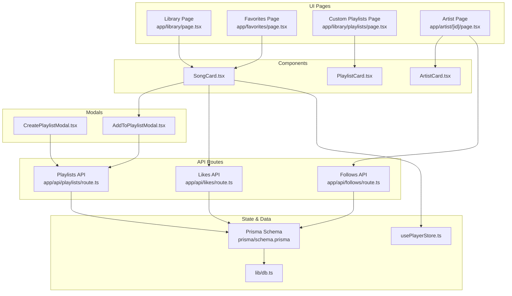
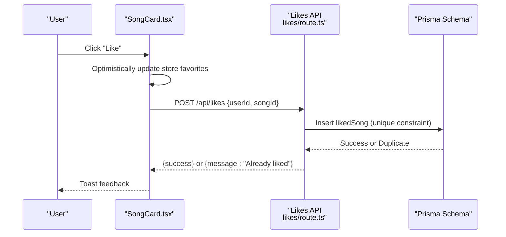
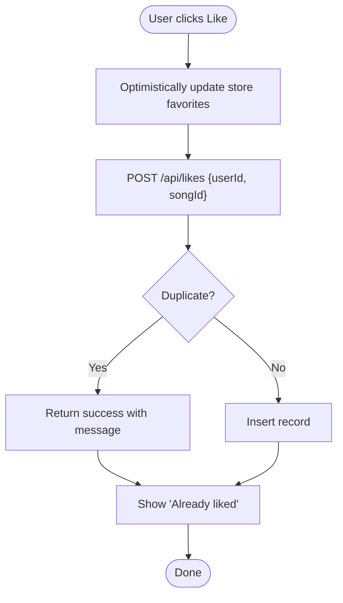
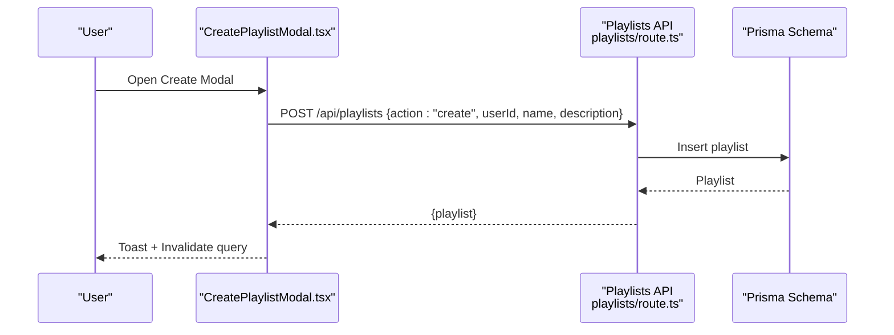
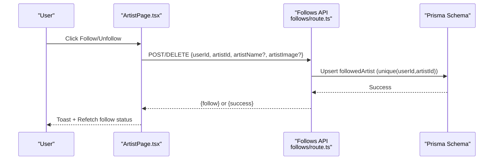
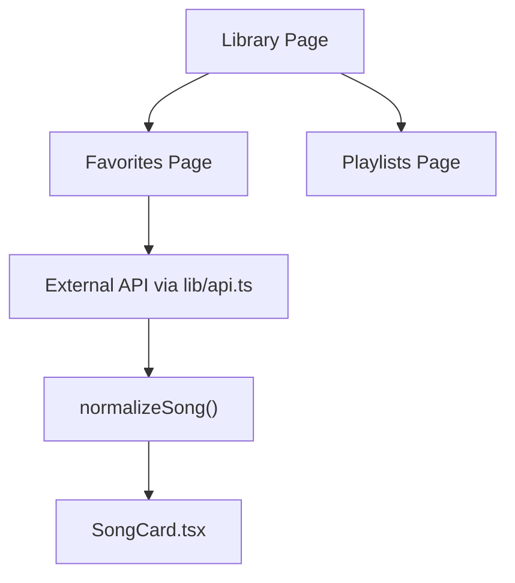
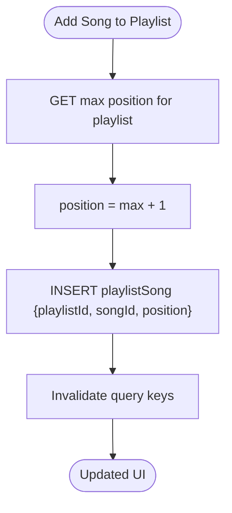
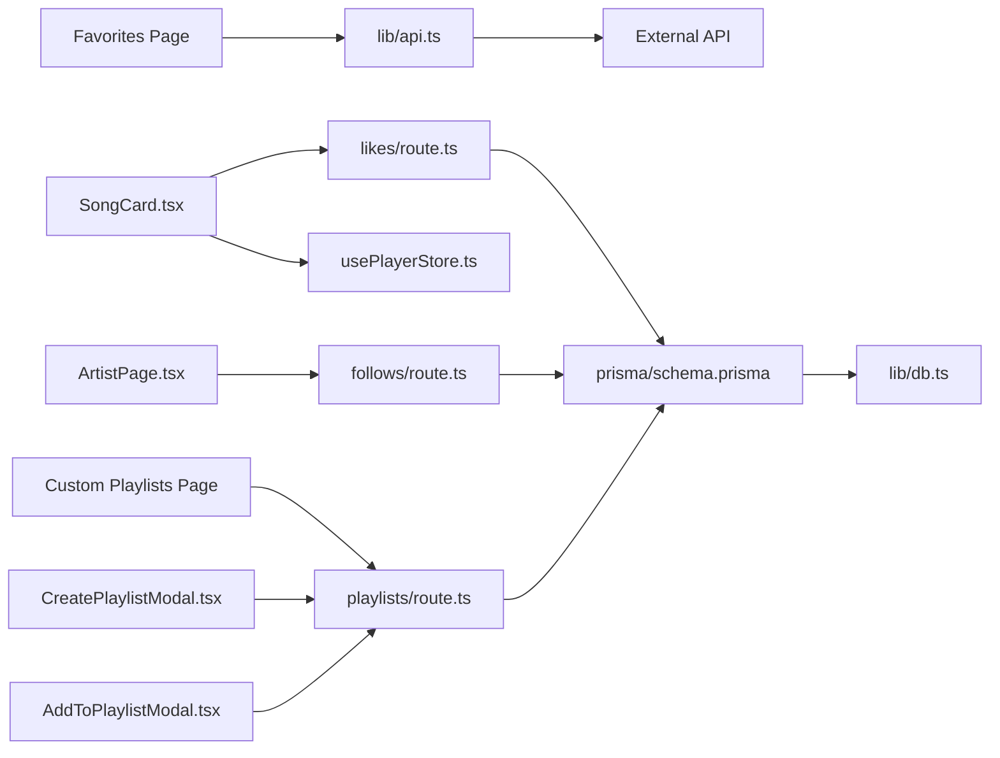
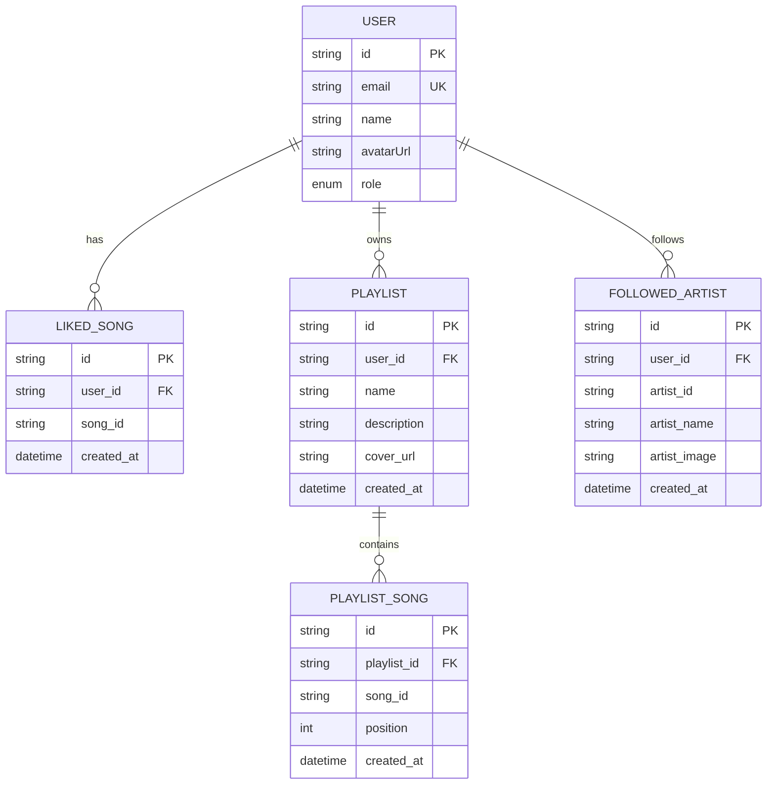

# Social Features

<cite>
**Referenced Files in This Document**
- [route.ts](file://app/api/likes/route.ts)
- [route.ts](file://app/api/follows/route.ts)
- [route.ts](file://app/api/playlists/route.ts)
- [page.tsx](file://app/library/page.tsx)
- [page.tsx](file://app/favorites/page.tsx)
- [page.tsx](file://app/library/playlists/page.tsx)
- [page.tsx](file://app/artist/[id]/page.tsx)
- [CreatePlaylistModal.tsx](file://components/CreatePlaylistModal.tsx)
- [AddToPlaylistModal.tsx](file://components/AddToPlaylistModal.tsx)
- [SongCard.tsx](file://components/SongCard.tsx)
- [ArtistCard.tsx](file://components/ArtistCard.tsx)
- [PlaylistCard.tsx](file://components/PlaylistCard.tsx)
- [schema.prisma](file://prisma/schema.prisma)
- [api.ts](file://lib/api.ts)
- [usePlayerStore.ts](file://store/usePlayerStore.ts)
- [db.ts](file://lib/db.ts)
</cite>

## Table of Contents
1. [Introduction](#introduction)
2. [Project Structure](#project-structure)
3. [Core Components](#core-components)
4. [Architecture Overview](#architecture-overview)
5. [Detailed Component Analysis](#detailed-component-analysis)
6. [Dependency Analysis](#dependency-analysis)
7. [Performance Considerations](#performance-considerations)
8. [Troubleshooting Guide](#troubleshooting-guide)
9. [Conclusion](#conclusion)
10. [Appendices](#appendices)

## Introduction
This document explains the social interaction features of the platform, focusing on:
- Like/favorite system for songs
- Playlist creation, management, and organization
- Artist follow/unfollow functionality
- User library system and favorite songs management
- API endpoints for social interactions, data synchronization, and optimistic UI updates
- Relationship management, permission handling, and content sharing
- UI components for social actions, playlist modals, and library management
- Data consistency, conflict resolution, and performance optimization strategies

## Project Structure
The social features span frontend UI components, Next.js App Router API routes, and a Prisma-backed PostgreSQL schema. Key areas:
- API routes under app/api handle likes, follows, and playlists
- UI pages under app/library and app/artist implement library views and artist follow controls
- Modals encapsulate playlist creation and add-to-playlist flows
- Store manages user state, favorites, and recently played
- Prisma schema defines relationships for liked songs, playlists, and followed artists

**Diagram sources**
- [page.tsx:14-82](file://app/library/page.tsx#L14-L82)
- [page.tsx:12-58](file://app/favorites/page.tsx#L12-L58)
- [page.tsx:14-107](file://app/library/playlists/page.tsx#L14-L107)
- [page.tsx:22-269](file://app/artist/[id]/page.tsx#L22-L269)
- [CreatePlaylistModal.tsx:17-147](file://components/CreatePlaylistModal.tsx#L17-L147)
- [AddToPlaylistModal.tsx:18-178](file://components/AddToPlaylistModal.tsx#L18-L178)
- [SongCard.tsx:22-139](file://components/SongCard.tsx#L22-L139)
- [ArtistCard.tsx:14-50](file://components/ArtistCard.tsx#L14-L50)
- [PlaylistCard.tsx:14-47](file://components/PlaylistCard.tsx#L14-L47)
- [route.ts:4-54](file://app/api/likes/route.ts#L4-L54)
- [route.ts:4-54](file://app/api/follows/route.ts#L4-L54)
- [route.ts:4-89](file://app/api/playlists/route.ts#L4-L89)
- [usePlayerStore.ts:43-127](file://store/usePlayerStore.ts#L43-L127)
- [schema.prisma:34-98](file://prisma/schema.prisma#L34-L98)
- [db.ts:1-10](file://lib/db.ts#L1-L10)

**Section sources**
- [page.tsx:14-82](file://app/library/page.tsx#L14-L82)
- [page.tsx:12-58](file://app/favorites/page.tsx#L12-L58)
- [page.tsx:14-107](file://app/library/playlists/page.tsx#L14-L107)
- [page.tsx:22-269](file://app/artist/[id]/page.tsx#L22-L269)
- [CreatePlaylistModal.tsx:17-147](file://components/CreatePlaylistModal.tsx#L17-L147)
- [AddToPlaylistModal.tsx:18-178](file://components/AddToPlaylistModal.tsx#L18-L178)
- [SongCard.tsx:22-139](file://components/SongCard.tsx#L22-L139)
- [ArtistCard.tsx:14-50](file://components/ArtistCard.tsx#L14-L50)
- [PlaylistCard.tsx:14-47](file://components/PlaylistCard.tsx#L14-L47)
- [route.ts:4-54](file://app/api/likes/route.ts#L4-L54)
- [route.ts:4-54](file://app/api/follows/route.ts#L4-L54)
- [route.ts:4-89](file://app/api/playlists/route.ts#L4-L89)
- [usePlayerStore.ts:43-127](file://store/usePlayerStore.ts#L43-L127)
- [schema.prisma:34-98](file://prisma/schema.prisma#L34-L98)
- [db.ts:1-10](file://lib/db.ts#L1-L10)

## Core Components
- Likes API: CRUD endpoints for liked songs with deduplication handling
- Follows API: CRUD endpoints for followed artists with deduplication handling
- Playlists API: Create, add/remove songs, and delete playlists; maintains order via position
- UI Library: Library landing, playlists list, favorites page
- Modals: CreatePlaylistModal and AddToPlaylistModal orchestrate playlist operations
- SongCard: Social actions (like, add to queue, add to playlist, download)
- ArtistPage: Follow/unfollow artist with optimistic UI and query invalidation
- Store: Centralized favorites and user state for optimistic toggles
- Prisma Schema: Enforces uniqueness and cascading deletes for relationships

**Section sources**
- [route.ts:4-54](file://app/api/likes/route.ts#L4-L54)
- [route.ts:4-54](file://app/api/follows/route.ts#L4-L54)
- [route.ts:4-89](file://app/api/playlists/route.ts#L4-L89)
- [page.tsx:14-82](file://app/library/page.tsx#L14-L82)
- [page.tsx:14-107](file://app/library/playlists/page.tsx#L14-L107)
- [page.tsx:12-58](file://app/favorites/page.tsx#L12-L58)
- [CreatePlaylistModal.tsx:17-147](file://components/CreatePlaylistModal.tsx#L17-L147)
- [AddToPlaylistModal.tsx:18-178](file://components/AddToPlaylistModal.tsx#L18-L178)
- [SongCard.tsx:22-139](file://components/SongCard.tsx#L22-L139)
- [page.tsx:22-269](file://app/artist/[id]/page.tsx#L22-L269)
- [usePlayerStore.ts:43-127](file://store/usePlayerStore.ts#L43-L127)
- [schema.prisma:34-98](file://prisma/schema.prisma#L34-L98)

## Architecture Overview
The social features follow a layered architecture:
- Frontend UI triggers actions via modals and buttons
- API routes validate inputs, enforce uniqueness, and persist changes
- Prisma models define relationships and constraints
- Zustand store enables optimistic UI and local caching
- TanStack Query manages server state and cache invalidation

**Diagram sources**
- [SongCard.tsx:50-57](file://components/SongCard.tsx#L50-L57)
- [route.ts:17-36](file://app/api/likes/route.ts#L17-L36)
- [schema.prisma:34-44](file://prisma/schema.prisma#L34-L44)

**Section sources**
- [SongCard.tsx:50-57](file://components/SongCard.tsx#L50-L57)
- [route.ts:17-36](file://app/api/likes/route.ts#L17-L36)
- [schema.prisma:34-44](file://prisma/schema.prisma#L34-L44)

## Detailed Component Analysis

### Like/Favorite System
- Endpoint GET /api/likes?userId=xxx returns liked song IDs ordered by creation date
- Endpoint POST /api/likes creates a likedSong record with duplicate handling
- Endpoint DELETE /api/likes removes a likedSong record
- UI toggles favorites via store.toggleFavorite and shows immediate feedback
- Backend enforces unique(userId, songId) to prevent duplicates

**Diagram sources**
- [route.ts:17-36](file://app/api/likes/route.ts#L17-L36)
- [schema.prisma:34-44](file://prisma/schema.prisma#L34-L44)
- [SongCard.tsx:50-57](file://components/SongCard.tsx#L50-L57)

**Section sources**
- [route.ts:4-54](file://app/api/likes/route.ts#L4-L54)
- [SongCard.tsx:50-57](file://components/SongCard.tsx#L50-L57)
- [usePlayerStore.ts:104-108](file://store/usePlayerStore.ts#L104-L108)
- [schema.prisma:34-44](file://prisma/schema.prisma#L34-L44)

### Playlist Creation and Management
- CreatePlaylistModal collects name and optional description, validates user session, and posts to /api/playlists with action=create
- CustomPlaylistsPage lists playlists per user and supports deletion
- AddToPlaylistModal fetches user playlists and adds a song via action=addSong, handling duplicates
- Playlists API supports create, addSong, removeSong, and delete with position ordering

**Diagram sources**
- [CreatePlaylistModal.tsx:27-69](file://components/CreatePlaylistModal.tsx#L27-L69)
- [route.ts:18-35](file://app/api/playlists/route.ts#L18-L35)
- [schema.prisma:46-58](file://prisma/schema.prisma#L46-L58)

**Section sources**
- [CreatePlaylistModal.tsx:17-147](file://components/CreatePlaylistModal.tsx#L17-L147)
- [page.tsx:14-107](file://app/library/playlists/page.tsx#L14-L107)
- [AddToPlaylistModal.tsx:18-178](file://components/AddToPlaylistModal.tsx#L18-L178)
- [route.ts:4-89](file://app/api/playlists/route.ts#L4-L89)
- [schema.prisma:46-71](file://prisma/schema.prisma#L46-L71)

### Artist Follow/Unfollow
- ArtistPage conditionally renders follow/unfollow based on user session
- Follow status is fetched via GET /api/follows?userId=xxx and checked against artistId
- Follow/Unfollow toggles via POST/DELETE with artist metadata capture
- UI uses optimistic toggle and refetches follow status after mutation

**Diagram sources**
- [page.tsx:47-72](file://app/artist/[id]/page.tsx#L47-L72)
- [route.ts:17-54](file://app/api/follows/route.ts#L17-L54)
- [schema.prisma:86-98](file://prisma/schema.prisma#L86-L98)

**Section sources**
- [page.tsx:34-72](file://app/artist/[id]/page.tsx#L34-L72)
- [route.ts:4-54](file://app/api/follows/route.ts#L4-L54)
- [schema.prisma:86-98](file://prisma/schema.prisma#L86-L98)

### User Library and Favorite Songs Management
- Library page provides quick access to Liked Songs, Playlists, and Create Playlist
- Favorites page loads song details from external API using normalized song data and displays via SongCard
- Recently Played is maintained in store and shown in library

**Diagram sources**
- [page.tsx:14-82](file://app/library/page.tsx#L14-L82)
- [page.tsx:12-58](file://app/favorites/page.tsx#L12-L58)
- [api.ts:45-69](file://lib/api.ts#L45-L69)
- [api.ts:92-152](file://lib/api.ts#L92-L152)
- [SongCard.tsx:22-139](file://components/SongCard.tsx#L22-L139)

**Section sources**
- [page.tsx:14-82](file://app/library/page.tsx#L14-L82)
- [page.tsx:12-58](file://app/favorites/page.tsx#L12-L58)
- [api.ts:45-69](file://lib/api.ts#L45-L69)
- [api.ts:92-152](file://lib/api.ts#L92-L152)
- [SongCard.tsx:22-139](file://components/SongCard.tsx#L22-L139)

### Playlist Organization and Ordering
- Playlists API computes next position by selecting max position and increments
- PlaylistSong model stores position for deterministic ordering
- UI components render playlist cards and counts

**Diagram sources**
- [route.ts:37-65](file://app/api/playlists/route.ts#L37-L65)
- [schema.prisma:60-71](file://prisma/schema.prisma#L60-L71)
- [AddToPlaylistModal.tsx:43-76](file://components/AddToPlaylistModal.tsx#L43-L76)

**Section sources**
- [route.ts:37-65](file://app/api/playlists/route.ts#L37-L65)
- [schema.prisma:60-71](file://prisma/schema.prisma#L60-L71)
- [AddToPlaylistModal.tsx:43-76](file://components/AddToPlaylistModal.tsx#L43-L76)

### API Endpoints Summary
- Likes
  - GET /api/likes?userId=xxx → { likes: [songId...] }
  - POST /api/likes → { success } or { message:"Already liked" }
  - DELETE /api/likes → { success }
- Follows
  - GET /api/follows?userId=xxx → { follows: [{ artistId, artistName, artistImage, ... }] }
  - POST /api/follows → { follow } or { message:"Already following" }
  - DELETE /api/follows → { success }
- Playlists
  - GET /api/playlists?userId=xxx → { playlists: [PlaylistWithSongs] }
  - POST /api/playlists?action=create → { playlist }
  - POST /api/playlists?action=addSong → { success } or { message:"Song already in playlist" }
  - POST /api/playlists?action=removeSong → { success }
  - DELETE /api/playlists → { success }

**Section sources**
- [route.ts:4-54](file://app/api/likes/route.ts#L4-L54)
- [route.ts:4-54](file://app/api/follows/route.ts#L4-L54)
- [route.ts:4-89](file://app/api/playlists/route.ts#L4-L89)

## Dependency Analysis
- UI depends on store for favorites and user, and on TanStack Query for server state
- Modals depend on API routes for mutations and invalidate queries for cache sync
- API routes depend on Prisma models for persistence and enforce uniqueness
- External API integration normalizes third-party data for consistent rendering

**Diagram sources**
- [SongCard.tsx:22-139](file://components/SongCard.tsx#L22-L139)
- [AddToPlaylistModal.tsx:18-178](file://components/AddToPlaylistModal.tsx#L18-L178)
- [CreatePlaylistModal.tsx:17-147](file://components/CreatePlaylistModal.tsx#L17-L147)
- [page.tsx:22-269](file://app/artist/[id]/page.tsx#L22-L269)
- [page.tsx:14-107](file://app/library/playlists/page.tsx#L14-L107)
- [page.tsx:12-58](file://app/favorites/page.tsx#L12-L58)
- [api.ts:45-69](file://lib/api.ts#L45-L69)
- [route.ts:4-54](file://app/api/likes/route.ts#L4-L54)
- [route.ts:4-54](file://app/api/follows/route.ts#L4-L54)
- [route.ts:4-89](file://app/api/playlists/route.ts#L4-L89)
- [schema.prisma:34-98](file://prisma/schema.prisma#L34-L98)
- [db.ts:1-10](file://lib/db.ts#L1-L10)

**Section sources**
- [SongCard.tsx:22-139](file://components/SongCard.tsx#L22-L139)
- [AddToPlaylistModal.tsx:18-178](file://components/AddToPlaylistModal.tsx#L18-L178)
- [CreatePlaylistModal.tsx:17-147](file://components/CreatePlaylistModal.tsx#L17-L147)
- [page.tsx:22-269](file://app/artist/[id]/page.tsx#L22-L269)
- [page.tsx:14-107](file://app/library/playlists/page.tsx#L14-L107)
- [page.tsx:12-58](file://app/favorites/page.tsx#L12-L58)
- [api.ts:45-69](file://lib/api.ts#L45-L69)
- [route.ts:4-54](file://app/api/likes/route.ts#L4-L54)
- [route.ts:4-54](file://app/api/follows/route.ts#L4-L54)
- [route.ts:4-89](file://app/api/playlists/route.ts#L4-L89)
- [schema.prisma:34-98](file://prisma/schema.prisma#L34-L98)
- [db.ts:1-10](file://lib/db.ts#L1-L10)

## Performance Considerations
- Optimistic UI: Store updates immediately on like/add-to-favorites to reduce perceived latency
- Query invalidation: Modals invalidate relevant query keys to keep UI in sync after mutations
- Pagination and ordering: Playlists and songs are ordered by creation or position to minimize expensive sorts
- Deduplication: Unique constraints prevent redundant writes and maintain data integrity
- External normalization: normalizeSong reduces downstream rendering complexity and handles inconsistent third-party payloads

[No sources needed since this section provides general guidance]

## Troubleshooting Guide
- Like endpoint returns “Already liked” when duplicate detected; UI should reflect existing state
- Add-to-playlist returns “Song already in playlist”; modal highlights already-added playlists
- Follow endpoint returns “Already following”; UI toggles button state and refetches follow status
- Playlist creation requires authenticated user; modal prevents submission when user is missing
- Network errors: Modals surface toast messages; confirm retry and verify network connectivity

**Section sources**
- [route.ts:30-34](file://app/api/likes/route.ts#L30-L34)
- [AddToPlaylistModal.tsx:62-70](file://components/AddToPlaylistModal.tsx#L62-L70)
- [route.ts:30-34](file://app/api/follows/route.ts#L30-L34)
- [CreatePlaylistModal.tsx:32-35](file://components/CreatePlaylistModal.tsx#L32-L35)
- [AddToPlaylistModal.tsx:64-72](file://components/AddToPlaylistModal.tsx#L64-L72)

## Conclusion
The social features are implemented with a clean separation of concerns: UI components trigger actions, API routes enforce validation and uniqueness, and Prisma models define robust relationships. Optimistic updates and query invalidation provide responsive user experiences, while external API normalization ensures consistent rendering. The system balances simplicity with reliability, supporting likes, playlists, and artist following with clear workflows and predictable outcomes.

[No sources needed since this section summarizes without analyzing specific files]

## Appendices

### Data Model Overview

**Diagram sources**
- [schema.prisma:16-98](file://prisma/schema.prisma#L16-L98)