# User Management

<cite>
**Referenced Files in This Document**
- [app/api/auth/route.ts](file://app/api/auth/route.ts)
- [app/api/auth/forgot/route.ts](file://app/api/auth/forgot/route.ts)
- [app/api/auth/reset/route.ts](file://app/api/auth/reset/route.ts)
- [hooks/useAuthGuard.ts](file://hooks/useAuthGuard.ts)
- [components/AuthModal.tsx](file://components/AuthModal.tsx)
- [store/usePlayerStore.ts](file://store/usePlayerStore.ts)
- [lib/db.ts](file://lib/db.ts)
- [prisma/schema.prisma](file://prisma/schema.prisma)
- [lib/cloudinary.ts](file://lib/cloudinary.ts)
- [app/api/upload/route.ts](file://app/api/upload/route.ts)
- [app/profile/page.tsx](file://app/profile/page.tsx)
- [app/admin/login/page.tsx](file://app/admin/login/page.tsx)
- [app/api/admin/users/route.ts](file://app/api/admin/users/route.ts)
- [app/layout.tsx](file://app/layout.tsx)
- [lib/api.ts](file://lib/api.ts)
- [package.json](file://package.json)
</cite>

## Table of Contents
1. [Introduction](#introduction)
2. [Project Structure](#project-structure)
3. [Core Components](#core-components)
4. [Architecture Overview](#architecture-overview)
5. [Detailed Component Analysis](#detailed-component-analysis)
6. [Dependency Analysis](#dependency-analysis)
7. [Performance Considerations](#performance-considerations)
8. [Troubleshooting Guide](#troubleshooting-guide)
9. [Conclusion](#conclusion)
10. [Appendices](#appendices)

## Introduction
This document provides comprehensive documentation for user management features in the application. It covers authentication (login and signup), session-like persistence via local state, password reset, user profile presentation, avatar upload, and administrative controls. It also outlines the authentication guard mechanism, protected actions, and state persistence strategy. Security considerations such as password hashing, token management, and email verification are documented alongside UI components for authentication modals, form validation, and error handling.

## Project Structure
The user management system spans frontend UI components, Zustand-based state management, server-side API routes, and database models. Authentication flows are handled by dedicated API endpoints, while user state is persisted in a client-side store. Administrative controls manage users and roles.

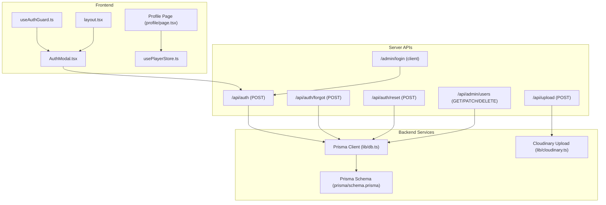

**Diagram sources**
- [components/AuthModal.tsx:1-149](file://components/AuthModal.tsx#L1-L149)
- [app/profile/page.tsx:1-84](file://app/profile/page.tsx#L1-L84)
- [hooks/useAuthGuard.ts:1-29](file://hooks/useAuthGuard.ts#L1-L29)
- [store/usePlayerStore.ts:1-128](file://store/usePlayerStore.ts#L1-L128)
- [app/layout.tsx:78-105](file://app/layout.tsx#L78-L105)
- [app/api/auth/route.ts:15-72](file://app/api/auth/route.ts#L15-L72)
- [app/api/auth/forgot/route.ts:5-67](file://app/api/auth/forgot/route.ts#L5-L67)
- [app/api/auth/reset/route.ts:13-47](file://app/api/auth/reset/route.ts#L13-L47)
- [app/api/upload/route.ts:4-19](file://app/api/upload/route.ts#L4-L19)
- [app/admin/login/page.tsx:15-38](file://app/admin/login/page.tsx#L15-L38)
- [app/api/admin/users/route.ts:4-74](file://app/api/admin/users/route.ts#L4-L74)
- [lib/db.ts:1-10](file://lib/db.ts#L1-L10)
- [prisma/schema.prisma:16-32](file://prisma/schema.prisma#L16-L32)
- [lib/cloudinary.ts:9-18](file://lib/cloudinary.ts#L9-L18)

**Section sources**
- [app/layout.tsx:78-105](file://app/layout.tsx#L78-L105)
- [package.json:12-32](file://package.json#L12-L32)

## Core Components
- Authentication API: Handles sign-up, sign-in, and avatar uploads during registration.
- Password Reset API: Manages password reset requests and validations.
- Auth Modal: Provides interactive login/signup UI with forgot password flow.
- Authentication Guard Hook: Wraps actions requiring authentication and opens the modal when unauthenticated.
- User Store: Centralized state for user data and playback state with persistence.
- Profile Page: Displays user info and logout action.
- Admin Login and Users API: Admin-only login and user management endpoints.
- Cloudinary Upload: Avatar upload service integrated into auth and standalone upload endpoint.

**Section sources**
- [app/api/auth/route.ts:15-72](file://app/api/auth/route.ts#L15-L72)
- [app/api/auth/forgot/route.ts:5-67](file://app/api/auth/forgot/route.ts#L5-L67)
- [app/api/auth/reset/route.ts:13-47](file://app/api/auth/reset/route.ts#L13-L47)
- [components/AuthModal.tsx:26-71](file://components/AuthModal.tsx#L26-L71)
- [hooks/useAuthGuard.ts:12-28](file://hooks/useAuthGuard.ts#L12-L28)
- [store/usePlayerStore.ts:43-127](file://store/usePlayerStore.ts#L43-L127)
- [app/profile/page.tsx:9-84](file://app/profile/page.tsx#L9-L84)
- [app/admin/login/page.tsx:8-38](file://app/admin/login/page.tsx#L8-L38)
- [app/api/admin/users/route.ts:4-74](file://app/api/admin/users/route.ts#L4-L74)
- [lib/cloudinary.ts:9-18](file://lib/cloudinary.ts#L9-L18)
- [app/api/upload/route.ts:4-19](file://app/api/upload/route.ts#L4-L19)

## Architecture Overview
The authentication system is composed of:
- Frontend UI components that trigger API calls.
- Serverless API routes that validate inputs, interact with the database, and send emails.
- Prisma ORM models representing users, roles, and password reset tokens.
- Cloudinary for avatar image storage.
- Zustand store for client-side user state and persistence.

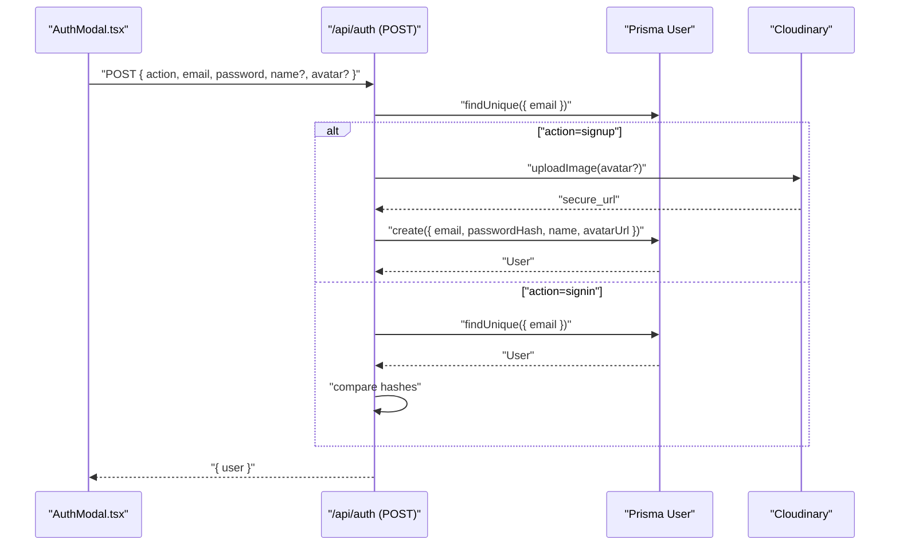

**Diagram sources**
- [components/AuthModal.tsx:30-50](file://components/AuthModal.tsx#L30-L50)
- [app/api/auth/route.ts:16-65](file://app/api/auth/route.ts#L16-L65)
- [lib/cloudinary.ts:9-18](file://lib/cloudinary.ts#L9-L18)
- [prisma/schema.prisma:16-32](file://prisma/schema.prisma#L16-L32)

## Detailed Component Analysis

### Authentication API (/api/auth)
- Purpose: Accepts sign-up and sign-in actions, validates credentials, and returns user data.
- Key behaviors:
  - Sign-up: Checks uniqueness by email, optionally uploads avatar, hashes password, and creates user.
  - Sign-in: Retrieves user by email, compares hashed passwords, and returns user data.
  - Password hashing: Uses SHA-256 with a fixed salt appended to the password.
  - Avatar upload: Integrates with Cloudinary when provided.
- Error handling: Returns appropriate HTTP statuses for missing fields, conflicts, invalid credentials, and internal errors.

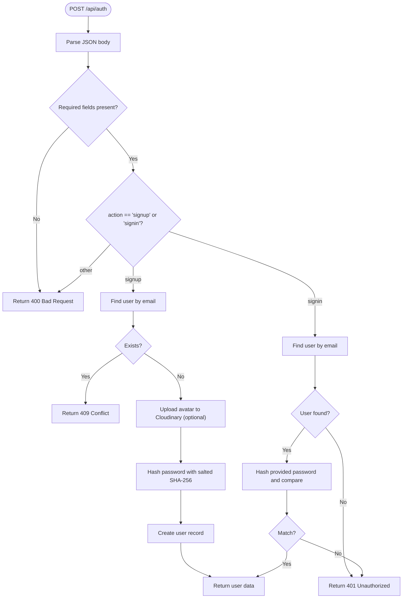

**Diagram sources**
- [app/api/auth/route.ts:16-65](file://app/api/auth/route.ts#L16-L65)
- [lib/cloudinary.ts:9-18](file://lib/cloudinary.ts#L9-L18)

**Section sources**
- [app/api/auth/route.ts:15-72](file://app/api/auth/route.ts#L15-L72)
- [lib/cloudinary.ts:9-18](file://lib/cloudinary.ts#L9-L18)

### Password Reset API (/api/auth/forgot and /api/auth/reset)
- Forgot Password:
  - Validates email presence.
  - Finds user; if not found, still returns a success message to avoid leaking existence.
  - Cleans previous reset tokens for the user.
  - Generates a random token and sets expiration (1 hour).
  - Creates a reset record in the database.
  - Attempts to send an email with a reset link containing the token.
  - Returns a generic success message regardless of email transport outcome.
- Reset Password:
  - Validates token and password length.
  - Retrieves reset token; rejects if not found or expired.
  - Updates user’s password hash.
  - Deletes all reset tokens for the user.
  - Confirms successful reset.

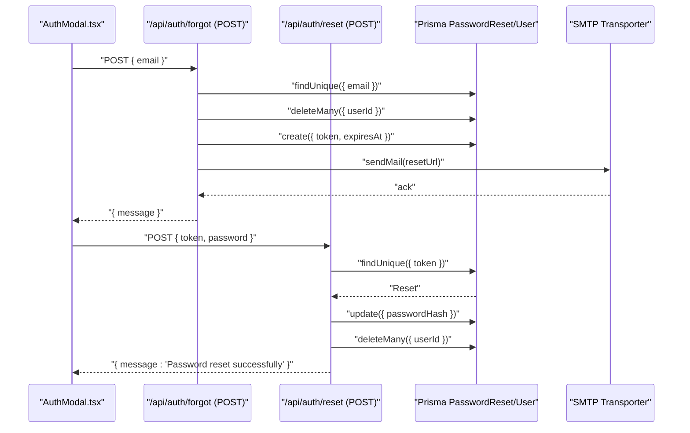

**Diagram sources**
- [app/api/auth/forgot/route.ts:6-62](file://app/api/auth/forgot/route.ts#L6-L62)
- [app/api/auth/reset/route.ts:14-42](file://app/api/auth/reset/route.ts#L14-L42)
- [prisma/schema.prisma:100-110](file://prisma/schema.prisma#L100-L110)

**Section sources**
- [app/api/auth/forgot/route.ts:5-67](file://app/api/auth/forgot/route.ts#L5-L67)
- [app/api/auth/reset/route.ts:13-47](file://app/api/auth/reset/route.ts#L13-L47)

### Authentication Guard and Protected Actions
- useAuthGuard hook:
  - Exposes requireAuth(action) to conditionally execute an action only if a user is present.
  - Opens the AuthModal when attempting an authenticated action without a user.
  - Tracks showAuthModal and isAuthenticated state derived from the store.
- Integration:
  - Components call requireAuth(() => { ... }) to gate sensitive operations.
  - AuthModal triggers the actual authentication flow against /api/auth.

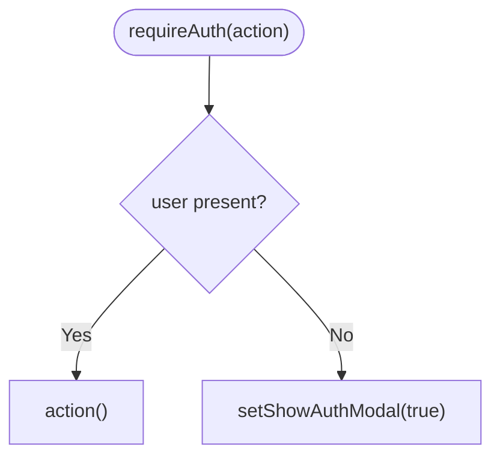

**Diagram sources**
- [hooks/useAuthGuard.ts:16-25](file://hooks/useAuthGuard.ts#L16-L25)
- [components/AuthModal.tsx:30-50](file://components/AuthModal.tsx#L30-L50)

**Section sources**
- [hooks/useAuthGuard.ts:12-28](file://hooks/useAuthGuard.ts#L12-L28)
- [components/AuthModal.tsx:26-50](file://components/AuthModal.tsx#L26-L50)

### User State Persistence and Profile
- Zustand Store (usePlayerStore):
  - Holds user data (id, email, name, avatarUrl) and playback state.
  - Persists selected slices (including user) to local storage with a partializer.
  - Provides setUser to update user state after authentication.
- Profile Page:
  - Displays user avatar, name, and email.
  - Offers sign-out by clearing user state.
  - Shows a prompt to sign in if user is not present.

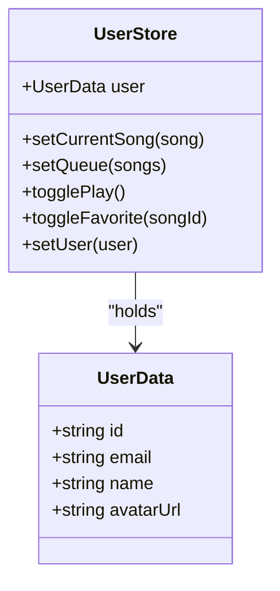

**Diagram sources**
- [store/usePlayerStore.ts:5-41](file://store/usePlayerStore.ts#L5-L41)
- [store/usePlayerStore.ts:114](file://store/usePlayerStore.ts#L114)
- [app/profile/page.tsx:13-15](file://app/profile/page.tsx#L13-L15)

**Section sources**
- [store/usePlayerStore.ts:43-127](file://store/usePlayerStore.ts#L43-L127)
- [app/profile/page.tsx:9-84](file://app/profile/page.tsx#L9-L84)

### Avatar Upload and Profile Presentation
- Cloudinary Integration:
  - uploadImage(base64Data, folder) uploads to Cloudinary with transformations and returns a secure URL.
- Auth Endpoint:
  - On sign-up, avatar base64 can be uploaded and stored; returned URL is saved with the user.
- Standalone Upload API:
  - POST /api/upload accepts base64 image and optional folder, returning the uploaded URL.
- Profile Page:
  - Renders avatar if available; otherwise renders a default placeholder.

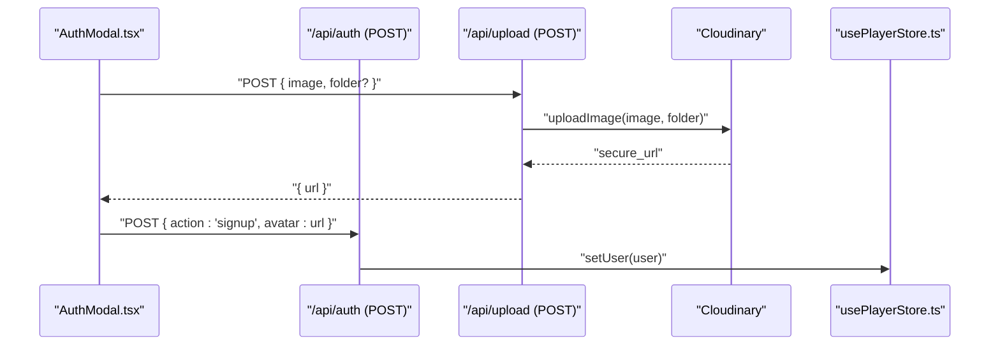

**Diagram sources**
- [lib/cloudinary.ts:9-18](file://lib/cloudinary.ts#L9-L18)
- [app/api/upload/route.ts:5-14](file://app/api/upload/route.ts#L5-L14)
- [app/api/auth/route.ts:32-44](file://app/api/auth/route.ts#L32-L44)
- [store/usePlayerStore.ts:114](file://store/usePlayerStore.ts#L114)

**Section sources**
- [lib/cloudinary.ts:9-18](file://lib/cloudinary.ts#L9-L18)
- [app/api/upload/route.ts:4-19](file://app/api/upload/route.ts#L4-L19)
- [app/api/auth/route.ts:31-44](file://app/api/auth/route.ts#L31-L44)
- [app/profile/page.tsx:42-49](file://app/profile/page.tsx#L42-L49)

### Administrative Controls
- Admin Login:
  - Client-side page that posts credentials to /api/auth and checks role.
  - Stores a simple admin session in localStorage upon success.
- Admin Users API:
  - GET: Lists users with counts for liked songs, playlists, followed artists, and queue items.
  - PATCH: Updates user role or name.
  - DELETE: Removes a user.

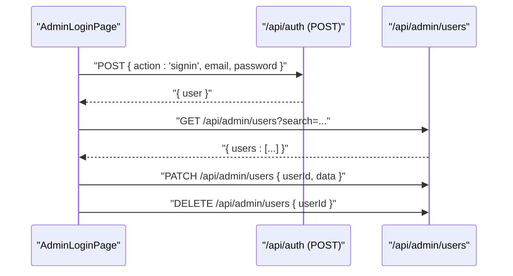

**Diagram sources**
- [app/admin/login/page.tsx:15-38](file://app/admin/login/page.tsx#L15-L38)
- [app/api/admin/users/route.ts:8-39](file://app/api/admin/users/route.ts#L8-L39)
- [app/api/admin/users/route.ts:54-74](file://app/api/admin/users/route.ts#L54-L74)

**Section sources**
- [app/admin/login/page.tsx:8-38](file://app/admin/login/page.tsx#L8-L38)
- [app/api/admin/users/route.ts:4-74](file://app/api/admin/users/route.ts#L4-L74)

## Dependency Analysis
- Frontend dependencies:
  - Zustand for state management and persistence.
  - react-hot-toast for notifications.
  - lucide-react for UI icons.
- Backend dependencies:
  - Prisma client for database operations.
  - Nodemailer for sending password reset emails.
  - Cloudinary SDK for avatar uploads.
- Security-related libraries:
  - crypto for token generation and password hashing.

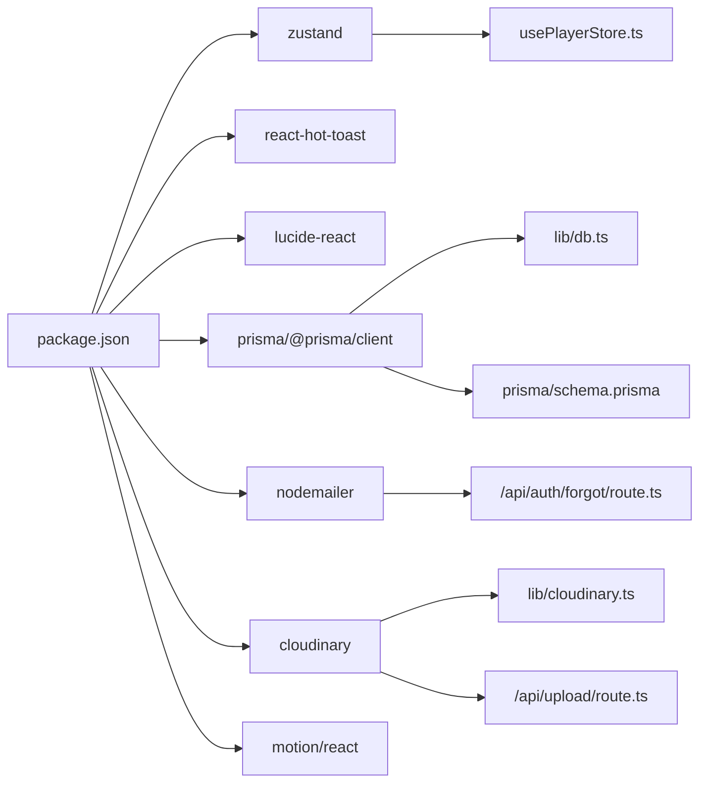

**Diagram sources**
- [package.json:12-32](file://package.json#L12-L32)
- [store/usePlayerStore.ts:1-2](file://store/usePlayerStore.ts#L1-L2)
- [lib/db.ts:1-10](file://lib/db.ts#L1-L10)
- [prisma/schema.prisma:16-32](file://prisma/schema.prisma#L16-L32)
- [app/api/auth/forgot/route.ts:29-56](file://app/api/auth/forgot/route.ts#L29-L56)
- [lib/cloudinary.ts:1-7](file://lib/cloudinary.ts#L1-L7)
- [app/api/upload/route.ts:2](file://app/api/upload/route.ts#L2)

**Section sources**
- [package.json:12-32](file://package.json#L12-L32)

## Performance Considerations
- Password hashing uses SHA-256 with a salt; for production, consider bcrypt or Argon2 for stronger security and configurable cost factors.
- Email transport failures in password reset are logged but do not block success responses; ensure monitoring and retry mechanisms if needed.
- Avatar uploads are processed synchronously; consider asynchronous processing and CDN caching for improved responsiveness.
- Zustand persistence writes selected slices; keep persisted payload minimal to reduce storage overhead.

## Troubleshooting Guide
- Authentication errors:
  - Missing fields: Ensure email and password are provided; server returns 400 for invalid payloads.
  - Duplicate email on signup: Server returns 409; prompt the user to sign in or use another email.
  - Invalid credentials: Server returns 401; verify email/password combination.
- Password reset issues:
  - Token not found or expired: Server returns 400; inform the user to request a new reset link.
  - Email delivery failures: Transport errors are logged; advise the user to check spam or request another link.
- Avatar upload failures:
  - Base64 image missing or invalid: Server returns 400; validate client-side before sending.
  - Cloudinary upload errors: Inspect logs and verify Cloudinary credentials and quotas.
- State persistence:
  - If user does not appear after login, check Zustand persistence configuration and browser storage availability.

**Section sources**
- [app/api/auth/route.ts:21-23](file://app/api/auth/route.ts#L21-L23)
- [app/api/auth/route.ts:27-29](file://app/api/auth/route.ts#L27-L29)
- [app/api/auth/route.ts:53-60](file://app/api/auth/route.ts#L53-L60)
- [app/api/auth/forgot/route.ts:8-15](file://app/api/auth/forgot/route.ts#L8-L15)
- [app/api/auth/reset/route.ts:24-31](file://app/api/auth/reset/route.ts#L24-L31)
- [app/api/upload/route.ts:9-11](file://app/api/upload/route.ts#L9-L11)
- [lib/cloudinary.ts:9-18](file://lib/cloudinary.ts#L9-L18)

## Conclusion
The user management system integrates a straightforward authentication flow with password reset, avatar upload, and client-side state persistence. The design leverages Prisma for data modeling, Cloudinary for media, and Zustand for state. While functional, production readiness requires stronger password hashing, robust token lifecycle management, and enhanced error handling and observability.

## Appendices

### Data Model Overview
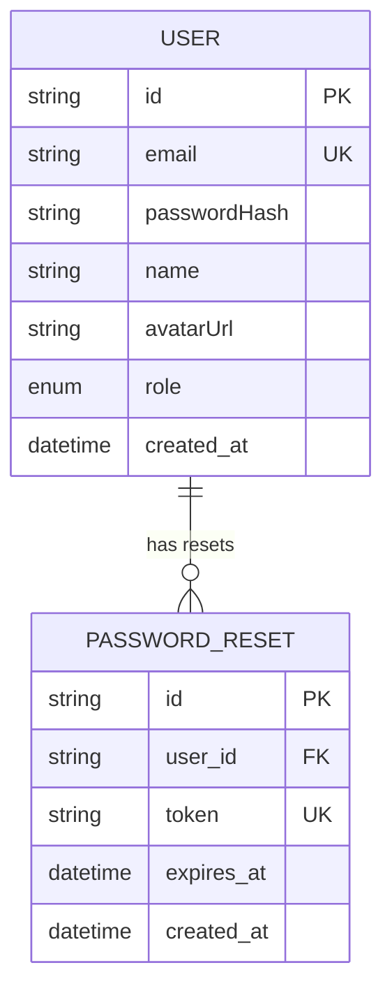

**Diagram sources**
- [prisma/schema.prisma:16-32](file://prisma/schema.prisma#L16-L32)
- [prisma/schema.prisma:100-110](file://prisma/schema.prisma#L100-L110)

### Example Workflows

#### Authentication Flow (Login)
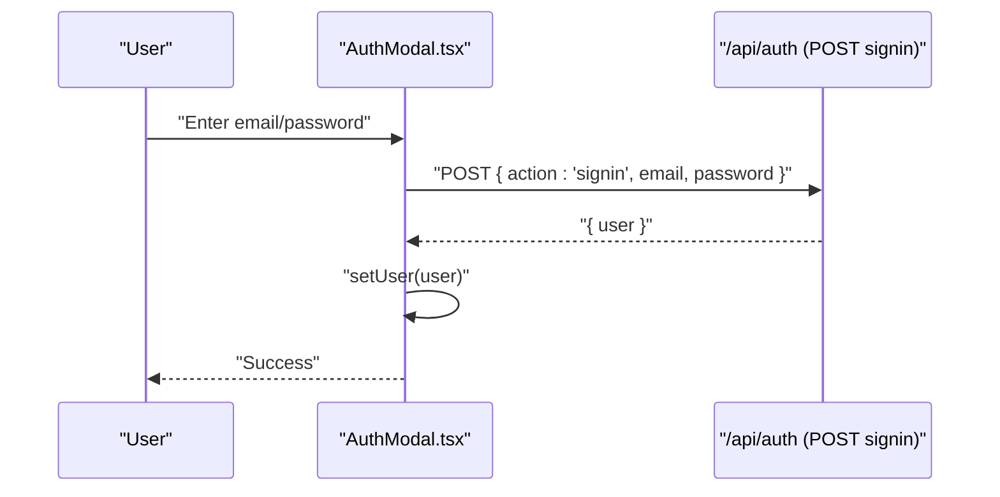

**Diagram sources**
- [components/AuthModal.tsx:30-50](file://components/AuthModal.tsx#L30-L50)
- [app/api/auth/route.ts:51-65](file://app/api/auth/route.ts#L51-L65)
- [store/usePlayerStore.ts:114](file://store/usePlayerStore.ts#L114)

#### Registration with Avatar
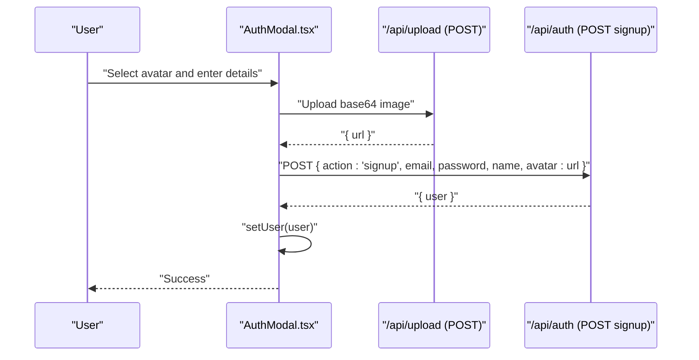

**Diagram sources**
- [components/AuthModal.tsx:30-50](file://components/AuthModal.tsx#L30-L50)
- [app/api/upload/route.ts:5-14](file://app/api/upload/route.ts#L5-L14)
- [app/api/auth/route.ts:25-44](file://app/api/auth/route.ts#L25-L44)
- [store/usePlayerStore.ts:114](file://store/usePlayerStore.ts#L114)

#### Password Reset Flow
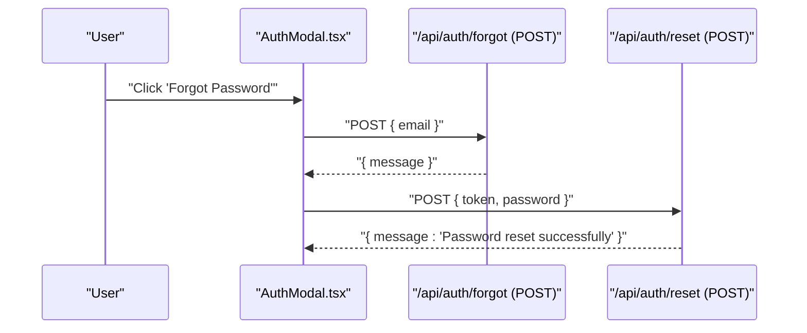

**Diagram sources**
- [components/AuthModal.tsx:52-71](file://components/AuthModal.tsx#L52-L71)
- [app/api/auth/forgot/route.ts:6-62](file://app/api/auth/forgot/route.ts#L6-L62)
- [app/api/auth/reset/route.ts:14-42](file://app/api/auth/reset/route.ts#L14-L42)

### Security and Privacy Notes
- Password hashing: Current implementation uses SHA-256 with a salt; consider bcrypt or Argon2 for production-grade security.
- Token management: Password reset tokens are stored with expiration; ensure cleanup and secure generation.
- Email verification: Not implemented; consider adding email verification for enhanced security.
- Data retention: Prisma schema defines user and reset models; ensure compliance with data minimization and deletion policies.
- CORS and transport: Ensure HTTPS in production and configure CORS appropriately for API endpoints.