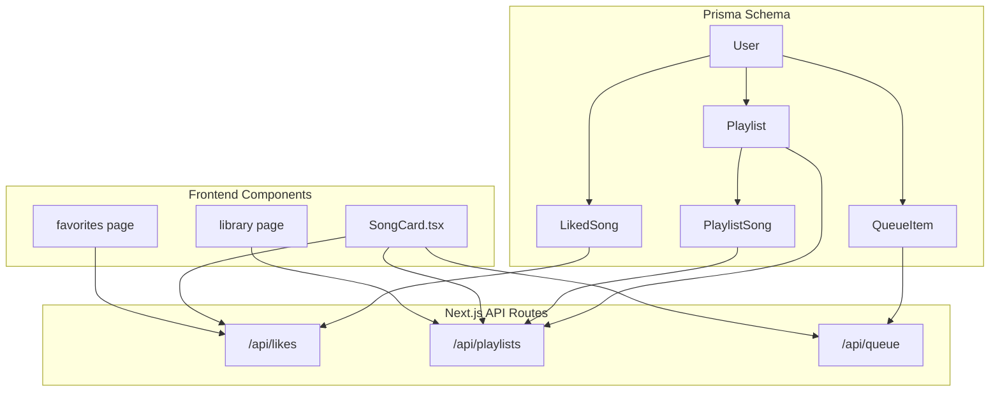
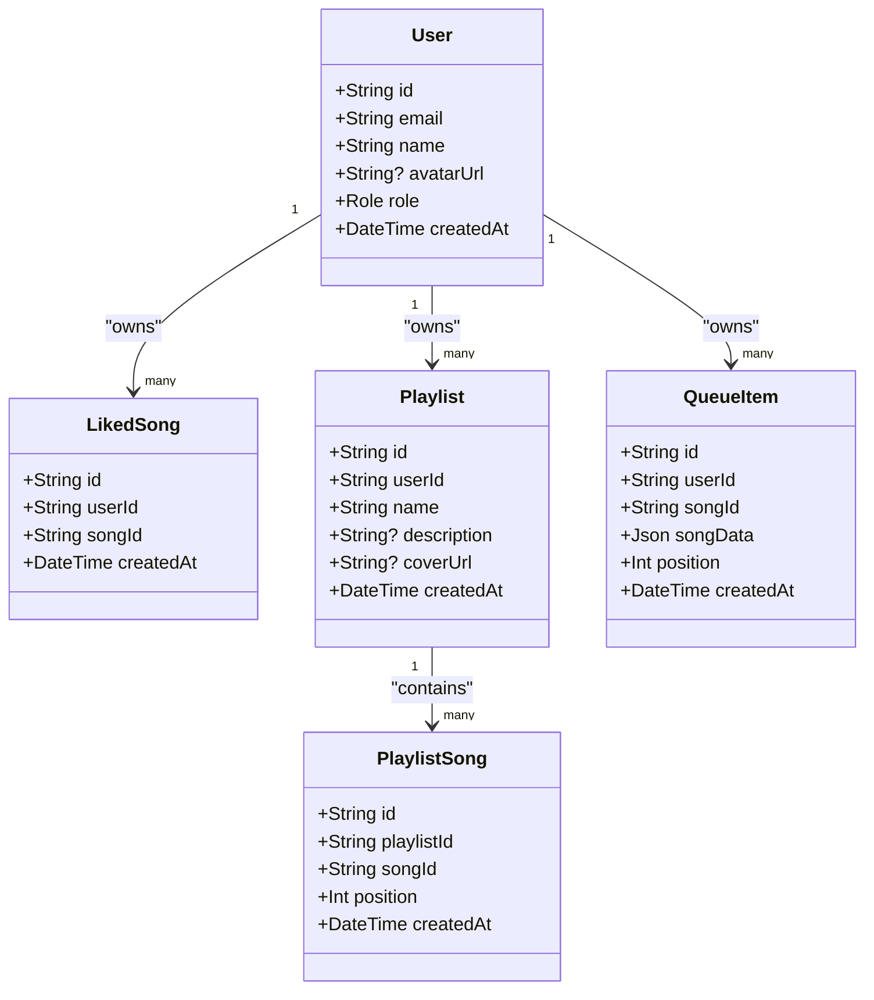
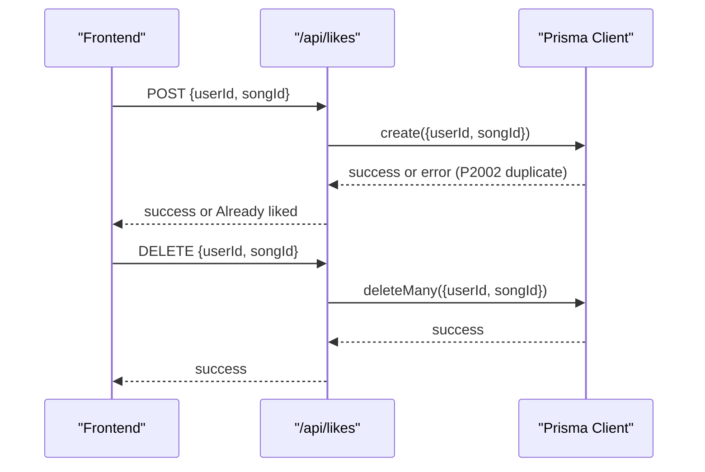
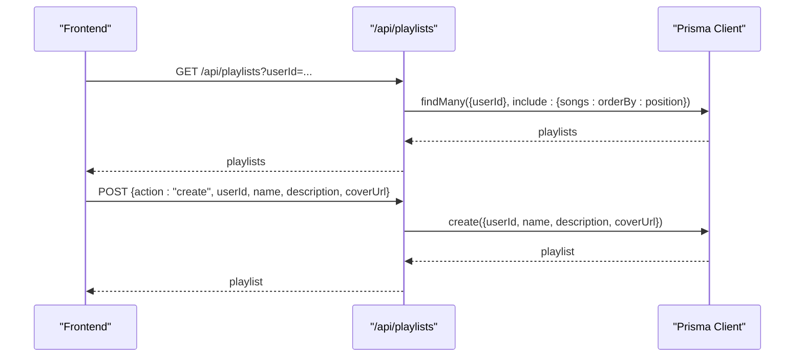
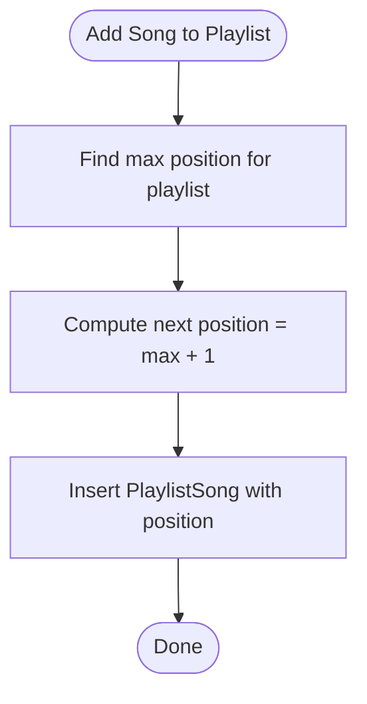
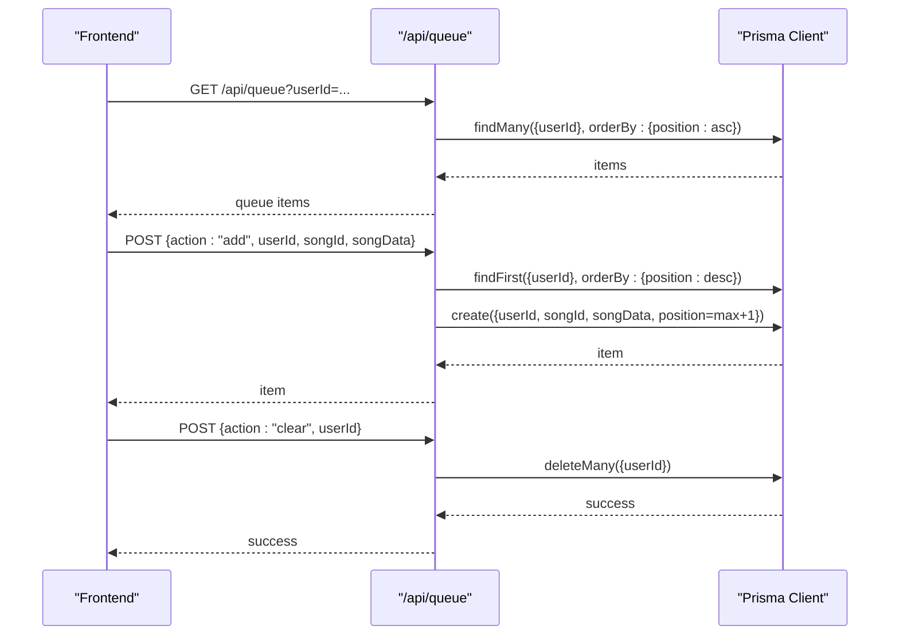
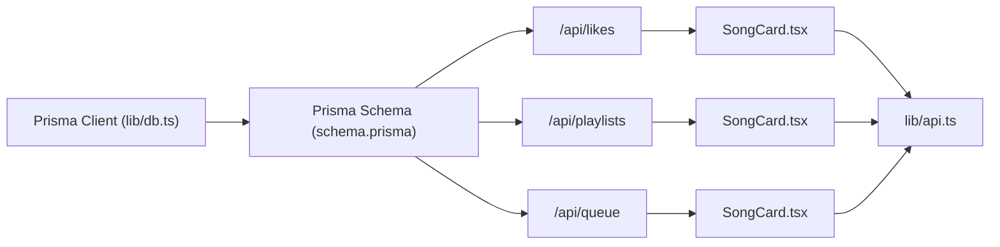

# Content and Media Models

<cite>
**Referenced Files in This Document**
- [schema.prisma](file://prisma/schema.prisma)
- [db.ts](file://lib/db.ts)
- [likes route](file://app/api/likes/route.ts)
- [playlists route](file://app/api/playlists/route.ts)
- [queue route](file://app/api/queue/route.ts)
- [SongCard.tsx](file://components/SongCard.tsx)
- [favorites page](file://app/favorites/page.tsx)
- [library page](file://app/library/page.tsx)
- [api.ts](file://lib/api.ts)
</cite>

## Table of Contents
1. [Introduction](#introduction)
2. [Project Structure](#project-structure)
3. [Core Components](#core-components)
4. [Architecture Overview](#architecture-overview)
5. [Detailed Component Analysis](#detailed-component-analysis)
6. [Dependency Analysis](#dependency-analysis)
7. [Performance Considerations](#performance-considerations)
8. [Troubleshooting Guide](#troubleshooting-guide)
9. [Conclusion](#conclusion)

## Introduction
This document provides a comprehensive data model specification for SonicStream’s content and media management. It focuses on four core models:
- LikedSong: Tracks user favorites with uniqueness constraints and cascade deletion.
- Playlist: User-owned collections with metadata and creation timestamps.
- PlaylistSong: Junction table for ordered many-to-many relationships between playlists and songs.
- QueueItem: Persistent playback queues with JSON song data storage, position tracking, and user-specific management.

It also documents field definitions, indexing strategies, performance considerations, normalization approaches for song metadata, typical query patterns, and lifecycle/cleanup policies for orphaned records.

## Project Structure
The data model is defined in Prisma and consumed by Next.js API routes and frontend components. The Prisma schema defines relations, constraints, and mappings. API routes encapsulate CRUD operations and enforce business rules. Frontend components integrate with the API to manage user libraries, playlists, and queues.

**Diagram sources**
- [schema.prisma](file://prisma/schema.prisma)
- [likes route](file://app/api/likes/route.ts)
- [playlists route](file://app/api/playlists/route.ts)
- [queue route](file://app/api/queue/route.ts)
- [SongCard.tsx](file://components/SongCard.tsx)
- [favorites page](file://app/favorites/page.tsx)
- [library page](file://app/library/page.tsx)

**Section sources**
- [schema.prisma](file://prisma/schema.prisma)
- [db.ts](file://lib/db.ts)

## Core Components
This section outlines the four models with their fields, relations, constraints, and operational semantics.

- LikedSong
  - Purpose: Track a user’s favorite songs.
  - Fields: id, userId, songId, createdAt.
  - Constraints: Unique constraint on (userId, songId) prevents duplicates; cascade deletion on user removal.
  - Indexing: Unique index via Prisma’s @@unique directive; implicit foreign key index on userId.
  - Behavior: Duplicate insertions are handled gracefully by the API (returns success with message).
  - Query patterns: Get all likes for a user; add/remove a like.

- Playlist
  - Purpose: User-owned collection of songs with metadata.
  - Fields: id, userId, name, description, coverUrl, createdAt.
  - Constraints: Cascade deletion on user removal; songs relation via PlaylistSong.
  - Indexing: Implicit foreign key index on userId; composite unique index via relation.
  - Query patterns: List user playlists ordered by creation date; create/update/delete playlists.

- PlaylistSong (Junction)
  - Purpose: Ordered many-to-many relationship between playlists and songs.
  - Fields: id, playlistId, songId, position, createdAt.
  - Constraints: Unique constraint on (playlistId, songId); cascade deletion on playlist removal.
  - Indexing: Unique index on (playlistId, songId); implicit foreign key indices.
  - Ordering: Uses position integer for deterministic order; API derives next position from max.
  - Query patterns: Add song to playlist; remove song from playlist; list playlist contents ordered by position.

- QueueItem
  - Purpose: Persistent playback queue per user with JSON song data and position tracking.
  - Fields: id, userId, songId, songData (Json), position, createdAt.
  - Constraints: Cascade deletion on user removal; no unique constraint on (userId, songId) to allow duplicates.
  - Indexing: Implicit foreign key index on userId; optional index on songId for frequent lookups.
  - Behavior: songData stores normalized song metadata; position determines playback order.
  - Query patterns: Get user queue ordered by position; add item; clear queue; remove specific item.

**Section sources**
- [schema.prisma](file://prisma/schema.prisma)
- [likes route](file://app/api/likes/route.ts)
- [playlists route](file://app/api/playlists/route.ts)
- [queue route](file://app/api/queue/route.ts)

## Architecture Overview
The data model is centered around the User entity and three content-related models. Relations are defined with cascade deletion to maintain referential integrity. API routes encapsulate CRUD operations and enforce uniqueness and ordering constraints.

**Diagram sources**
- [schema.prisma](file://prisma/schema.prisma)

## Detailed Component Analysis

### LikedSong Model
- Field definitions
  - id: Primary key.
  - userId: Foreign key to User; cascade delete enabled.
  - songId: Identifier for the song.
  - createdAt: Timestamp of creation.
- Unique constraints
  - Composite unique index on (userId, songId) prevents duplicate favorites per user.
- Cascade deletion
  - On user deletion, all associated liked songs are deleted automatically.
- API behavior
  - Adding a like returns success even if duplicate detected (handled by Prisma unique constraint).
  - Removing a like deletes matching record(s).
- Query patterns
  - Retrieve all likes for a user ordered by creation time.
  - Upsert-like behavior via create with unique constraint handling.

**Diagram sources**
- [likes route](file://app/api/likes/route.ts)
- [schema.prisma](file://prisma/schema.prisma)

**Section sources**
- [schema.prisma](file://prisma/schema.prisma)
- [likes route](file://app/api/likes/route.ts)

### Playlist Model
- Field definitions
  - id: Primary key.
  - userId: Foreign key to User; cascade delete enabled.
  - name: Required; identifies the playlist.
  - description: Optional; free-text description.
  - coverUrl: Optional; URL to cover image.
  - createdAt: Timestamp of creation.
- Ownership and cascade
  - Playlist belongs to a user; deleting a user cascades to playlists.
- Query patterns
  - List user playlists ordered by creation time.
  - Create/update/delete playlists.
- Frontend integration
  - Library page links to playlists; SongCard triggers add-to-playlist actions.

**Diagram sources**
- [playlists route](file://app/api/playlists/route.ts)
- [schema.prisma](file://prisma/schema.prisma)
- [library page](file://app/library/page.tsx)

**Section sources**
- [schema.prisma](file://prisma/schema.prisma)
- [playlists route](file://app/api/playlists/route.ts)
- [library page](file://app/library/page.tsx)

### PlaylistSong Junction Table
- Field definitions
  - id: Primary key.
  - playlistId: Foreign key to Playlist; cascade delete enabled.
  - songId: Identifier for the song.
  - position: Integer used for ordering.
  - createdAt: Timestamp of creation.
- Unique constraints
  - Composite unique index on (playlistId, songId) ensures one song per playlist.
- Ordering
  - API derives next position by selecting the maximum position and incrementing.
- Query patterns
  - Add song to playlist with computed position.
  - Remove song from playlist.
  - List playlist contents ordered by position ascending.

**Diagram sources**
- [playlists route](file://app/api/playlists/route.ts)
- [schema.prisma](file://prisma/schema.prisma)

**Section sources**
- [schema.prisma](file://prisma/schema.prisma)
- [playlists route](file://app/api/playlists/route.ts)

### QueueItem Model
- Field definitions
  - id: Primary key.
  - userId: Foreign key to User; cascade delete enabled.
  - songId: Identifier for the song.
  - songData: JSON payload containing normalized song metadata.
  - position: Integer used for playback order.
  - createdAt: Timestamp of creation.
- Design choice: JSON storage
  - songData stores normalized metadata to decouple from external APIs and support offline playback.
  - Normalization occurs in the API utility to ensure consistent shape across sources.
- Ordering
  - Queue is ordered by position ascending.
- Query patterns
  - Get user queue ordered by position.
  - Add item with computed position.
  - Clear queue.
  - Remove specific item by id or by (userId, songId).

**Diagram sources**
- [queue route](file://app/api/queue/route.ts)
- [schema.prisma](file://prisma/schema.prisma)
- [api.ts](file://lib/api.ts)

**Section sources**
- [schema.prisma](file://prisma/schema.prisma)
- [queue route](file://app/api/queue/route.ts)
- [api.ts](file://lib/api.ts)

## Dependency Analysis
- Internal dependencies
  - API routes depend on Prisma client initialized in lib/db.ts.
  - Frontend components trigger API calls for likes, playlists, and queue operations.
- External dependencies
  - Song metadata normalization relies on lib/api.ts utility to produce a consistent Song shape.
- Integrity and cascade
  - Cascade deletion on user removes related liked songs, playlists, and queue items.
  - Cascade deletion on playlist removes related playlist-song entries.

**Diagram sources**
- [db.ts](file://lib/db.ts)
- [schema.prisma](file://prisma/schema.prisma)
- [likes route](file://app/api/likes/route.ts)
- [playlists route](file://app/api/playlists/route.ts)
- [queue route](file://app/api/queue/route.ts)
- [SongCard.tsx](file://components/SongCard.tsx)
- [api.ts](file://lib/api.ts)

**Section sources**
- [db.ts](file://lib/db.ts)
- [schema.prisma](file://prisma/schema.prisma)
- [likes route](file://app/api/likes/route.ts)
- [playlists route](file://app/api/playlists/route.ts)
- [queue route](file://app/api/queue/route.ts)
- [SongCard.tsx](file://components/SongCard.tsx)
- [api.ts](file://lib/api.ts)

## Performance Considerations
- Indexing strategies
  - LikedSong: Unique index on (userId, songId) supports fast duplicate detection and efficient user favorites retrieval.
  - PlaylistSong: Unique index on (playlistId, songId) ensures fast membership checks and ordered retrieval.
  - QueueItem: Consider adding an index on songId for frequent lookups by song identifier.
  - Playlist: Implicit foreign key index on userId supports efficient user playlist queries.
- Ordering and pagination
  - Use position integers for deterministic ordering; apply orderBy clauses consistently in queries.
  - For large queues or playlists, consider paginated reads with take/skip or cursor-based pagination.
- JSON storage
  - songData normalization reduces variability and improves cacheability; keep JSON payloads minimal.
- Cascade deletion
  - Cascade on user deletion simplifies cleanup but can cause bulk deletions; monitor performance during user churn.
- Query patterns
  - Likes: Filter by userId; order by createdAt desc.
  - Playlists: Filter by userId; include songs ordered by position asc; order playlists by createdAt desc.
  - Queue: Filter by userId; order by position asc.

[No sources needed since this section provides general guidance]

## Troubleshooting Guide
- Duplicate favorites
  - Symptom: Attempting to like the same song twice.
  - Resolution: API handles Prisma unique constraint error; response indicates “Already liked”.
- Song already in playlist
  - Symptom: Attempting to add a song already present in a playlist.
  - Resolution: API returns success with message indicating duplication; no error thrown.
- Queue item removal
  - Symptom: Removing an item fails.
  - Resolution: Ensure either id or (userId, songId) is provided; API supports both forms.
- Orphaned records
  - LikedSong and PlaylistSong entries are protected by cascade deletion on user removal.
  - QueueItem entries are also cascade-deleted with user; no manual cleanup required.
- JSON song data inconsistencies
  - Normalize incoming song data using the normalization utility to ensure consistent fields across sources.

**Section sources**
- [likes route](file://app/api/likes/route.ts)
- [playlists route](file://app/api/playlists/route.ts)
- [queue route](file://app/api/queue/route.ts)
- [api.ts](file://lib/api.ts)

## Conclusion
SonicStream’s data model for content and media management emphasizes user ownership, explicit ordering, and flexible metadata storage. The Prisma schema enforces uniqueness and cascade deletion to maintain integrity. API routes encapsulate business logic for favorites, playlists, and queues, while frontend components integrate seamlessly with these endpoints. The normalization of song metadata into JSON enables robust offline playback and consistent user experiences.