# Database Operations and Access Patterns

<cite>
**Referenced Files in This Document**
- [schema.prisma](file://prisma/schema.prisma)
- [db.ts](file://lib/db.ts)
- [package.json](file://package.json)
- [seed/route.ts](file://app/api/admin/seed/route.ts)
- [stats/route.ts](file://app/api/admin/stats/route.ts)
- [users/route.ts](file://app/api/admin/users/route.ts)
- [playlists/route.ts](file://app/api/playlists/route.ts)
- [follows/route.ts](file://app/api/follows/route.ts)
- [likes/route.ts](file://app/api/likes/route.ts)
- [queue/route.ts](file://app/api/queue/route.ts)
- [upload/route.ts](file://app/api/upload/route.ts)
- [cloudinary.ts](file://lib/cloudinary.ts)
</cite>

## Table of Contents
1. [Introduction](#introduction)
2. [Project Structure](#project-structure)
3. [Core Components](#core-components)
4. [Architecture Overview](#architecture-overview)
5. [Detailed Component Analysis](#detailed-component-analysis)
6. [Dependency Analysis](#dependency-analysis)
7. [Performance Considerations](#performance-considerations)
8. [Troubleshooting Guide](#troubleshooting-guide)
9. [Conclusion](#conclusion)
10. [Appendices](#appendices)

## Introduction
This document explains SonicStream’s database operations and access patterns with a focus on Prisma usage, connection management, query optimization, transactions, migrations, monitoring, and integration with Next.js API routes. It synthesizes the schema, client initialization, and API route implementations to provide practical guidance for building scalable and maintainable data access layers.

## Project Structure
SonicStream organizes database concerns into a small set of focused areas:
- Prisma schema defines models, enums, relations, and indexes.
- A singleton Prisma client is initialized once per runtime and reused globally.
- Next.js API routes encapsulate CRUD and aggregation operations, leveraging Prisma client methods and basic error handling.

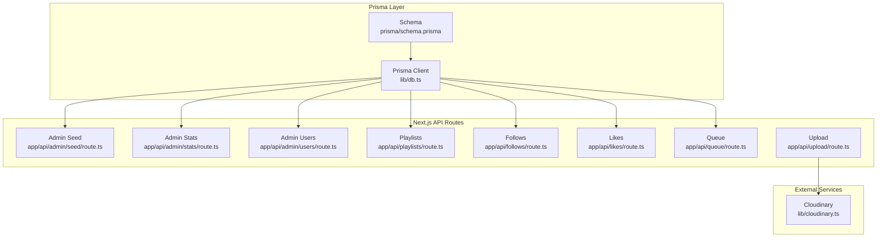

**Diagram sources**
- [db.ts:1-10](file://lib/db.ts#L1-L10)
- [schema.prisma:1-111](file://prisma/schema.prisma#L1-L111)
- [seed/route.ts:1-40](file://app/api/admin/seed/route.ts#L1-L40)
- [stats/route.ts:1-28](file://app/api/admin/stats/route.ts#L1-L28)
- [users/route.ts:1-75](file://app/api/admin/users/route.ts#L1-L75)
- [playlists/route.ts:1-90](file://app/api/playlists/route.ts#L1-L90)
- [follows/route.ts:1-55](file://app/api/follows/route.ts#L1-L55)
- [likes/route.ts:1-55](file://app/api/likes/route.ts#L1-L55)
- [queue/route.ts:1-86](file://app/api/queue/route.ts#L1-L86)
- [upload/route.ts:1-20](file://app/api/upload/route.ts#L1-L20)
- [cloudinary.ts:1-21](file://lib/cloudinary.ts#L1-L21)

**Section sources**
- [schema.prisma:1-111](file://prisma/schema.prisma#L1-L111)
- [db.ts:1-10](file://lib/db.ts#L1-L10)
- [package.json:1-50](file://package.json#L1-L50)

## Core Components
- Prisma Client Initialization
  - A singleton Prisma client is created once and stored in a global variable during development to avoid hot reload duplication. In production, the module cache ensures a single client instance.
  - Environment variables supply the database URLs for both pooled and direct connections.

- Prisma Schema
  - Defines the domain models and relationships, including unique constraints and relation fields.
  - Enumerations define categorical attributes such as roles.
  - Index hints are implicit via @id, @unique, and relation fields; explicit indexes can be added as needed.

- Next.js API Routes
  - Each route encapsulates a cohesive set of operations (CRUD, counts, aggregations) against the Prisma client.
  - Routes handle request parsing, validation, and response formatting, with basic error handling and Prisma error code checks.

**Section sources**
- [db.ts:1-10](file://lib/db.ts#L1-L10)
- [schema.prisma:1-111](file://prisma/schema.prisma#L1-L111)
- [seed/route.ts:1-40](file://app/api/admin/seed/route.ts#L1-L40)
- [stats/route.ts:1-28](file://app/api/admin/stats/route.ts#L1-L28)
- [users/route.ts:1-75](file://app/api/admin/users/route.ts#L1-L75)
- [playlists/route.ts:1-90](file://app/api/playlists/route.ts#L1-L90)
- [follows/route.ts:1-55](file://app/api/follows/route.ts#L1-L55)
- [likes/route.ts:1-55](file://app/api/likes/route.ts#L1-L55)
- [queue/route.ts:1-86](file://app/api/queue/route.ts#L1-L86)
- [upload/route.ts:1-20](file://app/api/upload/route.ts#L1-L20)

## Architecture Overview
The application follows a layered architecture:
- Presentation: Next.js pages and API routes.
- Application: Route handlers orchestrate requests, validate inputs, and call Prisma operations.
- Persistence: Prisma client interacts with PostgreSQL using environment-provided URLs.

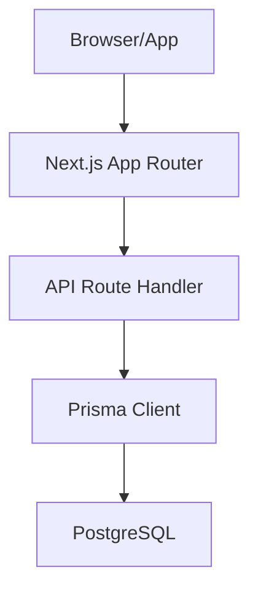

[No sources needed since this diagram shows conceptual workflow, not actual code structure]

## Detailed Component Analysis

### Prisma Client Initialization and Connection Management
- Singleton pattern prevents multiple clients and supports connection reuse.
- Global storage avoids duplication during development hot reloads.
- Environment variables provide database URLs for pooled and direct connections.

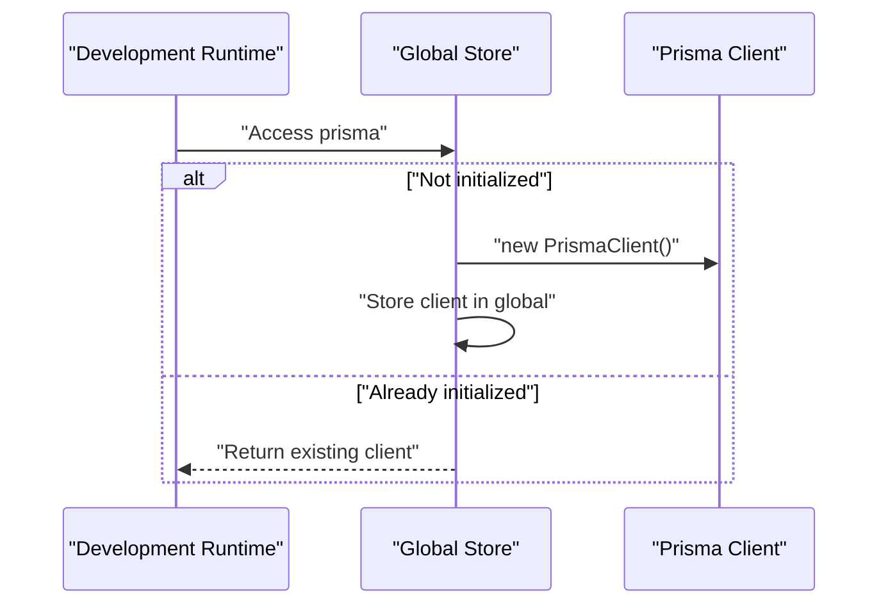

**Diagram sources**
- [db.ts:1-10](file://lib/db.ts#L1-L10)

**Section sources**
- [db.ts:1-10](file://lib/db.ts#L1-L10)
- [schema.prisma:5-9](file://prisma/schema.prisma#L5-L9)

### Schema, Models, and Relationships
- Enumerations define categorical values.
- Models represent entities with primary keys, timestamps, and relations.
- Unique constraints enforce data integrity for composite keys.
- Relation fields connect parent-child entities with cascade deletes.

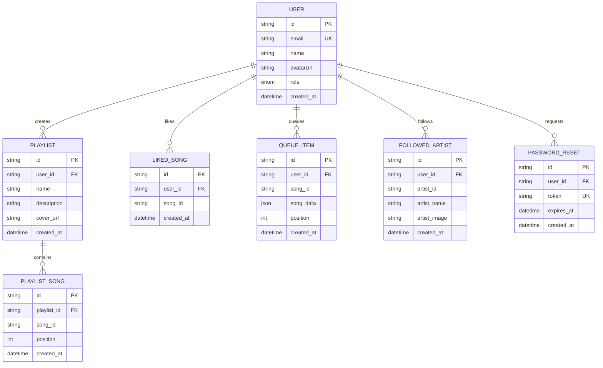

**Diagram sources**
- [schema.prisma:11-111](file://prisma/schema.prisma#L11-L111)

**Section sources**
- [schema.prisma:11-111](file://prisma/schema.prisma#L11-L111)

### Admin Seed Operation
- Creates or promotes a default admin user.
- Uses a deterministic hashing approach for password storage.
- Handles existence checks and updates.

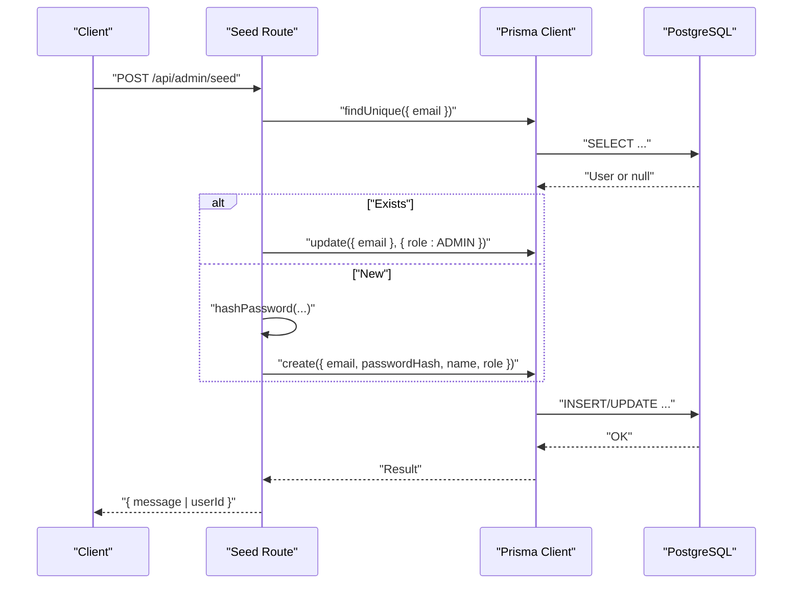

**Diagram sources**
- [seed/route.ts:14-39](file://app/api/admin/seed/route.ts#L14-L39)

**Section sources**
- [seed/route.ts:1-40](file://app/api/admin/seed/route.ts#L1-L40)

### Playlists API
- Fetches playlists for a user, including ordered songs.
- Supports creation, adding a song, removing a song, and deletion.
- Uses unique constraints to prevent duplicates and handles Prisma error codes.

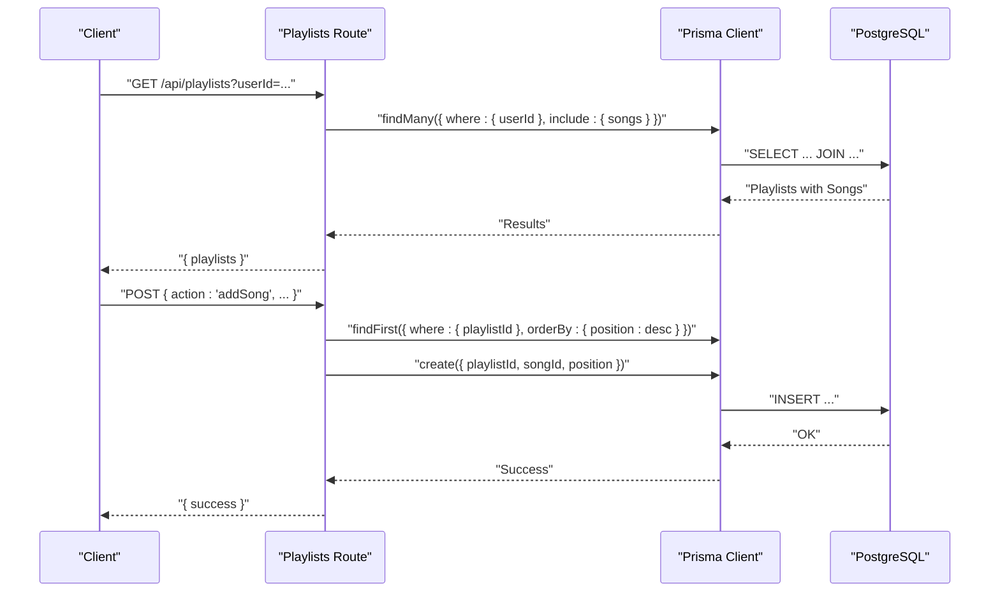

**Diagram sources**
- [playlists/route.ts:4-74](file://app/api/playlists/route.ts#L4-L74)

**Section sources**
- [playlists/route.ts:1-90](file://app/api/playlists/route.ts#L1-L90)

### Likes API
- Retrieves liked song identifiers for a user.
- Adds or removes likes with duplicate handling via Prisma error codes.

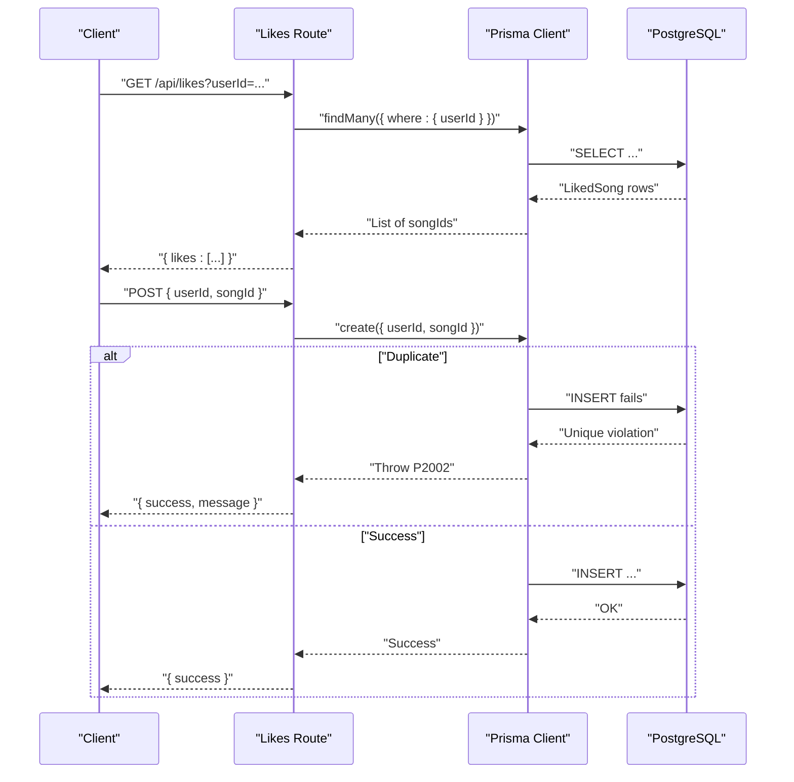

**Diagram sources**
- [likes/route.ts:4-36](file://app/api/likes/route.ts#L4-L36)

**Section sources**
- [likes/route.ts:1-55](file://app/api/likes/route.ts#L1-L55)

### Follows API
- Manages followed artists with deduplication and removal.

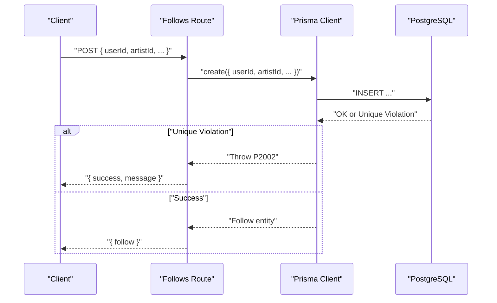

**Diagram sources**
- [follows/route.ts:17-36](file://app/api/follows/route.ts#L17-L36)

**Section sources**
- [follows/route.ts:1-55](file://app/api/follows/route.ts#L1-L55)

### Queue API
- Retrieves queue items ordered by position.
- Supports adding items and clearing the queue.

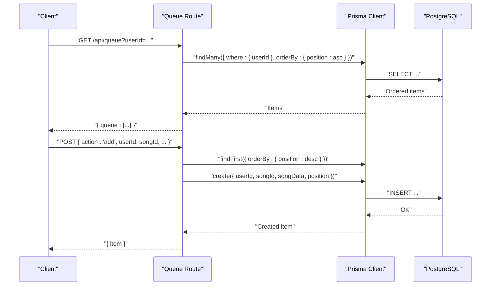

**Diagram sources**
- [queue/route.ts:4-66](file://app/api/queue/route.ts#L4-L66)

**Section sources**
- [queue/route.ts:1-86](file://app/api/queue/route.ts#L1-L86)

### Admin Statistics and Users
- Aggregates counts across multiple models and returns recent users.
- Lists users with counts for related entities and supports updates and deletions.

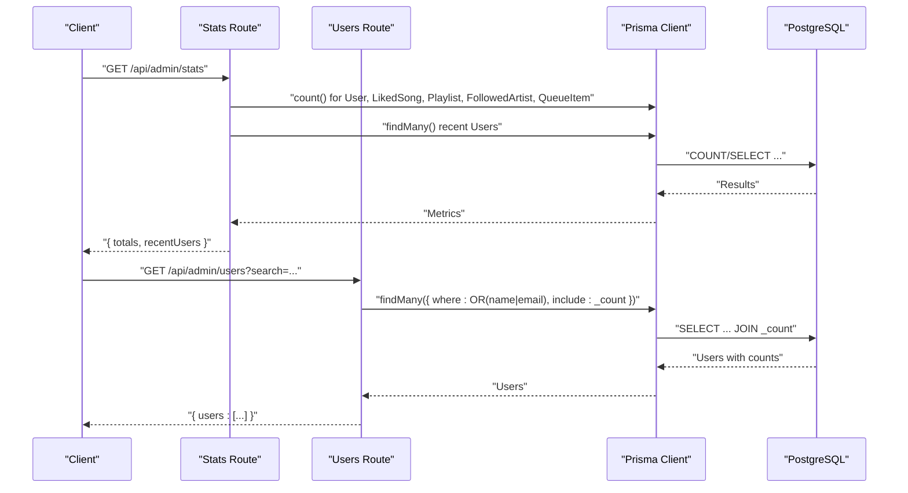

**Diagram sources**
- [stats/route.ts:4-27](file://app/api/admin/stats/route.ts#L4-L27)
- [users/route.ts:4-39](file://app/api/admin/users/route.ts#L4-L39)

**Section sources**
- [stats/route.ts:1-28](file://app/api/admin/stats/route.ts#L1-L28)
- [users/route.ts:1-75](file://app/api/admin/users/route.ts#L1-L75)

### Upload Integration
- Uploads images to Cloudinary and returns secure URLs.
- Does not directly interact with the database in this route.

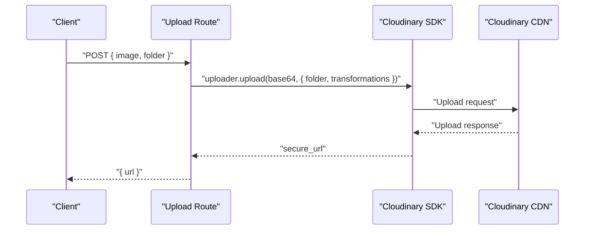

**Diagram sources**
- [upload/route.ts:4-19](file://app/api/upload/route.ts#L4-L19)
- [cloudinary.ts:9-18](file://lib/cloudinary.ts#L9-L18)

**Section sources**
- [upload/route.ts:1-20](file://app/api/upload/route.ts#L1-L20)
- [cloudinary.ts:1-21](file://lib/cloudinary.ts#L1-L21)

## Dependency Analysis
- Prisma Client is a singleton imported by all API routes.
- The Prisma client depends on the schema and environment variables for database connectivity.
- External service integrations (Cloudinary) are independent of Prisma but used by API routes.

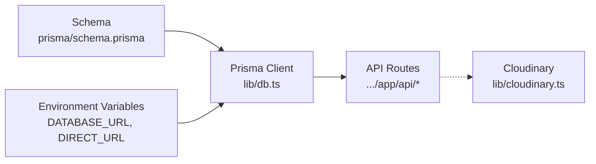

**Diagram sources**
- [db.ts:1-10](file://lib/db.ts#L1-L10)
- [schema.prisma:5-9](file://prisma/schema.prisma#L5-L9)
- [package.json:12-33](file://package.json#L12-L33)

**Section sources**
- [db.ts:1-10](file://lib/db.ts#L1-L10)
- [schema.prisma:5-9](file://prisma/schema.prisma#L5-L9)
- [package.json:12-33](file://package.json#L12-L33)

## Performance Considerations
- Query Optimization Strategies
  - Relationship Prefetching: Use include to load related collections (e.g., playlist songs) in a single operation where appropriate.
  - Sorting and Pagination: Apply orderBy and limit results to reduce payload sizes and improve responsiveness.
  - Selectivity: Filter early with where clauses to minimize scanned rows.
  - Count Aggregation: Use count() for summary views to avoid loading full datasets.
  - Unique Constraints: Leverage unique indexes to prevent duplicates and speed up conflict detection.

- Batch Operations
  - Prefer deleteMany for bulk removals.
  - Use atomic operations (e.g., insert with computed positions) to minimize round trips.

- Indexing Approaches
  - Primary keys (@id) and unique fields (@unique) act as indexes by default.
  - Composite unique constraints (e.g., liked songs, playlist songs) prevent duplicates efficiently.
  - Consider adding indexes on frequently filtered columns (e.g., user_id) if query patterns evolve.

- Memory Optimization
  - Stream large result sets using pagination.
  - Avoid selecting unnecessary fields; use projection where possible.
  - Keep payloads minimal in API responses.

- Transaction Handling
  - Current routes perform single-model operations. For multi-model writes, wrap operations in a transaction block to ensure atomicity.
  - Example pattern: beginTransaction, execute multiple writes, commit or rollback on error.

- Monitoring and Logging
  - Enable Prisma query logging during development to inspect generated SQL.
  - Monitor database performance metrics and slow query logs.
  - Track API latency and error rates to identify bottlenecks.

[No sources needed since this section provides general guidance]

## Troubleshooting Guide
- Common Errors and Resolutions
  - Duplicate Entry Errors: Catch unique constraint violations and return user-friendly messages.
  - Validation Failures: Validate required parameters and return structured error responses.
  - Database Connectivity: Verify DATABASE_URL and DIRECT_URL environment variables.
  - Hot Reload Issues: Rely on the singleton client to avoid multiple instances.

- Retry Mechanisms
  - Implement exponential backoff for transient failures.
  - Limit retries and surface errors to clients with appropriate status codes.

- Error Handling Patterns
  - Centralized try/catch blocks in API routes.
  - Specific Prisma error code checks for known constraints.

**Section sources**
- [playlists/route.ts:69-72](file://app/api/playlists/route.ts#L69-L72)
- [likes/route.ts:30-34](file://app/api/likes/route.ts#L30-L34)
- [follows/route.ts:30-34](file://app/api/follows/route.ts#L30-L34)
- [seed/route.ts:35-38](file://app/api/admin/seed/route.ts#L35-L38)
- [db.ts:1-10](file://lib/db.ts#L1-L10)

## Conclusion
SonicStream’s database layer leverages a singleton Prisma client, a well-defined schema, and concise API routes to support core music streaming features. By applying relationship prefetching, selective projections, and count-based aggregations, the system remains responsive. Extending to transactions, advanced indexing, and robust monitoring will further strengthen reliability and performance.

[No sources needed since this section summarizes without analyzing specific files]

## Appendices

### Database URL Configuration
- Configure DATABASE_URL and DIRECT_URL via environment variables consumed by the Prisma datasource.
- Ensure credentials and host settings match your deployment environment.

**Section sources**
- [schema.prisma:5-9](file://prisma/schema.prisma#L5-L9)

### Migration Procedures and Version Management
- Use Prisma Migrate to manage schema changes and rollbacks.
- Commit migration files to version control and apply to staging/production environments systematically.

[No sources needed since this section provides general guidance]

### Best Practices for Large Datasets and Pagination
- Paginate lists with cursor-based or offset-based strategies depending on stability needs.
- Use orderBy consistently to ensure reproducible results.
- Limit returned fields to essential ones for list views.

[No sources needed since this section provides general guidance]

### Examples of Common Operations
- CRUD on Playlists: Creation, addition/removal of songs, deletion.
- CRUD on Likes/Follows: Adding/removing associations with duplicate handling.
- Queue Management: Ordered insertion and clearing.
- Aggregations: Counts and recent records for admin dashboards.

**Section sources**
- [playlists/route.ts:18-74](file://app/api/playlists/route.ts#L18-L74)
- [likes/route.ts:17-54](file://app/api/likes/route.ts#L17-L54)
- [follows/route.ts:17-54](file://app/api/follows/route.ts#L17-L54)
- [queue/route.ts:24-85](file://app/api/queue/route.ts#L24-L85)
- [stats/route.ts:6-17](file://app/api/admin/stats/route.ts#L6-L17)