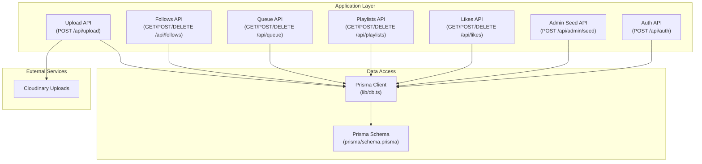
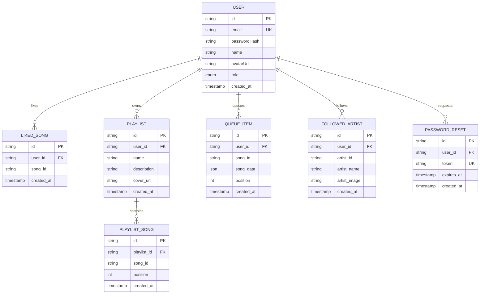
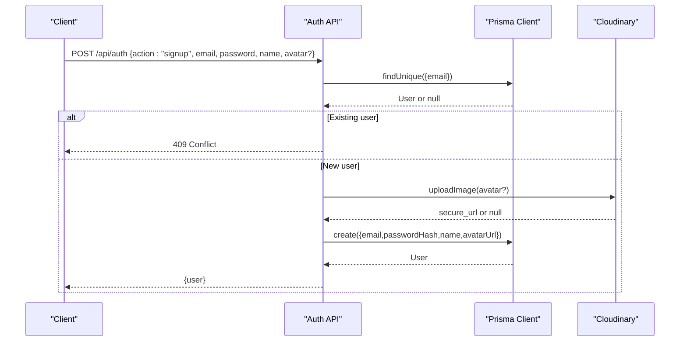
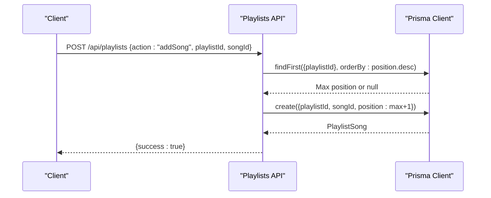
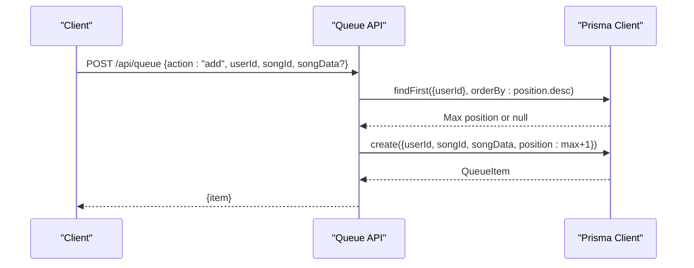
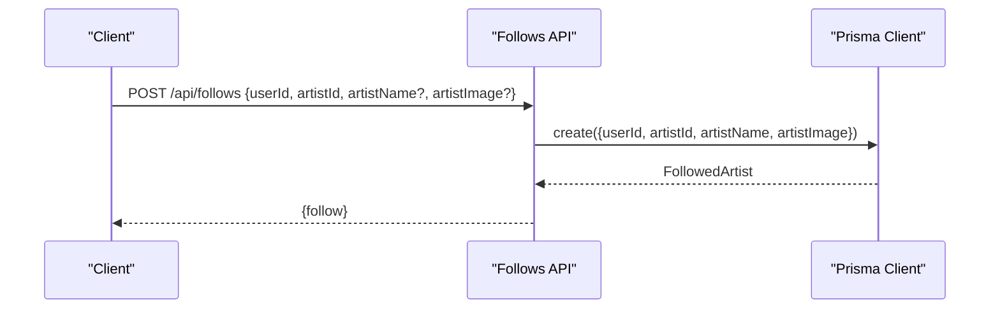
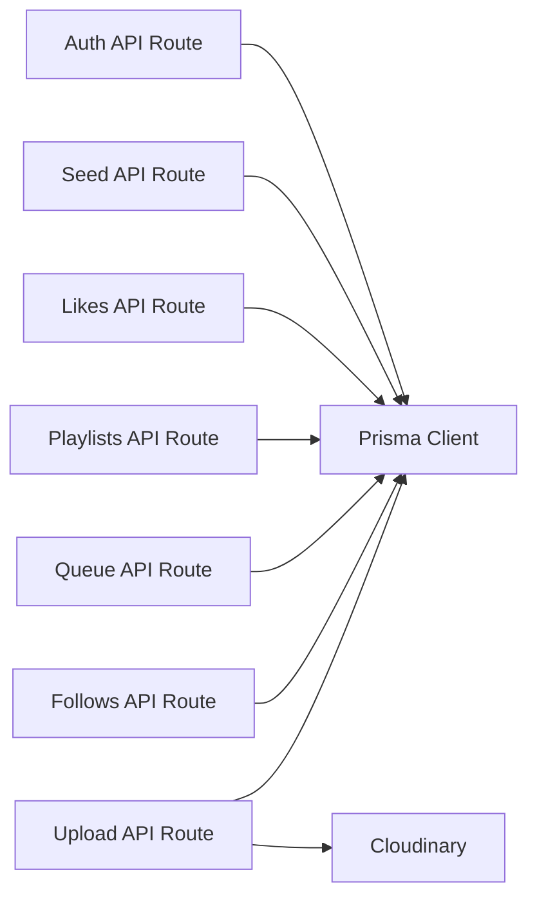

# Database Schema

<cite>
**Referenced Files in This Document**
- [schema.prisma](file://prisma/schema.prisma)
- [db.ts](file://lib/db.ts)
- [route.ts](file://app/api/auth/route.ts)
- [route.ts](file://app/api/admin/seed/route.ts)
- [route.ts](file://app/api/likes/route.ts)
- [route.ts](file://app/api/playlists/route.ts)
- [route.ts](file://app/api/queue/route.ts)
- [route.ts](file://app/api/follows/route.ts)
- [route.ts](file://app/api/upload/route.ts)
- [cloudinary.ts](file://lib/cloudinary.ts)
</cite>

## Table of Contents
1. [Introduction](#introduction)
2. [Project Structure](#project-structure)
3. [Core Components](#core-components)
4. [Architecture Overview](#architecture-overview)
5. [Detailed Component Analysis](#detailed-component-analysis)
6. [Dependency Analysis](#dependency-analysis)
7. [Performance Considerations](#performance-considerations)
8. [Troubleshooting Guide](#troubleshooting-guide)
9. [Conclusion](#conclusion)
10. [Appendices](#appendices)

## Introduction
This document provides comprehensive database schema documentation for SonicStream’s backend data model. It covers entity definitions, relationships, constraints, indexes, and business rules derived from the Prisma schema and API routes. It also documents data access patterns, performance considerations, and operational practices such as seeding and uploads. Security and access control mechanisms are addressed with emphasis on role-based access control and data lifecycle management.

## Project Structure
The database layer is defined via Prisma and accessed through Next.js App Router API handlers. Prisma manages the PostgreSQL schema, while API routes encapsulate CRUD operations and enforce business rules.

**Diagram sources**
- [db.ts:1-10](file://lib/db.ts#L1-L10)
- [schema.prisma:1-111](file://prisma/schema.prisma#L1-L111)
- [route.ts:1-73](file://app/api/auth/route.ts#L1-L73)
- [route.ts:1-40](file://app/api/admin/seed/route.ts#L1-L40)
- [route.ts:1-55](file://app/api/likes/route.ts#L1-L55)
- [route.ts:1-90](file://app/api/playlists/route.ts#L1-L90)
- [route.ts:1-86](file://app/api/queue/route.ts#L1-L86)
- [route.ts:1-55](file://app/api/follows/route.ts#L1-L55)
- [route.ts:1-20](file://app/api/upload/route.ts#L1-L20)
- [cloudinary.ts:1-21](file://lib/cloudinary.ts#L1-L21)

**Section sources**
- [db.ts:1-10](file://lib/db.ts#L1-L10)
- [schema.prisma:1-111](file://prisma/schema.prisma#L1-L111)

## Core Components
This section defines each entity, its fields, data types, primary/foreign keys, indexes, and constraints. Business rules and lifecycle management are explained alongside.

- User
  - Purpose: Core identity and access control entity.
  - Fields:
    - id: String, primary key, cuid().
    - email: String, unique.
    - passwordHash: String.
    - name: String.
    - avatarUrl: String?.
    - role: Enum Role (USER, ADMIN), default USER.
    - createdAt: DateTime, default now().
  - Relationships:
    - One-to-many with LikedSong, Playlist, QueueItem, FollowedArtist, PasswordReset.
  - Indexes/Constraints:
    - Unique index on email.
    - Default role USER.
  - Lifecycle:
    - Created via sign-up; role upgraded to ADMIN during seeding.
    - Password hashes are computed deterministically; sensitive fields are not exposed in public responses.

- LikedSong
  - Purpose: Tracks user-song likes.
  - Fields:
    - id: String, primary key, cuid().
    - userId: String.
    - songId: String.
    - createdAt: DateTime, default now().
  - Relationships:
    - Belongs to User via foreign key.
  - Indexes/Constraints:
    - Unique composite index (userId, songId).
    - Cascade delete on user deletion.
  - Business Rules:
    - Duplicate insertions are handled gracefully by unique constraint.

- Playlist
  - Purpose: User-created collections of songs.
  - Fields:
    - id: String, primary key, cuid().
    - userId: String.
    - name: String.
    - description: String?.
    - coverUrl: String?.
    - createdAt: DateTime, default now().
  - Relationships:
    - Belongs to User; one-to-many with PlaylistSong.
  - Indexes/Constraints:
    - Cascade delete on user deletion.
  - Lifecycle:
    - Deletions cascade to contained songs via PlaylistSong.

- PlaylistSong
  - Purpose: Junction table for Playlist-Song with ordering.
  - Fields:
    - id: String, primary key, cuid().
    - playlistId: String.
    - songId: String.
    - position: Int, default 0.
    - createdAt: DateTime, default now().
  - Relationships:
    - Belongs to Playlist via foreign key.
  - Indexes/Constraints:
    - Unique composite index (playlistId, songId).
    - Cascade delete on playlist deletion.
  - Business Rules:
    - Songs are inserted at the end of the playlist by default.

- QueueItem
  - Purpose: Persistent per-user playback queue entries.
  - Fields:
    - id: String, primary key, cuid().
    - userId: String.
    - songId: String.
    - songData: Json.
    - position: Int, default 0.
    - createdAt: DateTime, default now().
  - Relationships:
    - Belongs to User via foreign key.
  - Indexes/Constraints:
    - No explicit unique constraint; multiple identical items allowed.
    - Cascade delete on user deletion.
  - Business Rules:
    - Items are ordered by position ascending; supports clearing queue.

- FollowedArtist
  - Purpose: Social follow relationships for artists.
  - Fields:
    - id: String, primary key, cuid().
    - userId: String.
    - artistId: String.
    - artistName: String.
    - artistImage: String?.
    - createdAt: DateTime, default now().
  - Relationships:
    - Belongs to User via foreign key.
  - Indexes/Constraints:
    - Unique composite index (userId, artistId).
    - Cascade delete on user deletion.
  - Business Rules:
    - Duplicate follow attempts are handled gracefully.

- PasswordReset
  - Purpose: Temporary credential reset tokens.
  - Fields:
    - id: String, primary key, cuid().
    - userId: String.
    - token: String, unique.
    - expiresAt: DateTime.
    - createdAt: DateTime, default now().
  - Relationships:
    - Belongs to User via foreign key.
  - Indexes/Constraints:
    - Unique index on token.
    - Cascade delete on user deletion.
  - Lifecycle:
    - Tokens are short-lived; expiration enforced by schema-level field.

**Section sources**
- [schema.prisma:11-111](file://prisma/schema.prisma#L11-L111)
- [route.ts:1-55](file://app/api/likes/route.ts#L1-L55)
- [route.ts:1-90](file://app/api/playlists/route.ts#L1-L90)
- [route.ts:1-86](file://app/api/queue/route.ts#L1-L86)
- [route.ts:1-55](file://app/api/follows/route.ts#L1-L55)
- [route.ts:1-40](file://app/api/admin/seed/route.ts#L1-L40)

## Architecture Overview
The data model centers around a single PostgreSQL database managed by Prisma. API routes orchestrate reads/writes, enforce validation, and apply business rules. External integrations include Cloudinary for image uploads.

**Diagram sources**
- [schema.prisma:11-111](file://prisma/schema.prisma#L11-L111)

**Section sources**
- [schema.prisma:11-111](file://prisma/schema.prisma#L11-L111)

## Detailed Component Analysis

### User Model and Role-Based Access Control
- Identity and roles:
  - Users have an email-based identity with a unique index.
  - Role enum supports USER and ADMIN; default is USER.
  - Seeding process ensures an admin account exists and upgrades role if needed.
- Authentication flow:
  - Sign-up validates uniqueness and optionally uploads avatar to Cloudinary.
  - Sign-in verifies hashed credentials against stored hash.
- Security and lifecycle:
  - Password hashing is deterministic for demo; production should use a robust scheme.
  - Sensitive fields are not returned in responses; avatar URLs are optional.

**Diagram sources**
- [route.ts:15-49](file://app/api/auth/route.ts#L15-L49)
- [cloudinary.ts:9-18](file://lib/cloudinary.ts#L9-L18)

**Section sources**
- [schema.prisma:11-32](file://prisma/schema.prisma#L11-L32)
- [route.ts:15-49](file://app/api/auth/route.ts#L15-L49)
- [route.ts:14-35](file://app/api/admin/seed/route.ts#L14-L35)
- [cloudinary.ts:9-18](file://lib/cloudinary.ts#L9-L18)

### Song and Media Models with Metadata
- Observations from schema:
  - The Prisma schema does not define dedicated Song or Media entities.
  - Entities that reference songs rely on songId identifiers:
    - LikedSong.songId
    - PlaylistSong.songId
    - QueueItem.songId
- Implications:
  - Song metadata is modeled as JSON in QueueItem.songData.
  - External systems manage song storage and metadata; the database stores lightweight references and serialized metadata snapshots.
- Recommendations:
  - Define a Song entity with canonical metadata and a Media entity for audio assets to improve query performance and data integrity.

[No sources needed since this section synthesizes observations from schema and API usage patterns]

### Playlist Entities with Song Associations
- Operations:
  - Create playlist with name and optional description/cover.
  - Add song to playlist; position is set to the end by default.
  - Remove song from playlist.
  - Delete playlist (cascades to contained songs).
- Ordering:
  - PlaylistSong.position controls track order; queries sort by position ascending.
- Constraints:
  - Unique (playlistId, songId) prevents duplicates.

**Diagram sources**
- [route.ts:37-56](file://app/api/playlists/route.ts#L37-L56)
- [schema.prisma:60-71](file://prisma/schema.prisma#L60-L71)

**Section sources**
- [schema.prisma:46-71](file://prisma/schema.prisma#L46-L71)
- [route.ts:18-74](file://app/api/playlists/route.ts#L18-L74)

### QueueItem Models for Persistent Playback Queues
- Operations:
  - Retrieve queue items ordered by position.
  - Add item with optional songData JSON; position set to end.
  - Clear queue for a user.
  - Remove a specific item by id or by user+song combination.
- Design:
  - songData is stored as JSON to persist metadata without requiring a separate Song entity.
- Constraints:
  - No unique constraint on (userId, songId); duplicates are allowed.

**Diagram sources**
- [route.ts:24-55](file://app/api/queue/route.ts#L24-L55)
- [schema.prisma:73-84](file://prisma/schema.prisma#L73-L84)

**Section sources**
- [schema.prisma:73-84](file://prisma/schema.prisma#L73-L84)
- [route.ts:4-22](file://app/api/queue/route.ts#L4-L22)

### Follow Relationships for Social Features
- Operations:
  - List followed artists for a user.
  - Follow/unfollow an artist with optional metadata snapshot.
- Constraints:
  - Unique (userId, artistId) prevents duplicate follow entries.

**Diagram sources**
- [route.ts:17-36](file://app/api/follows/route.ts#L17-L36)
- [schema.prisma:86-98](file://prisma/schema.prisma#L86-L98)

**Section sources**
- [schema.prisma:86-98](file://prisma/schema.prisma#L86-L98)
- [route.ts:4-15](file://app/api/follows/route.ts#L4-L15)

### Data Access Patterns and Validation Requirements
- Validation patterns observed across APIs:
  - Presence checks for required fields (e.g., userId, songId).
  - Unique constraint violations are caught and handled gracefully (P2002).
  - Cascading deletes maintain referential integrity.
- Query patterns:
  - Filtering by userId is common for user-scoped resources.
  - Sorting by createdAt desc or position asc is used for recency/ordering.

**Section sources**
- [route.ts:17-36](file://app/api/likes/route.ts#L17-L36)
- [route.ts:24-67](file://app/api/playlists/route.ts#L24-L67)
- [route.ts:24-65](file://app/api/queue/route.ts#L24-L65)
- [route.ts:17-36](file://app/api/follows/route.ts#L17-L36)

## Dependency Analysis
- Internal dependencies:
  - All API routes depend on Prisma Client initialized in lib/db.ts.
  - Upload API depends on Cloudinary SDK for avatar/image uploads.
- External dependencies:
  - PostgreSQL via Prisma client.
  - Cloudinary for image transformations and storage.
- Coupling and cohesion:
  - API routes encapsulate business logic and validation, promoting cohesion.
  - Prisma schema centralizes constraints and relationships, reducing duplication.

**Diagram sources**
- [db.ts:1-10](file://lib/db.ts#L1-L10)
- [route.ts:1-73](file://app/api/auth/route.ts#L1-L73)
- [route.ts:1-40](file://app/api/admin/seed/route.ts#L1-L40)
- [route.ts:1-55](file://app/api/likes/route.ts#L1-L55)
- [route.ts:1-90](file://app/api/playlists/route.ts#L1-L90)
- [route.ts:1-86](file://app/api/queue/route.ts#L1-L86)
- [route.ts:1-55](file://app/api/follows/route.ts#L1-L55)
- [route.ts:1-20](file://app/api/upload/route.ts#L1-L20)
- [cloudinary.ts:1-21](file://lib/cloudinary.ts#L1-L21)

**Section sources**
- [db.ts:1-10](file://lib/db.ts#L1-L10)
- [cloudinary.ts:1-21](file://lib/cloudinary.ts#L1-L21)

## Performance Considerations
- Indexes and unique constraints:
  - Unique indexes on (userId, songId) for LikedSong and PlaylistSong prevent duplicates and speed up lookups.
  - Unique index on (userId, artistId) for FollowedArtist ensures efficient existence checks.
  - Unique index on token for PasswordReset supports fast token verification.
- Query patterns:
  - Use userId filters for user-scoped reads.
  - Sort by position asc for queue and playlist ordering to avoid extra sorting in application code.
- Storage and JSON:
  - Storing songData as JSON in QueueItem avoids joins but can increase payload sizes; consider normalizing Song/Media for frequent analytics or complex queries.
- Cascading deletes:
  - Applied on user deletion for dependent records; ensure appropriate cascade behavior to avoid orphaned data.

[No sources needed since this section provides general guidance]

## Troubleshooting Guide
- Common errors and handling:
  - Unique constraint violations (P2002) are handled gracefully across likes, playlists, and follows; responses indicate “already exists” scenarios.
  - Missing required parameters return 400 with descriptive messages.
  - Authentication failures return 401 with “Invalid credentials.”
  - Upload failures log and return 500 with generic error messages.
- Diagnostics:
  - Verify DATABASE_URL/DIRECT_URL environment variables are configured.
  - Confirm Cloudinary credentials for avatar uploads.
  - Check Prisma client initialization in development vs production environments.

**Section sources**
- [route.ts:30-35](file://app/api/likes/route.ts#L30-L35)
- [route.ts:68-73](file://app/api/playlists/route.ts#L68-L73)
- [route.ts:30-35](file://app/api/follows/route.ts#L30-L35)
- [route.ts:51-60](file://app/api/auth/route.ts#L51-L60)
- [route.ts:15-18](file://app/api/upload/route.ts#L15-L18)
- [db.ts:3-9](file://lib/db.ts#L3-L9)

## Conclusion
SonicStream’s database schema is designed around a clean set of entities with clear relationships and constraints. The schema supports core features: user identity and RBAC, liked songs, playlists with ordering, persistent queues, and social follows. API routes enforce validation and handle unique constraint conflicts. While the current schema references songs via identifiers and JSON, introducing dedicated Song and Media entities would improve query performance, analytics, and data integrity for future growth.

[No sources needed since this section summarizes without analyzing specific files]

## Appendices

### Data Migration Procedures and Schema Evolution
- Current state:
  - The repository does not include explicit migration files; schema evolution is managed via Prisma.
- Recommended practices:
  - Use Prisma Migrate to version control schema changes.
  - Create a staging environment to preview migrations before applying to production.
  - Back up the database prior to major schema changes.
  - Keep migrations reversible where feasible to support rollbacks.
- Version management:
  - Track Prisma client versions alongside schema changes.
  - Document breaking changes and update API routes accordingly.

[No sources needed since this section provides general guidance]

### Data Security and Privacy Requirements
- Access control:
  - Role-based access control via Role enum (USER, ADMIN).
  - Admin seeding ensures elevated privileges for platform administration.
- Data protection:
  - Passwords are hashed deterministically; consider upgrading to a strong cryptographic hash in production.
  - Avatar URLs are stored as public HTTPS URLs; ensure Cloudinary transformations align with privacy policies.
- Audit and lifecycle:
  - createdAt timestamps enable audit trails for most entities.
  - Cascading deletes maintain referential integrity; review cascade rules for sensitive data.

**Section sources**
- [schema.prisma:11-32](file://prisma/schema.prisma#L11-L32)
- [route.ts:14-35](file://app/api/admin/seed/route.ts#L14-L35)
- [cloudinary.ts:9-18](file://lib/cloudinary.ts#L9-L18)