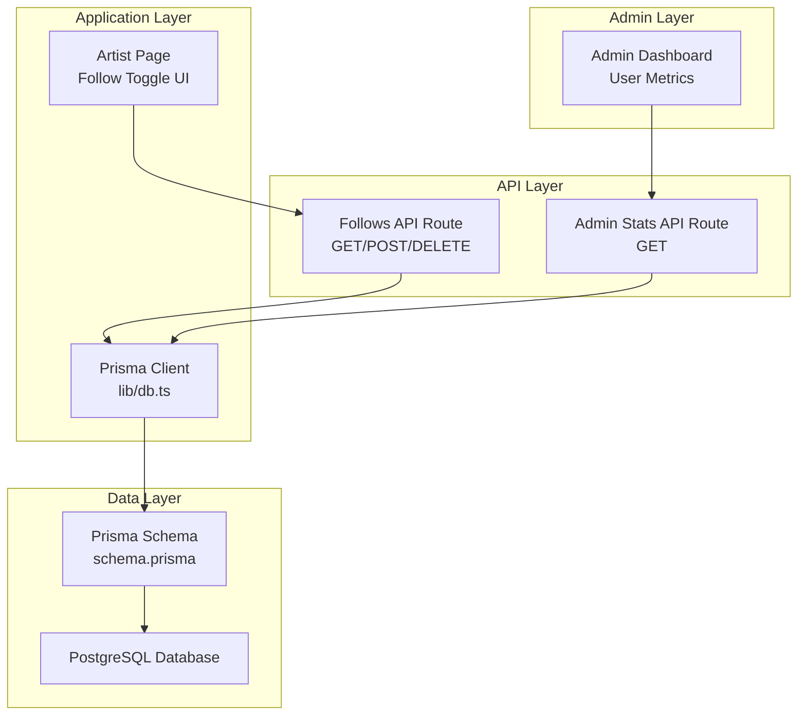
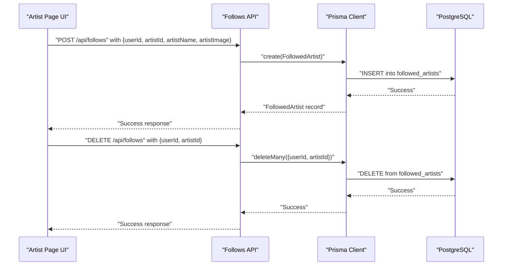
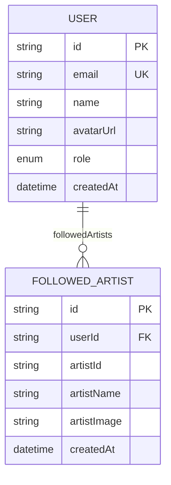
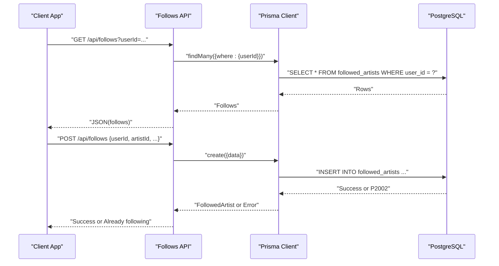
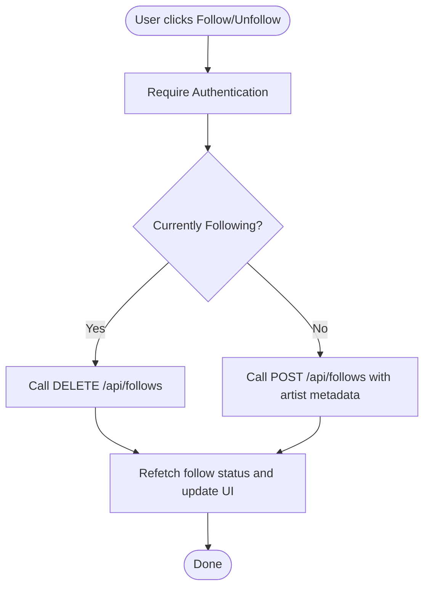
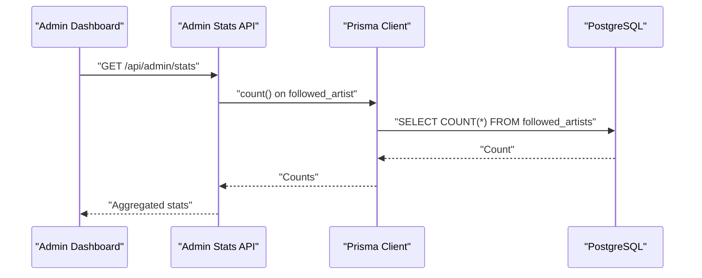
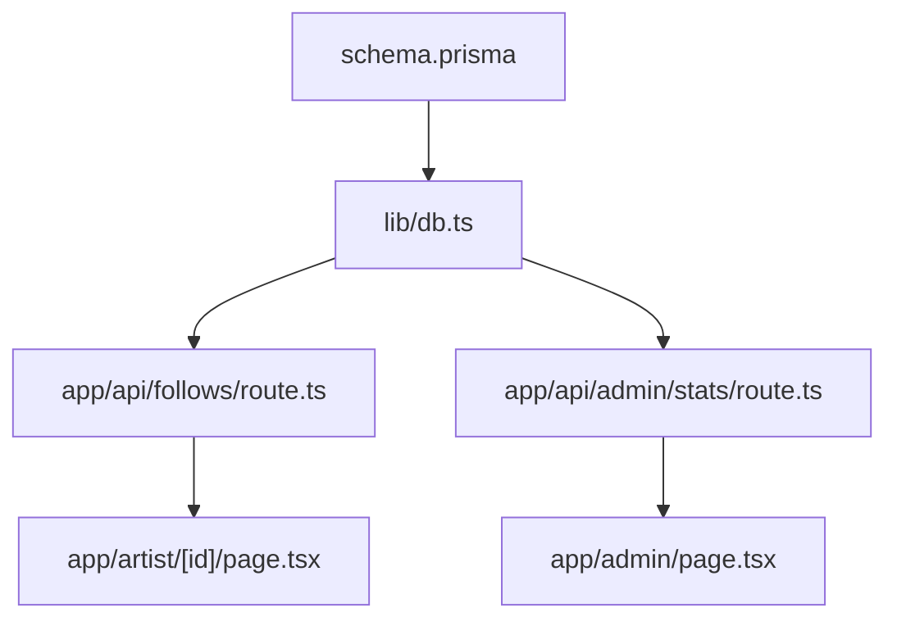

# Social and Relationship Models

<cite>
**Referenced Files in This Document**
- [schema.prisma](file://prisma/schema.prisma)
- [route.ts](file://app/api/follows/route.ts)
- [db.ts](file://lib/db.ts)
- [page.tsx](file://app/artist/[id]/page.tsx)
- [route.ts](file://app/api/admin/stats/route.ts)
- [page.tsx](file://app/admin/page.tsx)
- [api.ts](file://lib/api.ts)
</cite>

## Table of Contents
1. [Introduction](#introduction)
2. [Project Structure](#project-structure)
3. [Core Components](#core-components)
4. [Architecture Overview](#architecture-overview)
5. [Detailed Component Analysis](#detailed-component-analysis)
6. [Dependency Analysis](#dependency-analysis)
7. [Performance Considerations](#performance-considerations)
8. [Troubleshooting Guide](#troubleshooting-guide)
9. [Conclusion](#conclusion)

## Introduction
This document provides comprehensive data model documentation for SonicStream's social and relationship models, with a focus on the FollowedArtist model that enables user-artist relationships. It explains how the model stores artist metadata (name, image), enforces uniqueness to prevent duplicate follows, and applies cascade deletion policies. It also documents the many-to-many relationship patterns implemented via junction tables, the business logic behind social features such as artist following, content discovery through social graphs, and recommendation algorithms based on user relationships. Additionally, it covers field definitions, indexing strategies for efficient social queries, performance optimization techniques, data consistency requirements, privacy considerations, query patterns for retrieving user networks and artist follower counts, and the relationship between user actions and social graph updates.

## Project Structure
The social and relationship functionality spans the Prisma schema, API routes, database client initialization, frontend pages, and admin dashboards. The key areas are:
- Data model definition for FollowedArtist and related entities
- API endpoints for managing follows
- Frontend integration for follow/unfollow actions
- Admin dashboard metrics exposing social graph statistics

**Diagram sources**
- [schema.prisma:86-98](file://prisma/schema.prisma#L86-L98)
- [route.ts:1-55](file://app/api/follows/route.ts#L1-L55)
- [db.ts:1-10](file://lib/db.ts#L1-L10)
- [page.tsx:34-72](file://app/artist/[id]/page.tsx#L34-L72)
- [route.ts:1-28](file://app/api/admin/stats/route.ts#L1-L28)
- [page.tsx:144-199](file://app/admin/page.tsx#L144-L199)

**Section sources**
- [schema.prisma:86-98](file://prisma/schema.prisma#L86-L98)
- [route.ts:1-55](file://app/api/follows/route.ts#L1-L55)
- [db.ts:1-10](file://lib/db.ts#L1-L10)
- [page.tsx:34-72](file://app/artist/[id]/page.tsx#L34-L72)
- [route.ts:1-28](file://app/api/admin/stats/route.ts#L1-L28)
- [page.tsx:144-199](file://app/admin/page.tsx#L144-L199)

## Core Components
This section focuses on the FollowedArtist model and related constructs that enable social relationships.

- FollowedArtist model
  - Purpose: Stores user-artist relationships along with artist metadata snapshot (name, image).
  - Fields:
    - id: Unique identifier
    - userId: References User.id
    - artistId: Artist identifier
    - artistName: Snapshot of artist name
    - artistImage: Snapshot of artist image URL
    - createdAt: Timestamp of follow creation
  - Constraints:
    - Unique constraint on [userId, artistId] prevents duplicate follows per user.
    - Cascade deletion on user deletion ensures orphaned follows are removed.
  - Mapped table: followed_artists

- User model relationships
  - One-to-many with FollowedArtist via followedArtists.
  - Other relationships include likedSongs, playlists, queueItems, and passwordResets.

- Many-to-many relationship pattern
  - Implemented via a junction table (FollowedArtist) with explicit fields for artist metadata.
  - Alternative patterns (e.g., separate Artist entity) are not present in the schema; metadata is stored directly in the junction table.

- Indexing and performance
  - Unique composite index on [userId, artistId] supports fast lookup and deduplication.
  - Additional indexes could be considered for frequent queries (e.g., artistId for artist-level analytics).

**Section sources**
- [schema.prisma:86-98](file://prisma/schema.prisma#L86-L98)
- [schema.prisma:16-32](file://prisma/schema.prisma#L16-L32)

## Architecture Overview
The social graph is built around the FollowedArtist junction table. User actions (follow/unfollow) are handled by API endpoints, persisted via Prisma, and surfaced in the UI and admin metrics.

**Diagram sources**
- [route.ts:17-36](file://app/api/follows/route.ts#L17-L36)
- [route.ts:38-54](file://app/api/follows/route.ts#L38-L54)
- [db.ts:1-10](file://lib/db.ts#L1-L10)

**Section sources**
- [route.ts:17-36](file://app/api/follows/route.ts#L17-L36)
- [route.ts:38-54](file://app/api/follows/route.ts#L38-L54)
- [db.ts:1-10](file://lib/db.ts#L1-L10)

## Detailed Component Analysis

### FollowedArtist Model
The FollowedArtist model defines the user-artist relationship with embedded artist metadata snapshots.

- Uniqueness and duplication prevention:
  - Composite unique index on [userId, artistId] ensures a user cannot follow the same artist twice.
- Cascade deletion:
  - On user deletion, all associated FollowedArtist records are automatically removed.
- Artist metadata storage:
  - artistName and artistImage are stored alongside the relationship to decouple from external artist services and support offline rendering.

**Diagram sources**
- [schema.prisma:86-98](file://prisma/schema.prisma#L86-L98)
- [schema.prisma:16-32](file://prisma/schema.prisma#L16-L32)

**Section sources**
- [schema.prisma:86-98](file://prisma/schema.prisma#L86-L98)
- [schema.prisma:16-32](file://prisma/schema.prisma#L16-L32)

### API Endpoints for Social Actions
The follows API exposes three operations: list follows, create a follow, and remove a follow.

- GET /api/follows?userId=...
  - Retrieves all FollowedArtist records for a given user, ordered by creation date.
  - Used by the frontend to determine follow status and render UI accordingly.

- POST /api/follows
  - Creates a FollowedArtist record with artist metadata snapshot.
  - Handles duplicate follow attempts via database-level unique constraint violation.

- DELETE /api/follows
  - Removes a specific FollowedArtist relationship by userId and artistId.

**Diagram sources**
- [route.ts:4-15](file://app/api/follows/route.ts#L4-L15)
- [route.ts:17-36](file://app/api/follows/route.ts#L17-L36)
- [route.ts:38-54](file://app/api/follows/route.ts#L38-L54)

**Section sources**
- [route.ts:4-15](file://app/api/follows/route.ts#L4-L15)
- [route.ts:17-36](file://app/api/follows/route.ts#L17-L36)
- [route.ts:38-54](file://app/api/follows/route.ts#L38-L54)

### Frontend Integration and User Actions
The Artist page integrates follow/unfollow actions with the backend API and local state.

- Follow status detection:
  - Queries the follows endpoint with the current user's ID and checks whether the target artistId exists in the returned list.
- Action handlers:
  - POST to create a follow with artist metadata snapshot.
  - DELETE to remove a follow.
- UI feedback:
  - Toast notifications inform the user of success or errors.
- Data consistency:
  - After each action, the follow status query is re-executed to reflect the latest state.

**Diagram sources**
- [page.tsx:34-72](file://app/artist/[id]/page.tsx#L34-L72)

**Section sources**
- [page.tsx:34-72](file://app/artist/[id]/page.tsx#L34-L72)

### Admin Metrics and Social Graph Statistics
The admin dashboard aggregates social metrics, including the total number of followed artists, which reflects the size of the social graph.

- Admin stats endpoint:
  - Returns counts for users, liked songs, playlists, followed artists, and queue items.
- Admin page:
  - Displays per-user statistics including followedArtists, enabling monitoring of social engagement.

**Diagram sources**
- [route.ts:4-27](file://app/api/admin/stats/route.ts#L4-L27)
- [page.tsx:144-199](file://app/admin/page.tsx#L144-L199)

**Section sources**
- [route.ts:4-27](file://app/api/admin/stats/route.ts#L4-L27)
- [page.tsx:144-199](file://app/admin/page.tsx#L144-L199)

## Dependency Analysis
The social model depends on Prisma for schema definition and ORM operations, Next.js API routes for server-side endpoints, and the frontend for user interactions.

**Diagram sources**
- [schema.prisma:86-98](file://prisma/schema.prisma#L86-L98)
- [db.ts:1-10](file://lib/db.ts#L1-L10)
- [route.ts:1-55](file://app/api/follows/route.ts#L1-L55)
- [page.tsx:34-72](file://app/artist/[id]/page.tsx#L34-L72)
- [route.ts:1-28](file://app/api/admin/stats/route.ts#L1-L28)
- [page.tsx:144-199](file://app/admin/page.tsx#L144-L199)

**Section sources**
- [schema.prisma:86-98](file://prisma/schema.prisma#L86-L98)
- [db.ts:1-10](file://lib/db.ts#L1-L10)
- [route.ts:1-55](file://app/api/follows/route.ts#L1-L55)
- [page.tsx:34-72](file://app/artist/[id]/page.tsx#L34-L72)
- [route.ts:1-28](file://app/api/admin/stats/route.ts#L1-L28)
- [page.tsx:144-199](file://app/admin/page.tsx#L144-L199)

## Performance Considerations
- Indexing strategy
  - Composite unique index on [userId, artistId] ensures efficient duplicate prevention and fast lookups for a user's follows.
  - Consider adding an index on artistId for queries that need to discover all followers of a specific artist (e.g., analytics or recommendation triggers).
- Query patterns
  - Listing follows by userId is O(log n) due to the unique index.
  - Creating/deleting follows leverages the unique constraint to avoid redundant writes.
- Cascading deletes
  - Ensures referential integrity and prevents orphaned records, reducing cleanup overhead.
- Frontend caching
  - Use React Query to cache follow status and avoid repeated network requests during navigation.
- Batch operations
  - For bulk actions (e.g., unfollow many artists), batch DELETE requests to minimize round trips.

[No sources needed since this section provides general guidance]

## Troubleshooting Guide
- Duplicate follow errors
  - Symptom: POST /api/follows returns success with a message indicating the user is already following.
  - Cause: Unique constraint violation on [userId, artistId].
  - Resolution: Check existing follows before attempting to create; the API handles this gracefully.
- Follow removal failures
  - Symptom: DELETE /api/follows fails silently or returns an error.
  - Cause: Missing required fields (userId, artistId) or non-existent relationship.
  - Resolution: Validate payload and confirm the relationship exists before deletion.
- Follow status not updating
  - Symptom: UI still shows Follow after successful POST or Unfollow after DELETE.
  - Cause: Frontend not refetching follow status after the action.
  - Resolution: Trigger refetch after successful API calls.
- Admin metrics discrepancy
  - Symptom: Admin dashboard shows unexpected counts for followed artists.
  - Cause: Missing or delayed cascading deletes, or stale caches.
  - Resolution: Verify cascade deletion behavior and refresh admin stats.

**Section sources**
- [route.ts:17-36](file://app/api/follows/route.ts#L17-L36)
- [route.ts:38-54](file://app/api/follows/route.ts#L38-L54)
- [page.tsx:34-72](file://app/artist/[id]/page.tsx#L34-L72)
- [route.ts:4-27](file://app/api/admin/stats/route.ts#L4-L27)

## Conclusion
SonicStream’s social model centers on the FollowedArtist junction table, which captures user-artist relationships with embedded artist metadata, enforces uniqueness to prevent duplicates, and applies cascade deletion for data consistency. The API endpoints provide robust CRUD operations for follows, while the frontend integrates these actions seamlessly with user feedback. Admin metrics expose social graph insights, supporting monitoring and moderation. By leveraging the unique index on [userId, artistId] and considering additional indexes for artist-centric queries, the system achieves efficient social graph operations. Privacy and consistency are maintained through cascading deletes and careful frontend state management.