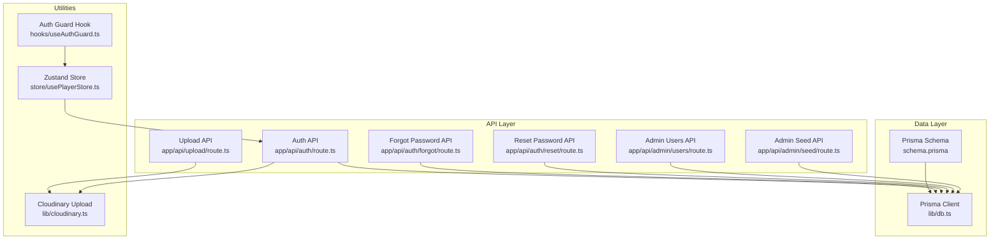
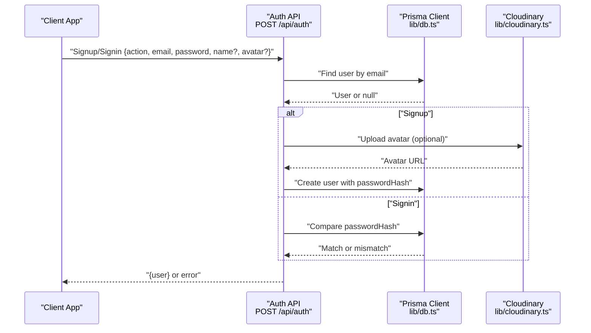
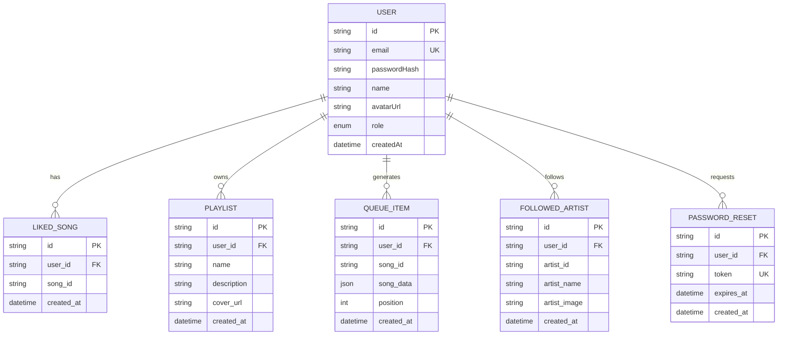
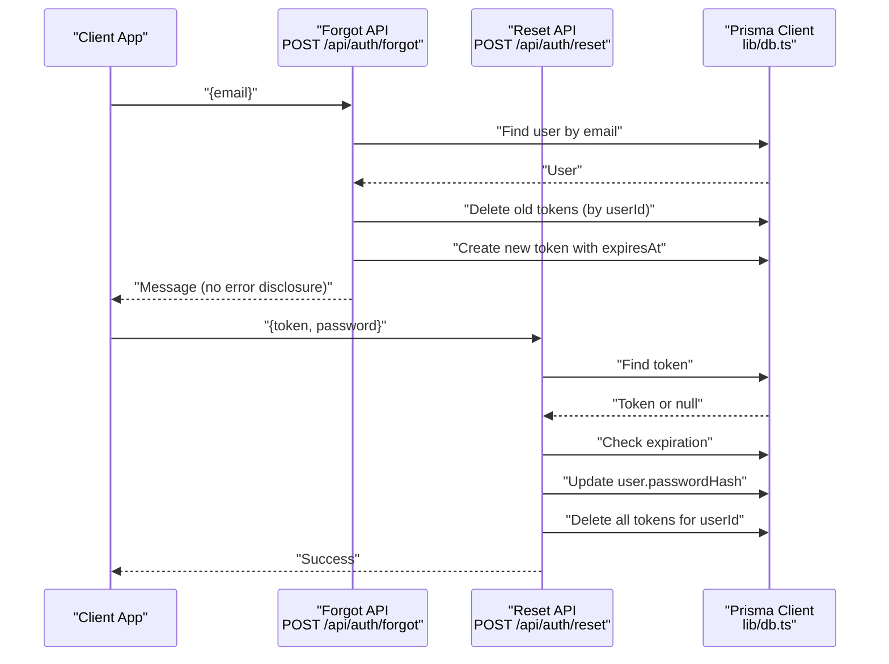
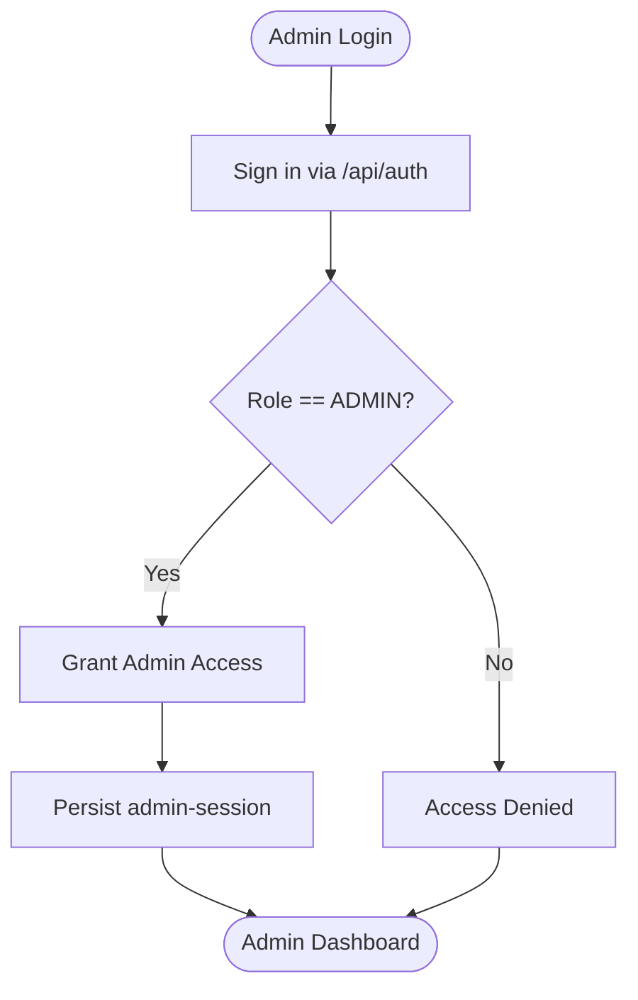
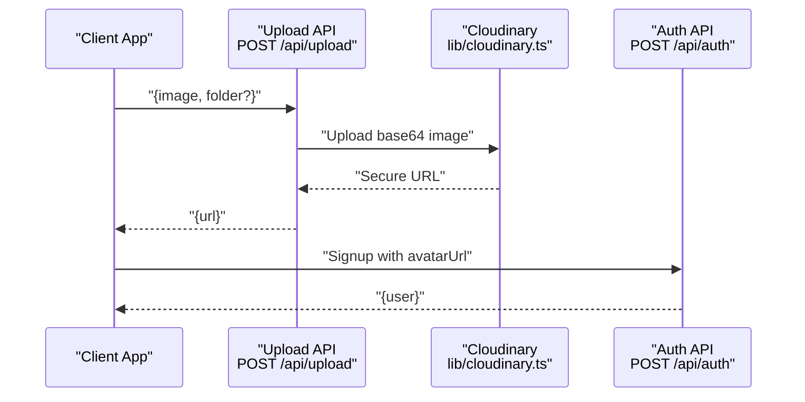
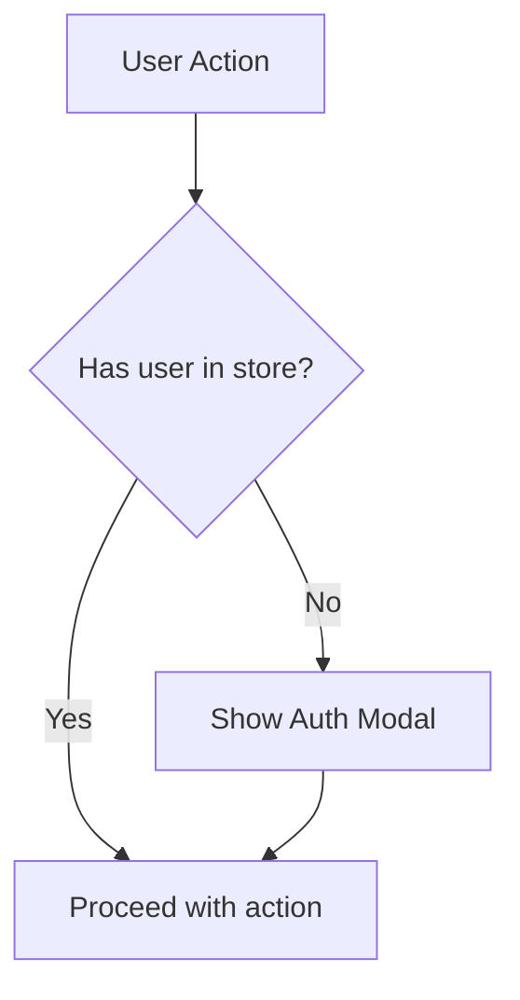
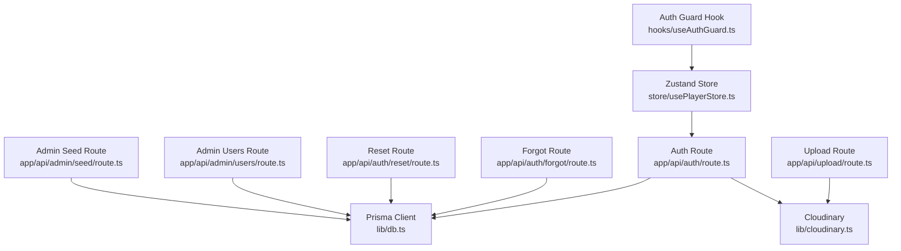

# User and Authentication Models

<cite>
**Referenced Files in This Document**
- [schema.prisma](file://prisma/schema.prisma)
- [db.ts](file://lib/db.ts)
- [auth.route.ts](file://app/api/auth/route.ts)
- [forgot.route.ts](file://app/api/auth/forgot/route.ts)
- [reset.route.ts](file://app/api/auth/reset/route.ts)
- [cloudinary.ts](file://lib/cloudinary.ts)
- [usePlayerStore.ts](file://store/usePlayerStore.ts)
- [useAuthGuard.ts](file://hooks/useAuthGuard.ts)
- [admin.users.route.ts](file://app/api/admin/users/route.ts)
- [admin.login.page.tsx](file://app/admin/login/page.tsx)
- [admin.seed.route.ts](file://app/api/admin/seed/route.ts)
- [upload.route.ts](file://app/api/upload/route.ts)
</cite>

## Table of Contents
1. [Introduction](#introduction)
2. [Project Structure](#project-structure)
3. [Core Components](#core-components)
4. [Architecture Overview](#architecture-overview)
5. [Detailed Component Analysis](#detailed-component-analysis)
6. [Dependency Analysis](#dependency-analysis)
7. [Performance Considerations](#performance-considerations)
8. [Troubleshooting Guide](#troubleshooting-guide)
9. [Conclusion](#conclusion)

## Introduction
This document provides comprehensive data model documentation for SonicStream’s User and authentication-related models. It covers the User model with role-based access control (USER/ADMIN), email uniqueness constraints, password hash storage, and avatar management. It documents the PasswordReset model for secure password recovery including token generation, expiration handling, and cascade deletion policies. It explains the Role enum implementation and its impact on authorization flows, details field definitions, data types, constraints, and business rules. It also outlines relationship patterns among users, liked songs, playlists, queue items, followed artists, and password reset tokens, and addresses data validation requirements, security considerations for password storage, and access control mechanisms. Finally, it includes examples of common queries and operations performed on these models.

## Project Structure
The authentication and user data model are primarily defined in the Prisma schema and implemented through Next.js API routes. Supporting utilities include Cloudinary image uploads, a local Zustand store for client-side user state, and an auth guard hook for UI-level protection.

**Diagram sources**
- [schema.prisma:11-111](file://prisma/schema.prisma#L11-L111)
- [db.ts:1-10](file://lib/db.ts#L1-L10)
- [auth.route.ts:15-72](file://app/api/auth/route.ts#L15-L72)
- [forgot.route.ts:5-68](file://app/api/auth/forgot/route.ts#L5-L68)
- [reset.route.ts:13-48](file://app/api/auth/reset/route.ts#L13-L48)
- [admin.users.route.ts:4-75](file://app/api/admin/users/route.ts#L4-L75)
- [admin.seed.route.ts:13-39](file://app/api/admin/seed/route.ts#L13-L39)
- [upload.route.ts:4-19](file://app/api/upload/route.ts#L4-L19)
- [cloudinary.ts:1-21](file://lib/cloudinary.ts#L1-L21)
- [usePlayerStore.ts:12-41](file://store/usePlayerStore.ts#L12-L41)
- [useAuthGuard.ts:12-28](file://hooks/useAuthGuard.ts#L12-L28)

**Section sources**
- [schema.prisma:11-111](file://prisma/schema.prisma#L11-L111)
- [db.ts:1-10](file://lib/db.ts#L1-L10)
- [auth.route.ts:15-72](file://app/api/auth/route.ts#L15-L72)
- [forgot.route.ts:5-68](file://app/api/auth/forgot/route.ts#L5-L68)
- [reset.route.ts:13-48](file://app/api/auth/reset/route.ts#L13-L48)
- [admin.users.route.ts:4-75](file://app/api/admin/users/route.ts#L4-L75)
- [admin.seed.route.ts:13-39](file://app/api/admin/seed/route.ts#L13-L39)
- [upload.route.ts:4-19](file://app/api/upload/route.ts#L4-L19)
- [cloudinary.ts:1-21](file://lib/cloudinary.ts#L1-L21)
- [usePlayerStore.ts:12-41](file://store/usePlayerStore.ts#L12-L41)
- [useAuthGuard.ts:12-28](file://hooks/useAuthGuard.ts#L12-L28)

## Core Components
This section documents the primary data models and their relationships, focusing on the User model, PasswordReset model, and related associations.

- Role enum
  - Values: USER, ADMIN
  - Purpose: Controls authorization flows and administrative access
  - Default: USER

- User model
  - Fields:
    - id: String (primary key, cuid)
    - email: String (@unique)
    - passwordHash: String (@map("password_hash"))
    - name: String
    - avatarUrl: String? (@map("avatar_url"))
    - role: Role (@default(USER))
    - createdAt: DateTime (@default(now()) @map("created_at"))
  - Relationships:
    - likedSongs: array of LikedSong (cascade delete)
    - playlists: array of Playlist (cascade delete)
    - queueItems: array of QueueItem (cascade delete)
    - followedArtists: array of FollowedArtist (cascade delete)
    - passwordResets: array of PasswordReset (cascade delete)

- PasswordReset model
  - Fields:
    - id: String (primary key, cuid)
    - userId: String (@map("user_id"))
    - token: String (@unique)
    - expiresAt: DateTime (@map("expires_at"))
    - createdAt: DateTime (@default(now()) @map("created_at"))
  - Relationship:
    - user: User (cascade delete)

- Additional related models (for context)
  - LikedSong: user_id, song_id, created_at; unique(userId, songId)
  - Playlist: user_id, name, description, cover_url, created_at
  - PlaylistSong: playlist_id, song_id, position, created_at; unique(playlistId, songId)
  - QueueItem: user_id, song_id, song_data (JSON), position, created_at
  - FollowedArtist: user_id, artist_id, artist_name, artist_image, created_at; unique(userId, artistId)

Constraints and defaults:
- Email uniqueness enforced at the database level
- Role defaults to USER
- Password hash stored as a string
- AvatarUrl optional; uploaded via Cloudinary
- Cascade deletes on user-related records when a user is removed

**Section sources**
- [schema.prisma:11-111](file://prisma/schema.prisma#L11-L111)

## Architecture Overview
The authentication architecture integrates client-side state management, server-side API endpoints, and database relations. The User model centralizes identity and roles, while PasswordReset enables secure password recovery. Avatar uploads leverage Cloudinary, and client-side state persists user session and preferences.

**Diagram sources**
- [auth.route.ts:15-72](file://app/api/auth/route.ts#L15-L72)
- [db.ts:1-10](file://lib/db.ts#L1-L10)
- [cloudinary.ts:9-18](file://lib/cloudinary.ts#L9-L18)

**Section sources**
- [auth.route.ts:15-72](file://app/api/auth/route.ts#L15-L72)
- [db.ts:1-10](file://lib/db.ts#L1-L10)
- [cloudinary.ts:9-18](file://lib/cloudinary.ts#L9-L18)

## Detailed Component Analysis

### User Model
- Purpose: Stores user identity, authentication credentials, profile attributes, and role for authorization.
- Constraints:
  - Email must be unique.
  - Role defaults to USER.
  - AvatarUrl is optional.
- Relationships:
  - One-to-many with LikedSong, Playlist, QueueItem, FollowedArtist, PasswordReset.
  - Cascade delete ensures cleanup when a user is removed.
- Business rules:
  - On signup, if avatar is provided, upload via Cloudinary and store secure URL.
  - On signin, compare provided password against stored hash.

**Diagram sources**
- [schema.prisma:16-111](file://prisma/schema.prisma#L16-L111)

**Section sources**
- [schema.prisma:16-32](file://prisma/schema.prisma#L16-L32)
- [auth.route.ts:25-48](file://app/api/auth/route.ts#L25-L48)

### PasswordReset Model
- Purpose: Enables secure password recovery via time-limited tokens.
- Token lifecycle:
  - Generation: Random hex token.
  - Expiration: 1 hour from creation.
  - Cleanup: Delete expired tokens during validation.
- Cascade policy: Deleting a user removes associated reset tokens.
- Validation:
  - Reject invalid or expired tokens.
  - Enforce minimum password length during reset.

**Diagram sources**
- [forgot.route.ts:5-68](file://app/api/auth/forgot/route.ts#L5-L68)
- [reset.route.ts:13-48](file://app/api/auth/reset/route.ts#L13-L48)
- [db.ts:1-10](file://lib/db.ts#L1-L10)

**Section sources**
- [schema.prisma:100-110](file://prisma/schema.prisma#L100-L110)
- [forgot.route.ts:17-26](file://app/api/auth/forgot/route.ts#L17-L26)
- [reset.route.ts:24-42](file://app/api/auth/reset/route.ts#L24-L42)

### Role Enum and Authorization
- Role values: USER, ADMIN.
- Default role: USER.
- Admin-only access:
  - Admin login enforces role check before granting access.
  - Admin APIs support listing, updating, and deleting users.
  - Seed endpoint ensures an initial admin user exists.

**Diagram sources**
- [admin.login.page.tsx:26-29](file://app/admin/login/page.tsx#L26-L29)
- [admin.seed.route.ts:16-32](file://app/api/admin/seed/route.ts#L16-L32)
- [admin.users.route.ts:54-74](file://app/api/admin/users/route.ts#L54-L74)

**Section sources**
- [schema.prisma:11-14](file://prisma/schema.prisma#L11-L14)
- [admin.login.page.tsx:26-29](file://app/admin/login/page.tsx#L26-L29)
- [admin.seed.route.ts:16-32](file://app/api/admin/seed/route.ts#L16-L32)
- [admin.users.route.ts:54-74](file://app/api/admin/users/route.ts#L54-L74)

### Avatar Management
- Upload flow:
  - Base64 image provided by client.
  - Uploaded to Cloudinary with transformations for face-cropping and auto-quality.
  - Secure URL stored in User.avatarUrl.
- Optional avatar on signup/signin.
- Dedicated upload endpoint for avatars.

**Diagram sources**
- [upload.route.ts:4-19](file://app/api/upload/route.ts#L4-L19)
- [cloudinary.ts:9-18](file://lib/cloudinary.ts#L9-L18)
- [auth.route.ts:31-44](file://app/api/auth/route.ts#L31-L44)

**Section sources**
- [cloudinary.ts:9-18](file://lib/cloudinary.ts#L9-L18)
- [upload.route.ts:4-19](file://app/api/upload/route.ts#L4-L19)
- [auth.route.ts:31-44](file://app/api/auth/route.ts#L31-L44)

### Client-Side Authentication State and Guards
- Zustand store holds user session and preferences.
- Auth guard hook provides UI-level protection for actions requiring authentication.
- Frontend integrates with backend auth endpoints to manage sessions.

**Diagram sources**
- [usePlayerStore.ts:12-41](file://store/usePlayerStore.ts#L12-L41)
- [useAuthGuard.ts:16-25](file://hooks/useAuthGuard.ts#L16-L25)

**Section sources**
- [usePlayerStore.ts:12-41](file://store/usePlayerStore.ts#L12-L41)
- [useAuthGuard.ts:16-25](file://hooks/useAuthGuard.ts#L16-L25)

## Dependency Analysis
The following diagram shows how components depend on each other and how data flows across layers.

**Diagram sources**
- [auth.route.ts:15-72](file://app/api/auth/route.ts#L15-L72)
- [forgot.route.ts:5-68](file://app/api/auth/forgot/route.ts#L5-L68)
- [reset.route.ts:13-48](file://app/api/auth/reset/route.ts#L13-L48)
- [admin.users.route.ts:4-75](file://app/api/admin/users/route.ts#L4-L75)
- [admin.seed.route.ts:13-39](file://app/api/admin/seed/route.ts#L13-L39)
- [upload.route.ts:4-19](file://app/api/upload/route.ts#L4-L19)
- [cloudinary.ts:1-21](file://lib/cloudinary.ts#L1-L21)
- [db.ts:1-10](file://lib/db.ts#L1-L10)
- [usePlayerStore.ts:12-41](file://store/usePlayerStore.ts#L12-L41)
- [useAuthGuard.ts:12-28](file://hooks/useAuthGuard.ts#L12-L28)

**Section sources**
- [auth.route.ts:15-72](file://app/api/auth/route.ts#L15-L72)
- [forgot.route.ts:5-68](file://app/api/auth/forgot/route.ts#L5-L68)
- [reset.route.ts:13-48](file://app/api/auth/reset/route.ts#L13-L48)
- [admin.users.route.ts:4-75](file://app/api/admin/users/route.ts#L4-L75)
- [admin.seed.route.ts:13-39](file://app/api/admin/seed/route.ts#L13-L39)
- [upload.route.ts:4-19](file://app/api/upload/route.ts#L4-L19)
- [cloudinary.ts:1-21](file://lib/cloudinary.ts#L1-L21)
- [db.ts:1-10](file://lib/db.ts#L1-L10)
- [usePlayerStore.ts:12-41](file://store/usePlayerStore.ts#L12-L41)
- [useAuthGuard.ts:12-28](file://hooks/useAuthGuard.ts#L12-L28)

## Performance Considerations
- Password hashing: The current implementation uses SHA-256 with a salt. For production, replace with a robust password hashing scheme (e.g., bcrypt) to mitigate brute-force attacks and improve resilience against rainbow table attacks.
- Indexing: Email is unique; ensure database-level indexing remains efficient for high-volume signups/signins.
- Avatar uploads: Cloudinary transformations are configured; consider caching and CDN optimization for avatar delivery.
- Cascade deletes: While convenient, cascade deletions can be expensive for large datasets. Monitor and optimize cleanup jobs if user counts grow significantly.
- API validations: Enforce minimum password lengths and sanitize inputs to reduce database errors and improve UX.

[No sources needed since this section provides general guidance]

## Troubleshooting Guide
Common issues and resolutions:
- Duplicate email on signup:
  - Symptom: Signup returns conflict.
  - Cause: Email already exists.
  - Resolution: Prompt user to sign in or use another email.
- Invalid credentials:
  - Symptom: Signin returns unauthorized.
  - Cause: Nonexistent user or incorrect password.
  - Resolution: Verify email/password; ensure hashing matches stored hash.
- Forgotten password link:
  - Symptom: No error but no email received.
  - Cause: SMTP misconfiguration or email not sent.
  - Resolution: Check SMTP environment variables; note that the endpoint still returns success even if email fails.
- Expired reset link:
  - Symptom: Reset returns expired error.
  - Cause: Token older than 1 hour.
  - Resolution: Require user to request a new reset link.
- Admin access denied:
  - Symptom: Admin login blocked.
  - Cause: User role is not ADMIN.
  - Resolution: Ensure admin seed has been run or role was updated.

**Section sources**
- [auth.route.ts:26-29](file://app/api/auth/route.ts#L26-L29)
- [auth.route.ts:53-60](file://app/api/auth/route.ts#L53-L60)
- [forgot.route.ts:12-15](file://app/api/auth/forgot/route.ts#L12-L15)
- [reset.route.ts:28-31](file://app/api/auth/reset/route.ts#L28-L31)
- [admin.login.page.tsx:26-29](file://app/admin/login/page.tsx#L26-L29)

## Conclusion
SonicStream’s User and authentication models provide a solid foundation for identity, role-based access control, and secure password recovery. The Prisma schema defines clear constraints and relationships, while the API routes implement signup, signin, avatar upload, and password reset flows. The Role enum governs admin access, and cascade deletions simplify data hygiene. For production readiness, prioritize stronger password hashing, robust email delivery, and careful monitoring of cascade operations and user growth.