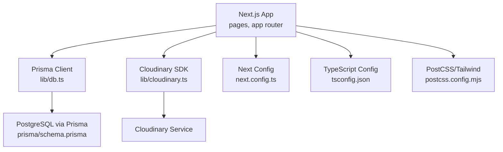
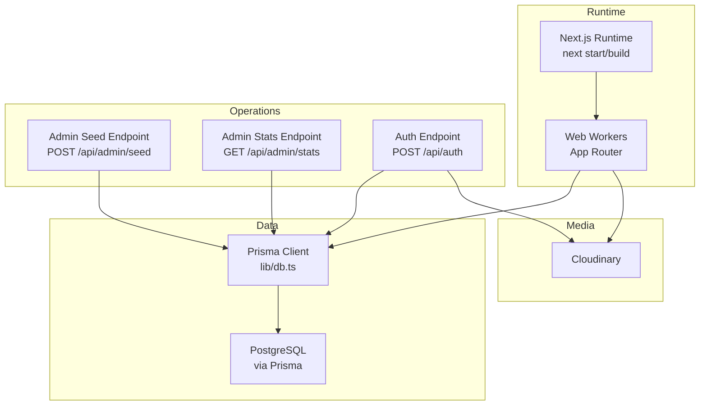
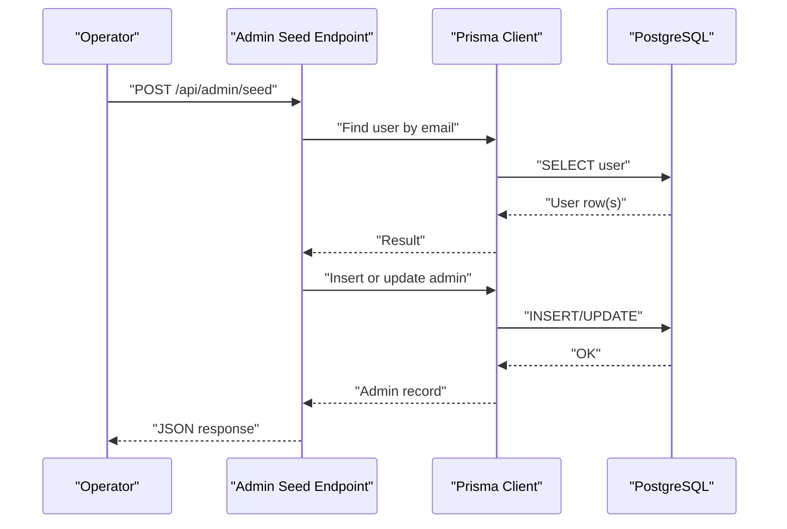
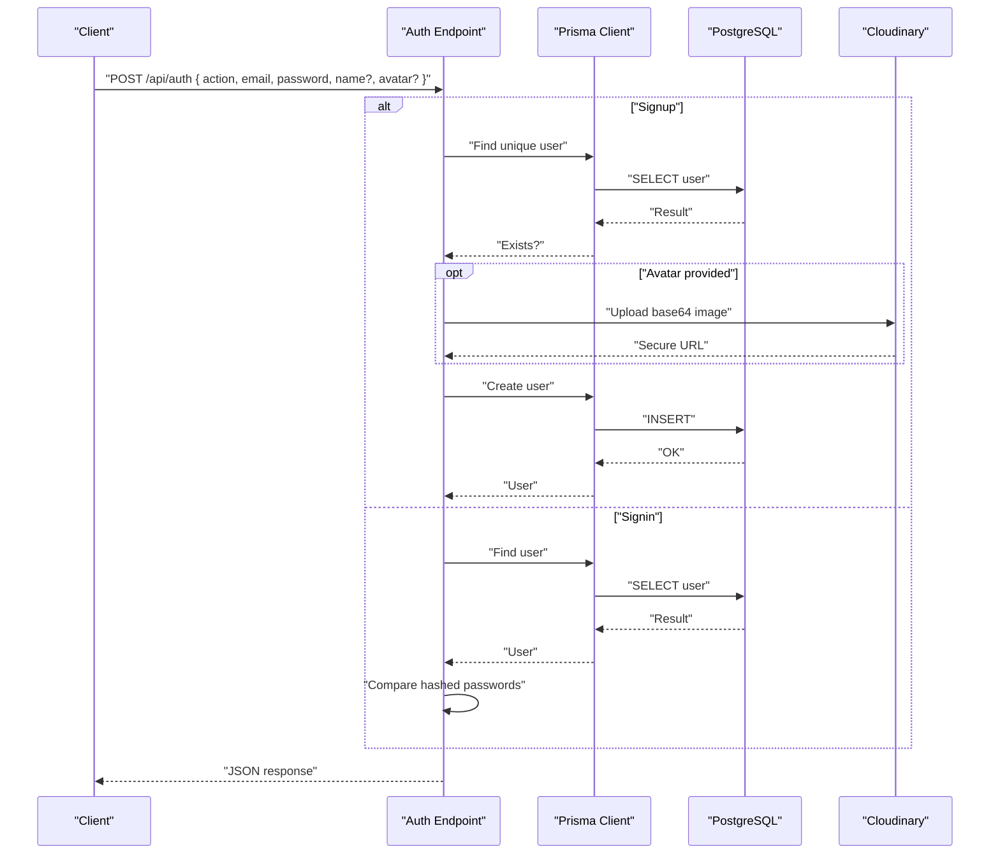
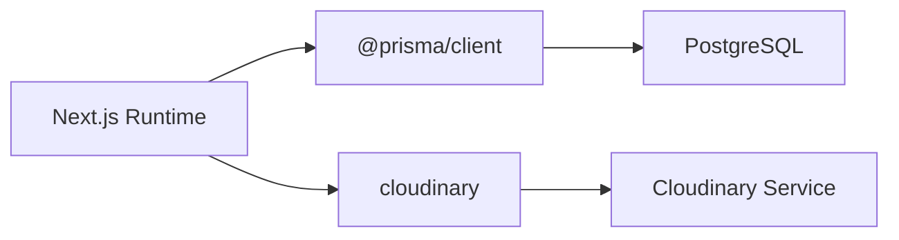

# Deployment Guide

<cite>
**Referenced Files in This Document**
- [README.md](file://README.md)
- [package.json](file://package.json)
- [next.config.ts](file://next.config.ts)
- [tsconfig.json](file://tsconfig.json)
- [postcss.config.mjs](file://postcss.config.mjs)
- [prisma/schema.prisma](file://prisma/schema.prisma)
- [lib/db.ts](file://lib/db.ts)
- [lib/cloudinary.ts](file://lib/cloudinary.ts)
- [app/api/admin/seed/route.ts](file://app/api/admin/seed/route.ts)
- [app/api/admin/stats/route.ts](file://app/api/admin/stats/route.ts)
- [app/api/auth/route.ts](file://app/api/auth/route.ts)
</cite>

## Table of Contents
1. [Introduction](#introduction)
2. [Project Structure](#project-structure)
3. [Core Components](#core-components)
4. [Architecture Overview](#architecture-overview)
5. [Detailed Component Analysis](#detailed-component-analysis)
6. [Dependency Analysis](#dependency-analysis)
7. [Performance Considerations](#performance-considerations)
8. [Troubleshooting Guide](#troubleshooting-guide)
9. [Conclusion](#conclusion)
10. [Appendices](#appendices)

## Introduction
This guide provides end-to-end deployment instructions for SonicStream, covering production build configuration, environment setup, database migrations, seeding, cloud and containerized deployments, secrets management, monitoring, scaling, and operational procedures. It is designed for both technical and non-technical audiences and references actual source files in the repository.

## Project Structure
SonicStream is a Next.js 15 application using the App Router. Build-time and runtime configuration is centralized in Next.js configuration, TypeScript compiler options, PostCSS/Tailwind integration, and Prisma schema. Database access is handled via Prisma Client, and media uploads leverage Cloudinary.

**Diagram sources**
- [next.config.ts:1-67](file://next.config.ts#L1-L67)
- [tsconfig.json:1-29](file://tsconfig.json#L1-L29)
- [postcss.config.mjs:1-10](file://postcss.config.mjs#L1-L10)
- [prisma/schema.prisma:1-111](file://prisma/schema.prisma#L1-L111)
- [lib/db.ts:1-10](file://lib/db.ts#L1-L10)
- [lib/cloudinary.ts:1-21](file://lib/cloudinary.ts#L1-L21)

**Section sources**
- [README.md:1-74](file://README.md#L1-L74)
- [package.json:1-50](file://package.json#L1-L50)
- [next.config.ts:1-67](file://next.config.ts#L1-L67)
- [tsconfig.json:1-29](file://tsconfig.json#L1-L29)
- [postcss.config.mjs:1-10](file://postcss.config.mjs#L1-L10)
- [prisma/schema.prisma:1-111](file://prisma/schema.prisma#L1-L111)
- [lib/db.ts:1-10](file://lib/db.ts#L1-L10)
- [lib/cloudinary.ts:1-21](file://lib/cloudinary.ts#L1-L21)

## Core Components
- Production build pipeline: Next.js build and standalone output mode for minimal containers.
- Database ORM: Prisma with PostgreSQL datasource configured via environment variables.
- Media service: Cloudinary integration for avatar uploads.
- Admin endpoints: Seed and stats endpoints for initial setup and diagnostics.
- Authentication endpoint: User signup/signin with password hashing and optional avatar upload.

Key deployment-relevant behaviors:
- Next.js output mode is set to standalone for containerized deployments.
- Remote image domains are whitelisted for production image optimization.
- Prisma Client is initialized globally to avoid multiple instances.
- Cloudinary credentials are loaded from environment variables.

**Section sources**
- [next.config.ts:52](file://next.config.ts#L52)
- [next.config.ts:12-51](file://next.config.ts#L12-L51)
- [lib/db.ts:1-10](file://lib/db.ts#L1-L10)
- [lib/cloudinary.ts:3-7](file://lib/cloudinary.ts#L3-L7)
- [prisma/schema.prisma:5-9](file://prisma/schema.prisma#L5-L9)
- [app/api/admin/seed/route.ts:1-40](file://app/api/admin/seed/route.ts#L1-L40)
- [app/api/admin/stats/route.ts:1-28](file://app/api/admin/stats/route.ts#L1-L28)
- [app/api/auth/route.ts:1-73](file://app/api/auth/route.ts#L1-L73)

## Architecture Overview
The deployment architecture centers on a containerized Next.js runtime, a managed PostgreSQL database, and Cloudinary for media. Admin endpoints support seeding and stats queries.

**Diagram sources**
- [next.config.ts:1-67](file://next.config.ts#L1-L67)
- [lib/db.ts:1-10](file://lib/db.ts#L1-L10)
- [lib/cloudinary.ts:1-21](file://lib/cloudinary.ts#L1-L21)
- [prisma/schema.prisma:1-111](file://prisma/schema.prisma#L1-L111)
- [app/api/admin/seed/route.ts:1-40](file://app/api/admin/seed/route.ts#L1-L40)
- [app/api/admin/stats/route.ts:1-28](file://app/api/admin/stats/route.ts#L1-L28)
- [app/api/auth/route.ts:1-73](file://app/api/auth/route.ts#L1-L73)

## Detailed Component Analysis

### Production Build Configuration
- Build command: Next.js build generates static assets and server code.
- Standalone output: Ensures self-contained binaries suitable for container images.
- Image optimization: Whitelisted remote domains for production image fetching.
- TypeScript/ESLint: Build errors are enforced; linting can be skipped during builds.
- Webpack customization: Optional HMR disabling via environment variable for development scenarios.

Recommended production steps:
- Run the build script to generate artifacts.
- Serve with the Next.js production server.
- Configure reverse proxy or platform-specific routing.

**Section sources**
- [package.json:5-11](file://package.json#L5-L11)
- [next.config.ts:52](file://next.config.ts#L52)
- [next.config.ts:12-51](file://next.config.ts#L12-L51)
- [next.config.ts:8-10](file://next.config.ts#L8-L10)

### Environment Setup and Secrets Management
Critical environment variables:
- Database: DATABASE_URL, DIRECT_URL
- Cloudinary: CLOUDINARY_CLOUD_NAME, CLOUDINARY_API_KEY, CLOUDINARY_API_SECRET
- Optional: DISABLE_HMR for development-only behavior

Secrets handling:
- Store secrets in your platform’s secret manager or environment configuration.
- Never commit secrets to version control.
- Use separate variables for production and staging.

Validation:
- DATABASE_URL/DIRECT_URL must point to a reachable PostgreSQL instance.
- Cloudinary variables must be present for avatar uploads to succeed.

**Section sources**
- [prisma/schema.prisma:5-9](file://prisma/schema.prisma#L5-L9)
- [lib/cloudinary.ts:3-7](file://lib/cloudinary.ts#L3-L7)
- [next.config.ts:57-61](file://next.config.ts#L57-L61)

### Database Migration, Schema Sync, and Seeding
Schema and migration:
- Use Prisma-managed migrations for schema changes in production.
- Apply migrations via your platform’s CI/CD or database console.
- Keep DIRECT_URL available for direct connections if needed.

Initial seeding:
- Use the admin seed endpoint to create or elevate an admin user.
- The endpoint computes a hashed password and inserts/updates the user record.

Stats endpoint:
- Retrieve counts and recent users for operational visibility.

**Diagram sources**
- [app/api/admin/seed/route.ts:1-40](file://app/api/admin/seed/route.ts#L1-L40)
- [lib/db.ts:1-10](file://lib/db.ts#L1-L10)
- [prisma/schema.prisma:16-32](file://prisma/schema.prisma#L16-L32)

**Section sources**
- [prisma/schema.prisma:1-111](file://prisma/schema.prisma#L1-L111)
- [app/api/admin/seed/route.ts:1-40](file://app/api/admin/seed/route.ts#L1-L40)
- [app/api/admin/stats/route.ts:1-28](file://app/api/admin/stats/route.ts#L1-L28)
- [lib/db.ts:1-10](file://lib/db.ts#L1-L10)

### Authentication Flow (Production Notes)
- The auth endpoint supports signup and signin with password hashing.
- Avatar uploads are optional and rely on Cloudinary configuration.
- Ensure Cloudinary credentials are set for successful avatar uploads.

**Diagram sources**
- [app/api/auth/route.ts:1-73](file://app/api/auth/route.ts#L1-L73)
- [lib/db.ts:1-10](file://lib/db.ts#L1-L10)
- [lib/cloudinary.ts:9-18](file://lib/cloudinary.ts#L9-L18)

**Section sources**
- [app/api/auth/route.ts:1-73](file://app/api/auth/route.ts#L1-L73)
- [lib/cloudinary.ts:1-21](file://lib/cloudinary.ts#L1-L21)
- [lib/db.ts:1-10](file://lib/db.ts#L1-L10)

### Cloud Platform Deployment Guides
General steps:
- Build the application using the production build script.
- Push the resulting image to your container registry.
- Deploy to your chosen platform with environment variables configured.
- Run database migrations post-deploy.
- Seed admin user via the admin endpoint.

Platform-specific notes:
- Vercel: The repository’s README indicates Vercel as a deployment option. Configure environment variables in Vercel’s project settings and connect your Git repository. Trigger a build and deploy.
- AWS/GCP/Azure: Package the standalone output into a container image and deploy to ECS/EKS, Cloud Run, or AKS. Set environment variables in the platform’s secret manager and configure health checks.

[No sources needed since this section provides general guidance]

### Containerization with Docker
- Use the standalone Next.js output to minimize container size.
- Expose the port used by Next.js in your container.
- Mount persistent volumes for logs if needed; database and Cloudinary are externalized.
- Define environment variables via Docker Compose or your orchestrator.

[No sources needed since this section provides general guidance]

### Infrastructure as Code Practices
- Define infrastructure for databases, CDN, and compute as code using Terraform or CloudFormation.
- Manage secrets in dedicated secret managers and inject them at runtime.
- Automate migrations and deployments via CI/CD pipelines.

[No sources needed since this section provides general guidance]

### Monitoring, Logging, and Performance Monitoring
- Application logs: Stream container logs from your platform to a log aggregation service.
- Health checks: Configure readiness/liveness probes pointing to Next.js endpoints.
- Metrics: Instrument database queries and Cloudinary upload latency.
- CDN metrics: Monitor Cloudinary delivery performance and error rates.

[No sources needed since this section provides general guidance]

### Rollback, Blue-Green, and Zero-Downtime Strategies
- Blue-green: Deploy a new environment, run smoke tests, switch traffic, and roll back if needed.
- Canary: Gradually shift traffic to the new version.
- Zero-downtime: Ensure hot-swappable workers and rolling updates; keep database migrations reversible.

[No sources needed since this section provides general guidance]

### Scaling, Load Balancing, and CDN Configuration
- Horizontal scaling: Increase replicas behind a load balancer.
- Load balancing: Use platform load balancers or ingress controllers; enable sticky sessions if required.
- CDN: Cloudinary handles media delivery; configure caching policies and origin pull settings.

[No sources needed since this section provides general guidance]

## Dependency Analysis
The runtime depends on Next.js, Prisma Client, and Cloudinary. Prisma connects to PostgreSQL via environment variables. Cloudinary requires explicit credentials.

**Diagram sources**
- [package.json:12-33](file://package.json#L12-L33)
- [prisma/schema.prisma:5-9](file://prisma/schema.prisma#L5-L9)
- [lib/db.ts:1-10](file://lib/db.ts#L1-L10)
- [lib/cloudinary.ts:1-21](file://lib/cloudinary.ts#L1-L21)

**Section sources**
- [package.json:12-33](file://package.json#L12-L33)
- [prisma/schema.prisma:5-9](file://prisma/schema.prisma#L5-L9)
- [lib/db.ts:1-10](file://lib/db.ts#L1-L10)
- [lib/cloudinary.ts:1-21](file://lib/cloudinary.ts#L1-L21)

## Performance Considerations
- Use the standalone output for smaller container images and faster cold starts.
- Enable image optimization with remote patterns configured for production.
- Keep database connection pooling aligned with your platform’s limits.
- Cache static assets and leverage CDN for media delivery.

[No sources needed since this section provides general guidance]

## Troubleshooting Guide
Common issues and resolutions:
- Database connectivity: Verify DATABASE_URL and DIRECT_URL; test connectivity from the runtime host.
- Cloudinary failures: Confirm CLOUDINARY_CLOUD_NAME, CLOUDINARY_API_KEY, and CLOUDINARY_API_SECRET are set and valid.
- Build failures: Ensure TypeScript and ESLint pass; review Next.js build logs.
- Auth errors: Check password hashing logic and user existence; confirm avatar upload permissions.
- Admin seed errors: Inspect Prisma client initialization and database permissions.

Operational checks:
- Use the admin stats endpoint to validate counts and recent users.
- Review container logs for unhandled exceptions.

**Section sources**
- [prisma/schema.prisma:5-9](file://prisma/schema.prisma#L5-L9)
- [lib/cloudinary.ts:3-7](file://lib/cloudinary.ts#L3-L7)
- [app/api/auth/route.ts:68-72](file://app/api/auth/route.ts#L68-L72)
- [app/api/admin/seed/route.ts:35-39](file://app/api/admin/seed/route.ts#L35-L39)
- [app/api/admin/stats/route.ts:4-27](file://app/api/admin/stats/route.ts#L4-L27)

## Conclusion
This guide outlined production-ready deployment practices for SonicStream, including build configuration, environment setup, database migrations, seeding, cloud and containerized deployments, secrets management, monitoring, scaling, and operational procedures. By following these steps and leveraging the referenced components, teams can reliably deploy and operate SonicStream in production.

## Appendices

### Appendix A: Environment Variables Reference
- DATABASE_URL: PostgreSQL connection string for Prisma.
- DIRECT_URL: Direct PostgreSQL connection string for administrative tasks.
- CLOUDINARY_CLOUD_NAME: Cloudinary cloud identifier.
- CLOUDINARY_API_KEY: Cloudinary API key.
- CLOUDINARY_API_SECRET: Cloudinary API secret.
- Optional: DISABLE_HMR: Controls HMR behavior in development.

**Section sources**
- [prisma/schema.prisma:5-9](file://prisma/schema.prisma#L5-L9)
- [lib/cloudinary.ts:3-7](file://lib/cloudinary.ts#L3-L7)
- [next.config.ts:57-61](file://next.config.ts#L57-L61)

### Appendix B: Build and Run Commands
- Build: Execute the production build script.
- Start: Launch the Next.js production server.
- Lint: Run ESLint across the project.
- Clean: Clear Next.js cache.

**Section sources**
- [package.json:5-11](file://package.json#L5-L11)