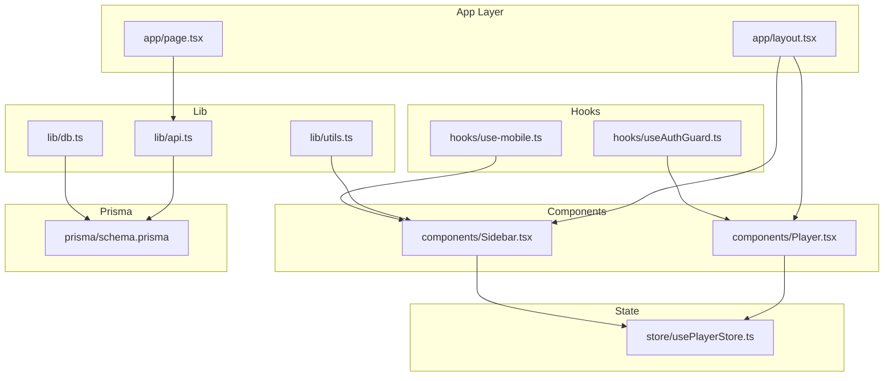
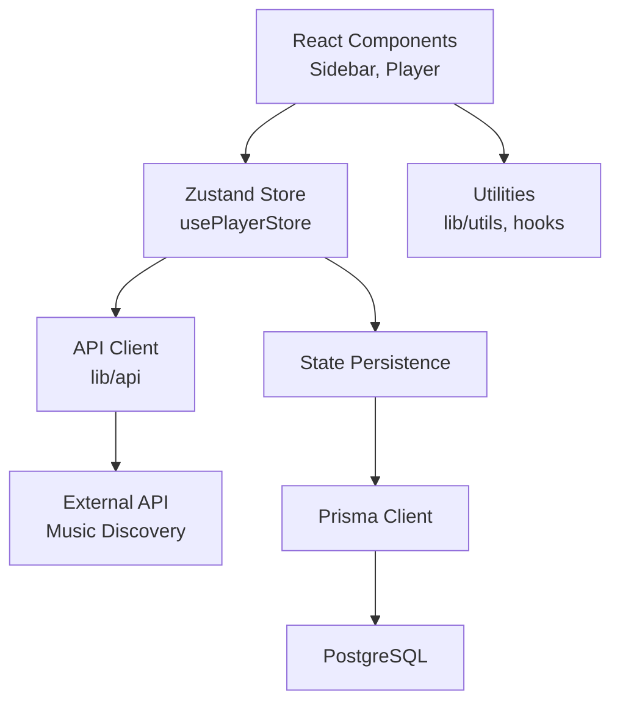
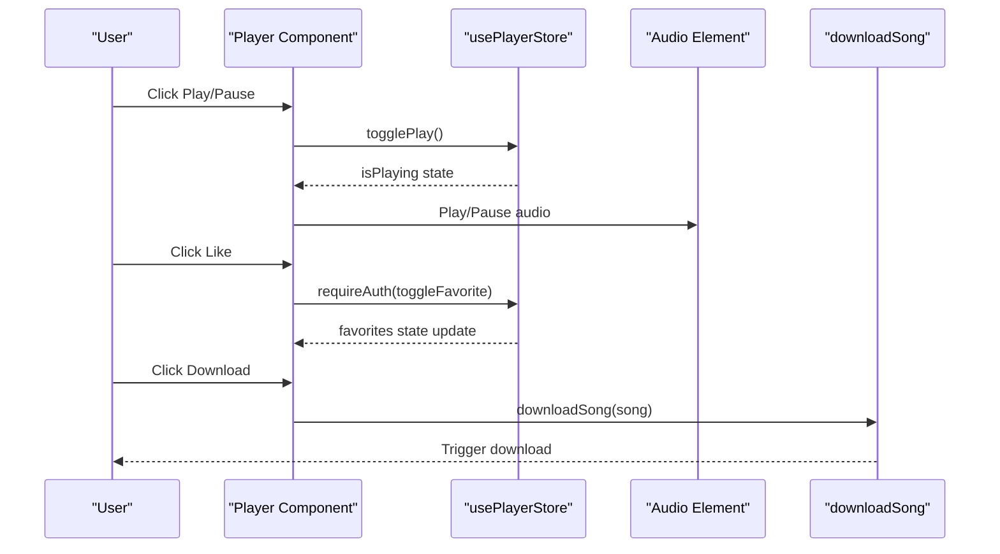
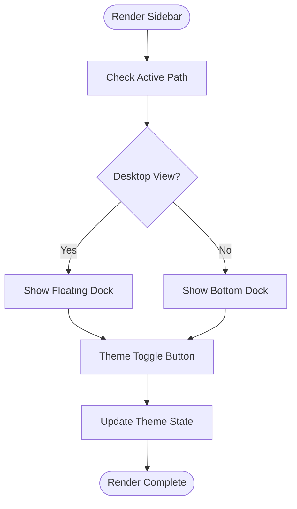
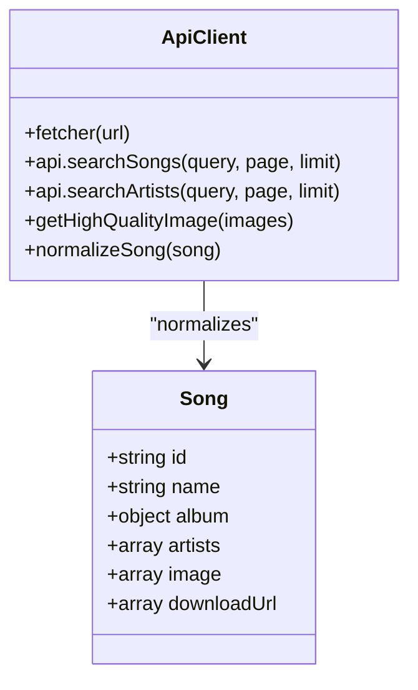
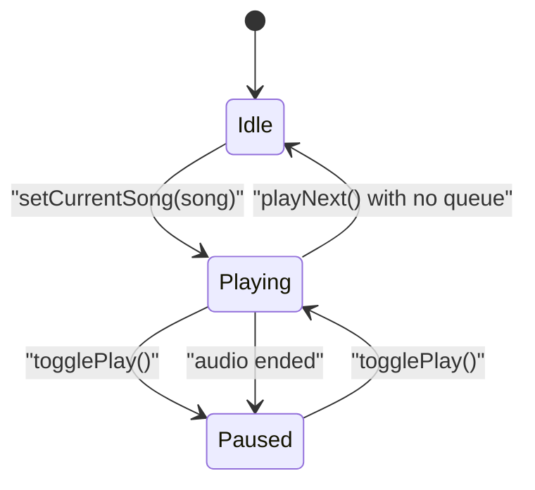
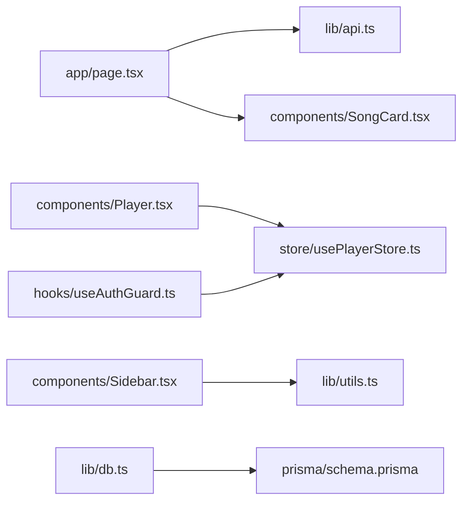

# Development Guidelines

<cite>
**Referenced Files in This Document**
- [package.json](file://package.json)
- [tsconfig.json](file://tsconfig.json)
- [eslint.config.mjs](file://eslint.config.mjs)
- [next.config.ts](file://next.config.ts)
- [prisma/schema.prisma](file://prisma/schema.prisma)
- [lib/db.ts](file://lib/db.ts)
- [lib/api.ts](file://lib/api.ts)
- [lib/utils.ts](file://lib/utils.ts)
- [hooks/use-mobile.ts](file://hooks/use-mobile.ts)
- [hooks/useAuthGuard.ts](file://hooks/useAuthGuard.ts)
- [store/usePlayerStore.ts](file://store/usePlayerStore.ts)
- [components/Sidebar.tsx](file://components/Sidebar.tsx)
- [components/Player.tsx](file://components/Player.tsx)
- [app/layout.tsx](file://app/layout.tsx)
- [app/page.tsx](file://app/page.tsx)
</cite>

## Table of Contents
1. [Introduction](#introduction)
2. [Project Structure](#project-structure)
3. [Core Components](#core-components)
4. [Architecture Overview](#architecture-overview)
5. [Detailed Component Analysis](#detailed-component-analysis)
6. [Dependency Analysis](#dependency-analysis)
7. [Performance Considerations](#performance-considerations)
8. [Testing Strategies](#testing-strategies)
9. [Code Review and Quality Assurance](#code-review-and-quality-assurance)
10. [Database Schema Change Management](#database-schema-change-management)
11. [Version Control Best Practices](#version-control-best-practices)
12. [Deployment and Environment Configuration](#deployment-and-environment-configuration)
13. [CI/CD Pipeline Setup](#cicd-pipeline-setup)
14. [Debugging and Troubleshooting](#debugging-and-troubleshooting)
15. [Contribution Guidelines and Community Standards](#contribution-guidelines-and-community-standards)
16. [Development Tools and IDE Setup](#development-tools-and-ide-setup)
17. [Conclusion](#conclusion)

## Introduction
This document provides comprehensive development guidelines for contributors working on SonicStream. It covers code standards and conventions for TypeScript, React components, and API development, along with component development guidelines, naming conventions, file organization patterns, architectural decision-making criteria, testing strategies, code review processes, quality assurance procedures, database schema change management, migration procedures, version control best practices, deployment guidelines, environment configuration, CI/CD pipeline setup, debugging techniques, performance profiling, troubleshooting workflows, contribution guidelines, issue reporting procedures, community collaboration standards, and development tools setup.

## Project Structure
SonicStream follows a Next.js app directory structure with a clear separation of concerns:
- app: Page routes, layouts, and API handlers
- components: Reusable React UI components
- hooks: Custom React hooks
- lib: Shared utilities, API clients, and database connections
- store: Zustand-based global state management
- prisma: Database schema definition and migrations
- styles: Global CSS and Tailwind configuration

**Diagram sources**
- [app/layout.tsx](file://app/layout.tsx)
- [app/page.tsx](file://app/page.tsx)
- [components/Sidebar.tsx](file://components/Sidebar.tsx)
- [components/Player.tsx](file://components/Player.tsx)
- [store/usePlayerStore.ts](file://store/usePlayerStore.ts)
- [lib/api.ts](file://lib/api.ts)
- [lib/db.ts](file://lib/db.ts)
- [lib/utils.ts](file://lib/utils.ts)
- [hooks/use-mobile.ts](file://hooks/use-mobile.ts)
- [hooks/useAuthGuard.ts](file://hooks/useAuthGuard.ts)
- [prisma/schema.prisma](file://prisma/schema.prisma)

**Section sources**
- [package.json](file://package.json)
- [tsconfig.json](file://tsconfig.json)
- [next.config.ts](file://next.config.ts)

## Core Components
This section documents the foundational building blocks of the application and their responsibilities.

- Layout and Theming
  - Root layout composes providers for query caching, theming, and global styles.
  - Providers enable consistent theming and state across pages.

- Player Store
  - Centralized state for playback controls, queue management, favorites, and user data.
  - Persisted partially to maintain user preferences across sessions.

- API Utilities
  - Unified API client for external music service integration.
  - Normalization helpers for inconsistent data structures.

- Authentication Guard
  - Hook to gate actions requiring authenticated users.

- UI Components
  - Sidebar provides navigation and theme switching.
  - Player handles media playback, queue, and user interactions.

**Section sources**
- [app/layout.tsx](file://app/layout.tsx)
- [store/usePlayerStore.ts](file://store/usePlayerStore.ts)
- [lib/api.ts](file://lib/api.ts)
- [hooks/useAuthGuard.ts](file://hooks/useAuthGuard.ts)
- [components/Sidebar.tsx](file://components/Sidebar.tsx)
- [components/Player.tsx](file://components/Player.tsx)

## Architecture Overview
The application follows a layered architecture:
- Presentation Layer: Next.js app directory with page components and shared UI components
- State Management: Zustand store for player state and user preferences
- Data Access: Prisma ORM with PostgreSQL
- External Services: Music discovery API integration
- Styling: Tailwind CSS with CSS variables for theming

**Diagram sources**
- [components/Sidebar.tsx](file://components/Sidebar.tsx)
- [components/Player.tsx](file://components/Player.tsx)
- [store/usePlayerStore.ts](file://store/usePlayerStore.ts)
- [lib/api.ts](file://lib/api.ts)
- [lib/db.ts](file://lib/db.ts)
- [prisma/schema.prisma](file://prisma/schema.prisma)

## Detailed Component Analysis

### Player Component
The Player component orchestrates media playback with keyboard shortcuts, queue management, and download functionality.

**Diagram sources**
- [components/Player.tsx](file://components/Player.tsx)
- [store/usePlayerStore.ts](file://store/usePlayerStore.ts)

**Section sources**
- [components/Player.tsx](file://components/Player.tsx)
- [hooks/useAuthGuard.ts](file://hooks/useAuthGuard.ts)
- [lib/api.ts](file://lib/api.ts)

### Sidebar Navigation
The Sidebar provides responsive navigation with theme switching capabilities.

**Diagram sources**
- [components/Sidebar.tsx](file://components/Sidebar.tsx)

**Section sources**
- [components/Sidebar.tsx](file://components/Sidebar.tsx)
- [hooks/use-mobile.ts](file://hooks/use-mobile.ts)

### API Integration Pattern
The API utilities demonstrate a consistent pattern for external service integration with normalization and error handling.

**Diagram sources**
- [lib/api.ts](file://lib/api.ts)

**Section sources**
- [lib/api.ts](file://lib/api.ts)

### State Management with Zustand
The player store encapsulates playback state with persistence and derived behaviors.

**Diagram sources**
- [store/usePlayerStore.ts](file://store/usePlayerStore.ts)

**Section sources**
- [store/usePlayerStore.ts](file://store/usePlayerStore.ts)

## Dependency Analysis
The project maintains clear boundaries between layers with minimal coupling.

**Diagram sources**
- [app/page.tsx](file://app/page.tsx)
- [lib/api.ts](file://lib/api.ts)
- [components/Player.tsx](file://components/Player.tsx)
- [store/usePlayerStore.ts](file://store/usePlayerStore.ts)
- [components/Sidebar.tsx](file://components/Sidebar.tsx)
- [lib/utils.ts](file://lib/utils.ts)
- [hooks/useAuthGuard.ts](file://hooks/useAuthGuard.ts)
- [lib/db.ts](file://lib/db.ts)
- [prisma/schema.prisma](file://prisma/schema.prisma)

**Section sources**
- [package.json](file://package.json)
- [tsconfig.json](file://tsconfig.json)

## Performance Considerations
- Use React Query for efficient data fetching and caching
- Implement skeleton loaders for improved perceived performance
- Leverage motion for smooth animations without heavy computations
- Optimize image loading with Next.js Image component and high-quality fallbacks
- Minimize re-renders by structuring state updates carefully in the store
- Use lazy loading for non-critical components

## Testing Strategies
Recommended testing approaches:
- Unit tests for pure functions in lib/utils and store selectors
- Component tests for UI components using React Testing Library
- Integration tests for API interactions and store behavior
- End-to-end tests for critical user flows (authentication, playback)
- Snapshot tests for static UI components
- Mock external APIs for isolated testing

## Code Review and Quality Assurance
Code review checklist:
- TypeScript strict mode compliance
- Consistent naming conventions
- Proper error handling and edge cases
- Accessibility considerations
- Performance implications
- Security best practices
- Documentation completeness

Quality assurance procedures:
- Run ESLint and TypeScript checks locally
- Verify builds succeed in CI
- Test on multiple devices and browsers
- Validate database migrations in staging
- Monitor performance metrics

## Database Schema Change Management
Schema management follows Prisma conventions:
- Define models in prisma/schema.prisma
- Generate client after schema changes
- Create migrations for production deployments
- Test migrations in staging environment
- Maintain backward compatibility where possible

Migration procedure:
1. Modify schema.prisma
2. Run prisma migrate dev to create migration
3. Test migration locally
4. Commit migration files
5. Deploy to staging, run migration
6. Deploy to production, run migration

**Section sources**
- [prisma/schema.prisma](file://prisma/schema.prisma)
- [lib/db.ts](file://lib/db.ts)

## Version Control Best Practices
Branching strategy:
- Feature branches per feature
- Pull requests for all changes
- Squash and merge for clean history
- Semantic commit messages

Commit guidelines:
- Separate subject and body with blank line
- Limit subject to 50 characters
- Wrap body at 72 characters
- Reference related issues

## Deployment and Environment Configuration
Environment variables:
- DATABASE_URL for production database
- DIRECT_URL for Prisma direct connection
- NEXT_PUBLIC_* for client-side configuration
- Disable HMR in development when needed via DISABLE_HMR

Deployment targets:
- Vercel for frontend hosting
- Supabase or PlanetScale for database
- Cloudinary for asset storage

**Section sources**
- [next.config.ts](file://next.config.ts)
- [prisma/schema.prisma](file://prisma/schema.prisma)

## CI/CD Pipeline Setup
Pipeline stages:
1. Install dependencies
2. Type check and lint
3. Build verification
4. Test execution
5. Database migration
6. Deploy to preview/staging/production

GitHub Actions configuration:
- Node.js version alignment with package.json
- Cache dependencies for faster builds
- Run tests on pull requests
- Deploy previews for review

## Debugging and Troubleshooting
Debugging techniques:
- Use React DevTools for component inspection
- Enable Redux DevTools for state debugging
- Console logging with structured data
- Network tab analysis for API issues
- Database query logging in development

Troubleshooting workflows:
- Reproduce issues with minimal test cases
- Check browser console for JavaScript errors
- Verify API responses and status codes
- Inspect database connectivity
- Review recent code changes

## Contribution Guidelines and Community Standards
Contribution process:
1. Fork repository
2. Create feature branch
3. Follow coding standards
4. Write tests
5. Submit pull request
6. Address review feedback

Community standards:
- Respectful communication
- Constructive feedback
- Inclusive environment
- Clear documentation

Issue reporting:
- Use bug report template
- Include reproduction steps
- Provide environment details
- Attach screenshots when helpful

## Development Tools and IDE Setup
Recommended tools:
- VS Code with recommended extensions
- Prettier for code formatting
- ESLint for linting
- TypeScript IntelliSense
- GitLens for git integration

IDE configuration:
- Enable format on save
- Configure TypeScript strict mode
- Set up ESLint integration
- Configure Prettier for CSS/JS/TS

**Section sources**
- [eslint.config.mjs](file://eslint.config.mjs)
- [tsconfig.json](file://tsconfig.json)

## Conclusion
These guidelines establish a consistent foundation for developing SonicStream. By following the established patterns, conventions, and procedures outlined here, contributors can ensure high-quality, maintainable code while accelerating development velocity. Regular adherence to these practices will improve code reliability, developer experience, and overall project health.