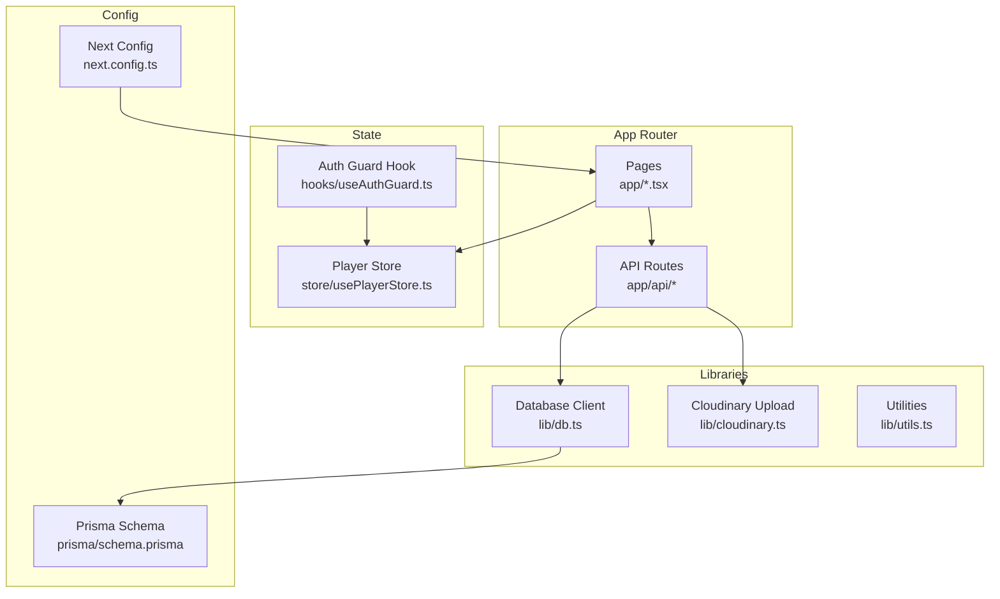
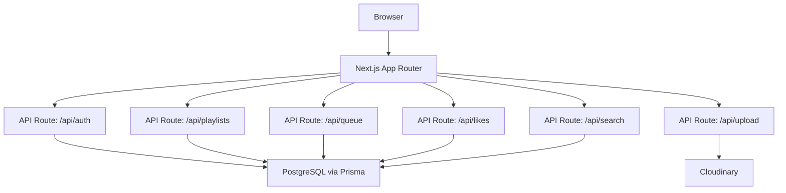
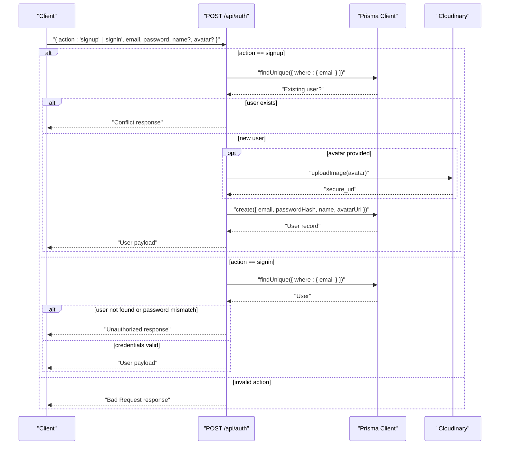
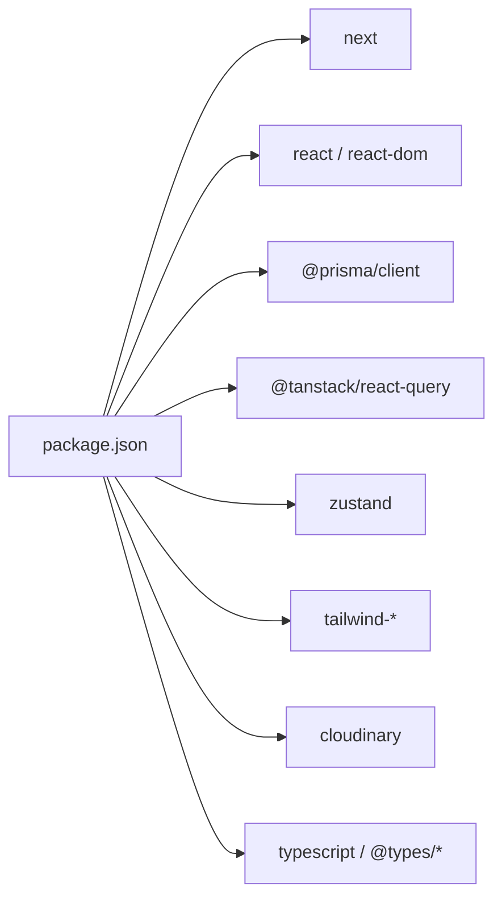

# Getting Started

<cite>
**Referenced Files in This Document**
- [README.md](file://README.md)
- [package.json](file://package.json)
- [next.config.ts](file://next.config.ts)
- [prisma/schema.prisma](file://prisma/schema.prisma)
- [lib/db.ts](file://lib/db.ts)
- [lib/cloudinary.ts](file://lib/cloudinary.ts)
- [app/api/auth/route.ts](file://app/api/auth/route.ts)
- [hooks/useAuthGuard.ts](file://hooks/useAuthGuard.ts)
- [store/usePlayerStore.ts](file://store/usePlayerStore.ts)
- [app/layout.tsx](file://app/layout.tsx)
- [app/page.tsx](file://app/page.tsx)
</cite>

## Table of Contents
1. [Introduction](#introduction)
2. [Project Structure](#project-structure)
3. [Core Components](#core-components)
4. [Architecture Overview](#architecture-overview)
5. [Detailed Component Analysis](#detailed-component-analysis)
6. [Dependency Analysis](#dependency-analysis)
7. [Performance Considerations](#performance-considerations)
8. [Troubleshooting Guide](#troubleshooting-guide)
9. [Conclusion](#conclusion)
10. [Appendices](#appendices)

## Introduction
SonicStream is a modern music streaming application built with Next.js 15 App Router. It provides a responsive UI with dynamic theming, a smart player with queue management, playlist creation, advanced search, secure authentication, and an admin dashboard. This guide helps you set up the project locally, configure prerequisites, run the development server, and perform basic operations like authentication and music playback.

## Project Structure
At a high level, the project is organized into:
- app: Next.js App Router pages and API routes
- components: Shared UI components (player, sidebar, modals)
- hooks: Client-side utilities (authentication guard)
- lib: Database client, cloud storage, API helpers
- prisma: Database schema and client generation
- store: Global state for player and user session
- styles: Global CSS and Tailwind configuration

**Diagram sources**
- [next.config.ts:1-67](file://next.config.ts#L1-L67)
- [prisma/schema.prisma:1-111](file://prisma/schema.prisma#L1-L111)
- [lib/db.ts:1-10](file://lib/db.ts#L1-L10)
- [lib/cloudinary.ts:1-21](file://lib/cloudinary.ts#L1-L21)
- [store/usePlayerStore.ts:1-128](file://store/usePlayerStore.ts#L1-L128)
- [hooks/useAuthGuard.ts:1-29](file://hooks/useAuthGuard.ts#L1-L29)
- [app/layout.tsx:1-49](file://app/layout.tsx#L1-L49)
- [app/page.tsx:1-204](file://app/page.tsx#L1-L204)

**Section sources**
- [README.md:1-74](file://README.md#L1-L74)
- [next.config.ts:1-67](file://next.config.ts#L1-L67)
- [prisma/schema.prisma:1-111](file://prisma/schema.prisma#L1-L111)

## Core Components
- Authentication API: Handles sign-up/sign-in with hashed passwords and optional avatar uploads.
- Database: PostgreSQL via Prisma ORM with strongly typed models.
- Cloud Storage: Cloudinary integration for avatar uploads.
- Player and State: Zustand-backed store for playback controls, queue, favorites, and user session.
- UI Layout: Root layout composes sidebar, main content area, persistent player, and theme/provider wrappers.

**Section sources**
- [app/api/auth/route.ts:1-73](file://app/api/auth/route.ts#L1-L73)
- [lib/db.ts:1-10](file://lib/db.ts#L1-L10)
- [lib/cloudinary.ts:1-21](file://lib/cloudinary.ts#L1-L21)
- [store/usePlayerStore.ts:1-128](file://store/usePlayerStore.ts#L1-L128)
- [app/layout.tsx:1-49](file://app/layout.tsx#L1-L49)

## Architecture Overview
The application uses a client-server split:
- Client: Next.js App Router pages and components
- Server: API routes under app/api for authentication, playlists, likes, follows, queue, and uploads
- Data: PostgreSQL database accessed via Prisma
- Assets: Cloudinary for avatar uploads

**Diagram sources**
- [app/api/auth/route.ts:1-73](file://app/api/auth/route.ts#L1-L73)
- [lib/cloudinary.ts:1-21](file://lib/cloudinary.ts#L1-L21)
- [lib/db.ts:1-10](file://lib/db.ts#L1-L10)
- [prisma/schema.prisma:1-111](file://prisma/schema.prisma#L1-L111)

## Detailed Component Analysis

### Prerequisites
- Node.js: Version 18.x or later is required.
- Database: PostgreSQL-compatible database (Neon recommended).
- Environment variables: Configure the database connection and Cloudinary credentials.

Key environment variables used by the application:
- DATABASE_URL: Primary database connection string for Prisma.
- DIRECT_URL: Direct database connection string for Prisma CLI operations.
- CLOUDINARY_CLOUD_NAME: Cloudinary cloud name.
- CLOUDINARY_API_KEY: Cloudinary API key.
- CLOUDINARY_API_SECRET: Cloudinary API secret.

Notes:
- The project’s Prisma schema defines a PostgreSQL datasource and requires both DATABASE_URL and DIRECT_URL.
- Cloudinary is used for avatar uploads during user registration.

**Section sources**
- [README.md:34-38](file://README.md#L34-L38)
- [prisma/schema.prisma:5-9](file://prisma/schema.prisma#L5-L9)
- [lib/cloudinary.ts:3-7](file://lib/cloudinary.ts#L3-L7)

### Installation and Setup
Follow these steps to get the project running locally:

1. Clone the repository
   - Use your preferred Git client to clone the repository.

2. Install dependencies
   - Run the package manager install command.

3. Set up the database
   - Push Prisma schema to the database.
   - Generate Prisma client for TypeScript support.

4. Run the development server
   - Start the Next.js development server.

These steps align with the repository’s documented workflow.

**Section sources**
- [README.md:40-61](file://README.md#L40-L61)
- [package.json:5-11](file://package.json#L5-L11)
- [prisma/schema.prisma:1-9](file://prisma/schema.prisma#L1-L9)

### Environment Configuration
- Database
  - Set DATABASE_URL and DIRECT_URL to point to your PostgreSQL instance.
  - These variables are consumed by Prisma and the Next.js runtime.

- Cloudinary
  - Set CLOUDINARY_CLOUD_NAME, CLOUDINARY_API_KEY, and CLOUDINARY_API_SECRET for avatar uploads.

- Optional Next.js configuration
  - The project allows remote image hosts via next.config.ts for development.

**Section sources**
- [prisma/schema.prisma:5-9](file://prisma/schema.prisma#L5-L9)
- [lib/cloudinary.ts:3-7](file://lib/cloudinary.ts#L3-L7)
- [next.config.ts:12-50](file://next.config.ts#L12-L50)

### Development Server Startup
- Start the development server using the script defined in package.json.
- Access the local application in your browser.

**Section sources**
- [package.json:5-11](file://package.json#L5-L11)
- [README.md:58-61](file://README.md#L58-L61)

### Basic Usage Examples
- Open the home page to discover trending songs, artists, and playlists.
- Use the search bar to find songs, artists, and albums.
- Authenticate to unlock personalized features:
  - Sign up or sign in via the authentication API route.
  - On actions requiring authentication, the auth guard hook opens the modal if the user is not logged in.
- Play music:
  - Select a song to set it as the current track.
  - Use the player controls to manage playback, queue, shuffle, repeat, and favorites.

Example navigation:
- Home: /
- Search: /search
- Profile: /profile
- Favorites: /favorites
- Library: /library
- Admin: /admin

Note: The home page integrates with an external music API for content discovery.

**Section sources**
- [app/page.tsx:34-204](file://app/page.tsx#L34-L204)
- [hooks/useAuthGuard.ts:12-28](file://hooks/useAuthGuard.ts#L12-L28)
- [store/usePlayerStore.ts:12-41](file://store/usePlayerStore.ts#L12-L41)
- [app/layout.tsx:21-44](file://app/layout.tsx#L21-L44)

### Authentication Flow

**Diagram sources**
- [app/api/auth/route.ts:15-72](file://app/api/auth/route.ts#L15-L72)
- [lib/cloudinary.ts:9-18](file://lib/cloudinary.ts#L9-L18)
- [lib/db.ts:1-10](file://lib/db.ts#L1-L10)

## Dependency Analysis
- Runtime dependencies include Next.js, React, Prisma Client, TanStack Query, Zustand, Tailwind-based UI libraries, and others.
- Development dependencies include Prisma, TypeScript, ESLint, Tailwind plugins, and related tooling.
- The project uses Prisma for database operations and Cloudinary for asset uploads.

**Diagram sources**
- [package.json:12-48](file://package.json#L12-L48)

**Section sources**
- [package.json:12-48](file://package.json#L12-L48)

## Performance Considerations
- Use the production build and start scripts for optimized performance in staging/production.
- Keep database connections efficient by leveraging Prisma’s client lifecycle and avoiding unnecessary queries.
- Minimize heavy computations in the browser; rely on TanStack Query for caching and background updates.
- For development, disable HMR selectively if needed via environment flags as configured in Next.js.

[No sources needed since this section provides general guidance]

## Troubleshooting Guide
Common setup and runtime issues:

- Node.js version mismatch
  - Ensure you are using Node.js 18.x or later as required by the project.

- Database connectivity
  - Verify DATABASE_URL and DIRECT_URL are set correctly.
  - Confirm your PostgreSQL instance is reachable and accepts connections.

- Prisma schema and client
  - Run schema push and client generation to synchronize the database and TypeScript types.

- Cloudinary avatar uploads
  - Ensure CLOUDINARY_CLOUD_NAME, CLOUDINARY_API_KEY, and CLOUDINARY_API_SECRET are configured.
  - Check network access and Cloudinary account permissions.

- Authentication errors
  - Review the authentication API route for validation and error responses.
  - Confirm hashed password logic and user existence checks.

- Environment variables
  - The repository ignores .env* files except .env.example; ensure your .env is properly named and loaded.

- Remote images in development
  - The Next.js configuration allows specific remote image hosts; verify URLs if images fail to load.

**Section sources**
- [README.md:34-38](file://README.md#L34-L38)
- [prisma/schema.prisma:5-9](file://prisma/schema.prisma#L5-L9)
- [lib/cloudinary.ts:3-7](file://lib/cloudinary.ts#L3-L7)
- [app/api/auth/route.ts:15-72](file://app/api/auth/route.ts#L15-L72)
- [.gitignore](file://.gitignore#L6)

## Conclusion
You now have the essentials to install, configure, and run SonicStream locally. Use the authentication API to sign up or log in, explore the home page and search features, and manage music playback via the player controls. If you encounter issues, refer to the troubleshooting section and ensure your environment variables, database, and Cloudinary credentials are correctly set.

[No sources needed since this section summarizes without analyzing specific files]

## Appendices

### Appendix A: Environment Variables Reference
- DATABASE_URL: Primary database connection string for Prisma.
- DIRECT_URL: Direct database connection string for Prisma CLI operations.
- CLOUDINARY_CLOUD_NAME: Cloudinary cloud name.
- CLOUDINARY_API_KEY: Cloudinary API key.
- CLOUDINARY_API_SECRET: Cloudinary API secret.

**Section sources**
- [prisma/schema.prisma:5-9](file://prisma/schema.prisma#L5-L9)
- [lib/cloudinary.ts:3-7](file://lib/cloudinary.ts#L3-L7)