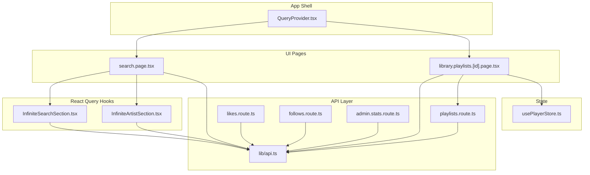
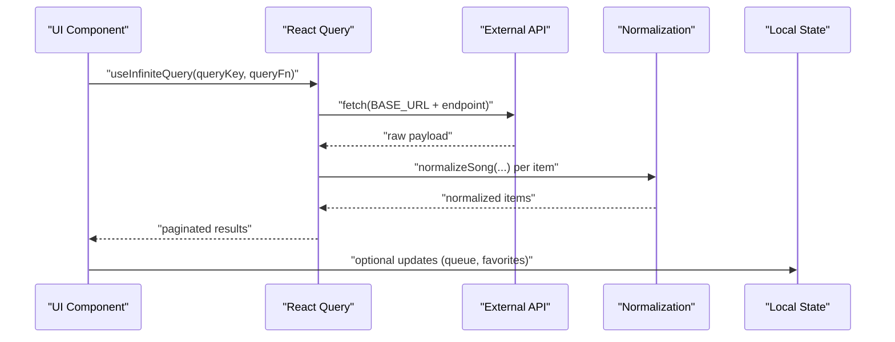
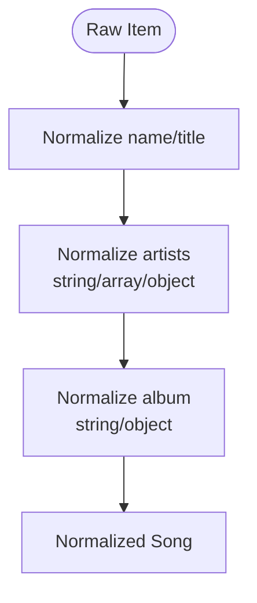
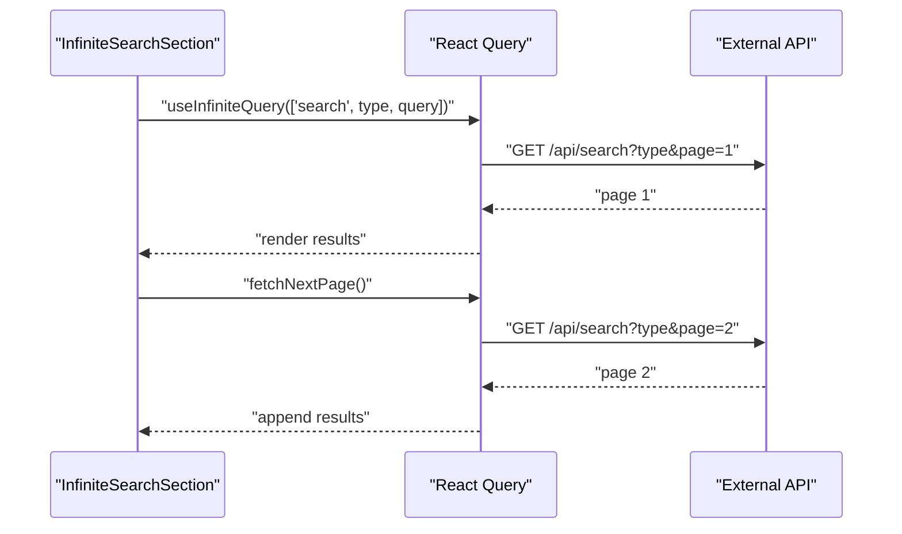
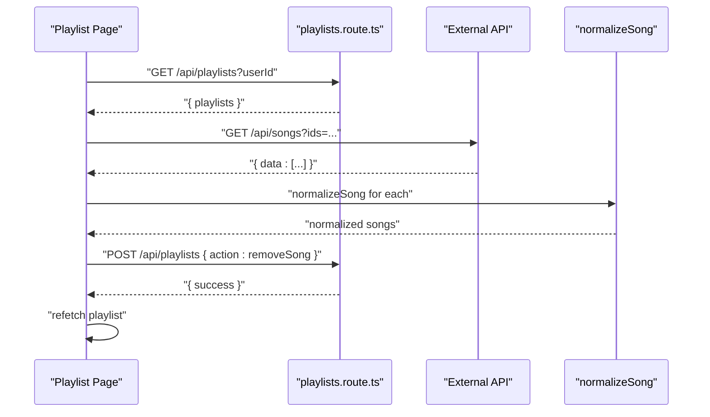
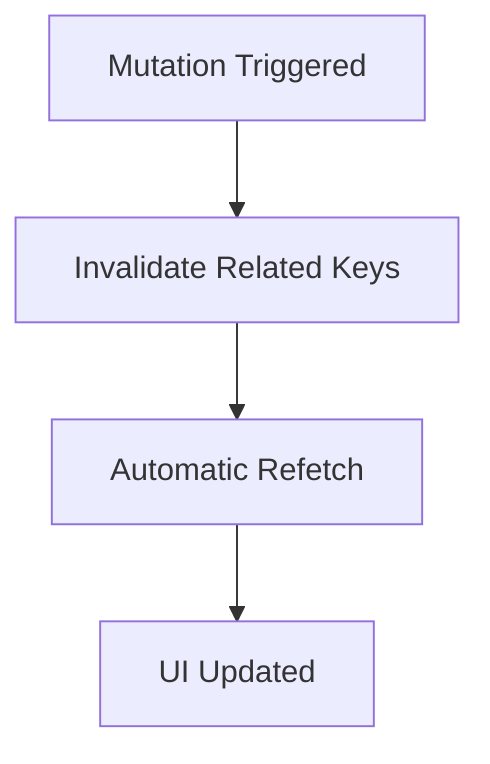
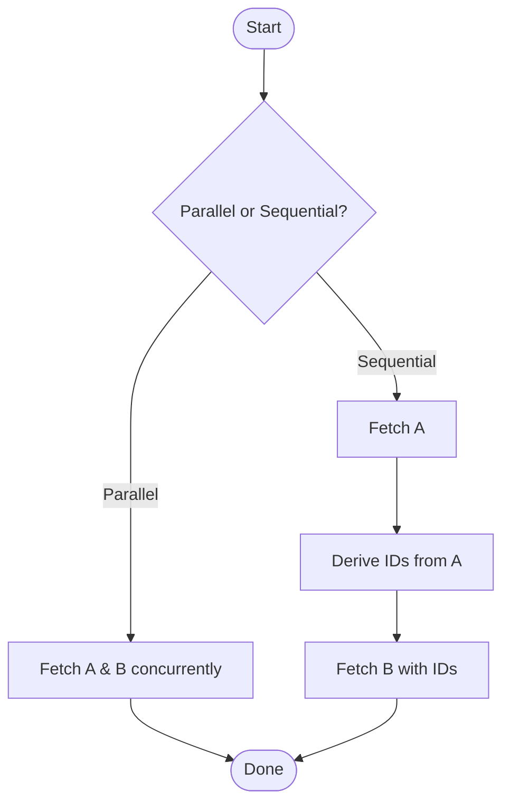
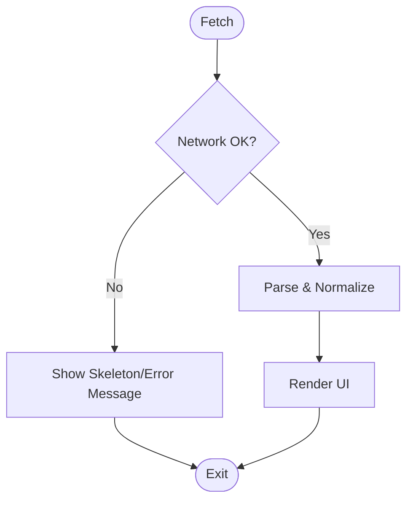
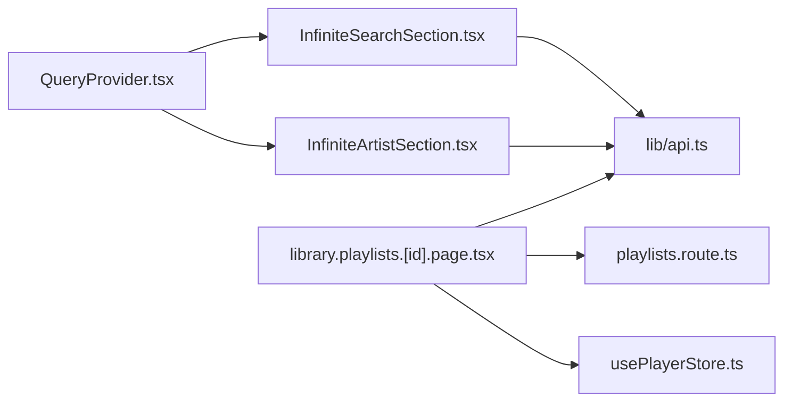

# Data Fetching Optimization

<cite>
**Referenced Files in This Document**
- [QueryProvider.tsx](file://components/QueryProvider.tsx)
- [api.ts](file://lib/api.ts)
- [InfiniteSearchSection.tsx](file://components/InfiniteSearchSection.tsx)
- [InfiniteArtistSection.tsx](file://components/InfiniteArtistSection.tsx)
- [library.playlists.[id].page.tsx](file://app/library/playlists/[id]/page.tsx)
- [search.page.tsx](file://app/search/page.tsx)
- [playlists.route.ts](file://app/api/playlists/route.ts)
- [likes.route.ts](file://app/api/likes/route.ts)
- [follows.route.ts](file://app/api/follows/route.ts)
- [admin.stats.route.ts](file://app/api/admin/stats/route.ts)
- [usePlayerStore.ts](file://store/usePlayerStore.ts)
</cite>

## Table of Contents
1. [Introduction](#introduction)
2. [Project Structure](#project-structure)
3. [Core Components](#core-components)
4. [Architecture Overview](#architecture-overview)
5. [Detailed Component Analysis](#detailed-component-analysis)
6. [Dependency Analysis](#dependency-analysis)
7. [Performance Considerations](#performance-considerations)
8. [Troubleshooting Guide](#troubleshooting-guide)
9. [Conclusion](#conclusion)
10. [Appendices](#appendices)

## Introduction
This document provides a comprehensive guide to optimizing data fetching in SonicStream’s API integration. It focuses on React Query caching strategies, query invalidation patterns, background refetching configurations, API response normalization, data transformation pipelines, caching layer implementation, request deduplication, parallel versus sequential fetching, error boundary implementations, network optimization techniques, retry mechanisms, offline fallback strategies, API rate limiting, request batching, efficient polling patterns, and performance monitoring for API calls and data fetching bottlenecks.

## Project Structure
SonicStream integrates a TanStack React Query provider at the application root and leverages it across pages and components to manage server state. API routes are implemented with Next.js routes, while client-side data fetching is performed via React Query hooks. Utility modules provide API endpoint builders, normalization helpers, and shared UI patterns.

**Diagram sources**
- [QueryProvider.tsx:1-26](file://components/QueryProvider.tsx#L1-L26)
- [search.page.tsx:1-129](file://app/search/page.tsx#L1-L129)
- [library.playlists.[id].page.tsx:1-187](file://app/library/playlists/[id]/page.tsx#L1-L187)
- [InfiniteSearchSection.tsx:1-90](file://components/InfiniteSearchSection.tsx#L1-L90)
- [InfiniteArtistSection.tsx:1-127](file://components/InfiniteArtistSection.tsx#L1-L127)
- [api.ts:1-153](file://lib/api.ts#L1-L153)
- [playlists.route.ts:1-90](file://app/api/playlists/route.ts#L1-L90)
- [likes.route.ts:1-55](file://app/api/likes/route.ts#L1-L55)
- [follows.route.ts:1-55](file://app/api/follows/route.ts#L1-L55)
- [admin.stats.route.ts:1-28](file://app/api/admin/stats/route.ts#L1-L28)
- [usePlayerStore.ts:1-128](file://store/usePlayerStore.ts#L1-L128)

**Section sources**
- [QueryProvider.tsx:1-26](file://components/QueryProvider.tsx#L1-L26)
- [search.page.tsx:1-129](file://app/search/page.tsx#L1-L129)
- [library.playlists.[id].page.tsx:1-187](file://app/library/playlists/[id]/page.tsx#L1-L187)
- [InfiniteSearchSection.tsx:1-90](file://components/InfiniteSearchSection.tsx#L1-L90)
- [InfiniteArtistSection.tsx:1-127](file://components/InfiniteArtistSection.tsx#L1-L127)
- [api.ts:1-153](file://lib/api.ts#L1-L153)
- [playlists.route.ts:1-90](file://app/api/playlists/route.ts#L1-L90)
- [likes.route.ts:1-55](file://app/api/likes/route.ts#L1-L55)
- [follows.route.ts:1-55](file://app/api/follows/route.ts#L1-L55)
- [admin.stats.route.ts:1-28](file://app/api/admin/stats/route.ts#L1-L28)
- [usePlayerStore.ts:1-128](file://store/usePlayerStore.ts#L1-L128)

## Core Components
- React Query Provider: Configures default caching and retry behavior for all queries.
- API Utilities: Endpoint builders and normalization helpers for consistent data shapes.
- Infinite Scrolling Components: Reusable hooks for paginated data fetching.
- Playlist Page: Demonstrates combined local and remote data fetching with manual refetching.
- API Routes: Server endpoints for user-specific data and administrative statistics.

Key implementation references:
- React Query defaults and client creation: [QueryProvider.tsx:6-18](file://components/QueryProvider.tsx#L6-L18)
- API endpoint builders and normalization: [api.ts:37-69](file://lib/api.ts#L37-L69), [api.ts:92-152](file://lib/api.ts#L92-L152)
- Infinite search and artist sections: [InfiniteSearchSection.tsx:31-44](file://components/InfiniteSearchSection.tsx#L31-L44), [InfiniteArtistSection.tsx:50-70](file://components/InfiniteArtistSection.tsx#L50-L70)
- Playlist page with refetch and normalization: [library.playlists.[id].page.tsx:21-43](file://app/library/playlists/[id]/page.tsx#L21-L43), [api.ts:92-152](file://lib/api.ts#L92-L152)

**Section sources**
- [QueryProvider.tsx:6-18](file://components/QueryProvider.tsx#L6-L18)
- [api.ts:37-69](file://lib/api.ts#L37-L69)
- [api.ts:92-152](file://lib/api.ts#L92-L152)
- [InfiniteSearchSection.tsx:31-44](file://components/InfiniteSearchSection.tsx#L31-L44)
- [InfiniteArtistSection.tsx:50-70](file://components/InfiniteArtistSection.tsx#L50-L70)
- [library.playlists.[id].page.tsx:21-43](file://app/library/playlists/[id]/page.tsx#L21-L43)

## Architecture Overview
The data fetching architecture centers on:
- Centralized React Query configuration for caching and retries.
- Client-side infinite pagination with deduplicated requests.
- Normalization pipeline to unify external API responses.
- Manual refetching after mutations to keep views consistent.
- Local state for playback and user preferences to reduce network load.

**Diagram sources**
- [InfiniteSearchSection.tsx:31-44](file://components/InfiniteSearchSection.tsx#L31-L44)
- [api.ts:92-152](file://lib/api.ts#L92-L152)
- [usePlayerStore.ts:1-128](file://store/usePlayerStore.ts#L1-L128)

## Detailed Component Analysis

### React Query Caching and Defaults
- Stale time: Queries become stale after a short period to balance freshness and cache hit ratio.
- Window focus refetch: Disabled to avoid unnecessary background refreshes during browsing.
- Retry attempts: Single retry to handle transient failures.

Recommendations:
- Increase staleTime for low-churn lists (e.g., browse categories).
- Enable selective background refetchOnWindowFocus for critical user data.
- Tune retry based on error classification (network vs. server errors).

**Section sources**
- [QueryProvider.tsx:10-16](file://components/QueryProvider.tsx#L10-L16)

### API Response Normalization and Transformation Pipeline
Normalization ensures consistent shapes across heterogeneous upstream responses:
- Field mapping for name/title ambiguity.
- Artist structure normalization (string, array, or structured).
- Album structure normalization.
- Image and download URL selection helpers.

**Diagram sources**
- [api.ts:92-152](file://lib/api.ts#L92-L152)

**Section sources**
- [api.ts:92-152](file://lib/api.ts#L92-L152)

### Infinite Pagination and Request Deduplication
- InfiniteSearchSection and InfiniteArtistSection use useInfiniteQuery with:
  - queryKey scoped to type and identifier.
  - getNextPageParam derived from page length.
  - enabled guards to prevent premature fetching.
- Deduplication occurs automatically via React Query’s internal cache keyed by queryKey.

**Diagram sources**
- [InfiniteSearchSection.tsx:31-44](file://components/InfiniteSearchSection.tsx#L31-L44)
- [InfiniteArtistSection.tsx:50-70](file://components/InfiniteArtistSection.tsx#L50-L70)

**Section sources**
- [InfiniteSearchSection.tsx:31-44](file://components/InfiniteSearchSection.tsx#L31-L44)
- [InfiniteArtistSection.tsx:50-70](file://components/InfiniteArtistSection.tsx#L50-L70)

### Combined Local and Remote Data Fetching
The playlist detail page demonstrates:
- Fetching user playlists from a backend route.
- Extracting song IDs and fetching detailed song metadata from an external API.
- Normalizing and rendering song cards.
- Manual refetch after mutation to keep UI consistent.

**Diagram sources**
- [library.playlists.[id].page.tsx:21-43](file://app/library/playlists/[id]/page.tsx#L21-L43)
- [playlists.route.ts:18-74](file://app/api/playlists/route.ts#L18-L74)
- [api.ts:92-152](file://lib/api.ts#L92-L152)

**Section sources**
- [library.playlists.[id].page.tsx:21-43](file://app/library/playlists/[id]/page.tsx#L21-L43)
- [playlists.route.ts:18-74](file://app/api/playlists/route.ts#L18-L74)

### Query Invalidation Patterns and Background Refetching
- Manual refetch after mutations: The playlist page refetches playlist data after removing a song.
- Selective invalidation: Invalidate specific query keys to update targeted UI areas.
- Background refetching: Configure refetchOnMount/refetchOnWindowFocus selectively for critical data.

**Section sources**
- [library.playlists.[id].page.tsx:63](file://app/library/playlists/[id]/page.tsx#L63)

### Parallel vs Sequential Fetching Strategies
- Parallel fetching: Use Promise.all for independent metrics or counts (e.g., admin stats).
- Sequential fetching: Fetch parent resource first, then derive child IDs and fetch details in batches.

**Section sources**
- [admin.stats.route.ts:6-17](file://app/api/admin/stats/route.ts#L6-L17)
- [library.playlists.[id].page.tsx:36-43](file://app/library/playlists/[id]/page.tsx#L36-L43)

### Error Boundary and Fallback Implementations
- UI-level loading skeletons and empty states provide graceful fallbacks.
- Network errors surface as thrown exceptions; integrate with React Query error boundaries or global error handlers.
- Normalize error responses consistently across routes.

**Section sources**
- [InfiniteSearchSection.tsx:53-56](file://components/InfiniteSearchSection.tsx#L53-L56)
- [InfiniteArtistSection.tsx:102-105](file://components/InfiniteArtistSection.tsx#L102-L105)

### Network Optimization Techniques
- Base URL reuse and endpoint builders minimize duplication.
- Deduplication via queryKey prevents redundant requests.
- Stale-time tuning balances freshness and bandwidth.
- Image and download URL helpers ensure optimal asset retrieval.

**Section sources**
- [api.ts:37-69](file://lib/api.ts#L37-L69)
- [QueryProvider.tsx:10-16](file://components/QueryProvider.tsx#L10-L16)

### Retry Mechanisms and Offline Fallbacks
- Single retry reduces repeated load on failing endpoints.
- For offline scenarios, consider:
  - Returning cached data immediately (stale acceptable).
  - Queueing mutations locally and replaying when online.
  - Using service workers or local storage for static assets.

**Section sources**
- [QueryProvider.tsx:14](file://components/QueryProvider.tsx#L14)

### API Rate Limiting, Request Batching, and Polling
- Rate limiting: Introduce exponential backoff and jitter in queryFn; consider centralized throttling.
- Request batching: Batch IDs into single requests (as seen in song details).
- Efficient polling: Use background refetching sparingly; prefer event-driven updates or server-sent events.

**Section sources**
- [library.playlists.[id].page.tsx:39](file://app/library/playlists/[id]/page.tsx#L39)
- [QueryProvider.tsx:13](file://components/QueryProvider.tsx#L13)

### Performance Monitoring for API Calls
- Measure query durations and cache hits using React Query Devtools.
- Track slow endpoints and identify bottlenecks in normalization or rendering.
- Monitor memory usage with normalized arrays and large lists.

[No sources needed since this section provides general guidance]

## Dependency Analysis
- QueryProvider.tsx defines global defaults for all queries.
- InfiniteSearchSection.tsx and InfiniteArtistSection.tsx depend on api.ts for endpoint construction and normalization.
- library.playlists.[id].page.tsx depends on playlists.route.ts for user playlists and api.ts for song normalization.
- usePlayerStore.ts integrates with UI to reduce re-renders and optimize playback-related data access.

**Diagram sources**
- [QueryProvider.tsx:1-26](file://components/QueryProvider.tsx#L1-L26)
- [InfiniteSearchSection.tsx:1-90](file://components/InfiniteSearchSection.tsx#L1-L90)
- [InfiniteArtistSection.tsx:1-127](file://components/InfiniteArtistSection.tsx#L1-L127)
- [api.ts:1-153](file://lib/api.ts#L1-L153)
- [library.playlists.[id].page.tsx:1-187](file://app/library/playlists/[id]/page.tsx#L1-L187)
- [playlists.route.ts:1-90](file://app/api/playlists/route.ts#L1-L90)
- [usePlayerStore.ts:1-128](file://store/usePlayerStore.ts#L1-L128)

**Section sources**
- [QueryProvider.tsx:1-26](file://components/QueryProvider.tsx#L1-L26)
- [InfiniteSearchSection.tsx:1-90](file://components/InfiniteSearchSection.tsx#L1-L90)
- [InfiniteArtistSection.tsx:1-127](file://components/InfiniteArtistSection.tsx#L1-L127)
- [api.ts:1-153](file://lib/api.ts#L1-L153)
- [library.playlists.[id].page.tsx:1-187](file://app/library/playlists/[id]/page.tsx#L1-L187)
- [playlists.route.ts:1-90](file://app/api/playlists/route.ts#L1-L90)
- [usePlayerStore.ts:1-128](file://store/usePlayerStore.ts#L1-L128)

## Performance Considerations
- Prefer normalized data structures to reduce transform overhead.
- Use window focus refetch judiciously for sensitive data.
- Batch downstream requests to minimize round trips.
- Implement virtualized lists for large paginated datasets.
- Cache frequently accessed metadata locally to reduce network usage.

[No sources needed since this section provides general guidance]

## Troubleshooting Guide
Common issues and resolutions:
- Empty or missing data: Verify queryKey uniqueness and enabled conditions; check endpoint builders and pagination params.
- Duplicate requests: Ensure queryKey includes identifiers; confirm deduplication via React Query cache.
- Mutation inconsistencies: Manually refetch affected queries after mutations; invalidate specific keys.
- Network failures: Leverage retry; implement fallback UI and error logging.

**Section sources**
- [InfiniteSearchSection.tsx:43](file://components/InfiniteSearchSection.tsx#L43)
- [library.playlists.[id].page.tsx:63](file://app/library/playlists/[id]/page.tsx#L63)
- [QueryProvider.tsx:14](file://components/QueryProvider.tsx#L14)

## Conclusion
SonicStream’s data fetching relies on a clean separation of concerns: React Query manages caching and pagination, API utilities provide consistent endpoints and normalization, and UI components orchestrate requests and rendering. By refining caching policies, leveraging normalization, and adopting robust invalidation and retry strategies, the platform can achieve responsive, reliable, and scalable data access.

[No sources needed since this section summarizes without analyzing specific files]

## Appendices
- Endpoint builder reference: [api.ts:45-69](file://lib/api.ts#L45-L69)
- Normalization reference: [api.ts:92-152](file://lib/api.ts#L92-L152)
- Infinite query defaults: [InfiniteSearchSection.tsx:31-44](file://components/InfiniteSearchSection.tsx#L31-L44), [InfiniteArtistSection.tsx:50-70](file://components/InfiniteArtistSection.tsx#L50-L70)
- Playlist refetch pattern: [library.playlists.[id].page.tsx:63](file://app/library/playlists/[id]/page.tsx#L63)