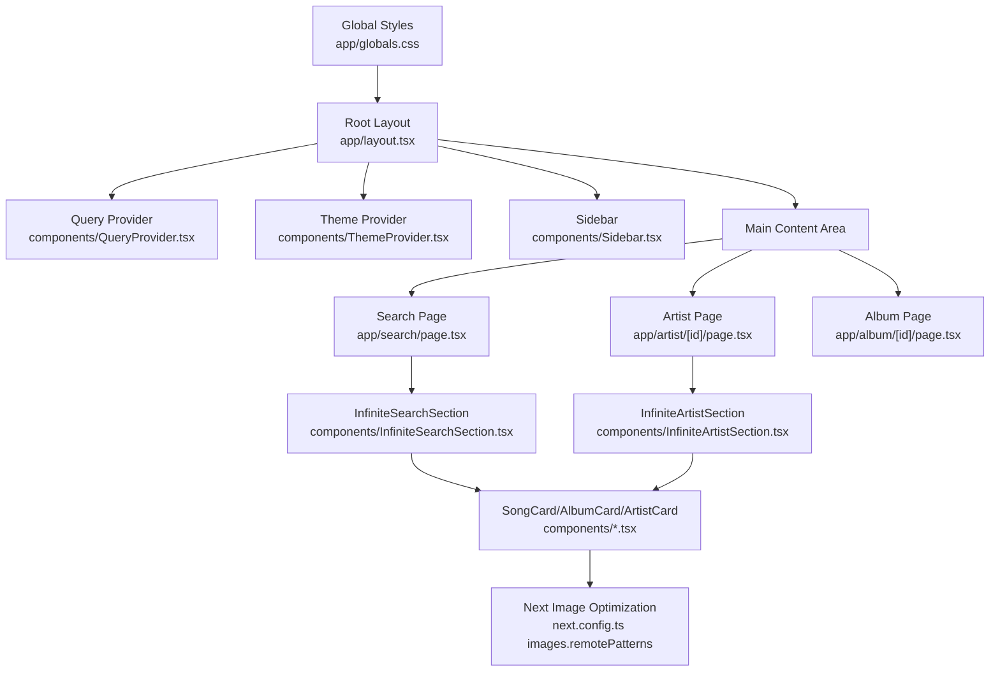
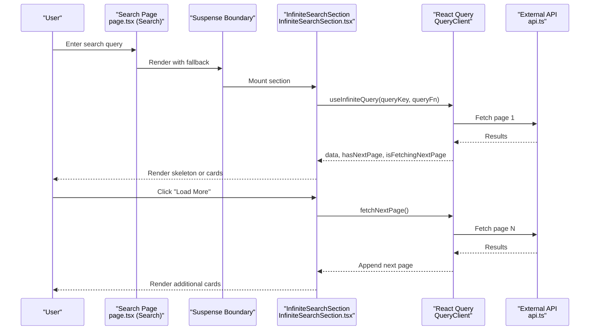
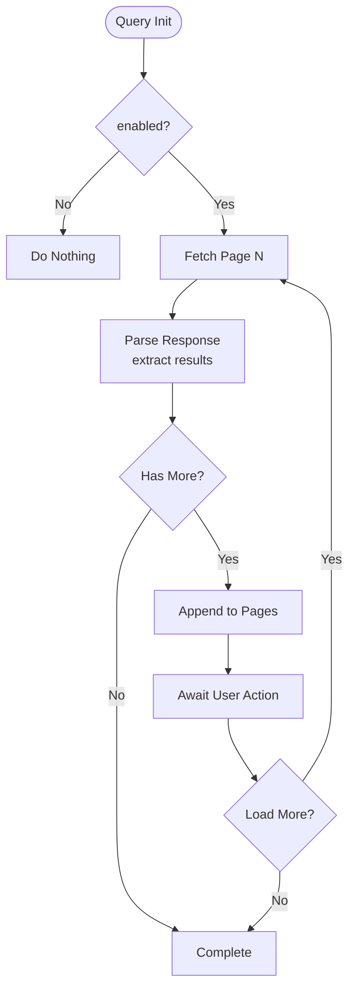
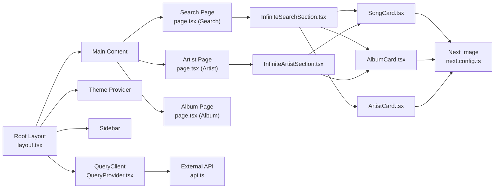

# Frontend Optimization

<cite>
**Referenced Files in This Document**
- [next.config.ts](file://next.config.ts)
- [layout.tsx](file://app/layout.tsx)
- [QueryProvider.tsx](file://components/QueryProvider.tsx)
- [SkeletonLoader.tsx](file://components/SkeletonLoader.tsx)
- [InfiniteSearchSection.tsx](file://components/InfiniteSearchSection.tsx)
- [InfiniteArtistSection.tsx](file://components/InfiniteArtistSection.tsx)
- [api.ts](file://lib/api.ts)
- [use-mobile.ts](file://hooks/use-mobile.ts)
- [globals.css](file://app/globals.css)
- [AlbumCard.tsx](file://components/AlbumCard.tsx)
- [ArtistCard.tsx](file://components/ArtistCard.tsx)
- [SongCard.tsx](file://components/SongCard.tsx)
- [usePlayerStore.ts](file://store/usePlayerStore.ts)
- [page.tsx (Search)](file://app/search/page.tsx)
- [page.tsx (Artist)](file://app/artist/[id]/page.tsx)
- [page.tsx (Album)](file://app/album/[id]/page.tsx)
- [utils.ts](file://lib/utils.ts)
- [package.json](file://package.json)
</cite>

## Table of Contents
1. [Introduction](#introduction)
2. [Project Structure](#project-structure)
3. [Core Components](#core-components)
4. [Architecture Overview](#architecture-overview)
5. [Detailed Component Analysis](#detailed-component-analysis)
6. [Dependency Analysis](#dependency-analysis)
7. [Performance Considerations](#performance-considerations)
8. [Troubleshooting Guide](#troubleshooting-guide)
9. [Conclusion](#conclusion)

## Introduction
This document provides a comprehensive guide to frontend optimization for SonicStream, focusing on Next.js code splitting and dynamic imports, lazy loading strategies, image optimization with Next.js Image, React Query caching and infinite scrolling, skeleton loaders, component memoization, render optimization, bundle size analysis, webpack configuration, static export benefits, progressive enhancement, mobile-first performance, responsive image loading, and critical CSS extraction.

## Project Structure
SonicStream is a Next.js application organized by feature-based routes under the app directory and shared components, hooks, stores, and utilities under dedicated folders. The root layout composes providers for theme, query caching, and player state, enabling global performance primitives.

**Diagram sources**
- [layout.tsx:21-48](file://app/layout.tsx#L21-L48)
- [QueryProvider.tsx:6-25](file://components/QueryProvider.tsx#L6-L25)
- [page.tsx (Search):122-129](file://app/search/page.tsx#L122-L129)
- [page.tsx (Artist):22-269](file://app/artist/[id]/page.tsx#L22-L269)
- [page.tsx (Album):17-132](file://app/album/[id]/page.tsx#L17-L132)
- [InfiniteSearchSection.tsx:23-89](file://components/InfiniteSearchSection.tsx#L23-L89)
- [InfiniteArtistSection.tsx:21-127](file://components/InfiniteArtistSection.tsx#L21-L127)
- [AlbumCard.tsx:14-47](file://components/AlbumCard.tsx#L14-L47)
- [ArtistCard.tsx:14-51](file://components/ArtistCard.tsx#L14-L51)
- [SongCard.tsx:22-140](file://components/SongCard.tsx#L22-L140)
- [next.config.ts:12-51](file://next.config.ts#L12-L51)
- [globals.css:1-192](file://app/globals.css#L1-L192)

**Section sources**
- [layout.tsx:21-48](file://app/layout.tsx#L21-L48)
- [globals.css:1-192](file://app/globals.css#L1-L192)

## Core Components
- Global providers and layout orchestrate theme, query caching, and persistent UI elements.
- React Query provider configures default caching behavior and refetch policies.
- Skeleton loader provides perceived performance during data fetching.
- Infinite scroll components implement pagination and loading states.
- Next.js Image is configured with remote patterns for CDN-hosted assets.
- Utility functions consolidate Tailwind class merging.

**Section sources**
- [QueryProvider.tsx:6-25](file://components/QueryProvider.tsx#L6-L25)
- [SkeletonLoader.tsx:11-29](file://components/SkeletonLoader.tsx#L11-L29)
- [InfiniteSearchSection.tsx:23-89](file://components/InfiniteSearchSection.tsx#L23-L89)
- [InfiniteArtistSection.tsx:21-127](file://components/InfiniteArtistSection.tsx#L21-L127)
- [next.config.ts:12-51](file://next.config.ts#L12-L51)
- [utils.ts:4-6](file://lib/utils.ts#L4-L6)

## Architecture Overview
The application leverages Next.js App Router with server/client boundaries, React Query for caching and pagination, and Next.js Image for optimized asset delivery. Providers wrap the app to share state and caching globally.

**Diagram sources**
- [page.tsx (Search):122-129](file://app/search/page.tsx#L122-L129)
- [InfiniteSearchSection.tsx:23-89](file://components/InfiniteSearchSection.tsx#L23-L89)
- [api.ts:39-43](file://lib/api.ts#L39-L43)
- [QueryProvider.tsx:6-25](file://components/QueryProvider.tsx#L6-L25)

## Detailed Component Analysis

### Next.js Code Splitting and Dynamic Imports
- Route segments under app are automatically code-split by Next.js App Router.
- The Search page uses Suspense around its content to progressively reveal UI while data loads.
- Artist and Album pages fetch data client-side and render skeletons until ready.

Optimization opportunities:
- Consider dynamic imports for heavy modals or feature-specific components to further reduce initial bundle size.
- Lazy-load third-party animations or effects only when needed.

**Section sources**
- [page.tsx (Search):122-129](file://app/search/page.tsx#L122-L129)
- [page.tsx (Artist):22-269](file://app/artist/[id]/page.tsx#L22-L269)
- [page.tsx (Album):17-132](file://app/album/[id]/page.tsx#L17-L132)

### Lazy Loading Strategies for Components and Pages
- Skeleton loaders are rendered during initial load and while fetching subsequent pages.
- Next.js Image handles lazy loading by default; combined with responsive sizing attributes improves performance.
- Infinite scroll components render placeholders while new pages are being fetched.

Recommendations:
- Use IntersectionObserver-based triggers for “Load More” to avoid rendering unnecessary buttons.
- Debounce search inputs to minimize network requests and re-renders.

**Section sources**
- [SkeletonLoader.tsx:11-29](file://components/SkeletonLoader.tsx#L11-L29)
- [InfiniteSearchSection.tsx:53-86](file://components/InfiniteSearchSection.tsx#L53-L86)
- [InfiniteArtistSection.tsx:102-124](file://components/InfiniteArtistSection.tsx#L102-L124)

### Image Optimization with Next.js Image and Remote Patterns
- Remote patterns allow loading images from external CDNs (e.g., Saavn, Cloudinary) without warnings.
- Components consistently pass high-quality image URLs derived from normalized data.
- Error handling ensures graceful fallbacks when remote images fail.

Best practices:
- Prefer Next.js Image with fill and aspect ratio containers for consistent layout shift prevention.
- Use appropriate sizes and quality settings to balance fidelity and bandwidth.

**Section sources**
- [next.config.ts:12-51](file://next.config.ts#L12-L51)
- [api.ts:73-83](file://lib/api.ts#L73-L83)
- [AlbumCard.tsx:23-29](file://components/AlbumCard.tsx#L23-L29)
- [ArtistCard.tsx:27-41](file://components/ArtistCard.tsx#L27-L41)
- [SongCard.tsx:74-80](file://components/SongCard.tsx#L74-L80)

### React Query Caching Strategies and Infinite Scrolling
- Default cache time reduces redundant network calls; refetch on window focus disabled to save bandwidth.
- Infinite queries manage pagination with getNextPageParam and initialPageParam.
- Skeleton loaders indicate ongoing fetches for both initial and subsequent pages.

Implementation highlights:
- Query keys are scoped per route/type to avoid cache collisions.
- Data normalization ensures consistent shapes across heterogeneous APIs.

**Diagram sources**
- [InfiniteSearchSection.tsx:31-44](file://components/InfiniteSearchSection.tsx#L31-L44)
- [InfiniteArtistSection.tsx:56-70](file://components/InfiniteArtistSection.tsx#L56-L70)

**Section sources**
- [QueryProvider.tsx:6-25](file://components/QueryProvider.tsx#L6-L25)
- [InfiniteSearchSection.tsx:23-89](file://components/InfiniteSearchSection.tsx#L23-L89)
- [InfiniteArtistSection.tsx:21-127](file://components/InfiniteArtistSection.tsx#L21-L127)
- [api.ts:39-43](file://lib/api.ts#L39-L43)

### Skeleton Loaders for Perceived Performance
- Skeleton components render shimmering placeholders with CSS animations.
- Used during initial load and while fetching additional pages.

Enhancement ideas:
- Animate skeleton heights/widths to match target content.
- Reduce skeleton count for smaller screens to improve perceived responsiveness.

**Section sources**
- [SkeletonLoader.tsx:11-29](file://components/SkeletonLoader.tsx#L11-L29)
- [globals.css:161-170](file://app/globals.css#L161-L170)

### Component Memoization and Render Optimization
- InfiniteArtistSection uses useMemo to deduplicate and flatten results, reducing re-renders.
- normalizeSong is applied before rendering to stabilize props.
- usePlayerStore persists frequently accessed state to minimize prop drilling.

Recommendations:
- Wrap frequently rendered lists with React.memo where appropriate.
- Extract pure UI helpers to separate modules to aid change detection.

**Section sources**
- [InfiniteArtistSection.tsx:72-84](file://components/InfiniteArtistSection.tsx#L72-L84)
- [api.ts:92-152](file://lib/api.ts#L92-L152)
- [usePlayerStore.ts:43-127](file://store/usePlayerStore.ts#L43-L127)

### Bundle Size Analysis
- Dependencies include Next.js, React Query, motion, Tailwind, and UI icons.
- Transpile motion to optimize compatibility and tree-shake unused parts.
- Consider analyzing the production bundle to identify large dependencies and optimize imports.

Actions:
- Run Next.js bundle analyzer to inspect vendor chunks.
- Prefer tree-shaken imports for large libraries.

**Section sources**
- [next.config.ts:54-63](file://next.config.ts#L54-L63)
- [package.json:12-32](file://package.json#L12-L32)

### Webpack Configuration Optimizations
- Watch options can be tuned in development to reduce flicker when editing agents.
- Standalone output simplifies deployment and cold-start performance.

Recommendations:
- Enable gzip/brotli compression at the server level.
- Consider dynamic imports for non-critical routes to reduce initial payload.

**Section sources**
- [next.config.ts:54-63](file://next.config.ts#L54-L63)
- [next.config.ts](file://next.config.ts#L52)

### Static Export Benefits and Progressive Enhancement
- The app’s client-side routing and Suspense boundaries enable progressive enhancement.
- Static export is not configured; however, the architecture supports it by avoiding server-only features.

Recommendations:
- Evaluate static export for marketing pages or public content.
- Keep server actions minimal and guarded behind authentication.

**Section sources**
- [layout.tsx:21-48](file://app/layout.tsx#L21-L48)
- [page.tsx (Search):122-129](file://app/search/page.tsx#L122-L129)

### Mobile-First Performance and Responsive Image Loading
- useIsMobile hook provides responsive behavior for UI adjustments.
- Next.js Image scales images responsively; ensure aspect ratios are preserved to avoid layout shifts.
- Skeleton loaders adapt to grid layouts across breakpoints.

Recommendations:
- Use device pixel ratio hints and adaptive sizes for images.
- Minimize CLS by setting aspect-ratio on image containers.

**Section sources**
- [use-mobile.ts:5-19](file://hooks/use-mobile.ts#L5-L19)
- [globals.css:1-192](file://app/globals.css#L1-L192)

### Critical CSS Extraction
- Global styles are imported at the root layout; Tailwind generates utility classes on demand.
- Consider extracting critical CSS for above-the-fold content to reduce TTFB.

Recommendations:
- Inline critical CSS for the hero sections of Artist and Album pages.
- Defer non-critical CSS to reduce render-blocking.

**Section sources**
- [layout.tsx:1-20](file://app/layout.tsx#L1-L20)
- [globals.css:1-192](file://app/globals.css#L1-L192)

## Dependency Analysis
The application’s runtime relies on Next.js, React Query, and UI libraries. Providers and stores are wired at the root layout to share state and caching across pages.

**Diagram sources**
- [layout.tsx:21-48](file://app/layout.tsx#L21-L48)
- [QueryProvider.tsx:6-25](file://components/QueryProvider.tsx#L6-L25)
- [page.tsx (Search):122-129](file://app/search/page.tsx#L122-L129)
- [page.tsx (Artist):22-269](file://app/artist/[id]/page.tsx#L22-L269)
- [page.tsx (Album):17-132](file://app/album/[id]/page.tsx#L17-L132)
- [InfiniteSearchSection.tsx:23-89](file://components/InfiniteSearchSection.tsx#L23-L89)
- [InfiniteArtistSection.tsx:21-127](file://components/InfiniteArtistSection.tsx#L21-L127)
- [SongCard.tsx:22-140](file://components/SongCard.tsx#L22-L140)
- [AlbumCard.tsx:14-47](file://components/AlbumCard.tsx#L14-L47)
- [ArtistCard.tsx:14-51](file://components/ArtistCard.tsx#L14-L51)
- [api.ts:39-43](file://lib/api.ts#L39-L43)
- [next.config.ts:12-51](file://next.config.ts#L12-L51)

**Section sources**
- [layout.tsx:21-48](file://app/layout.tsx#L21-L48)
- [QueryProvider.tsx:6-25](file://components/QueryProvider.tsx#L6-L25)
- [api.ts:39-43](file://lib/api.ts#L39-L43)

## Performance Considerations
- Network: Use React Query’s staleTime and retries judiciously to balance freshness and bandwidth.
- Rendering: Memoize derived arrays and deduplicate items in infinite lists.
- Images: Prefer Next.js Image with responsive sizes and aspect ratios; leverage remote patterns for CDNs.
- Bundle: Analyze and split non-critical routes; prefer tree-shaken imports.
- Hydration: Suppress hydration warnings only when necessary; ensure consistent SSR-to-CSR transitions.

## Troubleshooting Guide
- Images not loading: Verify remote patterns in next.config.ts and fallback logic in components.
- Infinite scroll not advancing: Confirm getNextPageParam logic and that PAGE_SIZE aligns with backend pagination.
- Skeleton not hiding: Ensure query states (isLoading/isFetchingNextPage) are respected and that data is normalized before rendering.
- Mobile layout shifts: Set aspect-ratio on image containers and avoid changing dimensions after mount.

**Section sources**
- [next.config.ts:12-51](file://next.config.ts#L12-L51)
- [InfiniteSearchSection.tsx:38-44](file://components/InfiniteSearchSection.tsx#L38-L44)
- [InfiniteArtistSection.tsx:63-70](file://components/InfiniteArtistSection.tsx#L63-L70)
- [globals.css:161-170](file://app/globals.css#L161-L170)

## Conclusion
SonicStream employs modern Next.js patterns for performance: code splitting via App Router, Suspense-based lazy loading, React Query caching with infinite pagination, and Next.js Image optimization. By refining memoization, analyzing bundles, and applying critical CSS strategies, the platform can further improve perceived and actual performance across devices and networks.