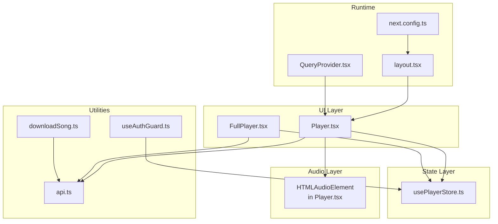
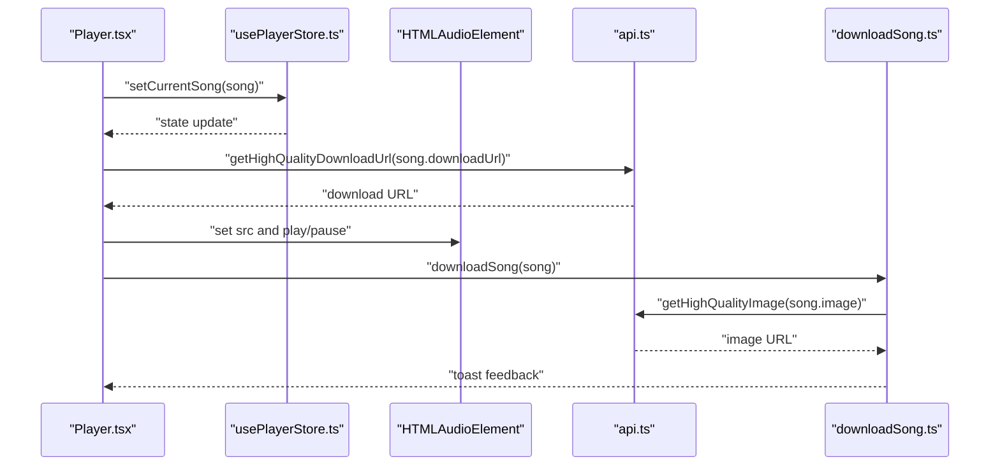
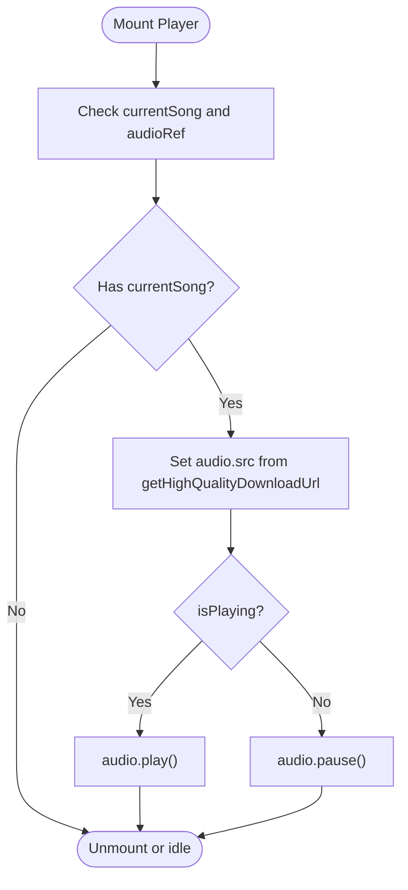
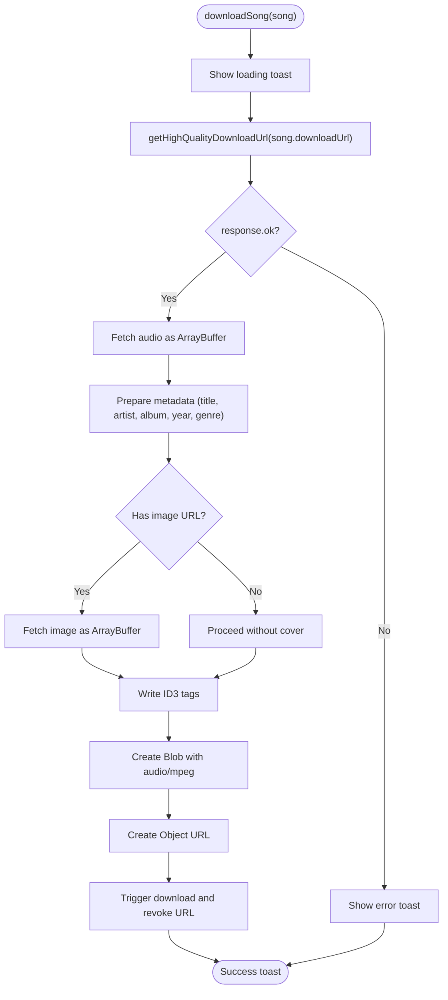
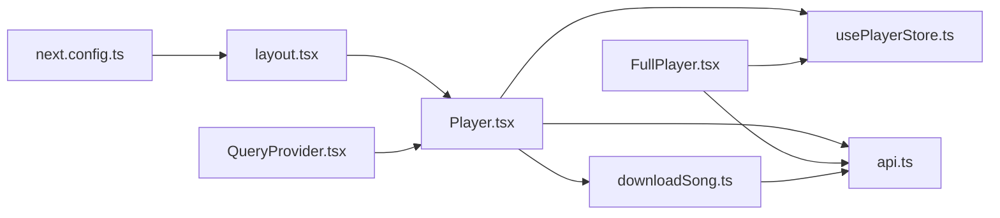

# Memory and Performance Monitoring

<cite>
**Referenced Files in This Document**
- [usePlayerStore.ts](file://store/usePlayerStore.ts)
- [Player.tsx](file://components/Player.tsx)
- [FullPlayer.tsx](file://components/FullPlayer.tsx)
- [downloadSong.ts](file://lib/downloadSong.ts)
- [api.ts](file://lib/api.ts)
- [QueryProvider.tsx](file://components/QueryProvider.tsx)
- [layout.tsx](file://app/layout.tsx)
- [route.ts](file://app/api/queue/route.ts)
- [useAuthGuard.ts](file://hooks/useAuthGuard.ts)
- [package.json](file://package.json)
- [next.config.ts](file://next.config.ts)
</cite>

## Table of Contents
1. [Introduction](#introduction)
2. [Project Structure](#project-structure)
3. [Core Components](#core-components)
4. [Architecture Overview](#architecture-overview)
5. [Detailed Component Analysis](#detailed-component-analysis)
6. [Dependency Analysis](#dependency-analysis)
7. [Performance Considerations](#performance-considerations)
8. [Troubleshooting Guide](#troubleshooting-guide)
9. [Conclusion](#conclusion)
10. [Appendices](#appendices)

## Introduction
This document provides comprehensive guidance for memory and performance monitoring in SonicStream. It focuses on optimizing state management with Zustand, preventing memory leaks, managing audio resources efficiently, and maintaining long-term performance. It also covers profiling tools, metrics tracking, and continuous monitoring strategies tailored to the current codebase.

## Project Structure
SonicStream is a Next.js application with a clear separation of concerns:
- Global state is centralized in a Zustand store for player and UI state.
- Audio playback is handled by a dedicated Player component backed by the HTMLAudioElement.
- UI components (Player and FullPlayer) subscribe to the store and orchestrate playback controls.
- Utilities encapsulate API interactions, image and download URL resolution, and ID3 tagging for downloads.
- React Query is configured via a provider with conservative defaults to reduce unnecessary refetches.
- A persistent queue API supports server-side queue management.

**Diagram sources**
- [Player.tsx:19-251](file://components/Player.tsx#L19-L251)
- [FullPlayer.tsx:34-243](file://components/FullPlayer.tsx#L34-L243)
- [usePlayerStore.ts:43-127](file://store/usePlayerStore.ts#L43-L127)
- [api.ts:39-90](file://lib/api.ts#L39-L90)
- [downloadSong.ts:21-102](file://lib/downloadSong.ts#L21-L102)
- [useAuthGuard.ts:12-28](file://hooks/useAuthGuard.ts#L12-L28)
- [QueryProvider.tsx:6-25](file://components/QueryProvider.tsx#L6-L25)
- [layout.tsx:44-71](file://app/layout.tsx#L44-L71)
- [next.config.ts:1-67](file://next.config.ts#L1-L67)

**Section sources**
- [Player.tsx:19-251](file://components/Player.tsx#L19-L251)
- [FullPlayer.tsx:34-243](file://components/FullPlayer.tsx#L34-L243)
- [usePlayerStore.ts:43-127](file://store/usePlayerStore.ts#L43-L127)
- [api.ts:39-90](file://lib/api.ts#L39-L90)
- [downloadSong.ts:21-102](file://lib/downloadSong.ts#L21-L102)
- [useAuthGuard.ts:12-28](file://hooks/useAuthGuard.ts#L12-L28)
- [QueryProvider.tsx:6-25](file://components/QueryProvider.tsx#L6-L25)
- [layout.tsx:44-71](file://app/layout.tsx#L44-L71)
- [next.config.ts:1-67](file://next.config.ts#L1-L67)

## Core Components
- Zustand store: Centralizes player state, queue, shuffle/repeat modes, favorites, and recently played history. It persists a subset of state to storage to minimize payload and improve startup performance.
- Player component: Manages audio playback lifecycle, keyboard shortcuts, seek, volume, and queue panel. It binds to the HTMLAudioElement and reacts to store changes.
- FullPlayer component: Provides a rich, animated full-screen player with related suggestions and queue integration.
- Utilities: Normalize song data, resolve high-quality URLs, and tag downloaded audio with ID3 metadata.
- QueryProvider: Configures React Query with conservative defaults to avoid excessive network activity.
- Queue API: Server-side persistence for queue items with add, clear, and delete operations.

**Section sources**
- [usePlayerStore.ts:12-41](file://store/usePlayerStore.ts#L12-L41)
- [Player.tsx:19-251](file://components/Player.tsx#L19-L251)
- [FullPlayer.tsx:34-243](file://components/FullPlayer.tsx#L34-L243)
- [api.ts:92-152](file://lib/api.ts#L92-L152)
- [QueryProvider.tsx:6-25](file://components/QueryProvider.tsx#L6-L25)
- [route.ts:1-85](file://app/api/queue/route.ts#L1-L85)

## Architecture Overview
The runtime architecture ties UI, state, audio, and utilities together. The Player component subscribes to the Zustand store and controls the HTMLAudioElement. UI animations are handled by Motion. Utilities provide normalized data and high-quality assets. React Query is scoped to the app shell to avoid redundant requests.

**Diagram sources**
- [Player.tsx:33-61](file://components/Player.tsx#L33-L61)
- [usePlayerStore.ts:57-60](file://store/usePlayerStore.ts#L57-L60)
- [api.ts:79-83](file://lib/api.ts#L79-L83)
- [downloadSong.ts:21-102](file://lib/downloadSong.ts#L21-L102)

## Detailed Component Analysis

### Zustand Store: State Management and Persistence
- State shape: Includes currentSong, queue, playback flags, repeat/shuffle, favorites, recentlyPlayed, user, and queue panel visibility.
- Actions: Mutators for playback control, queue manipulation, favorites toggling, and recent history management.
- Persistence: Uses a partializer to persist only volume, favorites, recentlyPlayed, and user, reducing storage footprint and avoiding unnecessary rehydration.

Optimization opportunities:
- Limit queue growth: Enforce a maximum queue length to cap memory usage.
- Normalize large arrays: Consider deduplicating queue entries by ID before insertion.
- Debounce frequent updates: Batch store updates for rapid UI interactions (e.g., seek slider).

Memory leak prevention:
- Avoid storing large transient objects in the store; keep only identifiers and minimal metadata.
- Ensure subscriptions are not leaked by unmounting listeners in components that depend on the store.

**Section sources**
- [usePlayerStore.ts:12-41](file://store/usePlayerStore.ts#L12-L41)
- [usePlayerStore.ts:43-127](file://store/usePlayerStore.ts#L43-L127)
- [usePlayerStore.ts:117-126](file://store/usePlayerStore.ts#L117-L126)

### Player Component: Audio Lifecycle and UI Control
Responsibilities:
- Initializes audio source when currentSong changes.
- Synchronizes play/pause state with the audio element.
- Updates volume and mute state.
- Handles keyboard shortcuts for playback control.
- Emits events for seeking, ended, and metadata loaded.

Performance considerations:
- Avoid redundant audio initialization by checking currentSong and audioRef before setting src.
- Unmute before play to prevent silent playback issues.
- Clean up event listeners on unmount to prevent leaks.

**Diagram sources**
- [Player.tsx:33-49](file://components/Player.tsx#L33-L49)

**Section sources**
- [Player.tsx:19-251](file://components/Player.tsx#L19-L251)

### FullPlayer Component: Rich UI and Suggestions
Responsibilities:
- Renders a full-screen player with animated transitions.
- Loads related suggestions via React Query and integrates them into the queue.
- Supports like, download, and add-to-playlist actions gated by authentication.

Performance considerations:
- Use memoization for derived values (e.g., suggestions) to avoid unnecessary renders.
- Defer heavy computations until currentSong is truthy.
- Keep suggestion lists bounded to limit DOM and state growth.

**Section sources**
- [FullPlayer.tsx:34-243](file://components/FullPlayer.tsx#L34-L243)
- [QueryProvider.tsx:6-25](file://components/QueryProvider.tsx#L6-L25)

### Audio Download and ID3 Tagging
Responsibilities:
- Fetches audio and optional album art, writes ID3 metadata, and triggers a browser download.

Memory considerations:
- Ensure ArrayBuffer and Blob lifetimes are managed properly; revoke object URLs after download completes.
- Validate response.ok before converting to ArrayBuffer to avoid large allocations on errors.
- Consider chunked processing for very large downloads to avoid blocking the UI thread.

**Diagram sources**
- [downloadSong.ts:21-102](file://lib/downloadSong.ts#L21-L102)
- [api.ts:79-83](file://lib/api.ts#L79-L83)

**Section sources**
- [downloadSong.ts:21-102](file://lib/downloadSong.ts#L21-L102)
- [api.ts:73-83](file://lib/api.ts#L73-L83)

### Queue Management API
Responsibilities:
- Retrieve, add, clear, and delete queue items server-side.
- Maintain ordering via position field.

Performance considerations:
- Paginate queue retrieval for large lists.
- Use efficient indexing on userId and position for reads/writes.
- Batch operations for bulk updates to reduce round-trips.

**Section sources**
- [route.ts:1-85](file://app/api/queue/route.ts#L1-L85)

## Dependency Analysis
External libraries impacting performance and memory:
- Zustand: Lightweight store with middleware for persistence; ensure partializer excludes large transient data.
- React Query: Configured with a short staleTime and limited retries to reduce network overhead.
- Motion: Smooth animations; prefer reduced animation complexity on lower-end devices.
- ID3 writers: Ensure proper cleanup of buffers and object URLs after tagging.

**Diagram sources**
- [Player.tsx:19-251](file://components/Player.tsx#L19-L251)
- [FullPlayer.tsx:34-243](file://components/FullPlayer.tsx#L34-L243)
- [usePlayerStore.ts:43-127](file://store/usePlayerStore.ts#L43-L127)
- [api.ts:39-90](file://lib/api.ts#L39-L90)
- [downloadSong.ts:21-102](file://lib/downloadSong.ts#L21-L102)
- [layout.tsx:44-71](file://app/layout.tsx#L44-L71)
- [QueryProvider.tsx:6-25](file://components/QueryProvider.tsx#L6-L25)
- [next.config.ts:1-67](file://next.config.ts#L1-L67)

**Section sources**
- [package.json:12-36](file://package.json#L12-L36)
- [QueryProvider.tsx:6-25](file://components/QueryProvider.tsx#L6-L25)
- [next.config.ts:1-67](file://next.config.ts#L1-L67)

## Performance Considerations
- State management optimization
  - Persist only essential fields to storage to reduce hydration cost.
  - Limit queue size and deduplicate entries to cap memory usage.
  - Normalize frequently accessed data to avoid repeated transformations.
- Audio memory management
  - Revoke object URLs after download completion.
  - Avoid loading multiple high-quality audio files simultaneously.
  - Pause or unload audio when the player is not visible.
- Buffer optimization
  - Validate network responses before converting to ArrayBuffer.
  - Consider streaming or progressive decoding for large audio assets.
- Resource cleanup
  - Remove event listeners on component unmount.
  - Cancel ongoing downloads and revoke object URLs on route changes.
- Browser devtools usage
  - Use Performance panel to record interactions and inspect long tasks.
  - Use Memory panel to capture heap snapshots and detect retained objects.
  - Use Network panel to monitor bandwidth and latency for audio and image assets.
- Metrics tracking
  - Track First Contentful Paint (FCP), Largest Contentful Paint (LCP), and Cumulative Layout Shift (CLS).
  - Monitor audio start-up latency and decode time.
  - Record queue operations latency and download throughput.
- Profiling tools
  - Use Lighthouse for audits and Field Data.
  - Use WebPageTest for multi-run comparisons.
  - Use Chrome DevTools Performance and Memory for targeted investigations.
- Long-term maintenance
  - Establish performance budgets per screen and feature.
  - Run periodic regression tests on representative devices.
  - Monitor Core Web Vitals and backend queue API latency.

[No sources needed since this section provides general guidance]

## Troubleshooting Guide
Common issues and remedies:
- Audio does not play
  - Verify isMuted flag and volume level before play.
  - Ensure audio.src is set only when currentSong changes.
- Memory growth over time
  - Confirm queue length limits and deduplication logic.
  - Check that object URLs are revoked after downloads.
- Excessive network usage
  - Review React Query staleTime and retry settings.
  - Avoid unnecessary re-fetches by enabling caching and disabling refetchOnWindowFocus where appropriate.
- Authentication gating
  - Use the auth guard hook to open the modal when required actions need user context.

**Section sources**
- [Player.tsx:33-49](file://components/Player.tsx#L33-L49)
- [usePlayerStore.ts:110-113](file://store/usePlayerStore.ts#L110-L113)
- [downloadSong.ts:84-96](file://lib/downloadSong.ts#L84-L96)
- [QueryProvider.tsx:9-17](file://components/QueryProvider.tsx#L9-L17)
- [useAuthGuard.ts:12-28](file://hooks/useAuthGuard.ts#L12-L28)

## Conclusion
By applying targeted Zustand optimizations, disciplined audio resource management, and robust cleanup practices, SonicStream can maintain low memory usage and responsive performance. Pairing these changes with systematic profiling, metrics tracking, and continuous monitoring ensures long-term stability and user satisfaction.

[No sources needed since this section summarizes without analyzing specific files]

## Appendices

### Performance Budgeting Checklist
- Maximum queue size: Define and enforce a cap.
- Store persistence: Keep persisted state minimal.
- Audio buffering: Avoid simultaneous high-bitrate loads.
- Cleanup routines: Revoke URLs, remove listeners, cancel downloads.
- Metrics baseline: Establish targets for FCP, LCP, CLS, and audio latency.

[No sources needed since this section provides general guidance]