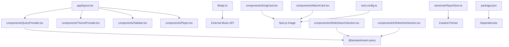
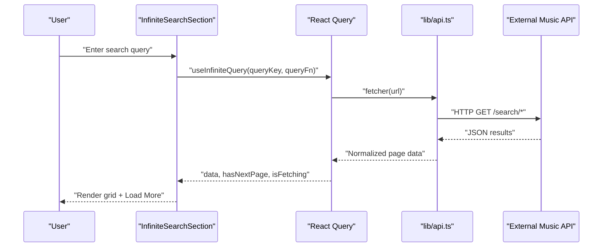
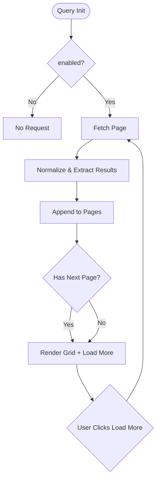
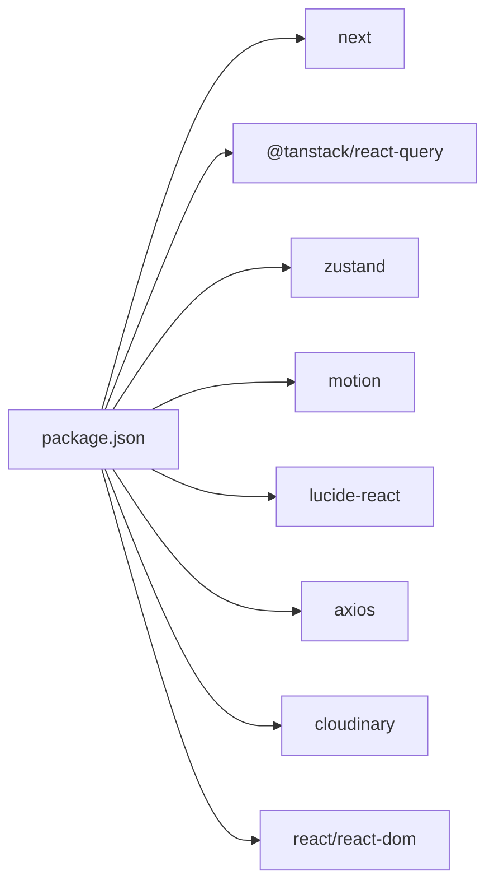

# Performance Optimization

<cite>
**Referenced Files in This Document**
- [next.config.ts](file://next.config.ts)
- [package.json](file://package.json)
- [app/layout.tsx](file://app/layout.tsx)
- [components/QueryProvider.tsx](file://components/QueryProvider.tsx)
- [lib/api.ts](file://lib/api.ts)
- [components/InfiniteSearchSection.tsx](file://components/InfiniteSearchSection.tsx)
- [components/InfiniteArtistSection.tsx](file://components/InfiniteArtistSection.tsx)
- [components/SongCard.tsx](file://components/SongCard.tsx)
- [components/AlbumCard.tsx](file://components/AlbumCard.tsx)
- [components/Player.tsx](file://components/Player.tsx)
- [store/usePlayerStore.ts](file://store/usePlayerStore.ts)
- [components/ThemeProvider.tsx](file://components/ThemeProvider.tsx)
- [hooks/use-mobile.ts](file://hooks/use-mobile.ts)
- [lib/utils.ts](file://lib/utils.ts)
</cite>

## Table of Contents
1. [Introduction](#introduction)
2. [Project Structure](#project-structure)
3. [Core Components](#core-components)
4. [Architecture Overview](#architecture-overview)
5. [Detailed Component Analysis](#detailed-component-analysis)
6. [Dependency Analysis](#dependency-analysis)
7. [Performance Considerations](#performance-considerations)
8. [Troubleshooting Guide](#troubleshooting-guide)
9. [Conclusion](#conclusion)
10. [Appendices](#appendices)

## Introduction
This document provides a comprehensive performance optimization guide for SonicStream. It focuses on code splitting and lazy loading strategies, image optimization with Next.js Image, bundle size management, data fetching optimization using React Query caching, infinite scrolling and pagination, memory management, component rendering optimization, browser performance best practices, profiling and monitoring, network optimization, API caching, mobile responsiveness, and measurement tools. The guidance is grounded in the actual codebase and highlights areas for improvement and maintenance.

## Project Structure
SonicStream is a Next.js application with a clear separation of concerns:
- Application shell and providers are initialized in the root layout.
- Data fetching is centralized via a dedicated API module and React Query provider.
- UI components leverage Next.js Image for optimized media delivery.
- Player state is managed with a persistent Zustand store.
- Utility helpers consolidate Tailwind class merging.

**Diagram sources**
- [app/layout.tsx:21-48](file://app/layout.tsx#L21-L48)
- [components/QueryProvider.tsx:6-25](file://components/QueryProvider.tsx#L6-L25)
- [lib/api.ts:37-43](file://lib/api.ts#L37-L43)
- [components/SongCard.tsx:74-80](file://components/SongCard.tsx#L74-L80)
- [components/AlbumCard.tsx:23-29](file://components/AlbumCard.tsx#L23-L29)
- [components/InfiniteSearchSection.tsx:31-44](file://components/InfiniteSearchSection.tsx#L31-L44)
- [components/InfiniteArtistSection.tsx:50-70](file://components/InfiniteArtistSection.tsx#L50-L70)
- [store/usePlayerStore.ts:43-127](file://store/usePlayerStore.ts#L43-L127)
- [next.config.ts:12-51](file://next.config.ts#L12-L51)
- [package.json:12-32](file://package.json#L12-L32)

**Section sources**
- [app/layout.tsx:21-48](file://app/layout.tsx#L21-L48)
- [next.config.ts:12-51](file://next.config.ts#L12-L51)
- [package.json:12-32](file://package.json#L12-L32)

## Core Components
- Next.js configuration enables image remote patterns and standalone output for efficient deployments.
- React Query provider centralizes caching and retry policies.
- API module encapsulates external service calls and normalization utilities.
- Infinite scroll components implement pagination with deduplication and loading states.
- Player component manages audio playback and state persistence.
- Theme provider persists theme selection and applies it to the document element.
- Utility functions consolidate Tailwind class merging.

**Section sources**
- [next.config.ts:12-51](file://next.config.ts#L12-L51)
- [components/QueryProvider.tsx:6-25](file://components/QueryProvider.tsx#L6-L25)
- [lib/api.ts:37-43](file://lib/api.ts#L37-L43)
- [components/InfiniteSearchSection.tsx:31-44](file://components/InfiniteSearchSection.tsx#L31-L44)
- [components/InfiniteArtistSection.tsx:50-70](file://components/InfiniteArtistSection.tsx#L50-L70)
- [components/Player.tsx:19-84](file://components/Player.tsx#L19-L84)
- [components/ThemeProvider.tsx:21-35](file://components/ThemeProvider.tsx#L21-L35)
- [lib/utils.ts:4-6](file://lib/utils.ts#L4-L6)

## Architecture Overview
The runtime architecture integrates UI components, data fetching, and state management:
- Providers wrap the app to supply theme, query caching, and routing context.
- Components consume normalized data and render optimized assets.
- Player state is persisted to reduce reinitialization overhead.
- Infinite scroll components coordinate with React Query to fetch and cache pages.

**Diagram sources**
- [components/InfiniteSearchSection.tsx:23-44](file://components/InfiniteSearchSection.tsx#L23-L44)
- [lib/api.ts:39-43](file://lib/api.ts#L39-L43)

## Detailed Component Analysis

### Code Splitting and Lazy Loading Strategies
- Route-based code splitting is native in Next.js; ensure dynamic imports for heavy pages or modals.
- Modal components (e.g., playlist and auth modals) are rendered conditionally; keep them client-side to avoid server-rendering overhead.
- Consider dynamic imports for feature-heavy routes (e.g., admin pages) to defer bundle cost until navigation.

Recommendations:
- Wrap large modals in dynamic imports with lightweight loading placeholders.
- Use React.lazy and Suspense for optional sections to reduce initial JS payload.

**Section sources**
- [components/SongCard.tsx:135-136](file://components/SongCard.tsx#L135-L136)
- [components/Player.tsx](file://components/Player.tsx#L247)

### Image Optimization with Next.js Image
- Next.js Image is used across SongCard and AlbumCard for responsive, optimized images.
- Remote image patterns are configured to allow external CDN domains.
- Utility functions select the highest quality image URL for display.

Optimization tips:
- Prefer Next.js Image with fill and aspect control to avoid layout shifts.
- Use appropriate widths/heigths to prevent oversized decoding.
- Leverage blur placeholders or low-quality image placeholders for slow networks.

**Section sources**
- [components/SongCard.tsx:74-80](file://components/SongCard.tsx#L74-L80)
- [components/AlbumCard.tsx:23-29](file://components/AlbumCard.tsx#L23-L29)
- [lib/api.ts:73-83](file://lib/api.ts#L73-L83)
- [next.config.ts:12-51](file://next.config.ts#L12-L51)

### Bundle Size Management
- Dependencies include React 19, Next.js 15, React Query, Zustand, and motion. Keep an eye on tree-shaking and avoid importing entire libraries.
- Standalone output reduces deployment artifacts but does not shrink bundle size automatically.

Actions:
- Audit imports and remove unused dependencies.
- Prefer scoped imports from libraries.
- Monitor bundle composition with Next.js telemetry or webpack-bundle-analyzer.

**Section sources**
- [package.json:12-32](file://package.json#L12-L32)
- [next.config.ts:52-53](file://next.config.ts#L52-L53)

### Data Fetching Optimization with React Query Caching
- Global defaults configure staleTime, refetch behavior, and retries.
- Infinite query components manage pagination and loading states efficiently.

Best practices:
- Tune staleTime per endpoint based on data volatility.
- Disable refetchOnWindowFocus for non-critical lists to save bandwidth.
- Use enabled flags to avoid unnecessary requests.

**Section sources**
- [components/QueryProvider.tsx:9-17](file://components/QueryProvider.tsx#L9-L17)
- [components/InfiniteSearchSection.tsx:31-44](file://components/InfiniteSearchSection.tsx#L31-L44)
- [components/InfiniteArtistSection.tsx:56-70](file://components/InfiniteArtistSection.tsx#L56-L70)

### Infinite Scrolling Implementation and Pagination
- InfiniteSearchSection and InfiniteArtistSection implement getNextPageParam and extractResults with deduplication.
- Results are flattened and normalized before rendering.

Performance notes:
- Deduplicate by id to prevent duplicates across pages.
- Use useMemo to compute flattened and unique results.
- Provide skeleton loaders during isFetchingNextPage.

**Diagram sources**
- [components/InfiniteSearchSection.tsx:31-44](file://components/InfiniteSearchSection.tsx#L31-L44)
- [components/InfiniteArtistSection.tsx:63-70](file://components/InfiniteArtistSection.tsx#L63-L70)

**Section sources**
- [components/InfiniteSearchSection.tsx:31-44](file://components/InfiniteSearchSection.tsx#L31-L44)
- [components/InfiniteArtistSection.tsx:72-81](file://components/InfiniteArtistSection.tsx#L72-L81)

### Memory Management and Component Rendering Optimization
- Zustand store persists selected preferences and recent history to reduce re-computation and re-fetching.
- Player component updates audio source and controls efficiently; avoid unnecessary re-renders by passing stable callbacks.

Recommendations:
- Keep store slices minimal; avoid storing large derived datasets.
- Use shallow equality checks and memoization for props passed to cards.
- Debounce search inputs to reduce network churn.

**Section sources**
- [store/usePlayerStore.ts:43-127](file://store/usePlayerStore.ts#L43-L127)
- [components/Player.tsx:33-45](file://components/Player.tsx#L33-L45)

### Browser Performance Best Practices
- Theme provider toggles data attributes on the document element; persist theme to avoid layout thrashing.
- Motion components introduce animations; ensure they are not overused on low-end devices.
- Use CSS variables for theming to minimize reflows.

**Section sources**
- [components/ThemeProvider.tsx:21-35](file://components/ThemeProvider.tsx#L21-L35)
- [app/layout.tsx:23-28](file://app/layout.tsx#L23-L28)

### Profiling Techniques, Monitoring, and Bottleneck Identification
- Use React DevTools Profiler to identify expensive renders in Player and card components.
- Measure LCP/FID/CLS with web vitals in production or local builds.
- Instrument network requests to identify slow endpoints and optimize caching.

[No sources needed since this section provides general guidance]

### Network Optimization, API Response Caching, and External Service Performance
- External API base URL is centralized; consider adding request/response caching at the app level.
- Normalize inconsistent shapes to reduce downstream processing overhead.
- Implement exponential backoff and retry limits for transient failures.

**Section sources**
- [lib/api.ts:37-43](file://lib/api.ts#L37-L43)
- [lib/api.ts:92-152](file://lib/api.ts#L92-L152)

### Mobile Performance Considerations, Responsive Design, and Progressive Enhancement
- useIsMobile hook detects viewport breakpoints to tailor UI behavior.
- Player adapts controls for mobile; ensure touch targets are sufficiently sized.
- Progressive enhancement: degrade animations on lower-end devices; lazy-load non-critical assets.

**Section sources**
- [hooks/use-mobile.ts:5-18](file://hooks/use-mobile.ts#L5-L18)
- [components/Player.tsx:182-188](file://components/Player.tsx#L182-L188)

### Measurement Tools, Metrics, and Optimization Checklists
- Metrics: LCP, FID, CLS, TTFB, FCP, INP.
- Tools: Chrome DevTools, Lighthouse, WebPageTest, SpeedCurve, Sentry for errors.
- Checklist:
  - Enable image optimization and remote patterns.
  - Configure React Query defaults and tune staleTime.
  - Implement skeleton loaders and virtualization for long lists.
  - Minimize heavy animations on mobile.
  - Audit bundle size and remove unused code.
  - Cache API responses and normalize data early.

[No sources needed since this section provides general guidance]

## Dependency Analysis
The application relies on a focused set of libraries for performance-sensitive features.

**Diagram sources**
- [package.json:12-32](file://package.json#L12-L32)

**Section sources**
- [package.json:12-32](file://package.json#L12-L32)

## Performance Considerations
- Image optimization: Use Next.js Image with proper aspect ratios and remote patterns configured.
- Data fetching: Centralize and cache via React Query; tune staleness and retries.
- Rendering: Memoize derived results; avoid unnecessary re-renders; use lightweight skeletons.
- State: Persist only essential parts of the store to reduce hydration costs.
- Bundling: Monitor and trim dependencies; leverage tree-shaking.

[No sources needed since this section provides general guidance]

## Troubleshooting Guide
- Hydration mismatches: Ensure theme provider initializes on the client and sets data attributes after mount.
- Audio playback issues: Verify download URLs and handle play promise rejections gracefully.
- Infinite scroll gaps: Confirm getNextPageParam logic and deduplication strategy.
- Slow images: Validate remote patterns and fallback image handling.

**Section sources**
- [components/ThemeProvider.tsx:25-35](file://components/ThemeProvider.tsx#L25-L35)
- [components/Player.tsx:35-38](file://components/Player.tsx#L35-L38)
- [components/InfiniteSearchSection.tsx:38-42](file://components/InfiniteSearchSection.tsx#L38-L42)
- [lib/api.ts:71-77](file://lib/api.ts#L71-L77)

## Conclusion
By combining Next.js Image optimization, React Query caching, efficient infinite scrolling, targeted state persistence, and mobile-first design, SonicStream can achieve strong performance across devices. Regular profiling, metrics collection, and incremental improvements will help sustain optimal user experience.

[No sources needed since this section summarizes without analyzing specific files]

## Appendices
- Tailwind class merging utility consolidates classes efficiently.

**Section sources**
- [lib/utils.ts:4-6](file://lib/utils.ts#L4-L6)