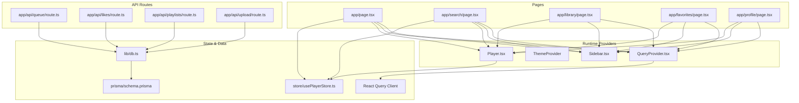
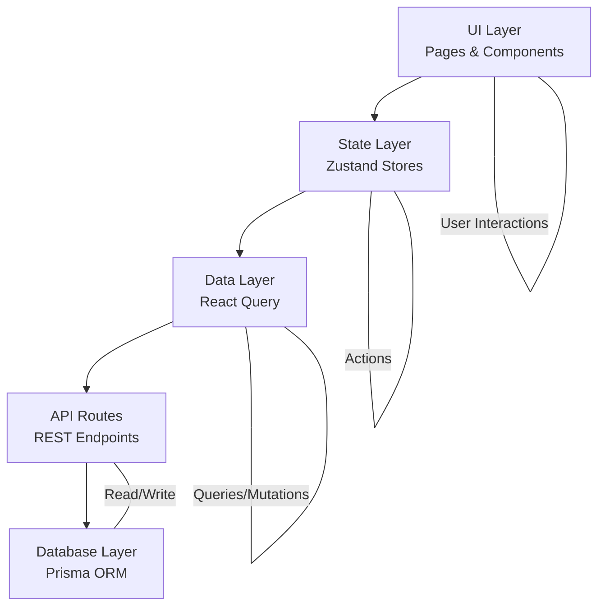
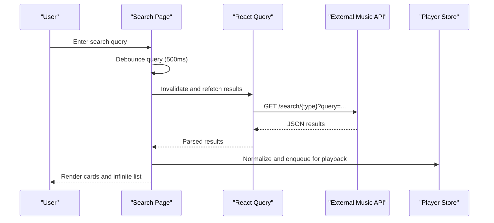
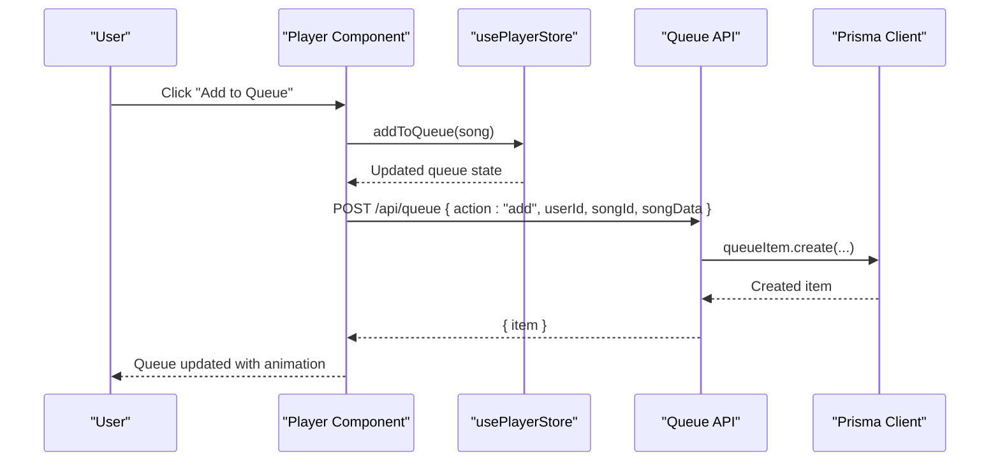
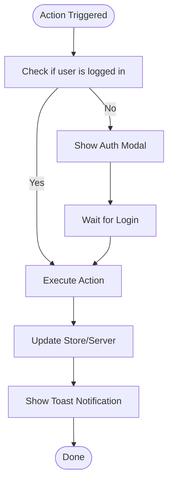
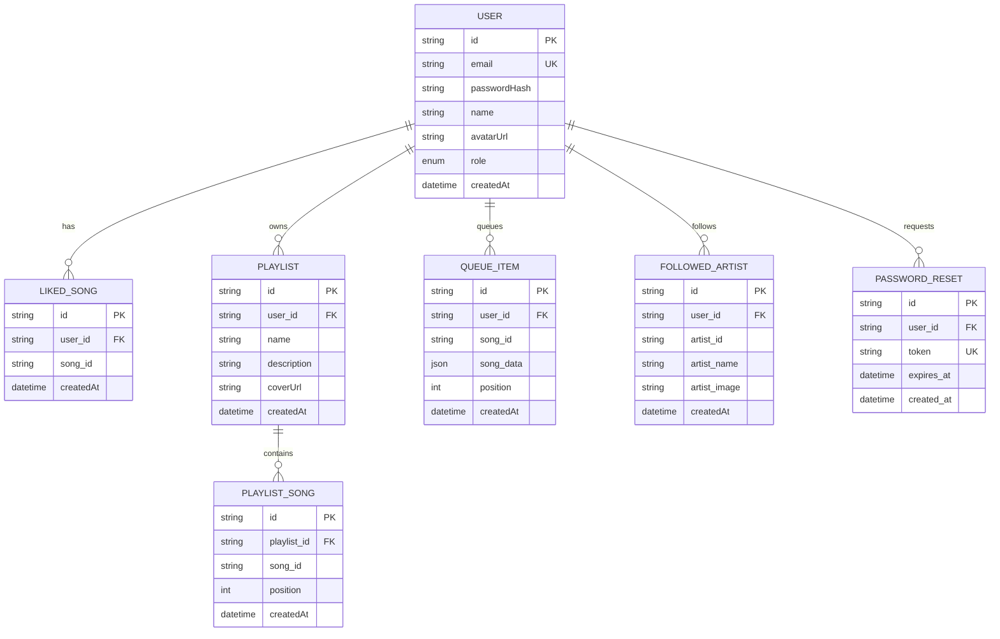
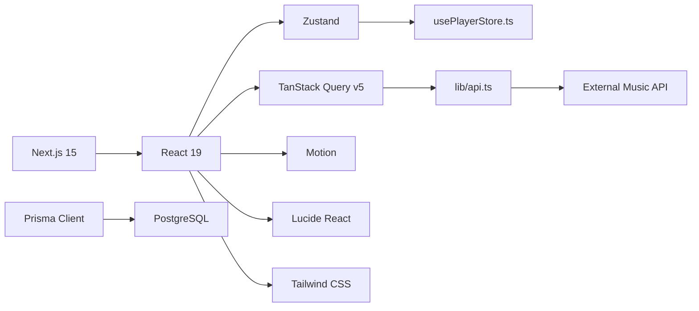

# Project Overview

<cite>
**Referenced Files in This Document**
- [README.md](file://README.md)
- [package.json](file://package.json)
- [next.config.ts](file://next.config.ts)
- [prisma/schema.prisma](file://prisma/schema.prisma)
- [lib/db.ts](file://lib/db.ts)
- [lib/api.ts](file://lib/api.ts)
- [store/usePlayerStore.ts](file://store/usePlayerStore.ts)
- [components/QueryProvider.tsx](file://components/QueryProvider.tsx)
- [hooks/useAuthGuard.ts](file://hooks/useAuthGuard.ts)
- [app/layout.tsx](file://app/layout.tsx)
- [app/page.tsx](file://app/page.tsx)
- [app/search/page.tsx](file://app/search/page.tsx)
- [components/Player.tsx](file://components/Player.tsx)
- [components/Sidebar.tsx](file://components/Sidebar.tsx)
- [app/api/queue/route.ts](file://app/api/queue/route.ts)
</cite>

## Table of Contents
1. [Introduction](#introduction)
2. [Project Structure](#project-structure)
3. [Core Components](#core-components)
4. [Architecture Overview](#architecture-overview)
5. [Detailed Component Analysis](#detailed-component-analysis)
6. [Dependency Analysis](#dependency-analysis)
7. [Performance Considerations](#performance-considerations)
8. [Troubleshooting Guide](#troubleshooting-guide)
9. [Conclusion](#conclusion)

## Introduction
SonicStream is a modern, high-performance music streaming platform designed to deliver a premium listening experience. Its purpose is to combine intuitive music discovery, a powerful audio player, social and personalization features, and robust user management into a cohesive, responsive application. The platform targets music enthusiasts who value quality audio, seamless navigation, and a visually engaging interface.

Core value proposition:
- Premium audio streaming with high-quality downloads and rich metadata
- Immersive UI with dynamic theming and smooth animations
- Intelligent player controls with queue management, shuffle, and repeat modes
- Personalized discovery through search, curated content, and recently played history
- Secure authentication and user-centric features like favorites and playlists
- Admin capabilities for managing users and application statistics

Target audience:
- Casual listeners seeking a modern music app
- Power users who enjoy fine-grained player controls and queue management
- Creators and administrators needing dashboard tools for monitoring and maintenance

Positioning:
SonicStream positions itself as a contemporary alternative in the music streaming ecosystem, emphasizing a sleek, mobile-first design, real-time data fetching, and a component-driven architecture that scales from individual users to administrative oversight.

## Project Structure
The project follows a Next.js 15 App Router-based structure with a clear separation of concerns:
- app/: Route handlers and pages implementing the UI surface
- components/: Reusable UI components and providers
- hooks/: Client-side custom hooks
- lib/: Shared utilities for APIs, database access, and helpers
- prisma/: Database schema and Prisma client generation
- store/: Centralized state management with Zustand
- next.config.ts: Build and runtime configuration

**Diagram sources**
- [app/layout.tsx:21-48](file://app/layout.tsx#L21-L48)
- [components/QueryProvider.tsx:6-25](file://components/QueryProvider.tsx#L6-L25)
- [store/usePlayerStore.ts:43-127](file://store/usePlayerStore.ts#L43-L127)
- [lib/db.ts:1-10](file://lib/db.ts#L1-L10)
- [prisma/schema.prisma:1-111](file://prisma/schema.prisma#L1-L111)
- [app/api/queue/route.ts:1-86](file://app/api/queue/route.ts#L1-L86)

**Section sources**
- [README.md:1-74](file://README.md#L1-L74)
- [package.json:12-32](file://package.json#L12-L32)
- [next.config.ts:1-67](file://next.config.ts#L1-L67)
- [prisma/schema.prisma:1-111](file://prisma/schema.prisma#L1-L111)

## Core Components
SonicStream’s core functionality emerges from several key building blocks:

- Music discovery and search
  - Real-time search with category tabs and infinite scrolling
  - Curated content sections on the home page
  - Integration with an external music API for rich metadata and media URLs

- Audio player
  - Full-featured player with playback controls, seek, volume, mute, repeat, and shuffle
  - Queue management with persistent storage and UI panel
  - Favorites and recently played lists integrated into the player state

- Social and user features
  - Authentication gating for sensitive actions (e.g., liking songs)
  - Profile and library views for personal collections
  - Admin endpoints for user and statistics management

- User management
  - Role-based access (USER, ADMIN)
  - Password reset support
  - Queue persistence per user via API

Technology stack highlights:
- Next.js 15 App Router for routing and SSR/SSG
- React 19 for component model and concurrent features
- TypeScript for type safety across the codebase
- Prisma ORM for database modeling and client generation
- Zustand for centralized, minimal state management
- TanStack Query v5 for real-time data fetching and caching

**Section sources**
- [README.md:7-31](file://README.md#L7-L31)
- [package.json:12-32](file://package.json#L12-L32)
- [lib/api.ts:37-69](file://lib/api.ts#L37-L69)
- [store/usePlayerStore.ts:12-41](file://store/usePlayerStore.ts#L12-L41)
- [hooks/useAuthGuard.ts:12-28](file://hooks/useAuthGuard.ts#L12-L28)
- [prisma/schema.prisma:11-111](file://prisma/schema.prisma#L11-L111)

## Architecture Overview
SonicStream employs a component-based design with a layered approach:
- UI layer: Pages and components encapsulate presentation and interactions
- State layer: Zustand stores manage player state and user preferences
- Data layer: TanStack Query handles caching, background refetching, and optimistic updates
- Backend/data layer: Prisma ORM connects to a PostgreSQL database, with API routes exposing CRUD operations

**Diagram sources**
- [app/layout.tsx:21-48](file://app/layout.tsx#L21-L48)
- [store/usePlayerStore.ts:43-127](file://store/usePlayerStore.ts#L43-L127)
- [components/QueryProvider.tsx:6-25](file://components/QueryProvider.tsx#L6-L25)
- [lib/db.ts:1-10](file://lib/db.ts#L1-L10)
- [prisma/schema.prisma:1-111](file://prisma/schema.prisma#L1-L111)

## Detailed Component Analysis

### Music Discovery and Search
The discovery experience centers around:
- Home page: Trending songs, popular artists, featured playlists, and quick “Recently Played” access
- Search page: Debounced query input, category browsing, and tabbed results for songs, artists, albums, and playlists
- Infinite scroll sections powered by React Query for efficient pagination and caching

**Diagram sources**
- [app/search/page.tsx:20-120](file://app/search/page.tsx#L20-L120)
- [lib/api.ts:39-69](file://lib/api.ts#L39-L69)
- [store/usePlayerStore.ts:43-127](file://store/usePlayerStore.ts#L43-L127)

**Section sources**
- [app/page.tsx:34-203](file://app/page.tsx#L34-L203)
- [app/search/page.tsx:20-120](file://app/search/page.tsx#L20-L120)
- [lib/api.ts:37-153](file://lib/api.ts#L37-L153)

### Audio Player and Queue Management
The player integrates tightly with Zustand for state and with the backend for queue persistence:
- Playback controls: play/pause, skip, seek, volume, mute, repeat, shuffle
- Queue panel: open/close, reorder, remove items
- Favorites and recently played lists
- Keyboard shortcuts for common controls
- Auth-gated actions (e.g., adding to favorites)

**Diagram sources**
- [components/Player.tsx:19-251](file://components/Player.tsx#L19-L251)
- [store/usePlayerStore.ts:43-127](file://store/usePlayerStore.ts#L43-L127)
- [app/api/queue/route.ts:24-66](file://app/api/queue/route.ts#L24-L66)
- [lib/db.ts:1-10](file://lib/db.ts#L1-L10)

**Section sources**
- [components/Player.tsx:19-251](file://components/Player.tsx#L19-L251)
- [store/usePlayerStore.ts:12-41](file://store/usePlayerStore.ts#L12-L41)
- [hooks/useAuthGuard.ts:12-28](file://hooks/useAuthGuard.ts#L12-L28)
- [app/api/queue/route.ts:1-86](file://app/api/queue/route.ts#L1-L86)

### Social Features and Authentication
- Auth-gated actions: The useAuthGuard hook ensures users are logged in before performing sensitive actions
- Favorites: Toggled via the player with toast feedback
- Profile and library views: Personalized collections and settings

**Diagram sources**
- [hooks/useAuthGuard.ts:12-28](file://hooks/useAuthGuard.ts#L12-L28)
- [components/Player.tsx:63-67](file://components/Player.tsx#L63-L67)

**Section sources**
- [hooks/useAuthGuard.ts:12-28](file://hooks/useAuthGuard.ts#L12-L28)
- [components/Player.tsx:63-67](file://components/Player.tsx#L63-L67)

### User Management and Admin Tools
- Database schema defines roles, liked songs, playlists, queue items, followed artists, and password resets
- API routes support queue operations, likes, playlists, and uploads
- Admin endpoints for user management and statistics are exposed under the admin namespace

**Diagram sources**
- [prisma/schema.prisma:16-111](file://prisma/schema.prisma#L16-L111)

**Section sources**
- [prisma/schema.prisma:11-111](file://prisma/schema.prisma#L11-L111)
- [lib/db.ts:1-10](file://lib/db.ts#L1-L10)
- [README.md:17-18](file://README.md#L17-L18)

## Dependency Analysis
SonicStream’s dependencies align with a modern React/Next.js stack:
- Framework and rendering: Next.js 15, React 19
- State and data: Zustand, TanStack Query v5
- Database and ORM: Prisma, PostgreSQL
- Styling and icons: Tailwind CSS, Lucide React
- Animations: Motion (Framer Motion)
- Utilities: Axios, clsx, tailwind-merge

**Diagram sources**
- [package.json:12-32](file://package.json#L12-L32)
- [store/usePlayerStore.ts:1-2](file://store/usePlayerStore.ts#L1-L2)
- [lib/api.ts:37-69](file://lib/api.ts#L37-L69)
- [lib/db.ts:1-10](file://lib/db.ts#L1-L10)

**Section sources**
- [package.json:12-32](file://package.json#L12-L32)
- [next.config.ts:12-50](file://next.config.ts#L12-L50)

## Performance Considerations
- Client caching: React Query’s default staleTime and retry policies balance freshness and performance
- Image optimization: Next.js image optimization and remotePatterns configured for CDN sources
- Transpilation: Motion is transpiled to improve compatibility and reduce bundle overhead
- Minimal state: Zustand keeps state local to components and persists only essential slices
- Lazy loading: Suspense boundaries around search content improve perceived performance

[No sources needed since this section provides general guidance]

## Troubleshooting Guide
Common areas to inspect:
- Layout hydration and theme: Ensure QueryProvider and ThemeProvider wrap the root layout
- Query client defaults: Verify staleTime and refetch policies match UX expectations
- API base URL and normalization: Confirm external API endpoints and data normalization logic
- Auth gating: Validate useAuthGuard behavior for protected actions
- Queue persistence: Check API route parameters and Prisma schema for queue items

**Section sources**
- [app/layout.tsx:21-48](file://app/layout.tsx#L21-L48)
- [components/QueryProvider.tsx:6-25](file://components/QueryProvider.tsx#L6-L25)
- [lib/api.ts:37-153](file://lib/api.ts#L37-L153)
- [hooks/useAuthGuard.ts:12-28](file://hooks/useAuthGuard.ts#L12-L28)
- [app/api/queue/route.ts:4-22](file://app/api/queue/route.ts#L4-L22)

## Conclusion
SonicStream delivers a modern music streaming experience through a cohesive blend of technologies and design patterns. Its component-based UI, centralized state with Zustand, and real-time data fetching with TanStack Query enable a responsive and scalable platform. The integration of Prisma ORM and a well-defined schema supports robust user and content management, while the Next.js 15 App Router provides a solid foundation for routing and deployment. Together, these choices position SonicStream to serve both casual listeners and power users with a premium, immersive experience.